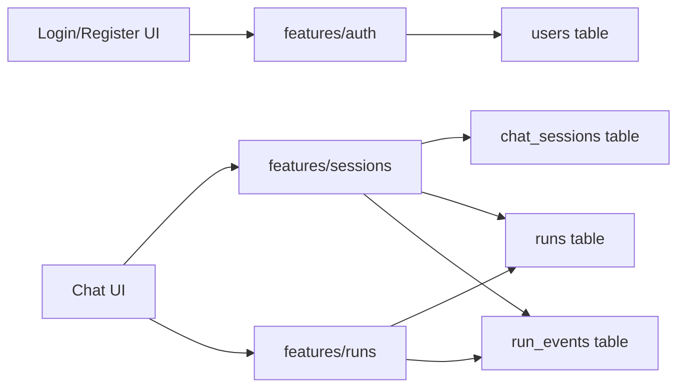

# 账号登录与多会话恢复设计计划

## 目标范围

实现 3 个能力：

- 用户注册：邮箱/用户名 + 密码注册，密码只存 hash。
- 用户登录：返回 Bearer JWT，前端存入 localStorage，并在后续请求中带 `Authorization: Bearer <token>`。
- 会话恢复：用户重新登录后看到自己的会话列表，选择会话后恢复该会话下所有历史对话。
- 会话管理：支持新建会话、删除旧会话；删除采用软删除，默认从列表隐藏但保留历史 Run/Event 数据。

当前 MVP 已有 `runs.userId`、`runs.sessionId`、`runs.input` 和 `run_events.event_data`，因此对话记录不新增 `messages` 表，优先由 `runs + run_events` 还原。

## 现有基础

关键现状：

- [`apps/api/src/shared/db/schema.ts`](apps/api/src/shared/db/schema.ts) 已有 `runs.userId`、`runs.sessionId`、`run_events`。
- [`apps/api/src/features/runs/runs.route.ts`](apps/api/src/features/runs/runs.route.ts) 当前 `POST /runs` 使用 `userId: body.userId ?? 'dev-user'`，需要改为从登录用户上下文读取。
- [`apps/web/src/lib/http.ts`](apps/web/src/lib/http.ts) 目前没有统一注入 Authorization header。
- [`apps/web/src/features/chat/ChatPage.tsx`](apps/web/src/features/chat/ChatPage.tsx) 当前只维护页面内存 `sessionRuns`，刷新或重新登录后不会恢复历史。

## 设计架构



请求链路：

```txt
注册/登录
  -> POST /auth/register 或 POST /auth/login
  -> 返回 accessToken + user
  -> 前端 localStorage 保存 token

进入聊天页
  -> GET /auth/me 校验登录态
  -> GET /sessions 获取会话列表
  -> GET /sessions/:sessionId/runs 获取该会话下历史 Run
  -> 每个 Run 通过 replay/events 恢复时间线

发送新消息
  -> POST /runs，不再传 userId
  -> auth middleware 解析 token 得到 user.id
  -> run.userId = 当前用户 ID
  -> run.sessionId = 当前选中的会话 ID
```

## 后端数据模型

### 1. 新增 `users` 表

位置：[`apps/api/src/shared/db/schema.ts`](apps/api/src/shared/db/schema.ts)

字段建议：

```txt
users
- id varchar(36) primary key
- email varchar(255) unique not null
- username varchar(80) unique nullable
- password_hash varchar(255) not null
- created_at datetime(3) not null
- updated_at datetime(3) not null
```

说明：

- 邮箱作为登录主标识。
- 用户名可选，后续可用于展示。
- 密码 hash 使用 `Bun.password.hash()` 和 `Bun.password.verify()`，不额外引入 bcrypt。

### 2. 新增 `chat_sessions` 表

字段建议：

```txt
chat_sessions
- id varchar(36) primary key
- user_id varchar(36) not null
- title varchar(255) nullable
- deleted_at datetime(3) nullable
- created_at datetime(3) not null
- updated_at datetime(3) not null
```

索引：

```txt
idx_chat_sessions_user_id(user_id)
idx_chat_sessions_updated_at(updated_at)
```

说明：

- 这是“对话会话”，不是登录 session。
- Bearer JWT 是无状态登录态，不新增 `auth_sessions` 表。
- 会话 title 可以默认取第一条用户消息前 20-30 字。
- `deleted_at` 用于软删除。删除会话后不再出现在会话列表中，但保留关联的 `runs`、`run_events`、`artifacts`，方便后续做回收站、审计或误删恢复。

### 3. 复用 `runs` 和 `run_events`

当前已有：

```txt
runs.user_id
runs.session_id
runs.input
runs.output
run_events.run_id
run_events.event_data
```

恢复对话时：

- 用户问题：从 `runs.input.message` 读取。
- AI 回复：从 `run_events` 中拼接该 run 的 `message.delta`，或读取 `runs.output` 作为兜底。
- 时间线：直接使用 `run_events` 原始事件列表。

## 后端 Feature 规划

### 1. `features/auth`

新增目录：

```txt
apps/api/src/features/auth/
├─ auth.route.ts
├─ auth.service.ts
├─ auth.repository.ts
├─ auth.schema.ts
├─ auth.types.ts
└─ index.ts
```

API：

```txt
POST /auth/register
POST /auth/login
GET  /auth/me
```

请求/响应：

```txt
POST /auth/register
body: { email, password, username? }
return: { user, accessToken }

POST /auth/login
body: { email, password }
return: { user, accessToken }

GET /auth/me
header: Authorization: Bearer <token>
return: { user }
```

密码策略 MVP：

- 密码只要求非空；注册时去除前后空白后仍为空则返回 400。
- 邮箱唯一。
- 返回错误不暴露“邮箱存在/密码错误”的过多细节，避免枚举风险。

### 2. JWT 工具与中间件

新增：

```txt
apps/api/src/shared/auth/
├─ jwt.ts
└─ auth.middleware.ts
```

建议引入依赖：

```txt
jose
```

环境变量：

```env
JWT_SECRET=replace-with-a-long-random-secret
JWT_EXPIRES_IN=7d
```

JWT payload：

```ts
{
  sub: userId,
  email: string,
  username?: string
}
```

认证中间件职责：

- 从 `Authorization` 读取 Bearer token。
- 校验签名和过期时间。
- 将用户挂到上下文，例如 `user` 或 `authUser`。
- 未登录返回 401。

### 3. `features/sessions`

新增目录：

```txt
apps/api/src/features/sessions/
├─ sessions.route.ts
├─ sessions.service.ts
├─ sessions.repository.ts
├─ sessions.schema.ts
├─ sessions.types.ts
└─ index.ts
```

API：

```txt
GET    /sessions
POST   /sessions
GET    /sessions/:sessionId
PATCH  /sessions/:sessionId
DELETE /sessions/:sessionId
GET    /sessions/:sessionId/runs
GET    /sessions/:sessionId/transcript
```

推荐最关键的 MVP API：

```txt
GET /sessions
return: { sessions: [{ id, title, updatedAt, runCount }] }

POST /sessions
body: { title? }
return: { session }

DELETE /sessions/:sessionId
return: { success: true, sessionId }

GET /sessions/:sessionId/transcript
return: {
  session,
  runs: [
    {
      run,
      events,
      userMessage,
      assistantText
    }
  ]
}
```

权限要求：

- 所有 `/sessions` API 都必须登录。
- 只能查询当前用户自己的 session。
- `sessionId` 不属于当前用户时返回 404 或 403，推荐 404，减少资源枚举。
- `GET /sessions` 默认只返回 `deleted_at IS NULL` 的会话。
- `DELETE /sessions/:sessionId` 只做软删除：设置 `deleted_at` 和 `updated_at`，不物理删除 `runs`、`run_events`、`artifacts`。
- 被软删除的会话不允许继续创建新 Run；`POST /runs` 携带已删除 `sessionId` 时返回 404 或 409，推荐 404。
- MVP 暂不提供恢复删除会话接口；后续可增加 `POST /sessions/:sessionId/restore`。

### 4. 改造 `features/runs`

文件：[`apps/api/src/features/runs/runs.route.ts`](apps/api/src/features/runs/runs.route.ts)

核心改动：

- `POST /runs` 必须登录。
- 不再信任 `body.userId`。
- `userId` 从 JWT 认证上下文读取。
- `sessionId` 必须属于当前用户。
- 如果 `body.sessionId` 为空，可自动创建一个默认会话。

当前代码：

```ts
userId: body.userId ?? 'dev-user'
```

目标逻辑：

```ts
userId: authUser.id
sessionId: resolvedSession.id
```

同时建议：

- `GET /runs` 改为只返回当前用户的 runs。
- `GET /runs/:runId`、`/steps`、`/events`、`/artifacts` 校验 run 所属用户。
- `events?replay=true` 也要鉴权，避免拿到别人的事件流。

## 前端规划

### 1. 请求封装改造

文件：[`apps/web/src/lib/http.ts`](apps/web/src/lib/http.ts)

新增能力：

- `getToken()` / `setToken()` / `clearToken()`。
- `post/get` 自动带：

```txt
Authorization: Bearer <token>
```

- 401 时清理 token，并引导回登录页。

### 2. 新增认证模块

```txt
apps/web/src/features/auth/
├─ AuthPage.tsx
├─ auth.api.ts
├─ auth.store.tsx 或 useAuth.ts
└─ auth.types.ts
```

UI：

- 登录表单。
- 注册表单。
- 当前用户展示。
- 退出登录按钮。

MVP 可以不引入路由库，直接在 `App.tsx` 根据 auth 状态切换：

```txt
未登录 -> AuthPage
已登录 -> ChatPage
```

### 3. 新增会话模块

```txt
apps/web/src/features/sessions/
├─ SessionSidebar.tsx
├─ sessions.api.ts
├─ useSessions.ts
└─ sessions.types.ts
```

页面行为：

- 登录成功后加载 `GET /sessions`。
- 左侧显示会话列表。
- 点击“新建会话”调用 `POST /sessions`，创建空会话并切换为当前会话。
- 点击“删除会话”调用 `DELETE /sessions/:id`，成功后从列表移除。
- 删除当前会话后，自动切换到剩余最近会话；如果没有剩余会话，则创建一个新会话或进入空状态。
- 点击会话后调用 `GET /sessions/:id/transcript`。
- 把 transcript 转换为当前 `RunMessageItem` 所需数据。
- 新建会话后，后续 `POST /runs` 带上该 `sessionId`。

### 4. 改造 `ChatPage`

文件：[`apps/web/src/features/chat/ChatPage.tsx`](apps/web/src/features/chat/ChatPage.tsx)

当前只有内存状态：

```ts
const [sessionRuns, setSessionRuns] = useState<{ runId: string; userMessage: string }[]>([])
```

目标：

- 增加 `currentSessionId`。
- 页面初始化加载会话列表。
- 支持手动新建会话，清空当前 `sessionRuns` 并设置新的 `currentSessionId`。
- 支持删除旧会话，删除时需要二次确认；删除当前会话后重置当前聊天视图。
- 选择会话后加载历史 transcript。
- 发送新消息时传：

```ts
post('/runs', {
  input: { message },
  agentId: 'supervisor-agent',
  sessionId: currentSessionId,
})
```

- `userId` 不再由前端传。

## 共享类型规划

在 [`packages/shared/src/models`](packages/shared/src/models) 增加：

```txt
user.ts
session.ts
```

导出类型：

```ts
User
PublicUser
ChatSession
SessionTranscript
TranscriptRun
```

API 响应类型建议也放到 shared，避免前后端漂移。

## 数据恢复策略

`GET /sessions/:sessionId/transcript` 推荐在后端一次性聚合：

```txt
1. 校验 session 属于当前用户
2. 查询该 session 下 runs，按 createdAt 升序
3. 对每个 run 查询 events
4. userMessage = run.input.message
5. assistantText = events.filter(message.delta).join('')
6. 返回 runs + events + assistantText
```

这样前端恢复历史时不需要对每个 run 再单独请求一次 `events?replay=true`，减少请求数量。

## 数据库初始化与迁移

当前项目有两套入口：

- Drizzle schema：[`apps/api/src/shared/db/schema.ts`](apps/api/src/shared/db/schema.ts)
- 开发初始化脚本：`apps/api/scripts/db-init.ts`

执行计划：

- 更新 Drizzle schema，新增 `users`、`chat_sessions`。
- 更新 `Schema` 类型导出。
- 更新 `db-init.ts` DDL，确保本地开发可一键创建新表。
- 可选执行 `drizzle-kit generate` 生成迁移。
- 当前 Docker MySQL 已有库，需要补建新表。

## 依赖与环境变量

后端新增依赖：

```txt
jose
```

使用 `Bun.password` 完成密码 hash，不新增 bcrypt 依赖。

新增环境变量：

```env
JWT_SECRET=replace-with-a-long-random-secret
JWT_EXPIRES_IN=7d
```

## 测试计划

后端集成测试：

```txt
apps/api/tests/integration/auth.integration.test.ts
apps/api/tests/integration/sessions.integration.test.ts
```

覆盖：

- 注册成功。
- 空密码注册失败。
- 重复邮箱注册失败。
- 登录成功返回 token。
- 错误密码登录失败。
- 未带 token 访问 `/sessions` 和 `/runs` 返回 401。
- 登录后创建 session、创建 run。
- 用户可以新建多个会话，并在会话列表中看到按更新时间排序的结果。
- 用户可以删除自己的旧会话，删除后 `GET /sessions` 不再返回该会话。
- 删除会话后，关联的 `runs` 和 `run_events` 仍保留，但普通会话列表和 transcript 接口不可访问该 deleted session。
- 重新登录后能查到历史 session 和 transcript。
- 用户 A 不能读取用户 B 的 session/run/events。

前端手测路径：

```txt
注册 -> 登录 -> 新建会话 -> 发送消息 -> 刷新页面 -> 自动恢复登录态 -> 会话列表仍存在 -> 点会话恢复历史对话
```

## 分阶段执行

### 阶段 1：后端认证基础

- 增加 `users` 表和相关 schema/DDL。
- 增加 `JWT_SECRET`、`JWT_EXPIRES_IN` 环境变量。
- 增加 `features/auth`。
- 增加 JWT 工具和认证中间件。

### 阶段 2：会话表和会话 API

- 增加 `chat_sessions` 表和 repository/service/route。
- 实现 `/sessions`、`POST /sessions`、`DELETE /sessions/:id`、`/sessions/:id/transcript`。
- 删除会话采用软删除，列表和 transcript 默认过滤已删除会话。
- 实现用户资源隔离。

### 阶段 3：Runs 鉴权改造

- `POST /runs` 从 token 获取 `userId`。
- `sessionId` 校验归属或自动创建。
- `GET /runs`、`GET /runs/:id/events`、steps、artifacts 加用户归属校验。

### 阶段 4：前端登录注册

- 改造 `lib/http.ts` 自动带 Bearer token。
- 新增 Auth 页面和 auth 状态管理。
- `App.tsx` 未登录显示登录/注册，已登录显示聊天。

### 阶段 5：前端多会话恢复

- 新增会话侧边栏。
- 登录后加载会话列表。
- 支持新建会话按钮，创建后立即切换。
- 支持删除会话按钮，二次确认后移除列表并重置当前会话。
- 选择会话加载 transcript。
- 发送消息绑定当前 `sessionId`。
- 刷新后恢复 token、用户信息和会话列表。

### 阶段 6：测试与收尾

- 增加 auth/session 集成测试。
- 手动验证跨用户隔离。
- 检查终端日志中不输出密码、token。
- 更新 README 或设计文档。

## 风险与注意点

- Bearer token 存 localStorage 有 XSS 风险，MVP 可接受；生产建议改 HttpOnly Cookie 或引入 refresh token 机制。
- 当前 `runs.input` 是 JSON，需要约定 `input.message` 始终存在；否则历史恢复时需要兜底展示。
- `message.delta` 可能很多，transcript 聚合时要注意性能；MVP 可以按 session 限制最近 N 条 run，后续再分页。
- 会话删除使用软删除会让历史数据继续占用存储；后续如果需要彻底清理，应单独设计后台清理任务或硬删除接口。
- 当前 `GET /runs/:runId/events` 如果不加鉴权，会泄漏历史事件，必须纳入本次改造。
- 如果 `JWT_SECRET` 为空，应在启动时直接报错或开发环境警告，避免签发不安全 token。