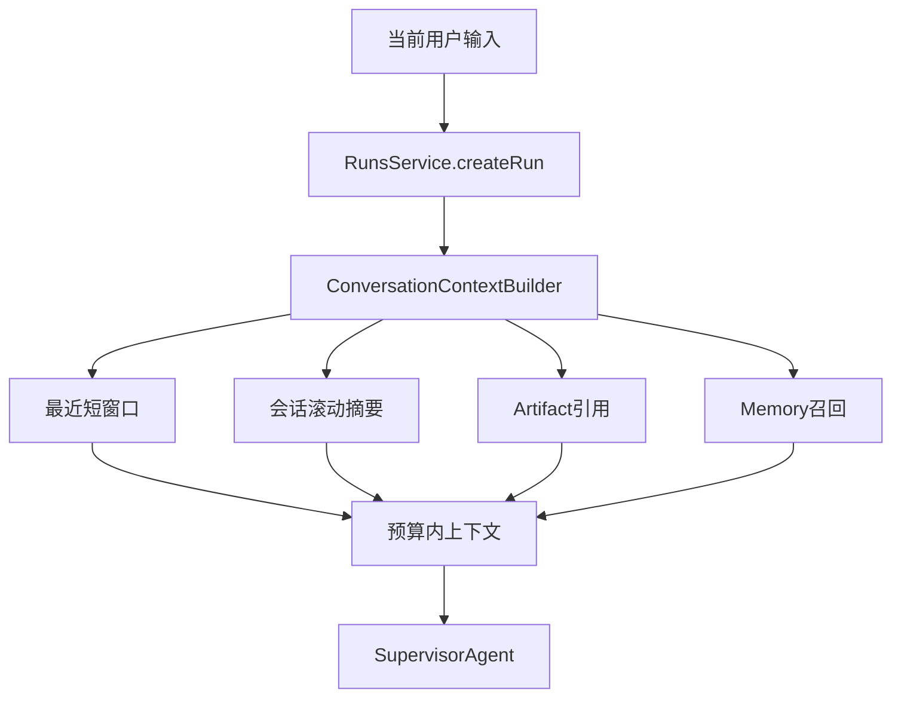

# 高效会话上下文方案

## 核心策略

不要让前端传完整历史，也不要在后端直接把 `SessionTranscript` 全量拼进 prompt。新增一个后端 `ConversationContextBuilder`，在创建 Run 时根据 `sessionId` 构建“预算内上下文”。

上下文分 4 层，按优先级进入 prompt：

1. 当前用户输入：必须保留完整内容。
2. 最近短窗口：最近 3-5 轮用户/助手最终回答，保留原文但做长度限制。
3. 旧历史摘要：超过短窗口的历史只保留滚动摘要，不保留逐字原文。
4. 大内容引用：Artifact、工具输出、中间日志、长模型输出不直接进入 prompt，只放标题、类型、摘要和 `artifactId/runId` 引用。

## 具体落点

- 在 `[apps/api/src/features/runs/runs.service.ts](apps/api/src/features/runs/runs.service.ts)` 中，`resolveSessionId()` 后调用上下文构建器，再传给 `RunManager.createRun()`。
- 在 `[apps/api/src/runtime/run-manager.ts](apps/api/src/runtime/run-manager.ts)` 扩展 `CreateRunOptions` / `AgentInput`，加入 `conversationContext`，同时把 `sessionId` 放入 `RunContext`，便于 Memory 召回。
- 在 `[apps/api/src/ai/agents/supervisor.agent.ts](apps/api/src/ai/agents/supervisor.agent.ts)` 中使用 `input.conversationContext` 组装 prompt，并把 memory 召回从 `input.payload.sessionId` 改为 `input.sessionId` 或 `context.sessionId`。
- 新建 `[apps/api/src/features/sessions/conversation-context.builder.ts](apps/api/src/features/sessions/conversation-context.builder.ts)`，专门负责按预算读取历史。
- 可选新增 `chat_session_summaries` 表，存每个 session 的滚动摘要；如果先做 MVP，也可以在 `chat_sessions.metadata` 或 Memory 的 `session/summary` kind 中保存。

## 上下文预算规则

建议先用字符预算实现，后续再接 tokenizer：

- 总上下文预算：例如 6000-10000 字符。
- 当前输入：不截断，除非超过全局最大输入限制。
- 最近窗口：最多 5 轮，每轮用户输入最多 1000 字，助手回答最多 1500 字。
- 旧历史摘要：最多 2000 字。
- Artifact 引用：每个只保留 `title/type/artifactId/summary`，最多 10 条。
- `message.delta`、tool raw output、run event 原始 JSON 默认不进入 prompt。

## 大内容处理

大内容分三种处理：

- 助手最终回答很长：只把前后关键片段加摘要放入上下文，完整内容继续存在 Run output / events / Artifact 中。
- Artifact 很大：不加载正文，只加载 `artifactId`、标题、类型、版本和摘要；只有用户明确说“基于某个 artifact 内容继续”时再按需读取。
- 工具/中间输出很大：默认只写入 Artifact 或 Step output，不进入聊天历史 prompt；必要时由 Agent 显式检索。

## 摘要更新机制

每个 Run 结束后异步更新 session 摘要：

- 输入：上一版 session summary + 本轮用户问题 + 本轮最终回答摘要。
- 输出：新的 `session.summary`，控制在 1500-2000 字。
- 失败时不阻塞主流程，只记录 warning。

这样第 100 轮对话也不会把前 99 轮原文全部塞进模型。

## 验收标准

- 同一会话中输入“再写一封”“继续”“总结上面内容”时，模型能理解前文。
- 大型 artifact 或长回答不会被全量拼进 prompt。
- 新 Run 的 prompt 中能看到最近几轮原文和旧历史摘要。
- API `bun run tsc-check`、`bun run lint` 通过。
- 不改变前端请求结构，前端仍只传当前 `message` 和 `sessionId`。