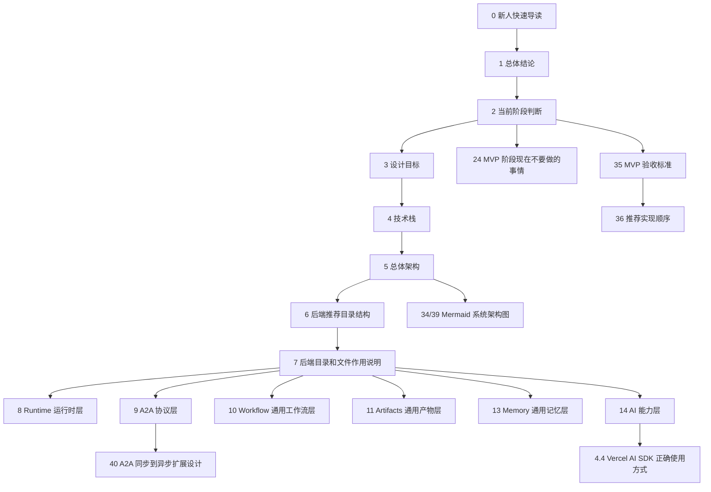
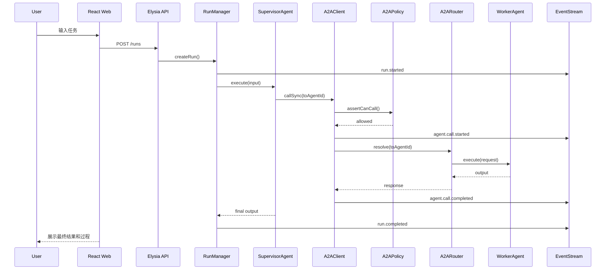
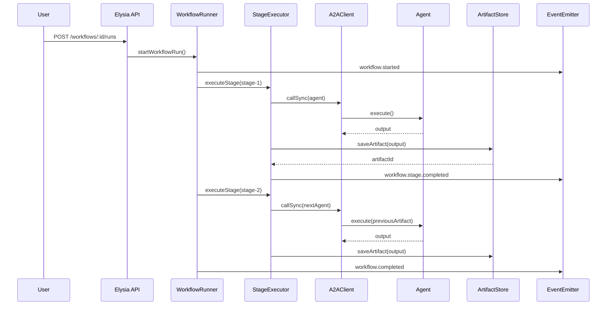
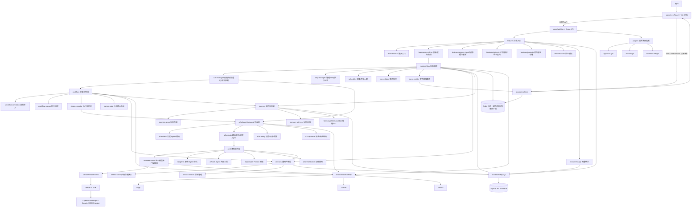
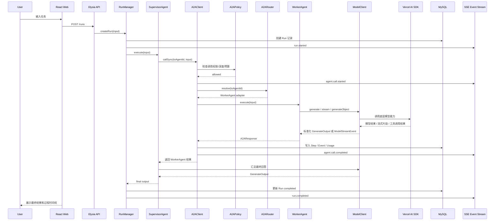
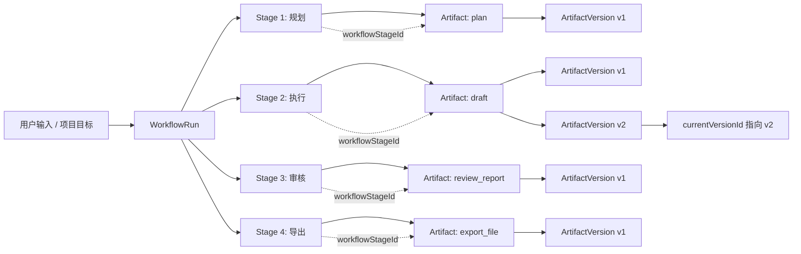
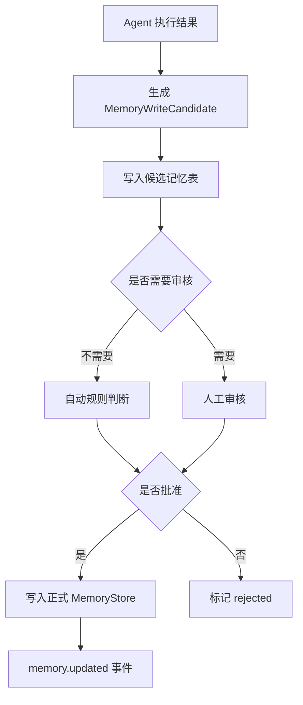
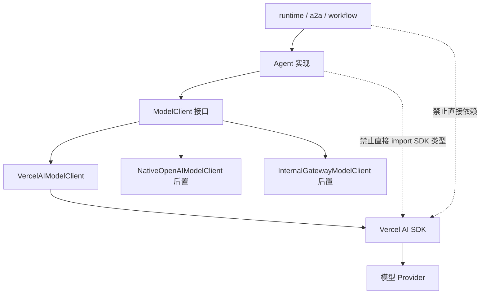
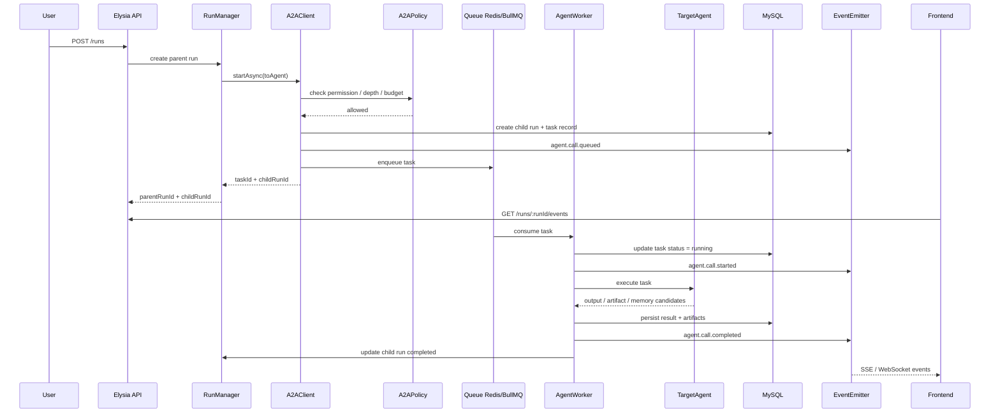
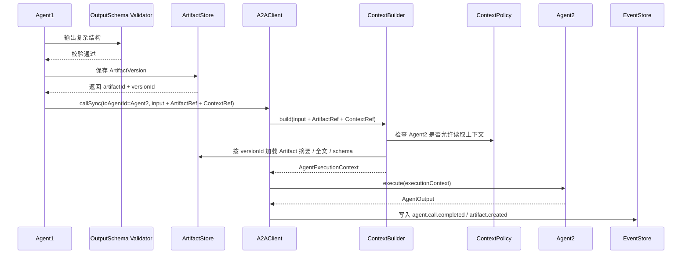

# Agent Frame 框架设计（A2A + Workflow + Artifact 可扩展版）

> 当前定位：面向 MVP 阶段的通用 Agent 后端框架。  
> 默认技术栈：**TypeScript + Bun + Elysia + Vercel AI SDK + React + Vite**。  
> 核心目标：先支持 A2A 双 Agent / 多 Agent 调用 MVP，同时为未来扩展到小说创作、短剧制作、短视频生产、数据分析、自动办公等复杂链路预留通用能力。  
> 重要原则：**现在不做复杂具体业务，但框架边界必须方便未来扩展。**

---

## 0. 新人快速导读：15 分钟理解本框架

本节不是新增功能，而是给第一次接触本项目的人提供阅读路径。建议新人先阅读本节，再按需进入后面的详细设计章节。

### 0.1 一句话理解本框架

本框架是一套面向 MVP 阶段的通用 Agent 后端框架：

```txt
用户请求
  -> Run 可追踪执行
  -> Agent 执行任务
  -> A2A 调用其他 Agent
  -> Tool 完成确定性能力
  -> Event 实时输出执行过程
  -> Artifact 沉淀结构化产物
  -> Workflow 预留长链路编排能力
  -> Memory 预留长期上下文能力
```

核心原则是：

```txt
现在只做通用 Agent Framework，暂时不做小说、短剧、短视频等具体复杂业务。
未来这些业务通过 Plugin、Feature Module 或 Workflow Template 接入。
```

### 0.2 新人推荐阅读顺序

| 阅读目标 | 建议先看章节 | 目的 |
|---|---|---|
| 快速知道框架是什么 | `0.1 一句话理解本框架`、`1. 总体结论` | 建立整体认知 |
| 理解当前要做什么 | `0.5 当前 MVP 目标与非目标`、`24. MVP 阶段现在不要做的事情` | 避免过度设计 |
| 理解一次请求怎么执行 | `0.4 核心流程总览`、`19. MVP 推荐执行链路` | 串起前后端和 Agent 执行链路 |
| 理解模块职责 | `0.6 模块职责边界表`、`7. 后端目录和文件作用说明` | 知道代码应该放哪里 |
| 新增一个 Agent | `0.8 新人开发第一个 Agent 的路径`、`9. a2a/ Agent-to-Agent 协议层`、`14. ai/ AI 能力层` | 快速落地第一个能力 |
| 理解 A2A | `9. a2a/ Agent-to-Agent 协议层`、`40. A2A 同步到异步扩展设计` | 区分 Agent Calling 和 Tool Calling |
| 理解 Vercel AI SDK | `4.4 Vercel AI SDK 正确使用方式与边界` | 防止 SDK 污染核心框架 |
| 理解数据如何沉淀 | `11. artifacts/ 通用产物层`、`20. 数据模型建议` | 明确 Run、Artifact、Version 的关系 |
| 理解未来扩展 | `10. workflow/ 通用工作流层`、`12. plugins/ 插件注册层`、`26. 演进路线` | 知道未来如何接入复杂业务 |

### 0.3 核心概念地图

| 概念 | 一句话解释 | 新人理解重点 |
|---|---|---|
| `Project` | 长期项目容器 | 未来一部小说、一个短剧系列、一个自动化任务都可以是 Project；当前可轻实现或后置 |
| `Session` | 用户会话容器 | 管理聊天上下文和多次 Run 的归属，不等于一次执行 |
| `Run` | 一次 Agent 执行实例 | 所有执行都围绕 `runId` 追踪、查询、取消和展示 |
| `Step` | Run 内部的一个执行步骤 | 用来定位执行过程、失败点、模型调用、工具调用和 A2A 调用 |
| `Agent` | 具备任务能力的执行单元 | 可以调用模型、工具，也可以通过 A2A 调用其他 Agent |
| `Tool` | Agent 内部调用的确定性能力 | 例如查询数据库、搜索、文件处理；Tool 不等于 Agent |
| `A2A Call` | Agent 调用 Agent 的协议 | 负责 `fromAgentId -> toAgentId` 的调用、权限、事件和追踪 |
| `Workflow` | 多阶段任务编排抽象 | 当前只预留轻量状态机，未来承载长链路任务 |
| `Stage` | Workflow 内的一个阶段 | 每个阶段可以由 Agent 或人工节点执行，并产出 Artifact |
| `Artifact` | Agent 或 Workflow 产出的结构化结果 | 不要把所有结果都塞进聊天消息，结构化结果应该沉淀为 Artifact |
| `ArtifactVersion` | Artifact 的版本 | 支持重生成、修改、回滚和审计 |
| `Memory` | 长期上下文或项目知识 | 不等于聊天记录；写入需要策略和审核，避免脏记忆 |
| `AgentEvent` | 前后端共享的执行事件协议 | RunTimeline、日志和调试都依赖统一事件 |
| `Policy` | 权限、预算、风险、深度控制 | 防止 Agent 越权调用、无限循环和成本失控 |
| `Plugin` | 未来业务扩展入口 | 小说、短剧、短视频等未来通过插件或业务模块接入 |
| `ModelClient` | 模型调用隔离层 | Vercel AI SDK 只能作为底层实现，不能污染 Runtime、A2A、Workflow 等核心层 |

### 0.4 核心流程总览

#### 0.4.1 普通聊天 / 单 Agent 执行流程

```txt
用户输入
  -> apps/web/features/chat 或 runs
  -> POST /runs
  -> features/runs/runs.route.ts
  -> features/runs/runs.service.ts
  -> runtime/run-manager.ts
  -> ai/agents/chat.agent.ts
  -> ai/model-client/ModelClient
  -> Vercel AI SDK 底层实现
  -> runtime/event-emitter.ts
  -> SSE / WebSocket
  -> 前端 MessageList / RunTimeline
```

#### 0.4.2 A2A 同步调用流程

```txt
Supervisor Agent
  -> A2AClient.callSync()
  -> A2APolicy 检查调用权限、深度、预算和超时
  -> A2ARouter 定位目标 Agent
  -> TargetAgent.execute()
  -> TargetAgent 内部通过 ModelClient 或 Tool 完成任务
  -> A2AResponse 返回结果
  -> EventEmitter 发出 agent.call.completed
  -> Supervisor 汇总最终答案
```

#### 0.4.3 A2A 异步调用流程

```txt
Supervisor Agent
  -> A2AClient.startAsync()
  -> 创建 taskId / childRunId
  -> 发出 agent.call.queued
  -> Queue / Worker 后续执行
  -> Worker 执行 TargetAgent
  -> 持续发出 progress / completed / failed 事件
  -> 前端通过 runId 或 childRunId 订阅进度
```

#### 0.4.4 Workflow 到 Artifact 的产物流程

```txt
WorkflowRunner
  -> StageExecutor
  -> 执行 Agent 或人工阶段
  -> 生成 ArtifactVersion
  -> 更新 Artifact.currentVersionId
  -> 发出 artifact.created / artifact.updated
  -> 后续 Stage 可引用该 Artifact
```

#### 0.4.5 Memory 安全写入流程

```txt
Agent 输出候选记忆
  -> MemoryPolicy 判断是否允许写入
  -> 可选人工审核或规则过滤
  -> MemoryStore 提交长期记忆
  -> 后续 Run / Workflow 可召回
```

### 0.5 当前 MVP 目标与非目标

#### 0.5.1 当前 MVP 要做

| 能力 | 为什么要做 |
|---|---|
| `Run` 生命周期 | 让一次 Agent 执行可创建、可查询、可取消、可追踪 |
| `Step` 记录 | 让模型调用、工具调用、A2A 调用都能定位到具体步骤 |
| `A2A` 同步调用 | 先验证调度 Agent 调用专业 Agent 的最小闭环 |
| `AgentCapability` | 让 Agent 能声明能力、输入输出和支持模式 |
| `ModelClient` 隔离层 | 防止 Vercel AI SDK 类型污染核心框架 |
| `AgentEvent + SSE` | 前端可以实时展示 Agent 执行过程 |
| `Artifact` 基础结构 | 让 Agent 输出可以沉淀为结构化产物 |
| `MySQL RunStore` | 让核心状态和事件具备基础持久化能力 |
| 基础 `Policy` | 控制调用白名单、最大深度、超时和预算 |

#### 0.5.2 当前 MVP 不做

| 暂时不做 | 原因 |
|---|---|
| 复杂 Workflow Engine | 当前只需要轻量接口和状态机预留 |
| Temporal | MVP 阶段太重，后续长任务和强恢复再评估 |
| 插件市场 | 当前只需要内部 PluginRegistry |
| 完整小说 / 短剧 / 短视频链路 | 这是未来业务插件，不应污染框架核心 |
| 复杂媒体资产库 | 当前只定义 Artifact 抽象和基础版本能力 |
| 多租户权限系统 | 当前先做用户级权限和 Agent 调用策略 |
| 复杂 Memory 自动写入 | 先做候选记忆和策略控制，避免脏记忆 |
| 大规模异步 Worker 集群 | 当前只预留接口，后续按业务复杂度引入 |

### 0.6 模块职责边界表

| 模块 | 负责什么 | 不负责什么 | 新人常见误区 |
|---|---|---|---|
| `features/` | HTTP API 入口、请求校验、调用应用服务 | 不写底层执行循环 | 不要把 Agent Runtime 写进 route |
| `runtime/` | Run/Step 生命周期、取消、超时、事件、调度 | 不直接依赖 Vercel AI SDK | 不要让 runtime 直接调用模型 SDK |
| `ai/` | Agent、Tool、Prompt、ModelClient、模型适配 | 不管理 Run 状态持久化 | 不要把 A2A 协议写进 agent 文件 |
| `a2a/` | Agent 调 Agent 的协议、路由、策略和事件 | 不等同于 Tool Calling | 不要把 Agent 简单伪装成 tool |
| `workflow/` | 多阶段任务组织、Stage 调度、人工节点预留 | 不负责模型调用细节 | 不要一开始就做复杂 DAG 或 Temporal |
| `artifacts/` | 产物、版本、产物状态和查询 | 不负责 Agent 执行 | 不要把结构化产物只存在 message 里 |
| `memory/` | 长期上下文、项目记忆、候选记忆和召回 | 不等于聊天记录 | 不要自动写入所有模型输出 |
| `plugins/` | 未来业务能力注册入口 | 不做插件市场和动态安装 | 不要在 MVP 过度插件化 |
| `policy/` | 调用权限、风险、预算、深度、审批规则 | 不执行具体 Agent 逻辑 | 不要把权限判断散落在各个 Agent 里 |
| `shared/` | 前后端共享类型、事件、schema、常量 | 不放业务实现 | 不要前后端各定义一套事件结构 |
| `shared/db` | MySQL 客户端、schema、migration | 不放业务 service | 不要在 route 里直接拼 SQL |
| `shared/observability` | 日志、指标、trace 上报 | 不决定业务流程 | 不要只打普通 console.log，必须带关键 ID |

### 0.7 关键 ID 贯穿说明

| ID | 所属对象 | 用途 | 必须贯穿的位置 |
|---|---|---|---|
| `traceId` | 一次端到端请求 | 贯穿日志、模型调用、A2A、事件和错误定位 | HTTP 请求、Run、Step、ModelCall、ToolCall、A2A |
| `runId` | 一次 Agent 执行 | 前端订阅、后端查询、取消和审计的主键 | RunStore、AgentEvent、Artifact、日志 |
| `stepId` | Run 内部步骤 | 定位具体模型调用、工具调用、A2A 调用 | StepStore、Event、Error、Trace |
| `agentId` | Agent 定义 | 标识执行者 | Run、Step、Event、Capability |
| `fromAgentId` | A2A 调用方 | 审计 Agent 调用关系 | A2ARequest、A2AEvent、Policy |
| `toAgentId` | A2A 被调用方 | 路由到目标 Agent | A2ARequest、A2ARouter、Policy |
| `workflowRunId` | Workflow 实例 | 关联多阶段任务 | WorkflowStore、Artifact、Event |
| `workflowStageId` | Workflow 阶段 | 标识产物属于哪个阶段 | StageExecutor、Artifact、Event |
| `artifactId` | 产物 | 管理产物生命周期 | ArtifactStore、ArtifactVersion、Event |
| `artifactVersionId` | 产物版本 | 支持重生成、回滚和审计 | ArtifactVersionStore、Artifact.currentVersionId |
| `taskId` | 异步任务 | 队列和 Worker 追踪 | AgentTask、Queue、Worker、A2AResponse |

### 0.8 新人开发第一个 Agent 的路径

假设要新增一个 `weather-agent`，推荐按以下步骤开发：

| 步骤 | 文件 / 模块 | 作用 |
|---:|---|---|
| 1 | `packages/shared/src/types/agent.ts` | 定义或复用 `AgentCapability`，声明 Agent 的能力、输入输出和支持模式 |
| 2 | `apps/api/src/ai/agents/weather.agent.ts` | 实现 `WeatherAgent.execute()`，内部可以调用 ModelClient 或 Tool |
| 3 | `apps/api/src/ai/tools/weather.tool.ts` | 如果需要外部天气 API，把它作为 Tool 封装 |
| 4 | `apps/api/src/ai/agents/index.ts` | 导出新 Agent，方便注册 |
| 5 | `apps/api/src/a2a/a2a-router.ts` | 注册 `weather-agent`，让其他 Agent 可以通过 A2A 调用它 |
| 6 | `apps/api/src/a2a/a2a-policy.ts` | 配置哪些 Agent 可以调用 `weather-agent` |
| 7 | `apps/api/src/features/agents/agents.route.ts` | 如需要，在 API 中暴露 Agent 列表和能力描述 |
| 8 | `apps/api/src/features/runs/runs.service.ts` | 通过 Run 入口触发 Supervisor Agent |
| 9 | `apps/web/src/features/runs/RunTimeline.tsx` | 查看 `agent.call.started / completed` 等事件是否正确展示 |
| 10 | `tests/integration` | 补充 A2A 调用和 Run 事件集成测试 |

### 0.9 从请求到数据落库的端到端示例

示例需求：

```txt
用户输入：帮我规划一次北京出差，查天气并给出建议。
```

推荐执行过程：

1. 前端调用 `POST /runs`，传入用户输入。
2. `features/runs/runs.route.ts` 校验请求。
3. `features/runs/runs.service.ts` 调用 `run-manager.createRun()`。
4. `runtime/run-manager.ts` 创建 `Run`，生成 `runId` 和 `traceId`。
5. `runtime/event-emitter.ts` 发出 `run.started`。
6. `SupervisorAgent` 解析任务，决定调用 `weather-agent`。
7. `A2AClient.callSync()` 创建 A2A 调用。
8. `A2APolicy` 检查调用白名单、深度和超时。
9. `A2ARouter` 定位 `WeatherAgent`。
10. `WeatherAgent` 内部调用 `weather.tool` 或 `ModelClient`。
11. 工具调用发出 `tool.call` 和 `tool.result`。
12. A2A 完成后发出 `agent.call.completed`。
13. `SupervisorAgent` 汇总最终答案。
14. `RunStore` 更新 Run 输出和状态。
15. 如有结构化结果，写入 `Artifact` 和 `ArtifactVersion`。
16. 前端通过 SSE 接收事件，在 `RunTimeline` 展示全过程。

### 0.10 MVP 实现顺序 Checklist

| 顺序 | 任务 | 验收标准 |
|---:|---|---|
| 1 | 初始化 Monorepo | `apps/web`、`apps/api`、`packages/shared` 可启动 |
| 2 | 建立 shared event types | 前后端引用同一份 `AgentEvent` 类型 |
| 3 | 实现 `POST /runs` | 能创建 `runId`，并返回基础 Run 状态 |
| 4 | 实现 SSE | 前端能收到 `run.started` 和 `message.delta` |
| 5 | 实现 `ModelClient` | Agent 不直接依赖 Vercel AI SDK 类型 |
| 6 | 实现一个 `ChatAgent` | 能通过模型流式回答 |
| 7 | 实现 A2A 同步调用 | Supervisor 能调用一个专业 Agent |
| 8 | 实现 `RunTimeline` | 前端能展示 AgentEvent 时间线 |
| 9 | 实现 MySQL RunStore | Run、Step、Event 可落库和查询 |
| 10 | 实现基础 Policy | 最大深度、超时、调用白名单生效 |
| 11 | 实现 Artifact 基础写入 | Agent 输出可沉淀为 ArtifactVersion |
| 12 | 补充集成测试 | 覆盖 Run 创建、SSE、A2A、ModelClient、Artifact 写入 |

### 0.11 常见误区清单

| 误区 | 正确做法 |
|---|---|
| 在 route 里直接调用模型 | route 只做入口，模型调用应经过 service -> runtime -> agent -> ModelClient |
| Agent 之间直接 import 调用 | Agent 间调用统一走 `A2AClient`，便于权限、事件和追踪 |
| 把 Agent 当成 Tool | Tool 是确定性能力，Agent 是可执行任务单元，二者边界不同 |
| 直接使用 Vercel AI SDK 类型作为业务类型 | 统一通过 `ModelClient` 隔离 SDK，核心框架使用自定义类型 |
| 所有输出都放进 message | 聊天内容放 message，结构化结果放 Artifact |
| Memory 自动写入所有模型输出 | Memory 写入必须通过 MemoryPolicy 和候选记忆流程 |
| 前端自己拼事件类型 | 前端必须使用 `packages/shared` 的 `AgentEvent` 类型 |
| 一开始上复杂 Workflow | MVP 先实现轻量状态机和接口预留 |
| A2A 异步一开始就上 Worker 集群 | 当前先定义协议和状态表，等业务需要再实现队列和 Worker |
| 只打普通日志 | 日志必须带 `traceId`、`runId`、`stepId`、`agentId` 等关键 ID |

### 0.12 文档章节关系图



### 0.13 Glossary 术语表

| 术语 | 说明 |
|---|---|
| Agent Runtime | 受控的 Agent 执行引擎，负责 Run、Step、事件、取消、超时和执行状态管理 |
| A2A | Agent-to-Agent，表示一个 Agent 通过标准协议调用另一个 Agent |
| Tool Calling | 模型或 Agent 调用确定性工具的能力，不等于 A2A |
| Supervisor Agent | 调度型 Agent，负责拆解任务并调用其他专业 Agent |
| Specialist Agent | 专业 Agent，例如天气 Agent、检索 Agent、写作 Agent、审核 Agent |
| RunTimeline | 前端展示 Agent 执行事件的时间线组件 |
| SSE | Server-Sent Events，适合单向实时事件推送 |
| WebSocket | 双向实时通信协议，适合多 run、多房间和双向控制场景 |
| ModelClient | 框架自定义的模型调用接口，用于隔离 Vercel AI SDK 或其他模型 SDK |
| Artifact | Agent 或 Workflow 的结构化产物，例如大纲、脚本、报告、代码、分镜等 |
| ArtifactVersion | Artifact 的版本记录，用于支持重生成、回滚和审计 |
| Policy Engine | 控制调用权限、风险、预算、深度和审批规则的模块 |
| MemoryPolicy | 判断哪些信息可以写入长期记忆、是否需要审核的策略 |
| Workflow Stage | Workflow 中的一个执行阶段，可以由 Agent、Tool 或人工节点完成 |
| Child Run | 异步 A2A 或子任务执行时，由父 Run 派生出的子 Run |
| TaskId | 异步任务在队列或 Worker 系统中的追踪 ID |

---

## 1. 总体结论

当前框架不应该直接做“小说系统”“短剧系统”“视频生产系统”等具体业务模块，而应该先建设一套通用 Agent Framework。

核心框架只理解这些通用概念：

```txt
Run
Step
Agent
Tool
A2A Call
Workflow
Stage
Artifact
Memory
Event
Policy
Plugin
```

核心框架暂时不直接理解这些业务概念：

```txt
小说
章节
短剧
分镜
配音
视频
剪辑
发布
```

这些业务概念未来应该通过插件、业务 feature 或 workflow template 接入，而不是污染底层 runtime。

---

## 2. 当前阶段判断

当前适合处于 **MVP 阶段**。

MVP 阶段重点是验证：

1. 一个用户请求能创建一次可追踪的 `Run`。
2. 调度 Agent 能通过 A2A 调用专业 Agent。
3. Agent 调用过程能通过统一事件流展示。
4. Agent 输出不只作为聊天消息，还可以沉淀为 `Artifact`。
5. 未来复杂链路可以通过轻量 `Workflow` 扩展。
6. 未来不同业务可以通过 `Plugin` 注册 Agent、Tool、Workflow 和 Artifact 类型。

MVP 阶段不追求复杂生产级工作流，不追求完整媒体生产链路，不追求插件市场，不追求多租户平台化。

---

## 3. 设计目标

### 3.1 当前 MVP 目标

当前 MVP 主要支持：

```txt
用户
  -> Run
  -> 调度 Agent
  -> A2A 调用专业 Agent
  -> 统一 AgentEvent 实时输出
  -> 生成最终结果
  -> 可选沉淀 Artifact
```

典型例子：

```txt
用户提出任务
  -> Supervisor Agent 分析任务
  -> 调用 Weather Agent / Flight Agent / Research Agent 等专业 Agent
  -> 汇总结果
  -> 返回用户
```

### 3.2 未来扩展目标

未来可以扩展为：

```txt
创作项目
  -> Workflow
  -> 多阶段 Stage
  -> 多 Agent 协作
  -> Artifact 产物沉淀
  -> Artifact Version 版本管理
  -> Human Review 人工审核
  -> 异步 Task 长任务
  -> 导出 / 发布 / 集成外部工具
```

例如未来小说或短剧链路可以作为插件接入：

```txt
Creative Plugin
  -> Idea Stage
  -> Worldbuilding Stage
  -> Character Stage
  -> Outline Stage
  -> Script Stage
  -> Storyboard Stage
  -> Review Stage
  -> Export Stage
```

但这些业务链路现在不实现，只保留框架扩展点。

---

## 4. 技术栈

### 4.1 后端

| 技术 | 作用 |
|---|---|
| Bun | TypeScript Runtime、包管理、脚本执行 |
| Elysia | HTTP API、路由、中间件、类型友好接口层 |
| Vercel AI SDK | 模型调用、流式输出、工具调用能力封装 |
| TypeScript | 全项目类型约束 |
| MySQL | 未来持久化 Run、Artifact、Project、Usage 等核心数据；MVP 建议 MySQL 8.x，优先使用 InnoDB、JSON 字段和事务 |
| Redis | 后续用于事件广播、短期状态、队列、分布式锁 |

### 4.2 前端

| 技术 | 作用 |
|---|---|
| React | 用户界面层 |
| TypeScript | 前端类型约束 |
| Vite | 前端开发、构建和热更新 |
| SSE | MVP 阶段优先用于单 Run 事件流 |
| WebSocket | 后续多 Run 订阅、双向控制时再引入 |

### 4.3 默认技术栈边界

Bun + Elysia 适合：

- API 层
- Agent Run 控制
- A2A 本地调用
- SSE 事件输出
- 轻量 Workflow Runner
- Project / Artifact / Agent CRUD

需要谨慎或后置的部分：

- 视频生成 Worker
- FFmpeg 处理
- 浏览器自动化
- 大文件转码
- 长时间后台任务
- 复杂工作流恢复
- 高并发多实例调度

这些后续可以拆到独立 Worker、Node.js Runtime、独立容器或 Temporal 等系统中。


### 4.4 Vercel AI SDK 正确使用方式与边界

> 本节是框架级约束，优先级高于具体 Agent、Tool、Workflow 的实现细节。核心原则是：**Vercel AI SDK 只作为 AI 能力适配器，不作为 Agent Framework 的核心抽象。**

#### 4.4.1 客观能力范围

根据 Vercel AI SDK 官方文档，AI SDK 主要包含两类能力：

- **AI SDK Core**：提供统一 API，用于文本生成、结构化对象生成、工具调用，以及基于 LLM 构建 Agent 能力。参考：https://ai-sdk.dev/docs/introduction
- **AI SDK UI**：提供框架无关的 hooks，用于快速构建 Chat 和 Generative UI。参考：https://ai-sdk.dev/docs/introduction

AI SDK Core 中与本框架最相关的能力包括：

| 能力 | 官方定位 | 在本框架中的推荐用途 | 官方链接 |
|---|---|---|---|
| `generateText` | 根据 prompt 和 model 生成文本，也支持 tool calling | 非交互式文本生成、总结、改写、Agent 内部执行 | https://ai-sdk.dev/docs/reference/ai-sdk-core/generate-text |
| `streamText` | 从语言模型流式生成文本，适合聊天机器人和实时应用 | 接收模型 token 流，然后转换成框架自己的 `AgentEvent` | https://ai-sdk.dev/docs/reference/ai-sdk-core/stream-text |
| Tool Calling | 让模型调用外部工具，并支持多步工具调用 | Agent 内部工具调用，例如搜索、知识库查询、结构化校验 | https://ai-sdk.dev/docs/ai-sdk-core/tools-and-tool-calling |
| Structured Output / `generateObject` | 基于 schema 生成结构化对象 | 生成结构化 Agent 输出、Artifact 内容、配置对象 | https://vercel.com/docs/ai-sdk |
| Provider / Model 抽象 | 统一不同模型 provider 的调用方式 | 作为 `VercelAIModelClient` 的底层实现 | https://ai-sdk.dev/docs/introduction |

#### 4.4.2 在本框架中的正确定位

Vercel AI SDK 在本框架中的定位如下：

```txt
框架核心层：
  Run / Step / A2A / Workflow / Artifact / Memory / Policy / Plugin / Event
  ↑
  只能依赖本框架自己的接口与类型

AI 适配层：
  ModelClient / ToolAdapter / ProviderRegistry
  ↑
  可以调用 Vercel AI SDK

第三方 SDK 层：
  Vercel AI SDK / OpenAI SDK / Anthropic SDK / 内部模型网关
```

正确原则：

1. **Vercel AI SDK 只允许直接出现在 `apps/api/src/ai/` 基础设施层。**
2. **`runtime/`、`a2a/`、`workflow/`、`artifacts/`、`memory/`、`policy/` 不直接依赖 AI SDK 的类型。**
3. **所有模型调用必须经过框架自己的 `ModelClient` 接口。**
4. **所有 AI SDK stream 输出必须转换为框架内部 `ModelStreamEvent` 或 `AgentEvent`。**
5. **AI SDK Tool Calling 只用于 Agent 内部工具调用，不用于替代 A2A。**
6. **AI SDK UI 可用于普通 Chat UI 的快速验证，但 `RunTimeline`、`WorkflowTimeline` 应使用框架自定义事件协议。**
7. **当前 React + Vite 前端不使用 AI SDK RSC；RSC 相关能力不纳入当前框架默认设计。**
8. **生产环境可观测性以框架自己的 trace 为准，不依赖 AI SDK DevTools。**

#### 4.4.3 推荐目录结构

```txt
apps/api/src/ai/
├─ model-client/
│  ├─ model-client.types.ts          # 框架自己的模型调用输入、输出、事件、usage 类型
│  ├─ model-client.ts                # ModelClient 接口定义，供 Agent 依赖
│  ├─ vercel-ai-model-client.ts      # 基于 Vercel AI SDK 的 ModelClient 实现
│  ├─ native-openai-model-client.ts  # 后续可选：直接接 OpenAI 原生 SDK 的实现
│  └─ index.ts                       # model-client 模块统一出口
│
├─ providers.ts                      # Provider 初始化，例如 OpenAI、Anthropic、Google
├─ models.ts                         # 模型别名、默认参数、能力描述、成本配置
├─ prompts/                          # Prompt 模板与版本管理
├─ tools/                            # Agent 内部工具定义，可基于 AI SDK tool 封装
├─ agents/                           # Agent 静态定义，依赖 ModelClient，不直接依赖 AI SDK
└─ orchestration/                    # 多 Agent 编排策略，不直接依赖 AI SDK
```

#### 4.4.4 `ModelClient` 抽象

```ts
export interface ModelClient {
  /**
   * 普通文本生成。
   * 适合总结、改写、规划、剧本生成、结构化说明等非实时任务。
   * 上层 Agent 只依赖该方法，不直接调用 AI SDK 的 generateText。
   */
  generate(input: GenerateInput): Promise<GenerateOutput>

  /**
   * 流式文本生成。
   * 适合聊天、长文本生成、实时输出。
   * 返回框架自己的 ModelStreamEvent，而不是直接暴露 AI SDK stream part。
   */
  stream(input: StreamInput): AsyncIterable<ModelStreamEvent>

  /**
   * 结构化对象生成。
   * 适合生成 JSON 结构、Agent 配置、Artifact 内容、Workflow 阶段输出。
   * T 是调用方期望的结构化输出类型。
   */
  generateObject<T>(input: GenerateObjectInput<T>): Promise<T>

  /**
   * Embedding 向量生成。
   * 适合后续 Memory、RAG、相似度检索。
   * 当前 MySQL 版本不默认使用 pgvector，向量检索建议后续接 Qdrant / Milvus / 云向量库。
   */
  embed(input: EmbedInput): Promise<EmbedOutput>
}
```

#### 4.4.5 模型调用输入输出类型

```ts
export type GenerateInput = {
  model: string                    // 框架内部模型别名，例如 creative.medium、reasoning.high，而不是直接写 provider model id
  system?: string                  // 可选：System Prompt，用于定义模型角色、边界和输出要求
  prompt: string                   // 用户任务或 Agent 构造后的最终 prompt
  temperature?: number             // 可选：采样温度，值越高输出越发散
  maxTokens?: number               // 可选：最大输出 token 数，用于成本和长度控制
  tools?: ToolDefinition[]         // 可选：Agent 内部可用工具列表，不用于 A2A Agent 调用
  metadata?: Record<string, unknown> // 可选：runId、stepId、agentId、traceId 等追踪信息
}

export type GenerateOutput = {
  text: string                     // 模型生成的最终文本
  finishReason?: string            // 可选：结束原因，例如 stop、length、tool-calls、error
  usage?: TokenUsage               // 可选：token 用量，统一归一化后写入 usage / observability
  toolCalls?: ToolCall[]           // 可选：模型请求调用的工具列表
  raw?: unknown                    // 可选：底层 SDK 原始响应，仅允许在 ai 层调试使用，不向 runtime 扩散
}

export type StreamInput = {
  model: string                    // 框架内部模型别名
  system?: string                  // 可选：System Prompt
  prompt: string                   // 用户任务或 Agent 生成的 prompt
  temperature?: number             // 可选：采样温度
  maxTokens?: number               // 可选：最大输出 token 数
  tools?: ToolDefinition[]         // 可选：Agent 内部工具列表
  metadata?: Record<string, unknown> // 可选：追踪信息，例如 runId、stepId、agentId
}

export type ModelStreamEvent =
  | {
      type: 'text.delta'           // 文本增量事件，对应模型持续输出的 token/chunk
      delta: string                // 当前增量文本
      timestamp: string            // 事件产生时间，建议 ISO 8601
    }
  | {
      type: 'tool.call'            // 模型请求调用工具
      toolCallId: string           // 工具调用 ID，用于关联 tool result
      toolName: string             // 工具名称
      input: unknown               // 工具入参，执行前必须校验
      timestamp: string            // 事件产生时间
    }
  | {
      type: 'tool.result'          // 工具执行完成
      toolCallId: string           // 工具调用 ID，与 tool.call 对应
      toolName: string             // 工具名称
      output: unknown              // 工具输出结果
      timestamp: string            // 事件产生时间
    }
  | {
      type: 'model.completed'      // 模型调用完成
      usage?: TokenUsage           // 可选：本次模型调用 token 用量
      timestamp: string            // 事件产生时间
    }
  | {
      type: 'model.failed'         // 模型调用失败
      error: ModelError            // 归一化后的模型错误
      timestamp: string            // 事件产生时间
    }

export type TokenUsage = {
  inputTokens?: number             // 可选：输入 token 数，不同 provider 字段可能不同，需要归一化
  outputTokens?: number            // 可选：输出 token 数
  totalTokens?: number             // 可选：总 token 数
  reasoningTokens?: number         // 可选：推理 token 数，部分模型支持
  estimatedCostUsd?: number        // 可选：估算美元成本，用于预算和 usage 统计
}

export type ModelError = {
  code: string                     // 统一错误码，例如 MODEL_TIMEOUT、RATE_LIMIT、PROVIDER_ERROR
  message: string                  // 可读错误信息
  provider?: string                // 可选：底层 provider，例如 openai、anthropic、google
  model?: string                   // 可选：实际调用的模型 ID
  retryable?: boolean              // 可选：是否可重试，用于 retry policy
  raw?: unknown                    // 可选：底层原始错误，仅限 ai 层调试，不向前端直接暴露
}
```

#### 4.4.6 `VercelAIModelClient` 实现原则

```ts
export class VercelAIModelClient implements ModelClient {
  /**
   * 将框架内部模型别名解析成 AI SDK 可识别的 model 对象。
   * 这里可以接入 provider registry、模型路由、fallback 和能力校验。
   */
  private resolveModel(modelAlias: string) {
    // 示例：creative.medium -> openai('gpt-4.1-mini')
    // 注意：这里是伪代码，具体 provider 初始化放在 providers.ts。
  }

  /**
   * 使用 Vercel AI SDK 的 generateText 实现框架 generate。
   * 注意：返回值必须转换成 GenerateOutput，不能把 AI SDK 原始类型传给 runtime。
   */
  async generate(input: GenerateInput): Promise<GenerateOutput> {
    const model = this.resolveModel(input.model)

    // 伪代码：真实实现中从 'ai' 导入 generateText
    const result = await generateText({
      model,
      system: input.system,
      prompt: input.prompt,
      temperature: input.temperature,
      maxOutputTokens: input.maxTokens,
      tools: input.tools,
    })

    return {
      text: result.text,
      finishReason: result.finishReason,
      usage: normalizeTokenUsage(result.usage),
      toolCalls: normalizeToolCalls(result.toolCalls),
      raw: result, // 只允许在 ai 层保留，不向 runtime / a2a / workflow 扩散
    }
  }
}
```

#### 4.4.7 Tool Calling 与 A2A 的边界

不要混淆这两个关系：

```txt
Tool Calling: Agent -> Tool
A2A Calling:  Agent -> Agent
```

| 对比项 | AI SDK Tool Calling | A2A Agent Calling |
|---|---|---|
| 被调用对象 | 工具、函数、外部 API | 另一个 Agent |
| 是否有独立 Agent 身份 | 通常没有 | 必须有 |
| 是否有独立 Run / Step | 通常弱 | 必须记录 |
| 是否参与 Agent Registry | 通常不参与 | 必须参与 |
| 是否需要 fromAgentId / toAgentId | 通常不需要 | 必须需要 |
| 权限控制 | Tool 权限 | Agent 调用权限 + Tool 权限 |
| 是否可远程部署 | 不一定 | 应预留远程 Agent |

规则：

1. `weather.query`、`knowledge.search`、`code.search` 这类能力可以是 Tool。
2. `weather-agent`、`script-agent`、`review-agent` 这类有独立职责、Prompt、状态和 trace 的能力应该是 Agent。
3. Agent 内部可以使用 AI SDK Tool Calling。
4. Agent 调用 Agent 必须走 `a2a-client.ts`，不能伪装成 AI SDK tool。

#### 4.4.8 流式输出转换规则

AI SDK 的 `streamText` 输出只作为底层模型流。

框架对外统一输出：

```txt
AI SDK stream part
  -> ModelStreamEvent
  -> AgentEvent
  -> SSE / WebSocket
  -> 前端 RunTimeline / MessageList
```

禁止：

```txt
AI SDK stream part
  -> 直接传给前端
```

原因：

- 前端会被第三方 SDK 协议绑定。
- A2A、Workflow、Artifact 事件无法统一展示。
- 后续替换 SDK 或接内部模型网关会导致前端大改。

#### 4.4.9 生产可观测性要求

无论底层是否使用 Vercel AI SDK，框架都必须独立记录：

```txt
traceId
runId
stepId
agentId
fromAgentId
toAgentId
modelAlias
provider
actualModel
latencyMs
inputTokens
outputTokens
totalTokens
estimatedCostUsd
finishReason
errorCode
retryCount
```

这些数据进入：

- `usage` 模块
- `observability` 日志
- `runs` / `steps` / `model_calls` 持久化表
- 后续成本分析和失败排查面板

#### 4.4.10 最终建议

MVP 阶段推荐继续使用 Vercel AI SDK，但必须加隔离层：

```txt
Agent / Workflow / A2A
  -> ModelClient 接口
  -> VercelAIModelClient 实现
  -> Vercel AI SDK
```

不要这样做：

```txt
Agent / Workflow / A2A
  -> 直接调用 generateText / streamText
```

这样既能快速利用 Vercel AI SDK 的模型调用、流式输出和 Tool Calling 能力，又不会让框架核心被第三方 SDK 锁死。

---

## 5. 总体架构

```txt
agent-frame/
├─ apps/
│  ├─ web/                    # React + Vite 前端应用
│  └─ api/                    # Bun + Elysia 后端应用
│
├─ packages/
│  ├─ shared/                 # 前后端共享协议、类型、schema、事件
│  ├─ ui/                     # 可选共享 UI 组件库
│  └─ config/                 # 可选共享工程配置
│
├─ docs/                      # 架构、API、事件、Agent、决策文档
├─ tests/                     # 单元测试、集成测试、E2E 测试
├─ scripts/                   # 初始化、迁移、构建辅助脚本
├─ examples/                  # 示例 Agent、示例 Workflow、示例请求
├─ tools/                     # 内部开发工具
├─ .github/workflows/         # CI/CD 工作流
├─ .env.example               # 环境变量示例
├─ package.json               # Workspace 根配置
├─ tsconfig.json              # 根 TypeScript 配置
├─ bun.lockb                  # Bun 锁文件
└─ README.md
```

---

## 6. 后端推荐目录结构

```txt
apps/api/src/
├─ server.ts
├─ app.ts
├─ routes.ts
│
├─ features/
│  ├─ chat/
│  ├─ runs/
│  ├─ agents/
│  ├─ artifacts/
│  ├─ projects/
│  ├─ sessions/
│  ├─ auth/
│  └─ usage/
│
├─ runtime/
│  ├─ run-manager.ts
│  ├─ step-manager.ts
│  ├─ event-emitter.ts
│  ├─ scheduler.ts
│  ├─ cancellation.ts
│  └─ stores/
│     ├─ run-store.ts
│     ├─ memory-run-store.ts
│     └─ mysql-run-store.ts
│
├─ a2a/
│  ├─ a2a-protocol.ts
│  ├─ a2a-client.ts
│  ├─ a2a-router.ts
│  ├─ a2a-policy.ts
│  ├─ a2a-events.ts
│  ├─ local-agent-adapter.ts
│  └─ remote-agent-adapter.ts
│
├─ workflow/
│  ├─ workflow-definition.ts
│  ├─ workflow-runner.ts
│  ├─ stage-executor.ts
│  ├─ workflow-store.ts
│  ├─ retry-policy.ts
│  └─ human-gate.ts
│
├─ artifacts/
│  ├─ artifact.types.ts
│  ├─ artifact-store.ts
│  ├─ artifact-version.ts
│  ├─ artifact-events.ts
│  └─ artifact-policy.ts
│
├─ plugins/
│  ├─ plugin.types.ts
│  ├─ plugin-registry.ts
│  ├─ plugin-context.ts
│  └─ builtin-plugins.ts
│
├─ memory/
│  ├─ memory.types.ts
│  ├─ memory-store.ts
│  ├─ memory-retriever.ts
│  └─ memory-policy.ts
│
├─ ai/
│  ├─ providers.ts
│  ├─ models.ts
│  ├─ prompts/
│  ├─ tools/
│  ├─ agents/
│  └─ orchestration/
│
└─ shared/
   ├─ config/
   ├─ db/
   ├─ realtime/
   ├─ middlewares/
   ├─ errors/
   ├─ observability/
   ├─ utils/
   └─ types/
```

---

## 7. 后端目录和文件作用说明

### 7.1 根入口文件

| 文件 | 作用 |
|---|---|
| `server.ts` | Bun 启动入口，负责监听端口、启动 Elysia 应用 |
| `app.ts` | 创建 Elysia 应用实例，注册中间件、错误处理和全局插件 |
| `routes.ts` | 聚合所有 feature routes，避免 server 入口感知具体业务模块 |

### 7.2 `features/`

`features/` 是对外业务 API 层，负责 HTTP 协议、请求校验、权限入口和调用应用服务。

它不应该直接实现底层 Agent 执行细节。

#### `features/chat/`

| 文件 | 作用 |
|---|---|
| `chat.route.ts` | 聊天相关 HTTP 路由，例如发送消息、获取消息列表 |
| `chat.service.ts` | 聊天业务流程，通常会创建 Run 或调用 RunService |
| `chat.schema.ts` | 请求和响应校验 schema |
| `chat.repository.ts` | 聊天消息持久化，可后置 |
| `chat.types.ts` | 当前 feature 局部类型 |

#### `features/runs/`

| 文件 | 作用 |
|---|---|
| `runs.route.ts` | 创建 Run、查询 Run、取消 Run、订阅 Run 事件 |
| `runs.service.ts` | Run 应用服务，负责调用 `runtime/run-manager.ts` |
| `runs.schema.ts` | 创建 Run、取消 Run、事件过滤等 schema |
| `runs.repository.ts` | Run 持久化访问，可从内存逐步迁移到 MySQL |
| `runs.types.ts` | Run feature 局部类型 |

推荐 API：

```txt
POST   /runs
GET    /runs/:runId
GET    /runs/:runId/events
DELETE /runs/:runId
```

#### `features/agents/`

| 文件 | 作用 |
|---|---|
| `agents.route.ts` | Agent 列表、Agent 详情、Agent Capability 查询 |
| `agents.service.ts` | Agent 配置、能力注册和查询服务 |
| `agents.schema.ts` | Agent 创建、更新、查询 schema |
| `agents.repository.ts` | Agent 定义持久化，可后置 |
| `agents.registry.ts` | Agent Registry，对接 `plugins` 和 `ai/agents` |

#### `features/artifacts/`

`features/artifacts` 是通用产物查询层，不是具体媒体资产系统。

| 文件 | 作用 |
|---|---|
| `artifacts.route.ts` | 查询 Run 产物、Project 产物、Artifact 版本 |
| `artifacts.service.ts` | 产物应用服务，调用底层 `artifacts/` 模块 |
| `artifacts.schema.ts` | Artifact 查询、创建、版本读取 schema |
| `artifacts.repository.ts` | Artifact 持久化访问 |

当前 MVP 可以只实现最小查询能力。

#### `features/projects/`

`Project` 是未来复杂长期任务的容器。

| 文件 | 作用 |
|---|---|
| `projects.route.ts` | 项目创建、查询、归档 |
| `projects.service.ts` | 项目应用服务 |
| `projects.schema.ts` | Project 请求校验 |
| `projects.repository.ts` | Project 持久化访问 |

MVP 阶段可以先保留目录和类型，不急实现完整 UI。

#### `features/sessions/`

| 文件 | 作用 |
|---|---|
| `sessions.route.ts` | 会话、消息归档、多 Run 归属关系查询 |
| `sessions.service.ts` | 会话应用服务 |
| `sessions.repository.ts` | 会话和消息持久化 |

#### `features/auth/`

| 文件 | 作用 |
|---|---|
| `auth.route.ts` | 登录、登出、当前用户等接口 |
| `auth.service.ts` | 认证业务逻辑 |
| `auth.middleware.ts` | HTTP 权限中间件 |

MVP 可先做简单本地用户或开发态 mock。

#### `features/usage/`

| 文件 | 作用 |
|---|---|
| `usage.route.ts` | Token、调用次数、成本统计查询 |
| `usage.service.ts` | 用量统计服务 |
| `usage.repository.ts` | 用量记录持久化 |

MVP 阶段只需记录基础 token、latency、model、agentId、runId。

---

## 8. `runtime/` 运行时层

`runtime/` 是框架核心之一，负责一次 Agent Run 的生命周期。

它不关心具体业务，也不直接关心 HTTP。

### 8.1 文件说明

| 文件 | 作用 |
|---|---|
| `run-manager.ts` | 创建、启动、取消、结束一次 Run；控制 Run 状态流转 |
| `step-manager.ts` | 管理 Run 内部 Step，例如模型调用、Agent 调用、Tool 调用 |
| `event-emitter.ts` | 发布标准化 `AgentEvent`，供 SSE/WebSocket/日志订阅 |
| `scheduler.ts` | 控制单实例并发、优先级、简单队列 |
| `cancellation.ts` | 管理 AbortController、取消信号、超时信号 |
| `stores/run-store.ts` | RunStore 接口，不绑定具体存储 |
| `stores/memory-run-store.ts` | MVP 单机内存实现 |
| `stores/mysql-run-store.ts` | 后续 MySQL 持久化实现 |

### 8.2 RunStore 接口建议

```ts
export interface RunStore {
  createRun(input: CreateRunInput): Promise<Run> // 创建一次 Run，并返回持久化后的 Run 对象
  getRun(runId: string): Promise<Run | null> // 根据 runId 查询 Run；不存在时返回 null
  updateRunStatus(runId: string, status: RunStatus): Promise<void> // 更新 Run 状态，例如 running/completed/failed
  appendEvent(runId: string, event: AgentEvent): Promise<void> // 向指定 Run 追加事件，用于 SSE、日志和审计
  listEvents(runId: string): Promise<AgentEvent[]> // 查询指定 Run 的全部事件，用于回放和调试
}
```

### 8.3 设计原则

1. `runtime` 只处理执行生命周期，不写具体业务逻辑。
2. `runtime` 通过接口依赖 `a2a`、`ai`、`workflow`，不要反向耦合 feature。
3. MVP 可以用内存状态，但接口必须允许替换成 MySQL / Redis。
4. 所有关键动作必须产生事件。
5. 每个 Run 必须有 `runId`、`traceId`、`status`、`createdAt`、`updatedAt`。

---

## 9. `a2a/` Agent-to-Agent 协议层

`a2a/` 负责 Agent 调用 Agent。

A2A 不是普通 Tool Calling。Tool 通常是函数或外部 API，而 Agent 有独立身份、能力描述、上下文、权限和运行状态。

### 9.1 文件说明

| 文件 | 作用 |
|---|---|
| `a2a-protocol.ts` | 定义 `A2ARequest`、`A2AResponse`、调用模式 |
| `a2a-client.ts` | Agent 调用入口，供 Supervisor 或 Workflow 使用 |
| `a2a-router.ts` | 根据 `toAgentId` 路由到本地 Agent 或远程 Agent |
| `a2a-policy.ts` | 调用权限、调用深度、预算、超时、人审策略 |
| `a2a-events.ts` | A2A 相关事件定义和事件构造函数 |
| `local-agent-adapter.ts` | 将本地 `ai/agents` 适配为可被 A2A 调用的 Agent |
| `remote-agent-adapter.ts` | 后续支持远程 Agent HTTP 调用，MVP 可空实现 |

### 9.2 A2A 请求响应模型

```ts
export type A2ACallMode = 'sync' | 'async' | 'stream' // Agent 调用模式：同步、异步、流式

export type A2ARequest = {
  runId: string                    // 所属 Run ID，用于把子 Agent 调用挂到同一次执行链路下
  traceId: string                  // 链路追踪 ID，用于跨模块日志关联
  parentStepId?: string            // 可选：父 Step ID，用于表达 Agent 调用的父子关系
  fromAgentId: string              // 调用发起方 Agent ID，例如 supervisor-agent
  toAgentId: string                // 被调用方 Agent ID，例如 weather-agent
  input: unknown                   // 传给目标 Agent 的输入，具体结构由目标 Agent capability 决定
  mode: A2ACallMode                // 调用模式，MVP 优先实现 sync
  timeoutMs: number                // 单次 Agent 调用超时时间，防止阻塞整个 Run
  metadata?: Record<string, unknown> // 可选：扩展上下文，例如 userId、projectId、调试参数
}

export type A2AResponse = {
  runId: string                    // 所属 Run ID，必须与请求一致
  traceId: string                  // 链路追踪 ID，必须与请求一致
  fromAgentId: string              // 调用发起方 Agent ID
  toAgentId: string                // 被调用方 Agent ID
  status: 'completed' | 'failed' | 'requires_action' // 调用状态：完成、失败、需要人工处理
  output?: unknown                 // 可选：目标 Agent 输出结果
  error?: {                        // 可选：失败时的错误信息
    code: string                   // 归一化错误码，例如 AGENT_CALL_TIMEOUT
    message: string                // 可读错误说明
  }
  latencyMs: number                // 调用耗时，单位毫秒，用于性能分析
  usage?: {                        // 可选：模型或工具用量统计
    inputTokens?: number           // 输入 token 数
    outputTokens?: number          // 输出 token 数
    cost?: number                  // 估算成本
  }
}
```

### 9.3 A2A Policy 最小规则

MVP 至少需要：

| 规则 | 作用 |
|---|---|
| `allowedAgents` | 限制某个 Agent 可以调用哪些 Agent |
| `maxDepth` | 防止 Agent 无限互相调用 |
| `maxCallsPerRun` | 防止一次 Run 调用爆炸 |
| `timeoutMs` | 防止子 Agent 长时间阻塞 |
| `costBudget` | 防止 Token 或付费工具成本失控 |

---

## 10. `workflow/` 通用工作流层

`workflow/` 用于表达多阶段任务。

当前不做复杂工作流引擎，只做轻量定义和 runner，为未来扩展小说、短剧、视频、自动办公等长链路任务预留边界。

### 10.1 文件说明

| 文件 | 作用 |
|---|---|
| `workflow-definition.ts` | 定义 Workflow、Stage、Stage 输入输出 |
| `workflow-runner.ts` | 按阶段执行 workflow，调用 A2A 或 Tool |
| `stage-executor.ts` | 执行单个 Stage |
| `workflow-store.ts` | 保存 workflow run 状态，MVP 可用内存 |
| `retry-policy.ts` | 定义阶段重试策略 |
| `human-gate.ts` | 人工确认节点，MVP 可只定义接口 |

### 10.2 Workflow 最小模型

```ts
export type WorkflowDefinition = {
  id: string                       // Workflow 模板 ID，例如 creative-outline-workflow
  name: string                     // Workflow 可读名称，用于后台和前端展示
  description?: string             // 可选：Workflow 说明，描述适用场景和流程目标
  stages: WorkflowStage[]          // 阶段列表，按顺序或后续图结构执行
}

export type WorkflowStage = {
  id: string                       // 阶段 ID，例如 outline、review、export
  name: string                     // 阶段可读名称
  agentId?: string                 // 可选：负责执行该阶段的 Agent ID
  requiredInputTypes?: string[]    // 可选：该阶段需要的输入产物类型，例如 outline、script
  outputTypes?: string[]           // 可选：该阶段产出的产物类型，例如 storyboard、summary
  mode: 'sync' | 'async' | 'manual' // 阶段执行模式：同步、异步、人工节点
  timeoutMs?: number               // 可选：阶段超时时间，防止长时间卡住
}
```

### 10.3 当前阶段使用方式

当前 MVP 可以只预留 Workflow，不强制所有 Run 都走 Workflow。

推荐策略：

```txt
简单 Agent 调用：RunManager -> Supervisor Agent -> A2AClient
复杂多阶段任务：RunManager -> WorkflowRunner -> StageExecutor -> A2AClient
```

这样既不增加当前复杂度，又保留未来扩展空间。

---

## 11. `artifacts/` 通用产物层

`Artifact` 表示 Agent 执行后沉淀下来的结构化产物。

它不是聊天消息，也不是具体业务资产库，而是一个通用产物抽象。

### 11.1 为什么需要 Artifact

如果所有结果都存在聊天消息中，未来会遇到：

1. 无法局部重跑某个产物。
2. 无法对产物做版本管理。
3. 无法被后续 Workflow Stage 可靠引用。
4. 无法把产物导出成文件或交给外部工具。
5. 无法扩展到小说、剧本、分镜、报表、代码等复杂结果。

### 11.2 文件说明

| 文件 | 作用 |
|---|---|
| `artifact.types.ts` | 定义 Artifact、ArtifactVersion、ArtifactType |
| `artifact-store.ts` | 产物存储接口 |
| `artifact-version.ts` | 版本创建、查询、回滚接口，MVP 可轻量实现 |
| `artifact-events.ts` | `artifact.created`、`artifact.updated` 等事件 |
| `artifact-policy.ts` | 产物访问权限、可见性、敏感内容策略 |

### 11.3 Artifact 最小模型

```ts
export type Artifact = {
  id: string                       // Artifact 唯一标识符
  runId: string                    // 关联的 Run ID，表示该产物由哪一次 Agent 执行生成
  projectId?: string               // 可选：所属项目 ID，用于未来长期项目归档
  type: string                     // 产物类型，例如 script、storyboard、report、code_patch
  title?: string                   // 可选：产物标题或可读名称，方便前端展示
  currentVersionId?: string        // 可选：当前版本 ID，用于支持版本迭代和回滚
  metadata?: Record<string, unknown> // 可选：扩展元数据，例如模型、标签、来源、风险级别
  createdAt: string                // 创建时间，建议使用 ISO 8601 字符串
  updatedAt: string                // 最近更新时间，建议使用 ISO 8601 字符串
}

export type ArtifactVersion = {
  id: string                       // ArtifactVersion 唯一标识符
  artifactId: string               // 所属 Artifact ID
  version: number                  // 版本号，从 1 开始递增
  content: unknown                 // 当前版本的实际内容，MySQL 中可用 JSON 存储
  createdByRunId: string           // 创建该版本的 Run ID，便于追溯来源
  parentVersionId?: string         // 可选：父版本 ID，用于表达基于哪个版本修改生成
  createdAt: string                // 创建时间，建议使用 ISO 8601 字符串
}
```

### 11.4 当前 MVP 建议

MVP 阶段可以先支持：

```txt
artifact.created
artifact.version.created
GET /artifacts/:artifactId
GET /runs/:runId/artifacts
```

不要现在做复杂 diff、分支、回滚 UI。

---

## 12. `plugins/` 插件注册层

`plugins/` 不是插件市场，而是内部扩展注册机制。

它的目标是让未来业务能力可以通过注册方式接入，而不是修改核心 runtime。

### 12.1 文件说明

| 文件 | 作用 |
|---|---|
| `plugin.types.ts` | 定义 AgentPlugin、PluginContext 等类型 |
| `plugin-registry.ts` | 注册和查询插件 |
| `plugin-context.ts` | 插件可访问的上下文，例如注册 Agent、Tool、Workflow |
| `builtin-plugins.ts` | 内置插件列表，MVP 可注册基础 Agent |

### 12.2 插件模型

```ts
export type AgentPlugin = {
  id: string                       // 插件唯一 ID，例如 creative-writing-plugin
  name: string                     // 插件名称，用于展示和日志
  description?: string             // 可选：插件能力说明
  register: (ctx: PluginContext) => void // 插件注册入口，用于注册 Agent、Tool、Workflow、ArtifactType
}

export type PluginContext = {
  registerAgent: (agent: AgentDefinition) => void // 注册 Agent 定义，让 A2A/Workflow 可以发现它
  registerTool: (tool: ToolDefinition) => void // 注册 Tool 定义，供 Agent 内部调用
  registerWorkflow: (workflow: WorkflowDefinition) => void // 注册 Workflow 模板，供未来长流程任务使用
  registerArtifactType: (type: ArtifactTypeDefinition) => void // 注册 Artifact 类型，便于校验和展示
}
```

### 12.3 未来扩展示例

未来可以有：

```txt
creative-writing.plugin.ts
short-drama.plugin.ts
video-pipeline.plugin.ts
data-analysis.plugin.ts
customer-support.plugin.ts
```

当前不要做动态插件安装、插件市场、远程插件加载。

---

## 13. `memory/` 通用记忆层

Memory 用于给 Agent 提供长期或结构化上下文。

当前不做复杂向量记忆系统，但要保留接口。

### 13.1 文件说明

| 文件 | 作用 |
|---|---|
| `memory.types.ts` | 定义 MemoryItem、MemoryScope、MemoryKind |
| `memory-store.ts` | 记忆存储接口，MVP 可用 MySQL JSON 或内存 |
| `memory-retriever.ts` | 根据 run、project、user、agent 召回相关记忆 |
| `memory-policy.ts` | 控制哪些记忆可写入、可读取、可删除 |

### 13.2 Memory Scope

```ts
export type MemoryScope = 'user' | 'session' | 'project' | 'agent' | 'global' // 记忆作用域：用户、会话、项目、Agent、全局

export type MemoryItem = {
  id: string                       // Memory 唯一标识符
  scope: MemoryScope               // 记忆作用域，决定记忆可被谁读取
  scopeId: string                  // 作用域实例 ID，例如 userId、sessionId、projectId、agentId
  kind: string                     // 记忆类型，例如 preference、fact、summary、constraint
  content: unknown                 // 记忆内容，MySQL 中可用 JSON 存储
  metadata?: Record<string, unknown> // 可选：来源、置信度、标签、过期时间等扩展信息
  createdAt: string                // 创建时间，建议使用 ISO 8601 字符串
  updatedAt: string                // 最近更新时间，建议使用 ISO 8601 字符串
}
```

### 13.3 当前建议

MVP 阶段只做接口和简单实现。

不要现在做：

- 复杂向量检索
- 自动长期记忆写入
- 跨项目记忆融合
- 用户画像系统
- 记忆自动清洗系统

未来内容创作类业务可以基于 `project` scope 实现项目记忆。

---

## 14. `ai/` AI 能力层

`ai/` 负责模型、Agent、Tool 和编排策略，不关心 HTTP 和前端。

```txt
apps/api/src/ai/
├─ model-client/                  # 模型调用隔离层；上层 Agent 只依赖 ModelClient，不直接依赖 Vercel AI SDK
│  ├─ model-client.types.ts       # GenerateInput、GenerateOutput、ModelStreamEvent、TokenUsage 等框架内部类型
│  ├─ model-client.ts             # ModelClient 接口定义
│  ├─ vercel-ai-model-client.ts   # 基于 Vercel AI SDK 的 ModelClient 实现
│  ├─ native-openai-model-client.ts # 后续可选：直接接 OpenAI 原生 SDK 的实现
│  └─ index.ts                    # model-client 模块统一出口
├─ providers.ts                   # OpenAI、Anthropic、Google 等 provider 初始化
├─ models.ts                      # 模型配置、默认参数、模型能力和成本配置
├─ prompts/                       # Prompt 模板、版本和复用片段
├─ tools/                         # Agent 内部工具定义，可基于 AI SDK tool 封装
├─ agents/                        # 静态 Agent 定义，依赖 ModelClient
└─ orchestration/                 # 多 Agent 编排策略，不直接依赖 AI SDK
```

### 14.1 文件说明

| 文件或目录 | 作用 |
|---|---|
| `model-client/` | 模型调用隔离层；封装 `ModelClient` 接口和 `VercelAIModelClient` 实现，防止 AI SDK 类型污染核心框架 |
| `providers.ts` | OpenAI、Anthropic、Google 等 provider 初始化，只在 ai 层使用 |
| `models.ts` | 模型配置、默认参数、模型路由策略、模型能力和成本配置 |
| `prompts/` | System Prompt、任务 Prompt、Prompt 模板 |
| `tools/` | Agent 内部工具定义，可基于 Vercel AI SDK tools 封装，但不用于替代 A2A |
| `agents/` | 本地 Agent 定义，例如 supervisor、research、planner；Agent 依赖 `ModelClient`，不直接依赖 AI SDK |
| `orchestration/` | supervisor、parallel、handoff、graph 等编排策略，不直接依赖 AI SDK |

### 14.2 Agent 定义建议

```ts
export type AgentDefinition = {
  id: string                       // Agent 唯一 ID，例如 supervisor-agent
  name: string                     // Agent 名称，用于展示和日志
  description: string              // Agent 职责说明，供 Registry 和调度器理解能力边界
  model: string                    // 默认模型别名，例如 gpt-4.1、creative.medium
  systemPrompt: string             // System Prompt，定义 Agent 行为、角色和约束
  tools?: string[]                 // 可选：该 Agent 可用的 Tool ID 列表
  capability: AgentCapability      // Agent 能力描述，用于 A2A 调用、权限和路由
}
```

### 14.3 AgentCapability

```ts
export type AgentCapability = {
  id: string                       // Capability 唯一 ID，通常与 Agent ID 对应
  name: string                     // 能力名称，用于展示
  description: string              // 能力说明，描述该 Agent 适合处理什么任务
  inputSchema?: unknown            // 可选：输入 schema，用于运行前参数校验
  outputSchema?: unknown           // 可选：输出 schema，用于结果校验和结构化产物生成
  inputArtifactTypes?: string[]    // 可选：该 Agent 可消费的 Artifact 类型
  outputArtifactTypes?: string[]   // 可选：该 Agent 会产出的 Artifact 类型
  supportedModes: Array<'sync' | 'async' | 'stream'> // 支持的调用模式
  permissions: string[]            // 调用该 Agent 所需权限，例如 weather:query
  timeoutMs: number                // 默认超时时间，单位毫秒
  costLevel: 'low' | 'medium' | 'high' // 成本级别，用于预算控制和调度策略
  riskLevel?: 'low' | 'medium' | 'high' // 可选：风险级别，高风险 Agent 后续可接人工审批
}
```

---

## 15. 前端目录结构

```txt
apps/web/src/
├─ main.tsx
├─ App.tsx
├─ app/
│  ├─ router.tsx
│  ├─ providers.tsx
│  └─ config.ts
│
├─ features/
│  ├─ chat/
│  ├─ runs/
│  ├─ agents/
│  ├─ artifacts/
│  └─ projects/
│
├─ components/
│  ├─ layout/
│  └─ ui/
│
├─ hooks/
├─ lib/
│  ├─ http.ts
│  ├─ sse.ts
│  ├─ websocket.ts
│  └─ utils.ts
│
├─ stores/
├─ styles/
└─ types/
```

### 15.1 前端模块说明

| 目录 | 作用 |
|---|---|
| `features/chat` | 聊天窗口、消息列表、输入框、聊天接口 |
| `features/runs` | RunTimeline、RunPanel、事件订阅、取消运行 |
| `features/agents` | Agent 列表、能力展示、Agent 详情 |
| `features/artifacts` | 展示 Agent 产物、版本、Run 关联产物 |
| `features/projects` | 项目列表和项目上下文，MVP 可后置 |
| `lib/sse.ts` | SSE 客户端封装 |
| `lib/http.ts` | fetch 客户端封装 |
| `stores` | 前端全局状态，例如 activeRunId、event cache |

### 15.2 前端 MVP 页面建议

MVP 只需要：

```txt
Chat Page
  - MessageList
  - MessageInput
  - RunTimeline
  - AgentEventList
  - ArtifactPreview
```

不要现在做复杂 Project 工作台、媒体编辑器、Workflow 可视化编辑器。

---

## 16. `packages/shared` 共享包设计

```txt
packages/shared/src/
├─ events/
│  ├─ agent-event.ts
│  ├─ run-status.ts
│  └─ index.ts
│
├─ a2a/
│  ├─ a2a-request.ts
│  ├─ a2a-response.ts
│  ├─ agent-capability.ts
│  └─ index.ts
│
├─ workflow/
│  ├─ workflow-definition.ts
│  ├─ workflow-stage.ts
│  └─ index.ts
│
├─ artifacts/
│  ├─ artifact.ts
│  ├─ artifact-version.ts
│  └─ index.ts
│
├─ plugins/
│  ├─ plugin.ts
│  └─ index.ts
│
├─ memory/
│  ├─ memory.ts
│  └─ index.ts
│
├─ schemas/
├─ types/
├─ constants/
└─ index.ts
```

### 16.1 共享包原则

1. 前后端共同理解的类型都放在 `packages/shared`。
2. `AgentEvent`、`A2ARequest`、`A2AResponse`、`Artifact`、`WorkflowDefinition` 必须共享。
3. 不要让前端和后端各自定义一套事件协议。
4. 共享包不放后端实现逻辑，只放类型、schema、常量和协议。

---

## 17. 事件协议设计

### 17.1 基础事件

```ts
export type AgentEvent =
  | {
      type: 'run.started'          // Run 已启动
      runId: string                // Run ID
      agentId?: string             // 可选：启动该 Run 的主 Agent ID
      timestamp: string            // 事件发生时间，建议 ISO 8601 字符串
    }
  | {
      type: 'message.delta'        // 流式文本增量事件
      runId: string                // Run ID
      agentId: string              // 产生该文本的 Agent ID
      delta: string                // 本次新增文本片段
      timestamp: string            // 事件发生时间
    }
  | {
      type: 'tool.call'            // Tool 调用开始事件
      runId: string                // Run ID
      agentId: string              // 发起 Tool 调用的 Agent ID
      toolName: string             // Tool 名称
      input: unknown               // Tool 输入参数，日志展示时应做脱敏/摘要
      timestamp: string            // 事件发生时间
    }
  | {
      type: 'tool.result'          // Tool 调用结果事件
      runId: string                // Run ID
      agentId: string              // 发起 Tool 调用的 Agent ID
      toolName: string             // Tool 名称
      output: unknown              // Tool 输出结果，较大内容应保存为 Artifact
      timestamp: string            // 事件发生时间
    }
  | {
      type: 'run.completed' | 'run.failed' | 'run.cancelled' // Run 终态事件
      runId: string                // Run ID
      agentId?: string             // 可选：主 Agent ID
      reason?: string              // 可选：失败或取消原因
      timestamp: string            // 事件发生时间
    }
```

### 17.2 A2A 事件

```ts
export type A2AEvent =
  | {
      type: 'agent.call.started'   // Agent-to-Agent 调用开始
      runId: string                // 所属 Run ID
      traceId: string              // 链路追踪 ID
      parentStepId?: string        // 可选：父 Step ID
      fromAgentId: string          // 调用发起方 Agent ID
      toAgentId: string            // 被调用方 Agent ID
      inputPreview?: string        // 可选：输入摘要，避免事件中携带大对象或敏感信息
      timestamp: string            // 事件发生时间
    }
  | {
      type: 'agent.call.completed' // Agent-to-Agent 调用完成
      runId: string                // 所属 Run ID
      traceId: string              // 链路追踪 ID
      fromAgentId: string          // 调用发起方 Agent ID
      toAgentId: string            // 被调用方 Agent ID
      outputPreview?: string       // 可选：输出摘要，完整结果应进入 output 或 Artifact
      latencyMs: number            // 调用耗时，单位毫秒
      timestamp: string            // 事件发生时间
    }
  | {
      type: 'agent.call.failed'    // Agent-to-Agent 调用失败
      runId: string                // 所属 Run ID
      traceId: string              // 链路追踪 ID
      fromAgentId: string          // 调用发起方 Agent ID
      toAgentId: string            // 被调用方 Agent ID
      error: {                     // 失败信息
        code: string               // 归一化错误码
        message: string            // 可读错误说明
      }
      timestamp: string            // 事件发生时间
    }
```

### 17.3 Workflow 事件

```ts
export type WorkflowEvent =
  | {
      type: 'workflow.started'     // Workflow 开始执行
      runId: string                // 所属 Run ID
      workflowId: string           // WorkflowDefinition ID
      timestamp: string            // 事件发生时间
    }
  | {
      type: 'workflow.stage.started' // Workflow 阶段开始
      runId: string                // 所属 Run ID
      workflowId: string           // WorkflowDefinition ID
      stageId: string              // 当前阶段 ID
      timestamp: string            // 事件发生时间
    }
  | {
      type: 'workflow.stage.completed' // Workflow 阶段完成
      runId: string                // 所属 Run ID
      workflowId: string           // WorkflowDefinition ID
      stageId: string              // 当前阶段 ID
      outputArtifactIds?: string[] // 可选：该阶段产出的 Artifact ID 列表
      timestamp: string            // 事件发生时间
    }
  | {
      type: 'workflow.stage.failed' // Workflow 阶段失败
      runId: string                // 所属 Run ID
      workflowId: string           // WorkflowDefinition ID
      stageId: string              // 当前阶段 ID
      error: {                     // 阶段失败信息
        code: string               // 归一化错误码
        message: string            // 可读错误说明
      }
      timestamp: string            // 事件发生时间
    }
```

### 17.4 Artifact 事件

```ts
export type ArtifactEvent =
  | {
      type: 'artifact.created'     // Artifact 已创建
      runId: string                // 创建 Artifact 的 Run ID
      artifactId: string           // Artifact ID
      artifactType: string         // Artifact 类型，例如 script、report、storyboard
      timestamp: string            // 事件发生时间
    }
  | {
      type: 'artifact.version.created' // Artifact 新版本已创建
      runId: string                // 创建版本的 Run ID
      artifactId: string           // Artifact ID
      versionId: string            // ArtifactVersion ID
      version: number              // 版本号
      timestamp: string            // 事件发生时间
    }
```

### 17.5 事件设计原则

1. 所有事件必须有 `runId`。
2. 跨 Agent 调用事件必须有 `traceId`。
3. Agent 调用事件不要复用 `tool.call`。
4. Artifact 事件只传 metadata，不直接推送大内容。
5. 前端 RunTimeline 只依赖事件协议，不依赖后端内部实现。

---

## 18. 推荐 API 设计

### 18.1 Run API

```txt
POST   /runs
GET    /runs/:runId
GET    /runs/:runId/events
DELETE /runs/:runId
GET    /runs/:runId/artifacts
```

### 18.2 Agent API

```txt
GET    /agents
GET    /agents/:agentId
GET    /agents/:agentId/capability
```

### 18.3 Artifact API

```txt
GET    /artifacts/:artifactId
GET    /artifacts/:artifactId/versions
GET    /artifacts/:artifactId/versions/:versionId
```

### 18.4 Project API，MVP 可后置

```txt
POST   /projects
GET    /projects
GET    /projects/:projectId
GET    /projects/:projectId/runs
GET    /projects/:projectId/artifacts
```

### 18.5 Workflow API，MVP 可只读或后置

```txt
GET    /workflows
GET    /workflows/:workflowId
POST   /workflows/:workflowId/runs
```

---

## 19. MVP 推荐执行链路

### 19.1 A2A 同步调用链路

```txt
1. 前端提交用户输入
2. POST /runs 创建 run
3. runs.service 调用 run-manager
4. run-manager 创建 runId 和 traceId
5. supervisor-agent 接收输入
6. supervisor-agent 判断是否需要调用专业 Agent
7. a2a-client 发起 callSync
8. a2a-policy 检查权限、深度、预算、超时
9. a2a-router 找到目标 Agent
10. local-agent-adapter 执行目标 Agent
11. event-emitter 发布 agent.call.started / completed / failed
12. supervisor-agent 汇总结果
13. 可选创建 Artifact
14. run-manager 标记 run.completed
15. 前端通过 SSE 展示 RunTimeline 和结果
```

### 19.2 未来 Workflow 链路

```txt
1. 用户选择一个 workflow template
2. 创建 workflow run
3. workflow-runner 读取 stages
4. stage-executor 执行当前阶段
5. 阶段调用 Agent 或 Tool
6. 阶段产出 Artifact
7. 下一阶段引用上一步 Artifact
8. 遇到 manual stage 时等待人工确认
9. 所有阶段完成后 workflow completed
```

---

## 20. 数据模型建议

### 20.1 Run

```ts
export type Run = {
  id: string                       // Run 唯一 ID，表示一次 Agent 执行实例
  traceId: string                  // 链路追踪 ID，用于串联 HTTP、Agent、Tool、Workflow 日志
  userId?: string                  // 可选：发起用户 ID，MVP 可后置鉴权但字段要预留
  projectId?: string               // 可选：所属项目 ID，用于未来长期任务和内容归档
  status: 'queued' | 'running' | 'completed' | 'failed' | 'cancelled' // Run 当前状态
  input: unknown                   // Run 初始输入，例如用户问题或任务参数
  output?: unknown                 // 可选：Run 最终输出，复杂结果建议沉淀为 Artifact
  createdAt: string                // 创建时间，建议使用 ISO 8601 字符串
  updatedAt: string                // 最近更新时间，建议使用 ISO 8601 字符串
}
```

### 20.2 Step

```ts
export type Step = {
  id: string                       // Step 唯一 ID，表示 Run 内部的一个执行步骤
  runId: string                    // 所属 Run ID
  type: 'model_call' | 'tool_call' | 'agent_call' | 'workflow_stage' | 'artifact_create' // Step 类型
  status: 'running' | 'completed' | 'failed' | 'cancelled' // Step 当前状态
  input?: unknown                  // 可选：该步骤输入，注意敏感信息需要脱敏或摘要化
  output?: unknown                 // 可选：该步骤输出，复杂内容建议保存为 Artifact
  error?: unknown                  // 可选：失败信息，应归一化为 AppError 或错误摘要
  startedAt: string                // 步骤开始时间，建议使用 ISO 8601 字符串
  endedAt?: string                 // 可选：步骤结束时间，未结束时为空
}
```

### 20.3 Project

```ts
export type Project = {
  id: string                       // Project 唯一 ID，表示一个长期项目或任务空间
  name: string                     // 项目名称，用于前端展示
  type: string                     // 项目类型，例如 general、creative、research、automation
  ownerId: string                  // 项目所有者用户 ID
  metadata?: Record<string, unknown> // 可选：项目扩展信息，例如标签、业务配置、默认 Agent
  createdAt: string                // 创建时间，建议使用 ISO 8601 字符串
  updatedAt: string                // 最近更新时间，建议使用 ISO 8601 字符串
}
```

### 20.4 Artifact

```ts
export type Artifact = {
  id: string
  runId: string
  projectId?: string
  type: string
  title?: string
  currentVersionId?: string
  metadata?: Record<string, unknown>
  createdAt: string
  updatedAt: string
}
```

### 20.5 ArtifactVersion

```ts
export type ArtifactVersion = {
  id: string
  artifactId: string
  version: number
  content: unknown
  createdByRunId: string
  parentVersionId?: string
  createdAt: string
}
```

### 20.6 WorkflowRun，后续实现

```ts
export type WorkflowRun = {
  id: string                       // WorkflowRun 唯一 ID，表示一次 Workflow 执行实例
  runId: string                    // 关联的顶层 Run ID
  workflowId: string               // 使用的 WorkflowDefinition ID
  currentStageId?: string          // 可选：当前执行到的 Stage ID
  status: 'running' | 'waiting' | 'completed' | 'failed' | 'cancelled' // WorkflowRun 当前状态
  createdAt: string                // 创建时间，建议使用 ISO 8601 字符串
  updatedAt: string                // 最近更新时间，建议使用 ISO 8601 字符串
}
```

---

## 21. 测试策略

```txt
tests/
├─ unit/
│  ├─ runtime/
│  ├─ a2a/
│  ├─ workflow/
│  ├─ artifacts/
│  └─ plugins/
│
├─ integration/
│  ├─ runs.integration.test.ts
│  ├─ a2a.integration.test.ts
│  ├─ artifacts.integration.test.ts
│  └─ agents.integration.test.ts
│
└─ e2e/
   ├─ chat.e2e.test.ts
   └─ a2a-run.e2e.test.ts
```

### 21.1 MVP 必测项

| 测试项 | 目标 |
|---|---|
| Run 创建 | 确保 Run 状态正确初始化 |
| Run 取消 | 确保取消信号能传递到执行中任务 |
| A2A 调用成功 | 确保 supervisor 能调用专业 Agent |
| A2A 调用失败 | 确保错误事件和状态正确 |
| A2A Policy | 确保禁止未授权 Agent 调用 |
| Event 顺序 | 确保前端 RunTimeline 可重放 |
| Artifact 创建 | 确保 Agent 结果可沉淀 |
| SSE 订阅 | 确保事件能实时推送 |

---

## 22. 文档目录建议

```txt
docs/
├─ README.md
├─ architecture.md
├─ project-structure.md
├─ api.md
├─ events.md
├─ a2a.md
├─ agents.md
├─ runtime.md
├─ workflow.md
├─ artifacts.md
├─ plugins.md
├─ memory.md
├─ development.md
├─ deployment.md
├─ env.md
├─ database.md
├─ testing.md
└─ decisions/
   ├─ 0001-project-structure.md
   ├─ 0002-run-as-first-class-concept.md
   ├─ 0003-a2a-protocol.md
   ├─ 0004-agent-event-protocol.md
   ├─ 0005-artifact-abstraction.md
   └─ 0006-workflow-extension-point.md
```

### 22.1 每个文档作用

| 文档 | 作用 |
|---|---|
| `architecture.md` | 说明整体架构、模块边界、依赖方向 |
| `project-structure.md` | 解释目录结构和文件职责 |
| `api.md` | 记录 HTTP API |
| `events.md` | 记录 AgentEvent、A2AEvent、WorkflowEvent、ArtifactEvent |
| `a2a.md` | 记录 Agent-to-Agent 协议和调用流程 |
| `agents.md` | 记录 Agent 定义、Capability、权限边界 |
| `runtime.md` | 记录 Run、Step、状态流转、取消、超时 |
| `workflow.md` | 记录 Workflow 扩展点，不等于当前完整实现 |
| `artifacts.md` | 记录 Artifact 抽象和版本策略 |
| `plugins.md` | 记录插件注册机制 |
| `memory.md` | 记录 Memory 接口和使用边界 |
| `decisions/` | 保存架构决策记录 ADR |

---

## 23. 环境变量建议

```txt
NODE_ENV=development
PORT=3000

OPENAI_API_KEY=
ANTHROPIC_API_KEY=
GOOGLE_GENERATIVE_AI_API_KEY=

DATABASE_URL=
REDIS_URL=

WEB_ORIGIN=http://localhost:5173
API_BASE_URL=http://localhost:3000

MAX_CONCURRENT_RUNS=5
RUN_TIMEOUT_MS=120000
MAX_AGENT_CALLS_PER_RUN=8
MAX_A2A_DEPTH=3
DEFAULT_A2A_TIMEOUT_MS=30000
```

### 23.1 变量说明

| 变量 | 作用 |
|---|---|
| `MAX_CONCURRENT_RUNS` | 单实例最大并发 Run 数 |
| `RUN_TIMEOUT_MS` | 单次 Run 默认超时 |
| `MAX_AGENT_CALLS_PER_RUN` | 单次 Run 最大 Agent 调用次数 |
| `MAX_A2A_DEPTH` | A2A 最大调用深度 |
| `DEFAULT_A2A_TIMEOUT_MS` | 单次 A2A 调用默认超时 |
| `REDIS_URL` | 后续多实例事件广播、队列和状态使用 |
| `DATABASE_URL` | 后续持久化 Run、Artifact、Project、Usage |

---

## 24. MVP 阶段现在不要做的事情

以下内容必须明确后置，避免过度设计。

### 24.1 不要做复杂业务链路

| 暂时不要做 | 理由 |
|---|---|
| 完整小说创作系统 | 当前目标是框架，不是具体业务平台 |
| 完整短剧制作系统 | 多阶段、多媒体、审核和导出复杂度过高 |
| 完整短视频生成链路 | 涉及图像、视频、配音、字幕、剪辑等高成本长任务 |
| 自动发布到内容平台 | 涉及账号、安全、平台规则和审核风险 |

### 24.2 不要做过重基础设施

| 暂时不要做 | 理由 |
|---|---|
| Temporal | MVP 阶段过重，先用轻量 Workflow 接口 |
| 微服务拆分 | 当前模块化单体更适合快速迭代 |
| 复杂消息总线 | 先用内存 EventEmitter，后续再接 Redis Pub/Sub |
| 完整多租户系统 | 当前只需基础用户和权限 |
| 插件市场 | 当前只做内部 Plugin Registry |

### 24.3 不要做过强 Agent 自主性

| 暂时不要做 | 理由 |
|---|---|
| Agent 自由互聊 | 调试困难、成本不可控、容易无限循环 |
| 多 Agent 自主组队 | 缺乏稳定评测和治理前不建议做 |
| 让高风险工具自动执行 | 需要人审和权限策略 |
| 让 Agent 自动写长期记忆 | 容易污染 Memory，需要策略控制 |

### 24.4 不要做复杂产物系统

| 暂时不要做 | 理由 |
|---|---|
| 复杂 Artifact diff | 先保留版本模型即可 |
| 复杂回滚 UI | MVP 先支持版本记录 |
| 媒体资产库 | 先做通用 Artifact，不做具体视频素材管理 |
| 大文件转码 | 后续独立 Worker 或对象存储处理 |

---

## 25. 当前必须预留但可以轻实现的能力

| 能力 | 当前做法 | 未来价值 |
|---|---|---|
| A2A | 实现本地同步调用 | 未来支持远程 Agent、异步 Agent |
| Workflow | 定义接口和轻量 Runner | 未来支持小说、短剧、自动办公等长链路 |
| Artifact | 支持基本创建和查询 | 未来支持剧本、分镜、报表、代码、视频等产物 |
| Plugin | 内部注册机制 | 未来不同业务以插件方式接入 |
| Memory | 定义接口和简单 Store | 未来支持项目记忆和长期上下文 |
| Policy | A2A 调用限制 | 未来扩展权限、预算、人审、安全治理 |
| Event | 标准事件协议 | 未来支持复杂 Timeline、审计和可观测性 |

---

## 26. 演进路线

### 阶段 1：A2A MVP

目标：验证多 Agent 调用和实时事件流。

实现：

- `features/runs`
- `runtime/run-manager`
- `a2a/a2a-client`
- `a2a/a2a-policy`
- `ai/agents/supervisor.agent.ts`
- `packages/shared/events`
- SSE RunTimeline

### 阶段 2：Artifact MVP

目标：让 Agent 产物从聊天消息中独立出来。

实现：

- `artifacts/artifact-store`
- `features/artifacts`
- `artifact.created` 事件
- `GET /runs/:runId/artifacts`

### 阶段 3：Workflow 轻量 MVP

目标：支持多阶段任务，但不上复杂工作流引擎。

实现：

- `workflow/workflow-definition`
- `workflow/workflow-runner`
- `workflow/stage-executor`
- `workflow.stage.*` 事件

### 阶段 4：Project + Memory

目标：支持长期上下文和多 Run 聚合。

实现：

- `features/projects`
- `memory/memory-store`
- `projectId` 贯穿 Run、Artifact、Memory

### 阶段 5：业务插件扩展

目标：将小说、短剧、短视频、数据分析等作为插件接入。

实现：

- `plugins/plugin-registry`
- 内置 creative-writing plugin 示例
- workflow template 注册
- AgentCapability 扩展

### 阶段 6：生产化

目标：稳定上线和规模化。

实现：

- MySQL 持久化 Run / Step / Event / Artifact
- Redis 事件广播和队列
- Worker 独立化
- OpenTelemetry Trace
- 成本监控
- 权限治理
- 人工审核
- E2E 测试和 CI/CD

---

## 27. 最小可行目录

如果要先保持轻量，建议先创建：

```txt
agent-frame/
├─ apps/
│  ├─ web/
│  └─ api/
├─ packages/
│  └─ shared/
├─ docs/
│  ├─ architecture.md
│  ├─ events.md
│  ├─ a2a.md
│  ├─ artifacts.md
│  └─ workflow.md
├─ tests/
├─ scripts/
├─ .env.example
├─ package.json
└─ README.md
```

后端最小实现：

```txt
apps/api/src/
├─ server.ts
├─ app.ts
├─ routes.ts
├─ features/
│  ├─ chat/
│  ├─ runs/
│  ├─ agents/
│  └─ artifacts/
├─ runtime/
├─ a2a/
├─ artifacts/
├─ workflow/
├─ plugins/
├─ memory/
├─ ai/
└─ shared/
```

其中 `workflow`、`plugins`、`memory` 可以先只有类型和接口，不需要完整实现。

---

## 28. 核心设计原则

1. **Run 是执行过程的一等概念。**
2. **Artifact 是 Agent 产物的一等概念。**
3. **A2A 是 Agent 调用 Agent 的协议边界。**
4. **Workflow 是未来长链路任务的扩展点。**
5. **Plugin 是未来业务能力接入的扩展点。**
6. **Memory 是未来长期上下文和项目上下文的扩展点。**
7. **Event 是前端展示、调试、审计和可观测性的统一契约。**
8. **核心框架不绑定具体业务。**
9. **MVP 阶段优先模块化单体，不要过早微服务化。**
10. **Bun + Elysia 优先用于 API 和轻量 runtime，长任务和媒体处理后续可拆独立 Worker。**

---

## 29. 最终定位

这套框架的最终定位不是“聊天机器人项目”，也不是“短剧制作项目”，而是：

> 一个以 TypeScript + Bun + Elysia 为默认技术栈的可扩展 Agent 后端框架，当前支持 A2A 多 Agent 调用 MVP，未来可以通过 Workflow、Artifact、Plugin、Memory 等扩展点平滑演进到复杂内容生产、自动办公、数据分析、研发辅助等多种 Agent 应用场景。

当前最重要的不是实现更多业务，而是把这些边界设计清楚：

```txt
A2A：Agent 之间怎么调用
Workflow：长链路任务怎么组织
Artifact：Agent 产物怎么沉淀
Plugin：业务能力怎么扩展
Memory：长期上下文怎么管理
Policy：权限、预算、深度、风险怎么控制
Event：过程怎么展示、追踪和复盘
```

只要这些边界稳定，未来扩展到小说、短剧、短视频等复杂链路时，主要是新增业务插件、Agent、Workflow 和 Artifact 类型，而不是推翻当前框架。

---

## 30. 补充：shared 基础设施目录说明

上一版为了突出可扩展抽象，压缩了 `shared/` 基础设施说明。实际框架中建议保留该目录，用于放置与具体业务无关、被多个模块复用的基础能力。

```txt
apps/api/src/shared/
├─ config/
│  └─ env.ts
├─ db/
│  ├─ client.ts
│  ├─ schema.ts
│  └─ migrations/
├─ realtime/
│  ├─ sse.handler.ts
│  ├─ ws.hub.ts
│  └─ event-bus.ts
├─ middlewares/
│  ├─ error.middleware.ts
│  ├─ logger.middleware.ts
│  ├─ auth.middleware.ts
│  └─ rate-limit.middleware.ts
├─ errors/
│  ├─ app-error.ts
│  └─ error-codes.ts
├─ observability/
│  ├─ logger.ts
│  ├─ tracing.ts
│  └─ metrics.ts
├─ utils/
│  ├─ response.ts
│  └─ stream.ts
└─ types/
```

| 文件 / 目录 | 功能 | 作用 |
|---|---|---|
| `config/env.ts` | 环境变量读取和校验 | 避免运行时缺少关键配置才报错 |
| `db/client.ts` | 数据库客户端初始化 | 统一管理连接、事务和关闭逻辑 |
| `db/schema.ts` | 数据库 schema 聚合 | 统一导出 Drizzle / Prisma 数据模型 |
| `realtime/sse.handler.ts` | SSE 输出封装 | 屏蔽底层 Response Stream 细节 |
| `realtime/ws.hub.ts` | WebSocket 连接管理 | 后续支持多 run 订阅和双向控制 |
| `realtime/event-bus.ts` | 进程内事件总线 | MVP 用内存事件；后续替换 Redis Pub/Sub |
| `middlewares/error.middleware.ts` | 统一异常处理 | 把业务异常转换成稳定 API 响应 |
| `middlewares/logger.middleware.ts` | 请求日志 | 记录 method、path、status、latency、traceId |
| `middlewares/auth.middleware.ts` | 身份认证 | 后续注入 userId、tenantId、roles |
| `middlewares/rate-limit.middleware.ts` | 限流 | 控制高成本 Agent 请求频率 |
| `errors/app-error.ts` | 统一业务错误类型 | 支持错误码、HTTP 状态、可重试标记 |
| `errors/error-codes.ts` | 错误码定义 | 让前后端能稳定识别错误 |
| `observability/logger.ts` | 结构化日志 | 输出 JSON 日志，便于检索和分析 |
| `observability/tracing.ts` | 链路追踪 | 贯穿 runId、stepId、traceId、agentId |
| `observability/metrics.ts` | 指标采集 | 记录延迟、错误率、token、成本、并发 |
| `utils/response.ts` | API 响应工具 | 统一成功、失败、分页响应格式 |
| `utils/stream.ts` | 流处理工具 | 统一处理 LLM stream、SSE stream、取消信号 |

设计原则：

- `shared/` 不放具体业务逻辑。
- `shared/` 可以被 `features/`、`runtime/`、`a2a/`、`workflow/`、`ai/` 依赖。
- `shared/` 不应该反向依赖任何业务模块。
- 后续生产化时，日志、追踪、指标、错误处理都优先在这里统一增强。

---

## 31. 补充：错误处理策略

Agent 框架不能只依赖普通 HTTP 错误。A2A、Workflow、Artifact、LLM 调用都会产生不同类型错误，需要统一模型。

### 31.1 统一错误类型

```ts
export type AppErrorCode =
  | 'BAD_REQUEST'             // 请求参数错误
  | 'UNAUTHORIZED'            // 未认证
  | 'FORBIDDEN'               // 已认证但无权限
  | 'NOT_FOUND'               // 资源不存在
  | 'RUN_TIMEOUT'             // Run 执行超时
  | 'RUN_CANCELLED'           // Run 被取消
  | 'AGENT_NOT_FOUND'         // 目标 Agent 不存在
  | 'AGENT_CALL_DENIED'       // A2A Policy 拒绝调用
  | 'AGENT_CALL_TIMEOUT'      // Agent 调用超时
  | 'AGENT_CALL_FAILED'       // Agent 调用失败
  | 'TOOL_CALL_FAILED'        // Tool 调用失败
  | 'MODEL_CALL_FAILED'       // 模型调用失败
  | 'WORKFLOW_STAGE_FAILED'   // Workflow 阶段失败
  | 'ARTIFACT_SAVE_FAILED'    // Artifact 保存失败
  | 'RATE_LIMITED'            // 触发限流
  | 'BUDGET_EXCEEDED'         // 超出 token 或成本预算
  | 'INTERNAL_ERROR'          // 未分类内部错误

export class AppError extends Error {
  constructor(
    public code: AppErrorCode,    // 归一化错误码，供前端和日志稳定识别
    message: string,              // 错误说明，面向开发者或可控展示
    public options?: {            // 可选：错误附加信息
      statusCode?: number         // HTTP 状态码，例如 400/403/500
      retryable?: boolean         // 是否允许自动重试
      details?: unknown           // 结构化错误详情，注意避免泄露敏感信息
      cause?: unknown             // 原始异常，仅用于服务端调试
    },
  ) {
    super(message)                // 调用 Error 基类，保留 stack trace
  }
}
```

### 31.2 A2A 错误处理原则

| 错误 | 处理方式 |
|---|---|
| 目标 Agent 不存在 | 返回 `AGENT_NOT_FOUND`，记录 `agent.call.failed` |
| Policy 不允许调用 | 返回 `AGENT_CALL_DENIED`，不要继续执行 |
| 调用超时 | 返回 `AGENT_CALL_TIMEOUT`，可按策略重试 |
| 模型调用失败 | 转换为 `MODEL_CALL_FAILED`，保留 provider 错误摘要 |
| 工具调用失败 | 转换为 `TOOL_CALL_FAILED`，标记是否可重试 |
| 子 Agent 失败 | 调度 Agent 可选择降级、重试或结束 run |

### 31.3 Workflow 错误处理原则

- 每个 stage 必须记录开始、完成、失败事件。
- stage 失败不能直接丢失上下文，必须保存失败输入、错误码和可重试标记。
- 对于可重试 stage，重试必须有最大次数和退避策略。
- 对于人工节点失败，应进入 `requires_review` 或 `blocked` 状态，而不是直接 `failed`。

---

## 32. 补充：可观测性设计

A2A 和未来 Workflow 的核心不是“能跑”，而是“失败后能定位为什么失败”。

### 32.1 必须贯穿的 ID

| 字段 | 作用 |
|---|---|
| `traceId` | 一次用户请求或一次外部入口链路 |
| `runId` | 一次 Agent 执行实例 |
| `stepId` | Run 内部的一个执行步骤 |
| `parentStepId` | 表达步骤之间的父子关系 |
| `agentId` | 当前执行的 Agent |
| `fromAgentId` | A2A 调用发起方 |
| `toAgentId` | A2A 调用接收方 |
| `workflowRunId` | 后续 Workflow 执行实例 |
| `artifactId` | Agent 产出的可复用结果 |
| `userId` | 用户身份 |
| `tenantId` | 后续多租户隔离，MVP 可后置 |

### 32.2 推荐日志字段

```ts
type LogContext = {
  traceId: string                  // 链路追踪 ID，所有日志都应携带
  runId?: string                   // 可选：Run ID
  stepId?: string                  // 可选：当前 Step ID
  parentStepId?: string            // 可选：父 Step ID，用于还原调用树
  agentId?: string                 // 可选：当前执行 Agent ID
  fromAgentId?: string             // 可选：A2A 调用发起方 Agent ID
  toAgentId?: string               // 可选：A2A 调用接收方 Agent ID
  workflowRunId?: string           // 可选：WorkflowRun ID
  artifactId?: string              // 可选：Artifact ID
  userId?: string                  // 可选：用户 ID
  eventType?: string               // 可选：事件类型，例如 agent.call.started
  latencyMs?: number               // 可选：耗时，单位毫秒
  tokenInput?: number              // 可选：输入 token 数
  tokenOutput?: number             // 可选：输出 token 数
  costUsd?: number                 // 可选：美元成本估算
  errorCode?: string               // 可选：错误码
}
```

### 32.3 MVP 指标

| 指标 | 说明 |
|---|---|
| `run.created.count` | 创建 run 数量 |
| `run.completed.count` | 完成 run 数量 |
| `run.failed.count` | 失败 run 数量 |
| `run.duration.ms` | run 总耗时 |
| `agent.call.count` | Agent 调用次数 |
| `agent.call.failed.count` | Agent 调用失败次数 |
| `agent.call.duration.ms` | Agent 调用耗时 |
| `model.call.count` | 模型调用次数 |
| `model.token.input` | 输入 token |
| `model.token.output` | 输出 token |
| `model.cost.estimated` | 估算成本 |
| `sse.connection.count` | SSE 连接数 |
| `sse.disconnect.count` | SSE 断开数 |

---

## 33. 补充：安全与治理设计

MVP 阶段不需要完整企业级权限系统，但不能没有最小治理。

### 33.1 MVP 必须实现

| 能力 | 原因 |
|---|---|
| Agent 调用白名单 | 防止任意 Agent 调用高风险 Agent |
| 最大调用深度 | 防止 Agent 循环调用 |
| 每个 Run 最大 Agent 调用次数 | 控制成本和失控风险 |
| 每个 Agent 调用超时 | 防止单个 Agent 卡死整个 run |
| Token 预算 | 控制模型成本 |
| 高风险 Tool 标记 | 后续接入人工审批 |
| 基础 Rate Limit | 防止 API 被滥用 |
| Prompt Injection 基础防护 | 工具调用前进行边界检查 |

### 33.2 后续再做

| 能力 | 后置原因 |
|---|---|
| 完整 RBAC / ABAC | MVP 阶段过重 |
| 多租户权限隔离 | 等真实租户需求明确后再做 |
| Human Approval 平台 | 先预留 `requiresApproval` 字段 |
| Agent Marketplace | 当前只做内部插件注册 |
| 复杂审计检索 | 先记录事件和日志，后续做检索 UI |

### 33.3 A2APolicy 建议

```ts
export type A2APolicyRule = {
  fromAgentId: string              // 调用发起方 Agent ID
  toAgentId: string                // 被调用方 Agent ID
  allowed: boolean                 // 是否允许该调用关系
  maxDepth: number                 // 最大调用深度，防止 Agent 无限互调
  maxCallsPerRun: number           // 单个 Run 内允许的最大调用次数
  timeoutMs: number                // 单次调用超时时间，单位毫秒
  maxInputTokens?: number          // 可选：最大输入 token 预算
  maxOutputTokens?: number         // 可选：最大输出 token 预算
  requiresApproval?: boolean       // 可选：是否需要人工审批后才能执行
}
```

---

## 34. 补充：Mermaid 执行时序图

### 34.1 A2A 同步调用 MVP



### 34.2 未来 Workflow 执行链路



---

## 35. 补充：MVP 验收标准

A2A + 可扩展 Agent 框架 MVP 至少需要满足以下验收标准。

| 编号 | 验收项 | 标准 |
|---|---|---|
| 1 | 创建 Run | `POST /runs` 能创建一次 run 并返回 `runId` |
| 2 | SSE 订阅 | `GET /runs/:runId/events` 能实时收到事件 |
| 3 | Agent 注册 | 至少支持 1 个调度 Agent 和 2 个专业 Agent |
| 4 | A2A 调用 | 调度 Agent 能通过 `A2AClient` 调用专业 Agent |
| 5 | Policy 控制 | 非白名单 Agent 调用会被拒绝 |
| 6 | 超时控制 | Agent 调用超时后能产生失败事件 |
| 7 | 调用深度控制 | 超过最大深度会被拒绝 |
| 8 | 事件完整 | run、step、agent.call 都有 started / completed / failed 事件 |
| 9 | Artifact 预留 | Agent 最终结果可以被保存为 Artifact 或预留保存接口 |
| 10 | 前端 Timeline | 前端能展示 run 执行过程 |
| 11 | 错误可定位 | 失败时能看到 runId、stepId、agentId、errorCode |
| 12 | 文档完整 | architecture、events、agents、a2a 文档同步更新 |

---

## 36. 补充：推荐实现顺序

不要按目录从上到下实现，建议按可运行闭环实现。

```text
1. packages/shared/events
2. packages/shared/a2a
3. apps/api/src/runtime/run-manager.ts
4. apps/api/src/runtime/event-emitter.ts
5. apps/api/src/a2a/a2a-protocol.ts
6. apps/api/src/a2a/a2a-policy.ts
7. apps/api/src/a2a/a2a-router.ts
8. apps/api/src/a2a/a2a-client.ts
9. apps/api/src/ai/agents/supervisor.agent.ts
10. apps/api/src/ai/agents/example-worker.agent.ts
11. apps/api/src/features/runs/runs.route.ts
12. apps/api/src/shared/realtime/sse.handler.ts
13. apps/web/src/features/runs/useRunEvents.ts
14. apps/web/src/features/runs/RunTimeline.tsx
15. artifacts 接口和最小 store
16. workflow definition 类型和只读预留
```

实现原则：

- 先跑通一条链路，再补更多 Agent。
- 先记录事件，再优化 UI。
- 先本地 A2A，再考虑远程 A2A。
- 先同步调用，再考虑异步 Workflow。
- 先定义 Artifact 抽象，再做具体业务产物。

---

## 37. 补充：原始业务模块的处理建议

新版框架为了避免过早绑定具体业务，移除了 `features/knowledge` 的主路径说明。但知识库能力并不是不重要，而是建议调整为可选插件或后续 feature。

### 37.1 `features/knowledge` 是否保留

| 当前阶段 | 建议 |
|---|---|
| A2A MVP | 可以不实现，但可以保留目录占位 |
| RAG MVP | 实现 `knowledge` 模块 |
| 内容创作场景 | 可作为项目资料库、素材库、参考资料库 |
| 企业 Agent 场景 | 可作为组织知识库和文档检索能力 |

### 37.2 推荐位置

```txt
apps/api/src/features/knowledge/       # 对外 API，后续实现
apps/api/src/ai/tools/knowledge-search.tool.ts
apps/api/src/plugins/knowledge.plugin.ts
```

这样既不会让当前 MVP 过重，也不会堵死未来 RAG 和内容资料库扩展。


## 附录：MySQL 适配说明

本版已将默认持久化数据库从 PostgreSQL 调整为 MySQL。实现时需要注意：

| 项目 | MySQL 建议 | 说明 |
|---|---|---|
| 版本 | MySQL 8.x | 支持 JSON、窗口函数、较完整的事务能力 |
| 存储引擎 | InnoDB | 支持事务、行级锁、外键和崩溃恢复 |
| ORM | Drizzle ORM 或 Prisma | 统一使用 MySQL 方言，不要混用 PostgreSQL 专属类型 |
| JSON 数据 | JSON 字段 | 用于 Artifact metadata、Agent config、Workflow definition 等半结构化数据 |
| 向量检索 | 先外置 Qdrant / Milvus / 云向量库 | MySQL 不建议作为早期主要向量检索底座，避免把 RAG 能力和核心事务库耦合 |
| 全文检索 | MySQL FULLTEXT 或外置搜索服务 | 中文搜索建议后续评估 Meilisearch / Elasticsearch / OpenSearch |
| 事务边界 | Run / Step / Event / Artifact 写入要保证一致性 | 至少保证 Run 状态和关键事件不会出现明显错位 |
| ID 策略 | UUID / ULID | 不建议依赖自增 ID 作为跨服务业务标识 |

需要避免的 PostgreSQL 专属设计：

- 不使用 `JSONB`，统一改为 MySQL `JSON`。
- 不使用 `pgvector`，向量能力通过独立向量库或模型服务侧能力接入。
- 不使用 PostgreSQL 专属 SQL 语法，例如 `RETURNING`、部分数组类型、部分 JSONB 操作符。
- 数据库抽象层不要暴露具体数据库方言到业务层，避免未来迁移成本过高。

---

## 38. 补充：整体一致性审视后的 4 个优化项

本节基于对当前框架的整体一致性检查补充。以下 4 个优化项不改变当前 MVP 的核心方向，也不要求现在实现复杂业务；它们的目标是让框架在未来扩展到多阶段 Workflow、多 Agent 并行、Artifact 版本管理、Project Memory 和生产级模型适配时，减少重构成本。

### 38.1 优化项一：明确 Artifact 与 Workflow Stage 的关联

#### 问题说明

当前 `Artifact` 已经通过 `runId` 关联到一次 Agent Run，也可以通过 `projectId` 关联到长期项目。但当未来引入多阶段 Workflow 时，一个 Run 可能包含多个 Stage，多个 Stage 都可能产出 Artifact。

如果 Artifact 只记录 `runId`，未来会出现一个问题：

```text
同一个 run 里产生了多个产物，但无法准确判断每个产物来自哪个 workflow stage。
```

例如：

```text
WorkflowRun: creative-workflow-001
  Stage 1: idea              -> 产出创意说明 Artifact
  Stage 2: outline           -> 产出大纲 Artifact
  Stage 3: script            -> 产出剧本 Artifact
  Stage 4: storyboard        -> 产出分镜 Artifact
```

如果这些 Artifact 都只关联同一个 `runId`，后续做阶段重跑、阶段审核、产物回滚时会不够清晰。

#### 优化建议

建议在 Artifact 层预留 `workflowRunId` 和 `workflowStageId`。MVP 阶段可以为空，等真正启用 Workflow 时再写入。

```ts
export type Artifact = {
  id: string
  // Artifact 唯一标识符，建议使用 UUID 或 ULID，避免跨服务合并时冲突。

  runId: string
  // 关联的 Run ID，表示该产物由哪一次 Agent 执行生成。

  projectId?: string
  // 可选：所属项目 ID。未来一部小说、一个短剧项目、一个自动化任务都可以是 Project。

  workflowRunId?: string
  // 可选：所属 WorkflowRun ID。用于标识该产物属于哪一次工作流执行。

  workflowStageId?: string
  // 可选：所属 WorkflowStage ID。用于标识该产物由工作流中的哪个阶段产出。

  type: string
  // 产物类型，例如 text、outline、script、storyboard、image_prompt、report、code_patch 等。

  title?: string
  // 可选：产物标题或可读名称，方便前端展示和用户检索。

  currentVersionId?: string
  // 可选：当前生效版本 ID。用于支持版本迭代、回滚和对比。

  metadata?: Record<string, unknown>
  // 可选：扩展元数据。例如模型参数、生成来源、标签、业务字段、质量评分等。

  createdAt: string
  // 创建时间，建议统一使用 ISO 8601 字符串。

  updatedAt: string
  // 最近更新时间，建议统一使用 ISO 8601 字符串。
}
```

#### 落地原则

- MVP 阶段可以先只写 `runId`。
- 当启用 Workflow 时，再写入 `workflowRunId` 和 `workflowStageId`。
- 不建议把 Stage 信息只放进 `metadata`，因为这属于核心关联字段，未来会用于查询、筛选和重跑。

---

### 38.2 优化项二：Memory 更新不要和 Run 状态强耦合

#### 问题说明

Memory 是长期上下文，Run 是一次执行过程。二者生命周期不同：

| 概念 | 生命周期 | 说明 |
|---|---|---|
| Run | 短期 | 一次 Agent 执行，可能成功、失败、取消 |
| Step | 更短期 | Run 内部的一个执行步骤 |
| Artifact | 中长期 | Run 产出的可复用结果 |
| Memory | 长期 | 项目、用户、Agent 的长期上下文 |

如果 Memory 在 Run 执行过程中被随意修改，会有几个风险：

- Run 失败但 Memory 已经写入，导致脏记忆。
- 多 Agent 并行时同时写 Memory，导致覆盖或冲突。
- 用户未审核的内容进入长期记忆，污染后续生成。
- 无法追踪某条 Memory 是由哪个 Run、哪个 Step、哪个 Agent 写入的。

#### 优化建议

Memory 写入应采用事件驱动或审核后提交机制。MVP 阶段建议采用“候选记忆”模式：

```ts
export type MemoryWriteCandidate = {
  id: string
  // 候选记忆 ID，用于追踪和审核。

  projectId?: string
  // 可选：项目 ID。项目级记忆用于长期创作、研究或业务上下文。

  userId?: string
  // 可选：用户 ID。用户级记忆必须谨慎写入，避免保存临时或敏感信息。

  runId: string
  // 产生该候选记忆的 Run ID。

  stepId?: string
  // 可选：产生该候选记忆的 Step ID。

  agentId: string
  // 产生该候选记忆的 Agent ID。

  key: string
  // 记忆键，例如 character.main.name、project.style.tone、user.preference.language。

  value: unknown
  // 记忆值，可以是字符串、对象或结构化 JSON。

  reason: string
  // 写入原因，说明为什么这条信息值得进入长期记忆。

  status: 'pending' | 'approved' | 'rejected' | 'applied'
  // 记忆状态。pending 表示待审核，approved 表示已批准，applied 表示已写入正式 Memory。

  createdAt: string
  // 创建时间。
}
```

#### 推荐流程

```text
Agent 生成内容
  -> 产生 MemoryWriteCandidate
  -> 写入候选记忆表
  -> 自动规则或人工审核
  -> approved 后写入正式 MemoryStore
  -> 触发 memory.updated 事件
```

#### 落地原则

- MVP 阶段可以只支持项目级 Memory，先不要做复杂用户画像。
- 未审核的长文本、推测性内容、临时上下文不要直接写入长期 Memory。
- Memory 更新要记录 `runId`、`stepId`、`agentId`，方便回溯来源。
- 对创作类业务，Story Bible、Character Profile、Style Guide 更适合作为结构化 Project Memory，而不是普通聊天记忆。

---

### 38.3 优化项三：多 Agent 并行写 Artifact / Memory 时增加事务或锁策略

#### 问题说明

未来多 Agent 并行执行时，可能出现多个 Agent 同时写同一类资源：

```text
OutlineAgent 生成大纲
ScriptAgent 生成剧本
ContinuityCheckerAgent 修改一致性建议
ReviewAgent 写审核结果
```

如果这些 Agent 同时更新同一个 Artifact 或 Memory，可能出现：

- 版本覆盖。
- currentVersionId 指向错误版本。
- Memory 后写覆盖先写。
- Run 状态已完成，但关键 Artifact 未写入。
- 事件已经推送给前端，但数据库事务回滚。

#### 优化建议

MySQL 版本建议使用以下一致性策略：

| 场景 | 建议策略 | 说明 |
|---|---|---|
| 创建 Artifact | 普通事务 | Artifact 与初始 ArtifactVersion 同事务写入 |
| 更新 currentVersionId | 乐观锁 | 使用 `version` 或 `updatedAt` 防止覆盖 |
| 同一 Project 写 Memory | 项目级写锁或串行队列 | 避免多个 Agent 同时覆盖项目记忆 |
| 写 Run 状态和关键事件 | 事务 | 避免 Run completed 但事件缺失 |
| 多实例环境 | Redis Lock 或数据库行锁 | 避免跨实例并发写冲突 |

#### 推荐增加版本字段

```ts
export type ArtifactVersion = {
  id: string
  // ArtifactVersion 唯一标识符。

  artifactId: string
  // 所属 Artifact ID。

  version: number
  // 版本号，从 1 开始递增。用于版本展示、回滚和并发控制。

  content: unknown
  // 该版本的实际内容，可以是文本、JSON、结构化对象或外部文件引用。

  createdByRunId: string
  // 创建该版本的 Run ID。

  createdByStepId?: string
  // 可选：创建该版本的 Step ID。

  createdByAgentId?: string
  // 可选：创建该版本的 Agent ID。

  parentVersionId?: string
  // 可选：父版本 ID，用于记录该版本基于哪个版本修改而来。

  reviewStatus?: 'pending' | 'approved' | 'rejected'
  // 可选：审核状态。创作、发布、支付等高风险场景建议使用。

  diffSummary?: string
  // 可选：相对父版本的变更摘要，方便用户理解改动内容。

  createdAt: string
  // 创建时间。
}
```

#### 推荐写入顺序

```text
1. 开启 MySQL 事务
2. 写入 ArtifactVersion
3. 更新 Artifact.currentVersionId
4. 写入 ArtifactEvent
5. 提交事务
6. 事务提交成功后再推送 SSE / WebSocket 事件
```

这样可以避免“前端看到成功事件，但数据库没有成功写入”的问题。

---

### 38.4 优化项四：保持 Vercel AI SDK 的适配层隔离，降低版本升级风险

#### 问题说明

当前框架已经明确：Vercel AI SDK 只放在 `ai/model-client/` 作为模型调用适配器，不直接进入 `runtime`、`a2a`、`workflow`、`artifacts`、`memory`、`policy` 等核心层。

这个设计方向正确，但实现时仍然需要注意：即使只放在适配层，AI SDK 的版本升级也可能影响：

- `generateText` 返回结构。
- `streamText` stream part 格式。
- tool calling 事件格式。
- usage/token 字段。
- provider registry 配置方式。
- structured output 的行为。

#### 优化建议

必须坚持以下规则：

```text
1. 上层 Agent 只能依赖 ModelClient 接口。
2. 不允许在 Agent、Runtime、A2A、Workflow 中直接 import Vercel AI SDK 类型。
3. Vercel AI SDK 的 raw response 只能保存在调试字段 raw 中，不能成为业务协议。
4. 所有 usage、error、stream part、tool call 都必须转换为框架内部标准结构。
5. 升级 AI SDK 时，只允许改 ai/model-client/vercel-ai-model-client.ts 和相关 adapter 测试。
```

#### 推荐增加适配层测试

```ts
export type ModelClientContractTestCase = {
  name: string
  // 测试用例名称，例如 generate basic text、stream text、tool call result。

  input: GenerateInput | StreamInput
  // 输入参数。用于验证不同 ModelClient 实现是否遵守同一接口。

  expected: {
    hasText?: boolean
    // 是否必须返回文本。

    hasUsage?: boolean
    // 是否必须返回 Token Usage。

    emitsDelta?: boolean
    // 流式调用是否必须产生 delta 事件。

    normalizesError?: boolean
    // 是否必须把底层错误转换为 ModelError。
  }
}
```

#### 落地原则

- `VercelAIModelClient` 是默认实现，不是框架核心。
- 后续可以增加 `NativeOpenAIModelClient`、`InternalGatewayModelClient`、`MockModelClient`。
- 所有实现必须通过同一组 ModelClient contract tests。
- 生产环境观测数据以框架 trace 为准，不依赖 AI SDK DevTools。

---

## 39. 补充：完整 Mermaid 系统架构图

本节用于从整体上理解当前框架的模块关系。该图强调：框架核心由 `Run / Step / Event / A2A / Workflow / Artifact / Memory / Policy / Plugin` 组成，Vercel AI SDK 只位于 `ai/model-client` 的底层适配层。

### 39.1 总体模块架构图



### 39.2 A2A 同步调用时序图



### 39.3 Workflow 到 Artifact 的产物链路图



### 39.4 Memory 安全写入流程图



### 39.5 ModelClient 与 Vercel AI SDK 隔离图



该隔离设计的核心含义：

- Agent 只知道 `ModelClient`，不知道底层 SDK。
- Runtime / A2A / Workflow 不知道 Vercel AI SDK。
- 替换模型调用实现时，只改 `ai/model-client/*`。
- 框架事件、Artifact、Memory、Policy 不受 SDK 升级影响。

---

# 40. A2A 同步到异步的扩展设计

本节用于提前约束 A2A 协议的扩展边界。当前 MVP 阶段只实现 **同步 A2A 调用**，但协议、事件和接口需要提前预留异步调用能力，避免后续从 `callSync()` 扩展到 `startAsync()` 时重构核心协议。

核心原则：

- 当前只实现 `sync`，不实现完整异步队列和 Worker。
- 协议层现在就保留 `sync | async | stream` 三种调用模式。
- 异步 A2A 未来通过 `Queue + Worker + MySQL 状态持久化 + Redis 事件广播` 实现。
- 前端仍然通过统一 `AgentEvent` / `RunTimeline` 观察执行进度。
- 同步、异步、流式调用的返回语义必须区分，不能混成一个普通 `output`。

## 40.1 为什么当前同步 A2A 可以扩展到异步 A2A

当前框架已经具备异步扩展基础：

| 已有基础 | 对异步 A2A 的价值 |
|---|---|
| `Run` 作为一等概念 | 异步任务可以用父 Run / 子 Run 追踪 |
| `Step` / `parentStepId` | 可以记录某个 Agent 调用了另一个 Agent |
| `AgentEvent` | 可以统一展示排队、开始、进度、完成、失败 |
| `SSE / WebSocket` | 可以推送异步任务进度 |
| `runtime/run-manager.ts` | 可以管理父 Run 与子 Run 生命周期 |
| `a2a/a2a-client.ts` | 可以从同步调用扩展出异步启动接口 |
| `policy` | 可以控制异步任务的权限、深度、预算和超时 |
| `MySQL` | 可以持久化异步任务状态、事件和结果 |
| `Redis` | 后续可用于队列、分布式锁、事件广播 |

因此未来扩展异步 A2A 时，不需要推翻框架，只需要补齐队列、Worker、持久化任务状态和异步事件。

## 40.2 A2A 调用模式定义

```ts
// A2A 调用模式。
// sync：同步调用，调用方等待目标 Agent 返回结果。
// async：异步调用，调用方只拿到 taskId / childRunId，目标 Agent 后台执行。
// stream：流式调用，目标 Agent 边执行边产出事件或文本片段。
export type A2ACallMode = 'sync' | 'async' | 'stream'
```

设计说明：

- `sync` 适合短耗时、低风险、结果较小的 Agent 调用。
- `async` 适合长任务、文件处理、批量任务、媒体生成、长文创作。
- `stream` 适合需要持续输出给用户的 Agent，例如长文生成、实时分析、交互式执行。

## 40.3 A2ARequest 扩展设计

```ts
// A2ARequest 表示一次 Agent 调用另一个 Agent 的标准请求。
// 当前 MVP 只实现 mode = 'sync'，但字段上提前支持 async / stream。
export type A2ARequest = {
  runId: string
  // 父 Run ID。
  // 表示这次 A2A 调用属于哪一次用户任务或上层 Workflow 执行。

  parentStepId?: string
  // 可选：父 Step ID。
  // 用于记录“哪个执行步骤触发了这次 Agent 调用”。

  fromAgentId: string
  // 调用方 Agent ID。
  // 例如 supervisor-agent、planner-agent、creative-director-agent。

  toAgentId: string
  // 目标 Agent ID。
  // 例如 weather-agent、script-agent、video-agent。

  mode: A2ACallMode
  // 调用模式。
  // MVP 阶段只实现 sync，后续扩展 async / stream。

  input: unknown
  // 传递给目标 Agent 的输入。
  // 实际项目中应由目标 Agent 的 inputSchema 校验。

  traceId: string
  // 全链路追踪 ID。
  // 用于把 HTTP 请求、Run、Step、A2A 调用、模型调用、工具调用串起来。

  timeoutMs?: number
  // 可选：本次调用的最大超时时间。
  // sync 调用一般较短，async 调用代表任务接收超时，不代表任务总执行超时。

  idempotencyKey?: string
  // 可选：幂等键。
  // 对 async 尤其重要，避免网络重试导致重复创建异步任务。

  metadata?: Record<string, unknown>
  // 可选：扩展元数据。
  // 可记录 workflowRunId、workflowStageId、projectId、用户上下文等。
}
```

## 40.4 A2AResponse 区分同步结果、异步句柄和流式句柄

```ts
// A2AResponse 是 A2A 调用的统一响应联合类型。
// 不同 mode 的响应语义不同，不能把 async 强行包装成同步 output。
export type A2AResponse =
  | {
      mode: 'sync'
      // 同步调用响应。

      status: 'completed' | 'failed'
      // completed 表示目标 Agent 已完成。
      // failed 表示目标 Agent 同步执行失败。

      output?: unknown
      // 同步调用成功时的输出。

      error?: A2AError
      // 同步调用失败时的错误信息。
    }
  | {
      mode: 'async'
      // 异步调用响应。

      status: 'accepted'
      // accepted 表示任务已被系统接收，但尚未完成。

      taskId: string
      // 异步任务 ID。
      // 用于队列、Worker、重试、取消和状态查询。

      childRunId: string
      // 目标 Agent 的子 Run ID。
      // 用于把被调用 Agent 的执行过程接入统一 RunTimeline。

      eventsUrl?: string
      // 可选：子 Run 事件订阅地址。
      // 如果前端只订阅父 Run，也可以不暴露该字段。
    }
  | {
      mode: 'stream'
      // 流式调用响应。

      status: 'streaming'
      // streaming 表示目标 Agent 正在流式产出事件。

      streamId: string
      // 流式会话 ID。
      // 用于前端或 runtime 追踪流式输出。

      childRunId: string
      // 目标 Agent 的子 Run ID。
    }
```

```ts
// A2AError 表示 Agent-to-Agent 调用失败时的标准错误结构。
export type A2AError = {
  code: string
  // 机器可读错误码。
  // 示例：AGENT_NOT_FOUND、AGENT_MODE_NOT_SUPPORTED、A2A_TIMEOUT。

  message: string
  // 面向开发者或用户的错误说明。

  retryable?: boolean
  // 是否可以重试。
  // 网络错误、临时限流通常可重试；权限错误、参数错误通常不可重试。

  details?: Record<string, unknown>
  // 可选：错误详情。
  // 例如 provider error、目标 Agent ID、原始异常摘要等。
}
```

## 40.5 AgentCapability 增加 supportedModes

不是所有 Agent 都应该支持异步或流式调用。Agent 必须声明自己支持的调用模式，A2A Router 在调用前统一校验。

```ts
// AgentCapability 描述一个 Agent 的能力边界。
export type AgentCapability = {
  id: string
  // Agent 唯一 ID。

  name: string
  // Agent 可读名称。

  description: string
  // Agent 能力说明，用于调度、展示和能力发现。

  supportedModes: A2ACallMode[]
  // 支持的 A2A 调用模式。
  // 例如 ['sync']、['sync', 'async']、['async', 'stream']。

  inputSchema?: unknown
  // 可选：输入 Schema。
  // 可使用 TypeBox、Zod 或 JSON Schema 描述。

  outputSchema?: unknown
  // 可选：输出 Schema。
  // 用于校验 Agent 返回结果是否符合协议。

  maxRuntimeMs: number
  // 该 Agent 单次运行建议最大耗时。
  // sync Agent 一般较短；async Agent 可以较长。

  costLevel: 'low' | 'medium' | 'high'
  // 成本等级。
  // 用于预算控制、策略判断和 UI 提示。

  requiresApproval?: boolean
  // 是否需要人工审批。
  // 高风险工具、付费操作、外部发布类 Agent 应设置为 true。
}
```

调用前校验示例：

```ts
// A2A Router 在真正执行前检查目标 Agent 是否支持请求的调用模式。
if (!targetAgent.supportedModes.includes(request.mode)) {
  throw new AppError('AGENT_MODE_NOT_SUPPORTED', {
    message: `Agent ${request.toAgentId} does not support ${request.mode} mode`,
  })
}
```

## 40.6 A2AClient 接口预留 callSync / startAsync / stream

```ts
// A2AClient 是 Agent 调用其他 Agent 的统一入口。
// MVP 只实现 callSync，startAsync 和 stream 可以先保留接口并抛出 NOT_IMPLEMENTED。
export interface A2AClient {
  callSync(request: A2ARequest): Promise<A2AResponse>
  // 同步调用目标 Agent。
  // 适合短任务，例如天气查询、简单检索、快速审核。

  startAsync(request: A2ARequest): Promise<{
    taskId: string
    // 异步任务 ID，用于队列、取消、重试和状态查询。

    childRunId: string
    // 目标 Agent 的子 Run ID，用于追踪异步执行过程。
  }>
  // 启动异步 Agent 调用。
  // 当前 MVP 可暂不实现，后续由 Queue + Worker 承接。

  stream(request: A2ARequest): AsyncIterable<AgentEvent>
  // 启动流式 Agent 调用。
  // 返回框架内部 AgentEvent，而不是 Vercel AI SDK 的原始 stream part。
}
```

MVP 阶段未实现方法建议：

```ts
// 当前 MVP 暂不实现异步 A2A，但接口先保留。
async startAsync(_request: A2ARequest): Promise<{ taskId: string; childRunId: string }> {
  throw new AppError('A2A_ASYNC_NOT_IMPLEMENTED', {
    message: 'Async A2A is reserved for future versions.',
  })
}
```

## 40.7 AgentEvent 增加异步 A2A 事件

```ts
// 异步 A2A 相关事件。
// 这些事件会进入统一 AgentEvent / RunTimeline，而不是另起一套前端协议。
export type A2AAsyncEvent =
  | {
      type: 'agent.call.queued'
      // 异步 Agent 调用已进入队列。

      runId: string
      // 父 Run ID。

      childRunId: string
      // 子 Run ID。

      taskId: string
      // 队列任务 ID。

      fromAgentId: string
      // 调用方 Agent ID。

      toAgentId: string
      // 目标 Agent ID。

      timestamp: string
      // 事件发生时间。
    }
  | {
      type: 'agent.call.progress'
      // 异步 Agent 调用进度更新。

      runId: string
      // 父 Run ID。

      childRunId: string
      // 子 Run ID。

      taskId: string
      // 队列任务 ID。

      progress?: number
      // 可选：进度百分比，范围 0 到 100。

      message?: string
      // 可选：进度说明，例如“正在生成第 3 个分镜”。

      timestamp: string
      // 事件发生时间。
    }
  | {
      type: 'agent.call.cancelled'
      // 异步 Agent 调用已取消。

      runId: string
      // 父 Run ID。

      childRunId: string
      // 子 Run ID。

      taskId: string
      // 队列任务 ID。

      reason?: string
      // 可选：取消原因。

      timestamp: string
      // 事件发生时间。
    }
```

说明：

- `agent.call.started / completed / failed` 仍然适用于同步和异步。
- `agent.call.queued / progress / cancelled` 主要服务异步任务。
- 前端不要为异步任务新建一套协议，仍然基于 `AgentEvent` 聚合展示。

## 40.8 异步 A2A 推荐执行流程



## 40.9 同步、异步、流式模式选择建议

| 任务类型 | 推荐模式 | 原因 |
|---|---|---|
| 天气查询 | sync | 耗时短，结果简单 |
| 简单资料检索 | sync | 用户需要即时结果 |
| 普通聊天回复 | stream | 用户体验更好，可边生成边展示 |
| 长文生成 | async / stream | 耗时较长，需要进度或流式输出 |
| 文件解析 | async | 耗时不可控，需要后台任务 |
| 图片生成 | async | 外部服务耗时长，失败率较高 |
| 视频生成 | async | 长任务，高成本，需要重试和取消 |
| 多阶段 Workflow | async | 需要状态持久化、恢复和重跑 |
| 人工审批 | async | 等待人类操作，不能阻塞请求 |

## 40.10 队列与 Worker 的后续实现边界

当前 MVP 阶段不实现完整异步 A2A，但未来建议按如下边界扩展：

```txt
apps/api/src/
├─ a2a/
│  ├─ a2a-client.ts              # 保留 callSync / startAsync / stream
│  ├─ a2a-router.ts              # 根据 toAgentId 路由本地或远程 Agent
│  ├─ a2a-policy.ts              # 调用权限、深度、预算、超时检查
│  └─ a2a-protocol.ts            # A2ARequest / A2AResponse / A2ACallMode
│
├─ queues/
│  ├─ agent-task.queue.ts        # Agent 异步任务入队封装
│  ├─ agent-task.worker.ts       # Agent 异步任务消费者
│  └─ retry-policy.ts            # 异步任务重试策略
│
├─ runtime/
│  ├─ run-manager.ts             # 父 Run / 子 Run 生命周期管理
│  ├─ step-manager.ts            # 记录 A2A 触发的执行步骤
│  └─ stores/
│     ├─ run-store.ts            # Run 状态存储接口
│     └─ mysql-run-store.ts      # MySQL Run 状态实现
```

实现顺序建议：

1. 先在协议层加入 `mode`、`taskId`、`childRunId`。
2. 再扩展 `AgentEvent`，让前端能展示 queued / progress / cancelled。
3. 再实现 MySQL 任务状态表。
4. 再引入 Redis / BullMQ 或其他队列。
5. 最后实现独立 Worker。

## 40.11 异步 A2A 的 MySQL 状态表建议

```ts
// AgentTask 表示一个异步 Agent 调用任务。
// 它不是 Run 的替代品，而是 Run 的异步执行句柄。
export type AgentTask = {
  id: string
  // 异步任务 ID。

  parentRunId: string
  // 父 Run ID。
  // 表示该任务由哪次用户请求或 Workflow 执行触发。

  childRunId: string
  // 子 Run ID。
  // 表示目标 Agent 的独立执行记录。

  fromAgentId: string
  // 调用方 Agent ID。

  toAgentId: string
  // 目标 Agent ID。

  status: 'queued' | 'running' | 'completed' | 'failed' | 'cancelled'
  // 异步任务状态。

  input: unknown
  // 目标 Agent 输入。
  // MySQL 中可使用 JSON 类型保存。

  output?: unknown
  // 目标 Agent 输出。
  // MySQL 中可使用 JSON 类型保存。

  error?: A2AError
  // 失败时的标准错误信息。

  idempotencyKey?: string
  // 幂等键。
  // 建议建立唯一索引，避免重复入队。

  retryCount: number
  // 当前已重试次数。

  maxRetries: number
  // 最大重试次数。

  createdAt: string
  // 创建时间。

  startedAt?: string
  // 开始执行时间。

  completedAt?: string
  // 完成时间。

  updatedAt: string
  // 最近更新时间。
}
```

MySQL 建议：

- `id` 使用 `VARCHAR(36)` 或 `CHAR(36)` 保存 UUID。
- `input`、`output`、`error` 使用 `JSON` 类型。
- `status` 建议用 `VARCHAR` 或受控枚举映射。
- `idempotencyKey` 建议加唯一索引。
- `parentRunId`、`childRunId`、`status` 建议建索引。

## 40.12 异步 A2A 当前不要做的事情

MVP 阶段仍然不要实现以下内容：

| 暂时不要做 | 原因 |
|---|---|
| 完整分布式任务平台 | 当前只需要预留接口，避免过早复杂化 |
| Temporal 工作流引擎 | 强一致工作流能力很强，但 MVP 阶段过重 |
| 多 Worker 自动扩缩容 | 等异步任务量真实出现后再做 |
| 远程 Agent 自动发现 | 先支持本地 Agent 和显式注册 Agent |
| Agent 自主无限派发异步任务 | 容易造成成本失控和任务风暴 |
| 自动重试所有错误 | 权限错误、参数错误不应该重试 |
| 不落库的异步任务 | 异步任务必须可恢复、可查询、可审计 |

最终约束：

> 当前只实现同步 A2A，但协议必须提前支持 `sync | async | stream`。未来实现异步 A2A 时，新增 Queue、Worker、AgentTask 存储和异步事件即可，不需要重构 Run / A2A / Event 的核心设计。


---

---

## 41. Agent 输入输出与上下文管理设计

本节用于补充不同 Agent 之间如何传递输入、输出和上下文。它不新增业务功能，而是明确框架层的输入输出契约，避免后续多 Agent、Workflow、第三方 Skill、MCP 接入后出现上下文混乱、结构漂移、token 爆炸和产物不可追踪的问题。

### 41.1 核心结论

不同 Agent 的输入输出不要依赖“把上游 Agent 的完整输出直接塞进下游 Agent 的 prompt”。推荐统一采用以下规则：

```txt
小数据：直接放入 A2ARequest.input / AgentInput.payload
复杂结构：先保存为 ArtifactVersion，再传 ArtifactRef
上下文：统一由 ContextBuilder 组装
结构校验：由 AgentCapability.inputSchema / outputSchema 管理
跨 Agent 传递：通过 A2ARequest + ArtifactRef + ContextRef 管理
```

一句话原则：

> Agent 之间传递的不是随意 JSON，而是经过 schema 校验的输入、可追踪的 Artifact 引用，以及经过裁剪和权限检查的上下文。

### 41.2 为什么不能直接把 Agent1 的复杂输出塞给 Agent2

不推荐：

```ts
await scriptAgent.execute({
  input: outlineAgentResult, // 不推荐：直接把上游复杂输出塞给下游 Agent
})
```

主要问题：

| 问题 | 影响 |
|---|---|
| 无版本 | 无法知道 Agent2 使用的是 Agent1 的哪个版本输出 |
| 无追踪 | 无法从 Agent2 输出反查上游输入来源 |
| 无校验 | Agent1 输出结构变化后，Agent2 可能静默失败 |
| 上下文过大 | 大 JSON、长文本、剧本、报告会导致 token 爆炸 |
| 无法复盘 | 失败后很难用同一份输入重跑 |
| 无法裁剪 | Agent2 可能只需要部分内容，却接收全部内容 |
| 权限不清 | Agent2 是否有权读取上游产物没有统一检查点 |

推荐：

```txt
Agent1 输出复杂结构
  -> outputSchema 校验
  -> 保存为 ArtifactVersion
  -> A2A 只传 ArtifactRef
  -> ContextBuilder 按策略加载摘要、全文或 schema
  -> Agent2 执行
```

### 41.3 输入输出分层原则

#### 41.3.1 Direct Input：直接输入

适合短小、简单、无需版本追踪的数据。

示例：

```ts
const input = {
  city: '北京',      // 城市名称，直接作为简单参数传递
  date: '明天',      // 查询日期，直接作为简单参数传递
}
```

适用数据：

| 数据 | 是否适合直接传 |
|---|---:|
| 城市、日期、ID | 适合 |
| 短文本指令 | 适合 |
| 少量结构化参数 | 适合 |
| 长篇文档 | 不适合 |
| 剧本、大纲、分镜 | 不适合 |
| 图片、音频、视频 | 不适合 |

#### 41.3.2 ArtifactRef：复杂产物引用

适合复杂结构、大文本、多版本产物和需要复用的 Agent 输出。

示例：

```ts
export type ArtifactRef = {
  artifactId: string       // Artifact ID，指向一个结构化产物
  versionId?: string       // 可选：指定 ArtifactVersion；不传时默认读取 currentVersionId
  type: string             // Artifact 类型，例如 outline、script、storyboard、report
  title?: string           // 可选：可读标题，用于日志、事件和前端展示
}
```

典型场景：

```txt
Agent1 生成短剧大纲
  -> 保存为 Artifact: outline
  -> 生成 ArtifactVersion: v1
  -> Agent2 接收 ArtifactRef
  -> ContextBuilder 加载该大纲的摘要或全文
```

#### 41.3.3 ContextRef：上下文引用

适合声明本次 Agent 执行需要哪些上下文，而不是让 Agent 自己随意读取数据。

```ts
export type ContextRef = {
  includeSessionMessages?: boolean        // 是否加载当前 Session 的历史消息
  includeProjectMemory?: boolean          // 是否加载项目级长期 Memory
  includeArtifacts?: ArtifactRef[]        // 需要加载的 Artifact 引用列表
  maxTokens?: number                      // 本次上下文最大 token 预算
  strategy?: 'summary' | 'full' | 'schema_only' // 上下文加载策略：摘要、全文、仅结构说明
}
```

策略说明：

| strategy | 作用 | 适合场景 |
|---|---|---|
| `summary` | 加载摘要或裁剪后的内容 | 大多数跨 Agent 场景 |
| `full` | 加载完整内容 | 小型 Artifact 或强依赖场景 |
| `schema_only` | 只加载结构说明和引用 | 下游只需要知道数据结构，不需要正文 |

### 41.4 AgentCapability 中声明输入输出契约

每个 Agent 必须声明自己能接收什么、输出什么，以及能消费或生成哪些 Artifact 类型。

```ts
export type AgentCapability = {
  id: string                                  // Agent 唯一标识，例如 outline-agent
  name: string                                // Agent 展示名称
  description: string                         // Agent 能力说明，用于调度、文档和前端展示

  inputSchema: unknown                        // 输入 schema，用于校验调用方传入的数据
  outputSchema: unknown                       // 输出 schema，用于校验 Agent 返回的数据

  inputArtifactTypes?: string[]               // 可选：允许作为输入的 Artifact 类型，例如 ['outline']
  outputArtifactTypes?: string[]              // 可选：该 Agent 可能生成的 Artifact 类型，例如 ['script']

  supportedModes: Array<'sync' | 'async' | 'stream'> // 支持同步、异步或流式调用模式
  maxRuntimeMs: number                        // 最大运行时间，用于超时控制
  costLevel: 'low' | 'medium' | 'high'         // 成本等级，用于预算和治理
}
```

判断 Agent2 是否能消费 Agent1 输出时，不靠口头约定，而靠：

```txt
Agent1.outputArtifactTypes
Agent2.inputArtifactTypes
Agent1.outputSchema
Agent2.inputSchema
```

### 41.5 统一 AgentInput / AgentOutput

#### 41.5.1 AgentInput

Agent 不应该接收随意结构。所有 Agent 执行入口建议统一为 `AgentInput<T>`。

```ts
export type AgentInput<T = unknown> = {
  runId: string                         // 当前 Run ID，用于追踪一次 Agent 执行
  stepId?: string                       // 当前 Step ID，用于定位执行步骤
  traceId: string                       // 链路追踪 ID，用于日志、事件和错误定位

  userId?: string                       // 当前用户 ID，用于权限、审计和数据隔离
  projectId?: string                    // 可选：项目 ID，用于长期任务、Artifact 和 Memory 归属
  sessionId?: string                    // 可选：会话 ID，用于聊天上下文归属

  payload: T                            // 当前 Agent 的直接输入，小型结构化数据放这里

  artifacts?: ArtifactRef[]             // 可选：上游 Agent 产物引用，避免直接传递大对象
  context?: ContextRef                  // 可选：声明需要加载哪些上下文，以及加载策略
  signal?: AbortSignal                  // 可选：取消信号，用于用户取消、超时或系统中断
}
```

#### 41.5.2 AgentOutput

Agent 不应该只返回字符串。Agent 输出应该区分即时结果、沉淀产物、候选记忆和用量信息。

```ts
export type AgentOutput<T = unknown> = {
  output: T                              // Agent 的主要结构化输出，可被当前流程立即使用

  artifacts?: ArtifactWriteInput[]       // 可选：需要保存为 Artifact / ArtifactVersion 的产物
  memoryCandidates?: MemoryCandidate[]   // 可选：候选记忆，不直接写入长期 Memory
  events?: AgentEvent[]                  // 可选：执行期间产生的事件，最终仍应归一化进入 EventStore

  usage?: TokenUsage                     // 可选：token、耗时、成本统计，用于 usage 和 observability
}
```

字段语义：

| 字段 | 作用 |
|---|---|
| `output` | 给当前调用方立即使用的结构化结果 |
| `artifacts` | 需要持久化、版本管理、复用或展示的产物 |
| `memoryCandidates` | 可能进入长期 Memory 的候选内容，需要策略判断 |
| `events` | 执行过程事件，最终归一化为框架事件 |
| `usage` | 统计模型和工具调用成本 |

### 41.6 ContextBuilder 统一上下文构造

Agent 不应该自己随意拼 prompt 或随意读取 Artifact / Memory / Session。上下文应由统一的 `ContextBuilder` 构造。

推荐目录：

```txt
apps/api/src/context/
├─ context-builder.ts              # 统一构建 Agent 执行上下文
├─ context-policy.ts               # 控制 Agent 能访问哪些上下文
├─ context-compressor.ts           # 摘要、裁剪、压缩上下文
├─ artifact-context-loader.ts      # 从 Artifact / ArtifactVersion 加载上下文
├─ memory-context-loader.ts        # 从 Memory 加载长期上下文
└─ session-context-loader.ts       # 从 Session 消息加载会话上下文
```

#### 41.6.1 BuildContextInput

```ts
export type BuildContextInput = {
  runId: string                     // 当前 Run ID
  agentId: string                   // 即将执行的目标 Agent ID
  userId?: string                   // 当前用户 ID，用于权限判断
  projectId?: string                // 项目 ID，用于限定 Artifact 和 Memory 范围
  sessionId?: string                // 会话 ID，用于加载会话历史

  payload: unknown                  // 本次直接输入
  artifacts?: ArtifactRef[]         // 上游产物引用
  context?: ContextRef              // 上下文加载策略
}
```

#### 41.6.2 AgentExecutionContext

```ts
export type AgentExecutionContext = {
  systemContext: string             // 系统级上下文，例如 Agent 角色、边界、工具说明、安全规则
  taskContext: string               // 当前任务上下文，例如用户目标、当前阶段、任务约束
  artifactContext?: string          // Artifact 摘要、全文或结构说明
  memoryContext?: string            // 项目记忆、用户偏好、长期事实或约束
  sessionContext?: string           // 会话历史摘要或最近消息
  structuredInput: unknown          // 给 Agent 的结构化输入，不一定直接进入 prompt
  tokenEstimate: number             // 预计 token 数，用于预算和上下文裁剪
}
```

ContextBuilder 执行步骤：

```txt
1. 根据 artifactId / versionId 读取 ArtifactVersion
2. 检查当前 user / agent / project 是否允许读取该 Artifact
3. 根据 ContextRef.strategy 决定加载全文、摘要或 schema
4. 加载 Session 摘要和 Project Memory
5. 按 maxTokens 进行裁剪、摘要或压缩
6. 组装 AgentExecutionContext
7. 记录 context.loaded / context.truncated 等事件，方便调试
```

### 41.7 Agent1 复杂输出传给 Agent2 的标准流程

假设 `outline-agent` 生成复杂短剧大纲，`script-agent` 需要基于该大纲生成第一集剧本。

#### 第一步：Agent1 输出结构化结果

```ts
export type DramaOutline = {
  title: string                       // 短剧标题
  theme: string                       // 主题，例如逆袭、悬疑、家庭伦理
  episodes: Array<{
    episodeNo: number                 // 集数编号
    hook: string                      // 本集开头钩子
    conflict: string                  // 本集主要冲突
    ending: string                    // 本集结尾悬念或反转
    characters: string[]              // 本集涉及的角色列表
  }>
}
```

#### 第二步：校验 Agent1 输出

```ts
const validated = DramaOutlineSchema.parse(outlineOutput) // 使用 schema 校验模型输出结构
```

如果校验失败：

```txt
当前 step 标记 failed
写入 output.validation.failed 事件
不继续调用下游 Agent
```

#### 第三步：保存为 ArtifactVersion

```ts
const artifact = await artifactStore.createVersion({
  runId,                              // 由哪次 Run 生成
  stepId,                             // 由哪个 Step 生成
  projectId,                          // 归属哪个 Project
  type: 'outline',                    // Artifact 类型
  title: '短剧大纲',                   // Artifact 展示标题
  content: validated,                 // 已校验的结构化内容
  metadata: {
    agentId: 'outline-agent',         // 生成该产物的 Agent
    outputSchema: 'DramaOutlineSchema@v1', // 使用的输出 schema 版本
  },
})
```

#### 第四步：A2A 调用 Agent2 时传 ArtifactRef

```ts
await a2aClient.callSync({
  runId,                              // 当前父 Run ID
  parentStepId: stepId,               // 当前父 Step ID
  fromAgentId: 'outline-agent',       // 调用方 Agent
  toAgentId: 'script-agent',          // 被调用方 Agent
  mode: 'sync',                       // 当前使用同步 A2A
  traceId,                            // 链路追踪 ID
  input: {
    episodeNo: 1,                     // 直接输入：只生成第几集
  },
  artifacts: [
    {
      artifactId: artifact.id,        // 传 Artifact ID，不直接传完整大纲
      versionId: artifact.versionId,  // 指定版本，保证可复现
      type: 'outline',                // 声明引用类型
      title: '短剧大纲',               // 可选展示标题
    },
  ],
  context: {
    includeArtifacts: [
      {
        artifactId: artifact.id,      // 加载该 Artifact
        versionId: artifact.versionId,// 加载该版本
        type: 'outline',              // 类型为 outline
      },
    ],
    strategy: 'summary',              // 默认加载摘要，避免上下文过大
    maxTokens: 4000,                  // 限制本次上下文预算
  },
})
```

#### 第五步：Agent2 通过 ContextBuilder 加载上下文

```ts
const executionContext = await contextBuilder.build({
  runId,                              // 当前 Run ID
  agentId: 'script-agent',            // 目标 Agent ID
  userId,                             // 当前用户 ID
  projectId,                          // 当前项目 ID
  payload: request.input,             // 直接输入，例如 episodeNo
  artifacts: request.artifacts,       // 上游 Artifact 引用
  context: request.context,           // 上下文加载策略
})
```

执行后，`script-agent` 拿到的是：

```txt
直接输入：episodeNo = 1
Artifact 上下文：短剧大纲摘要或全文
Memory 上下文：项目设定、角色设定、风格约束
System 上下文：script-agent 的角色和输出格式要求
```

### 41.8 Mermaid：Agent 输入输出与上下文传递流程



### 41.9 上下文分类

| 上下文类型 | 来源 | 用途 | 是否进入 prompt |
|---|---|---|---|
| Direct Input | 当前请求 | 当前任务参数 | 是 |
| Artifact Context | 上游产物 | 跨 Agent 传递结构化结果 | 视策略决定 |
| Session Context | 会话消息 | 聊天连续性 | 摘要后进入 |
| Memory Context | 项目/用户长期记忆 | 风格、偏好、设定、约束 | 选择性进入 |
| System Context | Agent 配置 | 角色、工具、规则、安全限制 | 是 |

最终 Agent 执行上下文通常由以下部分组成：

```txt
System Context
+ Task Context
+ Selected Artifact Context
+ Selected Memory Context
+ Selected Session Context
+ Direct Input
```

### 41.10 Schema 管理建议

推荐目录：

```txt
packages/shared/src/schemas/
├─ agents/
│  ├─ outline-agent.schema.ts       # outline-agent 的输入输出 schema
│  ├─ script-agent.schema.ts        # script-agent 的输入输出 schema
│  └─ weather-agent.schema.ts       # weather-agent 的输入输出 schema
├─ artifacts/
│  ├─ outline.schema.ts             # outline Artifact 内容结构
│  ├─ script.schema.ts              # script Artifact 内容结构
│  └─ storyboard.schema.ts          # storyboard Artifact 内容结构
└─ a2a/
   ├─ a2a-request.schema.ts         # A2ARequest schema
   └─ a2a-response.schema.ts        # A2AResponse schema
```

放置原则：

| 类型 | schema 放置位置 |
|---|---|
| A2A 协议输入输出 | `packages/shared/src/schemas/a2a` |
| Agent 输入输出 | `packages/shared/src/schemas/agents` |
| Artifact 内容结构 | `packages/shared/src/schemas/artifacts` |
| 后端内部结构 | `apps/api/src/**/schema.ts` |

### 41.11 判断直接传还是 ArtifactRef

| 数据类型 | 推荐方式 | 原因 |
|---|---|---|
| 城市、日期、ID、短文本 | 直接传 `payload` | 简单、低成本 |
| 小型 JSON，且不需要复盘 | 可以直接传 | 成本低，链路简单 |
| 小型 JSON，但需要复盘或复用 | 保存 Artifact 后传 ArtifactRef | 方便版本追踪 |
| 长文本、大纲、剧本、报告 | ArtifactRef | 需要版本、追踪、裁剪 |
| 图片、音频、视频 | ArtifactRef / ObjectStorageRef | 不应直接进入 A2A input |
| 上游 Agent 的中间推理 | 默认不传 | 避免污染、安全风险和成本增加 |
| Memory | ContextRef | 由 ContextBuilder 按策略加载 |
| 会话历史 | ContextRef | 摘要后加载，避免 token 爆炸 |

规则：

> 只要 Agent1 的输出会被复用、回滚、展示、审计或作为多步流程输入，就保存为 ArtifactVersion，并通过 ArtifactRef 传递。

### 41.12 MySQL 存储补充

Artifact 与 ArtifactVersion 需要支持结构化内容、摘要、schema 版本和上游来源追踪。

```sql
CREATE TABLE artifacts (
  id VARCHAR(64) PRIMARY KEY,                 -- Artifact 唯一 ID
  project_id VARCHAR(64) NULL,                -- 所属 Project ID
  current_version_id VARCHAR(64) NULL,        -- 当前使用的 ArtifactVersion ID
  type VARCHAR(64) NOT NULL,                  -- Artifact 类型，例如 outline、script、storyboard
  title VARCHAR(255) NULL,                    -- Artifact 展示标题
  status VARCHAR(32) NOT NULL,                -- 状态，例如 draft、approved、archived
  created_by_run_id VARCHAR(64) NOT NULL,     -- 创建该 Artifact 的 Run ID
  created_by_step_id VARCHAR(64) NULL,        -- 创建该 Artifact 的 Step ID
  created_at DATETIME NOT NULL,               -- 创建时间
  updated_at DATETIME NOT NULL                -- 更新时间
);
```

```sql
CREATE TABLE artifact_versions (
  id VARCHAR(64) PRIMARY KEY,                 -- ArtifactVersion 唯一 ID
  artifact_id VARCHAR(64) NOT NULL,           -- 所属 Artifact ID
  version INT NOT NULL,                       -- 版本号，从 1 开始递增
  content JSON NOT NULL,                      -- 结构化内容，MySQL JSON 类型
  content_summary TEXT NULL,                  -- 内容摘要，用于 ContextBuilder 降低 token 成本
  schema_name VARCHAR(128) NULL,              -- 内容对应的 schema 名称
  schema_version VARCHAR(32) NULL,            -- 内容对应的 schema 版本
  created_by_run_id VARCHAR(64) NOT NULL,     -- 创建该版本的 Run ID
  created_by_step_id VARCHAR(64) NULL,        -- 创建该版本的 Step ID
  created_at DATETIME NOT NULL,               -- 创建时间

  UNIQUE KEY uniq_artifact_version (artifact_id, version) -- 同一个 Artifact 下版本号唯一
);
```

### 41.13 Workflow 场景下的输入输出传递

Workflow 的每个 Stage 应明确声明输入和输出 Artifact 类型。

```ts
export type WorkflowStage = {
  id: string                                  // 阶段 ID，例如 outline、script、review
  agentId: string                             // 该阶段由哪个 Agent 执行
  inputArtifactTypes?: string[]               // 该阶段需要哪些上游 Artifact 类型
  outputArtifactTypes?: string[]              // 该阶段会产生哪些 Artifact 类型
  contextStrategy?: 'summary' | 'full' | 'schema_only' // 上下文加载策略
}
```

示例：

```ts
const shortDramaWorkflow = {
  id: 'short-drama-workflow',                 // Workflow 模板 ID
  stages: [
    {
      id: 'outline',                          // 第一阶段：生成大纲
      agentId: 'outline-agent',               // 使用 outline-agent 执行
      outputArtifactTypes: ['outline'],       // 产出 outline Artifact
    },
    {
      id: 'script',                           // 第二阶段：生成剧本
      agentId: 'script-agent',                // 使用 script-agent 执行
      inputArtifactTypes: ['outline'],        // 需要读取 outline Artifact
      outputArtifactTypes: ['script'],        // 产出 script Artifact
      contextStrategy: 'summary',             // 默认读取 outline 摘要，避免上下文过大
    },
  ],
}
```

WorkflowRunner 的职责：

```txt
1. 执行当前 Stage
2. 校验 Stage 输出
3. 保存 ArtifactVersion
4. 根据下一个 Stage 的 inputArtifactTypes 找到上游 Artifact
5. 构造 ArtifactRef 和 ContextRef
6. 调用 ContextBuilder
7. 执行下游 Agent
```

### 41.14 输入输出和上下文管理风险点

| 风险 | 说明 | 建议 |
|---|---|---|
| 上下文全部塞给下游 Agent | token 成本高，且容易污染下游判断 | 使用 ContextBuilder 摘要、裁剪和策略加载 |
| Agent 自己随意读取 Artifact | 权限和审计不可控 | 统一通过 ContextPolicy 检查 |
| 复杂结构没有 schema | 输出格式漂移，链路容易断 | 关键 Artifact 必须有 schema_name / schema_version |
| 默认写入 Memory | 容易污染长期上下文 | 使用 memoryCandidates + MemoryPolicy |
| 只传内存对象，不落库 | 无法复盘、无法重试 | 复杂产物保存 ArtifactVersion |
| 不传 versionId | 下游输入不可复现 | 跨 Agent 传 Artifact 时尽量指定 versionId |

### 41.15 最佳实践约束

框架应尽量强制以下规则：

1. 所有 Agent 必须声明 `inputSchema` 和 `outputSchema`。
2. 所有跨 Agent 的复杂数据必须通过 `ArtifactRef` 传递。
3. 所有上下文必须通过 `ContextBuilder` 构造。
4. 所有 ArtifactVersion 必须记录 `createdByRunId`、`createdByStepId`、`schemaName`、`schemaVersion`。
5. 所有 A2A 调用必须记录 `inputRef`、`outputRef`、`traceId`。
6. 所有 ContextBuilder 加载行为必须经过 `ContextPolicy` 权限检查。
7. 所有进入下游 Agent 的上下文都应有 `maxTokens` 或预算限制。
8. 所有可能写入长期 Memory 的内容都先进入 `memoryCandidates`，不要自动写入。


## 附录：新人理解与维护建议

本附录不新增框架功能，只用于帮助新人理解、维护和扩展本文档。

### A.1 新人第一次阅读建议

建议按以下顺序阅读：

1. 先读 `0. 新人快速导读`，建立全局认知。
2. 再读 `1-5`，理解总体目标、阶段判断和架构方向。
3. 然后读 `8-14`，理解 Runtime、A2A、Workflow、Artifact、Memory 和 AI 层。
4. 接着读 `17-20`，理解事件协议、API、执行链路和数据模型。
5. 最后读补充章节，理解错误处理、可观测性、安全治理、Mermaid 图和异步 A2A 扩展。

### A.2 开发新人优先掌握的 5 个文件方向

| 文件方向 | 为什么重要 |
|---|---|
| `packages/shared/src/events` | 前后端实时协议的核心，所有 RunTimeline 展示都依赖它 |
| `apps/api/src/runtime/run-manager.ts` | 一次 Agent Run 的生命周期入口 |
| `apps/api/src/a2a/a2a-client.ts` | Agent 调 Agent 的统一入口 |
| `apps/api/src/ai/model-client` | 模型调用隔离层，防止 SDK 污染核心框架 |
| `apps/api/src/artifacts` | Agent 产物沉淀和版本管理入口 |

### A.3 文档维护原则

1. 新增功能前，先判断它属于 `features`、`runtime`、`ai`、`a2a`、`workflow`、`artifacts`、`memory`、`plugins` 还是 `shared`。
2. 任何跨前后端的数据结构，优先放入 `packages/shared`。
3. 任何模型 SDK 相关实现，都必须被限制在 `ai/model-client` 或其实现类中。
4. 任何 Agent 间调用，都必须经过 `A2AClient`，不要直接 import 其他 Agent 执行。
5. 任何长期产物，都应该进入 `Artifact`，不要只放在聊天消息中。
6. 任何长期记忆写入，都必须经过 MemoryPolicy 或候选记忆流程。
7. 新增 Mermaid 图时，应同时说明它对应的是哪个执行流程或模块关系。
8. 文档可以增加解释、图、导航和 Checklist，但不要在没有业务验证前增加复杂功能实现。

### A.4 判断一个新需求应该放在哪里

| 新需求 | 应该优先放在哪里 |
|---|---|
| 新增一个 HTTP 接口 | `features/<domain>` |
| 新增一个 Agent 能力 | `ai/agents` + `features/agents` + `a2a` 注册 |
| 新增一个工具能力 | `ai/tools` |
| 新增 Agent 间调用策略 | `a2a/a2a-policy.ts` |
| 新增执行状态或取消逻辑 | `runtime` |
| 新增多阶段任务模板 | `workflow` |
| 新增结构化输出结果 | `artifacts` |
| 新增长期上下文 | `memory` |
| 新增前后端共享类型 | `packages/shared` |
| 新增模型 Provider | `ai/model-client` 或 `ai/providers.ts` |

### A.5 新人验收标准

一个新人如果能回答下面问题，基本就理解了本框架：

1. `Run`、`Step`、`AgentEvent` 分别解决什么问题？
2. 为什么 A2A 不等于 Tool Calling？
3. 为什么 Vercel AI SDK 不能直接污染 `runtime` 和 `a2a`？
4. 什么结果应该放入 `Artifact`，什么内容可以作为普通 message？
5. 为什么 Memory 不能自动写入所有模型输出？
6. 同步 A2A、异步 A2A、stream A2A 的区别是什么？
7. 新增一个 Agent 时，至少要改哪些地方？
8. 前端 RunTimeline 为什么必须依赖 `packages/shared` 的事件协议？
9. MySQL 中 Run、Step、Event、Artifact、ArtifactVersion 的关系是什么？
10. 当前 MVP 阶段哪些东西不要做？
