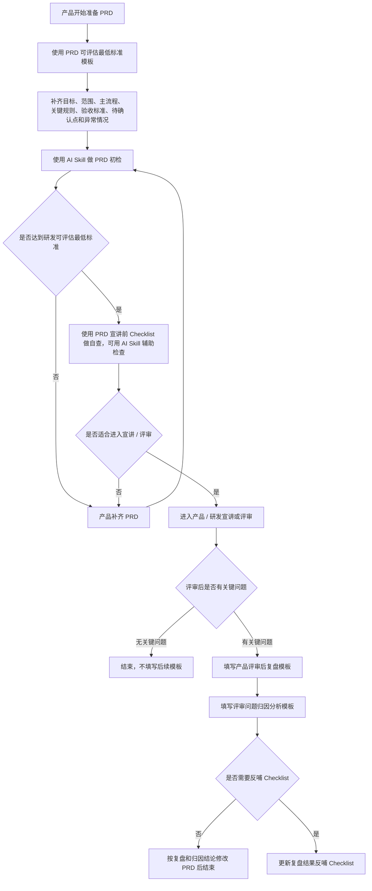

# 5 份文档使用说明

## 1. 这套文档解决什么问题

这套文档不是新增审批流，也不是为了把 PRD 写复杂。

核心目标是：

> 让 PRD 在进入研发评估和宣讲前，把目标、主流程、涉及范围、关键规则、验收标准、待确认点和主要异常讲清楚，减少评审现场反复追问和研发阶段返工。

日常需求默认重点使用前两份文档：**PRD 可评估最低标准模板** 和 **PRD 宣讲前 Checklist**。

评审后需要做一次问题判断：如果没有关键问题，则流程结束；如果有关键问题，再进入复盘、归因和 Checklist 反哺。

---

## 2. 产品怎么使用这套文档

这套文档建议按 **“写 PRD → AI 初检 → 宣讲前自查 → 产品 / 研发评审 → 评审后判断”** 的流程使用。

不是 5 份文档每次都要全部填写，而是根据需求复杂度和评审结果按需使用。

### 什么是关键问题

这里的关键问题，主要看两点：

1. **是否影响研发评估或开工**：比如目标、范围、主流程、关键规则不清楚，导致研发无法评估工作量或拆解任务。
2. **是否影响实现或验收**：比如验收标准、异常情况、待确认点不清楚，导致后续实现、联调或验收容易返工。

如果只是局部文案、展示细节、一次性小问题，且不影响研发评估、开工、实现或验收，就不需要进入后续复盘流程。

如果评审后确认存在关键问题，则填写评审后复盘模板，并进入问题归因分析；只有需要沉淀为后续检查项的问题，才反哺更新 Checklist。

---

## 3. 每份文档怎么用

| 文档                            | 使用时机                         | 主要作用                                                           | 是否日常必用 |
| ------------------------------- | -------------------------------- | ------------------------------------------------------------------ | ------------ |
| PRD 可评估最低标准模板          | 产品准备 PRD 时                  | 帮产品把目标、流程、范围、规则、验收、待确认点和异常处理写清楚     | 是           |
| PRD 宣讲前 Checklist            | PRD 宣讲前                       | 帮产品自查 PRD 是否达到研发可评估的最低要求                        | 是           |
| 产品评审后复盘模板              | 评审后发现关键问题时             | 记录评审结论、主要问题、修改动作、负责人和完成节点                 | 按需         |
| 评审问题归因分析模板            | 评审后发现关键问题并完成复盘后   | 判断问题属于目标、流程、范围、规则、验收、待确认点还是异常处理缺口 | 按需         |
| 复盘结果反哺 Checklist 更新流程 | 归因后判断需要沉淀为后续检查项时 | 更新 Checklist，避免下次继续漏同类问题                             | 按需         |

---

## 4. 使用边界

以下情况不需要走完整 5 份文档：

1. 普通小改动、小配置、小文案调整。
2. PRD 宣讲顺利通过，且没有关键问题。
3. 评审后判断没有影响研发评估、开工、验收或二次确认的问题。
4. 只是一次性细节问题。
5. 只影响局部展示，不影响研发评估、开工或验收。
6. 异常分支不影响主流程和关键规则，可在开发过程中补充确认。

---

## 5. 使用原则

日常需求重点使用 **PRD 可评估最低标准模板** 和 **PRD 宣讲前 Checklist**，先保证 PRD 达到研发可评估和可宣讲的最低标准。

AI Skill 主要用于事前检查，嵌入 PRD 初检和宣讲前自查两个节点，帮助产品提前发现缺失项、风险点和需要补齐的内容。

评审后只做关键问题判断，不要求每次都填写后 3 份文档；只有评审后确认存在关键问题时，才进入复盘和归因分析。是否反哺 Checklist，则根据问题是否需要沉淀为后续检查项来判断。
