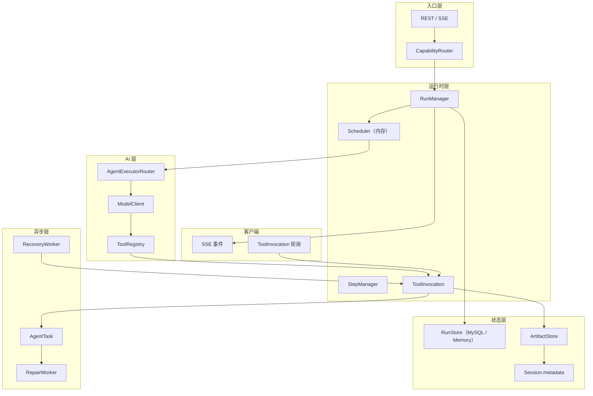
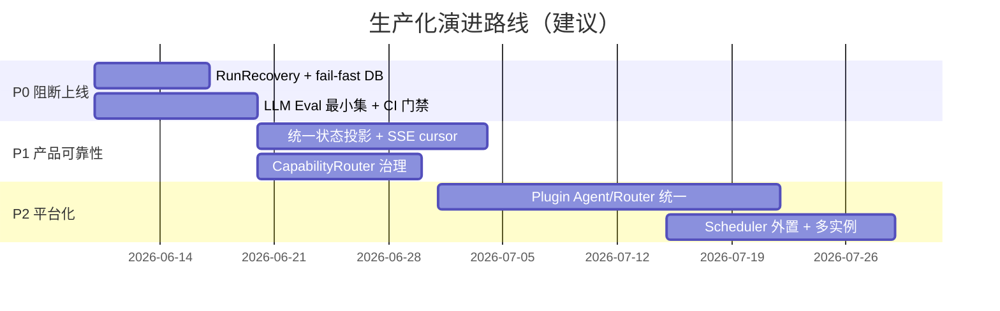

# 结论

从**正式可上线产品**视角看，`agent-frame` 已具备 Run 生命周期、能力路由、Tool Bridge、ToolInvocation、Artifact 版本化、异步修复 Worker 等骨架，但距离“可长期运营的生产级 Agent 后端”仍有明显缺口。

当前最致命的 **5 个框架设计实现问题** 是：

1. **Run 级持久化与故障恢复不完整** — 只有 `artifact_write` 可补偿，Run 本身无法恢复  
2. **缺少 LLM 业务质量评测与发布门禁** — 无 golden cases / eval runner，质量不可控  
3. **能力路由仍是启发式规则，缺少产品级治理** — 误路由直接影响用户体验与成本  
4. **异步状态模型分裂，客户端同步协议不成熟** — 轮询兜底、事件不统一，后台任务对用户不透明  
5. **插件化/runtime 统一未完成，扩展仍依赖手写装配** — 每加一个 Agent 都要改核心容器  

下面按生产视角展开。

---

# 一、当前框架实现设计总结（生产视角）

## 1.1 框架定位

`agent-frame` 是一个 **Run 驱动的多 Agent 运行时框架**，不是单一聊天应用。一次用户请求被抽象为：

```txt
Run → Step → AgentEvent / ToolInvocation → ArtifactVersion
```

核心链路：

```txt
用户输入
  → RunsService
  → CapabilityRouter（入口能力识别）
  → RunManager + Scheduler（生命周期 + 并发控制）
  → AgentExecutorRouter（按 agentId 分发）
  → Agent（Supervisor / NlToHand / Research / …）
  → ModelClient + ToolRegistry
  → ToolInvocation（工具状态源）
  → Artifact / ArtifactVersion（结构化业务产物）
  → SSE 事件流 + 前端状态查询
  → RecoveryWorker / RepairWorker（部分后台恢复）
```

## 1.2 已具备的生产化骨架

| 模块 | 生产级意义 | 当前完成度 |
|------|-----------|-----------|
| RunManager | 统一执行单元、可审计 | 基础完整，缺 Run 级恢复 |
| CapabilityRouter | 入口解耦，避免 Supervisor 膨胀 | 规则路由可用，缺治理 |
| ToolRegistry + Tool Bridge | 工具与模型调用隔离 | 较完整 |
| ToolInvocation | 工具状态源、幂等、phase | 仅 `artifact_write` 可恢复 |
| ArtifactVersion | 结构化业务状态、多轮 patch | 较完整 |
| AgentTask + Worker | 异步长任务边界 | 有雏形，状态投影不完整 |
| SSE + Event 持久化 | 实时 + 回放 | 有 replay，缺 cursor 续订 |
| Auth + Run 访问控制 | 多用户隔离 | 已有基础 auth |
| A2APolicy | Agent 调用白名单、深度/成本预算 | 手写维护 |

## 1.3 自然语言转牌谱（nl_to_hand）在框架中的位置

牌谱能力是框架的**第一个完整垂直能力**，链路已打通：

```txt
CapabilityRouter（高置信牌局描述）
  → NlToHandAgent
  → ModelClient.stream({ tools: [nl_to_hand] })
  → nl_to_hand baseline（autofix → schema → simulateHand）
  → hand_history Artifact（valid / draft）
  → baseline 失败 → AgentTask → NlToHandRepairWorker（内层 LLM 修复）
  → patch_from_nl 多轮版本追加
  → 前端 HandHistoryPanel 展示 + 继续修改
```

这说明框架**主链路设计方向正确**，但 nl_to_hand 也暴露了框架在恢复、异步、评测、扩展性上的系统性短板。

## 1.4 架构分层（生产视角）



---

# 二、最致命的 5 个框架设计实现问题

---

## 致命问题 1：Run 级持久化与故障恢复不完整

### 现状

- `RunManager` 的 `RunContext` 存在**进程内存**（`activeContexts` Map），进程崩溃即丢失执行上下文。
- `Scheduler` 是**内存优先级队列**，重启后 queued/running 任务不可恢复。
- `ToolInvocationRecoveryWorker` **仅**对 `phase=artifact_write` 做幂等补偿；其他 phase（`pre_parse_autofix`、`schema_validate`、`simulate_hand` 等）直接标记 `timed_out`，**不可重放**。
- 没有 `RunRecoveryWorker`：服务重启后，`status=running` 的 Run 会**永久悬挂**，不会自动 fail/resume。
- `DATABASE_URL` 未配置时静默降级到 `MemoryRunStore`，**重启即丢全部状态**。

```121:133:apps/api/src/runtime/tool-invocation-recovery.worker.ts
  async recoverOne(invocation: ToolInvocation): Promise<boolean> {
    if (invocation.phase === TOOL_INVOCATION_PHASE.ARTIFACT_WRITE) {
      return this.recoverArtifactWrite(invocation)
    }

    await this.runStore.updateToolInvocation(invocation.id, {
      status: TOOL_INVOCATION_STATUS.TIMED_OUT,
      // ...
    })
    return true
  }
```

### 为什么致命（生产视角）

正式产品必须假设：**进程随时可能重启、部署滚动、节点故障**。当前设计是“Happy Path 可跑通”，不是“故障后可自愈”。

| 故障场景 | 生产后果 |
|---------|---------|
| 部署滚动重启 | 大量 Run 永久 `running`，用户看到卡死 |
| Tool 在 simulate 阶段崩溃 | 直接 timed_out，无法自动重试确定性校验 |
| MemoryRunStore 误配 | 全量状态丢失，无告警阻断 |
| 多实例部署 | 内存 Scheduler 无法协调，并发不可控 |

这不是 nl_to_hand 独有问题，**所有 Agent / Tool 都受影响**。

### 优化方案

**Phase 1 — 阻断性修复（上线前必须）**

```txt
1. 禁止生产环境 MemoryRunStore
   → DATABASE_URL 缺失时启动 fail-fast，而非 warn + fallback

2. 新增 RunRecoveryWorker
   → 扫描 status=running 且 updatedAt > staleThreshold 的 Run
   → 读取最后 Step / ToolInvocation phase
   → 可安全重放 → resume；不可重放 → failed + 明确 errorCode

3. ToolInvocation 全 phase 恢复策略表
   phase                  | 策略
   pre_parse_autofix      | 幂等重放整个 Tool（需 inputHash 校验）
   schema_validate        | 同上
   simulate_hand          | 确定性重放
   inner_repair           | 转 AgentTask，不 sync 恢复
   artifact_write         | 已有幂等补偿
   waiting_repair         | 交给 RepairWorker
```

**Phase 2 — 架构升级**

```txt
4. Scheduler 外置
   → BullMQ / Redis ZSET 优先级队列
   → Worker 无状态，可水平扩展

5. Run Checkpoint
   → 每个 Step 完成后写入 checkpointPayload
   → Run 恢复时从最后 checkpoint 继续，而非从头

6. 幂等 Run 创建
   → POST /runs 支持 Idempotency-Key
   → 客户端重试不会创建重复 Run
```

**目标 SLO**：进程重启后 2 分钟内，所有 stale Run 进入终态（completed / failed / resumed），零永久悬挂。

---

## 致命问题 2：缺少 LLM 业务质量评测与发布门禁

### 现状

- 测试覆盖：确定性逻辑（validator、autofix、tool-bridge、capability-router）有单元/集成测试。
- **没有** `apps/api/evals/` 目录，没有 golden cases，没有 eval runner。
- 真实模型行为（Prompt 变更、模型版本切换、路由阈值调整）**无法量化回归**。
- CI 中没有 `tool_call_rate`、`validation_success_rate`、`patch_preservation_rate` 等质量门槛。

### 为什么致命（生产视角）

LLM 产品的核心风险不是“代码 bug”，而是**“代码没变，效果变差”**：

| 变更 | 无评测时的后果 |
|------|--------------|
| Prompt 改一行 | tool call rate 下降，用户拿到纯文本而非牌谱 |
| 模型 API 升级 | 字段名漂移，schema 解析失败率上升 |
| autofix 增强 | 可能误修事实性错误，simulate 通过但牌谱错误 |
| CapabilityRouter 阈值调整 | 误路由率变化不可见 |
| patch_from_nl | 模型覆盖未修改字段，用户数据 silently corrupted |

**没有评测体系 = 没有上线信心 = 无法持续迭代。**

### 优化方案

**Phase 1 — 最小评测闭环（2 周内可落地）**

```txt
apps/api/evals/
  nl_to_hand/
    golden_cases.jsonl      # 50+ 覆盖各场景
    patch_cases.jsonl       # 多轮修改保留率
    routing_cases.jsonl     # 能力路由准确率
  runner/
    eval-runner.ts
    reporters/
      markdown-reporter.ts
      json-reporter.ts
```

golden case 示例：

```json
{
  "id": "preflop_open_fold_6max_001",
  "input": "6人桌，1/2，Hero UTG AhAs open到6，后面都弃牌",
  "expected": {
    "routeAgentId": "nl-to-hand-agent",
    "mustCallTool": true,
    "mustBeValid": true,
    "players": 6,
    "heroCards": "AhAs"
  }
}
```

**Phase 2 — 质量门禁**

| 指标 | PR CI（FakeModel） | Nightly（真实模型） | 发布阻断线 |
|------|-------------------|-------------------|-----------|
| route_accuracy | > 90% | > 95% | < 85% 阻断 |
| tool_call_rate | > 95% | > 98% | < 90% 阻断 |
| validation_success_rate | > 80% | > 90% | < 70% 阻断 |
| patch_preservation_rate | > 75% | > 90% | < 65% 阻断 |
| artifact_success_rate | > 95% | > 99% | < 90% 阻断 |

```txt
package.json:
  "eval:nl-to-hand": "bun run apps/api/evals/runner/eval-runner.ts"
  "eval:nl-to-hand:ci": "... --model=fake --fail-on-regression"

GitHub Actions:
  PR  → eval:nl-to-hand:ci（FakeModel，< 3min）
  Nightly → eval:nl-to-hand（真实模型 + cost/latency 报告）
  Release → 对比 baseline，任何核心指标下降 > 5% 阻断发布
```

**Phase 3 — 生产监控对接**

```txt
eval 指标 → Prometheus metrics
  nl_to_hand_validation_success_rate
  nl_to_hand_tool_call_rate
  nl_to_hand_p95_latency_ms
  nl_to_hand_token_cost_usd

Grafana 面板 + PagerDuty 告警
```

---

## 致命问题 3：能力路由是启发式规则，缺少产品级治理

### 现状

`CapabilityRouter` 基于关键词/正则评分：

```35:36:apps/api/src/capabilities/capability-router.ts
const HIGH_CONFIDENCE_THRESHOLD = 0.72
const CLARIFICATION_THRESHOLD = 0.42
```

- 规则硬编码在核心代码，**与 PluginRegistry 未打通**。
- `ask_clarification` 返回后，调用方可选择降级到 supervisor — **澄清未强制执行**。
- 无路由决策审计、无 A/B 测试、无人工 override 记录。
- 能力增多后，每加一个能力都要手写规则，**不可扩展**。

### 为什么致命（生产视角）

能力路由是**产品入口的第一道门**：

| 误路由类型 | 用户感知 |
|-----------|---------|
| 牌谱描述 → supervisor | “为什么没生成牌谱？” |
| 普通聊天 → nl-to-hand | 浪费 Token、返回无关牌谱 |
| 低置信未澄清 | 静默错误路由，无法追溯 |

生产环境需要：**准确、可解释、可审计、可迭代**，而不是“调阈值碰运气”。

### 优化方案

**Phase 1 — 路由治理基础设施**

```txt
1. 路由决策持久化
   capability_route_decisions 表：
     runId, inputHash, requestedAgentId, resolvedAgentId,
     confidence, reason, source, createdAt

2. 强制澄清协议
   ask_clarification → API 返回 422 + clarificationQuestion
   前端必须展示选项，用户确认后才创建 Run
   禁止 silent fallback 到 supervisor

3. 路由指标
   capability_route_accuracy（eval 集）
   capability_route_override_rate（用户手动切换 Agent 比例）
   capability_route_clarification_rate
```

**Phase 2 — 插件化能力发现**

```txt
Plugin.registerCapabilityHints({
  agentId: 'nl-to-hand-agent',
  triggers: { keywords, patterns, minScore },
  examples: ['6人桌 Hero UTG open...'],
  negativeExamples: ['今天天气怎么样'],
})

CapabilityRouter.resolve():
  1. 显式 agentId → 直接返回
  2. 聚合所有 Plugin capabilityHints 评分
  3. 高置信 → 路由
  4. 中置信 → ask_clarification（强制）
  5. 低置信 → default supervisor
```

**Phase 3 — 分级路由（规模化）**

```txt
规则优先（零成本、确定性）
  → 小模型分类器（低成本、< 100ms）
  → 低置信强制澄清
  → 路由决策全量进 eval 集回归
```

---

## 致命问题 4：异步状态模型分裂，客户端同步协议不成熟

### 现状

一次 nl_to_hand 的完整状态分散在 **5 个数据源**：

```txt
Run.status              → SSE 推送
ToolInvocation.status   → GET /tool-invocations/:id + 前端 3s 轮询
AgentTask.status        → 有 API，前端未消费
ArtifactVersion         → GET /artifacts/:id，repair 成功后静默刷新
Session.metadata.activeHandHistory → 侧信道指针，非权威源
```

前端修复状态链路：

```txt
HandHistoryPanel
  → useToolInvocation（轮询 waiting_repair）
  → onRefresh 静默拉 Artifact
  → 无 AgentTask 进度、无 repair 成功/失败产品化提示
```

SSE 对已完成 Run 支持 replay，但**运行中 Run 的 SSE 断开后无 cursor 续订协议**。

### 为什么致命（生产视角）

异步是 Agent 产品的常态（内层修复、长 Tool、Workflow）。当前设计导致：

| 问题 | 生产后果 |
|------|---------|
| 5 源状态不一致 | 前端展示 draft，后台已 valid；或反之 |
| 轮询兜底 | N 用户 × M 牌谱 = 无意义 DB 压力 |
| 无统一事件 | 无法做可靠的通知、审计、第三方集成 |
| repair 成功无感知 | 用户不知道后台已生成新版本 |
| repair 失败无引导 | 用户看到 failed，不知如何补充 |

**这是“能跑”和“好用且可靠”的分水岭。**

### 优化方案

**Phase 1 — 统一状态投影**

```txt
引入 RunProjection（或 SessionProjection）只读视图：

GET /sessions/:sessionId/projection
{
  activeRuns: [...],
  toolInvocations: [{ id, status, phase, artifactRef, taskRef }],
  artifacts: [{ id, currentVersion, status, repairState }],
  pendingTasks: [{ id, type, status, retryCount, errorSummary }]
}

前端只订阅这一个 API + SSE，不再多源拼装。
```

**Phase 2 — 事件驱动替代轮询**

```txt
1. 补齐标准事件类型
   tool.invocation.updated
   agent.task.started / completed / failed
   artifact.version.created
   artifact.repair.completed

2. SSE 支持 Last-Event-ID / cursor
   GET /runs/:runId/events?after=<eventId>
   断线重连从 cursor 续订，不重放全量

3. Session 级 SSE（推荐）
   GET /sessions/:sessionId/events
   覆盖 Run 完成后的异步 repair 事件
   前端不再轮询 ToolInvocation
```

**Phase 3 — 产品化反馈闭环**

```txt
repair 成功 → Toast「后台已生成 v3」+ diffSummary 高亮
repair 失败 → 「补充信息继续修复」按钮，自动填充 askUser/fixPath
AgentTask 进度 → queued(1/3) → running → completed，展示 retryCount
```

---

## 致命问题 5：插件化 / Runtime 统一未完成，扩展仍依赖手写装配

### 现状

`PluginRegistry` 已支持 Tool 元数据 + `runtimeFactory`，但：

```txt
Agent 实例化     → container.ts 手写 new NlToHandAgent(...)
A2A 白名单       → container.ts 手写 a2aPolicy.allow(...)
AgentExecutorRouter → container.ts 手写 registerAgent(...)
CapabilityRouter  → 硬编码 nl-to-hand 规则，不读 Plugin hints
Workflow runtime  → 仅元数据，无可执行 adapter
```

每新增一个垂直能力（如“赛事分析 Agent”“教练复盘 Agent”），需要修改 **4+ 核心文件**，无法独立插件化发布。

### 为什么致命（生产视角）

正式产品的框架价值在于：**业务能力可插拔、可独立迭代、可团队并行开发**。

| 现状 | 长期后果 |
|------|---------|
| 核心容器膨胀 | 合并冲突频繁，发布风险高 |
| 能力无法独立版本 | 无法对单个 Agent 做灰度 |
| 路由与 Agent 解耦不彻底 | 新能力上线周期长 |
| 第三方/内部团队无法贡献插件 | 框架无法平台化 |

Tool 层已打通 `runtimeFactory`，但 **Agent / Router / A2A / Workflow 四层仍断裂**，这是架构债务的核心。

### 优化方案

**Phase 1 — 插件 Runtime 契约补全**

```typescript
interface AgentPlugin {
  register(ctx: PluginContext): void
}

interface PluginContext {
  registerAgent(def: {
    id: string
    factory: (deps: AgentDeps) => Agent
    capabilityHints?: CapabilityHints
    a2aPolicy?: { canCall: string[]; calledBy: string[] }
  }): void

  registerTool(def: ToolDefinition): void  // 已有
  registerWorkflow(def: WorkflowDefinition & { runner?: WorkflowRunnerFactory }): void
  registerArtifactType(def: ArtifactTypeDefinition): void
}
```

**Phase 2 — 容器自动装配**

```txt
container.ts 简化为：

const pluginRegistry = new PluginRegistry()
pluginRegistry.register(builtinNlToHandPlugin)
pluginRegistry.register(creativeWritingPlugin)
// ...

// 自动从 Plugin 注册表构建：
const agents = pluginRegistry.buildAgents(deps)
const executorRouter = new AgentExecutorRouter(agents)
const capabilityRouter = new CapabilityRouter(pluginRegistry.listCapabilityHints())
const a2aPolicy = A2APolicy.fromPlugins(pluginRegistry.listA2APolicies())
```

**Phase 3 — 插件生命周期与灰度**

```txt
Plugin 版本管理 + 启用/禁用开关
单 Plugin 灰度（按 userId / sessionId 百分比）
Plugin 独立 eval 集 + 独立发布流水线
```

---

# 三、问题优先级与演进路线



| 优先级 | 问题 | 不做会怎样 | 建议工期 |
|--------|------|-----------|---------|
| P0 | Run 级恢复 + DB fail-fast | 部署即故障、状态悬挂 | 1 周 |
| P0 | LLM Eval + 发布门禁 | 无法安全迭代 Prompt/模型 | 1–2 周 |
| P1 | 异步状态统一 + SSE cursor | 用户体验差、DB 轮询压力 | 2 周 |
| P1 | 能力路由治理 | 误路由、成本浪费 | 1 周 |
| P2 | Plugin Runtime 统一 | 每加能力改核心、无法平台化 | 3 周 |

---

# 四、总结

当前框架**设计方向正确**：Run 中心化、ToolInvocation 作状态源、Artifact 承载业务状态、复杂 Tool 异步化，这些都是生产级 Agent 后端应有的结构。

但从**正式可上线产品**标准看，框架仍处于 **“主链路可演示，生产边界未补齐”** 阶段。最致命的不是某个业务 bug，而是 5 个**系统性框架能力缺失**：

1. **故障不可自愈** — Run/Scheduler 无恢复，Tool 恢复仅覆盖最后一环  
2. **质量不可度量** — 无 LLM eval，无法安全发布  
3. **入口不可治理** — 启发式路由无审计、无强制澄清  
4. **状态不可一致** — 多源分裂 + 轮询兜底  
5. **扩展不可插拔** — 核心容器手写装配，Plugin 只完成 Tool 层  

建议按 **P0 → P1 → P2** 顺序推进：先让系统“崩了能恢复、改了能测”，再让异步体验和产品入口可靠，最后完成插件平台化。

如果你希望，我可以下一步把其中任一问题（例如 RunRecoveryWorker 或 Eval 体系）直接落成具体模块设计与代码骨架。