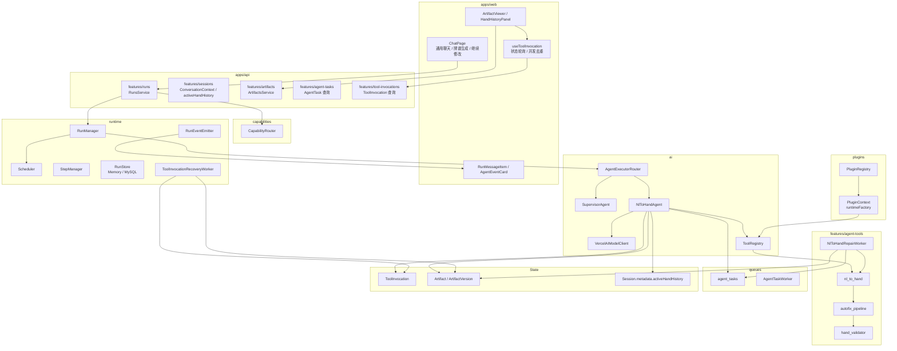

# Agent Frame 框架实现现状与自然语言转牌谱

> 更新时间：2026-06-07  
> 范围：`apps/api`、`apps/web`、`packages/shared` 当前代码实现。  
> 说明：本文档描述当前仓库的实际实现状态，不是早期设计稿。自然语言转牌谱已经从“孤立业务工具”推进到“能力路由 + 专用 Agent + Tool Bridge + ToolInvocation 恢复 + 异步修复 Worker + Artifact 状态化 + 前端状态轮询 + 插件 Tool runtime 注册”的生产化雏形。

---

## 1. 文档目的

本文档回答四个问题：

1. 当前项目实际落地了怎样的 Agent Frame 框架设计。
2. 自然语言转牌谱从用户输入到 `hand_history` Artifact 的完整链路是什么。
3. 最近已解决哪些早期致命问题。
4. 当前框架仍然最需要继续优化的 3 个生产化问题是什么。

---

## 2. 当前框架实现概览

### 2.1 总体定位

`agent-frame` 当前已经不是单一聊天 Demo，而是一个面向多 Agent 应用的运行时框架。它把一次用户请求抽象为 `Run`，把执行过程拆成 `Step`、`AgentEvent`、`ToolInvocation`、`AgentTask` 和 `ArtifactVersion`，再通过 `ModelClient`、`ToolRegistry`、`CapabilityRouter`、`A2A`、`PluginRegistry` 等模块组织不同能力。

当前核心链路可以概括为：

```txt
用户输入
  → RunsService
  → CapabilityRouter
  → RunManager
  → Scheduler
  → AgentExecutorRouter
  → Agent
  → ModelClient / ToolRegistry / A2A
  → Step / ToolInvocation / AgentEvent
  → Artifact / ArtifactVersion
  → Web SSE / Artifact UI
```

当前最重要的设计取向是：

- `RunManager` 负责 Run 生命周期，具体 Agent 只负责业务执行。
- `CapabilityRouter` 独立处理能力路由，不把专业能力识别塞进 `SupervisorAgent`。
- `ModelClient` 隔离 Vercel AI SDK，框架层使用统一模型事件和工具定义。
- `ToolRegistry` 管理运行时工具，`PluginRegistry` 管理能力发现元数据；`ToolDefinition.runtimeFactory` 已把 Tool 元数据注册和运行时注册初步打通。
- `ToolInvocation` 成为工具调用的状态源，支持 phase、heartbeat、幂等键和恢复载荷。
- `Artifact` 和 `ArtifactVersion` 承载结构化业务结果，`hand_history` 已经成为可继续编辑的业务状态。
- 耗时的 `nl_to_hand` 内层 LLM 修复已经从同步 Run/SSE 链路拆到后台 Worker，前端通过 `ToolInvocation` 状态展示 draft / repairing / repair_failed / valid。

### 2.2 当前分层架构



### 2.3 当前核心模块状态

| 模块 | 当前状态 | 关键文件 |
|------|----------|----------|
| Run 生命周期 | 已实现创建、调度、执行、取消、完成、失败 | `apps/api/src/runtime/run-manager.ts` |
| Step / Event | 已追踪模型调用、工具调用、Artifact 事件 | `apps/api/src/runtime/step-manager.ts`、`apps/api/src/runtime/event-emitter.ts` |
| 能力路由 | 已实现独立 `CapabilityRouter`，高置信牌谱输入自动路由到 `nl-to-hand-agent` | `apps/api/src/capabilities/capability-router.ts` |
| Agent 路由 | 已按 `agentId` 分发到具体 Agent | `apps/api/src/ai/agents/agent-executor-router.ts` |
| ModelClient | 已隔离 Vercel AI SDK，支持 tools、stream、maxSteps | `apps/api/src/ai/model-client/` |
| Tool Bridge | 已支持通用 `AgentToolDefinition`、`nl_to_hand` 桥接和插件 Tool runtime 注册 | `apps/api/src/ai/tools/`、`apps/api/src/plugins/plugin-context.ts` |
| ToolInvocation | 已支持持久化、phase、heartbeat、idempotencyKey、recoveryPayload | `packages/shared/src/models/tool-invocation.ts` |
| Tool 恢复 | 已实现 `ToolInvocationRecoveryWorker`，可恢复 `artifact_write` 幂等补写 | `apps/api/src/runtime/tool-invocation-recovery.worker.ts` |
| 异步修复 | 已实现 `NlToHandRepairWorker`，把内层 LLM 修复移出同步 Run/SSE | `apps/api/src/features/agent-tools/nl-to-hand-repair.worker.ts` |
| AgentTask | 已支持按 `toAgentId` claim，通用 A2A Worker 与牌谱修复 Worker 隔离消费 | `apps/api/src/queues/agent-task.store.ts` |
| Artifact | 已支持 `Artifact` / `ArtifactVersion`、幂等写入、版本追加 | `apps/api/src/artifacts/` |
| hand_history 状态 | 已支持 active artifact、`patch_from_nl`、新版本追加 | `NlToHandAgent`、`SessionsRepository` |
| 前端牌谱编辑 | 已支持“基于此牌谱继续修改”、异步修复状态展示、`ToolInvocation` 轮询和请求去重 | `apps/web/src/features/artifacts/HandHistoryPanel.tsx`、`useToolInvocation.ts` |
| 状态查询 API | 已支持 ToolInvocation / AgentTask 查询 | `features/tool-invocations`、`features/agent-tasks` |

---

## 3. 已解决的早期关键问题

### 3.1 入口分裂问题：已通过 CapabilityRouter 缓解

早期问题是：用户必须手动切换到“牌谱生成”模式，否则通用聊天会进入 `supervisor-agent`，牌谱能力不可达。

当前已新增独立 `CapabilityRouter`：

```txt
POST /runs
  → RunsService.createRun
  → CapabilityRouter.resolve(input, requestedAgentId)
      ├─ 显式专业 agentId：尊重用户选择
      ├─ 高置信牌谱意图：路由到 nl-to-hand-agent
      └─ 普通聊天：保留 supervisor-agent
```

这保持了 `SupervisorAgent` 的职责边界：它不负责所有能力识别，能力路由由独立模块完成。

### 3.2 ToolInvocation 只有记录、不能恢复：已补恢复协议雏形

当前 `ToolInvocation` 不再只是日志记录，而是恢复协议的状态源：

```txt
id
runId
stepId
toolName
idempotencyKey
status
phase
inputHash
inputPreview
recoveryPayload
heartbeatAt
outputRef
retryCount
```

`ToolInvocationRecoveryWorker` 会扫描 stale 的 `running` invocation：

```txt
running + artifact_write + recoveryPayload
  → 幂等补写 Artifact / ArtifactVersion
  → 标记 succeeded / completed

running + 其他不可安全重放 phase
  → 标记 timed_out

waiting_repair
  → 交给 NlToHandRepairWorker，不由恢复器误判超时
```

相关 API 也已补齐：

```txt
GET /runs/:runId/tool-invocations
GET /tool-invocations/:invocationId
```

### 3.3 复杂 Tool 同步内层修复：已拆成异步边界

早期 `nl_to_hand` baseline 失败后，会在同一个 tool execute 中继续调用内层 LLM 修复，导致一次 Run / SSE 请求可能被拖长。

当前同步路径只做：

```txt
外层 LLM 生成 game_hand
  → nl_to_hand baseline
  → pre-parse autofix
  → schema validate
  → post-parse autofix
  → simulateHand
  → valid Artifact 或 draft Artifact
  → Run 完成
```

baseline 失败时：

```txt
写入 draft hand_history Artifact
  → 创建 agent_tasks 记录
  → ToolInvocation.status = waiting_repair
  → NlToHandRepairWorker 后台消费
  → inner_repair 模式调用 nl_to_hand
  → 成功后追加 valid ArtifactVersion
  → 更新 activeHandHistory
```

这让同步 Run/SSE 不再等待内层 LLM 修复，用户可以先看到 draft 和诊断，后台修复完成后再看到新版本。

### 3.4 多轮牌谱修改缺少结构化状态：已用 ArtifactVersion 承接

当前已支持 `patch_from_nl`：

```txt
用户点击“基于此牌谱继续修改”
  → 前端携带 artifactId + baseVersionId
  → POST /runs input.command.type = patch_from_nl
  → NlToHandAgent 加载 base ArtifactVersion
  → prompt 注入 baseGameHand
  → 模型生成新 game_hand
  → 工具校验
  → 同一 Artifact 追加新 ArtifactVersion
  → parentVersionId 指向 baseVersionId
```

这说明 `hand_history` 已经从展示产物升级为会话内业务状态。

---

## 4. 自然语言转牌谱当前完整流程

### 4.1 用户入口

前端入口在 `apps/web/src/features/chat/ChatPage.tsx`。

当前有两种触发方式：

```txt
方式一：用户显式选择牌谱生成模式
  → agentId = nl-to-hand-agent

方式二：用户在通用入口输入高置信牌谱描述
  → CapabilityRouter 自动路由到 nl-to-hand-agent
```

提交示例：

```txt
POST /runs
{
  input: {
    message: "6人桌，1/2，Hero UTG AhAs open到6，后面都弃牌"
  },
  sessionId
}
```

### 4.2 Run 创建与能力路由

后端入口在 `apps/api/src/features/runs`：

```txt
RunsService.createRun
  → resolveSessionId
  → ConversationContextBuilder.build
  → CapabilityRouter.resolve
  → RunManager.createRun
```

`CapabilityRouter` 会基于牌谱关键词、位置、手牌、下注线等规则评分，高置信时自动选中 `nl-to-hand-agent`。

### 4.3 NlToHandAgent 外层编排

核心文件：`apps/api/src/ai/agents/nl-to-hand.agent.ts`

`NlToHandAgent` 的职责：

1. 解析用户消息和 `command`。
2. 若是 `patch_from_nl`，加载基础 `ArtifactVersion` 的完整 `gameHand`。
3. 拼接扑克专用外层 prompt。
4. 从 `ToolRegistry` 构建 `nl_to_hand` 工具。
5. 调用 `modelClient.stream({ tools: [nlToHandTool] })`。
6. 把模型事件映射为 `MESSAGE_DELTA`、`TOOL_CALL`、`TOOL_RESULT`。
7. 创建 / 更新 `ToolInvocation`。
8. 写入 `hand_history` Artifact 或追加 ArtifactVersion。
9. 若 baseline 失败且有持久化队列，创建后台修复任务。

同步主流程：

```txt
NlToHandAgent.execute
  → buildPrompt(userMessage, contextPrompt, commandContext)
  → toolRegistry.build("nl_to_hand", { innerRepairMode: "disabled" })
  → modelClient.stream(...)
  → TOOL_CALL: create ToolInvocation
  → TOOL_RESULT: 完成 Tool Step
  → tryCreateHandHistoryArtifact
  → valid: ToolInvocation completed
  → draft: enqueueInnerRepairTask + ToolInvocation waiting_repair
```

### 4.4 Tool Bridge

核心文件：

- `apps/api/src/ai/tools/tool-factory.ts`
- `apps/api/src/ai/tools/nl-to-hand-tool.ts`
- `apps/api/src/ai/model-client/vercel-ai-model-client.ts`
- `apps/api/src/plugins/plugin-context.ts`
- `apps/api/src/plugins/builtin-plugins.ts`

桥接结构：

```txt
features/agent-tools/tool_nl_to_hand.ts
  → createAgentToolDefinition
  → ToolRegistry.register("nl_to_hand")
  → PluginContext.registerTool({ runtimeFactory })
  → ModelClient.stream({ tools })
  → Vercel AI SDK tool()
```

当前 `nl_to_hand` 有两条注册路径：

```txt
显式运行时注册：
  nl-to-hand-tool.ts
    → toolRegistry.register("nl_to_hand", nlToHandToolFactory)

插件注册：
  builtin-plugins.ts
    → ctx.registerTool(getNlToHandPluginToolDefinition())
    → PluginContext.registerTool
    → toolRegistry.register(tool.id, tool.runtimeFactory)
```

因此，`nl_to_hand` 已经不再只是插件元数据中的“可发现工具”，也可以通过插件定义携带 `runtimeFactory` 同步注册到运行时 `ToolRegistry`。当前还没有把 Agent runtime、CapabilityRouter hint 和 Workflow runtime 全部插件化，所以插件运行时统一仍是“Tool 层已打通，Agent/Router 层待继续收敛”。

`nl_to_hand` 现在支持两种执行模式：

| 模式 | 使用位置 | 行为 |
|------|----------|------|
| `innerRepairMode: "disabled"` | 同步 Run/SSE 主链路 | 只跑 baseline，失败立即返回 draft 诊断 |
| `innerRepairMode: "inner_repair"` | `NlToHandRepairWorker` | 允许调用内层 LLM 修复，并可返回最终牌谱 JSON |

### 4.5 nl_to_hand 工具内部流程

核心文件：`apps/api/src/features/agent-tools/tool_nl_to_hand.ts`

工具入参：

```typescript
{
  _reasoning?: string
  game_hand: unknown
}
```

同步 baseline 流程：

```txt
createNlToHandTool.execute({ game_hand })
  → runPreParseAutoFix(game_hand)
  → LatestHandSchema.safeParse(fixed)
  → runPostParseAutoFix(parsed)
  → simulateHand(baselineHand)
      ├─ ok: buildSuccessResponse
      └─ failed + innerRepairMode=disabled:
           buildBestFailureResponse(..., rounds=0)
```

后台 inner repair 流程：

```txt
NlToHandRepairWorker
  → createNlToHandTool({ innerRepairMode: "inner_repair", includeFinalHandJson: true })
  → baseline 再校验
  → baseline 失败后构造内层修复 prompt
  → generateText + Output.object({ schema: LatestHandSchema })
  → runPostParseAutoFix
  → simulateHand
  → 成功返回合法 + [最终牌谱JSON]
  → 失败记录 task failed / ToolInvocation failed
```

### 4.6 autofix_pipeline

核心文件：`apps/api/src/features/agent-tools/autofix_pipeline.ts`

当前 autofix 分两段：

```txt
runPreParseAutoFix
  → Schema 之前执行
  → 修字段别名、牌面格式、动作别名、数值类型、位置别名

runPostParseAutoFix
  → Schema 之后执行
  → 修派生盲位、position_tag、玩家名称、无效 amount 等
```

设计原则是只修高确定性问题，不自动改事实性冲突。例如重复牌、行动顺序矛盾、筹码守恒问题应该由校验器报错或让用户确认。

### 4.7 牌谱校验引擎

核心目录：`apps/api/src/features/hand_validator/`

校验由确定性引擎完成，不由 LLM 自行判断：

| 层级 | 模块 | 职责 |
|------|------|------|
| Layer 1 | `LatestHandSchema` | JSON 结构、字段类型、枚举约束 |
| Layer 2 | `hand_pre_validator` | 座位、筹码、牌面唯一性、基础语义 |
| Layer 3 | `street_manager` / `action_translator` | 行动顺序、下注轮闭合、街道推进 |
| Layer 4 | `settlement_validator` | 摊牌、底池、结算、筹码守恒 |

对外入口：

```typescript
validateHandHistory(json: unknown): HandValidationResult
simulateHand(hand: LatestHandType): HandValidationResult
```

### 4.8 Artifact 写入与恢复

`NlToHandAgent` 在写 Artifact 前会把恢复载荷写入 `ToolInvocation.recoveryPayload`：

```txt
phase = artifact_write
recoveryPayload = {
  kind: "create_artifact_with_version" | "create_artifact_version",
  artifactInput / artifactId,
  content,
  context
}
```

如果进程在 `artifact_write` 阶段中断：

```txt
ToolInvocationRecoveryWorker
  → 扫描 stale running invocation
  → 读取 recoveryPayload
  → 幂等补写 Artifact / ArtifactVersion
  → 标记 ToolInvocation completed
```

这解决了“状态可见但不能恢复”的早期问题。

### 4.9 异步内层修复

`NlToHandAgent` 发现工具输出为 draft 后，会在 MySQL 模式下创建 `agent_tasks`：

```txt
toAgentId = nl-to-hand-inner-repair
input = {
  type: "nl_to_hand_inner_repair",
  runId,
  sessionId,
  userMessage,
  toolInput,
  draftArtifactId,
  draftVersionId,
  toolInvocationId
}
```

`NlToHandRepairWorker` 只 claim `toAgentId=nl-to-hand-inner-repair` 的任务。通用 `AgentTaskWorker` 会排除这类任务，避免 A2A Worker 抢走 Tool 修复任务。

成功时：

```txt
draft ArtifactVersion
  → 追加 valid ArtifactVersion
  → parentVersionId = draftVersionId
  → setCurrentVersion(validVersionId)
  → updateActiveHandHistory(status=valid)
  → ToolInvocation completed
```

失败时：

```txt
AgentTask failed
ToolInvocation failed
draft Artifact 保留给用户继续修改或补充信息
```

### 4.10 前端展示与继续修改

前端 `AgentEventCard` 展示 `nl_to_hand` 工具摘要，包括人数、BB、Hero、行动数、错误码、`fixPath`、`askUser` 等。

`HandHistoryPanel` 已支持：

```txt
展示 hand_history
  → 读取 handHistoryState + ToolInvocation
  → 展示 draft / repairing / repair_failed / valid / invalid_needs_user_input
  → 点击“基于此牌谱继续修改”
  → dispatch hand-history:continue-edit
  → ChatPage 进入 hand-history patch 模式
  → 下一轮 POST /runs 携带 command.type = patch_from_nl
```

后台修复状态的前端链路：

```txt
ArtifactViewer
  → useArtifact(artifactId)
  → HandHistoryPanel
  → useToolInvocation(toolInvocationId)
      ├─ 首次拉取 /tool-invocations/:id
      ├─ waiting_repair 或 running + inner_repair 时每 3 秒轮询
      ├─ succeeded / failed / cancelled / timed_out 终态停止
      └─ 同一 invocationId 并发请求用模块级 inflight Map 去重
```

最近修复过一个开发环境容易放大的轮询问题：`HandHistoryPanel` 在后台修复完成后会触发 `onRefresh()` 重新拉取 Artifact。如果 `useArtifact.reload()` 进入全量 loading，会导致 `HandHistoryPanel` 卸载并重挂载，组件内 `ref` 重置后又对同一个已完成 invocation 再次触发刷新，形成前端刷新循环。当前处理方式是：

- `useArtifact.reload()` 对同一 `artifactId` 做静默刷新，保留已渲染内容，避免卸载 `HandHistoryPanel`。
- `useToolInvocation()` 用 `onPollRef` 保存回调，避免回调引用变化导致 effect 重建。
- `useToolInvocation()` 对同一 `invocationId` 的并发 GET 做 inflight 去重，降低 React StrictMode 双挂载造成的重复请求。
- `shouldPollToolInvocation()` 只在 `repairing` 或 `asyncRepair=true` 时主动轮询；纯 draft 只首次拉取一次状态，终态不再持续请求。

---

## 5. 当前框架仍最需要优化的 3 个问题

### 问题一：LLM 业务质量还缺少评测闭环

当前已经有单元测试和集成测试覆盖确定性逻辑、Tool Bridge、能力路由、Run 级 Artifact 写入和恢复 Worker。但自然语言转牌谱的真实质量仍受 LLM 行为影响：

```txt
Prompt
  → 模型是否调用 tool
  → game_hand 字段是否稳定
  → autofix 是否误修或漏修
  → simulateHand 是否通过
  → patch_from_nl 是否保留未修改字段
```

建议新增 `apps/api/evals/nl_to_hand/golden_cases.jsonl` 和 eval runner：

```txt
bun run eval:nl-to-hand
  → route_accuracy
  → tool_call_rate
  → schema_success_rate
  → validation_success_rate
  → artifact_success_rate
  → patch_preservation_rate
  → latency / token cost
```

这会把 Prompt、模型版本、路由阈值、autofix 策略的效果变成可量化指标。

### 问题二：异步修复状态已接到前端，但还缺少产品化反馈闭环

后端已经有 `waiting_repair`、`agent_tasks` 和 `NlToHandRepairWorker`；前端也已经通过 `HandHistoryPanel` + `useToolInvocation` 展示基础状态：

```txt
draft
repairing
valid
invalid_needs_user_input
repair_failed
```

当前已经解决“用户完全看不到后台修复状态”的问题，但还没有形成完整产品体验：

- 用户只能看到 `ToolInvocation.status/phase` 的基础投影，还看不到 `AgentTask` 的重试次数、失败原因和最近更新时间。
- 后台修复成功后会静默刷新到新版本，但缺少明显的“后台已生成 vN”提示。
- 后台修复失败后会展示失败状态，但缺少一键把 `askUser` / `fixPath` 带回输入框的补充入口。
- 当前依赖前端轮询 `ToolInvocation`，还没有把 `artifactVersionCreated` 事件作为前端自动刷新的主通道。

建议下一步：

- `HandHistoryPanel` 同时读取 `AgentTask`，展示 queued/running/failed/completed、retryCount 和错误摘要。
- `RunArtifactList` 或 `ArtifactViewer` 监听 `artifactVersionCreated`，减少轮询依赖。
- 修复成功时突出显示新版本号和 diffSummary。
- 修复失败时提供“带错误提示继续补充”的输入动作。

### 问题三：插件 Tool runtime 已打通，但 Agent/Router 仍依赖手写注册

当前 `PluginRegistry` 已能注册 Agent、Tool、Workflow、ArtifactType 元数据；`ToolDefinition.runtimeFactory` 也已经让插件 Tool 在注册时同步进入 `ToolRegistry`。`nl_to_hand` 现在既可以作为插件元数据被发现，也可以通过 `runtimeFactory` 成为可执行工具。

但真正完整的插件运行时统一还没有完成：

这在 MVP 阶段可以接受，但长期会导致：

- Agent 仍需要在 `container.ts` 里实例化并注册到 `A2ARouter` / `AgentExecutorRouter`。
- CapabilityRouter 仍靠手写规则识别 `nl_to_hand`，没有读取插件的 capability hints。
- Workflow 仍主要是模板元数据，没有插件自带可执行 runtime adapter。
- A2A 权限策略仍在容器里手动维护。

建议后续把插件能力拆成两层：

```txt
Plugin.registerToolMetadata()
Plugin.registerToolRuntime()       已有 runtimeFactory 雏形
Plugin.registerAgentRuntime()      待补
Plugin.registerCapabilityHints()
Plugin.registerA2APolicy()
```

这样 `CapabilityRouter` 可以从插件读取能力描述、触发规则和运行时入口。

---

## 6. 当前完成度判断

| 能力 | 当前状态 | 说明 |
|------|----------|------|
| 专用 `NlToHandAgent` | 已完成 | 可作为 Run 入口 |
| 能力路由 | 已完成 | 高置信牌谱输入可自动路由 |
| Tool Bridge | 已完成 | `AgentToolDefinition` + `ToolRegistry` + `ModelClient.stream({ tools })` |
| `nl_to_hand` baseline | 已完成 | schema、autofix、simulateHand |
| 内层 LLM 修复 | 已异步化 | 由 `NlToHandRepairWorker` 后台处理 |
| ToolInvocation 持久化 | 已完成 | status、phase、heartbeat、idempotencyKey |
| ToolInvocation 恢复 | 已完成雏形 | `artifact_write` 可幂等补写 |
| Artifact 化 | 已完成 | valid / draft 都可写 `hand_history` |
| 多轮 patch | 已完成 | `patch_from_nl` 追加版本 |
| 前端牌谱面板 | 已完成 | 展示与继续修改入口已具备 |
| 后台修复前端状态 | 部分完成 | 已展示基础状态并轮询 ToolInvocation，仍缺 AgentTask 细节和成功/失败产品化提示 |
| LLM 质量评测 | 未完成 | 需要 golden cases 和 eval runner |
| 插件运行时统一 | 部分完成 | Tool runtimeFactory 已接入 ToolRegistry，Agent/Router/Workflow runtime 仍需插件化 |

---

## 7. 关键文件索引

### 框架核心

| 文件 | 说明 |
|------|------|
| `apps/api/src/container.ts` | 依赖组装、Agent 注册、Worker 启动 |
| `apps/api/src/runtime/run-manager.ts` | Run 生命周期核心 |
| `apps/api/src/runtime/step-manager.ts` | Step 创建、完成、失败 |
| `apps/api/src/runtime/event-emitter.ts` | AgentEvent 写入与广播 |
| `apps/api/src/runtime/tool-invocation-recovery.worker.ts` | ToolInvocation 恢复器 |
| `apps/api/src/runtime/stores/run-store.ts` | Run / Step / Event / ToolInvocation 存储接口 |
| `apps/api/src/ai/agents/agent-executor-router.ts` | 按 `agentId` 分发 Agent |
| `apps/api/src/ai/model-client/vercel-ai-model-client.ts` | 模型调用、stream、tool 事件映射 |
| `apps/api/src/ai/tools/tool-factory.ts` | ToolRegistry 与 AgentToolDefinition |
| `apps/api/src/capabilities/capability-router.ts` | 能力路由 |
| `apps/api/src/queues/agent-task.store.ts` | AgentTask 持久化与 claim |
| `apps/api/src/queues/agent-task.worker.ts` | 通用异步 A2A 任务消费者 |
| `apps/api/src/plugins/plugin-registry.ts` | 插件元数据注册与发现 |
| `apps/api/src/plugins/plugin-context.ts` | 插件注册上下文；Tool runtimeFactory 同步进入 ToolRegistry |

### 自然语言转牌谱

| 文件 | 说明 |
|------|------|
| `apps/api/src/ai/agents/nl-to-hand.agent.ts` | 自然语言转牌谱专用 Agent |
| `apps/api/src/ai/tools/nl-to-hand-tool.ts` | `nl_to_hand` 框架 Tool Bridge |
| `apps/api/src/features/agent-tools/tool_nl_to_hand.ts` | 牌谱工具核心逻辑 |
| `apps/api/src/features/agent-tools/nl-to-hand-repair.worker.ts` | 后台内层修复 Worker |
| `apps/api/src/features/agent-tools/nl-to-hand-async.constants.ts` | 异步修复任务常量 |
| `apps/api/src/features/agent-tools/autofix_pipeline.ts` | 确定性自动修复 |
| `apps/api/src/features/agent-tools/poker-prompt-provider.ts` | 扑克专用 PromptProvider |
| `apps/api/src/features/hand_validator/index.ts` | 牌谱校验入口 |
| `apps/api/src/features/hand_validator/simulator/hand_simulator.ts` | 四层校验总入口 |
| `apps/api/src/features/sessions/sessions.repository.ts` | `activeHandHistory` 会话状态 |
| `apps/api/src/features/tool-invocations/tool-invocations.route.ts` | ToolInvocation 查询 API |
| `apps/api/src/plugins/builtin-plugins.ts` | `nl-to-hand-agent`、`hand_history`、`nl_to_hand` 元数据 |
| `apps/web/src/features/chat/ChatPage.tsx` | 通用/牌谱模式和 patch 提交 |
| `apps/web/src/features/runs/AgentEventCard.tsx` | 工具事件展示 |
| `apps/web/src/features/artifacts/HandHistoryPanel.tsx` | 牌谱 Artifact 展示和继续修改 |
| `apps/web/src/features/artifacts/useToolInvocation.ts` | ToolInvocation 状态拉取、轮询、终态停止和并发去重 |
| `apps/web/src/features/artifacts/useArtifact.ts` | Artifact 内容加载；reload 静默刷新避免状态面板卸载 |

### 测试

| 文件 | 说明 |
|------|------|
| `apps/api/tests/unit/ai/tool-bridge.test.ts` | Tool Bridge 单元测试 |
| `apps/api/tests/unit/capabilities/capability-router.test.ts` | 能力路由单元测试 |
| `apps/api/tests/unit/runtime/tool-invocation-recovery.worker.test.ts` | ToolInvocation 恢复器测试 |
| `apps/api/tests/unit/agent-tools/autofix_pipeline.test.ts` | autofix 单元测试 |
| `apps/api/tests/unit/hand_validator.test.ts` | 校验引擎单元测试 |
| `apps/api/tests/integration/nl-to-hand-run.integration.test.ts` | 牌谱 Run 级集成测试 |
| `apps/api/tests/integration/capability-routing.integration.test.ts` | 能力路由集成测试 |

---

## 8. 总结

当前项目的主链路已经从“可演示 Agent 应用”进入“具备生产化雏形的 Agent Runtime”：

```txt
Run
  → CapabilityRouter
  → AgentExecutorRouter
  → NlToHandAgent
  → ModelClient / ToolRegistry
  → ToolInvocation
  → ArtifactVersion
  → RecoveryWorker / RepairWorker
  → 前端展示与继续修改
```

自然语言转牌谱也已经完成几个关键跨越：

- 从孤立工具升级为框架 Tool Bridge。
- 从手动入口升级为能力路由。
- 从纯文本结果升级为 `hand_history` 业务 Artifact。
- 从一次性生成升级为基于 ArtifactVersion 的多轮 patch。
- 从同步内层修复升级为后台异步修复。
- 从工具调用日志升级为可恢复的 ToolInvocation 状态源。
- 从后端后台状态升级为前端可见的 draft / repairing / repair_failed / valid 状态面板。
- 从纯插件元数据升级为 Tool runtimeFactory 可同步注册到 ToolRegistry。

因此，当前最需要继续优化的重点已经不是“链路有没有接通”，而是：

1. 建立 LLM 业务质量评测闭环。
2. 把异步修复的前端状态从“基础可见”升级为“任务进度、结果提示、补充入口完整”。
3. 把插件运行时统一从 Tool 层扩展到 Agent、CapabilityRouter、Workflow 和 A2A policy。

把这三点补齐后，`nl_to_hand` 才能从“可运行的专业 Agent 能力”继续升级为“可持续迭代、可观测、可上线的业务能力”。
