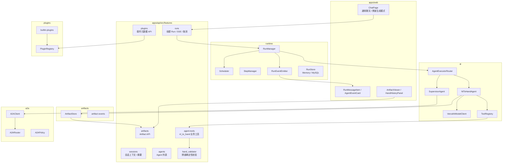
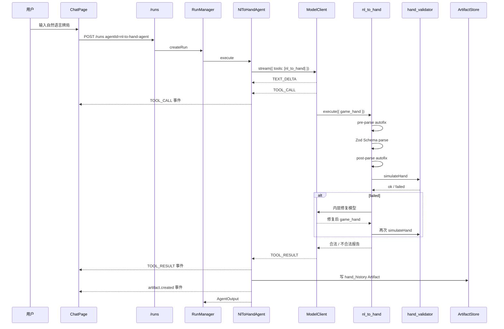

# Agent Frame 框架实现现状与自然语言转牌谱

> 更新时间：2026-06-06  
> 范围：`apps/api`、`apps/web`、`packages/shared` 当前代码实现。  
> 说明：本文档描述的是当前仓库实现状态，不是早期设计稿。自然语言转牌谱已从“业务工具未接线”推进到“专用 Agent + Tool Bridge + Artifact + 前端牌谱模式”的可运行形态。

---

## 1. 文档目的

本文档回答三个问题：

1. 当前项目实际落地了怎样的 Agent Frame 框架设计。
2. 当前框架实现最致命的 3 个问题是什么，以及如何优化。
3. 自然语言转牌谱从用户输入到牌谱 Artifact 的完整实现流程是什么。

---

## 2. 当前项目实现的框架设计

### 2.1 总体定位

`agent-frame` 当前已经不是单一聊天 Demo，而是一个面向 MVP 的 Agent 应用框架。它把一次用户请求抽象为 `Run`，把执行过程拆成 `Step` 和 `AgentEvent`，再通过 `ModelClient`、`ToolRegistry`、`A2A`、`Artifact`、`Workflow`、`Memory`、`PluginRegistry` 等模块组织可扩展能力。

当前最重要的设计取向是：

- `RunManager` 负责生命周期，而不是某个具体 Agent 自己管理状态。
- `AgentExecutorRouter` 根据 `agentId` 选择业务 Agent。
- `ModelClient` 隔离 Vercel AI SDK，框架层尽量不直接暴露供应商 SDK 类型。
- `ToolRegistry` 管理运行时工具，`PluginRegistry` 管理可发现元数据。
- `Artifact` 承载结构化结果，避免把所有业务结果压成纯文本。
- 前端通过 Run SSE 事件驱动展示，不直接感知后端内部步骤。

### 2.2 分层架构



### 2.3 一次 Run 的通用运行流程

```txt
用户在前端输入消息
  → POST /runs
  → runs.service 构建 Run 输入
  → ConversationContextBuilder 组装会话上下文
  → RunManager 创建 Run
  → Scheduler 调度执行
  → AgentExecutorRouter 根据 agentId 分发
      ├─ supervisor-agent：默认通用聊天 / A2A 调度
      └─ nl-to-hand-agent：自然语言转牌谱专用链路
  → Agent 执行期间创建 Step、发送 AgentEvent
  → EventEmitter 写入 RunStore，并通过 SSE / WebSocket 推给前端
  → Agent 输出文本或 Artifact
  → Run 完成，前端展示最终回答和产物
```

### 2.4 当前核心模块状态

| 模块 | 当前状态 | 关键文件 |
|------|----------|----------|
| Run 生命周期 | 已实现创建、执行、取消、状态流转 | `apps/api/src/runtime/run-manager.ts` |
| Step / Event | 已实现模型调用、工具调用、Artifact 事件追踪 | `runtime/step-manager.ts`、`runtime/event-emitter.ts` |
| Agent 路由 | 已支持按 `agentId` 分发 | `apps/api/src/ai/agents/agent-executor-router.ts` |
| A2A | 已支持同步/异步 Agent 调用与策略限制 | `apps/api/src/a2a/` |
| ModelClient | 已隔离 Vercel AI SDK，并支持 tools / maxSteps / stream tool events | `apps/api/src/ai/model-client/` |
| ToolRegistry | 已有通用 `AgentToolDefinition` 与 `nl_to_hand` 桥接 | `apps/api/src/ai/tools/` |
| Artifact | 已支持 Memory / MySQL 存储和版本 | `apps/api/src/artifacts/` |
| PluginRegistry | 已注册 Agent / Tool / Workflow / ArtifactType 元数据 | `apps/api/src/plugins/` |
| Session Context | 已支持摘要、最近轮次、Artifact 轻量引用 | `apps/api/src/features/sessions/` |
| Frontend Chat | 已支持通用聊天和牌谱生成模式 | `apps/web/src/features/chat/ChatPage.tsx` |
| Frontend Events | 已支持 `nl_to_hand` 工具事件展示 | `apps/web/src/features/runs/AgentEventCard.tsx` |
| Frontend Artifact | 已支持 `hand_history` 专用面板 | `apps/web/src/features/artifacts/HandHistoryPanel.tsx` |

### 2.5 当前已注册的主要 Agent

| Agent | 用途 | 入口 |
|-------|------|------|
| `supervisor-agent` | 默认通用调度 Agent | 通用聊天模式 |
| `research-agent` | 研究分析 | A2A / Workflow |
| `summary-agent` | 内容总结 | A2A / Workflow |
| `nl-to-hand-agent` | 自然语言转牌谱 | 牌谱生成模式 |
| `outline-agent` / `writing-agent` / `review-agent` | 创意写作示例插件 | creative-writing Workflow |

---

## 3. 当前框架实现最致命的 3 个问题

### 问题 1：入口分裂，通用聊天无法稳定触发专业能力

#### 现象

当前前端通过模式切换决定 `agentId`：

```txt
通用聊天 → supervisor-agent
牌谱生成 → nl-to-hand-agent
```

这意味着用户如果在通用聊天里输入“一手 6 人桌 AKs 3bet pot 帮我转成牌谱”，默认仍会进入 `supervisor-agent`，而不是自然语言转牌谱链路。虽然 `container.ts` 中已经注册了 `nl-to-hand-agent`，但通用调度 Agent 并没有稳定的意图识别与转发策略。

#### 为什么致命

这是产品入口层面的断裂。框架内部已经具备专业 Agent、Tool、Artifact，但用户必须知道“我应该切换模式”，否则能力不可达。对于真实产品，这是比某个内部模块不优雅更严重的问题。

#### 优化方案

短期可以在 `SupervisorAgent` 规划阶段加入 `needsHandHistory` 分支。当识别到德州扑克局描述、牌谱、手牌、flop/turn/river、下注线等关键词时，通过 A2A 调用 `nl-to-hand-agent`，并把结果回传给用户。

中期应引入会话级 `agentMode` 或 `capabilityMode`，让用户选择一次后持久化到 Session，而不是每轮靠前端按钮临时决定。

长期建议引入统一 Capability Router。所有专业能力都以插件能力暴露，Router 根据意图、会话状态和权限选择 Agent / Tool / Workflow，而不是让前端硬编码每个业务 Agent。

### 问题 2：同步链路中嵌套 LLM Tool，超时与可观测性风险很高

#### 现象

自然语言转牌谱当前链路是：

```txt
外层 LLM stream
  → 调用 nl_to_hand tool
  → tool 内部执行 schema / autofix / simulateHand
  → 失败时 tool 内部再调用内层 LLM 修复
  → 外层 LLM 继续输出
```

这个链路在一次 Run / 一条 SSE 请求里串行完成。`tool_nl_to_hand.ts` 中已经把 `MAX_INTERNAL_ROUNDS` 限制为 1，核心原因就是避免内层修复导致 SSE 超时或卡死。

#### 为什么致命

Tool 看起来是一个普通函数，但它内部可能再次调用 LLM。这样会导致三个问题：

- 用户只能看到“卡住”，难以知道当前处于外层生成、工具校验还是内层修复。
- 代理、浏览器、SSE 连接可能先超时，后端实际还在运行。
- 一旦内层修复失败，外层模型可能继续生成看似完整但并不可靠的文本。

#### 优化方案

第一步应把内层修复显式建模为独立 Step，例如 `inner_repair` 或 `tool_repair`，并在每个阶段发送事件：

```txt
正在生成候选牌谱
正在执行确定性校验
正在尝试自动修复
校验通过 / 需要用户补充
```

第二步应把耗时修复从同步 Tool 中拆出来。可以复用现有 `AgentTaskWorker`，让复杂修复成为异步任务：Run 先返回 draft Artifact 和修复中状态，任务完成后再推送新的 ArtifactVersion。

第三步应扩大 `autofix_pipeline` 的确定性修复覆盖面，尽量让常见字段别名、牌面格式、位置标签、盲位、行动金额问题在本地解决，降低内层 LLM 触发率。

### 问题 3：会话上下文缺少结构化业务状态，多轮改牌谱容易漂移

#### 现象

`ConversationContextBuilder` 当前原则是：

```txt
只加载用户/助手最终文本
不加载 tool 输出
不加载 event JSON
Artifact 只放引用与短摘要
```

这对通用聊天是合理的，但对牌谱编辑不够。用户第二轮说“把 flop 改成 Ac7d2s，turn 改成 9h”时，系统需要上一轮完整 `game_hand`。当前 `NlToHandAgent` 给 `nl_to_hand` 的 `messages` 仍是空数组，内层历史也默认 `historicalN = 0`，因此多轮修改更依赖外层模型从文本摘要重新推断，容易丢字段、改错座位或产生新牌谱。

#### 为什么致命

自然语言转牌谱不是一次性问答，而是强结构化对象的多轮构建与修正。没有结构化状态，后续“补充”“修改”“沿用上一手”都会不稳定。

#### 优化方案

短期可在 `NlToHandAgent` 中读取最近一个 `HAND_HISTORY` Artifact，并在 prompt 中注入压缩后的 `gameHand` 摘要。

中期应支持 `artifactId` 驱动的 patch 模式：

```txt
用户：把 turn 改成 9h
前端携带 artifactId
后端加载完整 hand_history
LLM 只生成 patch 或新 game_hand
工具校验新版本
写入新的 ArtifactVersion
```

长期可以把 `hand_history` 作为会话内的业务状态，而不仅是展示产物。会话上下文中保留最近牌谱引用，Agent 根据引用加载完整内容，避免把大 JSON 全塞进 prompt。

---

## 4. 当前框架优化路线

### 4.1 入口统一

建议新增能力路由层：

```txt
用户输入
  → Intent / Capability Router
  → 判断是否需要 hand_history / research / summary / writing
  → 选择 Agent 或 Workflow
  → RunManager 统一执行
```

最小实现可以先放在 `SupervisorAgent` 中，识别牌谱意图后 A2A 调用 `nl-to-hand-agent`。更干净的实现是把 Router 独立出来，减少 `SupervisorAgent` 继续膨胀。

### 4.2 Tool 执行拆阶段

当前 `ModelClient.stream({ tools })` 已经能把 AI SDK 的 `tool-call`、`tool-result` 转为框架事件。下一步应把 Tool 内部阶段也事件化：

```txt
tool.call
tool.progress: pre_parse_autofix
tool.progress: schema_validate
tool.progress: simulate_hand
tool.progress: inner_repair
tool.result
```

这样前端 Timeline 能看到真正耗时点，也方便后续统计成功率、错误类型和耗时分布。

### 4.3 Artifact 从展示产物升级为业务状态

`hand_history` 不应只作为完成后展示的 Markdown 附件。它应该成为后续多轮编辑的状态锚点：

- 每次成功校验写入新 ArtifactVersion。
- draft 失败也保留候选和错误路径。
- 用户继续修改时基于 ArtifactVersion 生成 patch。
- 前端 HandHistoryPanel 提供“基于此牌谱继续修改”入口。

### 4.4 测试补齐

当前已有 `autofix_pipeline`、`hand_validator`、`tool-bridge` 等测试，但还缺完整端到端测试。建议补齐：

- Run 创建：`agentId=nl-to-hand-agent`。
- 模拟 ModelClient tool call / tool result。
- 验证 `TOOL_CALL`、`TOOL_RESULT`、`artifact.created` 事件。
- 验证成功时产生 `HAND_HISTORY` Artifact。
- 验证失败时产生 draft Artifact 和明确追问。

---

## 5. 自然语言转牌谱的实现流程

### 5.1 业务目标

自然语言转牌谱的目标是把用户描述的一手德州扑克牌局转换为结构化 `game_hand`，再通过确定性引擎校验，最后生成可展示、可保存、可继续修改的 `hand_history` Artifact。

典型用户输入：

```txt
6 人桌，盲注 1/2，Hero UTG 拿 AhAs open 到 6，后面都弃牌，帮我生成牌谱。
```

目标输出不是普通聊天文本，而是：

- 标准 `game_hand` JSON。
- 校验状态：合法 / 不合法。
- 引擎结算结果。
- Markdown 牌谱摘要。
- `HAND_HISTORY` Artifact。

### 5.2 前端入口

前端文件：`apps/web/src/features/chat/ChatPage.tsx`

用户可以选择两种模式：

```txt
通用聊天 → agentId: supervisor-agent
牌谱生成 → agentId: nl-to-hand-agent
```

提交时调用：

```txt
POST /runs
{
  input: { message },
  agentId: "nl-to-hand-agent",
  sessionId
}
```

因此当前牌谱链路已经可以从 UI 触发，但前提是用户切换到“牌谱生成”模式。

### 5.3 Run 创建与 Agent 分发

后端 Run 入口在 `features/runs`。创建 Run 时会构建会话上下文，然后进入 `RunManager`。

分发逻辑由 `AgentExecutorRouter` 负责：

```txt
agentId = nl-to-hand-agent
  → NlToHandAgent.execute()
```

这一步是当前项目区别于早期文档的关键变化：`nl_to_hand` 不再只是孤立工具，而是有了专用业务 Agent 作为入口。

### 5.4 NlToHandAgent 外层编排

核心文件：`apps/api/src/ai/agents/nl-to-hand.agent.ts`

`NlToHandAgent` 做 6 件事：

1. 提取用户消息。
2. 拼接扑克专用外层 prompt。
3. 从 `ToolRegistry` 构建 `nl_to_hand` 工具。
4. 调用 `modelClient.stream({ tools: [nlToHandTool], maxSteps: 3 })`。
5. 把模型流事件映射成框架 `MESSAGE_DELTA`、`TOOL_CALL`、`TOOL_RESULT`。
6. 根据工具结果写入 `HAND_HISTORY` Artifact。

流程如下：

```txt
NlToHandAgent.execute
  → buildPrompt(userMessage, conversationContext)
  → toolRegistry.build("nl_to_hand")
  → modelClient.stream({
      model: "deepseek.chat",
      system: POKER_OUTER_SYSTEM_PROMPT,
      prompt,
      tools: [nlToHandTool],
      maxSteps: 3
    })
  → 接收 TEXT_DELTA / TOOL_CALL / TOOL_RESULT
  → 写 Step 和 AgentEvent
  → 生成 Artifact
```

### 5.5 Tool Bridge

核心文件：

- `apps/api/src/ai/tools/tool-factory.ts`
- `apps/api/src/ai/tools/nl-to-hand-tool.ts`
- `apps/api/src/ai/model-client/vercel-ai-model-client.ts`

当前项目已经引入通用 `AgentToolDefinition`：

```txt
AgentToolDefinition
  → toToolFactory
  → ToolRegistry.register("nl_to_hand")
  → ModelClient.stream({ tools })
  → Vercel AI SDK tool()
```

也就是说，`features/agent-tools/tool_nl_to_hand.ts` 里的业务工具，已经通过 `ai/tools/nl-to-hand-tool.ts` 桥接进框架运行时工具体系。

同时，`builtin-plugins.ts` 也注册了 `nl_to_hand` 的插件元数据，使 `/plugins/tools` 能发现它。但要注意：`PluginRegistry` 仍主要负责元数据发现，真正执行仍走 `ToolRegistry` 和 `ModelClient`。

### 5.6 外层 LLM 的职责

外层 LLM 使用 `POKER_OUTER_SYSTEM_PROMPT` 和 `NL_TO_HAND_DESCRIPTION`，职责不是直接判断牌局是否合法，而是：

1. 阅读用户自然语言。
2. 识别人数、盲注、位置、手牌、公共牌、行动线。
3. 按 `LatestHandSchema` 构造候选 `game_hand`。
4. 调用 `nl_to_hand` 工具。
5. 根据工具返回的合法性结果生成用户可读答案。

外层模型必须把合法性判断交给工具和引擎，而不是自己脑补。

### 5.7 nl_to_hand 工具内部流程

核心文件：`apps/api/src/features/agent-tools/tool_nl_to_hand.ts`

工具入参：

```typescript
{
  _reasoning?: string
  game_hand: unknown
}
```

内部流程：

```txt
createNlToHandTool.execute({ game_hand })
  → runPreParseAutoFix(game_hand)
  → LatestHandSchema.safeParse(fixed)
  → runPostParseAutoFix(parsed)
  → simulateHand(baselineHand)
      ├─ ok: buildSuccessResponse
      └─ failed: 进入内层修复
  → 内层 generateText + Output.object(LatestHandSchema)
  → 再跑 autofix + simulateHand
  → 返回合法结果或结构化失败报告
```

### 5.8 autofix_pipeline

核心文件：`apps/api/src/features/agent-tools/autofix_pipeline.ts`

当前 autofix 分两段：

```txt
runPreParseAutoFix
  → Schema 之前执行
  → 修字段别名、牌面格式、动作别名、数值类型、位置别名

runPostParseAutoFix
  → Schema 之后执行
  → 修派生盲位、position_tag、玩家名称、无效 amount 等
```

设计原则是只修高确定性问题，不自动改事实性冲突。例如重复牌通常不应该由 autofix 随机改掉，而应交给校验器报错或让用户确认。

### 5.9 牌谱校验引擎

核心目录：`apps/api/src/features/hand_validator/`

校验不是 LLM 判断，而是确定性模拟：

| 层级 | 模块 | 职责 |
|------|------|------|
| Layer 1 | `LatestHandSchema` | JSON 结构、字段类型、枚举约束 |
| Layer 2 | `hand_pre_validator` | 座位、筹码、牌面唯一性、基础语义 |
| Layer 3 | `street_manager` / `action_translator` | 行动顺序、下注轮闭合、街道推进 |
| Layer 4 | `settlement_validator` | 摊牌、底池、结算、筹码守恒 |

对外入口：

```typescript
validateHandHistory(json: unknown): HandValidationResult
simulateHand(hand: LatestHandType): HandValidationResult
```

### 5.10 内层修复回路

当 baseline 校验失败时，工具会进入内层修复：

```txt
校验失败
  → 构造内层修复 prompt
  → generateText + Output.object({ schema: LatestHandSchema })
  → 得到修复后的候选 JSON
  → 再次 autofix + simulateHand
  → 成功则返回合法
  → 失败则返回最佳候选、错误码、fix_path、追问指令
```

当前限制：

- `MAX_INTERNAL_ROUNDS = 1`，主要为了防止 SSE 长时间卡住。
- `historicalN = 0`，避免把历史不同手牌的大 JSON 带入修复上下文。
- `NlToHandAgent` 当前传入 `messages: []`，多轮工具轨迹尚未用于内层修复。

这是当前链路可靠性和多轮能力的主要瓶颈之一。

### 5.11 Tool 事件与前端展示

当外层模型调用工具时，`VercelAIModelClient` 会把 AI SDK 事件转换为框架事件：

```txt
text-delta  → MODEL_STREAM_EVENT_TYPES.TEXT_DELTA
tool-call   → MODEL_STREAM_EVENT_TYPES.TOOL_CALL
tool-result → MODEL_STREAM_EVENT_TYPES.TOOL_RESULT
finish      → MODEL_STREAM_EVENT_TYPES.MODEL_COMPLETED
error       → MODEL_STREAM_EVENT_TYPES.MODEL_FAILED
```

`NlToHandAgent` 再把这些事件写成 Run 事件：

```txt
MESSAGE_DELTA
TOOL_CALL
TOOL_RESULT
ARTIFACT_CREATED
ARTIFACT_VERSION_CREATED
```

前端 `AgentEventCard` 对 `nl_to_hand` 做了摘要展示，包括人数、BB、Hero、行动数、街道、错误码、fixPath、askUser 等。

### 5.12 Artifact 持久化

成功或接近完整失败时，`NlToHandAgent` 会写入 `hand_history` Artifact。

Artifact 内容通常包括：

```typescript
{
  rawUserText: string
  gameHand: object
  validation: {
    status: "valid" | "draft"
    toolOutputText: string
  }
  renderedMarkdown: string
}
```

成功状态：

```txt
status = valid
```

失败但有候选：

```txt
status = draft
```

前端 `ArtifactViewer` 会根据 `ARTIFACT_TYPES.HAND_HISTORY` 使用 `HandHistoryPanel` 展示，而不是走通用 JSON 面板。

### 5.13 完整时序图



---

## 6. 当前完成度判断

| 能力 | 当前状态 | 说明 |
|------|----------|------|
| 专用 `NlToHandAgent` | 已完成 | 可作为 Run 入口 |
| 前端牌谱模式 | 已完成 | 通过按钮传 `agentId=nl-to-hand-agent` |
| Tool Bridge | 已完成 | `AgentToolDefinition` + `ToolRegistry` + `ModelClient.stream({ tools })` |
| `nl_to_hand` 工具本体 | 已完成核心链路 | 包含 schema、autofix、simulate、内层修复 |
| Artifact 化 | 已完成 | 成功/失败候选写 `hand_history` |
| 前端工具事件展示 | 已完成 | `AgentEventCard` 已有专用摘要 |
| 前端牌谱面板 | 已完成 | `HandHistoryPanel` |
| 通用聊天自动识别牌谱 | 未完成 | 仍需手动切换模式或 Supervisor 转发 |
| 多轮结构化改牌谱 | 未完成 | 缺 artifact patch 模式 |
| 长耗时修复稳定性 | 部分完成 | 通过限制轮次规避，但还不是根治 |
| 完整 Run 级集成测试 | 不足 | 已有工具桥接/校验测试，但端到端还需补齐 |

---

## 7. 关键文件索引

### 框架核心

| 文件 | 说明 |
|------|------|
| `apps/api/src/container.ts` | 依赖组装、Agent 注册、Plugin 注册 |
| `apps/api/src/runtime/run-manager.ts` | Run 生命周期核心 |
| `apps/api/src/runtime/step-manager.ts` | Step 创建、完成、失败 |
| `apps/api/src/runtime/event-emitter.ts` | AgentEvent 写入与广播 |
| `apps/api/src/ai/agents/agent-executor-router.ts` | 按 `agentId` 分发 Agent |
| `apps/api/src/ai/model-client/vercel-ai-model-client.ts` | 模型调用、stream、tool 事件映射 |
| `apps/api/src/ai/tools/tool-factory.ts` | ToolRegistry 与 AgentToolDefinition |
| `apps/api/src/plugins/plugin-registry.ts` | 插件元数据注册与发现 |
| `apps/api/src/features/sessions/conversation-context.builder.ts` | 会话上下文构建 |

### 自然语言转牌谱

| 文件 | 说明 |
|------|------|
| `apps/api/src/ai/agents/nl-to-hand.agent.ts` | 自然语言转牌谱专用 Agent |
| `apps/api/src/ai/tools/nl-to-hand-tool.ts` | `nl_to_hand` 框架 Tool Bridge |
| `apps/api/src/features/agent-tools/tool_nl_to_hand.ts` | 牌谱工具核心逻辑 |
| `apps/api/src/features/agent-tools/autofix_pipeline.ts` | 确定性自动修复 |
| `apps/api/src/features/agent-tools/poker-prompt-provider.ts` | 扑克专用 PromptProvider |
| `apps/api/src/features/hand_validator/index.ts` | 牌谱校验入口 |
| `apps/api/src/features/hand_validator/simulator/hand_simulator.ts` | 四层校验总入口 |
| `apps/api/src/plugins/builtin-plugins.ts` | `nl-to-hand-agent`、`hand_history`、`nl_to_hand` 元数据 |
| `apps/web/src/features/chat/ChatPage.tsx` | 通用/牌谱模式切换 |
| `apps/web/src/features/runs/AgentEventCard.tsx` | 工具事件展示 |
| `apps/web/src/features/artifacts/HandHistoryPanel.tsx` | 牌谱 Artifact 展示 |
| `apps/api/tests/unit/ai/tool-bridge.test.ts` | Tool Bridge 单元测试 |
| `apps/api/tests/unit/agent-tools/autofix_pipeline.test.ts` | autofix 单元测试 |
| `apps/api/tests/unit/hand_validator.test.ts` | 校验引擎单元测试 |

---

## 8. 总结

当前项目的框架主链路已经基本成型：`Run → AgentExecutorRouter → Agent → ModelClient/ToolRegistry → Step/Event → Artifact → 前端展示`。自然语言转牌谱也已经完成了从早期孤立工具到专用 Agent 的关键接入，牌谱生成模式下可以走通外层 LLM、`nl_to_hand` 工具、确定性校验、Artifact 和前端展示。

当前最需要继续优化的不是“能不能调用工具”，而是三个更偏生产化的问题：通用入口如何自动触发牌谱能力、长耗时嵌套 LLM 修复如何拆阶段和异步化、多轮修改如何基于结构化 Artifact 状态而不是纯文本上下文。把这三点补齐后，`nl_to_hand` 才能从“可演示链路”升级为“稳定可用的业务能力”。
