# tableId 路由 Game 服调整方案

> 背景：K8s 环境下 Pod IP 动态变化，而游戏的 `tableId` 编码了建桌时的 Pod IP 并持久化至 MySQL，导致 Pod 重启后旧 `tableId` 永久失效、用户卡死。

---

## 一、现状痛点

当前 `tableId` 格式：`ipHex(8位) + portHex(4位) + "_" + snowflakeId`，例如：

```
0a2a00e80fa0_115147576394661893
└──────────┘
IP:Port 编码（建桌时 Pod IP，写入 MySQL 后永久固化）
```

问题链：

1. 复式比赛 `create_table` → 选 Game 服 → `randTableId()` 把当前 Pod IP 烧入 tableId → 写入 MySQL
2. Pod 重启 → 新 IP 分配 → 旧 IP 不再可达
3. 后续重连 / 操作 → 从 MySQL 读旧 tableId → decode 出旧 IP → RPC 超时或拒绝连接 → 用户永久卡死

**核心矛盾**：tableId 同时充当"业务持久标识"（不能变）和"物理路由地址"（因 Pod 重启而变），两者产生冲突。

---

## 方案一：K8s 基础设施层 — Service ClusterIP

**适用场景**：有 K8s 运维资源，愿意调整部署拓扑。

### 原理

K8s Service 的 ClusterIP 在 Service 对象存续期间永不改变。Pod 重启后 K8s 会自动将流量导向新 Pod，应用层对 IP 漂移零感知。

### 改造内容

**运维侧（K8s）**：

- 为每个 Game Pod 创建专属 Service（可通过 StatefulSet + Headless Service 实现每 Pod 固定 DNS，或直接创建 ClusterIP Service）
- 将 Service ClusterIP 以 `SERVICE_IP` 环境变量注入对应 Pod

**代码侧（1 行）**：

```typescript
// src/feature/game_server/session_manager.ts  L1764
// 修改前
const pod_ip: string = process.env.POD_IP || "127.0.0.1";
// 修改后
const pod_ip: string =
  process.env.SERVICE_IP || process.env.POD_IP || "127.0.0.1";
```

### 效果

```
建桌：tableId 编码 Service ClusterIP（稳定）
Pod 重启：ClusterIP 不变，K8s 自动导流到新 Pod
后续路由：decode tableId → ClusterIP → K8s 转发 → 新 Pod 接收 ✓
```

### 优劣

| 优点                                   | 缺点                                                                        |
| -------------------------------------- | --------------------------------------------------------------------------- |
| 代码改动仅 1 行                        | 需要 K8s 运维配合配置                                                       |
| tableId / 数据库无需任何变化           | ClusterIP 需要手动注入到 Pod env（K8s 不原生支持 fieldRef 获取 Service IP） |
| 从根本上解决问题，无任何 fallback 逻辑 | 强依赖 K8s 特性，本地开发需要模拟                                           |

---

## 方案二：业务层 — 客户端携带路由 Token

**适用场景**：不引入 K8s 改动，彻底消除每次 action 请求的 Redis 查询开销，追求更简洁的架构。

### 原理

将路由信息从「服务端存储 + 每次查询」改为「一次性下发给 Client + 后续携带」。建桌成功后，Web 服将当前 Game 服的 IP:port 打包为**服务端签名的 routeToken** 返回给 Client。Client 在每次操作请求中原样携带该 token，Web 服本地验签后直接路由，无需任何 Redis 查询。

> **核心变化**：无需维护路由表，路由职责从「服务端存储」转移到「Client 携带」；tableId 不再编码 IP，回归纯业务标识。

### tableId 格式调整

路由信息已完全转移到 routeToken，tableId 不再承担寻址职责，格式去掉 IP 前缀：

```
旧格式：0a2a00e80fa0_115147576394661893   ← IP:Port hex + snowflakeId
新格式：tableid_115147576394661893        ← "tableid_" 前缀 + snowflakeId
```

- 生成逻辑：`game_utils.ts` 中 `randTableId()` 改为 `"tableid_" + snowflakeId()`
- tableId 只作为业务主键，与任何物理 IP 完全解耦

### Redis 数据结构

只需 `game:serverList` 一张表，用于建桌和重建时选服：

| 项目      | 值                                                    |
| --------- | ----------------------------------------------------- |
| **Key**   | `game:serverList`（固定，全局唯一）                   |
| **类型**  | Hash（字段级 TTL，需 Redis 7.4+ `hsetex` 支持）       |
| **Field** | JSON 字符串，格式：`{"ip":"10.42.0.232","port":4000}` |
| **Value** | 该 Game 服当前承载的桌子数                            |
| **TTL**   | 字段级 TTL = 15000ms，Game 服每 3 秒刷新一次          |
| **用途**  | 仅用于建桌 / 重建时选服，不参与常规路由               |

```
game:serverList (Hash)
  field: '{"ip":"10.42.0.232","port":4000}'  →  value: "3"   TTL: 15s
  field: '{"ip":"10.42.0.150","port":4000}'  →  value: "5"   TTL: 15s
```

### routeToken 规格

```
routeToken = HMAC_JWT.sign(
  { ip: "10.42.0.232", port: 4000, tableId: "tableid_115147576394661893" },
  SERVER_SECRET
)
```

- 由 Web 服签发，Server Secret 存于服务端配置，Client 无法伪造
- token 内容客户端**无需解析**，原样透传即可（可对 payload 加密）
- token 不设过期时间，依赖 RPC 失败触发更新

```
输入：tableId + routeToken（Client 携带）
  ↓
JWT.verify(routeToken, SECRET)
  → 验签失败：返回 ERR_INVALID_TOKEN（Client 需重新发起 create_table）
  → 验签成功：解析 { ip, port }
  ↓
直接向 {ip, port} 发起 RPC（无 Redis 查询）
  → RPC 成功：正常响应
  → RPC 失败：返回 ERR_GAME_SERVER_UNAVAILABLE（Client 重新发起 create_table）
```

### 时序图（普通 AI 练习场）

> 以下时序图以**普通 AI 练习场建桌流程**为例，展示 routeToken 机制的核心工作方式。

#### 阶段一：Game 服启动与注册

> 心跳只维护 `game:serverList`，无路由表需要刷新。

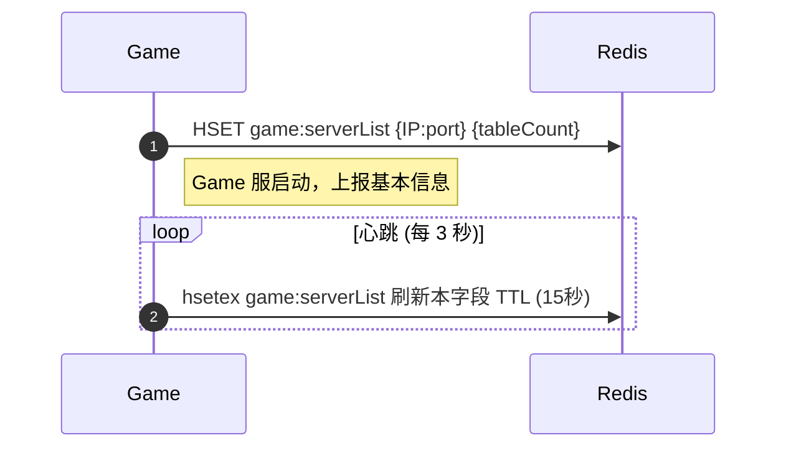

#### 阶段二：首次建桌 (create_table)

> 从 Redis 选服 → 生成新 tableId → RPC `create_table` → 生成并下发 routeToken。

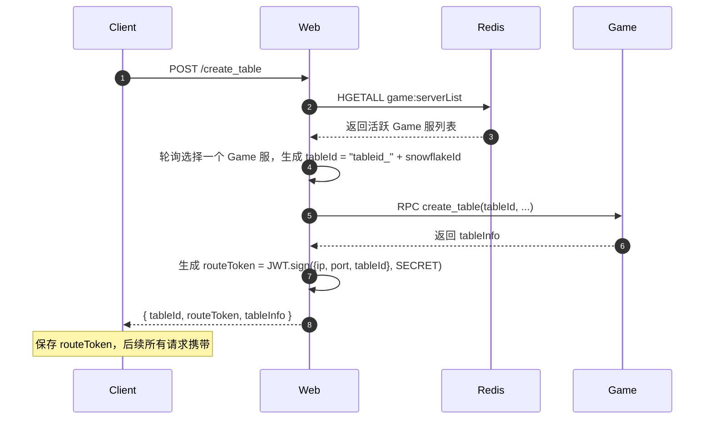

#### 阶段三：玩家操作（正常情况）

> Client 携带 routeToken，Web 本地验签后直接路由，不查询任何 Redis。

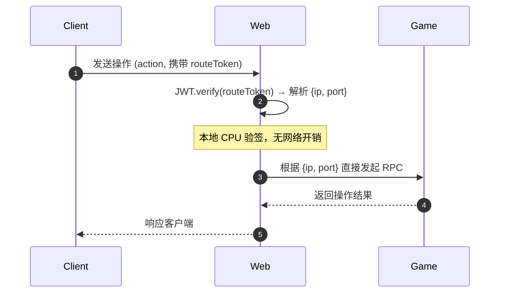

#### 阶段四：Game 宕机后的操作失败

> RPC 超时直接确认宕机，直接向客户端报错。客户端自行重新进入建桌流程。
> ⚠️ Web 层需将以下情况**统一**映射为 `ERR_GAME_SERVER_UNAVAILABLE` 返回给客户端：TCP 连接拒绝/超时；Game 服返回业务层 `ERR_TABLE_NOT_FOUND`（进程原地重启/IP 复用导致内存丢失）。

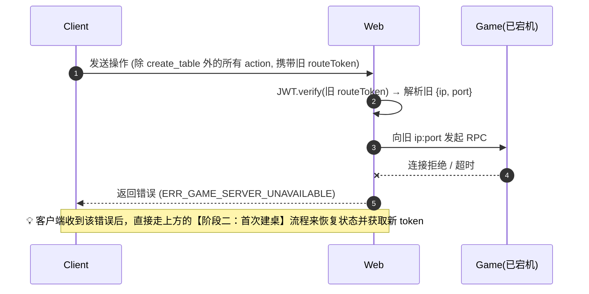

#### 阶段五：Game 进程原地重启（IP 不变，内存清空）

> K8s 在同一 Pod IP 原地拉起新进程后，旧 routeToken 中的 ip:port 网络可达，但桌子内存已丢失。Game 服会返回业务层错误 `ERR_TABLE_NOT_FOUND`。Web 层需将此等同于宕机处理，向客户端报 `ERR_GAME_SERVER_UNAVAILABLE`，触发客户端走 `create_table` 重建流程。

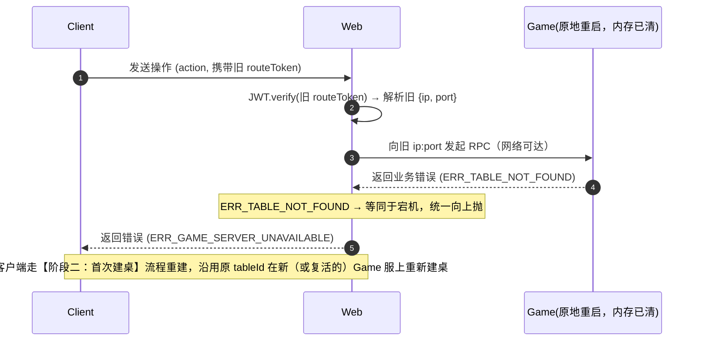

#### 阶段六：选服时命中幽灵节点（create_table 内部重试）

> 建桌选服时，Redis 中仍存有一个刚宕机（< 15s）的 Game 服心跳记录。Web 选中后发起 `create_table` RPC 直接超时。Web 层须**在内部重试**：将该节点标记为失败，从列表中剔除后换选下一个健康节点，而不是把错误直接暴露给客户端。

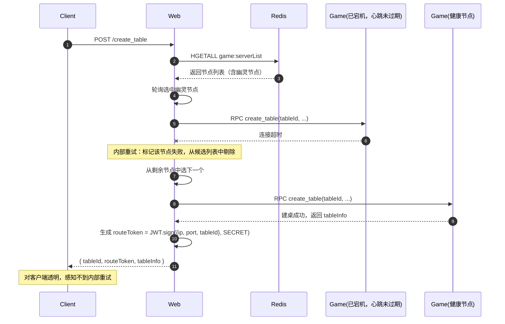

#### 阶段七：Game 重启后持久化恢复 `（可选增强，当前未实现，持久化时机待定）`

> **前提**：tableId 已与 Game 服物理地址完全解耦，恢复时可调度到**任意**健康 Game 服，只需重新签发 routeToken 即可。持久化写入时机待定（暂以"每次牌桌状态变更时异步写入"为占位描述）。
> **注意**：普通 AI 练习场宕机后，客户端走 create_table 全新建桌（游戏状态重置）是可接受行为，阶段七是锦上添花的增强，不是当前方案的必要组成部分。

##### 子流程 A：牌桌状态持久化写入

> Game 服每次状态变更后，异步将 table 快照写入 Redis（或 MySQL），供重建时使用。

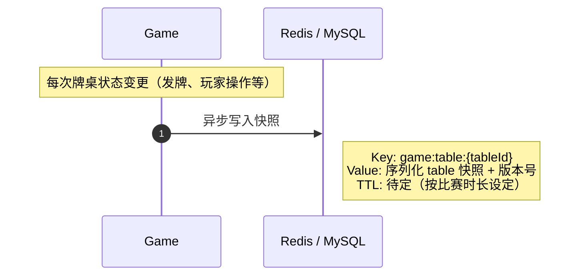

##### 子流程 B：Game 重启后客户端触发恢复

> Game 服宕机或重启后，Client 收到 `ERR_GAME_SERVER_UNAVAILABLE`，携带原 tableId 发起 `create_table` 重建请求。Web 层从持久化存储加载快照，调度到任意健康 Game 服恢复状态，并签发新 routeToken。

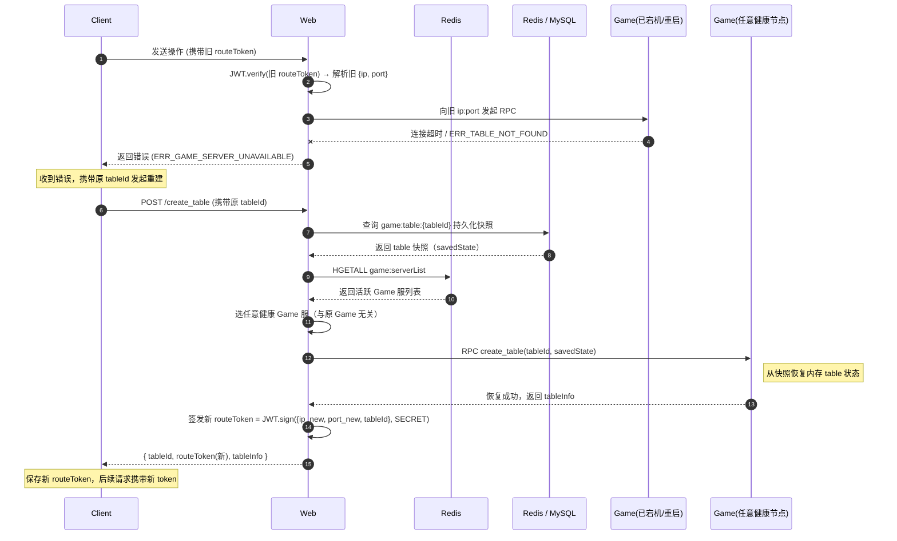

> **关键点**：
>
> - tableId 保持不变，业务连续性完整保留
> - 新 routeToken 中的 ip:port 指向新 Game 服，旧 token 自动作废
> - 选服策略与首次建桌完全相同，无需任何"桌子归属"信息
> - `create_table` RPC 增加可选参数 `savedState`：有值时走恢复路径，无值时走新建路径

### 时序图（复式比赛）

> 基于 `DuplicateMatchService.startHand() / resumeActivity()` 的实际代码逻辑，展示新路由方案下的各个场景。

#### 复式比赛路由机制总览

复式比赛所有路由来自**唯一来源**：Client 携带的 `routeToken`（本地 JWT 验签），**无任何服务端路由表**。

| 路由来源                                    | 适用场景                                                                                            | 开销             |
| ------------------------------------------- | --------------------------------------------------------------------------------------------------- | ---------------- |
| Client 携带的 `routeToken`（本地 JWT 验签） | `startHand` 中所有 Game RPC：`is_have_table` / `get_table_wait_hero` / `next_game` / `create_table` | 本地 CPU，零网络 |

**关键不变量**：每次 `create_table` 成功后，向 Client 签发新 routeToken：

```
routeToken = JWT.sign({ ip, port, tableId }, SECRET)
```

> - `resumeActivity` 是**纯 MySQL 元数据查询**，不接触任何 Game 服，不需要路由信息
> - `entry.tableId == null`（真首手）时 Client 无 routeToken，`startHand` 走场景一（新建）
> - `entry.tableId != null` 但 Client 本地 token 丢失时，`startHand` 无法做 is_have_table，直接走场景四重建路径（安全且幂等）

---

#### 复式比赛场景一：首手建桌

> `entry.tableId == null`，需要选服并首次创建牌桌。

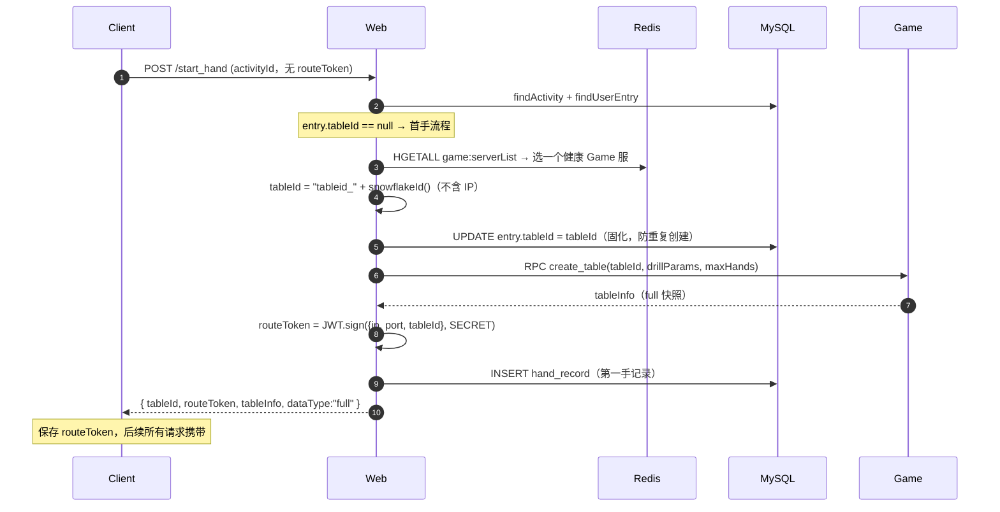

> ⚠️ **并发安全（首手建桌同样存在）**：同一玩家因网络抖动发出并发重复请求时，两次请求均读到 `entry.tableId == null`，各自生成不同的 tableId 并各自发出 `create_table` RPC，导致两张桌子同时被建出来（其中一张成为游魂桌，永远不可达）。
>
> 现有的 `UPDATE entry.tableId = tableId` **不能**防住此问题——两个请求都能成功写入，只是 DB 最终值以最后写入者为准，但两个 `create_table` RPC 都已发出。
>
> **推荐解法**：在 `startHand` 入口处统一加 `userId_activityId` 级别的分布式锁，获得锁后立即重读 `entry`，再判断走哪条路径。一把锁覆盖所有场景：
>
> - `entry.tableId == null` → 首手新建（场景一）
> - `entry.tableId != null` + is_have_table 成功 → 重连或 next_game（场景二/三）
> - `entry.tableId != null` + is_have_table 失败 → 宕机重建（场景四）
>
> 每个玩家独立锁（不同 `userId_activityId` 不争抢），锁持有时间约等于一次 RPC 耗时，实际争用概率极低。可复用项目现有分布式锁工具，见 `src/utils/AGENTS.md`。

---

#### 复式比赛场景二：断线重连（手牌进行中）

> `entry.tableId != null`，Client 携带 `routeToken`，Game 正常存活，当前手未结束。

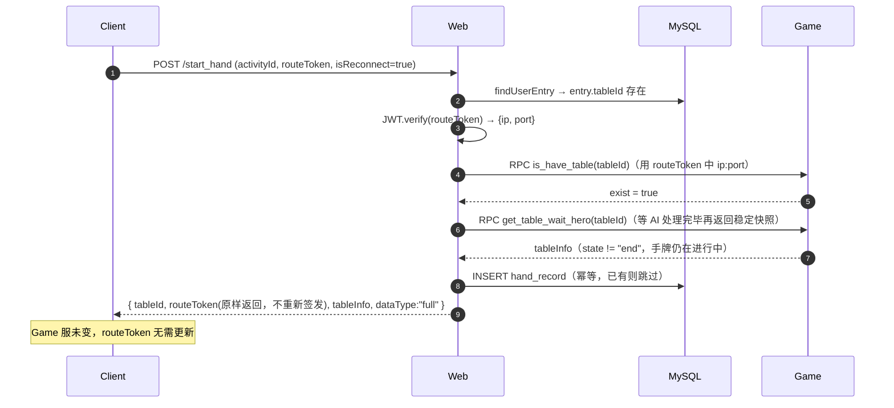

---

#### 复式比赛场景三：正常推进下一手（手牌已结束）

> `entry.tableId != null`，Game 存活，当前手 `state == "end"`，需要 `next_game` 注入新行动线。
> 包含**竞态修正**子逻辑：`max(Game.totalHands, MySQL.completedHandCount)` 确定正确的下一手。

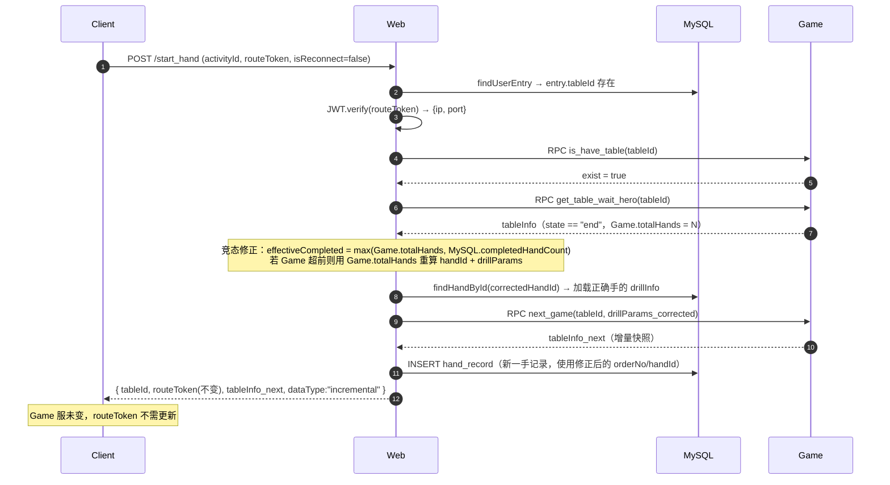

---

#### 复式比赛场景四：宕机重建（Game 服已宕机）

> `entry.tableId != null`，`is_have_table` RPC 超时或拒绝连接，需要在新 Game 服上重建。
> **这是方案二下宕机恢复的核心场景：tableId 不变，路由切换到新 Game 服，重新签发 routeToken。**

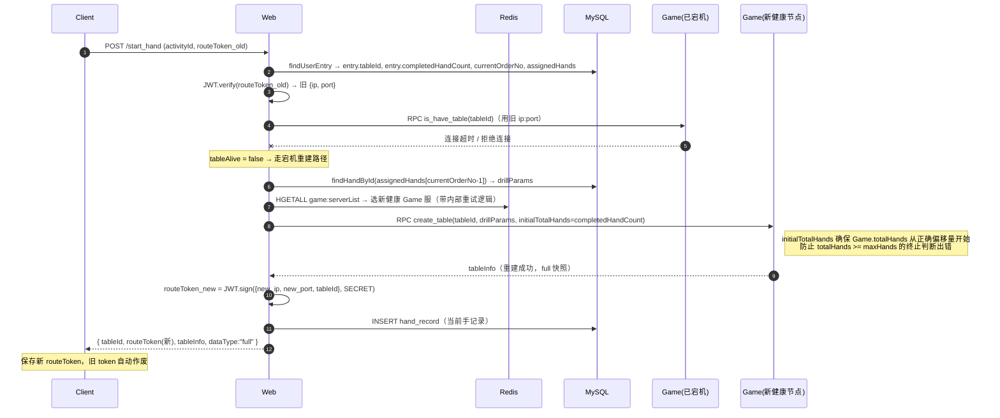

> ⚠️ **并发安全**：复式比赛每个玩家有独立的 `tableId`，不同玩家之间不存在竞争。需要保护的是**同一玩家**因网络抖动等原因发出的并发/重复 `startHand` 请求——两次请求都检测到 `is_have_table=false`，同时尝试重建同一张桌子（脑裂）。锁粒度为 `tableId`，锁内只执行一次选服+建桌+签发新 token；后续抢锁失败的请求等锁释放后，重新进入 `startHand`，此时 `is_have_table` 在新 Game 服上返回 `exist=true`，根据 `get_table_wait_hero` 的 state 决定走场景二（手牌进行中）或场景三（手牌已结束推进下一手）。

---

#### 复式比赛场景五：resumeActivity（断线重连入口）

> Client 重新打开 App 时调用。**纯 MySQL 元数据查询，不联系任何 Game 服，不需要路由信息。**
> table 是否存活的检测完全交由后续 `startHand` 在 routeToken 路由时判断（RPC 超时 = 宕机）。

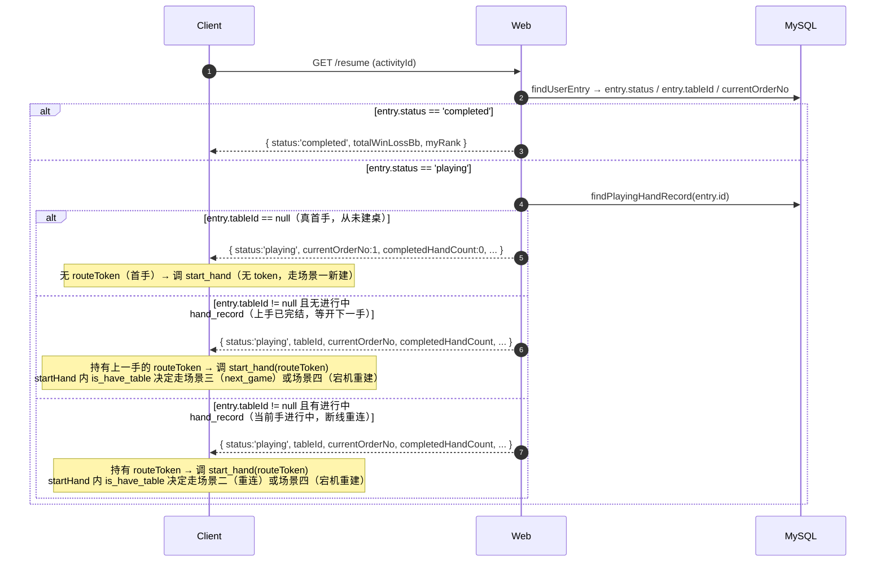

> **设计要点**：`resumeActivity` 不再返回 `tableExists` 字段，table 活跃状态由 `startHand` 通过 RPC 实时判断。这消除了 `resumeActivity` 和 `startHand` 之间的双重检测，并彻底去掉服务端路由表依赖。

---

### 改动范围

| 文件                                                        | 改动内容                                                                                                        | 行数估计    |
| ----------------------------------------------------------- | --------------------------------------------------------------------------------------------------------------- | ----------- |
| `game_utils.ts` `randTableId`                               | 改为生成 `tableid_{snowflakeId}` 格式，去掉 IP 编码                                                             | ~3 行       |
| `game_utils.ts` `getGameServerInfoByTableId`                | **删除**（不再从 tableId decode IP）                                                                            | 删除 ~15 行 |
| `session_manager.ts`                                        | 删除 `create_table` 后写旧路由逻辑；删除心跳中的路由表刷新                                                      | 减少 ~15 行 |
| Web 层公共路由工具                                          | 新增 `signRouteToken(ip, port, tableId)`、`verifyRouteToken(token)`                                             | ~15 行      |
| `duplicate-match/service.ts` `rpcCreateDuplicateMatchTable` | 移除 `getGameServerInfoByTableId` 调用；改为接收显式 `{ip, port}` 参数                                          | ~5 行       |
| `duplicate-match/service.ts` `rpcNextGameDuplicateMatch`    | 同上                                                                                                            | ~5 行       |
| `duplicate-match/service.ts` `rpcGetTableWaitHero`          | 同上                                                                                                            | ~5 行       |
| `duplicate-match/service.ts` `_checkTableExists`            | **删除**（`resumeActivity` 不再检测 table 存活，该方法废弃）                                                    | 删除 ~30 行 |
| `duplicate-match/service.ts` `startHand`                    | 接收客户端传入的 `routeToken`；无 token 时直接走重建路径；`create_table` 成功后签发新 token；宕机重建加分布式锁 | ~20 行      |
| `duplicate-match/service.ts` `resumeActivity`               | 去掉 `_checkTableExists` 调用；去掉 `tableExists` 字段；退化为纯 MySQL 查询                                     | 减少 ~15 行 |
| API 响应结构                                                | `start_hand` 响应增加 `routeToken` 字段；`resume` 响应移除 `tableExists` 字段                                   | ~3 行       |
| Client 协议                                                 | `start_hand` 请求增加 `routeToken?` 字段（首手或 token 丢失时为空，其余必填）                                   | 协议变更    |

> ⚠️ **注意**：
>
> - 需要和客户端协调接口变更（新增/移除字段）。
> - `tableId` 级别的分布式锁（用于宕机重建并发保护）可复用项目现有分布式锁工具，见 `src/utils/AGENTS.md`。

### 优劣

| 优点                                                 | 缺点                                                   |
| ---------------------------------------------------- | ------------------------------------------------------ |
| 所有路由零 Redis 查询，仅本地 JWT 验签               | 需要客户端配合携带 routeToken（接口变更）              |
| tableId 与物理 IP 完全解耦，纯业务标识               | routeToken 需要签名机制，引入密钥管理                  |
| 心跳逻辑极简（只维护 serverList，无路由表）          | 内网 IP:port 经 JWT 传至客户端（建议加密 payload）     |
| 宕机检测最直接（RPC 超时即确认）                     | 更换 Secret 时所有存量 token 立即失效，需 key rotation |
| 宕机重建可调度到任意健康 Game 服，无 Pod 归属约束    | 宕机重建并发场景需分布式锁，引入额外复杂度             |
| `resumeActivity` 退化为纯 MySQL 查询，无 Game 服依赖 | —                                                      |

---

## 综合对比

| 维度                       | 方案一（K8s Service ClusterIP） | 方案二（客户端携带路由 Token）                      |
| -------------------------- | ------------------------------- | --------------------------------------------------- |
| **tableId 格式**           | 不变（依然含 IP 前缀）          | **`tableid_{snowflakeId}`，去掉 IP 前缀**           |
| **数据库迁移**             | 不需要                          | 不需要                                              |
| **代码改动量**             | 极小（1 行）                    | 中（~46 行 + 客户端协议）                           |
| **K8s 运维改动**           | 需要（配置 Service + env 注入） | 不需要                                              |
| **每次 action Redis 查询** | 无                              | **无（本地验签）**                                  |
| **路由准确性**             | 最高（K8s 保障）                | 高（依赖 RPC 超时）                                 |
| **宕机检测速度**           | 即时（K8s 探活）                | 快（RPC 直接超时）                                  |
| **路由表依赖**             | 无                              | **无（不需要路由表）**                              |
| **心跳维护复杂度**         | 低                              | **低（只有 serverList 一张表）**                    |
| **重建逻辑复杂度**         | 无                              | **低（宕机场景统一入口，复式比赛有 5 个状态分支）** |
| **客户端协议变更**         | 无                              | **需要（增加 routeToken 字段）**                    |
| **普通模式影响**           | 无                              | 无                                                  |
| **长期可维护性**           | 高                              | 高                                                  |
| **适用场景**               | 有 K8s 运维资源                 | 不动 K8s，追求零 Redis 路由查询                     |

### 推荐策略

- **短期修复**（不动 K8s，可接受客户端改动）→ **方案二**，消除每次 action 的 Redis 开销，架构简洁
- **中长期根治**（有运维配合）→ **方案一**，代码改动最小，交给 K8s 基础设施保障
