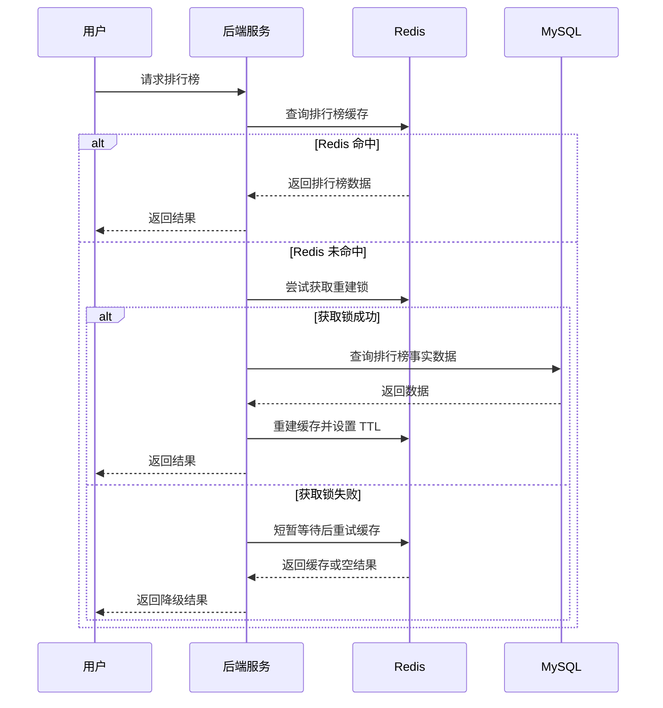
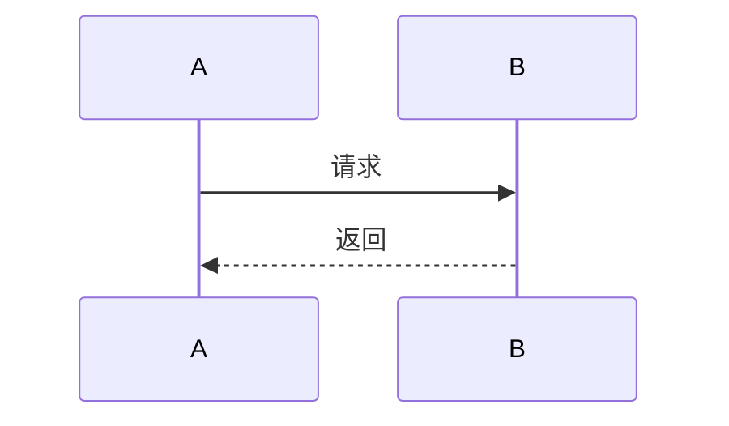

# Redis 知识点学习模板：证据标注版

## 一、使用目标

这个模板用于学习、整理和输出 Redis 关键知识点，目标不是只记概念，而是能够从真实业务场景、技术选型、线上风险、架构边界和答辩视角理解 Redis。

后续每个 Redis 知识点都按这个模板输出，默认以 **Redis Open Source 8.8.0** 为基准调研。

资料优先级：

1. Redis 官网：https://redis.io/
2. Redis 官方文档：https://redis.io/docs/latest/
3. Redis 官方 GitHub Releases：https://github.com/redis/redis/releases
4. 其他权威技术资料、主流技术社区文章、工程实践文章

---

## 二、关键结论标注规则

所有关键结论必须区分来源，不能把资料结论和个人判断混在一起。

### 1. 来自参考资料的结论

如果结论来自 Redis 官网、官方文档、GitHub Releases 或其他技术网站，需要在结论旁边附上对应链接。

格式：

> 结论内容。参考：链接

示例：

> Redis Sorted Set 支持按照 score 排序，并支持按排名范围查询，因此适合实现排行榜的基础排名能力。参考：https://redis.io/docs/latest/develop/data-types/sorted-sets/

### 2. 来自工程经验或资料推导的结论

如果结论不是资料原文，而是基于官方资料、工程经验和业务场景分析得出的，需要在结论旁边标记：

> 主观推断

示例：

> 在高并发排行榜场景中，Redis 更适合作为实时排名读写层，MySQL 更适合作为最终事实源。标记：主观推断

### 3. 资料依据和工程判断混合时

需要拆开写，避免混淆。

示例：

> 官方依据：Redis Sorted Set 支持按 score 排序和范围查询。参考：https://redis.io/docs/latest/develop/data-types/sorted-sets/
> 工程判断：因此在活动排行榜场景中，可以用 Redis 承接高频排名查询，但最终榜单建议落 MySQL 固化，避免 Redis 数据丢失或重建成本过高。标记：主观推断

---

## 三、知识点基础模板

## 知识点：XXX

| 问题                  | 你要回答                                             |
| ------------------- | ------------------------------------------------ |
| 这个知识点是什么？           | 用一句话解释清楚，不绕概念                                    |
| 它解决什么业务问题？          | 绑定真实业务场景，而不是只讲技术定义                               |
| Redis 为什么适合？        | 说明 Redis 的数据结构、内存模型、命令机制、性能机制或生态能力优势             |
| 它的边界是什么？            | 说明什么时候不适合用 Redis，什么时候会变成风险                       |
| 常见坑是什么？             | 结合线上风险说明，比如一致性、穿透、击穿、雪崩、热 key、大 key、并发、持久化、过期策略等 |
| MySQL  / 本地缓存是否更合适？ | 做技术选型对比，说明为什么最终选择 Redis 或不选择 Redis               |
| CTO 可能怎么追问？         | 从架构、稳定性、成本、扩展性、故障恢复、数据一致性角度准备答辩                  |

---

## 四、推荐完整输出结构

### 1. 一句话结论

用一句话说明这个 Redis 知识点的核心价值。

要求：

* 结论必须直接。
* 如果来自资料，需要带链接。
* 如果是工程判断，需要标记“主观推断”。

示例：

> Redis Sorted Set 的核心价值是用一个有序集合同时维护成员唯一性和分数排序能力，适合排行榜、优先级队列、延迟任务候选集等场景。参考：https://redis.io/docs/latest/develop/data-types/sorted-sets/

---

### 2. 这个知识点是什么？

用简单语言解释概念。

要求：

* 不堆术语。
* 不只翻译官方定义。
* 要能让后端研发快速理解。

示例结构：

> XXX 是 Redis 中用于解决 XXX 问题的一种机制 / 数据结构 / 能力，它的核心特点是 XXX。

---

### 3. 它解决什么业务问题？

必须绑定真实业务场景说明。

可以从这些角度写：

* 高并发读
* 高频写
* 排名统计
* 会话状态
* 限流防刷
* 分布式锁
* 延迟任务
* 热点数据缓存
* 用户状态恢复
* 活动实时数据

要求：

> 不要只写“提升性能”，要说清楚业务里哪里慢、哪里高并发、哪里需要 Redis 承接。

---

### 4. Redis 为什么适合？

从 Redis 的机制角度解释，而不是泛泛说“Redis 很快”。

可以从以下角度分析：

* 数据结构是否刚好匹配业务模型
* 是否以内存访问为主，适合低延迟读写
* 是否支持原子命令
* 是否支持过期时间
* 是否支持 Lua / Function 保证复杂操作原子性
* 是否支持 Pub/Sub、Stream、Sorted Set、Hash、Bitmap、HyperLogLog 等特定能力
* 是否能降低 MySQL 压力
* 是否能减少复杂 SQL 或频繁聚合

要求：

> 必须讲清楚“为什么是 Redis”，而不是“因为 Redis 快”。

---

### 5. 它的边界是什么？

说明什么时候不能用，或者不能只靠 Redis。

常见边界包括：

* 不能把 Redis 当成强一致事实源，除非业务明确接受风险。
* 不能无限存大 key。
* 不能让 Redis 承担复杂关系查询。
* 不能用 Redis 替代 MySQL 的长期可靠存储。
* 不能忽略持久化、主从复制、故障恢复带来的数据丢失窗口。
* 不能在高价值数据场景中只写 Redis 不落库。
* 不能把所有热点问题都简单交给 Redis，热 key 仍然会打爆单点。

要求：

> 这一节要体现资深后端的边界意识。

---

### 6. 常见坑是什么？

结合线上风险说明。

常见坑包括：

1. 缓存穿透
2. 缓存击穿
3. 缓存雪崩
4. 大 key
5. 热 key
6. Redis 和 MySQL 双写不一致
7. 过期时间设置不合理
8. 分布式锁误释放
9. 锁没有续期或超时时间不合理
10. Pipeline / Lua 使用不当
11. 慢查询阻塞 Redis 主线程
12. 持久化策略不清楚导致故障恢复风险
13. 内存淘汰策略配置不合理
14. key 命名混乱导致维护困难
15. 缺少监控和容量预估

要求：

> 不只是列坑，还要说明为什么会出问题，以及线上怎么规避。

---

### 7. MySQL / MQ / 本地缓存是否更合适？

需要做技术选型对比。

推荐表格：

| 方案    | 适合场景                   | 不适合场景            | 和 Redis 的关系      |
| ----- | ---------------------- | ---------------- | ---------------- |
| MySQL | 强一致、事务、长期存储、复杂查询       | 高频读写、实时排名、高并发计数  | 通常作为事实源          |
| Redis | 高频读写、低延迟、临时状态、缓存、排名、限流 | 强一致长期存储、复杂关系查询   | 通常作为加速层或状态层      |
|       |                        |                  |                  |
| 本地缓存  | 单机热点数据、极低延迟读取          | 多实例一致性、动态数据、频繁变更 | 可作为 Redis 前置一级缓存 |

要求：

> 最终要说明为什么这个场景应该选 Redis，或者为什么 Redis 只能作为辅助。

---

### 8. 具体业务场景例子

必须增加一个真实业务场景，描述完整使用过程。

要求：

1. 例子需要体现资深后端工程经验。
2. 不能只说“用 Redis 缓存一下”。
3. 需要说明完整链路：

   * 数据从哪里来
   * 什么时候写 Redis
   * 什么时候读 Redis
   * Redis miss 后怎么处理
   * 如何回源 MySQL
   * 如何避免并发击穿
   * 如何设置 TTL
   * 如何处理 Redis 和 MySQL 一致性
   * Redis 异常时如何降级
   * 需要监控哪些指标

推荐结构：

#### 场景背景

说明业务是什么。

#### 业务问题

说明没有 Redis 会遇到什么问题。

#### Redis 设计

说明 key 怎么设计、value 怎么设计、TTL 怎么设置。

#### 读流程

说明读 Redis、miss、回源、重建缓存的过程。

#### 写流程

说明写 MySQL、删缓存、更新缓存、异步补偿等过程。

#### 异常处理

说明 Redis 不可用、MySQL 慢、缓存重建失败时怎么处理。

#### 监控指标

说明需要监控哪些指标。

---

### 9. Mermaid 图

优先用 Mermaid 画图描述流程，语法需要支持cursor显示。

可以根据知识点选择：

* sequenceDiagram：适合接口调用、缓存读写、锁竞争、异步处理
* flowchart：适合业务流程、判断流程、降级流程
* stateDiagram-v2：适合状态机、订单状态、活动状态、任务状态
* graph：适合架构关系、模块关系、数据流关系

示例：

要求：

> Mermaid 图不是为了好看，而是帮助讲清楚真实工程流程。

---

### 10. CTO 可能怎么追问？

从答辩视角准备问题和回答方向。

常见追问方向：

| 追问方向  | 可能问题                          |
| ----- | ----------------------------- |
| 架构合理性 | 为什么这里一定要用 Redis？不用 MySQL 行不行？ |
| 一致性   | Redis 和 MySQL 不一致怎么办？         |
| 稳定性   | Redis 挂了系统怎么降级？               |
| 性能    | QPS 上来后 Redis 是否会成为瓶颈？        |
| 成本    | 这个方案会占用多少内存？key 数量怎么估算？       |
| 可恢复性  | Redis 数据丢了怎么恢复？               |
| 扩展性   | 后续数据量扩大 10 倍怎么办？              |
| 线上风险  | 热 key、大 key、缓存击穿怎么处理？         |
| 运维监控  | 需要监控哪些 Redis 指标？              |
| 版本相关  | Redis 8.8.0 下这个能力是否有变化？       |

要求：

> 这一节要帮助自己提前准备技术答辩，而不是泛泛列问题。

---

### 11. 最终记忆点

用 3 到 5 条总结这个知识点最重要的工程判断。

要求：

* 每条都要短。
* 每条都要有判断价值。
* 尽量能用于面试、评审或技术分享。

示例：

1. Redis 适合做高频、低延迟、弱一致或最终一致的数据访问层。
2. MySQL 适合做事实源，Redis 适合做加速层或状态层。
3. Redis 的核心风险不是“不够快”，而是数据一致性、内存容量、热 key、大 key 和故障恢复。
4. 任何 Redis 方案都要回答：数据能不能丢、丢了怎么恢复、和 MySQL 不一致怎么办。
5. 资深后端使用 Redis 时，重点不是会用命令，而是能讲清楚边界、降级和恢复方案。

---

## 五、最终输出格式模板

# Redis 知识点：XXX

## 1. 一句话结论

> XXX。参考：XXX
> 或：XXX。标记：主观推断

## 2. 这个知识点是什么？

XXX

## 3. 它解决什么业务问题？

XXX

## 4. Redis 为什么适合？

XXX

## 5. 它的边界是什么？

XXX

## 6. 常见坑是什么？

XXX

## 7. MySQL / MQ / 本地缓存是否更合适？

| 方案    | 是否适合 | 原因  |
| ----- | ---- | --- |
| MySQL | XXX  | XXX |
| Redis | XXX  | XXX |
|       |      |     |
| 本地缓存  | XXX  | XXX |

## 8. 具体业务场景例子

### 8.1 场景背景

XXX

### 8.2 业务问题

XXX

### 8.3 Redis 设计

XXX

### 8.4 使用过程

XXX

### 8.5 异常与降级

XXX

### 8.6 监控指标

XXX

## 9. Mermaid 图

## 10. CTO 可能怎么追问？

| 问题  | 答辩思路 |
| --- | ---- |
| XXX | XXX  |

## 11. 最终记忆点

1. XXX
2. XXX
3. XXX

## 12. 参考资料

1. Redis 官网：XXX
2. Redis 官方文档：XXX
3. Redis GitHub Releases：XXX
4. 其他参考：XXX

---

## 六、执行原则

1. Redis 知识点默认基于 Redis Open Source 8.8.0。
2. 资料优先查 Redis 官网、官方文档、官方 GitHub Releases。
3. 关键结论必须带来源链接或标记“主观推断”。
4. 不能只讲概念，必须绑定真实业务场景。
5. 不能只讲优点，必须讲边界和线上坑。
6. 不能只说 Redis 快，必须说明 Redis 的具体机制优势。
7. 必须和 MySQL / MQ / 本地缓存做选型对比。
8. 必须准备 CTO 追问，体现架构答辩能力。
9. 必须增加具体业务场景例子，体现资深后端工程经验。
10. 优先使用 Mermaid 图描述流程、状态或时序。
