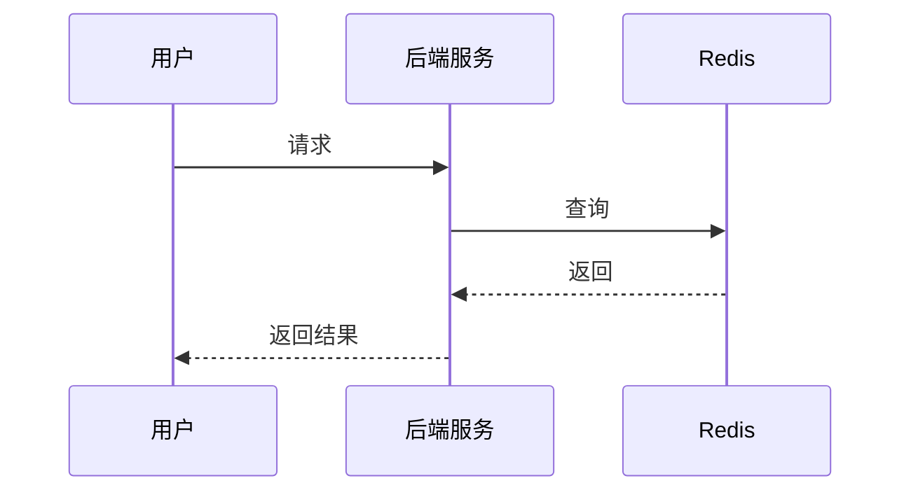
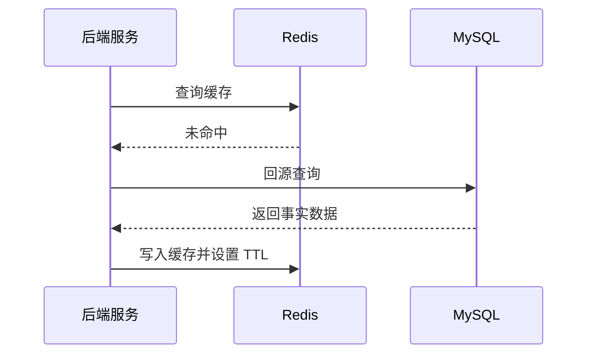

# Redis 知识点学习模板：证据标注版

## 一、模板定位

这个模板用于学习、整理和输出 Redis 关键知识点，目标不是只背命令，而是能从真实业务场景、技术选型、线上风险、架构边界、故障兜底和工程评审视角理解 Redis。

本模板是 **学习版**，重点服务个人深入学习 Redis 知识点。

如果后续要把内容放进正式分享文档，需要另用“分享文档版”模板，不要把学习版完整内容直接塞进分享文档，避免内容过大、重复、主线发散。

---

## 二、默认资料基准

后续 Redis 知识点调研默认以 **Redis Open Source 8.8.0** 为基准。

资料优先级：

1. Redis 官网：https://redis.io/
2. Redis 官方文档：https://redis.io/docs/latest/
3. Redis 官方 GitHub Releases：https://github.com/redis/redis/releases
4. 其他权威技术资料、主流技术社区文章、工程实践文章

要求：

- 优先查官方资料。
- 官方资料不足时，再补充其他权威资料。
- 关键结论必须带来源链接或标记“主观推断”。

---

## 三、关键结论标注规则

所有关键结论必须区分来源，不能把官方资料、外部资料和个人工程判断混在一起。

### 1. 来自参考资料的结论

如果结论来自 Redis 官网、官方文档、GitHub Releases 或其他技术网站，需要在结论旁边附上对应链接。

格式：

> 结论内容。参考：链接

示例：

> Redis Sorted Set 支持按照 score 排序，并支持按排名范围查询，因此适合实现排行榜的基础排名能力。参考：https://redis.io/docs/latest/develop/data-types/sorted-sets/

---

### 2. 来自工程经验或资料推导的结论

如果结论不是资料原文，而是基于官方资料、工程经验和业务场景分析得出的，需要在结论旁边标记：

> 主观推断

示例：

> 在高并发排行榜场景中，Redis 更适合作为实时排名读写层，MySQL 更适合作为最终事实源。标记：主观推断

---

### 3. 资料依据和工程判断混合时

需要拆开写，避免混淆。

示例：

> 官方依据：Redis Sorted Set 支持按 score 排序和范围查询。参考：https://redis.io/docs/latest/develop/data-types/sorted-sets/  
> 工程判断：因此在活动排行榜场景中，可以用 Redis 承接高频排名查询，但最终榜单建议落 MySQL 固化，避免 Redis 数据丢失或重建成本过高。标记：主观推断

---

### 4. 不确定内容

如果资料没有明确说明，或者当前结论需要进一步验证，必须明确写：

> 不确定，需要继续查证。

不能把不确定内容写成确定结论。

---

## 四、使用前提问规则

在生成具体 Redis 知识点学习内容前，必须先用选择题方式提问。

### 规则

1. 一共问 3 个问题。
2. 一个一个问，用户回答完第 1 个，再问第 2 个；回答完第 2 个，再问第 3 个。
3. 所有问题都回答完后，才生成具体学习内容。
4. 每个问题都要带问题进度，例如：问题 1 / 3。
5. 每个问题下面要有一句简单的问题描述。
6. 第一个答案必须是推荐选项，并写明推荐理由。
7. 最后一个选项必须是“我自己填写：______”。
8. 如果用户直接给出全部条件，也可以跳过提问，直接生成，但需要先复述确认本次输入。

---

### 问题 1 / 3：你要学习的 Redis 知识点？

问题描述：请选择这次要学习的 Redis 数据类型或能力。基础数据类型范围包括：Strings、Bitmaps、Bitfields、Arrays、Geospatial indexes、Hashes、JSON、Lists、Probabilistic data types、Sets、Sorted sets、Streams、Time series、Vector sets。

选项示例：

A. Strings（推荐）  
推荐理由：Strings 是 Redis 最基础、最常用的数据类型，适合先学习完整快照缓存、简单计数和短期状态，能帮助建立 Redis 使用的基础判断。

B. Sorted sets  
适合学习排行榜、积分榜、TopN、实时排序。

C. Hashes  
适合学习对象字段状态、局部更新、用户会话状态。

D. Streams  
适合学习事件流、消费组、异步任务、轻量消息流。

E. Bitmaps  
适合学习签到、活跃、是否完成这类海量布尔状态。

F. 我自己填写：______

说明：

- 如果用户之前已经在学习某个知识点，可以把该知识点放在 A 作为推荐项。
- 推荐理由要结合上下文，而不是固定写死。

---

### 问题 2 / 3：你要选择的业务场景示例？

问题描述：请选择一个业务场景作为本次学习的主案例。这个案例不能是随便简单的例子，要能体现资深后端需要关注的完整工程过程。

选项生成规则：

1. 必须结合第 1 个问题选择的知识点。
2. 推荐场景必须能体现该 Redis 知识点的核心价值。
3. 推荐场景必须能展开以下工程点中的多数内容：
   - 数据从哪里来
   - 为什么需要 Redis
   - Redis key 怎么设计
   - value 存什么
   - 什么时候读 Redis
   - Redis miss 后怎么回源
   - 如何设置 TTL
   - 如何处理并发击穿
   - MySQL 和 Redis 如何保持一致性
   - Redis 异常时如何降级
   - 需要监控哪些指标
4. 不要选太浅的场景作为推荐项。
5. 最后一个选项必须允许用户自己填写。

以 Strings 为例，选项示例：

A. 课程详情快照缓存（推荐）  
推荐理由：这个场景最适合学习 Strings 的核心价值：把 MySQL 多表聚合后的结果缓存成完整 JSON 快照，同时能自然讲清楚 Cache Aside、TTL、缓存击穿、MySQL 事实源、String vs Hash / JSON 的边界。

B. 首页配置缓存  
适合学习热点 Key、本地缓存、配置变更后缓存失效。

C. 活动状态快照缓存  
适合学习活动配置、活动状态、TTL、后台更新后的缓存失效。

D. 验证码 / 登录 token  
适合学习短期状态、TTL、过期控制，但业务深度相对较浅。

E. PV / 接口访问次数计数  
适合学习 INCR 原子计数、限流计数，但不太适合作为完整主案例。

F. 我自己填写：______

---

### 问题 3 / 3：这次学习你最想重点关注哪个工程问题？

问题描述：同一个 Redis 知识点，在不同业务场景下可以重点学习不同工程问题；请选择本次最想深入理解的方向。

选项生成规则：

1. 必须结合第 1 个问题的知识点和第 2 个问题的业务场景。
2. 推荐项要优先选择最能体现资深后端能力的工程问题。
3. 选项应该覆盖架构、性能、一致性、稳定性、成本、恢复、监控等角度。
4. 最后一个选项必须允许用户自己填写。

以 Strings + 首页配置缓存为例，选项示例：

A. 热点 Key 与多级缓存治理（推荐）  
推荐理由：首页配置通常访问频率高、变化频率低，最容易成为热点 Key；用这个重点学习 Strings，可以顺带掌握 Redis 缓存、本地缓存、TTL、预热、降级这些资深后端必须会讲的工程问题。

B. 缓存一致性：后台修改配置后，Redis 如何失效  
适合重点学习 MySQL 更新、Redis 删除缓存、补偿任务、旧数据窗口。

C. 缓存击穿：Redis miss 后如何避免大量请求打 MySQL  
适合重点学习重建锁、singleflight、短暂等待、回源限流。

D. Redis 故障降级：Redis 不可用时首页接口怎么保护 MySQL  
适合重点学习限流、返回默认配置、返回旧值、熔断降级。

E. 类型选择边界：为什么用当前数据类型，不用其他 Redis 类型  
适合重点学习 Redis 数据结构选择能力。

F. 我自己填写：______

---

## 五、生成内容前的输入确认

三个问题全部回答完后，先用一小段确认本次学习输入。

格式：

```text
本次学习输入：
知识点：XXX
业务场景：XXX
重点关注：XXX
```

然后再生成具体学习内容。

---

## 六、知识点学习输出结构

# Redis 知识点：XXX

## 1. 一句话结论

用一句话说明这个 Redis 知识点的核心价值。

要求：

- 结论必须直接。
- 如果来自资料，需要带链接。
- 如果是工程判断，需要标记“主观推断”。

格式：

> XXX。参考：XXX  
> XXX。标记：主观推断

---

## 2. 这个知识点是什么？

用简单语言解释概念。

要求：

- 不堆术语。
- 不只翻译官方定义。
- 要能让后端研发快速理解。
- 需要说明它在 Redis 中属于什么类型的能力。

推荐写法：

> XXX 是 Redis 中用于解决 XXX 问题的一种数据类型 / 机制 / 能力，它的核心特点是 XXX。

---

## 3. 它解决什么业务问题？

必须绑定第 2 个问题选择的真实业务场景说明。

要求：

- 不要只写“提升性能”。
- 要说清楚业务里哪里慢、哪里高并发、哪里需要 Redis 承接。
- 要说明不用 Redis 时会遇到什么问题。
- 要说明用了 Redis 后解决了什么问题。

推荐表格：

| 业务问题 | 具体表现 | Redis 如何解决 |
|---|---|---|
| XXX | XXX | XXX |

---

## 4. Redis 为什么适合？

从 Redis 的具体机制角度解释，而不是泛泛说“Redis 很快”。

可以从以下角度选择性分析：

- 数据结构是否刚好匹配业务模型。
- 是否以内存访问为主，适合低延迟读写。
- 是否支持原子命令。
- 是否支持过期时间。
- 是否支持 Lua / Function 保证复杂操作原子性。
- 是否支持特定数据类型能力，例如 String、Hash、Bitmap、Sorted Set、Stream 等。
- 是否能降低 MySQL 压力。
- 是否能减少复杂 SQL 或频繁聚合。
- 是否能支持高频读、高频写、状态恢复、限流、排名、统计等需求。

推荐表格：

| Redis 能力 | 对应业务价值 | 证据 / 标记 |
|---|---|---|
| XXX | XXX | 参考：XXX / 主观推断 |

要求：

- 命令只服务业务，不做命令大全。
- 每个机制都要绑定业务价值。
- 关键结论必须带链接或标记“主观推断”。

---

## 5. 它的边界是什么？

说明什么时候不能用，或者不能只靠 Redis。

要求：

- 要体现资深后端的边界意识。
- 不能只写优点。
- 要说明错误使用会带来什么风险。
- 要结合当前业务场景说明边界。

推荐表格：

| 边界 | 说明 | 更合适的选择 |
|---|---|---|
| XXX | XXX | XXX |

常见边界：

- 不能把 Redis 当成强一致事实源，除非业务明确接受风险。
- 不能无限存大 key。
- 不能让 Redis 承担复杂关系查询。
- 不能用 Redis 替代 MySQL 的长期可靠存储。
- 不能忽略持久化、主从复制、故障恢复带来的数据丢失窗口。
- 不能在高价值数据场景中只写 Redis 不落库。
- 不能把所有热点问题都简单交给 Redis，热 key 仍然会打爆单点。

---

## 6. 常见坑是什么？

结合线上风险说明。

要求：

- 不只是列坑。
- 要说明为什么会出问题。
- 要说明线上怎么规避。
- 要结合当前知识点和业务场景。
- 不要把所有 Redis 风险平均展开，优先讲本次场景最相关的风险。

推荐表格：

| 常见坑 | 线上风险 | 规避方式 |
|---|---|---|
| XXX | XXX | XXX |

常见坑候选：

1. 缓存穿透
2. 缓存击穿
3. 缓存雪崩
4. 大 key
5. 热 key
6. Redis 和 MySQL 双写不一致
7. 过期时间设置不合理
8. 分布式锁误释放
9. 锁没有续期或超时时间不合理
10. Pipeline / Lua 使用不当
11. 慢查询阻塞 Redis 主线程
12. 持久化策略不清楚导致故障恢复风险
13. 内存淘汰策略配置不合理
14. key 命名混乱导致维护困难
15. 缺少监控和容量预估

---

## 7. MySQL / 本地缓存 / 其他方案是否更合适？

做技术选型对比。

要求：

- 必须对比 MySQL。
- 必须根据场景决定是否对比本地缓存、MQ、其他 Redis 数据类型、搜索系统、对象存储等。
- 不要机械地每次都和所有方案对比。
- 最终要说明为什么当前场景应该选 Redis，或者为什么 Redis 只能作为辅助。

推荐表格：

| 方案 | 是否适合 | 原因 |
|---|---|---|
| MySQL | XXX | XXX |
| Redis 当前知识点 | XXX | XXX |
| 本地缓存 | XXX | XXX |
| 其他 Redis 类型 / 其他系统 | XXX | XXX |

---

## 8. 具体业务场景例子

必须使用第 2 个问题选择的业务场景，不要临时换成无关场景。

### 8.1 场景背景

说明业务是什么。

要求：

- 要具体。
- 要能让后端研发理解接口、数据来源、访问频率和更新方式。
- 不要泛泛说“某业务需要缓存”。

---

### 8.2 业务问题

说明没有 Redis 会遇到什么问题。

可以从这些角度说明：

- 查询慢
- 读压力大
- 写压力大
- 多表聚合重复
- 状态恢复困难
- 排名查询频繁
- 限流防刷
- 热点 key
- 高并发 miss
- 用户体验延迟

---

### 8.3 Redis 设计

说明：

- key 怎么设计
- value 存什么
- TTL 怎么设置
- 是否需要本地缓存
- 是否需要重建锁
- MySQL 是否仍是事实源
- 是否需要异步补偿
- 是否需要监控指标

推荐格式：

```text
Redis key:
XXX

Redis value:
XXX

TTL:
XXX

MySQL:
XXX

降级:
XXX
```

---

### 8.4 读流程

说明：

- 先读哪里
- Redis 命中怎么返回
- Redis miss 后怎么处理
- 如何回源 MySQL
- 如何避免并发击穿
- 如何记录日志和指标

---

### 8.5 写流程

说明：

- 先写 MySQL 还是先写 Redis
- MySQL 事务提交后怎么处理 Redis
- 是否删除缓存
- 是否更新缓存
- 删除失败怎么补偿
- 如何避免旧数据覆盖新数据

---

### 8.6 异常处理

说明：

- Redis 不可用怎么办
- MySQL 慢怎么办
- 缓存重建失败怎么办
- 并发 miss 怎么办
- key 被淘汰怎么办
- 降级返回什么
- 哪些数据可以返回旧值
- 哪些数据不能返回旧值

---

### 8.7 监控指标

说明需要监控哪些指标。

推荐表格：

| 指标 | 作用 |
|---|---|
| XXX | XXX |

常见指标：

- Redis QPS
- Redis P50 / P95 / P99 延迟
- keyspace_hits
- keyspace_misses
- 缓存命中率
- expired_keys
- evicted_keys
- used_memory
- connected_clients
- blocked_clients
- slowlog
- MySQL 回源次数
- 缓存重建锁获取成功 / 失败次数
- 降级次数

---

## 9. Mermaid 图

优先用 Mermaid 画图描述流程，语法需要支持 Cursor 正常显示。

### 9.1 Mermaid 图拆分规则

默认不要画一个超大的复杂时序图，而是按阅读顺序拆成 2 到 4 个短图。

要求：

1. 每张图只表达一个核心流程。
2. 图要服务讲解，不要为了画图而画图。
3. 优先使用 sequenceDiagram。
4. 状态类知识点可以使用 stateDiagram-v2。
5. 结构类知识点可以使用 flowchart 或 graph。
6. 每张图标题要清楚。
7. 不要在一张图里塞命中、未命中、回源、重建锁、更新缓存、降级全部流程。

### 9.2 推荐拆分方式

如果是缓存类场景，可以拆成：

1. Redis 命中流程
2. Redis 未命中 + MySQL 回源流程
3. 后台更新 MySQL + 删除缓存流程
4. 并发 miss + 重建锁流程

如果是排行榜类场景，可以拆成：

1. 用户提交分数流程
2. Redis ZSET 更新排名流程
3. 查询 TopN 流程
4. 最终榜落 MySQL 流程

如果是 Stream 类场景，可以拆成：

1. 生产者写入 Stream 流程
2. 消费组读取流程
3. 消费确认 ACK 流程
4. Pending 消息重试流程

---

## 10. 工程评审关注点

原“CTO 可能怎么追问”统一改成“工程评审关注点”。

目的不是应付某个人，而是检查方案是否经得起工程评审。

要求：

- 从架构、稳定性、成本、扩展性、故障恢复、数据一致性角度准备。
- 不要泛泛列问题，要结合本次知识点和业务场景。
- 每个关注点都要给出回答方向。

推荐表格：

| 关注点 | 说明 |
|---|---|
| 架构合理性 | 为什么这里一定要用 Redis？不用 MySQL 行不行？ |
| 类型选择 | 为什么用这个 Redis 数据类型，不用其他数据类型？ |
| 一致性 | Redis 和 MySQL 不一致怎么办？ |
| 稳定性 | Redis 挂了系统怎么降级？ |
| 性能 | QPS 上来后 Redis 是否会成为瓶颈？ |
| 成本 | 这个方案会占用多少内存？key 数量怎么估算？ |
| 可恢复性 | Redis 数据丢了怎么恢复？ |
| 扩展性 | 后续数据量扩大 10 倍怎么办？ |
| 线上风险 | 热 key、大 key、缓存击穿怎么处理？ |
| 运维监控 | 需要监控哪些 Redis 指标？ |
| 版本相关 | Redis 8.8.0 下这个能力是否有官方依据？ |

---

## 11. 最终记忆点

用 3 到 5 条总结这个知识点最重要的工程判断。

要求：

- 每条都要短。
- 每条都要有判断价值。
- 尽量能用于面试、评审或技术分享。
- 不要重复长篇解释。

示例：

1. Redis 适合做高频、低延迟、弱一致或最终一致的数据访问层。
2. MySQL 适合做事实源，Redis 适合做加速层或状态层。
3. Redis 的核心风险不是“不够快”，而是数据一致性、内存容量、热 key、大 key 和故障恢复。
4. 任何 Redis 方案都要回答：数据能不能丢、丢了怎么恢复、和 MySQL 不一致怎么办。
5. 资深后端使用 Redis 时，重点不是会用命令，而是能讲清楚边界、降级和恢复方案。

---

## 12. 参考资料

列出本次用到的资料。

要求：

1. Redis 官网、官方文档、官方 GitHub Releases 优先。
2. 其他权威资料放后面。
3. 每条资料说明用于支撑什么结论。
4. 不要只贴链接不说明作用。

推荐格式：

1. Redis 官方文档：XXX。用于确认 XXX。
2. Redis GitHub Releases：XXX。用于确认 Redis 8.8.0 版本相关信息。
3. 其他资料：XXX。用于补充 XXX。

---

## 七、最终输出格式模板

# Redis 知识点：XXX

## 1. 一句话结论

> XXX。参考：XXX  
> XXX。标记：主观推断

## 2. 这个知识点是什么？

XXX

## 3. 它解决什么业务问题？

| 业务问题 | 具体表现 | Redis 如何解决 |
|---|---|---|
| XXX | XXX | XXX |

## 4. Redis 为什么适合？

| Redis 能力 | 对应业务价值 | 证据 / 标记 |
|---|---|---|
| XXX | XXX | XXX |

## 5. 它的边界是什么？

| 边界 | 说明 | 更合适的选择 |
|---|---|---|
| XXX | XXX | XXX |

## 6. 常见坑是什么？

| 常见坑 | 线上风险 | 规避方式 |
|---|---|---|
| XXX | XXX | XXX |

## 7. MySQL / 本地缓存 / 其他方案是否更合适？

| 方案 | 是否适合 | 原因 |
|---|---|---|
| MySQL | XXX | XXX |
| Redis 当前知识点 | XXX | XXX |
| 本地缓存 | XXX | XXX |
| 其他 Redis 类型 / 其他系统 | XXX | XXX |

## 8. 具体业务场景例子

### 8.1 场景背景

XXX

### 8.2 业务问题

XXX

### 8.3 Redis 设计

```text
Redis key:
XXX

Redis value:
XXX

TTL:
XXX

MySQL:
XXX

降级:
XXX
```

### 8.4 读流程

XXX

### 8.5 写流程

XXX

### 8.6 异常处理

XXX

### 8.7 监控指标

| 指标 | 作用 |
|---|---|
| XXX | XXX |

## 9. Mermaid 图

### 9.1 XXX 流程



### 9.2 XXX 流程



## 10. 工程评审关注点

| 关注点 | 说明 |
|---|---|
| XXX | XXX |

## 11. 最终记忆点

1. XXX
2. XXX
3. XXX

## 12. 参考资料

1. XXX
2. XXX
3. XXX

---

## 八、执行原则

1. Redis 知识点默认基于 Redis Open Source 8.8.0。
2. 资料优先查 Redis 官网、官方文档、官方 GitHub Releases。
3. 关键结论必须带来源链接或标记“主观推断”。
4. 生成具体内容前，必须先按选择题方式问 3 个问题。
5. 3 个问题必须一个一个问，全部回答完后才生成具体内容。
6. 第 1 个问题必须问“你要学习的知识点？”。
7. 第 2 个问题必须问“你要选择的业务场景示例？”。
8. 第 3 个问题必须问“这次学习你最想重点关注哪个工程问题？”。
9. 每个问题的第一个选项必须是推荐项，并写明推荐理由。
10. 每个问题的最后一个选项必须是“我自己填写：______”。
11. 具体业务场景必须体现资深后端工程经验，不能是随便简单的例子。
12. 不能只讲概念，必须绑定真实业务场景。
13. 不能只讲优点，必须讲边界和线上坑。
14. 不能只说 Redis 快，必须说明 Redis 的具体机制优势。
15. 必须做 MySQL / 本地缓存 / 其他方案的技术选型对比。
16. Mermaid 图默认拆成 2 到 4 个短图，避免一个大图难以阅读。
17. “CTO 可能怎么追问？”统一改为“工程评审关注点”。
18. 工程评审关注点必须结合本次知识点和业务场景。
19. 最终记忆点必须短、准、有工程判断。
20. 如果用于正式分享文档，应另用分享文档版模板，不要把学习版完整内容直接塞进分享文档。
