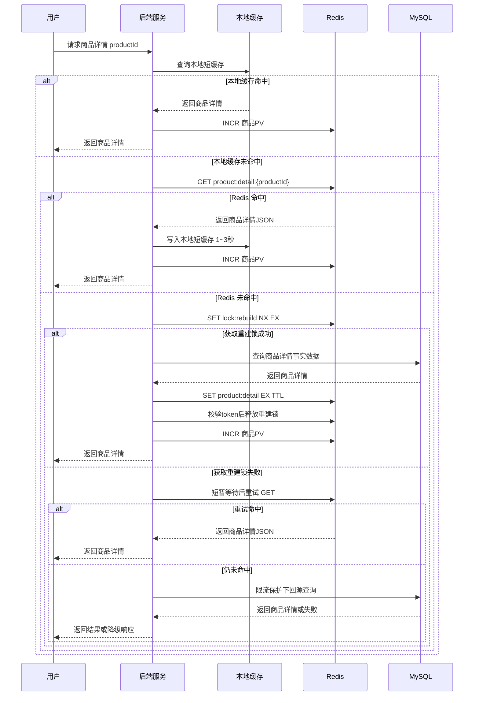

# Redis 知识点：Strings

## 1. 一句话结论

Redis String 是 Redis 最基础的 value 类型，适合做**简单键值缓存、原子计数器、短期状态、验证码、限流计数、分布式短锁 value** 等场景；但它不适合承载复杂结构化对象的局部更新，也不能替代 MySQL 做长期事实源。参考：Redis 官方 Strings 文档 ([Redis](https://redis.io/docs/latest/develop/data-types/strings/))；后半句为**主观推断**。

本文基准：Redis 官方文档已经提供 **Redis 8.8 Commands Reference**。参考：Redis 官方 Commands 文档 ([Redis](https://redis.io/docs/latest/commands/))

---

## 2. 这个知识点是什么？

Redis Strings 存储的是**字节序列**，可以保存文本、序列化对象、二进制数组；它是 Redis key 能关联的最简单 value 类型，常用于缓存，也支持计数器和位操作。参考：Redis 官方 Strings 文档 ([Redis](https://redis.io/docs/latest/develop/data-types/strings/))

简单理解：

> Redis String = `key -> value` 的最基础结构，value 可以是普通字符串、JSON 字符串、数字字符串、二进制内容。

常见命令：


| 命令                            | 作用               | 典型场景            |
| ----------------------------- | ---------------- | --------------- |
| `SET key value`               | 设置字符串值           | 写缓存、写验证码、写状态    |
| `GET key`                     | 获取字符串值           | 读缓存、读验证码、读状态    |
| `SET key value EX seconds`    | 设置值并带过期时间        | 缓存、验证码、临时 token |
| `SET key value NX EX seconds` | key 不存在才写入，并设置过期 | 简易短锁、防重复提交      |
| `INCR key`                    | 数字字符串自增 1        | 计数器、限流、PV       |
| `INCRBY key n`                | 数字字符串增加 n        | 批量计数、积分增量       |
| `MGET / MSET`                 | 批量读写多个 String    | 批量缓存读写          |


Redis `SET` 支持 `NX`、`XX`、`IFEQ`、`IFNE`、`IFDEQ`、`IFDNE` 等条件选项，也支持 `EX`、`PX`、`EXAT`、`PXAT`、`KEEPTTL` 等过期选项；其中 `IFEQ/IFNE/IFDEQ/IFDNE` 是 Redis 8.4.0 开始加入的能力。参考：Redis SET 命令文档 ([Redis](https://redis.io/docs/latest/commands/set/))

Redis 8.8 中 String 命令摘要里出现了 `INCREX`，用于递增 numeric value 并设置过期时间。参考：Redis Strings 命令摘要 ([Redis](https://redis.io/docs/latest/develop/data-types/strings/))

---

## 3. 它解决什么业务问题？

Redis Strings 主要解决三类业务问题。

第一类是**高频读缓存**：例如商品详情、用户基础资料、活动配置、系统开关、首页推荐位配置。MySQL 能存，但如果每次请求都查 MySQL，高并发下会把数据库读压力打上去。Redis String 可以把完整对象序列化后缓存起来。Redis 官方也明确提到 Strings 可用于缓存 HTML 片段或页面。参考：Redis 官方 Strings 文档 ([Redis](https://redis.io/docs/latest/develop/data-types/strings/))

第二类是**原子计数**：例如接口限流、浏览量 PV、点赞数临时计数、短信验证码发送次数、用户每日操作次数。Redis 官方说明 `INCR` 会把字符串值按整数解析、自增并写回，并且多个客户端对同一个 key 执行 `INCR` 不会产生竞态。参考：Redis 官方 Strings 文档 ([Redis](https://redis.io/docs/latest/develop/data-types/strings/))

第三类是**短期状态控制**：例如验证码、登录 token、幂等提交标记、缓存重建短锁。Redis `SET` 支持 `NX` 和 `EX`，可以实现“只有 key 不存在才写入，并自动过期”的效果。参考：Redis SET 命令文档 ([Redis](https://redis.io/docs/latest/commands/set/))

工程判断：Strings 是 Redis 里最常用的“简单状态容器”，适合存**一个 key 对应一个简单值**；一旦 value 内部字段需要频繁单独修改，就要考虑 Hash 或 JSON，而不是继续把整个对象塞成 String。标记：**主观推断**。Redis 官方也提示，如果把结构化数据序列化成 String 存储，可以考虑 Redis Hashes 或 JSON。参考：Redis 官方 Strings 文档 ([Redis](https://redis.io/docs/latest/develop/data-types/strings/))

---

## 4. Redis 为什么适合？

### 4.1 数据结构简单，和业务模型匹配

很多业务状态本质就是一个 key 对一个值，比如：

```text
user:token:10001 -> "abc-token"
sms:code:138xxxx -> "839201"
product:detail:9001 -> "{...json...}"
rate:login:ip:1.2.3.4:2026070412 -> "8"

```

这类场景不需要复杂集合、不需要排序、不需要关系查询，String 正好匹配。标记：**主观推断**。

### 4.2 多数 String 操作复杂度低

Redis 官方说明，多数 String 操作是 `O(1)`，效率很高；但 `SUBSTR`、`GETRANGE`、`SETRANGE` 等处理大字符串时可能是 `O(n)`，需要小心。参考：Redis 官方 Strings 文档 ([Redis](https://redis.io/docs/latest/develop/data-types/strings/))

### 4.3 支持原子计数

`INCR` 是 Redis String 的重要能力。官方说明，即使多个客户端同时对同一个 key 执行 `INCR`，也不会出现两个客户端都读到旧值然后覆盖写回的竞态，最终计数结果会正确累加。参考：Redis 官方 Strings 文档 ([Redis](https://redis.io/docs/latest/develop/data-types/strings/))

### 4.4 支持写入时设置过期时间

`SET` 可以携带 `EX seconds` 或 `PX milliseconds` 设置过期时间，也可以用 `NX` 控制只有 key 不存在时才写入。参考：Redis SET 命令文档 ([Redis](https://redis.io/docs/latest/commands/set/))

工程判断：这让 String 很适合验证码、临时 token、限流窗口、缓存 TTL、短锁等“天然有生命周期”的数据。标记：**主观推断**。

### 4.5 Redis 8.4+ 对 String 条件更新更强

Redis 官方事务文档说明，从 Redis 8.4 开始，Redis 为 String key 提供了新的原子 compare-and-set / compare-and-delete 能力，可以用 `SET` 的 `IFEQ/IFNE/IFDEQ/IFDNE` 选项在单条命令里完成条件更新。参考：Redis Transactions 文档 ([Redis](https://redis.io/docs/latest/develop/using-commands/transactions/))

工程判断：这类能力让 Redis String 在“轻量版本号、短状态更新、CAS 场景”里更有价值，但复杂业务事务仍然应该放在 MySQL。标记：**主观推断**。

---

## 5. 它的边界是什么？

### 5.1 单个 String 不能无限大

Redis 官方说明，单个 Redis String 默认最大是 **512MB**。参考：Redis 官方 Strings 文档 ([Redis](https://redis.io/docs/latest/develop/data-types/strings/))

工程判断：实际生产中远远不应该接近这个上限。几十 KB 以上的 String 就要开始关注网络传输、序列化、内存、复制延迟和大 key 风险。标记：**主观推断**。

### 5.2 不适合复杂结构的局部更新

如果 value 是一个很大的 JSON 字符串，例如：

```json
{
  "id": 1001,
  "name": "xxx",
  "price": 199,
  "stock": 20,
  "tags": ["a", "b", "c"],
  "extra": {...}
}

```

每次只想改 `stock`，但用 String 只能整体取出、反序列化、修改、再整体写回。这会带来并发覆盖、网络传输变大、序列化成本变高的问题。标记：**主观推断**。

Redis 官方也提示，如果存的是结构化数据，可以考虑 Redis Hashes 或 JSON。参考：Redis 官方 Strings 文档 ([Redis](https://redis.io/docs/latest/develop/data-types/strings/))

### 5.3 不适合强一致事实源

String 可以做计数和缓存，但高价值数据不能只放 Redis。例如余额、订单状态、支付状态、最终排行榜结果，不能只依赖 Redis String。标记：**主观推断**。

合理方式：

```text
MySQL = 事实源
Redis String = 缓存 / 临时状态 / 加速层 / 计数缓冲层

```

### 5.4 不适合复杂查询

String 是 key-value，不适合做条件查询、范围查询、关联查询。要查“所有价格大于 100 的商品”或者“某个状态下的所有订单”，不应该靠遍历 Redis key。标记：**主观推断**。

### 5.5 不适合无限增长的拼接内容

虽然 `APPEND` 可以追加字符串，但如果拿 String 记录日志、聊天记录、事件流水，很容易变成大 key。更合适的是 MySQL、日志系统、对象存储，或者 Redis Stream。标记：**主观推断**。

---

## 6. 常见坑是什么？


| 坑              | 具体表现                                           | 规避方式                                                                                                                                           |
| -------------- | ---------------------------------------------- | ---------------------------------------------------------------------------------------------------------------------------------------------- |
| 大 key          | 一个 String 存很大的 JSON、HTML、二进制，导致网络传输慢、复制慢、删除阻塞  | 控制 value 大小；大对象拆分；用 Hash/JSON；删除用异步删除策略                                                                                                        |
| 热 key          | 首页配置、热门商品、爆款活动 key 被大量请求集中打到一个 Redis 节点        | 本地缓存 + Redis；多级缓存；热点 key 拆分；限流降级                                                                                                               |
| 缓存击穿           | 热点 key 过期瞬间，大量请求同时回源 MySQL                     | 加短锁、singleflight、逻辑过期、异步刷新                                                                                                                     |
| 缓存穿透           | 请求不存在的数据，每次都查 MySQL                            | 缓存空值、布隆过滤器、参数校验                                                                                                                                |
| 缓存雪崩           | 大量 key 同时过期，MySQL 瞬间承压                         | TTL 加随机抖动；分批预热；限流降级                                                                                                                            |
| 双写不一致          | MySQL 更新了，Redis 还是旧值                           | Cache Aside：先写 MySQL，再删除缓存；必要时延迟双删或异步补偿                                                                                                        |
| JSON String 误用 | 所有字段都塞进一个 JSON，局部更新困难                          | 字段频繁变更时用 Hash/JSON                                                                                                                             |
| 计数丢失           | Redis 做计数但没有落库，Redis 故障后丢数据                    | 低价值计数可接受；高价值计数需要定时刷库或写 MySQL 事实表                                                                                                               |
| 锁误删            | `SET NX EX` 加锁后，业务超时，锁过期被别人拿到，原线程又 `DEL` 掉别人的锁 | value 存随机 token，释放锁时校验 token；官方也建议用随机 token + Lua 校验释放。参考：Redis SET 文档 ([Redis](https://redis.io/docs/latest/commands/set/))                   |
| `INCR` 后未设置过期  | 限流 key 永久存在，造成 key 泄漏                          | 使用事务、Lua，或 Redis 8.8 的 `INCREX` 这类递增并设置过期能力；`INCREX` 参考：Redis Strings 命令摘要 ([Redis](https://redis.io/docs/latest/develop/data-types/strings/)) |


---

## 7. MySQL / 本地缓存是否更合适？


| 方案                          | 是否更合适             | 原因                                                                                                                                             |
| --------------------------- | ----------------- | ---------------------------------------------------------------------------------------------------------------------------------------------- |
| MySQL                       | 适合做事实源            | MySQL 适合事务、强一致、长期存储、复杂查询；不适合承接所有高频读和瞬时计数压力。标记：**主观推断**                                                                                         |
| Redis String                | 适合做简单缓存、短期状态、原子计数 | String 操作简单，多数操作是 O(1)，支持 `SET/GET/INCR/EXPIRE` 等能力。参考：Redis 官方 Strings 文档 ([Redis](https://redis.io/docs/latest/develop/data-types/strings/)) |
| 本地缓存                        | 适合极热点、低变更、小数据     | 本地缓存读取比 Redis 少一次网络，但多实例一致性差，更新传播复杂。标记：**主观推断**                                                                                                |
| Redis String + MySQL        | 最常见组合             | MySQL 存事实数据，Redis String 缓存热点数据或临时状态。标记：**主观推断**                                                                                               |
| 本地缓存 + Redis String + MySQL | 高并发热点组合           | 本地缓存挡极热点，Redis 做分布式共享缓存，MySQL 做事实源。适合首页配置、活动配置、热门商品。标记：**主观推断**                                                                                |


最终判断：

> 如果数据是**简单 value、读多写少、允许短暂不一致、需要 TTL 或原子计数**，优先考虑 Redis String。标记：**主观推断**。  
> 如果数据是**强一致、复杂查询、长期可靠存储**，优先 MySQL。标记：**主观推断**。  
> 如果数据是**单机内极热点、变化很少**，可以在 Redis 前再加本地缓存。标记：**主观推断**。

---

## 8. 具体业务场景例子：热门商品详情缓存 + 浏览计数

### 8.1 场景背景

电商或游戏商城里有一个商品详情接口：

```text
GET /api/products/{productId}

```

商品详情页 QPS 很高，尤其活动期间热门商品会被反复访问。商品基础信息存 MySQL，包括标题、价格、图片、状态、活动标签等。每次请求都查 MySQL 会增加数据库压力。标记：**主观推断**。

### 8.2 业务问题

不用 Redis 时：

1. 热门商品详情每次都查 MySQL，数据库读压力高。
2. 活动开始后大量用户同时访问同一个商品，容易形成热点。
3. 商品详情变更后，需要尽量快速让用户看到新数据。
4. 还需要统计商品浏览量，但每次浏览都写 MySQL 会产生高频写压力。

### 8.3 Redis String 设计

```text
商品详情缓存：
product:detail:{productId} -> JSON String
TTL: 5 ~ 10 分钟 + 随机抖动

缓存重建锁：
lock:rebuild:product:detail:{productId} -> randomToken
TTL: 3 ~ 5 秒

商品浏览计数：
product:pv:{productId}:{yyyyMMdd} -> number
TTL: 2 ~ 7 天

```

设计判断：

1. 商品详情适合用 String 缓存完整 JSON，因为详情接口通常一次返回完整对象，而不是频繁修改单个字段。标记：**主观推断**。
2. 浏览量适合用 `INCR`，因为 Redis 官方明确支持 String 作为原子计数器。参考：Redis INCR 文档 ([Redis](https://redis.io/docs/latest/commands/incr/))
3. 商品详情不能只存在 Redis，MySQL 仍然是事实源。标记：**主观推断**。
4. 缓存 TTL 要加随机抖动，避免大量商品 key 同时过期造成雪崩。标记：**主观推断**。

### 8.4 读流程

1. API 收到商品详情请求。
2. 先查 Redis：`GET product:detail:{productId}`。
3. 如果命中，直接反序列化 JSON 返回。
4. 同时执行 `INCR product:pv:{productId}:{yyyyMMdd}` 记录 PV。
5. 如果 Redis 未命中，尝试获取缓存重建锁：`SET lock:rebuild:product:detail:{productId} token NX EX 5`。
6. 获取锁成功的请求回源 MySQL，查询商品详情。
7. 查询到商品后，写入 Redis：`SET product:detail:{productId} json EX ttl`。
8. 获取锁失败的请求短暂等待后重试 Redis；仍未命中则走降级逻辑，可以直接查 MySQL，或者返回简化数据。
9. 释放锁时校验 token，避免误删别人的锁。Redis 官方 SET 文档也说明，更稳妥的释放方式是 value 存随机 token，并用脚本仅在 value 匹配时删除。参考：Redis SET 文档 ([Redis](https://redis.io/docs/latest/commands/set/))

### 8.5 写流程

商品后台修改价格、上下架状态、标题等信息时：

1. 先更新 MySQL。
2. MySQL 事务提交成功后，删除 Redis 缓存：`DEL product:detail:{productId}`。
3. 下一次用户访问时重新回源 MySQL 并重建缓存。
4. 如果对一致性要求更高，可以在删除缓存失败时写补偿任务，异步重试删除。标记：**主观推断**。

为什么不建议“更新 MySQL 后直接更新 Redis”？

> 因为直接更新 Redis 容易遇到并发写顺序问题，尤其多个后台操作、多个服务实例同时更新时，旧数据可能覆盖新缓存；多数读多写少场景下，“写库后删缓存”更简单。标记：**主观推断**。

### 8.6 异常与降级


| 异常             | 处理方式                                                 |
| -------------- | ---------------------------------------------------- |
| Redis 读取失败     | 降级查 MySQL，但要加限流，避免 Redis 故障时 MySQL 被打爆               |
| MySQL 查询失败     | 返回兜底错误或旧缓存；如果有逻辑过期缓存，可以返回旧值                          |
| 缓存重建锁获取失败      | 等待 20~50ms 后重试 Redis，避免所有请求一起查 MySQL                 |
| 热门 key QPS 过高  | 增加本地缓存 1~3 秒，或者将热点数据预热到 Redis                        |
| PV 计数 Redis 丢失 | PV 属于统计类弱一致数据，可接受少量误差；如果用于结算，需要定时落 MySQL。标记：**主观推断** |


### 8.7 监控指标


| 指标                  | 为什么要看           |
| ------------------- | --------------- |
| Redis `GET` 命中率     | 判断缓存是否有效        |
| Redis 平均耗时 / P99 耗时 | 判断 Redis 是否成为瓶颈 |
| key 大小              | 发现大 String      |
| 热 key               | 发现是否有单 key 被打爆  |
| MySQL 回源次数          | 判断是否有击穿或雪崩      |
| 缓存重建锁失败次数           | 判断热点 key 竞争是否严重 |
| Redis 内存使用量         | 判断容量风险          |
| Redis evicted keys  | 判断是否发生内存淘汰      |
| PV 计数落库延迟           | 判断统计数据是否堆积      |


---

## 9. Mermaid 图




---

## 10. CTO 可能怎么追问？


| 问题                           | 答辩思路                                                                                                                                                                                                |
| ---------------------------- | --------------------------------------------------------------------------------------------------------------------------------------------------------------------------------------------------- |
| 为什么商品详情用 String，不用 Hash？     | 如果接口每次返回完整商品详情，String 存 JSON 简单直接；如果后续字段频繁局部更新，比如库存、价格、标签单独变更，再考虑 Hash/JSON。Redis 官方也提示结构化数据可考虑 Hash 或 JSON。参考：Redis Strings 文档 ([Redis](https://redis.io/docs/latest/develop/data-types/strings/)) |
| Redis String 最大能存多大？         | 官方默认单个 String 最大 512MB。参考：Redis Strings 文档 ([Redis](https://redis.io/docs/latest/develop/data-types/strings/))。但生产上不能按 512MB 设计，几十 KB 以上就要警惕大 key。后半句标记：**主观推断**                                    |
| `INCR` 并发安全吗？                | 官方说明多个客户端同时对同一 key 执行 `INCR` 不会发生竞态，最终值会正确累加。参考：Redis Strings 文档 ([Redis](https://redis.io/docs/latest/develop/data-types/strings/))                                                                |
| 为什么不直接把商品详情永久放 Redis？        | Redis 可以做缓存，但商品详情事实源仍应是 MySQL；Redis 可能过期、淘汰、故障恢复丢窗口，不能作为强一致长期事实源。标记：**主观推断**                                                                                                                        |
| 缓存和 MySQL 不一致怎么办？            | 采用 Cache Aside：先写 MySQL，提交成功后删除 Redis；删除失败进入补偿任务；读请求 miss 后重建缓存。标记：**主观推断**                                                                                                                         |
| 热点商品 key 被打爆怎么办？             | 增加本地短缓存、提前预热、逻辑过期、singleflight、限流降级；必要时拆分热点读路径。标记：**主观推断**                                                                                                                                          |
| 缓存击穿怎么处理？                    | Redis miss 后用 `SET lock NX EX` 做短锁，只允许一个请求回源重建，其余请求短暂等待重试或降级。`SET NX EX` 能做到 key 不存在才写入并设置过期。参考：Redis SET 文档 ([Redis](https://redis.io/docs/latest/commands/set/))                                  |
| 释放锁为什么要校验 token？             | 避免业务执行超时后误删其他线程后来获得的锁。Redis 官方 SET 文档建议 value 使用随机 token，并用脚本只在 value 匹配时删除。参考：Redis SET 文档 ([Redis](https://redis.io/docs/latest/commands/set/))                                                   |
| Redis 8.8 对 String 有什么值得注意的？ | 官方 Redis 8.8 String 命令摘要中包含 `INCREX`，它可以递增 numeric value 并设置过期时间。参考：Redis Strings 命令摘要 ([Redis](https://redis.io/docs/latest/develop/data-types/strings/))                                          |
| String 什么时候要换 Hash？          | 当 value 是结构化对象，并且字段需要频繁局部读写时，Hash 更合适；如果只是完整对象缓存，String 更简单。标记：**主观推断**                                                                                                                             |


---

## 11. 最终记忆点

1. Redis String 不是 Java 里的字符串概念，而是 Redis 最基础的二进制安全 value 容器，可以存文本、序列化对象和二进制数组。参考：Redis Strings 文档 ([Redis](https://redis.io/docs/latest/develop/data-types/strings/))
2. String 最常见的三个工程用途是：**缓存、计数器、短期状态**。参考：Redis Strings 文档 ([Redis](https://redis.io/docs/latest/develop/data-types/strings/))
3. `INCR` 是原子计数能力，适合 PV、限流、次数统计。参考：Redis INCR 文档 ([Redis](https://redis.io/docs/latest/commands/incr/))
4. String 的最大风险不是不会用命令，而是**大 key、热 key、缓存击穿、双写不一致、错误地把 Redis 当事实源**。标记：**主观推断**。
5. 结构化对象如果只是整体缓存，用 String；如果需要频繁局部更新，优先考虑 Hash/JSON。前半句标记：**主观推断**；官方替代建议参考 Redis Strings 文档 ([Redis](https://redis.io/docs/latest/develop/data-types/strings/))
6. Redis 8.8 下要关注 String 新命令能力，例如 `INCREX` 可以递增并设置过期时间。参考：Redis Strings 命令摘要 ([Redis](https://redis.io/docs/latest/develop/data-types/strings/))

---

## 12. 参考资料

1. Redis 官方 Strings 文档：用于确认 String 的定义、用途、限制、性能和替代方案。([Redis](https://redis.io/docs/latest/develop/data-types/strings/))
2. Redis SET 命令文档：用于确认 `SET` 的 `NX/XX/IFEQ/IFNE/EX/PX/KEEPTTL` 等选项，以及短锁 token 释放建议。([Redis](https://redis.io/docs/latest/commands/set/))
3. Redis INCR 命令文档：用于确认原子计数器、限流模式和 `INCR` 行为。([Redis](https://redis.io/docs/latest/commands/incr/))
4. Redis Transactions 文档：用于确认 Redis 8.4+ String compare-and-set / compare-and-delete 能力。([Redis](https://redis.io/docs/latest/develop/using-commands/transactions/))
5. Redis Commands 文档：用于确认 Redis 官方提供 Redis 8.8 Commands Reference。([Redis](https://redis.io/docs/latest/commands/))

