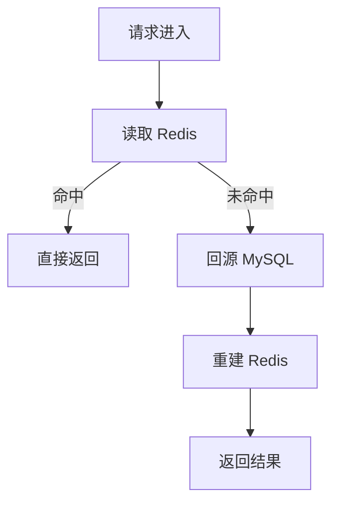
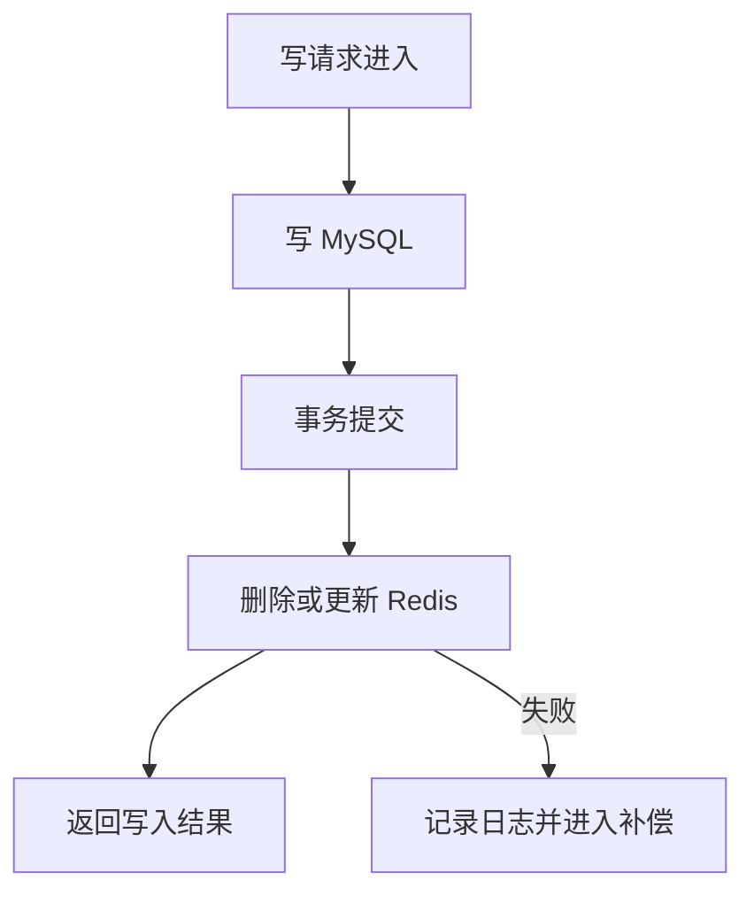
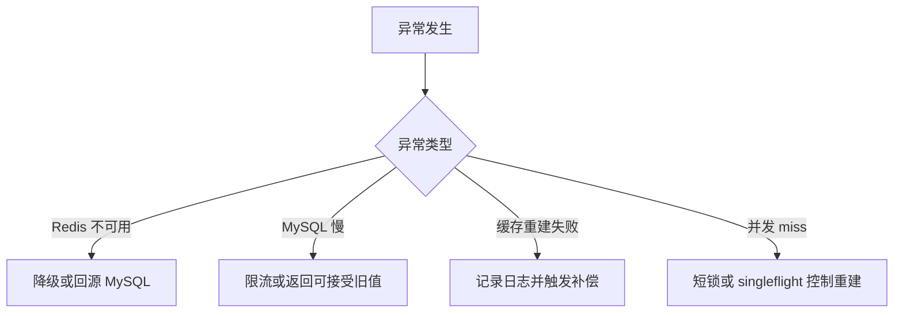
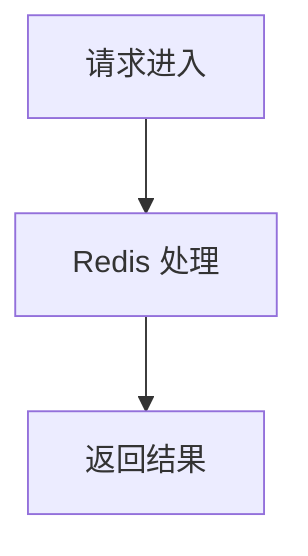

# Redis 知识点分享模板：证据标注版

## 一、模板定位

这个模板用于把 Redis 知识点整理成 **正式技术分享文档可用内容**。

它不是学习笔记模板，也不是命令大全模板。

本模板的目标是：

- 让分享内容围绕 007 正式目录展开。
- 让每个 Redis 数据类型都有清晰主线。
- 让每章能讲清楚“这个类型解决什么问题、适合什么场景、边界在哪里、线上最容易踩什么坑”。
- 让听众能快速记住关键判断，而不是被细节淹没。
- 让正式分享文档保持主线统一、内容克制、证据清楚、工程判断明确。

本模板默认服务于：

- Redis 技术分享文档。
- Redis 数据类型主线章节。
- 研发内部分享。
- 面向后端研发的工程实践总结。
- 007 正式分享目录的章节内容补全。

---

## 二、与学习版模板的区别

学习版目标是“自己学懂”，分享版目标是“别人听懂”。

| 对比项 | 学习版 | 分享版 |
|---|---|---|
| 目标 | 深入学习和完整调研 | 正式分享和主线表达 |
| 内容 | 尽量完整 | 只保留关键主线 |
| 案例 | 可以完整展开多个角度 | 每章只完整展开一个主案例 |
| 风险 | 可以展开很多风险 | 只讲与本章强相关风险 |
| 命令 | 可适度展开 | 命令只服务业务 |
| 图示 | 可多图辅助理解 | 只保留关键流程图 |
| 工程问题 | 分散在每个知识点中学习 | 通用问题放到统一升华章节 |
| 输出 | 学习完整版 | 分享精简版 / 分享完整版 |

---

## 三、默认资料基准

后续 Redis 知识点分享内容默认以 **Redis Open Source 8.8.0** 为基准。

资料优先级：

1. Redis 官网：https://redis.io/
2. Redis 官方文档：https://redis.io/docs/latest/
3. Redis 官方 GitHub Releases：https://github.com/redis/redis/releases
4. 其他权威技术资料、主流技术社区文章、工程实践文章

要求：

- 优先查官方资料。
- 官方资料不足时，再补充其他权威资料。
- 关键结论必须带来源链接或标记“主观推断”。
- 分享版不需要展示大量资料过程，只需要保留支撑关键判断的来源。

---

## 四、关键结论标注规则

所有关键结论必须区分来源，不能把官方资料、外部资料和个人工程判断混在一起。

### 1. 来自 Redis 官方资料的结论

如果结论来自 Redis 官网、官方文档、GitHub Releases，需要在结论旁边附上可点击链接。

格式：

```text
结论内容。参考：[Redis 官方 XXX 文档](链接)
```

示例：

```text
Sorted Set 支持按 score 排序，适合实现排行榜基础排序能力。参考：[Redis 官方 Sorted Sets 文档](https://redis.io/docs/latest/develop/data-types/sorted-sets/)
```

要求：

- 不展示裸链接。
- 链接文字要能看出资料来源。
- 链接只放在真正需要证据支撑的关键结论旁边。
- 不要为了显得“资料多”而到处堆链接。

---

### 2. 来自工程经验或资料推导的结论

如果结论不是 Redis 官方资料原文，而是基于官方资料、工程经验和业务场景分析得出的，需要在结论旁边标记：

```text
**标记：主观推断**
```

示例：

```text
在活动排行榜场景中，Redis 更适合作为当前榜实时排名层，MySQL 更适合作为最终榜事实源。**标记：主观推断**
```

要求：

- “**标记：主观推断**”必须加粗。
- 不能把主观判断伪装成官方结论。
- 架构设计、MySQL / Redis 分工、降级策略、最终榜固化策略，通常都属于工程判断。

---

### 3. 官方依据和工程判断混合时

需要拆开写，避免混淆。

推荐写法：

```text
Sorted Set 支持按 score 排序和范围查询。参考：[Redis 官方 Sorted Sets 文档](https://redis.io/docs/latest/develop/data-types/sorted-sets/)
因此活动当前榜可以用 Redis Sorted Set 承接高频排名查询。**标记：主观推断**
```

---

### 4. 不确定内容

如果资料没有明确说明，或者当前结论需要进一步验证，必须明确写：

```text
不确定，需要继续查证。
```

不能把不确定内容写成确定结论。

---

## 五、生成前必问问题

生成分享版内容前，必须先问 4 个问题。

### 总规则

1. 一共问 4 个问题。
2. 一个一个问，用户回答完第 1 个，再问第 2 个。
3. 4 个问题全部回答完后，才生成分享内容。
4. 每个问题都要带问题进度，例如：问题 1 / 4。
5. 每个问题下面要有一句简单的问题描述。
6. 第一个答案必须是推荐选项，并写明推荐理由。
7. 最后一个选项必须是“我自己填写：______”。
8. 如果用户直接给出全部条件，可以跳过提问，但必须先复述确认本次输入。
9. 问题必须围绕 007 正式目录，而不是脱离目录自由发挥。

---

### 问题 1 / 4：这次要生成哪个 Redis 知识点？

问题描述：请选择这次要生成分享内容的 Redis 数据类型或能力。

选项示例：

A. Strings（推荐）  
推荐理由：Strings 是 Redis 最基础、最常用的数据类型，适合先建立“完整结果缓存、简单状态、计数器”的基础判断。

B. Hashes  
适合讲对象字段缓存、局部字段更新、用户会话状态、对象状态。

C. Sorted sets  
适合讲排行榜、积分榜、TopN、实时排序、我的排名。

D. Streams  
适合讲事件流、消费组、异步任务、轻量消息流。

E. Bitmaps  
适合讲签到、活跃状态、是否完成、海量布尔状态。

F. 我自己填写：______

要求：

- 如果用户已经指定知识点，不要重复问，直接进入下一问。
- 如果用户正在延续前一个知识点，可以把该知识点放在 A 作为推荐项。
- 推荐理由要结合上下文，不要固定写死。

---

### 问题 2 / 4：这个知识点对应 007 正式目录的哪一章？

问题描述：请确认本次内容要补充到 007 正式分享文档的哪一章，必须对齐 007 的章节标题和章节问题。

选项示例：

A. 第 3 章：Strings（推荐）  
推荐理由：如果本次学习 Strings，就应直接对齐 007 中的 Strings 章节，避免另起一套结构。

B. 第 8 章：Hashes

C. 第 13 章：Sorted sets

D. 第 14 章：Streams

E. 第 17 章：Redis / MySQL 分工

F. 我自己填写：______

要求：

- 必须识别目标章节标题。
- 必须明确该章节要回答的问题。
- 后续内容必须围绕目标章节组织，不能按命令大全展开。
- 如果无法识别 007 章节，需要先提示用户提供 007 目录或目标章节内容。

---

### 问题 3 / 4：主案例从目标章节哪个典型场景里选？

问题描述：请选择本章要完整展开的一个主案例，业务案例必须优先来自目标章节已有的典型场景。

以 Strings 为例：

A. 课程详情快照缓存（推荐）  
推荐理由：如果 007 Strings 章节已有课程详情、活动配置、首页配置等典型场景，课程详情快照缓存最适合讲完整结果缓存、MySQL 多表聚合、Cache Aside、TTL、缓存击穿和边界。

B. 活动配置缓存

C. 首页配置缓存

D. 学习进度快照缓存

E. 短期状态 / 简单计数

F. 我自己填写：______

要求：

- 优先使用 007 目标章节已有典型场景。
- 不要另起无关业务例子。
- 例如 Strings 不要随意换成电商商品详情，除非 007 章节本来就包含这个场景，或用户明确要求。
- 每章只完整展开一个主案例。
- 其他典型用法只作为辅助案例点到为止。

---

### 问题 4 / 4：本章重点要讲哪个工程判断？

问题描述：同一个 Redis 数据类型，可以从不同角度讲；分享版必须选择最能支撑本章主线的工程判断。

选项示例：

A. 类型选择边界：为什么这个场景适合用当前 Redis 类型（推荐）  
推荐理由：分享版最重要的是让听众知道什么时候用、什么时候不用，而不是记命令。

B. 读写流程：Redis 如何参与一次完整业务请求

C. 一致性：MySQL 和 Redis 如何分工

D. 风险边界：当前类型最容易出现什么线上问题

E. 记忆点：本章最后让听众记住哪 3 句话

F. 我自己填写：______

要求：

- 推荐项要优先选择最能体现分享价值的工程问题。
- 本章只讲与当前数据类型强相关的风险。
- 通用一致性、降级、恢复、监控等问题，放到统一升华章节中展开。

---

## 六、生成内容前的输入确认

4 个问题全部回答完后，先用一小段确认本次分享输入。

格式：

```text
本次分享输入：
知识点：XXX
对应 007 章节：第 X 章：XXX
目标章节要回答的问题：XXX
主案例：XXX
辅助案例：XXX / XXX / XXX
重点工程判断：XXX
输出模式：分享精简版 / 分享完整版
```

然后再生成具体分享内容。

---

## 七、输出模式

本模板支持两种输出模式。

### 1. 分享精简版

适合直接放入正式分享文档初稿。

保留内容：

- 一句话定位
- 本章要回答的问题
- 典型使用场景
- 主案例
- 关键命令
- 关键边界
- 常见坑
- 3 条记忆点
- 必要参考资料

不保留内容：

- 过长背景分析
- 大量命令说明
- 多个完整案例
- 大量通用工程风险
- 学习过程说明
- 重复的官方依据和主观推断小节

---

### 2. 分享完整版

适合先生成较完整的章节材料，再人工压缩进正式分享文档。

保留内容：

- 章节定位
- 章节要回答的问题
- 知识点解释
- 典型场景
- 主案例完整展开
- 辅助案例简要列出
- 关键命令
- 读流程 / 写流程 / 异常流程
- 当前数据类型强相关边界和坑
- 工程评审关注点
- 内容分层
- 3 条记忆点
- 参考资料

要求：

- 分享完整版也不能变回学习版。
- 不要把所有命令和所有工程问题平均展开。
- 内容必须服务目标章节主线。

---

## 八、分享版内容组织原则

### 1. 与 007 章节结构对齐

生成前必须先识别：

- 目标章节编号。
- 目标章节标题。
- 目标章节已有典型场景。
- 目标章节要回答的问题。
- 目标章节在整篇 Redis 分享中的位置。

要求：

- 内容必须围绕 007 正式章节组织。
- 不要脱离 007 目录另起新章节。
- 不要把学习版的完整内容直接塞进 007。
- 不要按命令大全展开。

---

### 2. 业务案例来源规则

业务案例必须优先来自目标章节已有的典型场景。

例如：

| Redis 类型 | 优先使用 007 已有典型场景 |
|---|---|
| Strings | 课程详情、活动配置、首页配置、学习进度快照、活动状态、简单计数、短期状态 |
| Hashes | 用户会话、对象字段状态、活动参与状态、局部字段更新 |
| Sorted sets | 活动实时排行榜、积分榜、TopN、我的排名、附近排名 |
| Streams | 异步事件、消费组、任务流、消息确认、失败重试 |
| Bitmaps | 签到、活跃、是否完成、布尔状态统计 |

要求：

- 不要为了举例随意创造和目标章节无关的新业务。
- 如果目标章节已有场景不够好，可以说明原因，再给出替代建议。
- 替代建议必须标记 **标记：主观推断**。

---

### 3. 主案例 + 辅助案例

每章只完整展开一个主案例。

主案例必须讲清楚：

- 业务背景。
- 为什么需要当前 Redis 类型。
- key 怎么设计。
- value 存什么。
- 读流程。
- 写流程。
- 异常流程。
- 当前类型强相关边界。
- 当前类型强相关常见坑。

辅助案例只点到为止：

```text
辅助案例：
- 首页配置缓存：适合完整 JSON 快照，重点关注热点 Key 和缓存失效。
- 活动状态快照：适合短期状态缓存，重点关注 TTL 和后台变更后的缓存删除。
- 计数器：适合简单递增，重点关注是否需要最终落库。
```

要求：

- 不要把多个辅助案例都完整展开。
- 辅助案例只说明“适合什么 + 关注什么”。
- 主案例服务章节主线，辅助案例服务视野扩展。

---

### 4. 章节内讲什么，章节外升华什么

每章只讲与当前数据类型强相关的内容。

本章内应该讲：

- 当前数据类型的核心能力。
- 当前数据类型最适合的业务模型。
- 当前数据类型在主案例中的读写路径。
- 当前数据类型特有或强相关的坑。
- 当前数据类型和其他 Redis 类型的边界。

本章内不应大篇幅展开：

- Redis 和 MySQL 通用一致性方案。
- Redis 故障恢复通用方案。
- Redis 集群高可用。
- 热 key 通用治理体系。
- 缓存雪崩全局治理。
- 监控指标体系全量展开。
- 分布式锁完整专题。

这些内容应该放到统一升华章节，例如：

- Redis / MySQL 分工。
- Redis fallback / 风险。
- 持久化 / 一致性权衡。
- 最终使用原则。
- 工程答辩准备。

---

### 5. 命令只服务业务

分享版不是命令手册。

要求：

- 只讲当前主案例直接用到的命令。
- 每个命令必须绑定业务动作。
- 不做命令清单堆砌。
- 不讲和当前业务无关的命令。
- 不为了展示 Redis 熟悉度而塞命令。

推荐写法：

```text
`ZRANGE ... REV WITHSCORES` 用于查询当前榜 TopN。参考：[Redis 官方 ZRANGE 文档](https://redis.io/docs/latest/commands/zrange/)
```

不推荐写法：

```text
Sorted Set 有 ZADD、ZRANGE、ZRANK、ZREM、ZCOUNT、ZCARD、ZPOPMAX、ZPOPMIN、ZUNION、ZINTER...
```

---

### 6. 内容分层

每个知识点必须分成三层，避免内容平铺。

| 分层 | 含义 | 处理方式 |
|---|---|---|
| 必须放入本章 | 听众理解本章必须知道的内容 | 写进目标章节正文 |
| 可选补充 | 有价值但不影响本章主线 | 简短补充或放附录 |
| 统一升华章节 | 跨多个数据类型都通用的问题 | 移到统一总结章节 |

示例：

| 内容 | 分层 | 原因 |
|---|---|---|
| Sorted Set 适合排行榜 | 必须放入本章 | 这是本章主线 |
| ZRANGE 查询 TopN | 必须放入本章 | 主案例直接需要 |
| Redis / MySQL 最终榜分工 | 统一升华章节 | 多个章节都涉及事实源问题 |
| Redis 集群高可用 | 统一升华章节 | 不属于 Sorted Set 特有问题 |
| ZUNION / ZINTER | 可选补充 | 不一定服务当前排行榜主案例 |

---

### 7. 篇幅控制

分享版必须控制篇幅。

要求：

- 一句话结论不超过 2 句。
- 每个表格不超过 5 行。
- 主案例完整展开，但不要变成需求设计文档。
- 辅助案例最多 3 到 5 个。
- 关键命令最多 3 到 5 个。
- 常见坑最多 3 到 5 个。
- 工程评审关注点最多 5 个。
- 记忆点最多 3 条。
- Mermaid 图默认 1 到 3 张，除非用户明确要求更完整。

---

### 8. 流程类小节写法

所有流程类小节统一使用：

```text
### X.X xxx流程

先放 Mermaid 流程图。

说明：

- 一行一个核心观点。参考：[Redis 官方 xxx 文档](链接)
- 一行一个工程判断。**标记：主观推断**
- 一行一个边界说明。**标记：主观推断**
```

要求：

- 图负责表达路径。
- 说明负责表达判断。
- 每条说明一行一个核心观点。
- 每条说明后面直接带官方依据或主观推断标记。
- 不再单独拆“官方依据”或“主观推断”小节。
- 官方依据使用可点击 Markdown 链接。
- Mermaid 语法需要支持 Cursor 和 浏览器 正常显示。

---

## 九、分享完整版输出结构

# 第 X 章：XXX

## 1. 本章定位

说明本章在 007 正式分享文档中的位置。

要求：

- 直接说明这个 Redis 类型解决什么问题。
- 说明为什么本章值得讲。
- 不要写成长背景。

推荐格式：

```text
本章要回答的问题：XXX。
本章核心结论：XXX。参考：[Redis 官方 XXX 文档](链接)
```

---

## 2. 一句话结论

用 1 到 2 句话说明这个知识点的核心价值。

要求：

- 直接。
- 面向分享。
- 能被听众记住。
- 需要证据就带链接。
- 是工程判断就标记 **标记：主观推断**。

---

## 3. 这个数据类型适合解决什么问题？

用表格压缩说明。

| 适合的问题 | 典型表现 | 为什么适合 |
|---|---|---|
| XXX | XXX | XXX |
| XXX | XXX | XXX |
| XXX | XXX | XXX |

要求：

- 最多 5 行。
- 每行都要和该数据类型强相关。
- 不写泛泛的“提升性能”。

---

## 4. 典型场景选择

### 4.1 本章主案例

```text
主案例：XXX
选择原因：XXX。**标记：主观推断**
```

要求：

- 主案例必须优先来自 007 目标章节已有典型场景。
- 主案例必须能体现当前数据类型的核心价值。
- 主案例必须能讲清楚读写流程和边界。

### 4.2 辅助案例

```text
辅助案例：
- XXX：适合 XXX，重点关注 XXX。
- XXX：适合 XXX，重点关注 XXX。
- XXX：适合 XXX，重点关注 XXX。
```

要求：

- 辅助案例只点到为止。
- 不完整展开辅助案例。
- 辅助案例用于补充该数据类型的使用范围。

---

## 5. 主案例设计

### 5.1 场景背景

说明业务是什么。

要求：

- 具体。
- 短。
- 能让后端研发理解接口、数据来源、访问频率和更新方式。
- 不写成完整需求文档。

---

### 5.2 Redis 设计

```text
Redis key:
XXX

Redis value:
XXX

TTL:
XXX

MySQL:
XXX

降级:
XXX
```

要求：

- key 和 value 必须服务主案例。
- MySQL 是否是事实源需要明确。
- 降级只写和本章相关的处理，不展开全局降级体系。

---

### 5.3 读流程



说明：

- 一行一个核心读路径观点。参考：[Redis 官方 xxx 文档](链接)
- 一行一个 Redis miss / 回源 / 击穿控制判断。**标记：主观推断**
- 一行一个边界说明，例如哪些数据不能返回旧值。**标记：主观推断**

---

### 5.4 写流程



说明：

- 一行一个核心写路径观点。参考：[Redis 官方 xxx 文档](链接)
- 一行一个 MySQL / Redis 一致性处理判断。**标记：主观推断**
- 一行一个删除失败、更新失败、旧数据覆盖风险说明。**标记：主观推断**

---

### 5.5 异常流程



说明：

- 一行一个异常处理路径观点。参考：[Redis 官方 xxx 文档](链接)
- 一行一个降级策略判断。**标记：主观推断**
- 一行一个边界说明，例如哪些数据不能返回旧值、哪些场景必须失败返回。**标记：主观推断**

---

## 6. 关键命令

| 命令 | 在主案例中的作用 | 证据 / 标记 |
|---|---|---|
| `XXX` | XXX | 参考：[Redis 官方 XXX 文档](链接) |
| `XXX` | XXX | 参考：[Redis 官方 XXX 文档](链接) |
| `XXX` | XXX | 参考：[Redis 官方 XXX 文档](链接) |

要求：

- 最多 3 到 5 个。
- 只讲主案例直接用到的命令。
- 每个命令都要绑定业务动作。
- 不做命令大全。

---

## 7. 这个类型的边界

| 边界 | 说明 | 处理建议 |
|---|---|---|
| XXX | XXX | XXX |
| XXX | XXX | XXX |
| XXX | XXX | XXX |

要求：

- 最多 3 到 5 行。
- 只讲和当前数据类型强相关的边界。
- 通用边界移到统一升华章节。

---

## 8. 常见坑

| 常见坑 | 线上风险 | 规避方式 |
|---|---|---|
| XXX | XXX | XXX |
| XXX | XXX | XXX |
| XXX | XXX | XXX |

要求：

- 最多 3 到 5 个。
- 只讲本章强相关风险。
- 不平均展开所有 Redis 风险。

---

## 9. 和其他方案的边界

| 方案 | 是否适合 | 原因 |
|---|---|---|
| MySQL | XXX | XXX |
| Redis 当前类型 | XXX | XXX |
| 其他 Redis 类型 / 本地缓存 / MQ | XXX | XXX |

要求：

- 必须对比 MySQL。
- 其他方案按场景选择，不机械展开。
- 重点说明为什么本章选择当前 Redis 类型。

---

## 10. 内容分层

| 内容 | 分层 | 处理方式 |
|---|---|---|
| XXX | 必须放入本章 | 写进正文 |
| XXX | 可选补充 | 简短提一句或放附录 |
| XXX | 统一升华章节 | 移到统一总结章节 |

要求：

- 每个知识点必须做内容分层。
- 防止把通用工程问题塞满单章。
- 防止章节主线被打散。

---

## 11. 工程评审关注点

| 关注点 | 回答方向 |
|---|---|
| 为什么用这个 Redis 类型？ | XXX |
| 为什么不用 MySQL / 其他 Redis 类型？ | XXX |
| 数据不一致怎么办？ | 本章只回答强相关部分，通用一致性移到统一升华章节 |
| Redis 异常怎么办？ | 本章只回答主案例直接影响 |
| 这个方案最大的线上风险是什么？ | XXX |

要求：

- 最多 5 个。
- 不写成全局工程治理清单。
- 每个问题都要能服务本章分享。

---

## 12. 本章记忆点

1. XXX。
2. XXX。
3. XXX。

要求：

- 最多 3 条。
- 每条必须短。
- 每条都要有判断价值。
- 能用于分享收尾或答辩。

---

## 13. 参考资料

1. [Redis 官方 XXX 文档](链接)：用于确认 XXX。
2. [Redis 官方 XXX 命令文档](链接)：用于确认 XXX。
3. [Redis GitHub Releases](https://github.com/redis/redis/releases)：用于确认 Redis 8.8.0 版本相关信息。

要求：

- 只列本章真正用到的资料。
- 不列无关资料。
- 每条说明用于支撑什么结论。

---

## 十、分享精简版输出结构

# 第 X 章：XXX

## 1. 本章一句话

XXX。参考：[Redis 官方 XXX 文档](链接)

## 2. 适合解决什么问题？

| 场景 | 为什么适合 |
|---|---|
| XXX | XXX |
| XXX | XXX |
| XXX | XXX |

## 3. 主案例

```text
主案例：XXX
核心原因：XXX。**标记：主观推断**
```

## 4. 核心流程



说明：

- 一行一个核心观点。参考：[Redis 官方 xxx 文档](链接)
- 一行一个工程判断。**标记：主观推断**

## 5. 关键命令

| 命令 | 作用 |
|---|---|
| `XXX` | XXX |
| `XXX` | XXX |
| `XXX` | XXX |

## 6. 边界和坑

| 问题 | 说明 |
|---|---|
| XXX | XXX |
| XXX | XXX |
| XXX | XXX |

## 7. 本章记忆点

1. XXX。
2. XXX。
3. XXX。

---

## 十一、执行原则

1. Redis 分享内容默认基于 Redis Open Source 8.8.0。
2. 资料优先查 Redis 官网、官方文档、官方 GitHub Releases。
3. 关键结论必须带来源链接或标记 **标记：主观推断**。
4. 生成前必须先问 4 个问题：学哪个知识点、对应 007 哪一章、主案例选哪个、重点工程判断是什么。
5. 必须先识别目标章节标题和要回答的问题，再生成内容。
6. 内容必须对齐 007 正式目录，不要脱离目录自由发挥。
7. 业务案例必须优先使用目标章节已有典型场景。
8. 每章只完整展开一个主案例。
9. 其他典型用法只作为辅助案例点到为止。
10. 每章只讲与当前数据类型强相关的风险。
11. 通用工程问题放到统一升华章节。
12. 命令只服务业务，不做命令大全。
13. 每个知识点必须分成「必须放入本章」「可选补充」「统一升华章节」三层。
14. 分享版支持「分享精简版」和「分享完整版」两种输出。
15. 分享精简版只保留核心结论、主案例、边界和记忆点。
16. 分享完整版可以展开流程和评审关注点，但不能变回学习版。
17. Mermaid 图默认 1 到 3 张，避免一个章节图过多。
18. 流程图后说明必须一行一个核心观点。
19. 官方依据使用可点击 Markdown 链接，不展示裸链接。
20. 主观判断必须加粗标记为 **标记：主观推断**。
21. 每章最后必须有最多 3 条记忆点。
22. 如果内容太多，优先压缩辅助案例、命令、通用工程问题，不压缩主案例主线。
23. 如果用于最终正式分享文档，优先采用分享精简版。
24. 如果用于章节素材准备，优先采用分享完整版。
25. 任何时候都不能把学习版完整内容直接塞进分享文档。
