# Redis 重点分享文档框架

## 1. Redis 的核心定位：不是数据库替代品，而是高性能加速层

**要讲清楚的问题：**  
Redis 在后端系统里到底承担什么角色？

| 模块 | 你要掌握的知识点 | 解决的实际业务问题 | 典型业务场景 | 关键坑 | 资深后端分享时应该怎么讲 |
|---|---|---|---|---|---|
| 核心思想 | Redis 不是数据库替代品，而是缓存、读模型、加速层、临时状态层 | 避免把用户资产、计分、订单、学习记录等关键事实只放 Redis | 用户学习进度缓存、活动配置缓存、排行榜查询缓存、临时锁 | 把 Redis 当事实源，Redis 过期、淘汰、重启后数据不可复查 | **MySQL 保正确性，Redis 提性能；Redis 丢了能重建，MySQL 丢了就是事故。** |
| 数据生命周期 | 区分计划数据、过程状态、事实数据、展示数据 | 判断哪些数据能缓存，哪些必须落库 | 课程配置、题库配置、活动配置、用户得分、学习结果、排行榜展示 | 所有数据一把梭放 Redis，导致恢复、审计、对账困难 | **能丢、能重建、可短暂旧的数据适合 Redis；不能丢、要复查、要事务的数据必须 MySQL。** |
| Redis 为什么快 | 内存访问、单线程命令执行、I/O 多路复用、高效数据结构 | 解释为什么适合高频读写 | 高频缓存、计数、排名 | 以为单线程永远不会阻塞；执行慢命令照样卡 | **Redis 快的前提是操作小、命令合理、数据结构匹配访问模式。** |

---


## 2. Redis 数据类型选择的本质：用合适结构解决合适业务问题

**要讲清楚的问题：**  
为什么不能只背数据类型定义，而要理解每种数据类型适合解决哪类业务问题？

| 模块 | 你要掌握的知识点 | 解决的实际业务问题 | 典型业务场景 | 关键坑 | 资深后端分享时应该怎么讲 |
|---|---|---|---|---|---|
| String | 缓存完整 JSON 快照、简单计数、短期状态 | 减少接口频繁联表、聚合查询 | 首页配置、课程详情快照、用户学习进度快照、活动状态快照 | 大 JSON 变成大 Key；局部字段更新困难；缓存和 DB 不一致 | **String 适合做读模型反范式，把 MySQL 多表结果提前组装成一个高频读取快照。** |
| Bitmap | 大量布尔状态压缩存储 | 节省签到、活跃、完成状态的内存 | 每日签到、用户活跃天数、课程是否完成 | 不适合存复杂状态；offset 设计不清会混乱 | **Bitmap 适合“是/否”型海量状态，比如签到，不适合表达业务过程。** |
| Bitfields | 在一个 string value 中高效编码多个计数器，支持原子 get、set、increment 和溢出策略 | 解决多个小计数器需要紧凑存储和原子更新的问题 | 多计数器状态、压缩计数字段、需要控制溢出策略的计数场景 | 位宽、偏移、溢出策略设计不清会导致数据解释错误 | **Bitfields 适合把多个计数器压缩到一个字符串里，但前提是位宽、偏移和溢出策略设计清楚。** Redis 官方说明 Bitfields 可在 string value 中编码多个计数器，并支持原子操作和溢出策略。([Redis][2]) |
| Arrays | 稀疏、可按索引访问的字符串序列 | 解决需要按索引访问或更新字符串序列的问题 | 索引型序列数据、稀疏序列数据 | 不适合替代复杂业务表；索引语义需要提前设计 | **Arrays 适合可按索引寻址的字符串序列，不适合承载复杂关系型业务数据。** Redis 官方说明 Arrays 是 sparse、index-addressable sequences of strings。([Redis][2]) |
| Geospatial indexes | 支持按地理半径或边界框查找位置 | 解决基于位置范围的查询问题 | 附近位置、门店/地点范围查询、地理围栏类查询 | 只适合地理位置索引，不适合复杂地理分析 | **Geospatial indexes 适合位置范围查询，例如半径或边界框内查找位置。** Redis 官方说明它适用于 finding locations within a given geographic radius or bounding box。([Redis][2]) |
| Hash | 存对象的多个字段，支持局部读写 | 避免每次更新整个 JSON | 用户会话状态、活动运行状态、课程学习进度字段 | 字段无限增长；大 Hash；对象边界不清 | **Hash 适合字段相对稳定的对象状态，不适合无限增长的明细列表。** |
| JSON | 结构化、层级化的数组和键值对象，支持访问、修改、查询单个数据元素 | 解决需要在 Redis 中保存和操作结构化文档的问题 | 结构化对象缓存、层级配置、需要局部访问或修改的 JSON 数据 | 对象过大、结构过深、把 JSON 当成无限明细存储 | **Redis JSON 适合结构化文档的局部访问和修改，但仍要区分缓存数据和事实数据。** Redis 官方说明 JSON 提供结构化、层级化数组和键值对象，并可访问、修改、查询单个数据元素。([Redis][2]) |
| List | 简单队列、时间顺序数据 | 处理轻量异步任务或最近记录 | 最近访问记录、简单待处理队列、操作流水缓存 | 可靠性弱，消费者失败后处理麻烦；不适合复杂消息队列 | **List 可以做轻量队列，但不能替代专业 MQ；重要任务要有 MySQL 任务表兜底。** |
| Probabilistic data types | 用近似但高效的方式统计 count、frequency、ranking 等信息 | 解决精确统计成本过高、但业务可接受近似结果的问题 | 去重估算、频率估算、百分位估算、Top-K 估算 | 结果是近似值，不能用于财务、计分、精确结算 | **Probabilistic data types 的价值是用近似换效率，适合统计趋势，不适合强精确业务判断。** Redis 官方说明这类结构提供 counts、frequencies、rankings 等近似统计。([Redis][6]) |
| Set | 去重、集合关系、是否存在 | 快速判断用户是否参与、是否领取、是否命中某集合 | 活动参与用户集合、课程收藏去重、每日签到去重 | 集合过大导致内存压力；不能表达排序 | **Set 的核心价值是去重和成员判断，不是存复杂业务对象。** |
| Sorted sets / ZSET | 排序集合，按 score 排序 | 解决排行榜、TopN、权重排序 | 实时榜单、学习积分榜、活动排名、热门内容榜 | 多排序条件复杂；score 精度问题；最终排名不可复查 | **ZSET 适合高频排名查询，但复杂业务榜单仍要 MySQL 做事实源。** Redis 官方说明 Sorted Set 中每个元素都有 score，并按 score 保持顺序。([Redis][1]) |
| Stream | Redis 内置消息流 | 比 List 更适合可靠消费、消费组、消息回放 | 异步事件、学习行为日志、轻量任务流 | 仍不等于完整 MQ；堆积、确认、重试要设计 | **Stream 可以讲成 Redis 从缓存扩展到事件流，但项目里要谨慎评估是否替代 MQ。** Redis 官方文档也把 Redis 数据类型用于队列和事件处理列为核心用途之一。([Redis][2]) |
| Time series | 存储和查询带时间戳的数据点 | 解决按时间维度记录、查询、分析数据点的问题 | 指标数据、行为时间序列、监控数据、趋势数据 | 不适合替代业务事实明细表；采样、保留周期、聚合规则需要设计 | **Time series 适合时间戳数据点的存储和查询，业务事实仍要按需要落 MySQL。** Redis 官方说明 Time series structures 用于存储和查询 timestamped data points。([Redis][2]) |
| Vector sets | 管理高维向量数据，支持向量相似度搜索 | 解决向量相似度检索、语义搜索、推荐等问题 | 语义搜索、推荐系统、机器学习向量检索 | 不适合普通缓存场景；需要理解向量、相似度、索引和过滤条件 | **Vector sets 是面向 AI/语义检索的 specialized data type，不是普通业务缓存的默认选择。** Redis 官方说明 Vector sets 用于高维向量管理和高效相似度搜索，并支持 HNSW、cosine similarity 和 hybrid search。([Redis][2]) |

---


## 3. Strings：适合缓存完整结果、简单状态和计数

**要讲清楚的问题：**  
课程详情、活动配置、首页配置、简单计数、短期状态为什么适合 Strings？

### 1. 本章一句话

Redis String 适合缓存“整体读取、整体返回、局部更新不频繁”的完整结果，例如课程详情、首页配置、活动配置。参考：[Redis 官方 Strings 文档](https://redis.io/docs/latest/develop/data-types/strings/)

核心判断：String 最常见的工程价值，不是单纯存字符串，而是把 MySQL 多表聚合后的读模型缓存成完整 JSON 快照。**标记：主观推断**

### 2. 适合解决什么问题？

| 场景     | 为什么适合                                                                                         |
| ------ | --------------------------------------------------------------------------------------------- |
| 课程详情快照 | 课程详情通常来自 MySQL 多表聚合，适合缓存成完整 JSON 快照。**标记：主观推断**                                               |
| 首页配置缓存 | 整体读取、低频修改、高频访问，适合 String 缓存。**标记：主观推断**                                                       |
| 活动配置缓存 | 活动配置读取频繁，后台修改后删除缓存即可。**标记：主观推断**                                                              |
| 短期状态   | 验证码、登录 token、临时状态可以配合 TTL 使用。参考：[Redis 官方 SET 文档](https://redis.io/docs/latest/commands/set/) |
| 简单计数   | PV、接口访问次数、限流计数可以用 `INCR`。参考：[Redis 官方 INCR 文档](https://redis.io/docs/latest/commands/incr/)   |

### 3. 主案例

```text
主案例：课程详情快照缓存

核心原因：
课程详情通常需要查询课程表、章节表、讲师表、价格表等多个 MySQL 数据源，接口访问频率高，适合提前组装成完整 JSON 快照缓存到 Redis String。**标记：主观推断**
```

辅助案例：

- 首页配置缓存：重点关注热点 Key、本地缓存、配置变更后缓存失效。
- 活动配置缓存：重点关注 TTL、活动状态变化、后台修改后的缓存删除。
- 用户学习进度快照：重点关注展示缓存和学习结果事实源的边界。

### 4. 核心流程

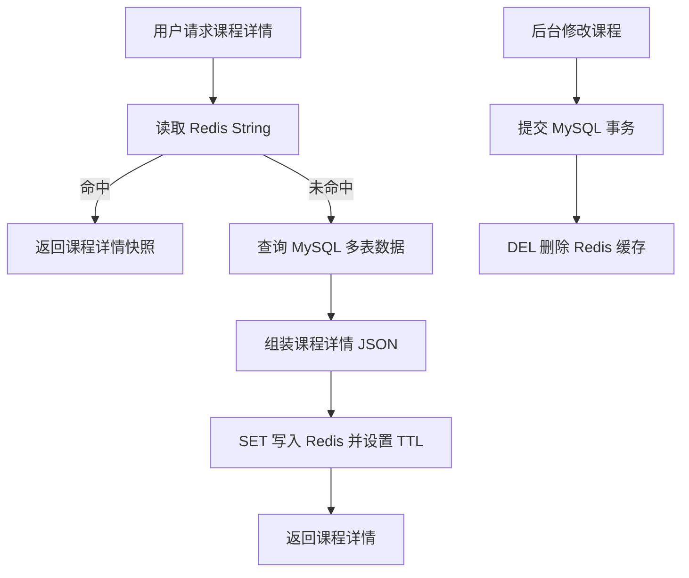

说明：

- 读取课程详情时，优先用 `GET` 查询 Redis String。参考：[Redis 官方 GET 文档](https://redis.io/docs/latest/commands/get/)
- Redis 未命中时，回源 MySQL 查询事实数据并重建缓存。**标记：主观推断**
- 写入课程详情快照时，可以用 `SET key value EX seconds` 同时设置 TTL。参考：[Redis 官方 SET 文档](https://redis.io/docs/latest/commands/set/)
- 后台修改课程后，建议 MySQL 事务提交成功后再删除 Redis 缓存。**标记：主观推断**
- 删除缓存可以使用 `DEL`。参考：[Redis 官方 DEL 文档](https://redis.io/docs/latest/commands/del/)

### 5. 关键命令

| 命令           | 作用                                                                                 |
| ------------ | ---------------------------------------------------------------------------------- |
| `GET`        | 读取课程详情 JSON 快照。参考：[Redis 官方 GET 文档](https://redis.io/docs/latest/commands/get/)    |
| `SET ... EX` | 写入课程详情快照并设置过期时间。参考：[Redis 官方 SET 文档](https://redis.io/docs/latest/commands/set/)   |
| `DEL`        | 后台修改课程后删除缓存。参考：[Redis 官方 DEL 文档](https://redis.io/docs/latest/commands/del/)       |
| `INCR`       | 简单计数，例如 PV、访问次数。参考：[Redis 官方 INCR 文档](https://redis.io/docs/latest/commands/incr/) |

### 6. 边界和坑

| 问题             | 说明                                                         |
| -------------- | ---------------------------------------------------------- |
| 大 JSON 变成大 Key | 课程详情字段过多会增加 Redis 读写、网络传输和删除成本。**标记：主观推断**                 |
| 局部字段更新困难       | String 更适合整体读写；如果字段频繁局部更新，优先考虑 Hash 或 JSON。**标记：主观推断**     |
| 缓存击穿           | 热门课程缓存过期时，大量请求可能同时回源 MySQL，需要重建锁或 singleflight。**标记：主观推断** |
| 缓存和 DB 不一致     | 后台修改课程后，如果 Redis 未删除，用户可能看到旧课程信息。**标记：主观推断**               |
| 不能当事实源         | 课程事实仍在 MySQL，Redis 只是加速层，丢了要能重建。**标记：主观推断**                |

### 7. 本章记忆点

1. String 最适合缓存完整读模型，不适合频繁局部字段更新。
2. 课程详情适合 String 的前提是：整体读取、整体返回、修改频率低。
3. MySQL 保课程事实，Redis 提升读取性能；Redis 丢了必须能从 MySQL 重建。

---


## 4. Bitmaps：适合海量是/否状态记录

**要讲清楚的问题：**  
签到、活跃、是否完成、是否访问这类海量布尔状态为什么适合 Bitmaps？

### 1. 本章一句话

Redis Bitmaps 适合记录海量“是 / 否”状态，例如每日签到、用户活跃、课程是否完成。参考：[Redis 官方 Bitmaps 文档](https://redis.io/docs/latest/develop/data-types/strings/bitmaps/)

核心判断：Bitmap 的价值不是表达复杂业务过程，而是用极低空间成本记录大量布尔状态。**标记：主观推断**


### 2. 适合解决什么问题？

| 场景          | 为什么适合                                                                                                              |
| ----------- | ------------------------------------------------------------------------------------------------------------------ |
| 每日签到状态      | 每个用户每天只有“签 / 未签”两种状态，适合用 1 个 bit 表示。**标记：主观推断**                                                                    |
| 用户活跃天数      | 每天是否活跃是布尔状态，可以按日期或用户维度组织 Bitmap。**标记：主观推断**                                                                        |
| 课程是否完成      | 是否完成是典型 yes/no 状态，适合 Bitmap 压缩记录。**标记：主观推断**                                                                       |
| 是否访问 / 是否读过 | 访问过或未访问过，只需要记录 0/1。**标记：主观推断**                                                                                     |
| 大规模布尔统计     | `BITCOUNT` 可以统计 Bitmap 中被设置为 1 的 bit 数量。参考：[Redis 官方 BITCOUNT 文档](https://redis.io/docs/latest/commands/bitcount/) |


### 3. 主案例

```text
主案例：每日签到状态记录

核心原因：
每日签到本质是“某个用户在某一天是否签到”的布尔状态，Bitmap 可以用一个 bit 表示一个用户的签到状态，比用 Set 或 MySQL 明细直接做高频统计更节省空间。**标记：主观推断**
```

辅助案例：

- 用户活跃天数：重点关注按天记录活跃状态，以及按周期统计活跃人数。
- 课程是否完成：重点关注完成状态可以缓存，但学习完成事实仍要落 MySQL。
- 是否访问 / 是否读过：重点关注 0/1 状态记录，不适合表达复杂访问过程。


### 4. 核心流程

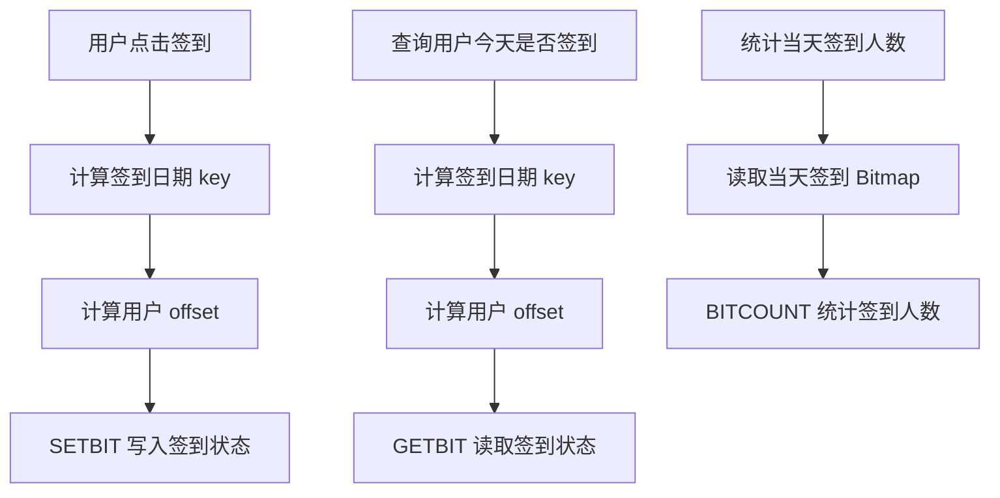

说明：

- 每日签到可以按日期设计 key，例如 `signin:2026-07-05`。**标记：主观推断**
- 用户 ID 可以映射为 Bitmap 的 offset，但前提是 offset 设计稳定、可控。**标记：主观推断**
- `SETBIT` 可以把指定 offset 的 bit 设置为 0 或 1。参考：[Redis 官方 SETBIT 文档](https://redis.io/docs/latest/commands/setbit/)
- `GETBIT` 可以读取指定 offset 的 bit 值。参考：[Redis 官方 GETBIT 文档](https://redis.io/docs/latest/commands/getbit/)
- `BITCOUNT` 可以统计 Bitmap 中值为 1 的 bit 数量。参考：[Redis 官方 BITCOUNT 文档](https://redis.io/docs/latest/commands/bitcount/)
- Bitmap 适合记录签到状态，但不适合保存签到时间、补签原因、奖励发放记录等复杂业务明细。**标记：主观推断**


### 5. 关键命令

| 命令         | 作用                                                                                                       |
| ---------- | -------------------------------------------------------------------------------------------------------- |
| `SETBIT`   | 记录某个用户当天已签到。参考：[Redis 官方 SETBIT 文档](https://redis.io/docs/latest/commands/setbit/)                       |
| `GETBIT`   | 查询某个用户当天是否已签到。参考：[Redis 官方 GETBIT 文档](https://redis.io/docs/latest/commands/getbit/)                     |
| `BITCOUNT` | 统计当天签到人数。参考：[Redis 官方 BITCOUNT 文档](https://redis.io/docs/latest/commands/bitcount/)                      |
| `BITOP`    | 可用于多个 Bitmap 之间做交集、并集等位运算，但精简版只点到为止。参考：[Redis 官方 BITOP 文档](https://redis.io/docs/latest/commands/bitop/) |


### 6. 边界和坑

| 问题               | 说明                                                         |
| ---------------- | ---------------------------------------------------------- |
| 不适合复杂状态          | Bitmap 只能表达 0/1，不适合表达签到时间、补签状态、奖励状态。**标记：主观推断**            |
| offset 设计容易出错    | 如果 userId 不连续、过大或映射规则变化，会造成空间浪费或数据错位。**标记：主观推断**           |
| 不能替代 MySQL 明细表   | 签到记录涉及补签、奖励、审计、客服排查时，仍需要 MySQL 明细。**标记：主观推断**              |
| 大 Bitmap 仍可能带来成本 | 用户规模很大时，Bitmap 虽然省空间，但统计和运维仍要关注 key 大小。**标记：主观推断**         |
| 业务含义必须固定         | 同一个 key 的日期维度、offset 规则、bit 含义必须长期稳定，否则历史数据难解释。**标记：主观推断** |


### 7. 本章记忆点

1. Bitmap 最适合海量“是 / 否”状态，不适合复杂业务过程。
2. 每日签到适合 Bitmap 的前提是：状态简单、offset 规则稳定、可接受用 0/1 表达。
3. Bitmap 可以做高效状态记录和统计，但签到事实、补签、奖励、审计仍要靠 MySQL 兜底。

---

## 5. Bitfields：适合在字符串里高效编码多个小整数计数器

**要讲清楚的问题：**  
多个小范围计数、状态位、压缩计数字段为什么可以考虑 Bitfields？

### 1. 本章一句话

Redis Bitfields 适合把多个小范围整数状态压缩存进一个 Redis String，例如每日任务的观看次数、答题次数、分享次数、奖励领取状态。参考：[Redis 官方 Bitfields 文档](https://redis.io/docs/latest/develop/data-types/strings/bitfields/)

核心判断：Bitfields 的价值不是“更高级的 Bitmap”，而是在一个 String 里用固定 bit 宽度编码多个小整数，适合状态字段多、数值范围小、访问频率高的场景。**标记：主观推断**


### 2. 适合解决什么问题？


| 场景        | 为什么适合                                                                                                                         |
| --------- | ----------------------------------------------------------------------------------------------------------------------------- |
| 用户每日任务进度  | 多个任务进度通常是小整数，例如观看 0~~10 节、答题 0~~20 次、分享 0~5 次。**标记：主观推断**                                                                     |
| 游戏活动小计数器  | 今日挑战次数、剩余次数、连胜次数、领取状态都可以用小整数表达。**标记：主观推断**                                                                                    |
| 用户轻量状态位   | 多个小范围状态可以编码在同一个 String 中，减少 key 数量。**标记：主观推断**                                                                                |
| 风控短期状态字段  | 风险等级、限制次数、状态位可以压缩保存，但要注意可读性。**标记：主观推断**                                                                                       |
| 多个计数器原子操作 | `BITFIELD` 支持在一次调用中对多个 bit field 执行 GET、SET、INCRBY。参考：[Redis 官方 BITFIELD 文档](https://redis.io/docs/latest/commands/bitfield/) |


### 3. 主案例

```text
主案例：用户每日任务进度压缩记录

核心原因：
每日任务通常包含多个小范围计数字段，例如登录状态、观看课程数、答题次数、分享次数、奖励领取状态。如果每个字段都单独用一个 String key，key 数量和管理成本会变高；如果用 JSON，可读性更好但空间和局部更新不如 Bitfields 紧凑。**标记：主观推断**
```

辅助案例：

- 游戏活动小计数器：适合记录今日挑战次数、剩余次数、连胜次数，重点关注溢出边界。
- 用户状态位压缩：适合记录多个小范围状态，重点关注字段含义长期稳定。
- 风控轻量状态字段：适合短期状态压缩，重点关注可解释性和审计边界。


### 4. 核心流程

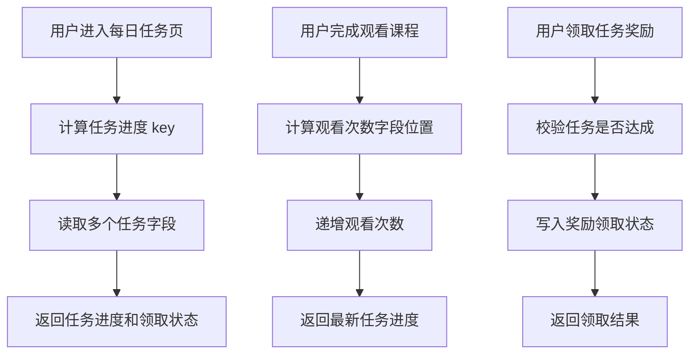


说明：

- `BITFIELD GET` 可以读取指定 bit 宽度和 offset 的整数值。参考：[Redis 官方 BITFIELD 文档](https://redis.io/docs/latest/commands/bitfield/)
- `BITFIELD INCRBY` 可以对指定 bit field 做递增，适合任务进度计数。参考：[Redis 官方 BITFIELD 文档](https://redis.io/docs/latest/commands/bitfield/)
- `BITFIELD SET` 可以写入指定 bit field，适合记录奖励是否领取、任务状态等小整数。参考：[Redis 官方 BITFIELD 文档](https://redis.io/docs/latest/commands/bitfield/)
- 每个字段的 bit 宽度必须提前设计，例如观看次数 4 bit、答题次数 5 bit、领取状态 1 bit。**标记：主观推断**
- Bitfields 适合压缩任务进度展示状态，但奖励流水、任务完成事实、补偿记录仍建议落 MySQL。**标记：主观推断**


### 5. 关键命令


| 命令                | 作用                                                                                                  |
| ----------------- | --------------------------------------------------------------------------------------------------- |
| `BITFIELD GET`    | 读取用户每日任务中的多个小整数进度。参考：[Redis 官方 BITFIELD 文档](https://redis.io/docs/latest/commands/bitfield/)        |
| `BITFIELD SET`    | 写入任务状态，例如奖励是否已领取。参考：[Redis 官方 BITFIELD 文档](https://redis.io/docs/latest/commands/bitfield/)         |
| `BITFIELD INCRBY` | 递增任务计数，例如观看课程数、答题次数、分享次数。参考：[Redis 官方 BITFIELD 文档](https://redis.io/docs/latest/commands/bitfield/) |
| `OVERFLOW`        | 控制递增发生溢出时的行为，避免小整数超出设计范围。参考：[Redis 官方 BITFIELD 文档](https://redis.io/docs/latest/commands/bitfield/) |


### 6. 边界和坑


| 问题             | 说明                                                       |
| -------------- | -------------------------------------------------------- |
| 字段设计复杂         | Bitfields 需要提前设计 bit 宽度和 offset，一旦上线后修改成本高。**标记：主观推断**   |
| 可读性差           | 相比 Hash / JSON，Bitfields 对排查问题不直观，需要配套字段说明文档。**标记：主观推断** |
| 容易溢出           | 小整数字段如果 bit 宽度设计太小，计数超过上限会出现溢出风险。**标记：主观推断**             |
| 不适合复杂对象        | 如果任务进度包含时间、来源、奖励明细、失败原因，Bitfields 不适合完整表达。**标记：主观推断**    |
| 不能替代 MySQL 事实源 | 任务完成记录、奖励发放流水、补偿记录仍应以 MySQL 为准。**标记：主观推断**               |


### 7. 本章记忆点

1. Bitfields 适合多个小范围整数，不适合复杂业务对象。
2. Bitfields 的关键不是命令，而是 bit 宽度、offset 和溢出边界设计。
3. Redis Bitfields 适合做高频状态压缩，MySQL 仍负责事实记录和可追溯性。

---

## 6. Arrays：适合稀疏、可按索引访问的字符串序列

**要讲清楚的问题：**  
哪些按下标读写、位置相对固定、但数据可能稀疏的业务数据可以考虑 Arrays？

### 1. 本章一句话

Redis Arrays 适合存储“按下标访问、位置含义固定、数据可能稀疏”的字符串序列，例如课程学习路径步骤状态。参考：[Redis 官方 Arrays 文档](https://redis.io/docs/latest/develop/data-types/arrays/)

核心判断：Arrays 适合“第 N 个位置有明确业务含义”的场景，不适合频繁插队、复杂排序、强事实记录或结构频繁变化的业务数据。**标记：主观推断**


### 2. 适合解决什么问题？

| 场景           | 为什么适合                                                                                                         |
| ------------ | ------------------------------------------------------------------------------------------------------------- |
| 用户课程学习路径步骤状态 | 第 0 步、第 1 步、第 N 步含义固定，可以按索引读写步骤状态。**标记：主观推断**                                                                 |
| 活动关卡进度数组     | 第 N 关状态、奖励状态、是否完成，天然适合按关卡索引访问。**标记：主观推断**                                                                     |
| 首页固定坑位配置     | Banner 位、推荐位、运营坑位是固定位置内容，可以按位置读取。**标记：主观推断**                                                                  |
| 用户任务步骤结果     | 第 N 个任务节点的结果状态可按索引保存，但任务事实仍要落 MySQL。**标记：主观推断**                                                               |
| 稀疏索引访问       | Arrays 支持直接按索引访问，未设置索引返回 nil。参考：[Redis 官方 Arrays 文档](https://redis.io/docs/latest/develop/data-types/arrays/) |


### 3. 主案例

```text
主案例：用户课程学习路径步骤状态

核心原因：
课程学习路径通常由固定步骤组成，例如第 0 步导学、第 1 步基础课、第 2 步练习、第 3 步测验；用户可能只完成了部分步骤，所以数据可能稀疏。Arrays 可以按步骤索引直接读写对应状态，比 List 更强调固定索引含义，比 Hash 更适合“位置就是业务语义”的场景。**标记：主观推断**
```

辅助案例：

- 活动关卡进度数组：适合按关卡编号读写状态，重点关注关卡版本变更。
- 首页固定坑位配置：适合按坑位索引读取内容，重点关注运营配置变更和缓存失效。
- 固定位置推荐结果缓存：适合短期缓存推荐位结果，重点关注排序变化和过期时间。


### 4. 核心流程

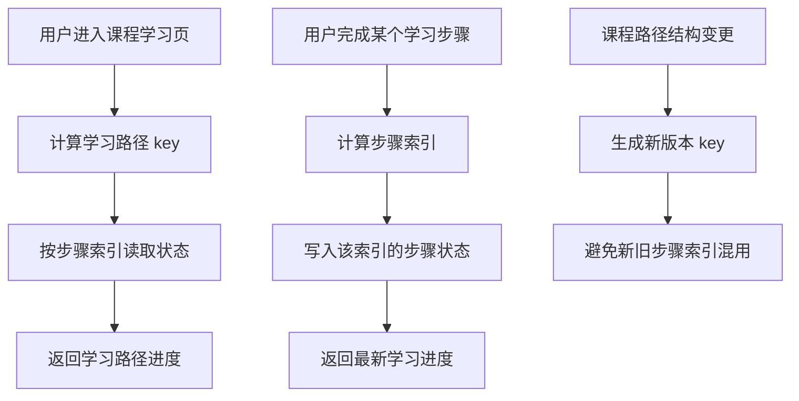

说明：

- `ARGET` 可以按索引读取 Arrays 中的单个值。参考：[Redis 官方 ARGET 文档](https://redis.io/docs/latest/commands/arget/)
- `ARMGET` 可以一次读取多个指定索引。参考：[Redis 官方 ARMGET 文档](https://redis.io/docs/latest/commands/armget/)
- `ARSET` 可以从指定索引开始写入连续值。参考：[Redis 官方 ARSET 文档](https://redis.io/docs/latest/commands/arset/)
- `ARMSET` 可以一次写入多个非连续索引。参考：[Redis 官方 ARMSET 文档](https://redis.io/docs/latest/commands/armset/)
- 学习路径步骤状态适合 Arrays 的前提是：索引含义稳定，且第 N 步长期代表同一个业务步骤。**标记：主观推断**
- 学习完成事实、考试结果、证书发放记录仍建议落 MySQL，Redis Arrays 只做高频读取状态视图。**标记：主观推断**
- Redis Arrays 当前处于 preview，正式生产使用前需要确认当前 Redis 8.8.0 部署版本、客户端支持和变更风险。参考：[Redis 官方 Arrays 文档](https://redis.io/docs/latest/develop/data-types/arrays/)


### 5. 关键命令

| 命令       | 作用                                                                                    |
| -------- | ------------------------------------------------------------------------------------- |
| `ARGET`  | 读取某个学习步骤的状态。参考：[Redis 官方 ARGET 文档](https://redis.io/docs/latest/commands/arget/)      |
| `ARMGET` | 一次读取多个学习步骤状态。参考：[Redis 官方 ARMGET 文档](https://redis.io/docs/latest/commands/armget/)   |
| `ARSET`  | 初始化或连续写入学习路径步骤状态。参考：[Redis 官方 ARSET 文档](https://redis.io/docs/latest/commands/arset/) |
| `ARMSET` | 更新多个非连续步骤状态。参考：[Redis 官方 ARMSET 文档](https://redis.io/docs/latest/commands/armset/)    |
| `ARDEL`  | 删除指定索引的步骤状态。参考：[Redis 官方 ARDEL 文档](https://redis.io/docs/latest/commands/ardel/)      |


### 6. 边界和坑

| 问题             | 说明                                                                                                                              |
| -------------- | ------------------------------------------------------------------------------------------------------------------------------- |
| 仍处于 preview    | Redis 官方说明 Arrays 当前处于 preview，可能变化，生产使用前要谨慎评估。参考：[Redis 官方 Arrays 文档](https://redis.io/docs/latest/develop/data-types/arrays/) |
| 索引含义不能乱变       | 如果第 2 步原来是练习，后来变成测验，历史状态会被错误解释。**标记：主观推断**                                                                                      |
| 不适合频繁插入重排      | 如果学习路径经常插入、删除、排序变化，固定索引会变成维护负担。**标记：主观推断**                                                                                      |
| 不能替代 MySQL 事实源 | 学习完成、考试通过、证书发放、权益解锁必须有 MySQL 事实记录。**标记：主观推断**                                                                                   |
| 稀疏不等于无限乱用      | 虽然 Arrays 支持稀疏索引，但超大索引、混乱索引会增加理解和维护成本。**标记：主观推断**                                                                               |


### 7. 本章记忆点

1. Arrays 适合“按索引访问、位置含义固定、数据可能稀疏”的字符串序列。
2. 学习路径步骤状态适合 Arrays 的前提是：第 N 步的业务含义长期稳定。
3. Redis Arrays 适合做高频状态视图，学习事实、考试结果、证书权益仍要以 MySQL 为准。

---

## 7. Geospatial indexes：适合地理位置范围查询

**要讲清楚的问题：**  
附近门店、附近用户、位置半径查询为什么适合 Geospatial indexes？

### 1. 本章一句话

Geospatial indexes 适合解决“根据经纬度查附近对象”的问题，例如附近门店、附近地点、附近活动点；Redis 官方说明 Geospatial data type 可用于查找给定地理半径或边界框内的位置。参考：[Redis 官方 Geospatial 文档](https://redis.io/docs/latest/develop/data-types/geospatial/)

本章核心判断：Geospatial indexes 适合做位置范围查询的第一层筛选，但不适合替代完整地图服务、复杂地理分析或复杂业务搜索系统。**标记：主观推断**


### 2. 适合解决什么问题？

| 场景            | 为什么适合                                                                                                                         |
| ------------- | ----------------------------------------------------------------------------------------------------------------------------- |
| 附近门店 / 地点范围查询 | 用户给出当前位置后，可以用 Geospatial indexes 查指定半径或边界框内的门店位置。参考：[Redis 官方 GEOSEARCH 文档](https://redis.io/docs/latest/commands/geosearch/) |
| 附近活动点查询       | 活动点本质也是一组经纬度位置，适合先按地理范围筛出候选点，再回业务系统判断活动状态。**标记：主观推断**                                                                         |
| 地理围栏类查询       | 可以用半径或矩形范围做粗粒度位置判断，但复杂多边形围栏、路径规划、地图分析不应只靠 Redis Geospatial 完成。**标记：主观推断**                                                     |


### 3. 主案例

```text
主案例：附近门店 / 地点范围查询

业务背景：
用户打开附近门店页面，客户端上传当前位置经纬度，后端需要返回 3 公里内可访问的门店列表。

核心原因：
Redis Geospatial indexes 适合先根据经纬度快速筛出附近门店 ID；门店名称、营业状态、库存、权限、上下架等业务信息仍然从 MySQL 或业务服务读取。**标记：主观推断**
```


### 4. 核心流程

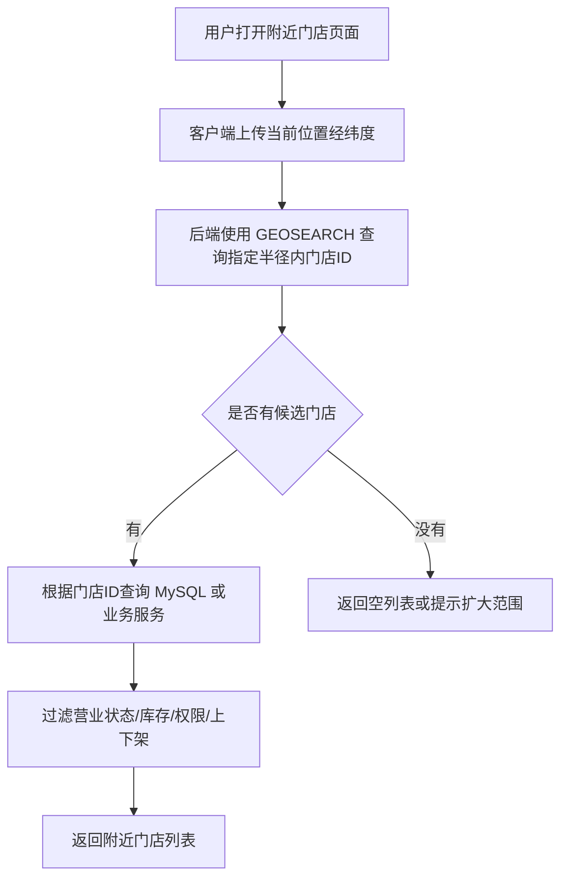

说明：

- `GEOSEARCH` 可以从由 `GEOADD` 填充的 geospatial sorted set 中查询指定圆形或矩形范围内的成员。参考：[Redis 官方 GEOSEARCH 文档](https://redis.io/docs/latest/commands/geosearch/)
- `GEOADD` 用于写入经度、纬度、成员名，并且 Redis 官方说明这类数据底层存储为 sorted set，后续可用 `GEOSEARCH` 查询。参考：[Redis 官方 GEOADD 文档](https://redis.io/docs/latest/commands/geoadd/)
- 附近门店查询中，Redis 更适合作为“位置索引层”，MySQL / 业务服务更适合作为“业务事实源”。**标记：主观推断**
- Geospatial indexes 只解决“位置范围筛选”，不解决门店是否营业、是否有库存、用户是否有权限等业务判断。**标记：主观推断**


### 5. 关键命令

| 命令                                                                                          | 作用                                                                                                                     |
| ------------------------------------------------------------------------------------------- | ---------------------------------------------------------------------------------------------------------------------- |
| `GEOADD store:geo <longitude> <latitude> <storeId>`                                         | 写入或更新门店位置；注意经度在前、纬度在后。参考：[Redis 官方 GEOADD 文档](https://redis.io/docs/latest/commands/geoadd/)                           |
| `GEOSEARCH store:geo FROMLONLAT <longitude> <latitude> BYRADIUS 3 KM WITHDIST ASC COUNT 20` | 查询用户当前位置 3 公里内的门店，并返回距离。参考：[Redis 官方 GEOSEARCH 文档](https://redis.io/docs/latest/commands/geosearch/)                   |
| `GEOSEARCH store:geo FROMLONLAT <longitude> <latitude> BYBOX <width> <height> KM`           | 按矩形边界框查询附近门店，适合区域范围粗筛。参考：[Redis 官方 GEOSEARCH 文档](https://redis.io/docs/latest/commands/geosearch/)                     |
| `ZREM store:geo <storeId>`                                                                  | 删除门店位置；Redis 官方说明没有单独的 `GEODEL`，可以用 `ZREM` 删除元素。参考：[Redis 官方 GEOADD 文档](https://redis.io/docs/latest/commands/geoadd/) |


### 6. 边界和坑

| 问题                 | 说明                                                                                                                                                                                                                        |
| ------------------ | ------------------------------------------------------------------------------------------------------------------------------------------------------------------------------------------------------------------------- |
| 经纬度顺序写反            | `GEOADD` 使用 longitude、latitude，即经度在前、纬度在后；写反会导致位置查询结果明显异常。参考：[Redis 官方 GEOADD 文档](https://redis.io/docs/latest/commands/geoadd/)                                                                                          |
| 坐标范围有限制            | Redis 官方说明有效经度范围是 -180 到 180，有效纬度范围是 -85.05112878 到 85.05112878，超出范围会报错。参考：[Redis 官方 GEOADD 文档](https://redis.io/docs/latest/commands/geoadd/)                                                                            |
| 不适合复杂地理分析          | Redis 官方提醒不要混淆 Geospatial data type 和 Redis Search 的 geospatial features；Geospatial data type 更适合简单用例，查询能力没有 Redis Search 地理能力丰富。参考：[Redis 官方 Geospatial 文档](https://redis.io/docs/latest/develop/data-types/geospatial/) |
| 不能只靠 Redis 判断业务可用性 | 门店是否营业、是否上架、是否有库存、用户是否有权限，仍要回 MySQL 或业务服务确认。**标记：主观推断**                                                                                                                                                                   |
| 查询结果可能过大           | 半径设置过大或门店密度过高时，候选结果会变多，需要限制 `COUNT`、分页或二次过滤。**标记：主观推断**                                                                                                                                                                   |


### 7. 本章记忆点

1. Geospatial indexes 的核心价值是“按经纬度查附近对象”，不是完整地图系统。
2. `GEOADD` 负责写入位置，`GEOSEARCH` 负责按半径或边界框查附近位置。
3. Redis 只做位置范围筛选，最终业务正确性仍要回 MySQL / 业务服务确认。**标记：主观推断**

---

## 8. Hashes：适合对象字段状态和局部更新

**要讲清楚的问题：**  
用户学习进度、活动状态、会话状态为什么适合 Hashes？

### 1. 本章一句话

Hashes 适合保存“一个对象下多个字段”的状态，例如用户学习进度、活动运行状态、用户会话状态；Redis 官方说明 Hashes 是由 field-value pairs 组成的 record types，可以用于表示基础对象和一组计数器。参考：[Redis 官方 Hashes 文档](https://redis.io/docs/latest/develop/data-types/hashes/)

本章核心判断：Hashes 适合字段相对稳定、需要局部读写的对象状态，不适合无限增长的明细列表。**标记：主观推断**


### 2. 适合解决什么问题？

| 场景         | 为什么适合                                                                                                                                           |
| ---------- | ----------------------------------------------------------------------------------------------------------------------------------------------- |
| 用户学习进度字段状态 | 一个用户在一门课程下通常有多个进度字段，例如当前章节、完成状态、最近学习时间、累计学习时长，Hashes 可以按字段局部读写。参考：[Redis 官方 Hashes 文档](https://redis.io/docs/latest/develop/data-types/hashes/) |
| 活动运行状态     | 活动状态、参与人数、开始时间、结束时间等字段可以放在同一个 Hash 对象里，适合字段级读取和更新。**标记：主观推断**                                                                                   |
| 用户会话状态     | 登录设备、最近活跃时间、临时状态等字段属于同一个会话对象，适合用 Hashes 表达对象字段。**标记：主观推断**                                                                                      |


### 3. 主案例

```text
主案例：用户学习进度字段状态

业务背景：
用户学习课程时，后端需要频繁读取和更新当前章节、完成状态、最近学习时间、累计学习时长等字段。

核心原因：
相比把整个学习进度 JSON 存成 String，Hashes 更适合对单个字段做局部读写，避免每次只改一个字段却读写整个对象。**标记：主观推断**
```

辅助案例：

- 活动运行状态：适合保存活动状态、参与人数、阶段、开始时间、结束时间，重点关注字段边界和事实源。**标记：主观推断**
- 用户会话状态：适合保存设备、登录时间、最近活跃时间，重点关注 TTL 和过期策略。**标记：主观推断**
- 对象字段局部更新：适合字段相对稳定的对象，不适合无限追加明细。**标记：主观推断**


### 4. 核心流程

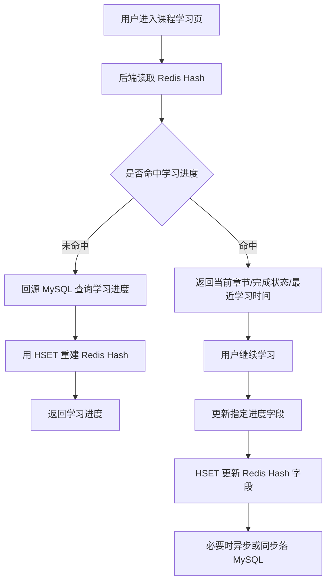

说明：

- `HSET` 可以创建或修改 Hash 中字段的值，适合更新学习进度里的某个字段。参考：[Redis 官方 HSET 文档](https://redis.io/docs/latest/commands/hset/)
- `HGET` 可以读取 Hash 中单个字段，`HMGET` 可以一次读取多个字段，适合学习页只取需要展示的进度字段。参考：[Redis 官方 HGET 文档](https://redis.io/docs/latest/commands/hget/)；参考：[Redis 官方 HMGET 文档](https://redis.io/docs/latest/commands/hmget/)
- 学习结果、完成记录、结算类数据不应该只放 Redis，MySQL 应保留可复查的事实数据。**标记：主观推断**
- Hashes 的优势是对象字段局部读写，不是承载无限增长的学习行为明细。**标记：主观推断**


### 5. 关键命令

| 命令                                                                                     | 作用                                                                                                       |
| -------------------------------------------------------------------------------------- | -------------------------------------------------------------------------------------------------------- |
| `HSET user:course:progress:{userId}:{courseId} current_lesson lesson_3`                | 更新用户当前学习章节。参考：[Redis 官方 HSET 文档](https://redis.io/docs/latest/commands/hset/)                            |
| `HGET user:course:progress:{userId}:{courseId} current_lesson`                         | 读取用户当前学习章节。参考：[Redis 官方 HGET 文档](https://redis.io/docs/latest/commands/hget/)                            |
| `HMGET user:course:progress:{userId}:{courseId} current_lesson status last_learned_at` | 一次读取多个学习进度字段。参考：[Redis 官方 HMGET 文档](https://redis.io/docs/latest/commands/hmget/)                        |
| `HDEL user:course:progress:{userId}:{courseId} temp_state`                             | 删除不再需要的临时字段；`HDEL` 用于删除 Hash 中一个或多个字段。参考：[Redis 官方 HDEL 文档](https://redis.io/docs/latest/commands/hdel/) |


### 6. 边界和坑

| 问题           | 说明                                                                                                                                                              |
| ------------ | --------------------------------------------------------------------------------------------------------------------------------------------------------------- |
| 字段无限增长       | Hashes 适合字段相对稳定的对象，不适合把每次学习行为、每次点击、每次播放记录都追加成字段。**标记：主观推断**                                                                                                     |
| 大 Hash 风险    | 如果一个 Hash 里字段过多，`HGETALL` 这类全量读取会变重；Redis 官方将 `HGETALL` 标为 slow，复杂度和 Hash 大小相关。参考：[Redis 官方 Hashes 文档](https://redis.io/docs/latest/develop/data-types/hashes/) |
| 对象边界不清       | 一个 key 应该表达一个清晰对象，例如一个用户一门课程的进度；不要把多个用户或多门课程混在一个 Hash 里。**标记：主观推断**                                                                                             |
| 把 Redis 当事实源 | 用户最终完成记录、证书、积分、结算结果等关键事实不能只依赖 Redis Hash。**标记：主观推断**                                                                                                            |
| TTL 策略不清     | 学习进度如果只是缓存，可以设置 TTL；如果是关键事实，必须落 MySQL，不能靠 Redis 过期数据保证正确性。**标记：主观推断**                                                                                           |


### 7. 本章记忆点

1. Hashes 适合“一个对象多个字段”，核心价值是字段级局部读写。
2. 用户学习进度、活动状态、会话状态适合 Hashes；学习行为明细、无限列表不适合 Hashes。
3. Redis Hash 可以加速状态读取，但最终学习结果和可复查事实仍要落 MySQL。**标记：主观推断**

---

## 9. JSON：适合结构化、层级化对象的读写和局部查询

**要讲清楚的问题：**  
复杂配置、层级对象、需要局部访问和修改的结构化数据什么时候适合 JSON？

### 1. 本章一句话

Redis JSON 适合保存结构化、层级化的 JSON 文档，并支持按 JSONPath 访问和更新文档内部元素；Redis 官方说明 JSON 能在 Redis 中存储、更新和读取 JSON values。参考：[Redis 官方 JSON 文档](https://redis.io/docs/latest/develop/data-types/json/)

本章核心判断：JSON 适合“结构清晰、层级明确、需要局部访问或修改”的对象缓存，不适合大对象、过深嵌套和无限增长的明细数据。**标记：主观推断**


### 2. 适合解决什么问题？

| 场景                 | 为什么适合                                                                                                                                   |
| ------------------ | --------------------------------------------------------------------------------------------------------------------------------------- |
| 层级配置缓存             | 配置通常天然是多层结构，例如课程展示配置、活动规则配置、奖励配置；Redis JSON 可以按路径读取或更新局部配置。参考：[Redis 官方 JSON 文档](https://redis.io/docs/latest/develop/data-types/json/) |
| 结构化对象缓存            | Redis JSON 支持存储、更新、读取 JSON values，适合结构化对象缓存。参考：[Redis 官方 JSON 文档](https://redis.io/docs/latest/develop/data-types/json/)                |
| 需要局部访问或修改的 JSON 数据 | Redis 官方说明 JSON 可用 JSONPath 选择和更新文档内部元素，适合只读写对象的一部分。参考：[Redis 官方 JSON 文档](https://redis.io/docs/latest/develop/data-types/json/)        |


### 3. 主案例

```text
主案例：层级配置缓存

业务背景：
课程或活动页面有一份层级配置，例如页面展示区、按钮配置、奖励配置、规则说明、灰度开关等，前端每次进入页面都需要读取这份配置。

核心原因：
相比把整个 JSON 当 String 快照读写，Redis JSON 更适合对结构化配置做路径级读取和局部更新；但配置事实源仍建议保存在 MySQL 或配置中心，Redis 只做高频读取加速。**标记：主观推断**
```

辅助案例：

- 结构化对象缓存：适合保存层级清晰的对象，重点关注对象大小和字段边界。**标记：主观推断**
- 活动配置缓存：适合保存规则、展示、奖励等配置，重点关注后台修改后的缓存更新。**标记：主观推断**
- 局部访问 JSON 数据：适合只读取某个路径的数据，不适合无限追加明细。**标记：主观推断**


### 4. 核心流程

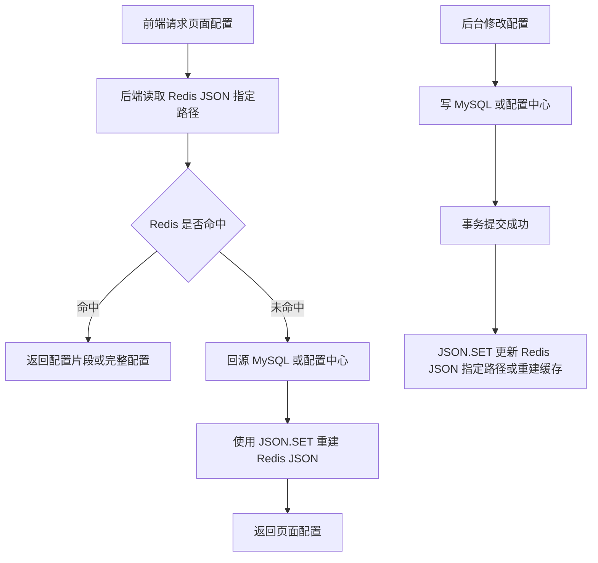

说明：

- `JSON.GET` 可以获取一个或多个路径上的 JSON 序列化值，适合读取层级配置中的指定路径。参考：[Redis 官方 JSON.GET 文档](https://redis.io/docs/latest/commands/json.get/)
- `JSON.SET` 可以设置 Redis key 上的 JSON value，也可以替换或新增指定路径上的值。参考：[Redis 官方 JSON.SET 文档](https://redis.io/docs/latest/commands/json.set/)
- 层级配置缓存里，Redis JSON 更适合作为结构化读模型，MySQL 或配置中心更适合作为配置事实源。**标记：主观推断**
- 后台修改配置后，应该先保证事实源写入成功，再更新或重建 Redis JSON，避免缓存先变更但事实源失败。**标记：主观推断**


### 5. 关键命令

| 命令                                                     | 作用                                                                                                                     |
| ------------------------------------------------------ | ---------------------------------------------------------------------------------------------------------------------- |
| `JSON.SET page:config:{pageId} $ '{...}'`              | 写入或重建整份页面层级配置。参考：[Redis 官方 JSON.SET 文档](https://redis.io/docs/latest/commands/json.set/)                               |
| `JSON.GET page:config:{pageId} $.layout.banner`        | 读取页面配置中的指定路径，例如 banner 配置。参考：[Redis 官方 JSON.GET 文档](https://redis.io/docs/latest/commands/json.get/)                   |
| `JSON.SET page:config:{pageId} $.rules.reward '{...}'` | 局部更新奖励规则配置，避免重写整个对象。参考：[Redis 官方 JSON.SET 文档](https://redis.io/docs/latest/commands/json.set/)                         |
| `EXPIRE page:config:{pageId} 3600`                     | 给配置缓存设置过期时间，避免缓存长期不刷新；`EXPIRE` 用于设置 key 的秒级过期时间。参考：[Redis 官方 EXPIRE 文档](https://redis.io/docs/latest/commands/expire/) |


### 6. 边界和坑

| 问题                 | 说明                                                                           |
| ------------------ | ---------------------------------------------------------------------------- |
| 对象过大               | Redis JSON 虽然支持结构化文档，但大对象会增加内存、网络传输和局部操作成本；配置对象要控制大小。**标记：主观推断**             |
| 结构过深               | 过深的 JSON 层级会让路径读写、维护和排查变复杂；配置结构应保持清晰。**标记：主观推断**                             |
| 当成无限明细库            | Redis JSON 不适合保存不断追加的行为日志、订单明细、学习记录明细；这类数据应放 MySQL、日志系统或消息流。**标记：主观推断**      |
| 和 String JSON 边界不清 | 如果只是完整读写一份 JSON 快照，String 可能更简单；只有需要局部路径访问或修改时，Redis JSON 的价值更明显。**标记：主观推断** |
| 把 Redis 当事实源       | 配置最终版本、审核状态、发布时间等关键事实不应只放 Redis；Redis 丢失后必须能从 MySQL 或配置中心重建。**标记：主观推断**      |


### 7. 本章记忆点

1. Redis JSON 的核心价值是“结构化文档 + 路径级读写”，不是简单把 JSON 字符串塞进 Redis。
2. 层级配置、结构化对象、局部修改场景适合 JSON；大对象、深层嵌套、无限明细不适合。
3. Redis JSON 适合做结构化缓存和读模型，配置事实源仍应在 MySQL 或配置中心。**标记：主观推断**

---

## 10. Lists：适合按插入顺序保存的简单列表和轻量队列

**要讲清楚的问题：**  
最近记录、简单队列、按时间顺序追加的数据什么时候适合 Lists，什么时候不该用它替代专业 MQ？

### 1. 本章一句话

Lists 适合保存按插入顺序排列的数据，例如最近访问记录、最近操作记录、简单待处理队列；`LPUSH` 可以把一个或多个元素插入 List 头部，不存在时会创建 key。参考：[Redis 官方 LPUSH 文档](https://redis.io/docs/latest/commands/lpush/)

本章核心判断：Lists 适合“只保留最近 N 条、用于展示或轻量处理”的顺序数据，不适合替代专业 MQ，也不适合承载必须可靠消费、可追踪、可重试的关键业务事实。**标记：主观推断**


### 2. 适合解决什么问题？

| 场景      | 为什么适合                                                                                                                                                                                                                                                                                |
| ------- | ------------------------------------------------------------------------------------------------------------------------------------------------------------------------------------------------------------------------------------------------------------------------------------ |
| 最近访问记录  | 最近访问记录天然按时间倒序展示，`LPUSH` 写入最新记录，`LRANGE` 查询前 N 条，`LTRIM` 控制只保留最近 N 条。参考：[Redis 官方 LPUSH 文档](https://redis.io/docs/latest/commands/lpush/)；参考：[Redis 官方 LRANGE 文档](https://redis.io/docs/latest/commands/lrange/)；参考：[Redis 官方 LTRIM 文档](https://redis.io/docs/latest/commands/ltrim/) |
| 操作流水缓存  | 只展示最近几十条操作时，List 可以按插入顺序保存最近记录，但完整操作日志仍应落 MySQL 或日志系统。**标记：主观推断**                                                                                                                                                                                                                    |
| 简单待处理队列 | List 可以做轻量队列，但消费者失败、重试、确认、堆积治理较弱，关键任务不应只依赖 List。**标记：主观推断**                                                                                                                                                                                                                          |


### 3. 主案例

```text
主案例：最近访问记录

业务背景：
用户访问课程、文章、活动页后，后端需要在个人中心展示“最近访问的 20 条内容”。

核心原因：
最近访问记录只关心时间顺序和最近 N 条，Lists 可以用 LPUSH 写入最新访问，用 LRANGE 读取最近记录，用 LTRIM 控制列表长度；它适合展示型缓存，不适合作为用户访问事实的唯一来源。**标记：主观推断**
```

辅助案例：

- 简单待处理队列：适合非关键、可丢或有 MySQL 任务表兜底的轻量任务，重点关注消费者失败。**标记：主观推断**
- 操作流水缓存：适合展示最近操作，完整审计日志仍要落 MySQL / 日志系统。**标记：主观推断**
- 轻量异步任务：适合临时削峰，不适合替代专业 MQ 的 ACK、重试、死信和堆积治理。**标记：主观推断**


### 4. 核心流程

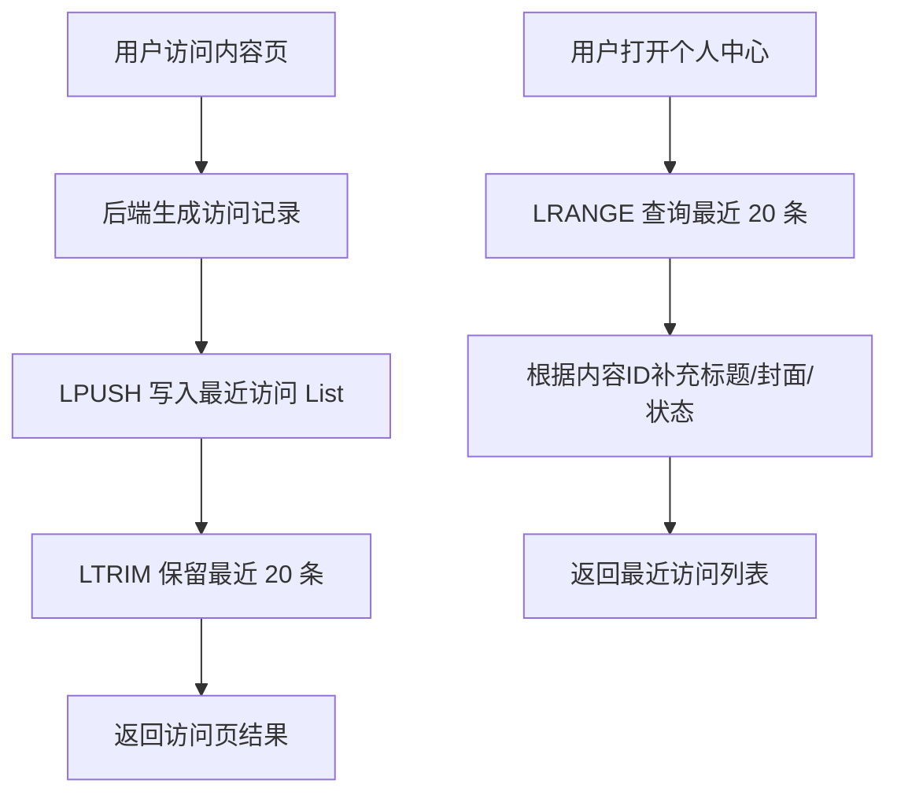

说明：

- `LPUSH` 会把元素插入 List 头部，适合把最新访问记录放在最前面。参考：[Redis 官方 LPUSH 文档](https://redis.io/docs/latest/commands/lpush/)
- `LRANGE` 返回 List 指定范围内的元素，偏移从 0 开始，也支持负数偏移。参考：[Redis 官方 LRANGE 文档](https://redis.io/docs/latest/commands/lrange/)
- `LTRIM` 可以把 List 裁剪到指定范围；官方示例说明 `LPUSH` 搭配 `LTRIM 0 99` 可确保列表不超过 100 个元素。参考：[Redis 官方 LTRIM 文档](https://redis.io/docs/latest/commands/ltrim/)
- 最近访问记录更适合作为展示缓存，内容标题、封面、上下架状态仍应从 MySQL 或内容服务确认。**标记：主观推断**
- 如果访问记录需要审计、计费、推荐训练或长期分析，不能只放 Redis List。**标记：主观推断**


### 5. 关键命令

| 命令                                            | 作用                                                                                           |
| --------------------------------------------- | -------------------------------------------------------------------------------------------- |
| `LPUSH user:recent:view:{userId} <contentId>` | 把最新访问内容写到列表头部。参考：[Redis 官方 LPUSH 文档](https://redis.io/docs/latest/commands/lpush/)           |
| `LTRIM user:recent:view:{userId} 0 19`        | 只保留最近 20 条，避免 List 无限增长。参考：[Redis 官方 LTRIM 文档](https://redis.io/docs/latest/commands/ltrim/) |
| `LRANGE user:recent:view:{userId} 0 19`       | 查询最近 20 条访问记录。参考：[Redis 官方 LRANGE 文档](https://redis.io/docs/latest/commands/lrange/)         |


### 6. 边界和坑

| 问题         | 说明                                                                                                           |
| ---------- | ------------------------------------------------------------------------------------------------------------ |
| List 无限增长  | 只 `LPUSH` 不 `LTRIM` 会让最近访问记录越来越大，最终变成内存和查询风险。**标记：主观推断**                                                     |
| 重复访问记录     | 同一个内容多次访问可能重复出现；如果业务要求去重，需要额外处理，List 本身不适合做唯一性约束。**标记：主观推断**                                                 |
| 不适合关键事实    | 最近访问展示可以丢或重建，但审计、计费、学习记录、推荐训练数据必须落 MySQL / 日志系统。**标记：主观推断**                                                  |
| 不适合替代专业 MQ | List 可以做轻量队列，但可靠消费、ACK、重试、死信、消费组、消息回放不是它的核心优势。**标记：主观推断**                                                    |
| 范围查询过大     | `LRANGE` 的复杂度和起始距离、返回数量相关，不能一次性拉很大的范围。参考：[Redis 官方 LRANGE 文档](https://redis.io/docs/latest/commands/lrange/) |


### 7. 本章记忆点

1. Lists 最适合“按顺序保存最近 N 条”，例如最近访问、最近操作。
2. `LPUSH + LTRIM + LRANGE` 是最近记录场景的核心组合。
3. Lists 可以做轻量队列，但不能替代专业 MQ；关键事实必须有 MySQL / 日志系统兜底。**标记：主观推断**

---

## 11. Probabilistic data types：适合高效率的近似统计

**要讲清楚的问题：**  
Bloom filter、Count-min sketch、Cuckoo filter、HyperLogLog、t-digest、Top-K 分别适合解决哪些“允许近似但追求高效率”的统计问题？

### 1. 本章一句话

Redis Probabilistic data types 适合用“可接受误差”换取更低内存和更高统计效率，适合 UV 估算、频率估算、百分位估算、Top-K 估算等场景。参考：[Redis 官方 Probabilistic 文档](https://redis.io/docs/latest/develop/data-types/probabilistic/)

本章核心判断：活动 UV 看板、趋势分析、运营估算可以用近似统计，但奖励结算、计费、风控处罚、最终人数确认不能只靠近似结果。**标记：主观推断**

### 2. 适合解决什么问题？

| 场景         | 为什么适合                                                                                                                                                              |
| ---------- | ------------------------------------------------------------------------------------------------------------------------------------------------------------------ |
| 活动 UV 去重估算 | HyperLogLog 适合估算集合基数，Redis 实现最多使用 12KB 内存，并提供 0.81% 标准误差。参考：[Redis 官方 HyperLogLog 文档](https://redis.io/docs/latest/develop/data-types/probabilistic/hyperloglogs/) |
| 缓存穿透前置判断   | Bloom filter / Cuckoo filter 适合判断元素是否可能存在，用于减少无效 ID 访问后端存储。参考：[Redis 官方 Probabilistic 文档](https://redis.io/docs/latest/develop/data-types/probabilistic/)          |
| 热门内容频率估算   | Count-min sketch 适合估算数据流中元素出现频率，Top-K 适合估算高频元素。参考：[Redis 官方 Probabilistic 文档](https://redis.io/docs/latest/develop/data-types/probabilistic/)                      |
| 接口耗时百分位估算  | t-digest 适合估算数据流中的百分位，例如 P95 / P99。参考：[Redis 官方 Probabilistic 文档](https://redis.io/docs/latest/develop/data-types/probabilistic/)                                  |
| 大规模近似统计看板  | 当业务只需要趋势和量级，不需要逐个成员明细时，近似统计能降低内存和计算成本。**标记：主观推断**                                                                                                                  |

### 3. 主案例

```text
主案例：活动 UV 去重估算

业务背景：
活动上线后，运营看板需要快速看到“今天有多少独立用户访问过活动页”，用于判断活动热度、流量趋势和投放效果。

核心原因：
UV 看板通常更关注趋势和量级，不一定要求 100% 精确；HyperLogLog 可以用固定小内存估算大规模唯一用户数，因此适合活动 UV 去重估算。参考：[Redis 官方 HyperLogLog 文档](https://redis.io/docs/latest/develop/data-types/probabilistic/hyperloglogs/)

边界判断：
如果 UV 结果要用于奖励发放、奖金池分摊、广告结算、风控处罚或最终活动人数确认，就不能只依赖 HyperLogLog 的近似结果，必须回到 MySQL、日志系统或数仓做可追溯精确统计。**标记：主观推断**
```

辅助案例：

- 缓存穿透前置判断：适合用 Bloom filter / Cuckoo filter 判断 ID 是否可能存在，重点关注误判边界。**标记：主观推断**
- 热门内容频率估算：适合用 Count-min sketch / Top-K 估算热门课程、热门搜索词，重点关注结果是近似值。**标记：主观推断**
- 接口耗时百分位估算：适合用 t-digest 估算 P95 / P99，重点关注监控趋势，不直接替代精确日志分析。**标记：主观推断**
- 学习行为去重统计：适合估算活跃人数、学习人数、完成人数，重点关注是否会被用于结算或考核。**标记：主观推断**

### 4. 核心流程

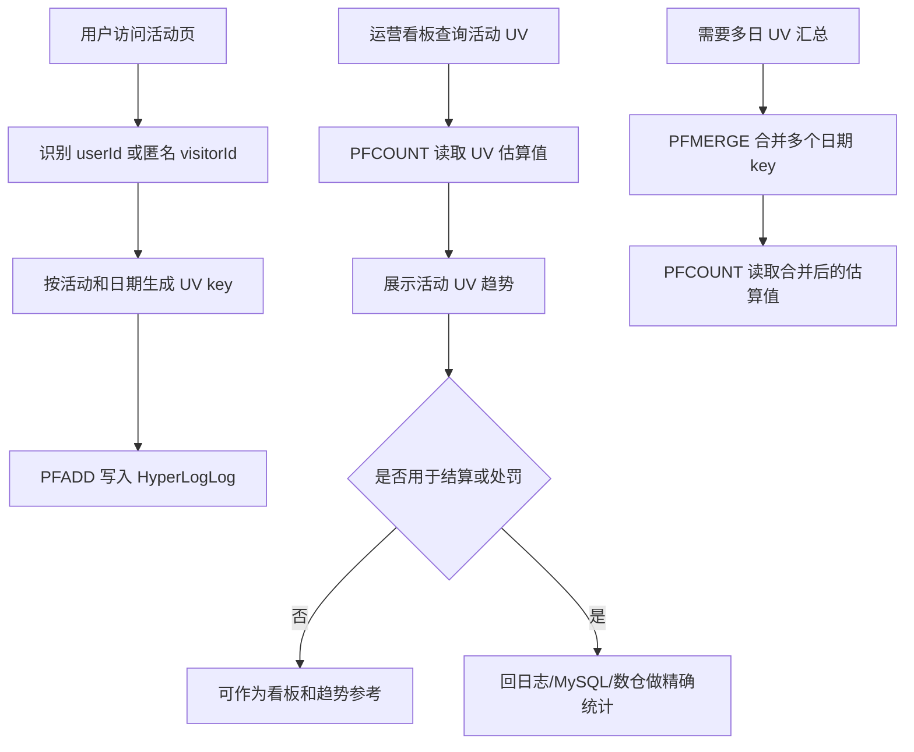

说明：

- `PFADD` 用于向 HyperLogLog 添加元素。参考：[Redis 官方 PFADD 文档](https://redis.io/docs/latest/commands/pfadd/)
- `PFCOUNT` 用于返回 HyperLogLog 观察到的集合近似基数。参考：[Redis 官方 PFCOUNT 文档](https://redis.io/docs/latest/commands/pfcount/)
- `PFMERGE` 用于合并多个 HyperLogLog。参考：[Redis 官方 PFMERGE 文档](https://redis.io/docs/latest/commands/pfmerge/)
- 活动 UV 看板适合用近似值观察趋势，但不适合直接作为结算、奖励、处罚依据。**标记：主观推断**
- HyperLogLog 不能反查具体有哪些用户访问过，因此如果要审计或追溯成员明细，需要保留日志或 MySQL 事实数据。**标记：主观推断**

### 5. 关键命令

| 命令                                                                                                              | 作用                                                                                                      |
| --------------------------------------------------------------------------------------------------------------- | ------------------------------------------------------------------------------------------------------- |
| `PFADD activity:uv:{activityId}:{date} {userId}`                                                                | 用户访问活动页时，把用户标识加入当天活动 UV 估算结构。参考：[Redis 官方 PFADD 文档](https://redis.io/docs/latest/commands/pfadd/)       |
| `PFCOUNT activity:uv:{activityId}:{date}`                                                                       | 运营看板读取当天活动 UV 估算值。参考：[Redis 官方 PFCOUNT 文档](https://redis.io/docs/latest/commands/pfcount/)              |
| `PFMERGE activity:uv:{activityId}:week activity:uv:{activityId}:2026-07-01 activity:uv:{activityId}:2026-07-02` | 多日活动 UV 需要汇总时，合并多个 HyperLogLog。参考：[Redis 官方 PFMERGE 文档](https://redis.io/docs/latest/commands/pfmerge/) |

### 6. 边界和坑

| 问题         | 说明                                                                           |
| ---------- | ---------------------------------------------------------------------------- |
| 近似值不能当精确值  | HyperLogLog 返回的是估算基数，不适合直接用于奖励结算、计费、风控处罚、最终活动人数确认。**标记：主观推断**                |
| 不能反查成员明细   | HyperLogLog 只保留统计状态，不能像 Set 一样列出具体 userId；需要审计时要保留日志或 MySQL 事实数据。**标记：主观推断** |
| 统计口径必须统一   | userId、deviceId、visitorId 混用会让 UV 口径失真，活动看板必须先定义唯一身份口径。**标记：主观推断**           |
| key 粒度设计不清 | 不按 activityId、date、渠道等维度规划 key，会导致后续无法按业务维度统计或合并。**标记：主观推断**                 |
| 用错场景会放大风险  | 趋势看板可以接受误差，结算、审计、处罚、强一致业务不能接受误差。**标记：主观推断**                                  |

### 7. 本章记忆点

1. Probabilistic data types 的核心是“允许误差，换效率和低内存”。
2. 活动 UV 去重估算适合用 HyperLogLog，但它只给近似数量，不给成员明细。参考：[Redis 官方 HyperLogLog 文档](https://redis.io/docs/latest/develop/data-types/probabilistic/hyperloglogs/)
3. 近似统计适合看板、趋势、运营估算；不适合结算、计费、处罚和最终事实确认。**标记：主观推断**

---

## 12. Sets：适合去重和成员判断

**要讲清楚的问题：**  
是否参与、是否领取、是否收藏、是否命中某集合为什么适合 Sets？

### 1. 本章一句话

Redis Set 是无序的唯一字符串成员集合，适合跟踪唯一对象、表达集合关系、判断成员是否存在。参考：[Redis 官方 Sets 文档](https://redis.io/docs/latest/develop/data-types/sets/)

本章核心判断：Sets 适合做“是否参与、是否领取、是否收藏、是否命中某集合”的快速判断和去重缓存，但不能单独替代 MySQL 的事实记录、唯一约束和结算依据。**标记：主观推断**


### 2. 适合解决什么问题？

| 场景       | 为什么适合                                                                                                                |
| -------- | -------------------------------------------------------------------------------------------------------------------- |
| 活动参与用户集合 | 一个用户只能参与一次，Set 天然去重；`SADD` 添加已存在成员时会忽略重复成员。参考：[Redis 官方 SADD 文档](https://redis.io/docs/latest/commands/sadd/)        |
| 是否已参与判断  | 接口进入时可以用 `SISMEMBER` 快速判断用户是否已经在活动参与集合中。参考：[Redis 官方 SISMEMBER 文档](https://redis.io/docs/latest/commands/sismember/) |
| 参与人数统计   | 可以用 `SCARD` 获取集合成员数量，适合快速展示当前参与人数。参考：[Redis 官方 SCARD 文档](https://redis.io/docs/latest/commands/scard/)               |
| 课程收藏去重   | 用户收藏课程时，可以用 Set 判断是否已收藏，但收藏事实仍建议落 MySQL。**标记：主观推断**                                                                  |
| 每日签到去重   | 当天签到用户集合适合用 Set 判断是否已签到，但海量签到统计需要再对比 Bitmaps。**标记：主观推断**                                                             |


### 3. 主案例

```text
主案例：活动参与用户集合

业务背景：
一个活动需要判断用户是否已经参与，避免重复报名、重复提交、重复领取参与资格，同时页面可能要展示当前参与人数。

核心原因：
活动参与用户集合的核心问题是“用户是否属于某个集合”，Redis Set 的唯一成员和成员判断能力刚好匹配；但最终参与事实、奖励发放、结算结果仍应落 MySQL，不能只靠 Redis Set。**标记：主观推断**
```

辅助案例：

- 课程收藏去重：适合判断用户是否已收藏某课程，重点关注取消收藏和 MySQL 收藏事实表。**标记：主观推断**
- 每日签到去重：适合判断当天是否签到，重点关注数据量大时是否改用 Bitmaps。**标记：主观推断**
- 奖励是否领取：适合做领取前置判断，但最终防重复领取要靠 MySQL 唯一约束。**标记：主观推断**


### 4. 核心流程

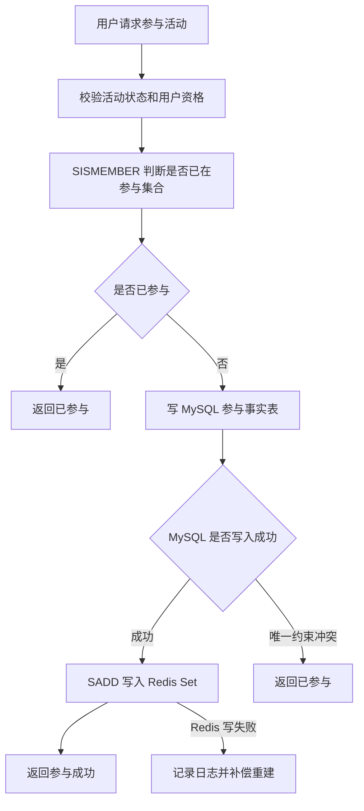

说明：

- `SISMEMBER` 用于判断某个 member 是否属于指定 Set，适合做活动参与状态的快速判断。参考：[Redis 官方 SISMEMBER 文档](https://redis.io/docs/latest/commands/sismember/)
- `SADD` 会把成员添加到 Set，已存在成员会被忽略，适合做参与用户集合的去重写入。参考：[Redis 官方 SADD 文档](https://redis.io/docs/latest/commands/sadd/)
- 活动参与事实建议先写 MySQL，再写 Redis Set；Redis 做前置判断和读缓存，MySQL 做最终事实源。**标记：主观推断**
- Redis Set 写失败时，不应让 MySQL 已成功的参与事实丢失；应通过补偿任务从 MySQL 重建 Set。**标记：主观推断**


### 5. 关键命令

| 命令                                                      | 作用                                                                                        |
| ------------------------------------------------------- | ----------------------------------------------------------------------------------------- |
| `SADD activity:participants:{activityId} {userId}`      | 把用户加入活动参与集合；重复加入会被忽略。参考：[Redis 官方 SADD 文档](https://redis.io/docs/latest/commands/sadd/)   |
| `SISMEMBER activity:participants:{activityId} {userId}` | 判断用户是否已经参与活动。参考：[Redis 官方 SISMEMBER 文档](https://redis.io/docs/latest/commands/sismember/) |
| `SCARD activity:participants:{activityId}`              | 统计当前活动参与用户数量。参考：[Redis 官方 SCARD 文档](https://redis.io/docs/latest/commands/scard/)         |
| `SREM activity:participants:{activityId} {userId}`      | 如果业务支持取消参与，可从参与集合中移除用户。参考：[Redis 官方 SREM 文档](https://redis.io/docs/latest/commands/srem/) |


### 6. 边界和坑

| 问题            | 说明                                                            |
| ------------- | ------------------------------------------------------------- |
| 只靠 Redis 防重复  | Redis 过期、淘汰、重启或误删后，重复参与判断可能失效；最终防重复必须靠 MySQL 唯一约束。**标记：主观推断** |
| 大 Set 内存压力    | 活动参与人数非常大时，单个 Set 会变成大 Key，带来内存、迁移、删除和慢操作风险。**标记：主观推断**       |
| 不能表达排序        | Set 只能判断成员是否存在，不适合表达参与时间排序、积分排序、排行榜。**标记：主观推断**               |
| `SMEMBERS` 滥用 | 大集合不要直接全量取出成员，容易造成 Redis 和网络压力；大集合遍历应谨慎设计。**标记：主观推断**         |
| 数据生命周期不清      | 活动结束后 Set 是否保留、多久过期、是否可从 MySQL 重建，需要提前设计。**标记：主观推断**          |


### 7. 本章记忆点

1. Sets 的核心价值是“去重 + 成员判断”，不是存复杂业务对象。
2. 活动参与、收藏、签到、领取这类“是否已经发生”的判断，适合用 Set 做快速判断。**标记：主观推断**
3. Redis Set 只能做前置拦截和缓存加速，最终事实、幂等和结算必须由 MySQL 兜底。**标记：主观推断**

---

## 13. Sorted sets：适合排行榜和排序查询

**要讲清楚的问题：**  
当前榜、积分榜、热门内容、TopN 为什么适合 Sorted sets？

### 1. 本章一句话

Sorted Set 适合保存“成员 + 分数”的排序数据，成员按 score 排序，因此适合排行榜、积分榜、TopN 和实时排名查询。参考：[Redis 官方 Sorted Sets 文档](https://redis.io/docs/latest/develop/data-types/sorted-sets/)

本章核心判断：Sorted Set 适合做活动实时榜、当前榜和高频排名查询；最终榜、奖励结算、可信排名结果仍应由 MySQL 固化。**标记：主观推断**


### 2. 适合解决什么问题？

| 场景      | 为什么适合                                                                                                                                                                                                         |
| ------- | ------------------------------------------------------------------------------------------------------------------------------------------------------------------------------------------------------------- |
| 活动实时排行榜 | 用户分数变化后，用 `ZADD` 写入或更新 score，再用 `ZRANGE ... REV WITHSCORES` 查询 TopN。参考：[Redis 官方 ZADD 文档](https://redis.io/docs/latest/commands/zadd/)；参考：[Redis 官方 ZRANGE 文档](https://redis.io/docs/latest/commands/zrange/) |
| 学习积分榜   | 用户积分可以作为 score，userId 作为 member，适合做积分排名展示。**标记：主观推断**                                                                                                                                                         |
| 热门内容榜   | 内容热度值可以作为 score，contentId 作为 member，适合查询热门 TopN。**标记：主观推断**                                                                                                                                                   |
| 我的排名    | 可以用 `ZREVRANK` 查询某个 member 按 score 从高到低排序的位置。参考：[Redis 官方 ZREVRANK 文档](https://redis.io/docs/latest/commands/zrevrank/)                                                                                       |
| 附近排名    | 可以先查用户 rank，再围绕 rank 查询前后范围，但深分页和大榜单要谨慎。**标记：主观推断**                                                                                                                                                           |


### 3. 主案例

```text
主案例：活动实时排行榜

业务背景：
活动进行中，用户完成任务、提交分数或获得积分后，页面需要实时展示 TopN、我的排名、我的分数。

核心原因：
活动实时排行榜的核心问题是“按分数排序 + 高频查询 TopN + 查询我的排名”，Sorted Set 的 member + score 模型刚好匹配；但活动结束后的最终榜、奖励发放和结算结果，不能只依赖 Redis 当前榜。**标记：主观推断**
```

辅助案例：

- 学习积分榜：适合按学习积分排序，重点关注积分事实和榜单缓存分工。**标记：主观推断**
- 热门内容榜：适合按热度分数排序，重点关注 score 计算规则和定期衰减。**标记：主观推断**
- 我的排名 / 附近排名：适合个人排名展示，重点关注深分页和大榜查询边界。**标记：主观推断**


### 4. 核心流程

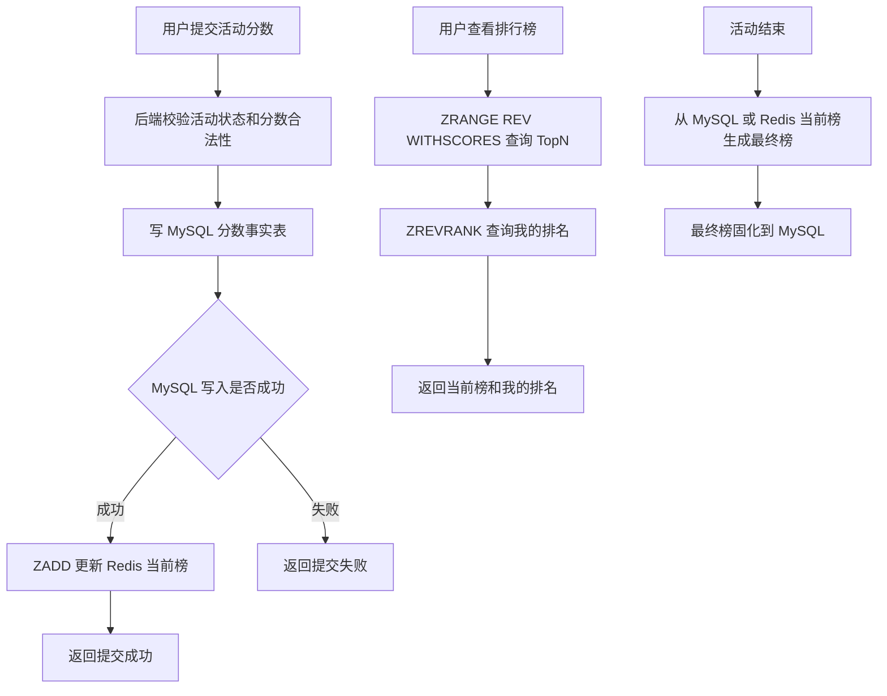

说明：

- `ZADD` 可以向 Sorted Set 添加成员或更新成员 score，适合更新用户当前分数。参考：[Redis 官方 ZADD 文档](https://redis.io/docs/latest/commands/zadd/)
- `ZRANGE` 支持按范围返回 Sorted Set 成员，并可结合 `REV`、`WITHSCORES` 查询倒序 TopN 和分数。参考：[Redis 官方 ZRANGE 文档](https://redis.io/docs/latest/commands/zrange/)
- `ZREVRANK` 可以返回成员在 Sorted Set 中按 score 从高到低排序的位置，适合查询“我的排名”。参考：[Redis 官方 ZREVRANK 文档](https://redis.io/docs/latest/commands/zrevrank/)
- Redis Sorted Set 适合承接活动进行中的当前榜查询，最终榜建议固化到 MySQL。**标记：主观推断**
- 如果分数是奖励结算依据，应先保证 MySQL 分数事实可靠，再更新 Redis 当前榜。**标记：主观推断**


### 5. 关键命令

| 命令                                                      | 作用                                                                                        |
| ------------------------------------------------------- | ----------------------------------------------------------------------------------------- |
| `ZADD activity:rank:{activityId} {score} {userId}`      | 写入或更新用户在当前榜中的分数。参考：[Redis 官方 ZADD 文档](https://redis.io/docs/latest/commands/zadd/)        |
| `ZRANGE activity:rank:{activityId} 0 99 REV WITHSCORES` | 查询当前榜 Top100 和对应分数。参考：[Redis 官方 ZRANGE 文档](https://redis.io/docs/latest/commands/zrange/) |
| `ZREVRANK activity:rank:{activityId} {userId}`          | 查询用户按高分倒序的当前排名。参考：[Redis 官方 ZREVRANK 文档](https://redis.io/docs/latest/commands/zrevrank/) |
| `ZSCORE activity:rank:{activityId} {userId}`            | 查询用户当前分数。参考：[Redis 官方 ZSCORE 文档](https://redis.io/docs/latest/commands/zscore/)           |


### 6. 边界和坑

| 问题            | 说明                                                             |
| ------------- | -------------------------------------------------------------- |
| 只靠 Redis 做最终榜 | Redis 当前榜可能因为过期、误删、重建失败或异常写入导致不可信；最终榜和奖励结算应落 MySQL。**标记：主观推断** |
| score 设计不清晰   | 同分排序、更新时间、提交次数、封顶规则不清楚，会导致排名结果和业务预期不一致。**标记：主观推断**             |
| 大 ZSET        | 大活动用户量很大时，单个 ZSET 会带来内存、迁移、删除、重建和查询成本。**标记：主观推断**              |
| 深分页           | 排行榜深页查询价值低但成本高，应限制页数或改成“我的附近排名”。**标记：主观推断**                    |
| 热榜 key        | 活动榜单 TopN 访问集中，可能形成热 key，需要缓存、限流或本地缓存辅助。**标记：主观推断**            |


### 7. 本章记忆点

1. Sorted Set 的核心价值是“member + score + 排序查询”。
2. 活动实时榜、积分榜、热门榜、TopN 都适合用 Sorted Set 做当前榜。**标记：主观推断**
3. Redis Sorted Set 负责实时排名，MySQL 负责事实分数、最终榜和奖励结算。**标记：主观推断**

---

## 14. Streams：适合事件流和可消费的追加日志

**要讲清楚的问题：**  
异步事件、学习行为日志、轻量任务流什么时候适合 Streams，什么时候不该用它替代完整 MQ？

### 1. 本章一句话

Redis Streams 适合保存持续追加的事件，并支持消费组读取、消息确认和待确认消息管理。参考：[Redis 官方 Streams 文档](https://redis.io/docs/latest/develop/data-types/streams/)

本章核心判断：Streams 适合做业务内轻量事件流和可恢复消费通道，不适合替代 Kafka / RocketMQ 这类完整 MQ 承担大规模跨系统解耦、长期堆积和复杂治理。**标记：主观推断**


### 2. 适合解决什么问题？

| 场景         | 为什么适合                                                                                                                          |
| ---------- | ------------------------------------------------------------------------------------------------------------------------------ |
| 学习行为日志异步消费 | 用户完成课程、章节、练习后，可以把行为事件追加到 Stream，由消费者异步处理统计、任务、推荐等后续逻辑。参考：[Redis 官方 XADD 文档](https://redis.io/docs/latest/commands/xadd/)       |
| 多消费者并行处理   | Streams 支持 consumer group，多个消费者可以协同消费同一个 Stream。参考：[Redis 官方 XREADGROUP 文档](https://redis.io/docs/latest/commands/xreadgroup/) |
| 消费成功后确认    | 消费者处理成功后用 `XACK` 确认，避免已处理消息长期停留在待确认列表中。参考：[Redis 官方 XACK 文档](https://redis.io/docs/latest/commands/xack/)                      |
| 失败消息排查     | `XPENDING` 可以查看消费组中的待确认消息，适合排查消费者失败、超时或未确认问题。参考：[Redis 官方 XPENDING 文档](https://redis.io/docs/latest/commands/xpending/)        |
| 轻量异步任务流    | 适合业务内简单异步处理；跨系统强解耦、大规模堆积、死信治理、消息轨迹等场景更适合专业 MQ。**标记：主观推断**                                                                      |


### 3. 主案例

```text
主案例：学习行为日志异步消费

业务背景：
用户完成章节、提交练习、观看课程后，主流程需要更新学习进度；同时还要异步触发学习统计、成长任务、推荐特征更新等后续处理。

核心原因：
学习行为天然是按时间持续追加的事件，Streams 可以承接事件追加、消费组读取、ACK 确认和 Pending 排查；但学习进度事实、权益结果、审计日志不能只放 Redis，必须有 MySQL、日志系统或数据仓库兜底。**标记：主观推断**
```

辅助案例：

- 活动奖励发放任务流：适合轻量异步任务分发，重点关注幂等和补偿。**标记：主观推断**
- 用户操作事件流：适合短期可消费操作事件，重点关注长期审计不要只依赖 Redis。**标记：主观推断**
- 轻量异步任务队列：适合业务内简单异步处理，重点关注不要替代完整 MQ。**标记：主观推断**


### 4. 核心流程

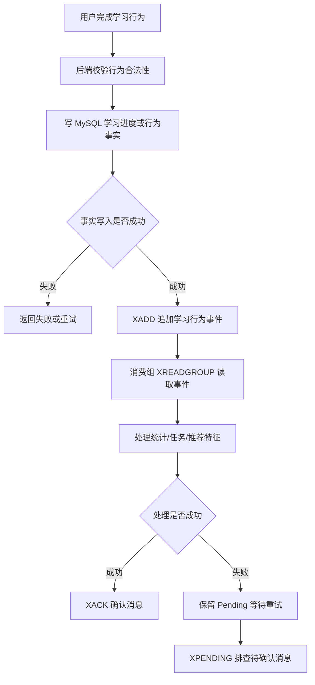

说明：

- `XADD` 用于向 Stream 追加消息，适合写入学习行为事件。参考：[Redis 官方 XADD 文档](https://redis.io/docs/latest/commands/xadd/)
- `XREADGROUP` 用于消费组读取 Stream 消息，适合多个消费者分摊处理学习事件。参考：[Redis 官方 XREADGROUP 文档](https://redis.io/docs/latest/commands/xreadgroup/)
- `XACK` 用于确认消费组中已经成功处理的消息。参考：[Redis 官方 XACK 文档](https://redis.io/docs/latest/commands/xack/)
- 学习进度、权益、结算、审计等关键事实应先落 MySQL 或日志系统，Streams 只做异步事件通道。**标记：主观推断**
- 消费失败不能直接丢弃消息，需要结合 Pending、重试、幂等和补偿处理。**标记：主观推断**


### 5. 关键命令

| 命令                                                                      | 作用                                                                                                        |
| ----------------------------------------------------------------------- | --------------------------------------------------------------------------------------------------------- |
| `XADD learning:events * userId 123 event lesson_completed lessonId 456` | 追加一条学习行为事件。参考：[Redis 官方 XADD 文档](https://redis.io/docs/latest/commands/xadd/)                             |
| `XGROUP CREATE learning:events progress-group $ MKSTREAM`               | 创建消费组，让多个消费者协同处理学习事件。参考：[Redis 官方 XGROUP CREATE 文档](https://redis.io/docs/latest/commands/xgroup-create/) |
| `XREADGROUP GROUP progress-group c1 COUNT 10 STREAMS learning:events >` | 消费组读取新事件。参考：[Redis 官方 XREADGROUP 文档](https://redis.io/docs/latest/commands/xreadgroup/)                   |
| `XACK learning:events progress-group 1720000000000-0`                   | 消费成功后确认消息。参考：[Redis 官方 XACK 文档](https://redis.io/docs/latest/commands/xack/)                              |
| `XPENDING learning:events progress-group`                               | 查看待确认消息，排查消费者失败或未 ACK。参考：[Redis 官方 XPENDING 文档](https://redis.io/docs/latest/commands/xpending/)          |


### 6. 边界和坑

| 问题               | 说明                                                                                                         |
| ---------------- | ---------------------------------------------------------------------------------------------------------- |
| 把 Streams 当完整 MQ | Streams 适合轻量事件流，但跨系统强解耦、大规模堆积、复杂路由、死信治理、消息轨迹通常更适合专业 MQ。**标记：主观推断**                                         |
| 只写 Stream 不落事实源  | 如果学习行为影响进度、权益、统计或审计，只写 Redis 会带来丢失后不可追溯风险。**标记：主观推断**                                                      |
| 消费者不 ACK         | 消费成功后不执行 `XACK`，消息会停留在待确认状态，后续排查和重试会变复杂。参考：[Redis 官方 XACK 文档](https://redis.io/docs/latest/commands/xack/) |
| Pending 堆积       | 消费者异常、处理超时、没有重试机制，会导致待确认消息持续堆积。**标记：主观推断**                                                                 |
| Stream 无限增长      | 学习行为持续追加，如果不做长度控制或生命周期设计，会造成内存压力。**标记：主观推断**                                                               |
| 消费幂等缺失           | 失败重试可能重复处理同一事件，学习任务、积分、奖励等下游处理必须做幂等。**标记：主观推断**                                                            |


### 7. 本章记忆点

1. Streams 的核心价值是“事件追加 + 消费组 + ACK + Pending 可排查”。
2. 学习行为日志、用户操作事件、轻量任务流适合 Streams，但关键事实不能只放 Redis。**标记：主观推断**
3. Streams 不是完整 MQ 替代品；跨系统、大规模、强治理场景优先考虑 Kafka / RocketMQ 等专业 MQ。**标记：主观推断**

---

## 15. Time series：适合带时间戳的数据点存储和查询

**要讲清楚的问题：**  
指标监控、行为趋势、接口耗时、学习数据变化这类时间序列数据为什么适合 Time series？

### 1. 本章一句话

Redis Time series 适合保存“时间戳 + 数值”的连续指标点，并按时间范围查询趋势、聚合数据和控制保留周期。参考：[Redis 官方 Time series 文档](https://redis.io/docs/latest/develop/data-types/timeseries/)

本章核心判断：Time series 适合做接口耗时、错误率、QPS、业务趋势这类在线指标趋势查询，但不适合替代完整监控系统、日志系统或数据仓库。**标记：主观推断**


### 2. 适合解决什么问题？

| 场景       | 为什么适合                                                                                                                                                                                 |
| -------- | ------------------------------------------------------------------------------------------------------------------------------------------------------------------------------------- |
| 接口耗时趋势   | 每分钟写入接口 P95 / P99 耗时指标点，按时间范围查询变化趋势。参考：[Redis 官方 TS.ADD 文档](https://redis.io/docs/latest/commands/ts.add/)；参考：[Redis 官方 TS.RANGE 文档](https://redis.io/docs/latest/commands/ts.range/) |
| 接口错误率趋势  | 每分钟写入错误率数值，按时间窗口查看是否持续升高。参考：[Redis 官方 Time series 文档](https://redis.io/docs/latest/develop/data-types/timeseries/)                                                                    |
| QPS 趋势   | 每分钟写入请求量或 QPS 指标，用于活动高峰期快速观察流量变化。**标记：主观推断**                                                                                                                                          |
| 多接口指标查询  | 可以通过 labels 组织不同服务、接口、指标类型，并用 `TS.MRANGE` 按过滤条件查询多个 time series。参考：[Redis 官方 TS.MRANGE 文档](https://redis.io/docs/latest/commands/ts.mrange/)                                          |
| 指标保留周期控制 | Time series 创建时可以设置 retention，避免数据无限增长。参考：[Redis 官方 Time series 文档](https://redis.io/docs/latest/develop/data-types/timeseries/)                                                      |


### 3. 主案例

```text
主案例：接口耗时与错误率监控

业务背景：
后端服务需要观察核心接口在最近 5 分钟、30 分钟、24 小时内的 P95 耗时、错误率和 QPS 变化，用于快速发现性能抖动、接口异常和活动高峰压力。

核心原因：
接口耗时、错误率、QPS 都是典型的“随时间变化的数值点”，Time series 可以按时间写入、按范围查询、按标签筛选，并支持保留周期和聚合查询；但告警编排、日志追踪、长期分析、根因定位仍应交给专业监控系统、日志系统或数据仓库。**标记：主观推断**
```

辅助案例：

- 学习行为趋势统计：适合记录每日学习人数、完成章节数、练习提交数，重点关注统计口径。**标记：主观推断**
- 用户学习时长变化：适合记录用户每天学习时长趋势，重点关注长期分析是否需要进数仓。**标记：主观推断**
- 活动参与趋势数据：适合记录活动报名数、参与数、完成数随时间变化，重点关注活动结束后的数据归档。**标记：主观推断**
- 系统资源指标监控：适合记录 Redis QPS、接口延迟、错误率等短周期趋势，重点关注不要替代完整监控平台。**标记：主观推断**


### 4. 核心流程

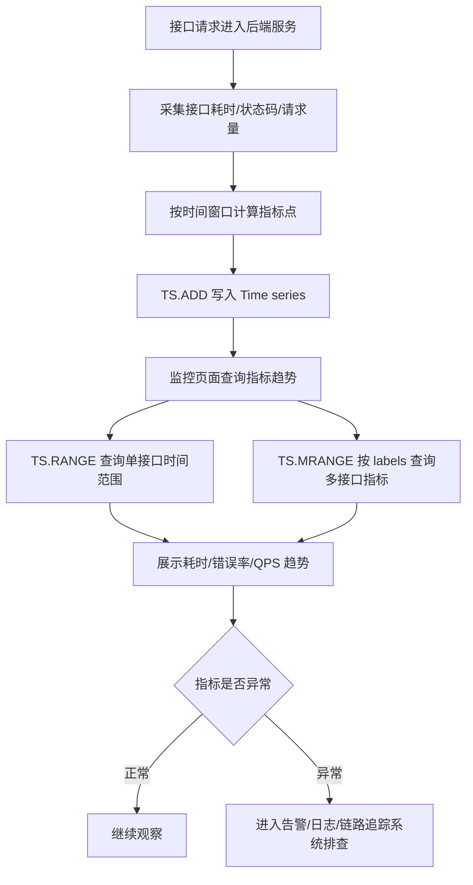

说明：

- `TS.ADD` 用于向 time series 追加一个样本点，适合写入某个时间点的接口耗时、错误率或 QPS。参考：[Redis 官方 TS.ADD 文档](https://redis.io/docs/latest/commands/ts.add/)
- `TS.RANGE` 用于按时间范围查询单个 time series，适合查看某个接口在一段时间内的指标变化。参考：[Redis 官方 TS.RANGE 文档](https://redis.io/docs/latest/commands/ts.range/)
- `TS.MRANGE` 用于按过滤条件查询多个 time series，适合按 service、route、metric 等 labels 查看多个接口指标。参考：[Redis 官方 TS.MRANGE 文档](https://redis.io/docs/latest/commands/ts.mrange/)
- P95 / P99 通常建议由应用侧或监控采集侧按时间窗口预聚合后写入 Time series，而不是把所有请求明细都塞进 Redis。**标记：主观推断**
- Time series 适合在线趋势查询，异常根因定位仍需要日志、链路追踪和完整监控系统配合。**标记：主观推断**


### 5. 关键命令

| 命令                                                                                                                  | 作用                                                                                                                        |
| ------------------------------------------------------------------------------------------------------------------- | ------------------------------------------------------------------------------------------------------------------------- |
| `TS.CREATE api:latency:p95:course_detail RETENTION 604800000 LABELS service course route detail metric latency_p95` | 创建接口 P95 耗时时间序列，并设置保留周期和 labels。参考：[Redis 官方 Time series 文档](https://redis.io/docs/latest/develop/data-types/timeseries/) |
| `TS.ADD api:latency:p95:course_detail * 128.6`                                                                      | 写入当前时间点的接口 P95 耗时。参考：[Redis 官方 TS.ADD 文档](https://redis.io/docs/latest/commands/ts.add/)                                  |
| `TS.ADD api:error_rate:course_detail * 0.012`                                                                       | 写入当前时间点的接口错误率。参考：[Redis 官方 TS.ADD 文档](https://redis.io/docs/latest/commands/ts.add/)                                      |
| `TS.RANGE api:latency:p95:course_detail - +`                                                                        | 查询某个接口的完整耗时趋势，实际业务中通常传具体起止时间。参考：[Redis 官方 TS.RANGE 文档](https://redis.io/docs/latest/commands/ts.range/)                   |
| `TS.MRANGE - + FILTER service=course metric=latency_p95`                                                            | 按 labels 查询多个接口的 P95 耗时趋势。参考：[Redis 官方 TS.MRANGE 文档](https://redis.io/docs/latest/commands/ts.mrange/)                    |


### 6. 边界和坑

| 问题                    | 说明                                                                                                                     |
| --------------------- | ---------------------------------------------------------------------------------------------------------------------- |
| 把 Time series 当完整监控系统 | Time series 能保存和查询指标点，但告警规则、通知编排、链路追踪、日志检索、仪表盘治理不是它单独能解决的。**标记：主观推断**                                                  |
| 指标基数过高                | 如果按 userId、traceId、requestId 创建 time series，会导致 key 数量和内存快速膨胀。**标记：主观推断**                                              |
| 写入频率过高                | 每个请求都写一个指标点，会把 Redis 变成请求明细存储，成本和压力都不合适。**标记：主观推断**                                                                    |
| 保留周期不清楚               | 指标不设置保留周期或清理策略，可能持续增长并带来内存压力。参考：[Redis 官方 Time series 文档](https://redis.io/docs/latest/develop/data-types/timeseries/) |
| 指标和日志混用               | Time series 适合数值趋势，不适合保存完整日志、请求上下文、异常堆栈和 trace 明细。**标记：主观推断**                                                          |


### 7. 本章记忆点

1. Time series 的核心价值是“时间戳 + 数值点 + 范围查询 + 趋势分析”。
2. 接口耗时、错误率、QPS 适合用 Time series 做在线趋势查询，但不适合把每次请求明细都写进 Redis。**标记：主观推断**
3. Time series 不是完整监控系统；告警、日志、链路追踪、长期分析仍要交给专业系统。**标记：主观推断**

---

## 16. Vector sets：适合向量相似度搜索

**要讲清楚的问题：**  
语义搜索、推荐系统、AI 场景里的向量相似度查询为什么适合 Vector sets？

### 1. 本章一句话

Redis Vector sets 适合保存“元素 + 向量”，并按向量相似度找出相近元素。参考：[Redis 官方 Vector sets 文档](https://redis.io/docs/latest/develop/data-types/vector-sets/)

本章核心判断：Vector sets 适合做课程内容语义搜索、相似内容召回、AI 知识库候选召回，但不适合替代 MySQL 的业务事实、权限过滤、内容元数据和完整搜索系统。**标记：主观推断**


### 2. 适合解决什么问题？

| 场景         | 为什么适合                                                                                                                                                  |
| ---------- | ------------------------------------------------------------------------------------------------------------------------------------------------------ |
| 课程内容语义搜索   | 课程、章节、知识点可以转成 embedding 写入 Vector sets，用户问题也转成向量后用相似度召回相近内容。参考：[Redis 官方 Vector sets 文档](https://redis.io/docs/latest/develop/data-types/vector-sets/) |
| 相似题目推荐     | 题目文本向量化后，可以按相似度召回相近题目，作为推荐候选集。**标记：主观推断**                                                                                                              |
| 相似课程推荐     | 课程标题、简介、标签向量化后，可以召回语义相似课程。**标记：主观推断**                                                                                                                  |
| AI 知识库问答召回 | 用户问题向量化后，可以先召回相关知识片段，再交给大模型生成答案。**标记：主观推断**                                                                                                            |
| 属性过滤后的相似召回 | Vector sets 支持给元素关联属性，并在 `VSIM` 中结合 `FILTER` 做过滤。参考：[Redis 官方 Vector sets 文档](https://redis.io/docs/latest/develop/data-types/vector-sets/)            |


### 3. 主案例

```text
主案例：课程内容语义搜索

业务背景：
用户在学习平台中输入自然语言问题，例如“Redis 排行榜应该用什么结构？”，系统需要返回语义上最相关的课程、章节或知识点。

核心原因：
用户问题和课程内容都可以转成 embedding，Vector sets 适合按向量相似度做候选召回；但课程是否上架、用户是否有权限、课程标题正文、价格、作者、章节状态等业务事实仍应由 MySQL 或搜索系统补全和过滤。**标记：主观推断**
```

辅助案例：

- 相似题目推荐：适合用题目 embedding 召回相似题，重点关注召回后去重和难度过滤。**标记：主观推断**
- 相似课程推荐：适合用课程 embedding 召回相似课程，重点关注推荐排序和用户画像不要只靠向量相似度。**标记：主观推断**
- AI 知识库问答召回：适合做 RAG 候选片段召回，重点关注召回质量、权限和原文补全。**标记：主观推断**
- 用户兴趣向量匹配：适合做候选召回，重点关注用户画像更新和冷启动问题。**标记：主观推断**


### 4. 核心流程

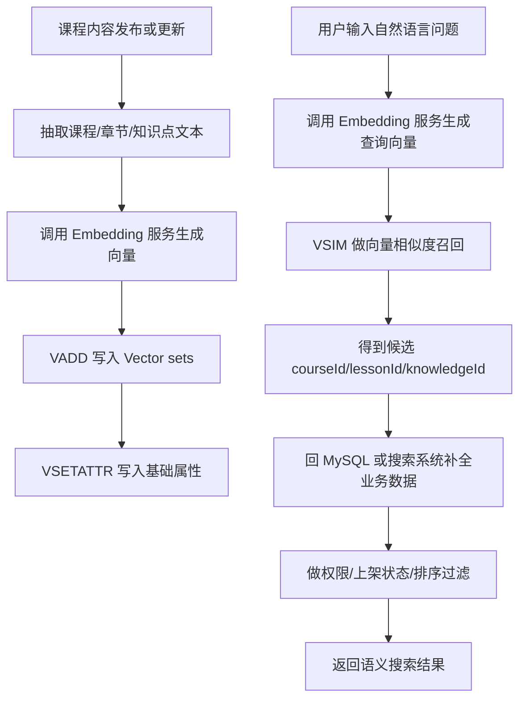

说明：

- `VADD` 可以向 Vector set 添加元素，或在元素已存在时更新它的向量。参考：[Redis 官方 VADD 文档](https://redis.io/docs/latest/commands/vadd/)
- `VSIM` 可以按向量相似度返回相似元素。参考：[Redis 官方 VSIM 文档](https://redis.io/docs/latest/commands/vsim/)
- `VSETATTR` 可以给 Vector set 中的元素关联 JSON 属性。参考：[Redis 官方 VSETATTR 文档](https://redis.io/docs/latest/commands/vsetattr/)
- Vector sets 负责语义相似度召回，MySQL 或搜索系统负责业务事实补全、权限过滤和最终排序。**标记：主观推断**
- 课程内容更新后，需要同步更新向量，否则会出现语义召回结果过期。**标记：主观推断**


### 5. 关键命令

| 命令                                                                                                    | 作用                                                                                                       |
| ----------------------------------------------------------------------------------------------------- | -------------------------------------------------------------------------------------------------------- |
| `VADD course:content:vectors VALUES 3 0.12 0.45 0.78 lesson:1001`                                     | 写入或更新课程内容向量。参考：[Redis 官方 VADD 文档](https://redis.io/docs/latest/commands/vadd/)                           |
| `VSETATTR course:content:vectors lesson:1001 '{"courseId":101,"status":"published","type":"lesson"}'` | 给向量元素关联基础属性。参考：[Redis 官方 VSETATTR 文档](https://redis.io/docs/latest/commands/vsetattr/)                   |
| `VSIM course:content:vectors VALUES 3 0.11 0.46 0.80 COUNT 10 WITHSCORES`                             | 按查询向量召回最相似的课程内容。参考：[Redis 官方 VSIM 文档](https://redis.io/docs/latest/commands/vsim/)                       |
| `VSIM course:content:vectors VALUES 3 0.11 0.46 0.80 FILTER '.status == "published"' COUNT 10`        | 在相似度召回时结合属性过滤。参考：[Redis 官方 Vector sets 文档](https://redis.io/docs/latest/develop/data-types/vector-sets/) |
| `VREM course:content:vectors lesson:1001`                                                             | 课程下架或删除后移除对应向量。参考：[Redis 官方 VREM 文档](https://redis.io/docs/latest/commands/vrem/)                        |


### 6. 边界和坑

| 问题                    | 说明                                                                     |
| --------------------- | ---------------------------------------------------------------------- |
| 把 Vector sets 当完整搜索系统 | Vector sets 适合向量相似度召回，但关键词检索、复杂过滤、排序策略、搜索纠错、召回融合通常需要搜索系统配合。**标记：主观推断** |
| 只做向量召回不做权限过滤          | 可能把未上架、无权限、已删除课程召回给用户，业务风险较高。**标记：主观推断**                               |
| 内容更新后向量不同步            | 课程标题、章节内容变化后，如果 embedding 不更新，会导致召回结果和真实内容不一致。**标记：主观推断**              |
| 向量维度和模型不统一            | 不同 embedding 模型或不同维度混用，会导致相似度结果失真或无法写入同一个向量集合。**标记：主观推断**              |
| 召回结果直接当最终结果           | 向量相似只是候选召回，最终还要结合关键词、业务权重、权限、质量分和用户画像排序。**标记：主观推断**                    |


### 7. 本章记忆点

1. Vector sets 的核心价值是“元素 + 向量 + 相似度召回”。
2. 课程内容语义搜索适合用 Vector sets 做候选召回，但业务事实、权限和最终排序不能只靠 Redis。**标记：主观推断**
3. Vector sets 不是完整搜索系统；AI 搜索通常需要 embedding、Redis 召回、MySQL / 搜索系统补全、重排共同完成。**标记：主观推断**

---

## 17. Redis 和 MySQL 的分工：Redis 加速，MySQL 兜底

**要讲清楚的问题：**  
哪些数据可以进 Redis，哪些必须以 MySQL 为事实源？

| 模块 | 你要掌握的知识点 | 解决的实际业务问题 | 典型业务场景 | 关键坑 | 资深后端分享时应该怎么讲 |
|---|---|---|---|---|---|
| 核心思想 | Redis 不是数据库替代品，而是缓存、读模型、加速层、临时状态层 | 避免把用户资产、计分、订单、学习记录等关键事实只放 Redis | 用户学习进度缓存、活动配置缓存、排行榜查询缓存、临时锁 | 把 Redis 当事实源，Redis 过期、淘汰、重启后数据不可复查 | **MySQL 保正确性，Redis 提性能；Redis 丢了能重建，MySQL 丢了就是事故。** |
| 数据生命周期 | 区分计划数据、过程状态、事实数据、展示数据 | 判断哪些数据能缓存，哪些必须落库 | 课程配置、题库配置、活动配置、用户得分、学习结果、排行榜展示 | 所有数据一把梭放 Redis，导致恢复、审计、对账困难 | **能丢、能重建、可短暂旧的数据适合 Redis；不能丢、要复查、要事务的数据必须 MySQL。** |
| 缓存模式 | Cache Aside：先查缓存，miss 后查 DB 再写缓存 | 降低 MySQL 高频读压力 | 课程详情、活动配置、排行榜分页 | 缓存击穿、并发回源、脏缓存 | **最常见模式不是难点，难点是 miss 时如何防止一堆请求打爆 MySQL。** |
| 缓存一致性 | MySQL 成功后删除或失效缓存 | 避免用户看到旧数据 | 修改课程配置、更新活动状态、用户完成学习进度 | 先删缓存还是先写 DB；事务回滚导致不一致 | **不要在 MySQL 事务提交前更新 Redis；提交成功后再失效缓存。** 你参考文档里的排行榜方案也强调 Redis 不在 MySQL 事务提交前更新缓存。 |
| 幂等 | Redis 可辅助防重复，但最终靠 DB 唯一约束 | 防止重复提交、重复计分、重复领取 | 提交答案、提交牌局、领取奖励、支付回调 | 只靠 Redis 防重，Redis 丢失后重复写 | **Redis 做前置拦截，MySQL 唯一约束做最终防线。** |
| 排行榜 | 当前榜、最终榜、我的排名分开设计 | 解决活动排名展示和结算复查 | 学习积分榜、比赛榜、答题榜 | 当前榜实时变，最终榜要冻结；我的排名可能性能高 | **当前榜可以动态查，最终榜必须冻结；Redis 加速展示，MySQL 保留可信结果。** |

---


## 18. Redis 出问题时怎么兜底：缓存、锁、排行榜、状态都要有退路

**要讲清楚的问题：**  
穿透、击穿、雪崩、大 Key、热 Key、锁误用怎么处理？

| 模块 | 你要掌握的知识点 | 解决的实际业务问题 | 典型业务场景 | 关键坑 | 资深后端分享时应该怎么讲 |
|---|---|---|---|---|---|
| 缓存穿透 | 查询不存在的数据，绕过缓存打 DB | 防止恶意或异常请求持续查空数据 | 不存在的课程 ID、用户 ID、活动 ID | 空值不缓存；非法参数不拦截 | **空结果也可以短 TTL 缓存；参数合法性校验比 Redis 更靠前。** |
| 缓存击穿 | 热点 Key 过期瞬间大量请求回源 | 保护 MySQL 不被热点打爆 | 热门课程、活动首页、榜单第一页 | 同一时刻大量请求重建缓存 | **用互斥锁、singleflight、逻辑过期，让一个请求重建，其他请求等待或读旧值。** |
| 缓存雪崩 | 大量 Key 同时过期或 Redis 故障 | 避免整体流量压垮 DB | 大批课程缓存、活动配置批量过期 | TTL 一样；Redis 故障无降级 | **TTL 加随机抖动，核心数据预热，Redis 故障时接口要限流降级。** |
| 大 Key | 单个 Key 太大，读写删除阻塞 | 避免 Redis 延迟抖动 | 大 JSON、大 Hash、大 Set、大榜单页 | 一次读写太大；删除阻塞；网络传输大 | **Redis 快不代表可以塞超大对象；大 Key 是线上性能隐患。** |
| 热 Key | 某个 Key 访问极高 | 避免单点热点导致 Redis 或网络压力异常 | 首页配置、热门课程、活动榜单第一页 | 单 Key QPS 太高；缓存重建竞争 | **热点不是只靠 Redis 扛，要结合本地缓存、限流、预热、拆分。** |
| 分布式锁 | `SET key value NX PX` + token 校验释放 | 防止多个服务同时处理同一任务 | 活动结算、重复发奖、任务抢占、榜单冻结 | 锁过期、误删别人锁、业务执行超过 TTL | **Redis 锁只能做并发控制辅助，最终正确性仍要靠 MySQL 状态、唯一约束、事务兜底。** Redis 官方也说明分布式锁用于多个进程互斥访问共享资源。([Redis][3]) |
| 锁释放安全 | 释放锁时校验 token，最好 Lua 原子判断删除 | 防止删除其他任务新获得的锁 | Worker 结算、异步任务 | 直接 `DEL lockKey` 误删别人锁 | **锁的 value 不是摆设，token 是为了证明这把锁还是你的。** |
| 内存淘汰 | `maxmemory` 和 eviction policy | Redis 内存满了怎么办 | 所有缓存场景 | 没配置内存上限；淘汰了不该淘汰的数据 | **缓存 Redis 必须接受 key 会被淘汰；因此 Redis 里的数据要能回源重建。** Redis 官方说明达到 `maxmemory` 后 Redis 会按淘汰策略限制继续增长。([Redis][5]) |
| 单线程边界 | 命令执行主要单线程，避免阻塞命令 | 防止一个慢操作拖慢所有请求 | 大 Key 删除、全量扫描、复杂 Lua | `KEYS *`、大范围 ZSET 操作、长 Lua | **Redis 单线程不是缺点，但要求你别把重活塞进去。** |
| 监控与排障 | 慢查询、内存、连接数、命中率、QPS、淘汰数 | 线上问题定位 | Redis CPU 高、接口慢、缓存命中率低 | 只会用，不会看指标 | **资深后端不能只会写缓存，还要知道 Redis 出问题从哪些指标看。** |
| 降级策略 | Redis 不可用时是否回源、限流、返回旧值 | 防止 Redis 故障扩大成全站故障 | 首页、榜单、学习进度、活动页 | Redis 挂了全站接口挂死；无限回源压垮 MySQL | **Redis 故障时，系统目标不是“完全无感”，而是保护核心链路正确性。** |

---


## 19. Redis 持久化和一致性取舍：不是越强越好，而是看数据能否重建

**要讲清楚的问题：**  
RDB、AOF、everysec、always 应该怎么判断？

| 模块 | 你要掌握的知识点 | 解决的实际业务问题 | 典型业务场景 | 关键坑 | 资深后端分享时应该怎么讲 |
|---|---|---|---|---|---|
| 持久化 RDB | 定时快照 | Redis 重启后恢复某个时间点数据 | 缓存可重建、允许丢少量数据场景 | 两次快照之间数据可能丢失 | **RDB 适合可重建缓存，不适合承载唯一事实数据。** Redis 官方说明 RDB 是按指定间隔生成数据集时间点快照。([Redis][4]) |
| 持久化 AOF | 记录写命令日志，可回放恢复 | 提高 Redis 数据恢复完整性 | 相对重要但仍可容忍少量损失的数据 | 文件大；重写成本；fsync 策略影响性能 | **AOF 更重，但也不是绝对不丢；要结合业务兜底能力选。** Redis 官方说明 AOF 会记录服务器收到的每个写操作。([Redis][4]) |
| `AOF everysec` | 通常性能和可靠性折中 | 减少 Redis 崩溃时的数据损失 | 缓存、排行榜辅助数据、计数类数据 | 可能丢约 1 秒数据；不能替代 DB | **如果 MySQL 能重建，everysec 通常比 always 更合理。** |
| `AOF always` | 每次写都刷盘 | 极高可靠性诉求 | 极少数强持久化 Redis 场景 | 性能损耗明显，违背 Redis 高性能初衷 | **不要为了显得安全就开 always；先问 Redis 背后有没有 MySQL 兜底。** |
| 缓存一致性 | MySQL 成功后删除或失效缓存 | 避免用户看到旧数据 | 修改课程配置、更新活动状态、用户完成学习进度 | 先删缓存还是先写 DB；事务回滚导致不一致 | **不要在 MySQL 事务提交前更新 Redis；提交成功后再失效缓存。** 你参考文档里的排行榜方案也强调 Redis 不在 MySQL 事务提交前更新缓存。 |
| 内存淘汰 | `maxmemory` 和 eviction policy | Redis 内存满了怎么办 | 所有缓存场景 | 没配置内存上限；淘汰了不该淘汰的数据 | **缓存 Redis 必须接受 key 会被淘汰；因此 Redis 里的数据要能回源重建。** Redis 官方说明达到 `maxmemory` 后 Redis 会按淘汰策略限制继续增长。([Redis][5]) |

---


## 20. 最终使用原则：资深后端应该如何判断 Redis 能不能用

**要讲清楚的问题：**  
如何沉淀成团队可复用的 Redis 使用原则？

| 模块 | 你要掌握的知识点 | 解决的实际业务问题 | 典型业务场景 | 关键坑 | 资深后端分享时应该怎么讲 |
|---|---|---|---|---|---|
| 核心思想 | Redis 不是数据库替代品，而是缓存、读模型、加速层、临时状态层 | 避免把用户资产、计分、订单、学习记录等关键事实只放 Redis | 用户学习进度缓存、活动配置缓存、排行榜查询缓存、临时锁 | 把 Redis 当事实源，Redis 过期、淘汰、重启后数据不可复查 | **MySQL 保正确性，Redis 提性能；Redis 丢了能重建，MySQL 丢了就是事故。** |
| 数据生命周期 | 区分计划数据、过程状态、事实数据、展示数据 | 判断哪些数据能缓存，哪些必须落库 | 课程配置、题库配置、活动配置、用户得分、学习结果、排行榜展示 | 所有数据一把梭放 Redis，导致恢复、审计、对账困难 | **能丢、能重建、可短暂旧的数据适合 Redis；不能丢、要复查、要事务的数据必须 MySQL。** |
| Redis 为什么快 | 内存访问、单线程命令执行、I/O 多路复用、高效数据结构 | 解释为什么适合高频读写 | 高频缓存、计数、排名 | 以为单线程永远不会阻塞；执行慢命令照样卡 | **Redis 快的前提是操作小、命令合理、数据结构匹配访问模式。** |
| Key 设计 | 统一命名、业务维度、版本、TTL | 降低维护成本，支持批量排查 | `app:module:biz:id:field` | key 混乱、无版本、无法定位、无 TTL | **Key 是 Redis 的数据表设计，命名混乱等于线上不可维护。** |
| 监控与排障 | 慢查询、内存、连接数、命中率、QPS、淘汰数 | 线上问题定位 | Redis CPU 高、接口慢、缓存命中率低 | 只会用，不会看指标 | **资深后端不能只会写缓存，还要知道 Redis 出问题从哪些指标看。** |
| 降级策略 | Redis 不可用时是否回源、限流、返回旧值 | 防止 Redis 故障扩大成全站故障 | 首页、榜单、学习进度、活动页 | Redis 挂了全站接口挂死；无限回源压垮 MySQL | **Redis 故障时，系统目标不是“完全无感”，而是保护核心链路正确性。** |
| 和游戏经验迁移 | 状态机、排行榜、活动、进度恢复 | 把游戏业务经验转成 Web 后端架构能力 | 教学 App 的闯关、练习、排行榜、活动 | 仍按前端状态或内存状态理解后端事实源 | **游戏业务的状态机经验很有价值，但 Web 后端更强调持久化、事务、幂等、可复查。** |

---

[1]: https://redis.io/docs/latest/develop/data-types/sorted-sets/?utm_source=chatgpt.com "Redis sorted sets | Docs"
[2]: https://redis.io/docs/latest/develop/data-types/?utm_source=chatgpt.com "Redis data types | Docs"
[3]: https://redis.io/docs/latest/develop/clients/patterns/distributed-locks/?utm_source=chatgpt.com "Distributed Locks with Redis | Docs"
[4]: https://redis.io/docs/latest/operate/oss_and_stack/management/persistence/?utm_source=chatgpt.com "Redis persistence | Docs"
[5]: https://redis.io/docs/latest/develop/reference/eviction/?utm_source=chatgpt.com "Key eviction | Docs - Redis"
[6]: https://redis.io/docs/latest/develop/data-types/probabilistic/ "Probabilistic | Docs - Redis"
