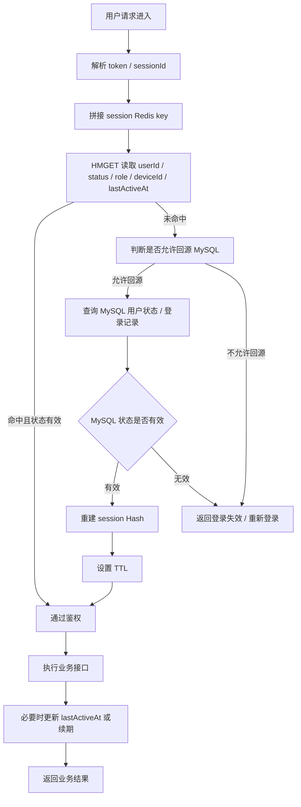
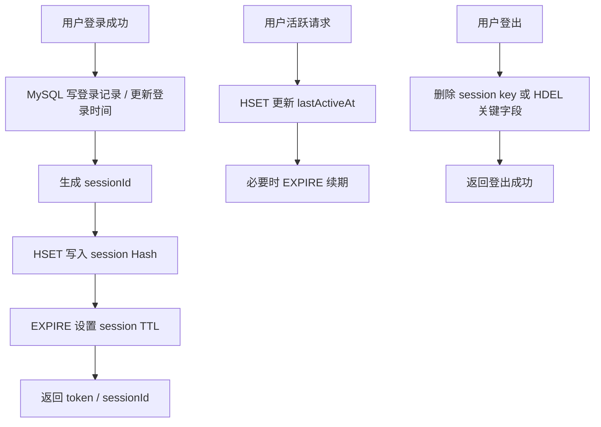
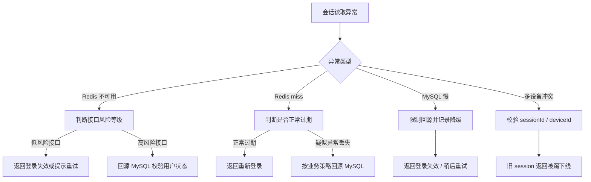
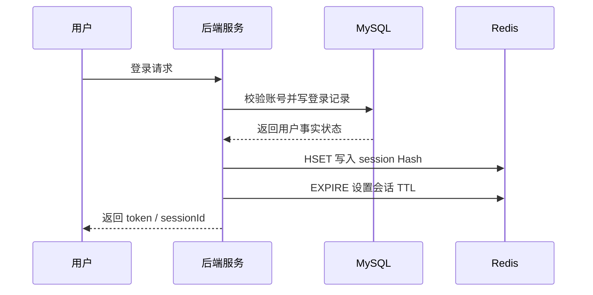
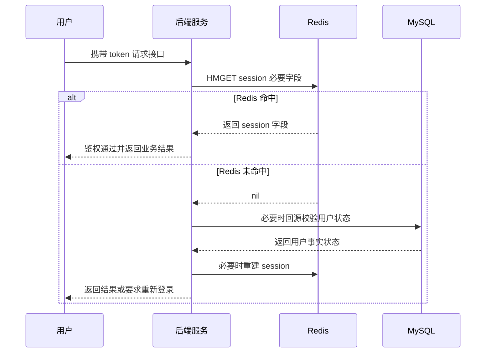
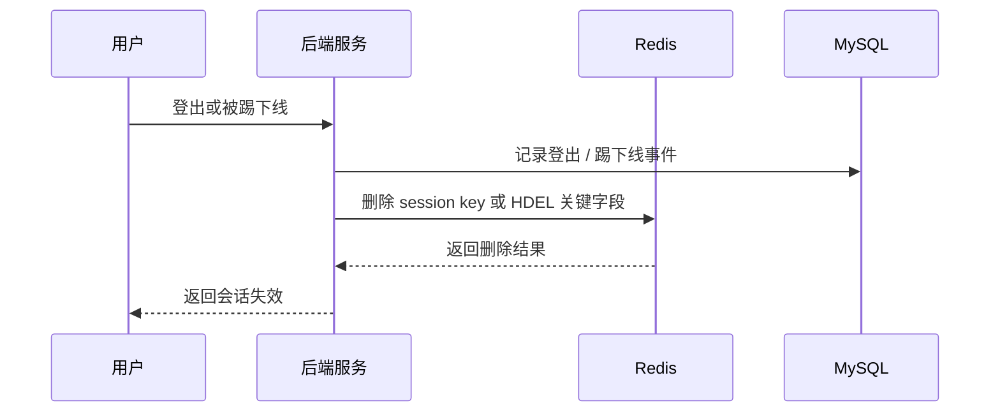

# Redis 知识点：Hashes

本次学习输入：

```text
知识点：Hashes
业务场景：用户会话状态缓存
重点关注：会话状态的字段级读写与恢复
```

## 1. 一句话结论

Redis Hashes 适合把一个对象拆成多个字段存储，尤其适合用户会话状态这类“同一个 key 下有多个可独立读写字段”的场景。参考：[Redis 官方 Hashes 文档](https://redis.io/docs/latest/develop/data-types/hashes/)

在用户会话场景中，Redis Hash 更适合作为高频访问的短期会话状态层，MySQL 更适合作为用户账号、权限、封禁状态等长期事实源。**标记：主观推断**

---

## 2. 这个知识点是什么？

Redis Hashes 是 Redis 中用于存储 field-value 结构的数据类型，可以把一个业务对象的多个字段放在同一个 Redis key 下管理。参考：[Redis 官方 Hashes 文档](https://redis.io/docs/latest/develop/data-types/hashes/)

例如一个用户会话可以存成：

```text
session:user:10001

userId = 10001
status = online
deviceId = ios_abc
lastActiveAt = 2026-07-05T16:30:00
loginIp = 1.2.3.4
role = normal
```

Hashes 的核心价值不是“缓存一整段 JSON”，而是支持对对象里的某些字段单独读写。**标记：主观推断**

---

## 3. 它解决什么业务问题？

| 业务问题         | 具体表现                                     | Redis 如何解决                                                                                       |
| ------------ | ---------------------------------------- | ------------------------------------------------------------------------------------------------ |
| 会话状态读取频繁     | 用户每次请求都要判断登录态、设备、状态、最后活跃时间               | 用 Hash 保存会话字段，接口直接读取 Redis。**标记：主观推断**                                                           |
| 会话字段会局部变化    | 例如只更新 `lastActiveAt`，不想重写整个 session JSON | 使用 `HSET` 更新单个字段。参考：[Redis 官方 HSET 文档](https://redis.io/docs/latest/commands/hset/)              |
| 只需要读取部分字段    | 例如鉴权只需要 `userId / status / role`         | 使用 `HMGET` 一次读取多个指定字段。参考：[Redis 官方 HMGET 文档](https://redis.io/docs/latest/commands/hmget/)       |
| 会话需要自动失效     | 登录态、短期状态不能永久存在                           | 对 session key 设置 `EXPIRE`。参考：[Redis 官方 EXPIRE 文档](https://redis.io/docs/latest/commands/expire/) |
| 用户重新进入需要恢复状态 | App 重新打开时，需要恢复登录状态、设备状态、最近活跃时间           | 通过 Redis Hash 快速恢复会话状态，必要时再回源 MySQL 校验关键状态。**标记：主观推断**                                           |

---

## 4. Redis 为什么适合？

| Redis 能力                     | 对应业务价值                                        | 证据 / 标记                                                                          |
| ---------------------------- | --------------------------------------------- | -------------------------------------------------------------------------------- |
| Hash 能表示对象字段                 | 适合存储用户会话这种多字段对象                               | 参考：[Redis 官方 Hashes 文档](https://redis.io/docs/latest/develop/data-types/hashes/) |
| `HSET` 支持设置一个或多个 field-value | 适合登录、续期、活跃时间更新等字段写入                           | 参考：[Redis 官方 HSET 文档](https://redis.io/docs/latest/commands/hset/)               |
| `HGET` 支持读取单个字段              | 适合只读 `status`、`role` 这类字段                     | 参考：[Redis 官方 HGET 文档](https://redis.io/docs/latest/commands/hget/)               |
| `HMGET` 支持读取多个指定字段           | 适合鉴权时一次读取 `userId / status / role / deviceId` | 参考：[Redis 官方 HMGET 文档](https://redis.io/docs/latest/commands/hmget/)             |
| `HGETALL` 支持读取全部字段           | 适合用户重新进入时恢复完整会话状态                             | 参考：[Redis 官方 HGETALL 文档](https://redis.io/docs/latest/commands/hgetall/)         |
| `EXPIRE` 支持给 key 设置过期时间      | 适合登录态、会话态自动过期                                 | 参考：[Redis 官方 EXPIRE 文档](https://redis.io/docs/latest/commands/expire/)           |
| Redis 内存访问延迟低                | 适合承接高频鉴权和会话读取                                 | **标记：主观推断**                                                                      |

---

## 5. 它的边界是什么？

| 边界                  | 说明                                     | 更合适的选择                                                                                     |
| ------------------- | -------------------------------------- | ------------------------------------------------------------------------------------------ |
| 不能把 Redis 会话当成账号事实源 | 用户是否存在、是否封禁、权限是否变更，不能只信 Redis          | MySQL。**标记：主观推断**                                                                          |
| 不适合存很大的用户对象         | 如果把大量资料、配置、扩展字段都塞进一个 Hash，会形成大 key 风险  | MySQL / 拆 key / 只缓存必要字段。**标记：主观推断**                                                        |
| 不适合复杂关系查询           | Redis Hash 不能替代 SQL 查询用户关系、订单、权限组      | MySQL。**标记：主观推断**                                                                          |
| 不适合强一致会话事实          | Redis 可能因为过期、淘汰、故障恢复出现短暂缺失             | MySQL + Redis 缓存。**标记：主观推断**                                                               |
| `HGETALL` 不适合大 Hash | `HGETALL` 时间复杂度与 Hash 大小相关，字段太多会增加阻塞风险 | 只用 `HMGET` 读取必要字段。参考：[Redis 官方 HGETALL 文档](https://redis.io/docs/latest/commands/hgetall/) |

---

## 6. 常见坑是什么？

| 常见坑                     | 线上风险                          | 规避方式                                                                                                    |
| ----------------------- | ----------------------------- | ------------------------------------------------------------------------------------------------------- |
| 会话 Hash 不设置 TTL         | 会话长期残留，占用 Redis 内存            | 登录后设置 `EXPIRE`。参考：[Redis 官方 EXPIRE 文档](https://redis.io/docs/latest/commands/expire/)                   |
| 每次都 `HGETALL`           | 字段越来越多后，读取成本上升                | 鉴权类接口优先 `HMGET` 必要字段。参考：[Redis 官方 HMGET 文档](https://redis.io/docs/latest/commands/hmget/)               |
| 把用户所有资料都塞进 session Hash | Hash 变大，维护困难，也容易出现脏字段         | session 只存会话相关字段。**标记：主观推断**                                                                            |
| Redis 和 MySQL 状态不一致     | 用户已封禁但 Redis 里仍是正常状态          | 高风险状态读 MySQL 或做版本校验。**标记：主观推断**                                                                         |
| 多设备登录覆盖字段               | A 设备登录后，B 设备覆盖同一个 session key | key 里加入 deviceId 或 sessionId。**标记：主观推断**                                                                |
| 续期策略不清楚                 | 用户活跃但 session 过期，或者长期不活跃仍占用资源 | 每次关键请求续期，或只在固定窗口续期。**标记：主观推断**                                                                          |
| 登出只删部分字段                | 残留字段导致误判在线状态                  | 登出时删除整个 session key，或用 `HDEL` 精确删除字段。参考：[Redis 官方 HDEL 文档](https://redis.io/docs/latest/commands/hdel/) |

---

## 7. MySQL / 本地缓存 / 其他方案是否更合适？

| 方案            | 是否适合      | 原因                                                                                                     |
| ------------- | --------- | ------------------------------------------------------------------------------------------------------ |
| MySQL         | 适合做事实源    | 用户账号、权限、封禁状态、长期登录记录应该落 MySQL。**标记：主观推断**                                                               |
| Redis Hashes  | 适合做会话状态缓存 | 会话是多字段对象，适合字段级读写和短期存储。参考：[Redis 官方 Hashes 文档](https://redis.io/docs/latest/develop/data-types/hashes/) |
| Redis Strings | 部分适合      | 如果会话只需要整体 JSON 快照，String 更简单；但局部字段频繁更新时 Hash 更合适。**标记：主观推断**                                           |
| 本地缓存          | 只适合极短期热点  | 会话状态和用户请求强相关，多实例间同步麻烦，不建议只靠本地缓存。**标记：主观推断**                                                            |
| JWT           | 部分适合      | JWT 适合无状态鉴权，但服务端主动失效、踢下线、多设备控制会更复杂。**标记：主观推断**                                                         |

---

## 8. 具体业务场景例子

### 8.1 场景背景

一个 Web / App 后端系统需要维护用户登录会话。

用户登录成功后，后端需要保存以下会话状态：

```text
userId
sessionId
deviceId
status
role
lastActiveAt
loginIp
loginAt
riskLevel
```

接口请求进入后，后端需要快速判断：

* 用户是否登录。
* session 是否过期。
* 是否是同一个设备。
* 用户是否被踢下线。
* 是否需要恢复最近一次会话状态。

会话状态访问频率高，直接每次查 MySQL 会增加数据库压力。**标记：主观推断**

---

### 8.2 业务问题

* 每个接口都可能需要鉴权，会话读取频率高。**标记：主观推断**
* 用户活跃时只需要更新 `lastActiveAt`，不应该重写整个对象。**标记：主观推断**
* 用户重新打开 App 时，需要快速恢复登录状态和设备状态。**标记：主观推断**
* Redis miss 后必须区分“正常过期”还是“异常丢失”。**标记：主观推断**
* 用户封禁、踢下线、权限变更不能完全依赖 Redis 旧值。**标记：主观推断**

---

### 8.3 Redis 设计

```text
Redis key:
session:user:{userId}:{sessionId}

Redis value:
Hash

Hash fields:
userId
sessionId
deviceId
status
role
lastActiveAt
loginIp
loginAt
riskLevel

TTL:
2 小时 / 7 天 / 30 天，按业务登录态策略决定

MySQL:
保存用户账号事实、权限事实、封禁状态、登录记录、审计记录

降级:
Redis 不可用时，高风险接口回源 MySQL；低风险接口要求重新登录或返回会话失效
```

* session key 建议带上 `sessionId`，避免一个用户多设备登录时互相覆盖。**标记：主观推断**
* session Hash 只保存会话运行时需要的字段，不保存用户完整资料。**标记：主观推断**
* 登录成功后使用 `HSET` 写入多个会话字段。参考：[Redis 官方 HSET 文档](https://redis.io/docs/latest/commands/hset/)
* session 生命周期优先使用 key 级 TTL，通过 `EXPIRE` 控制整体会话过期。参考：[Redis 官方 EXPIRE 文档](https://redis.io/docs/latest/commands/expire/)
* 如果确实需要字段级过期，可以考虑 `HEXPIRE`，但普通会话场景优先保持简单。参考：[Redis 官方 HEXPIRE 文档](https://redis.io/docs/latest/commands/hexpire/)

---

### 8.4 读流程



说明：

* 读会话时优先使用 `HMGET` 读取鉴权必要字段，避免每次读取完整 Hash。参考：[Redis 官方 HMGET 文档](https://redis.io/docs/latest/commands/hmget/)
* 如果只需要判断单个字段，例如 `status`，可以使用 `HGET`。参考：[Redis 官方 HGET 文档](https://redis.io/docs/latest/commands/hget/)
* 用户重新进入、需要恢复完整会话时，可以使用 `HGETALL` 读取全部字段。参考：[Redis 官方 HGETALL 文档](https://redis.io/docs/latest/commands/hgetall/)
* `HGETALL` 不适合作为所有接口的默认读取方式，因为字段数量增加后读取成本会上升。参考：[Redis 官方 HGETALL 文档](https://redis.io/docs/latest/commands/hgetall/)
* Redis miss 后是否回源 MySQL，要看业务是否允许自动恢复登录态。**标记：主观推断**
* 高风险接口不建议只依赖 Redis 里的旧会话状态，需要结合 MySQL 的用户封禁、权限状态做校验。**标记：主观推断**
* 读流程中的“恢复 session”本质是重建缓存，不应该改变 MySQL 事实数据。**标记：主观推断**

---

### 8.5 写流程



说明：

* 登录成功后，可以用 `HSET` 一次写入多个 session 字段。参考：[Redis 官方 HSET 文档](https://redis.io/docs/latest/commands/hset/)
* session Hash 写入后，需要用 `EXPIRE` 设置整体过期时间。参考：[Redis 官方 EXPIRE 文档](https://redis.io/docs/latest/commands/expire/)
* 用户活跃时可以用 `HSET` 只更新 `lastActiveAt`，不需要重写整个 session 对象。参考：[Redis 官方 HSET 文档](https://redis.io/docs/latest/commands/hset/)
* 如果要查看 session 剩余有效期，可以使用 `TTL`。参考：[Redis 官方 TTL 文档](https://redis.io/docs/latest/commands/ttl/)
* 登出时可以删除整个 session key，也可以用 `HDEL` 删除关键字段。参考：[Redis 官方 HDEL 文档](https://redis.io/docs/latest/commands/hdel/)
* 登录记录、审计记录、封禁状态应先落 MySQL，再写 Redis 会话缓存。**标记：主观推断**
* Redis 写入失败时，不应该影响 MySQL 登录事实记录，但可以要求用户重试登录或降级为短期不可用。**标记：主观推断**
* 更新 Redis 会话字段时，要避免旧请求覆盖新会话，建议校验 `sessionId`。**标记：主观推断**

---

### 8.6 异常处理



说明：

* Redis 不可用时，低风险接口可以返回登录失效或稍后重试。**标记：主观推断**
* Redis 不可用时，高风险接口如果必须确认用户状态，需要回源 MySQL。**标记：主观推断**
* Redis miss 不一定是故障，也可能是 session 正常过期。**标记：主观推断**
* 如果 session key 已过期，`TTL` 对不存在的 key 会返回特殊值，可用于辅助判断 key 状态。参考：[Redis 官方 TTL 文档](https://redis.io/docs/latest/commands/ttl/)
* MySQL 慢时不能让所有 Redis miss 都回源，否则可能把压力转移到 MySQL。**标记：主观推断**
* 多设备登录冲突时，需要通过 `sessionId / deviceId` 判断当前请求是否属于有效会话。**标记：主观推断**
* 会话类数据可以允许短暂丢失，但账号封禁、权限、资金、订单等关键事实不能只依赖 Redis。**标记：主观推断**

---

### 8.7 监控指标

| 指标                 | 作用                          |
| ------------------ | --------------------------- |
| Redis QPS          | 判断会话读写压力是否过高                |
| Redis P95 / P99 延迟 | 判断鉴权链路是否被 Redis 延迟影响        |
| keyspace_hits      | 观察会话命中次数                    |
| keyspace_misses    | 观察会话 miss 次数                |
| 缓存命中率              | 判断是否大量回源 MySQL              |
| expired_keys       | 判断 session 过期是否符合预期         |
| evicted_keys       | 判断是否因为内存淘汰导致会话异常丢失          |
| used_memory        | 判断 Hash session 总体内存占用      |
| blocked_clients    | 判断 Redis 是否出现阻塞风险           |
| slowlog            | 定位慢命令，例如大 Hash 上的 `HGETALL` |
| MySQL 回源次数         | 判断 Redis miss 后对 MySQL 的压力  |
| 登录失效次数             | 判断是否出现异常掉登录                 |
| 多设备冲突次数            | 判断 session 覆盖或踢下线策略是否频繁触发   |

---

## 9. Mermaid 图

### 9.1 登录写入 session 流程



### 9.2 接口鉴权读取 session 流程



### 9.3 登出 / 踢下线流程



---

## 10. 工程评审关注点

| 关注点                        | 说明                                                                                                   |
| -------------------------- | ---------------------------------------------------------------------------------------------------- |
| 为什么用 Hash，不用 String？       | 如果会话字段需要局部读写，Hash 更合适；如果只整体读写 JSON，String 更简单。**标记：主观推断**                                            |
| MySQL 和 Redis 谁是事实源？       | MySQL 是账号、权限、封禁、审计事实源；Redis 是会话状态缓存。**标记：主观推断**                                                      |
| Redis 挂了怎么办？               | 低风险接口可返回登录失效；高风险接口回源 MySQL 校验。**标记：主观推断**                                                            |
| 多设备登录怎么处理？                 | key 或字段中加入 `sessionId / deviceId`，避免互相覆盖。**标记：主观推断**                                                 |
| session TTL 怎么设计？          | 按业务登录态策略决定，并结合活跃续期。**标记：主观推断**                                                                       |
| 为什么不能每次 HGETALL？           | `HGETALL` 返回全部字段，字段数变多后成本上升。参考：[Redis 官方 HGETALL 文档](https://redis.io/docs/latest/commands/hgetall/) |
| Redis miss 后是否自动恢复？        | 取决于业务是否允许自动恢复登录态，不能默认所有 miss 都回源。**标记：主观推断**                                                         |
| 如何避免旧 session 覆盖新 session？ | 写入和更新时校验 `sessionId`，必要时使用 Lua / 事务保证条件更新。**标记：主观推断**                                                |
| 会话数据丢了是否可接受？               | 普通登录态丢失通常可重新登录；资金、订单、权限事实不能丢。**标记：主观推断**                                                             |
| 需要监控什么？                    | 命中率、miss、回源次数、evicted_keys、expired_keys、慢命令、登录失效次数。**标记：主观推断**                                       |

---

## 11. 最终记忆点

1. Hashes 适合存“一个 key 下多个字段”的对象状态。参考：[Redis 官方 Hashes 文档](https://redis.io/docs/latest/develop/data-types/hashes/)
2. 会话鉴权优先 `HMGET` 必要字段，不要所有接口默认 `HGETALL`。**标记：主观推断**
3. session Hash 必须设置 TTL，否则容易积累过期会话。参考：[Redis 官方 EXPIRE 文档](https://redis.io/docs/latest/commands/expire/)
4. Redis 适合做会话状态层，MySQL 适合做账号、权限、封禁、审计事实源。**标记：主观推断**
5. 会话恢复不是简单“Redis 没了就重建”，而是要判断业务是否允许自动恢复。**标记：主观推断**

---

## 12. 参考资料

1. [Redis 官方 Hashes 文档](https://redis.io/docs/latest/develop/data-types/hashes/)：用于确认 Hashes 适合表示对象字段，以及 HSET、HGET、HMGET 的基础使用。
2. [Redis 官方 HSET 文档](https://redis.io/docs/latest/commands/hset/)：用于确认 Hash 字段写入和多字段写入能力。
3. [Redis 官方 HGET 文档](https://redis.io/docs/latest/commands/hget/)：用于确认单字段读取能力。
4. [Redis 官方 HMGET 文档](https://redis.io/docs/latest/commands/hmget/)：用于确认多字段读取能力。
5. [Redis 官方 HGETALL 文档](https://redis.io/docs/latest/commands/hgetall/)：用于确认完整 Hash 读取能力和复杂度风险。
6. [Redis 官方 HDEL 文档](https://redis.io/docs/latest/commands/hdel/)：用于确认删除 Hash 字段能力。
7. [Redis 官方 EXPIRE 文档](https://redis.io/docs/latest/commands/expire/)：用于确认 key 级 TTL 设置能力。
8. [Redis 官方 TTL 文档](https://redis.io/docs/latest/commands/ttl/)：用于确认 key 剩余过期时间查询能力。
9. [Redis 官方 HEXPIRE 文档](https://redis.io/docs/latest/commands/hexpire/)：用于确认 Redis 8.x 中 Hash 字段级过期能力。
