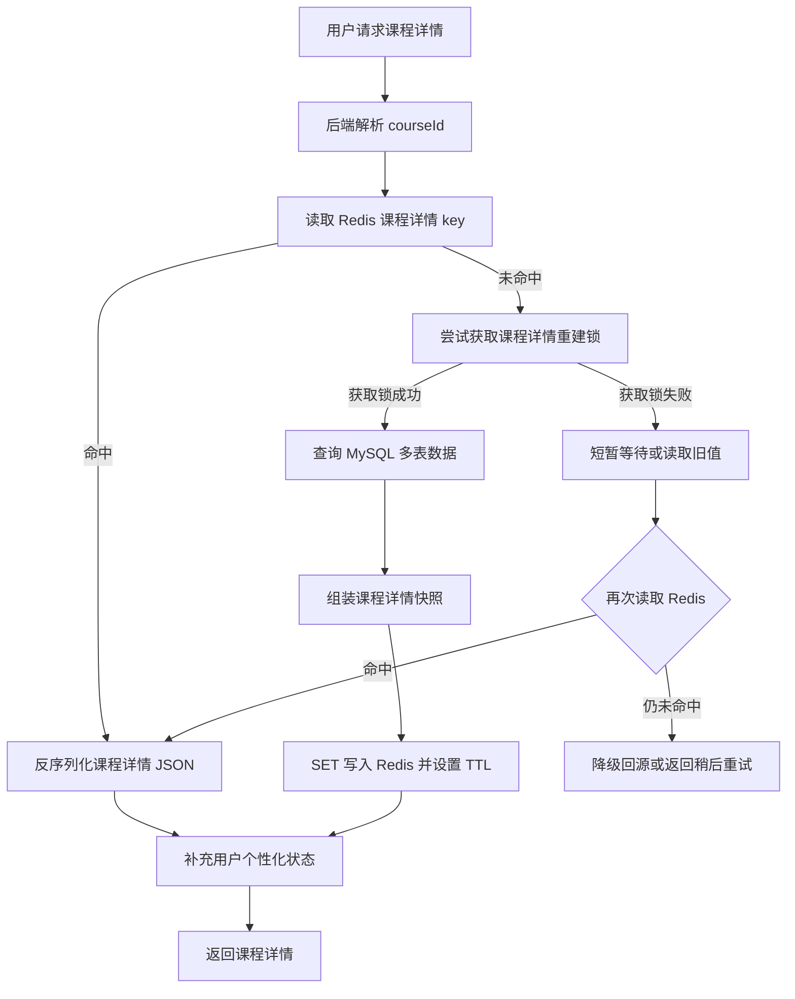
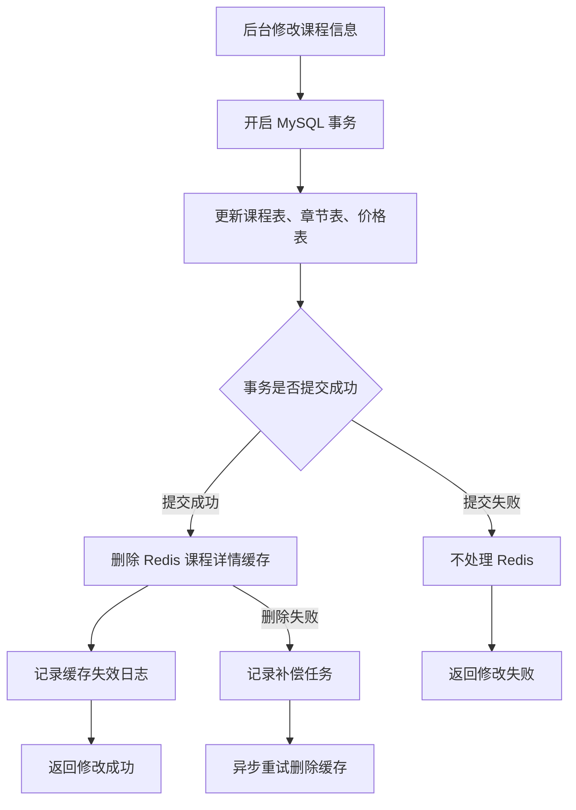
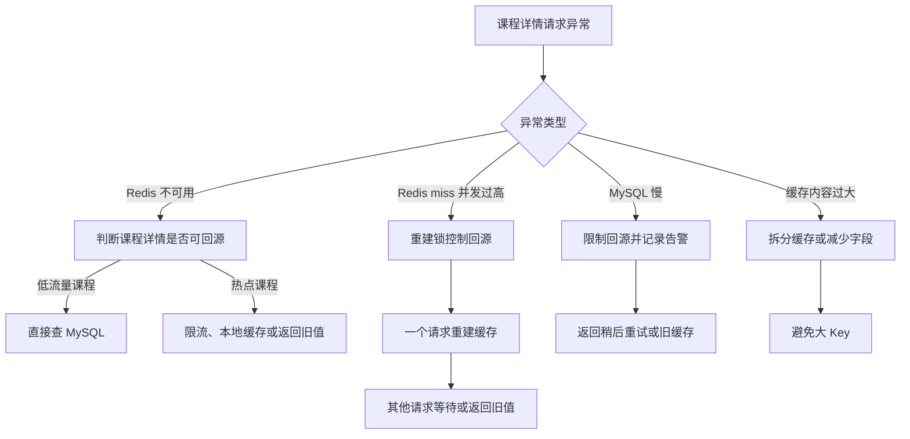

# 第 3 章：Strings：适合缓存完整结果、简单状态和计数

## 1. 本章定位

本章要回答的问题：**课程详情、活动配置、首页配置、简单计数、短期状态为什么适合 Strings？**

本章核心结论：Redis String 适合保存一个 key 对应的完整值，例如完整 JSON 快照、简单状态值、计数值；它是 Redis 中最基础的 value 类型，也常用于缓存。参考：[Redis 官方 Strings 文档](https://redis.io/docs/latest/develop/data-types/strings/)

在后端工程里，String 最常见的价值不是“存字符串”，而是把 MySQL 多表聚合后的读模型提前组装好，缓存成一个完整快照，减少高频接口重复查库和重复组装。**标记：主观推断**

---

## 2. 一句话结论

Redis String 适合缓存“整体读取、整体返回、局部更新不频繁”的完整结果，例如课程详情、首页配置、活动配置。参考：[Redis 官方 Strings 文档](https://redis.io/docs/latest/develop/data-types/strings/)

如果业务需要频繁修改对象里的单个字段，优先考虑 Hash 或 JSON，而不是把大 JSON String 反复整体读写。**标记：主观推断**

---

## 3. 这个数据类型适合解决什么问题？

| 适合的问题  | 典型表现                        | 为什么适合                                                                                         |
| ------ | --------------------------- | --------------------------------------------------------------------------------------------- |
| 完整结果缓存 | 课程详情需要查课程表、章节表、讲师表、价格表、权限配置 | String 可以保存组装后的完整 JSON 快照。**标记：主观推断**                                                         |
| 配置缓存   | 首页配置、活动配置读取频繁但修改不频繁         | String 适合整体读取、整体失效。**标记：主观推断**                                                                |
| 短期状态   | 验证码、登录 token、活动临时状态         | String 可以配合 TTL 控制生命周期。参考：[Redis 官方 SET 文档](https://redis.io/docs/latest/commands/set/)       |
| 简单计数   | PV、接口访问次数、限流计数              | `INCR` 会把 String 值按整数处理并递增。参考：[Redis 官方 INCR 文档](https://redis.io/docs/latest/commands/incr/) |
| 热点读模型  | 热门课程、活动首页、排行榜第一页频繁访问        | String 可以减少 MySQL 高频读压力。**标记：主观推断**                                                           |

---

## 4. 典型场景选择

### 4.1 本章主案例

```text
主案例：课程详情快照缓存
选择原因：课程详情通常需要 MySQL 多表查询和服务端组装，适合缓存成一个完整 JSON 快照；这个案例能同时讲清楚 String 的核心价值、Cache Aside、TTL、缓存击穿、大 Key 边界和 MySQL 事实源。**标记：主观推断**
```

### 4.2 辅助案例

```text
辅助案例：
- 首页配置缓存：适合整体 JSON 快照，重点关注热点 Key、本地缓存和配置变更后的缓存失效。
- 活动配置缓存：适合低频修改、高频读取，重点关注 TTL 和后台更新后的缓存删除。
- 用户学习进度快照：适合展示层快照，重点关注学习结果事实仍要落 MySQL。
- 活动状态快照：适合短期状态展示，重点关注活动开始、结束、下架后的失效策略。
- 简单计数 / 短期状态：适合 INCR、验证码、登录 token，但不作为本章完整主案例。
```

---

## 5. 主案例设计

### 5.1 场景背景

课程详情页是一个典型高频读接口。

用户进入课程详情页时，后端可能需要读取：

* 课程基础信息。
* 讲师信息。
* 章节目录。
* 价格信息。
* 学习人数。
* 用户是否已购买。
* 用户是否有学习权限。
* 活动优惠状态。

其中一部分是课程公共信息，一部分是用户个性化信息。

本章主案例只缓存“课程公共详情快照”，例如课程标题、简介、讲师、章节目录、价格配置、上下架状态等；用户是否已购买、是否有学习权限这类强用户相关数据不放进公共快照。**标记：主观推断**

---

### 5.2 Redis 设计

```text
Redis key:
course:detail:{courseId}:v1

Redis value:
课程公共详情 JSON 快照

TTL:
10 分钟 ~ 60 分钟，按课程变更频率和可接受旧数据时间决定

MySQL:
课程表、章节表、讲师表、价格表、上下架状态仍然是事实源

降级:
Redis 不可用时，低流量场景可回源 MySQL；高流量热点课程需要限流、本地缓存或返回旧值兜底
```

* String value 可以保存序列化对象，适合保存课程详情 JSON 快照。参考：[Redis 官方 Strings 文档](https://redis.io/docs/latest/develop/data-types/strings/)
* `course:detail:{courseId}:v1` 中的 `v1` 用于支持缓存结构升级，避免新旧结构混用。**标记：主观推断**
* 课程公共详情和用户个性化状态要拆开缓存，避免一个用户的权限状态污染公共缓存。**标记：主观推断**
* MySQL 仍然是课程事实源，Redis 只是课程详情读模型缓存。**标记：主观推断**
* TTL 不是随便填数字，需要结合课程修改频率、业务可接受旧数据时间和回源压力设计。**标记：主观推断**

---

### 5.3 读流程



说明：

* 课程详情读取优先查 Redis String，命中后直接反序列化完整 JSON 快照。参考：[Redis 官方 GET 文档](https://redis.io/docs/latest/commands/get/)
* Redis miss 后回源 MySQL 查询课程事实数据，再组装课程详情快照。**标记：主观推断**
* 重建缓存时可以使用 `SET key value EX seconds` 写入 String 并设置过期时间。参考：[Redis 官方 SET 文档](https://redis.io/docs/latest/commands/set/)
* 热门课程 miss 时需要重建锁或 singleflight，避免大量请求同时回源 MySQL。**标记：主观推断**
* 用户是否购买、是否有权限这类个性化状态不建议放入公共课程详情 String。**标记：主观推断**
* 如果 Redis 未命中且锁也拿不到，可以短暂等待、读旧值或降级，具体取决于课程详情是否允许短时间旧数据。**标记：主观推断**

---

### 5.4 写流程



说明：

* 后台修改课程信息时，应先保证 MySQL 事务提交成功，再删除 Redis 缓存。**标记：主观推断**
* Redis `DEL` 可以删除指定 key，用于课程详情缓存失效。参考：[Redis 官方 DEL 文档](https://redis.io/docs/latest/commands/del/)
* 不建议在 MySQL 事务提交前更新 Redis，避免事务回滚后 Redis 已经写入新数据。**标记：主观推断**
* 删除缓存比直接更新缓存更简单，因为课程详情通常来自多表聚合，重新组装成本和一致性风险更高。**标记：主观推断**
* Redis 删除失败时，需要记录日志或补偿任务，避免用户长期看到旧课程详情。**标记：主观推断**
* 课程下架、价格变化、章节调整属于高敏感变更，缓存失效优先级高于普通文案更新。**标记：主观推断**

---

### 5.5 异常流程



说明：

* Redis 不可用时，不能让所有课程详情请求无限回源 MySQL，否则可能把缓存故障放大成数据库故障。**标记：主观推断**
* 热门课程可以结合本地缓存、限流、旧值兜底，降低 Redis 故障影响。**标记：主观推断**
* Redis miss 并发过高时，用重建锁控制只有少量请求回源 MySQL。**标记：主观推断**
* 课程详情 JSON 太大时，String 会变成大 Key 风险，应减少字段或拆分缓存。**标记：主观推断**
* 课程价格、上下架、权限相关数据不能长期返回旧值。**标记：主观推断**
* 普通课程简介、讲师介绍、封面图这类展示信息，可以接受更长的旧数据窗口。**标记：主观推断**

---

## 6. 关键命令

| 命令                                                 | 在主案例中的作用              | 证据 / 标记                                                                |
| -------------------------------------------------- | --------------------- | ---------------------------------------------------------------------- |
| `GET course:detail:{courseId}:v1`                  | 读取课程详情 JSON 快照        | 参考：[Redis 官方 GET 文档](https://redis.io/docs/latest/commands/get/)       |
| `SET course:detail:{courseId}:v1 value EX seconds` | 写入课程详情快照并设置 TTL       | 参考：[Redis 官方 SET 文档](https://redis.io/docs/latest/commands/set/)       |
| `DEL course:detail:{courseId}:v1`                  | 后台修改课程后删除缓存           | 参考：[Redis 官方 DEL 文档](https://redis.io/docs/latest/commands/del/)       |
| `INCR course:detail:pv:{courseId}`                 | 可用于简单 PV 计数，但不是课程事实数据 | 参考：[Redis 官方 INCR 文档](https://redis.io/docs/latest/commands/incr/)     |
| `EXPIRE key seconds`                               | 给已有 key 设置过期时间        | 参考：[Redis 官方 EXPIRE 文档](https://redis.io/docs/latest/commands/expire/) |

---

## 7. 这个类型的边界

| 边界           | 说明                                 | 处理建议                              |
| ------------ | ---------------------------------- | --------------------------------- |
| 不适合频繁局部更新    | String 通常是整体读写，局部字段频繁变化会导致反复序列化和覆盖 | 字段级更新优先考虑 Hash / JSON。**标记：主观推断** |
| 不适合无限大的 JSON | 课程详情字段过多会形成大 Key，影响网络传输和 Redis 延迟  | 控制字段数量，必要时拆分缓存。**标记：主观推断**        |
| 不能作为事实源      | Redis 可能过期、淘汰、重启或重建                | MySQL 保留课程事实数据。**标记：主观推断**        |
| 不适合混入用户个性化状态 | 公共课程缓存如果包含用户权限，会导致数据污染             | 公共快照和用户状态拆开。**标记：主观推断**           |
| 不适合承载复杂查询    | String 只能整体读取，不适合按字段查询课程集合         | 复杂查询交给 MySQL / 搜索系统。**标记：主观推断**   |

---

## 8. 常见坑

| 常见坑            | 线上风险                      | 规避方式                             |
| -------------- | ------------------------- | -------------------------------- |
| 大 JSON 变成大 Key | Redis 读取、传输、删除成本上升，接口延迟抖动 | 控制课程详情字段，只缓存高频展示字段。**标记：主观推断**   |
| 热门课程缓存击穿       | 热点 key 过期瞬间大量请求打到 MySQL   | 重建锁、逻辑过期、本地缓存、热点预热。**标记：主观推断**   |
| 后台改课程后缓存未删     | 用户继续看到旧价格、旧上下架状态、旧章节      | MySQL 提交后删除缓存，失败记录补偿。**标记：主观推断** |
| 公共缓存混入用户状态     | A 用户看到 B 用户权限或价格          | 公共数据和用户个性化数据拆分。**标记：主观推断**       |
| TTL 设计随意       | TTL 太短导致频繁回源，太长导致旧数据窗口过大  | 按变更频率和可接受旧数据时间设计。**标记：主观推断**     |

---

## 9. 和其他方案的边界

| 方案           | 是否适合                | 原因                                                            |
| ------------ | ------------------- | ------------------------------------------------------------- |
| MySQL        | 适合做事实源，不适合承接所有高频详情读 | MySQL 负责正确性、事务、审计；高频读可由 Redis 加速。**标记：主观推断**                  |
| Redis String | 适合课程公共详情快照          | 整体读取、整体返回、修改不频繁，正好匹配 String。**标记：主观推断**                       |
| Redis Hash   | 适合字段级频繁更新的对象状态      | 如果课程对象经常只改某几个字段，Hash 更合适。**标记：主观推断**                          |
| Redis JSON   | 适合结构化文档的局部读写        | 如果需要在 Redis 中按路径修改复杂 JSON，可考虑 JSON，但不要默认替代 String。**标记：主观推断** |
| 本地缓存         | 适合热点课程的二级缓存         | 可以保护 Redis 热 key，但多实例一致性和失效机制更复杂。**标记：主观推断**                  |

---

## 10. 内容分层

| 内容                         | 分层          | 处理方式                    |
| -------------------------- | ----------- | ----------------------- |
| String 适合完整 JSON 快照        | 必须放入本章      | 这是 Strings 章节主线         |
| 课程详情快照缓存主案例                | 必须放入本章      | 最能体现完整结果缓存              |
| `GET / SET / DEL / EXPIRE` | 必须放入本章      | 直接服务主案例读写和失效            |
| `INCR` 简单计数                | 可选补充        | 属于 Strings 能力，但不是课程详情主线 |
| 验证码 / 登录 token             | 可选补充        | 适合短期状态，但不完整展开           |
| Cache Aside、击穿、TTL         | 必须放入本章的相关部分 | 与课程详情缓存强相关              |
| Redis / MySQL 事实源分工        | 统一升华章节      | 本章点到为止，第 17 章再系统讲       |
| Redis 故障降级体系               | 统一升华章节      | 本章只讲课程详情相关处理，第 18 章再升华  |
| 持久化和一致性取舍                  | 统一升华章节      | 第 19 章统一讲               |
| 热 Key、大 Key 全局治理           | 统一升华章节      | 本章只讲课程详情相关风险，第 18 章再展开  |

---

## 11. 工程评审关注点

| 关注点                 | 回答方向                                                           |
| ------------------- | -------------------------------------------------------------- |
| 为什么课程详情适合用 String？  | 因为课程详情公共部分通常是整体读取、整体返回，适合缓存成完整 JSON 快照。**标记：主观推断**             |
| 为什么不用 Hash？         | 如果主要是整体读取课程详情，Hash 字段级优势不明显；字段频繁局部更新时再考虑 Hash。**标记：主观推断**      |
| 为什么不用 JSON？         | 如果没有 Redis 内部路径级修改需求，String 更简单；JSON 适合更复杂的结构化局部读写。**标记：主观推断** |
| MySQL 和 Redis 怎么分工？ | MySQL 存课程事实，Redis 存课程详情读模型；Redis 丢了可以回源重建。**标记：主观推断**          |
| 最大线上风险是什么？          | 热门课程缓存击穿、大 Key、后台修改后旧缓存未失效。**标记：主观推断**                         |

---

## 12. 本章记忆点

1. String 不是只能存“字符串”，它最常见的工程价值是缓存完整读模型。
2. 课程详情适合 String 的前提是：整体读取、整体返回、局部更新不频繁。
3. MySQL 保课程事实，Redis 提升课程详情读取性能；Redis 丢了必须能从 MySQL 重建。

---

## 13. 参考资料

1. [Redis 官方 Strings 文档](https://redis.io/docs/latest/develop/data-types/strings/)：用于确认 Strings 是 Redis 最基础的 value 类型，常用于缓存，也可用于计数器等能力。
2. [Redis 官方 GET 文档](https://redis.io/docs/latest/commands/get/)：用于确认读取 String value 的命令能力。
3. [Redis 官方 SET 文档](https://redis.io/docs/latest/commands/set/)：用于确认写入 String value，以及支持过期时间选项。
4. [Redis 官方 DEL 文档](https://redis.io/docs/latest/commands/del/)：用于确认删除 key 的命令能力。
5. [Redis 官方 EXPIRE 文档](https://redis.io/docs/latest/commands/expire/)：用于确认给 key 设置过期时间的能力。
6. [Redis 官方 INCR 文档](https://redis.io/docs/latest/commands/incr/)：用于确认 Redis String 可以作为整数递增计数。
7. [Redis GitHub Releases](https://github.com/redis/redis/releases)：用于确认 Redis 8.8.0 版本相关信息。
