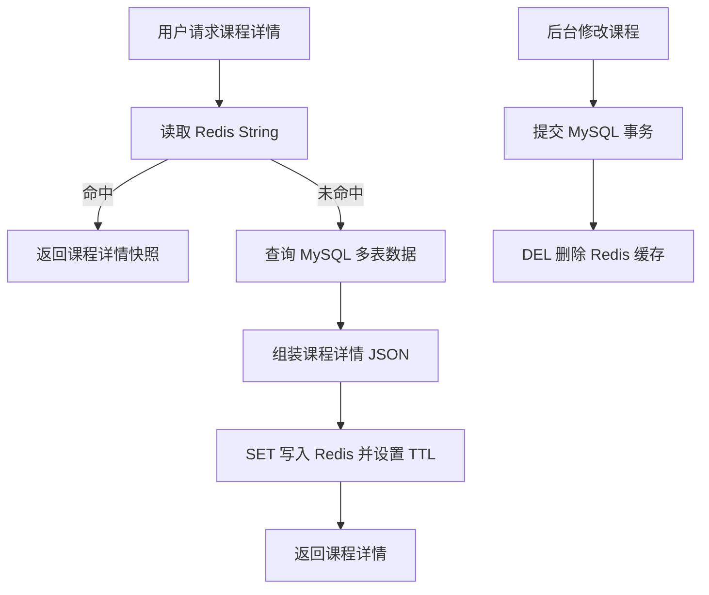

# 第 3 章：Strings：适合缓存完整结果、简单状态和计数

## 1. 本章一句话

Redis String 适合缓存“整体读取、整体返回、局部更新不频繁”的完整结果，例如课程详情、首页配置、活动配置。参考：[Redis 官方 Strings 文档](https://redis.io/docs/latest/develop/data-types/strings/)

核心判断：String 最常见的工程价值，不是单纯存字符串，而是把 MySQL 多表聚合后的读模型缓存成完整 JSON 快照。**标记：主观推断**

---

## 2. 适合解决什么问题？

| 场景     | 为什么适合                                                                                         |
| ------ | --------------------------------------------------------------------------------------------- |
| 课程详情快照 | 课程详情通常来自 MySQL 多表聚合，适合缓存成完整 JSON 快照。**标记：主观推断**                                               |
| 首页配置缓存 | 整体读取、低频修改、高频访问，适合 String 缓存。**标记：主观推断**                                                       |
| 活动配置缓存 | 活动配置读取频繁，后台修改后删除缓存即可。**标记：主观推断**                                                              |
| 短期状态   | 验证码、登录 token、临时状态可以配合 TTL 使用。参考：[Redis 官方 SET 文档](https://redis.io/docs/latest/commands/set/) |
| 简单计数   | PV、接口访问次数、限流计数可以用 `INCR`。参考：[Redis 官方 INCR 文档](https://redis.io/docs/latest/commands/incr/)   |

---

## 3. 主案例

```text
主案例：课程详情快照缓存

核心原因：
课程详情通常需要查询课程表、章节表、讲师表、价格表等多个 MySQL 数据源，接口访问频率高，适合提前组装成完整 JSON 快照缓存到 Redis String。**标记：主观推断**
```

辅助案例：

* 首页配置缓存：重点关注热点 Key、本地缓存、配置变更后缓存失效。
* 活动配置缓存：重点关注 TTL、活动状态变化、后台修改后的缓存删除。
* 用户学习进度快照：重点关注展示缓存和学习结果事实源的边界。

---

## 4. 核心流程



说明：

* 读取课程详情时，优先用 `GET` 查询 Redis String。参考：[Redis 官方 GET 文档](https://redis.io/docs/latest/commands/get/)
* Redis 未命中时，回源 MySQL 查询事实数据并重建缓存。**标记：主观推断**
* 写入课程详情快照时，可以用 `SET key value EX seconds` 同时设置 TTL。参考：[Redis 官方 SET 文档](https://redis.io/docs/latest/commands/set/)
* 后台修改课程后，建议 MySQL 事务提交成功后再删除 Redis 缓存。**标记：主观推断**
* 删除缓存可以使用 `DEL`。参考：[Redis 官方 DEL 文档](https://redis.io/docs/latest/commands/del/)

---

## 5. 关键命令

| 命令           | 作用                                                                                 |
| ------------ | ---------------------------------------------------------------------------------- |
| `GET`        | 读取课程详情 JSON 快照。参考：[Redis 官方 GET 文档](https://redis.io/docs/latest/commands/get/)    |
| `SET ... EX` | 写入课程详情快照并设置过期时间。参考：[Redis 官方 SET 文档](https://redis.io/docs/latest/commands/set/)   |
| `DEL`        | 后台修改课程后删除缓存。参考：[Redis 官方 DEL 文档](https://redis.io/docs/latest/commands/del/)       |
| `INCR`       | 简单计数，例如 PV、访问次数。参考：[Redis 官方 INCR 文档](https://redis.io/docs/latest/commands/incr/) |

---

## 6. 边界和坑

| 问题             | 说明                                                         |
| -------------- | ---------------------------------------------------------- |
| 大 JSON 变成大 Key | 课程详情字段过多会增加 Redis 读写、网络传输和删除成本。**标记：主观推断**                 |
| 局部字段更新困难       | String 更适合整体读写；如果字段频繁局部更新，优先考虑 Hash 或 JSON。**标记：主观推断**     |
| 缓存击穿           | 热门课程缓存过期时，大量请求可能同时回源 MySQL，需要重建锁或 singleflight。**标记：主观推断** |
| 缓存和 DB 不一致     | 后台修改课程后，如果 Redis 未删除，用户可能看到旧课程信息。**标记：主观推断**               |
| 不能当事实源         | 课程事实仍在 MySQL，Redis 只是加速层，丢了要能重建。**标记：主观推断**                |

---

## 7. 本章记忆点

1. String 最适合缓存完整读模型，不适合频繁局部字段更新。
2. 课程详情适合 String 的前提是：整体读取、整体返回、修改频率低。
3. MySQL 保课程事实，Redis 提升读取性能；Redis 丢了必须能从 MySQL 重建。
