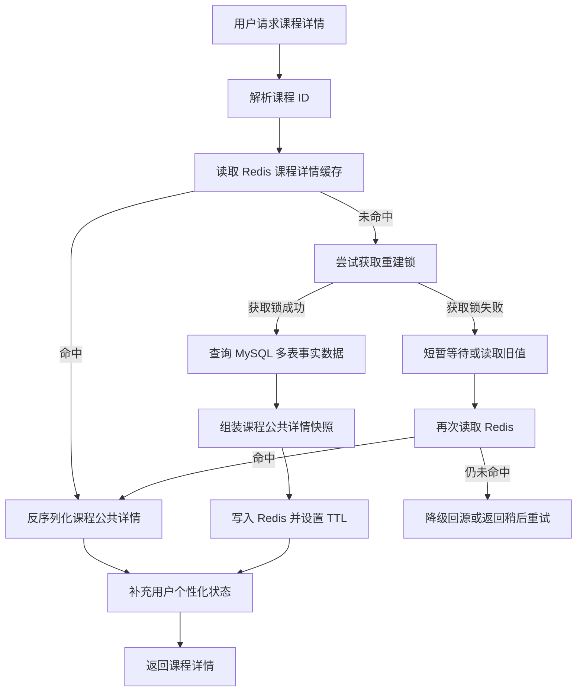
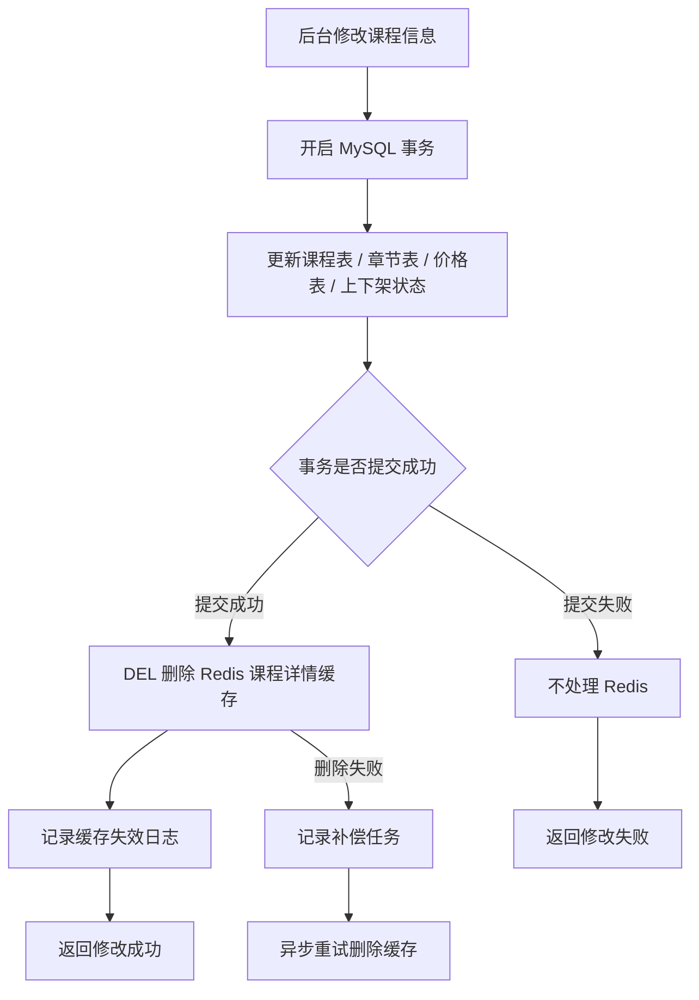
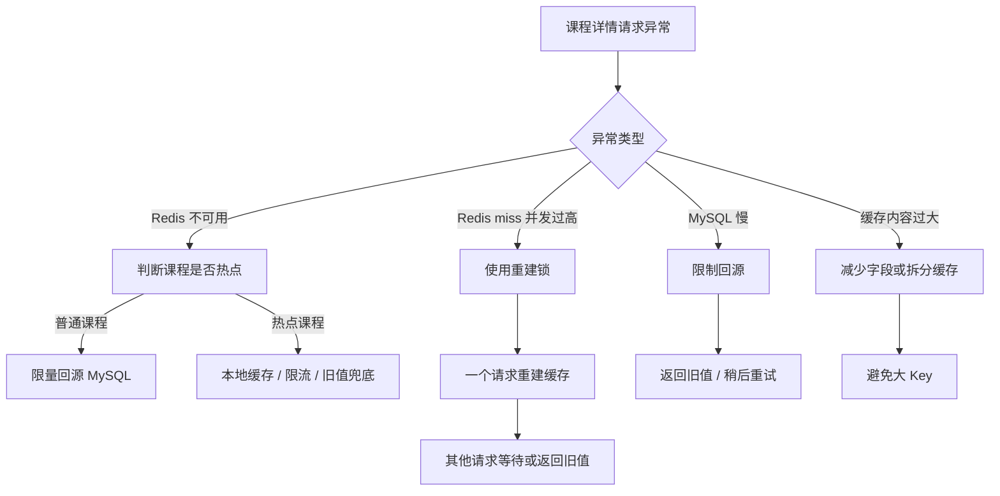
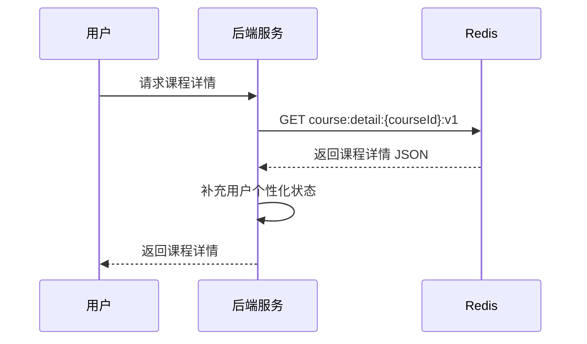
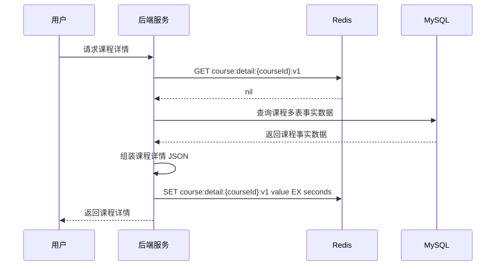
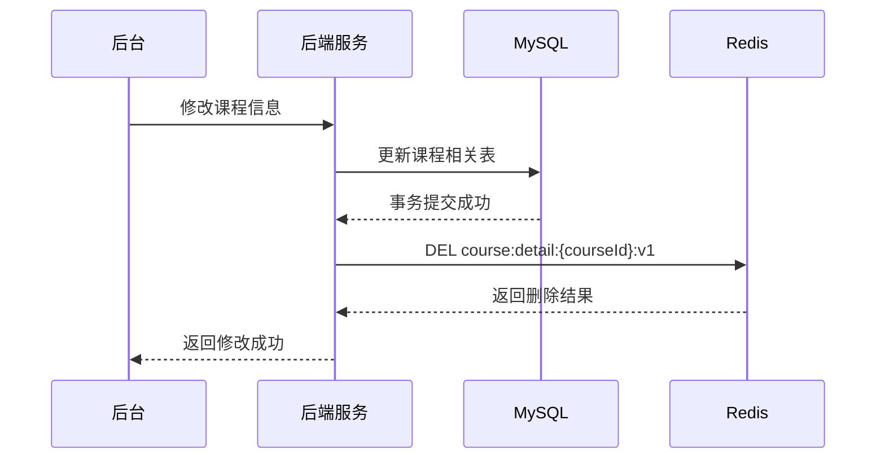
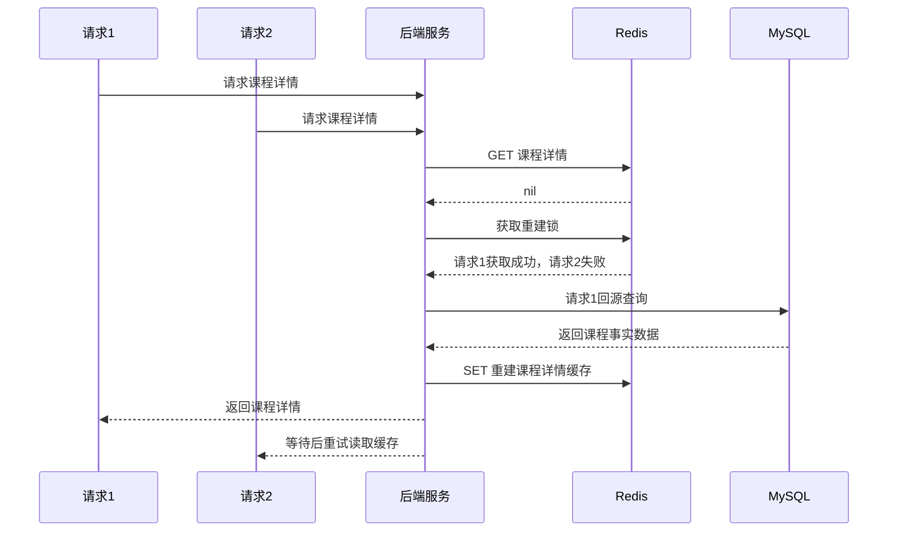

# Redis 知识点：Strings

本次学习输入：

```text
知识点：Strings
业务场景：课程详情快照缓存
重点关注：类型选择边界：为什么课程详情适合用 String，而不是 Hash / JSON / MySQL 直接查
```

---

## 1. 一句话结论

Redis String 适合缓存“整体读取、整体返回、局部更新不频繁”的完整结果，例如课程详情 JSON 快照。参考：[Redis 官方 Strings 文档](https://redis.io/docs/latest/develop/data-types/strings/)

课程详情适合 String 的核心原因不是“它是字符串”，而是课程公共详情通常来自 MySQL 多表聚合，适合提前组装成完整读模型缓存起来。**标记：主观推断**

---

## 2. 这个知识点是什么？

Redis Strings 是 Redis 中最基础的 value 类型，可以存储文本、序列化对象、二进制数组等字节序列。参考：[Redis 官方 Strings 文档](https://redis.io/docs/latest/develop/data-types/strings/)

在业务开发里，String 常见用法不是只存简单文本，而是存一个完整结果，例如：

```text
course:detail:10001:v1 -> "{ title, teacher, chapters, price, status, updatedAt }"
```

对于课程详情这种“读的时候需要整体返回”的数据，String 可以把 MySQL 多表查询和服务端组装结果提前缓存成一个完整 JSON 快照。**标记：主观推断**

---

## 3. 它解决什么业务问题？

| 业务问题             | 具体表现                            | Redis 如何解决                                                                                                                                                            |
| ---------------- | ------------------------------- | --------------------------------------------------------------------------------------------------------------------------------------------------------------------- |
| 多表聚合重复查询         | 课程详情可能涉及课程表、讲师表、章节表、价格表、活动配置表   | 把聚合后的课程公共详情缓存成 String JSON 快照。**标记：主观推断**                                                                                                                             |
| 高频访问压 MySQL      | 热门课程详情页访问量高，每次都查 MySQL 成本高      | 优先读 Redis，命中后直接返回快照。**标记：主观推断**                                                                                                                                       |
| 接口响应慢            | MySQL 查询、组装、权限过滤等链路变长           | 公共详情先缓存，用户个性化状态单独补充。**标记：主观推断**                                                                                                                                       |
| 后台修改后需要控制旧数据窗口   | 课程标题、章节、价格、上下架状态变化后，缓存可能旧       | MySQL 提交后删除 Redis 缓存，下次读取重新构建。**标记：主观推断**                                                                                                                             |
| 简单状态或计数也需要 Redis | PV、访问次数、临时 token、验证码等也常用 String | `INCR` 可用于整数递增计数，`SET` 可配合过期时间保存短期状态。参考：[Redis 官方 INCR 文档](https://redis.io/docs/latest/commands/incr/)、[Redis 官方 SET 文档](https://redis.io/docs/latest/commands/set/) |

---

## 4. Redis 为什么适合？

| Redis 能力              | 对应业务价值                    | 证据 / 标记                                                                            |
| --------------------- | ------------------------- | ---------------------------------------------------------------------------------- |
| String 可存储序列化对象       | 可以保存课程详情 JSON 快照          | 参考：[Redis 官方 Strings 文档](https://redis.io/docs/latest/develop/data-types/strings/) |
| `GET` 读取 String value | 课程详情命中缓存后直接读取完整快照         | 参考：[Redis 官方 GET 文档](https://redis.io/docs/latest/commands/get/)                   |
| `SET` 写入 String value | MySQL 回源后，把课程详情快照写入 Redis | 参考：[Redis 官方 SET 文档](https://redis.io/docs/latest/commands/set/)                   |
| `SET` 支持过期选项          | 写入课程详情时可以同时设置 TTL         | 参考：[Redis 官方 SET 文档](https://redis.io/docs/latest/commands/set/)                   |
| `EXPIRE` 设置 key 过期时间  | 已存在缓存可以单独设置或调整 TTL        | 参考：[Redis 官方 EXPIRE 文档](https://redis.io/docs/latest/commands/expire/)             |
| `DEL` 删除 key          | 后台修改课程后可以删除课程详情缓存         | 参考：[Redis 官方 DEL 文档](https://redis.io/docs/latest/commands/del/)                   |
| 内存访问适合高频读             | 热门课程详情可以减少 MySQL 高频查询     | **标记：主观推断**                                                                        |

要求注意：这里不是因为 Redis “快”就适合，而是因为课程详情公共部分符合 **整体读取、整体返回、修改频率相对低、可从 MySQL 重建** 这几个条件。**标记：主观推断**

---

## 5. 它的边界是什么？

| 边界             | 说明                                 | 更合适的选择                   |
| -------------- | ---------------------------------- | ------------------------ |
| 不适合频繁局部更新      | 如果课程对象经常只改某几个字段，String 需要整体读写 JSON | Hash / JSON。**标记：主观推断**  |
| 不适合无限大的详情对象    | 字段过多会变成大 Key，影响网络传输、读写延迟和删除成本      | 拆分缓存 / 减少字段。**标记：主观推断**  |
| 不适合存用户个性化状态    | 公共课程详情如果混入用户购买状态、权限状态，会造成数据污染      | 公共快照和用户状态拆开。**标记：主观推断**  |
| 不能替代 MySQL 事实源 | Redis 可能过期、淘汰、重启、被删除               | MySQL 保课程事实。**标记：主观推断**  |
| 不适合复杂查询        | String 只能按 key 整体读取，不适合按字段筛选、排序、搜索 | MySQL / 搜索系统。**标记：主观推断** |

核心边界：**String 适合完整读模型，不适合复杂业务对象的长期事实存储。** **标记：主观推断**

---

## 6. 常见坑是什么？

| 常见坑            | 线上风险                        | 规避方式                                   |
| -------------- | --------------------------- | -------------------------------------- |
| 大 JSON 变成大 Key | Redis 读写、网络传输、删除都会变重        | 只缓存高频展示字段，必要时拆分缓存。**标记：主观推断**          |
| 热门课程缓存击穿       | key 过期瞬间大量请求同时查 MySQL       | 重建锁、singleflight、逻辑过期、本地缓存。**标记：主观推断** |
| 后台修改课程后未删除缓存   | 用户看到旧价格、旧章节、旧上下架状态          | MySQL 提交后删除 Redis，失败进入补偿。**标记：主观推断**   |
| 公共缓存混入用户状态     | A 用户可能看到 B 用户状态，或权限判断错误     | 公共课程详情和用户个性化信息分开缓存。**标记：主观推断**         |
| TTL 随便设置       | 太短导致频繁回源，太长导致旧数据窗口过大        | 按数据变化频率和业务可接受旧数据时间设计。**标记：主观推断**       |
| Redis 故障时无限回源  | Redis 不可用后，所有请求打 MySQL，导致雪崩 | 限流、降级、本地缓存、热点数据预热。**标记：主观推断**          |

---

## 7. MySQL / 本地缓存 / 其他方案是否更合适？

| 方案           | 是否适合                 | 原因                                                          |
| ------------ | -------------------- | ----------------------------------------------------------- |
| MySQL        | 适合做事实源，但不适合承接所有高频详情读 | MySQL 负责正确性、事务、审计；高频读可由 Redis 加速。**标记：主观推断**                |
| Redis String | 适合课程公共详情快照           | 课程详情公共部分通常整体读取、整体返回、局部更新不频繁。**标记：主观推断**                     |
| Redis Hash   | 部分适合                 | 如果课程对象需要频繁字段级修改，Hash 更适合；但整体详情快照用 String 更简单。**标记：主观推断**    |
| Redis JSON   | 部分适合                 | 如果需要在 Redis 内部按路径修改复杂 JSON，可考虑 JSON；普通快照缓存不一定需要。**标记：主观推断** |
| 本地缓存         | 适合热点兜底，不适合作为唯一缓存     | 本地缓存能抗热点，但多实例一致性和失效机制更复杂。**标记：主观推断**                        |
| 搜索系统         | 适合检索，不适合课程详情事实源      | 搜索系统适合列表搜索、关键词检索，不适合替代详情事实源。**标记：主观推断**                     |

最终判断：课程详情公共展示数据最适合的基础方案是 **MySQL 做事实源，Redis String 做完整详情快照缓存，本地缓存作为热点兜底补充**。**标记：主观推断**

---

## 8. 具体业务场景例子

### 8.1 场景背景

用户打开课程详情页时，后端需要返回课程公共信息。

课程公共详情可能包括：

```text
courseId
title
subtitle
coverUrl
teacherInfo
chapterList
priceInfo
saleStatus
courseStatus
updatedAt
```

这些数据可能来自多张 MySQL 表：

```text
course
course_teacher
course_chapter
course_price
course_sale_config
```

本案例只缓存“课程公共详情快照”，不缓存用户是否已购买、是否有权限、学习进度等用户个性化数据。**标记：主观推断**

---

### 8.2 业务问题

* 课程详情接口访问频率高，直接查 MySQL 多表会增加数据库压力。**标记：主观推断**
* 热门课程可能成为热点接口，重复组装课程详情会浪费服务端资源。**标记：主观推断**
* 课程详情大部分字段是公共展示数据，适合被多个用户复用。**标记：主观推断**
* 课程价格、上下架、章节变化后，缓存必须及时失效。**标记：主观推断**
* 用户是否购买、是否有权限不能混入公共课程详情缓存。**标记：主观推断**

---

### 8.3 Redis 设计

```text
Redis key:
course:detail:{courseId}:v1

Redis value:
课程公共详情 JSON 快照

示例：
{
  "courseId": 10001,
  "title": "Redis 后端实战课",
  "teacher": {...},
  "chapters": [...],
  "price": {...},
  "status": "online",
  "updatedAt": "2026-07-05T12:00:00"
}

TTL:
10 分钟 ~ 60 分钟，按课程修改频率和业务可接受旧数据时间决定

MySQL:
课程表、章节表、讲师表、价格表、上下架状态仍然是事实源

降级:
Redis 不可用时，低流量课程可以回源 MySQL；热点课程需要限流、本地缓存、旧值兜底或稍后重试
```

* `course:detail:{courseId}:v1` 中的 `v1` 用于缓存结构升级，避免新旧 JSON 结构混用。**标记：主观推断**
* value 存课程公共详情快照，不存用户个性化状态。**标记：主观推断**
* TTL 是兜底机制，不是唯一一致性方案。**标记：主观推断**
* 后台修改课程后，应主动删除缓存，而不是只等 TTL 自然过期。**标记：主观推断**

---

### 8.4 读流程



说明：

* 课程详情读取优先使用 `GET` 查询 Redis String。参考：[Redis 官方 GET 文档](https://redis.io/docs/latest/commands/get/)
* Redis key 示例：`course:detail:{courseId}:v1`。**标记：主观推断**
* Redis 命中后，直接反序列化课程公共详情 JSON。**标记：主观推断**
* Redis miss 后，回源 MySQL 查询课程事实数据并重建缓存。**标记：主观推断**
* 写入课程详情快照时，可以使用 `SET key value EX seconds`。参考：[Redis 官方 SET 文档](https://redis.io/docs/latest/commands/set/)
* 热门课程 miss 时，需要重建锁或 singleflight，避免大量请求同时回源 MySQL。**标记：主观推断**
* 用户个性化状态应在公共详情快照之外单独补充。**标记：主观推断**
* Redis 未命中且锁竞争失败时，可以短暂等待、读旧值或降级，取决于业务对旧数据的接受程度。**标记：主观推断**


### 8.5 写流程



说明：

* 后台修改课程信息时，应先保证 MySQL 事务提交成功，再删除 Redis 缓存。**标记：主观推断**
* Redis `DEL` 可以删除指定 key，用于课程详情缓存失效。参考：[Redis 官方 DEL 文档](https://redis.io/docs/latest/commands/del/)
* 不建议在 MySQL 事务提交前更新 Redis，避免事务回滚后 Redis 已经写入新数据。**标记：主观推断**
* 删除缓存比直接更新缓存更简单，因为课程详情通常来自多表聚合，重新组装容易遗漏字段。**标记：主观推断**
* Redis 删除失败时，需要记录日志或补偿任务，避免用户长期看到旧课程详情。**标记：主观推断**
* 价格、上下架、章节变化属于高敏感变更，缓存失效优先级应高于普通文案修改。**标记：主观推断**

---

### 8.6 异常处理



说明：

* Redis 不可用时，不能让所有课程详情请求无限回源 MySQL。**标记：主观推断**
* 热点课程可以结合本地缓存、限流、旧值兜底，降低 Redis 故障影响。**标记：主观推断**
* Redis miss 并发过高时，用重建锁控制只有少量请求回源 MySQL。**标记：主观推断**
* MySQL 慢时，需要限制回源，避免缓存故障扩大成数据库故障。**标记：主观推断**
* 课程详情 JSON 太大时，String 会变成大 Key 风险，应减少字段或拆分缓存。**标记：主观推断**
* 价格、上下架、权限相关信息不能长期返回旧值。**标记：主观推断**
* 普通展示信息，例如简介、封面、讲师介绍，可以接受相对更长的旧数据窗口。**标记：主观推断**

---

### 8.7 监控指标

| 指标                 | 作用                             |
| ------------------ | ------------------------------ |
| Redis QPS          | 观察课程详情缓存访问压力                   |
| Redis P95 / P99 延迟 | 判断课程详情接口是否受 Redis 延迟影响         |
| keyspace_hits      | 观察课程详情缓存命中次数                   |
| keyspace_misses    | 观察课程详情缓存 miss 次数               |
| 缓存命中率              | 判断课程详情是否频繁回源 MySQL             |
| MySQL 回源次数         | 判断缓存失效或击穿是否过多                  |
| 缓存重建锁获取成功 / 失败次数   | 判断热点课程是否存在并发重建问题               |
| expired_keys       | 判断课程详情缓存过期是否符合预期               |
| evicted_keys       | 判断是否因为内存淘汰导致课程详情异常 miss        |
| used_memory        | 判断课程详情快照是否造成内存压力               |
| slowlog            | 排查大 key、慢命令、异常访问               |
| 降级次数               | 判断 Redis 或 MySQL 异常时是否频繁进入兜底路径 |

---

## 9. Mermaid 图

### 9.1 Redis 命中流程



### 9.2 Redis 未命中 + MySQL 回源流程



### 9.3 后台更新 MySQL + 删除缓存流程



### 9.4 并发 miss + 重建锁流程



---

## 10. 工程评审关注点

| 关注点                  | 说明                                                            |
| -------------------- | ------------------------------------------------------------- |
| 为什么课程详情用 String？     | 因为课程公共详情通常整体读取、整体返回、局部更新不频繁，适合完整 JSON 快照。**标记：主观推断**          |
| 为什么不用 Hash？          | 如果只是整体读课程详情，Hash 的字段级优势不明显；字段频繁局部更新时再考虑 Hash。**标记：主观推断**      |
| 为什么不用 JSON？          | 如果没有 Redis 内部路径级修改需求，String 更简单；复杂结构化局部读写再考虑 JSON。**标记：主观推断** |
| 为什么不直接查 MySQL？       | 热门课程高频访问会重复多表查询和服务端组装，Redis 可以降低读压力。**标记：主观推断**               |
| Redis 和 MySQL 谁是事实源？ | MySQL 是课程事实源，Redis 是课程公共详情读模型缓存。**标记：主观推断**                   |
| 后台修改课程后怎么保证不读旧数据？    | MySQL 事务提交后删除 Redis 缓存，删除失败进入补偿。**标记：主观推断**                   |
| Redis 挂了怎么办？         | 普通课程限量回源 MySQL，热点课程要限流、本地缓存或旧值兜底。**标记：主观推断**                  |
| 最大线上风险是什么？           | 热门课程缓存击穿、大 Key、旧缓存未失效、公共缓存混入用户状态。**标记：主观推断**                  |
| TTL 怎么设计？            | 按课程变更频率、可接受旧数据时间、回源压力综合判断。**标记：主观推断**                         |
| 什么时候不该用 String？      | 字段频繁局部更新、复杂查询、大对象、强事实源数据，都不适合只用 String。**标记：主观推断**            |

---

## 11. 最终记忆点

1. String 最适合缓存完整读模型：整体读取、整体返回、局部更新不频繁。
2. 课程详情公共信息可以缓存成 String JSON 快照，但用户个性化状态要拆开。
3. MySQL 保课程事实，Redis 做详情加速；Redis 丢了必须能从 MySQL 重建。
4. String 的主要风险不是不会用 `GET / SET`，而是大 Key、击穿、旧缓存和事实源混乱。
5. 判断是否用 String，先问一句：这个数据是不是完整快照，而不是频繁局部更新对象？

---

## 12. 参考资料

1. [Redis 官方 Strings 文档](https://redis.io/docs/latest/develop/data-types/strings/)：用于确认 Strings 可存储文本、序列化对象、二进制数组，常用于缓存，也支持计数器等能力。
2. [Redis 官方 GET 文档](https://redis.io/docs/latest/commands/get/)：用于确认读取 String value 的命令能力。
3. [Redis 官方 SET 文档](https://redis.io/docs/latest/commands/set/)：用于确认写入 String value，以及支持过期时间选项。
4. [Redis 官方 DEL 文档](https://redis.io/docs/latest/commands/del/)：用于确认删除 key 的命令能力。
5. [Redis 官方 EXPIRE 文档](https://redis.io/docs/latest/commands/expire/)：用于确认给 key 设置过期时间的能力。
6. [Redis 官方 INCR 文档](https://redis.io/docs/latest/commands/incr/)：用于确认 String 可以作为整数递增计数。
7. [Redis GitHub Releases](https://github.com/redis/redis/releases)：用于确认 Redis 8.8.0 版本相关信息。
