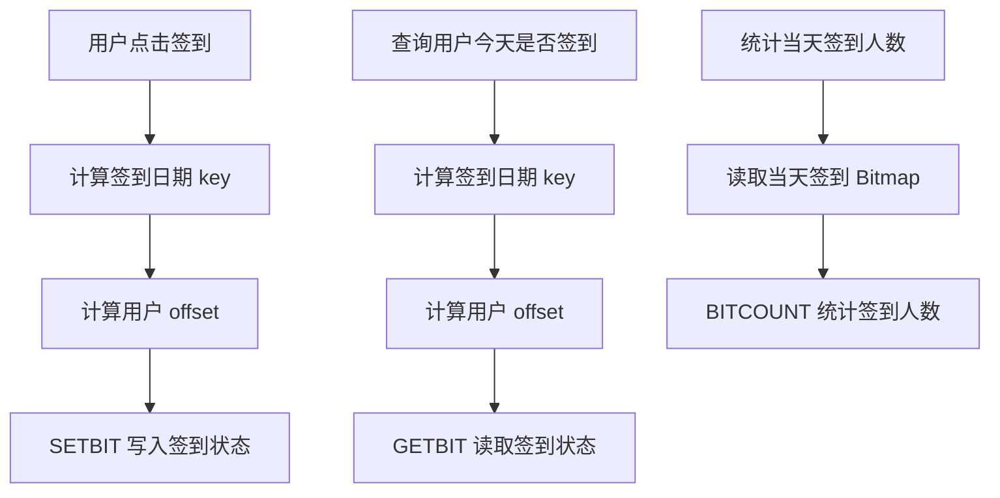

# 第 4 章：Bitmaps：适合海量是/否状态记录

## 1. 本章一句话

Redis Bitmaps 适合记录海量“是 / 否”状态，例如每日签到、用户活跃、课程是否完成。参考：[Redis 官方 Bitmaps 文档](https://redis.io/docs/latest/develop/data-types/strings/bitmaps/)

核心判断：Bitmap 的价值不是表达复杂业务过程，而是用极低空间成本记录大量布尔状态。**标记：主观推断**

---

## 2. 适合解决什么问题？

| 场景          | 为什么适合                                                                                                              |
| ----------- | ------------------------------------------------------------------------------------------------------------------ |
| 每日签到状态      | 每个用户每天只有“签 / 未签”两种状态，适合用 1 个 bit 表示。**标记：主观推断**                                                                    |
| 用户活跃天数      | 每天是否活跃是布尔状态，可以按日期或用户维度组织 Bitmap。**标记：主观推断**                                                                        |
| 课程是否完成      | 是否完成是典型 yes/no 状态，适合 Bitmap 压缩记录。**标记：主观推断**                                                                       |
| 是否访问 / 是否读过 | 访问过或未访问过，只需要记录 0/1。**标记：主观推断**                                                                                     |
| 大规模布尔统计     | `BITCOUNT` 可以统计 Bitmap 中被设置为 1 的 bit 数量。参考：[Redis 官方 BITCOUNT 文档](https://redis.io/docs/latest/commands/bitcount/) |

---

## 3. 主案例

```text
主案例：每日签到状态记录

核心原因：
每日签到本质是“某个用户在某一天是否签到”的布尔状态，Bitmap 可以用一个 bit 表示一个用户的签到状态，比用 Set 或 MySQL 明细直接做高频统计更节省空间。**标记：主观推断**
```

辅助案例：

* 用户活跃天数：重点关注按天记录活跃状态，以及按周期统计活跃人数。
* 课程是否完成：重点关注完成状态可以缓存，但学习完成事实仍要落 MySQL。
* 是否访问 / 是否读过：重点关注 0/1 状态记录，不适合表达复杂访问过程。

---

## 4. 核心流程



说明：

* 每日签到可以按日期设计 key，例如 `signin:2026-07-05`。**标记：主观推断**
* 用户 ID 可以映射为 Bitmap 的 offset，但前提是 offset 设计稳定、可控。**标记：主观推断**
* `SETBIT` 可以把指定 offset 的 bit 设置为 0 或 1。参考：[Redis 官方 SETBIT 文档](https://redis.io/docs/latest/commands/setbit/)
* `GETBIT` 可以读取指定 offset 的 bit 值。参考：[Redis 官方 GETBIT 文档](https://redis.io/docs/latest/commands/getbit/)
* `BITCOUNT` 可以统计 Bitmap 中值为 1 的 bit 数量。参考：[Redis 官方 BITCOUNT 文档](https://redis.io/docs/latest/commands/bitcount/)
* Bitmap 适合记录签到状态，但不适合保存签到时间、补签原因、奖励发放记录等复杂业务明细。**标记：主观推断**

---

## 5. 关键命令

| 命令         | 作用                                                                                                       |
| ---------- | -------------------------------------------------------------------------------------------------------- |
| `SETBIT`   | 记录某个用户当天已签到。参考：[Redis 官方 SETBIT 文档](https://redis.io/docs/latest/commands/setbit/)                       |
| `GETBIT`   | 查询某个用户当天是否已签到。参考：[Redis 官方 GETBIT 文档](https://redis.io/docs/latest/commands/getbit/)                     |
| `BITCOUNT` | 统计当天签到人数。参考：[Redis 官方 BITCOUNT 文档](https://redis.io/docs/latest/commands/bitcount/)                      |
| `BITOP`    | 可用于多个 Bitmap 之间做交集、并集等位运算，但精简版只点到为止。参考：[Redis 官方 BITOP 文档](https://redis.io/docs/latest/commands/bitop/) |

---

## 6. 边界和坑

| 问题               | 说明                                                         |
| ---------------- | ---------------------------------------------------------- |
| 不适合复杂状态          | Bitmap 只能表达 0/1，不适合表达签到时间、补签状态、奖励状态。**标记：主观推断**            |
| offset 设计容易出错    | 如果 userId 不连续、过大或映射规则变化，会造成空间浪费或数据错位。**标记：主观推断**           |
| 不能替代 MySQL 明细表   | 签到记录涉及补签、奖励、审计、客服排查时，仍需要 MySQL 明细。**标记：主观推断**              |
| 大 Bitmap 仍可能带来成本 | 用户规模很大时，Bitmap 虽然省空间，但统计和运维仍要关注 key 大小。**标记：主观推断**         |
| 业务含义必须固定         | 同一个 key 的日期维度、offset 规则、bit 含义必须长期稳定，否则历史数据难解释。**标记：主观推断** |

---

## 7. 本章记忆点

1. Bitmap 最适合海量“是 / 否”状态，不适合复杂业务过程。
2. 每日签到适合 Bitmap 的前提是：状态简单、offset 规则稳定、可接受用 0/1 表达。
3. Bitmap 可以做高效状态记录和统计，但签到事实、补签、奖励、审计仍要靠 MySQL 兜底。
