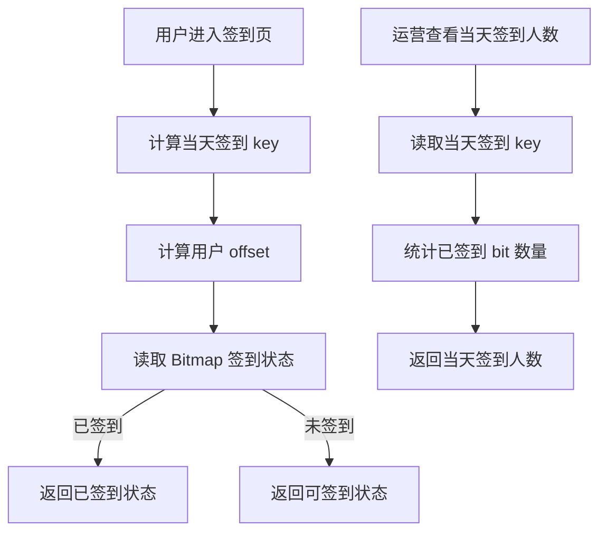
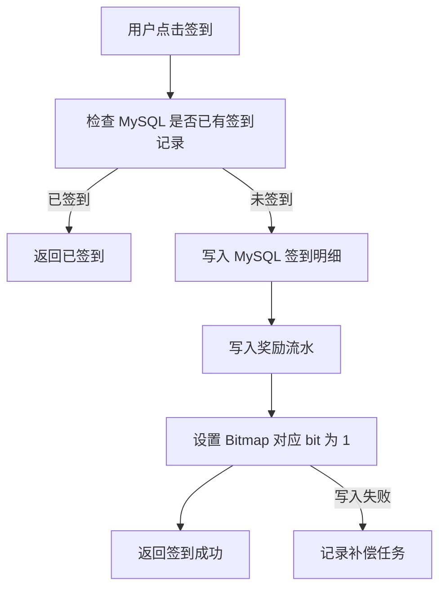
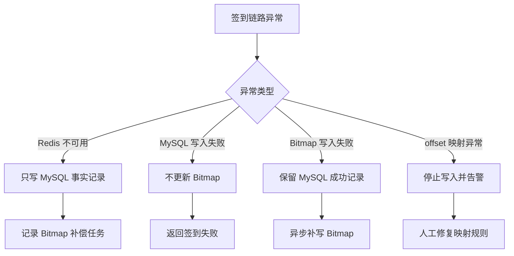
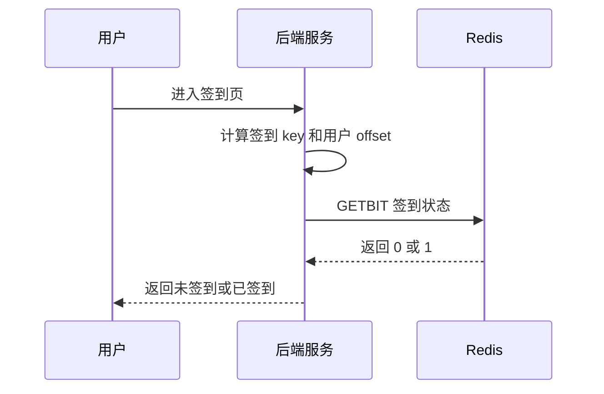
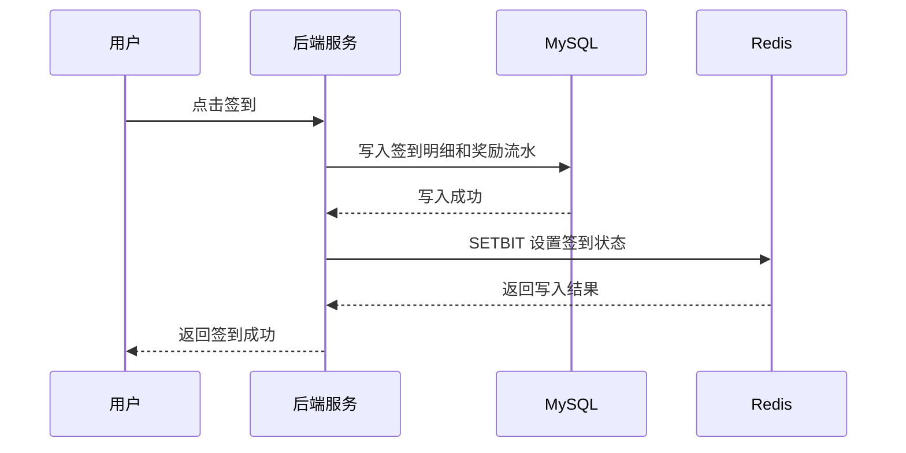
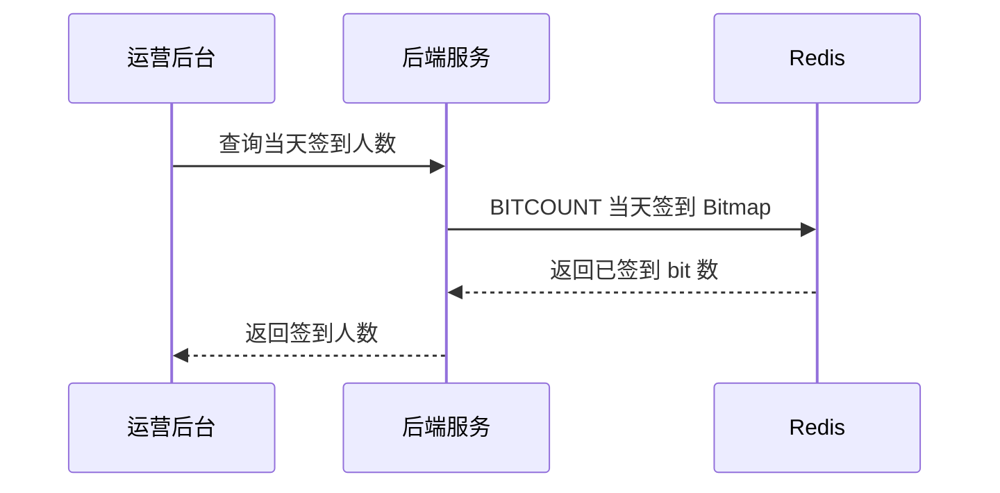

# Redis 知识点：Bitmaps

本次学习输入：

```text
知识点：Bitmaps
业务场景：每日签到状态记录
重点关注：类型选择边界：为什么每日签到适合 Bitmap，而不是 Set / MySQL 明细表直接查
```

---

## 1. 一句话结论

Redis Bitmaps 适合记录海量“是 / 否”状态，例如每日签到、是否活跃、是否完成。参考：[Redis 官方 Bitmaps 文档](https://redis.io/docs/latest/develop/data-types/strings/bitmaps/)

每日签到适合 Bitmap 的核心原因是：签到状态本质是 0/1 布尔值，用一个 bit 就能表示一个用户某天是否签到。**标记：主观推断**

---

## 2. 这个知识点是什么？

Redis Bitmaps 不是一个独立数据类型，而是一组基于 String 的位操作能力。参考：[Redis 官方 SETBIT 文档](https://redis.io/docs/latest/commands/setbit/)

可以把一个 Redis String 看成一串 bit：

```text
signin:2026-07-05

offset 0  -> user 0 是否签到
offset 1  -> user 1 是否签到
offset 2  -> user 2 是否签到
offset 10001 -> user 10001 是否签到
```

每个 bit 只有两个状态：

```text
0 = 未签到
1 = 已签到
```

所以 Bitmap 最适合表达“是否发生过”的布尔状态。**标记：主观推断**

---

## 3. 它解决什么业务问题？

| 业务问题          | 具体表现                                   | Redis 如何解决                                                                                              |
| ------------- | -------------------------------------- | ------------------------------------------------------------------------------------------------------- |
| 海量用户签到状态存储成本高 | 如果每天几百万用户签到，用 MySQL 明细直接做高频状态判断和统计成本较高 | Bitmap 用 1 个 bit 表示一个用户当天是否签到。**标记：主观推断**                                                               |
| 查询用户今天是否签到频繁  | 首页、任务页、活动页都可能需要展示“今日是否已签到”             | `GETBIT` 可以读取指定 offset 的 bit 值。参考：[Redis 官方 GETBIT 文档](https://redis.io/docs/latest/commands/getbit/)   |
| 写入签到状态要轻量     | 用户点击签到时，只需要标记“已签到”                     | `SETBIT` 可以把指定 offset 设置为 1。参考：[Redis 官方 SETBIT 文档](https://redis.io/docs/latest/commands/setbit/)      |
| 统计当天签到人数      | 活动后台或运营页面需要看当天签到人数                     | `BITCOUNT` 可以统计值为 1 的 bit 数量。参考：[Redis 官方 BITCOUNT 文档](https://redis.io/docs/latest/commands/bitcount/) |
| 需要区分缓存状态和事实记录 | 补签、撤销、奖励、审计不能只靠 0/1 状态                 | Bitmap 做状态加速，MySQL 明细表做事实源。**标记：主观推断**                                                                  |

---

## 4. Redis 为什么适合？

| Redis 能力                   | 对应业务价值              | 证据 / 标记                                                                                    |
| -------------------------- | ------------------- | ------------------------------------------------------------------------------------------ |
| Bitmap 能用 bit 表示状态         | 一个用户某天是否签到，只需要 0/1  | 参考：[Redis 官方 Bitmaps 文档](https://redis.io/docs/latest/develop/data-types/strings/bitmaps/) |
| `SETBIT` 设置指定 offset 的 bit | 用户签到时，把对应 bit 设置为 1 | 参考：[Redis 官方 SETBIT 文档](https://redis.io/docs/latest/commands/setbit/)                     |
| `GETBIT` 读取指定 offset 的 bit | 查询用户今天是否已签到         | 参考：[Redis 官方 GETBIT 文档](https://redis.io/docs/latest/commands/getbit/)                     |
| `BITCOUNT` 统计值为 1 的 bit 数量 | 统计当天签到人数            | 参考：[Redis 官方 BITCOUNT 文档](https://redis.io/docs/latest/commands/bitcount/)                 |
| Bitmap 存储紧凑                | 适合海量布尔状态            | **标记：主观推断**                                                                                |
| Redis 内存访问适合高频状态判断         | 签到页、任务页可以快速判断状态     | **标记：主观推断**                                                                                |

注意：这里不是因为 Redis “快”就适合，而是因为签到状态的业务模型刚好是 **大量用户 + 简单 0/1 状态 + 高频查询 / 统计**。**标记：主观推断**

---

## 5. 它的边界是什么？

| 边界              | 说明                                 | 更合适的选择                         |
| --------------- | ---------------------------------- | ------------------------------ |
| 不适合复杂签到过程       | Bitmap 只能表达 0/1，不能表达签到时间、补签原因、奖励状态 | MySQL 明细表。**标记：主观推断**          |
| 不能替代 MySQL 事实源  | 签到涉及奖励、补签、客服排查、审计时，需要可追溯记录         | MySQL。**标记：主观推断**              |
| offset 设计必须稳定   | userId 到 offset 的映射一旦变化，历史数据就难解释   | 固定映射规则 / 映射表。**标记：主观推断**       |
| userId 过大可能浪费空间 | Bitmap 会按最大 offset 扩展，中间空洞也会占空间    | 压缩映射 / Set / MySQL。**标记：主观推断** |
| 不适合表达多状态        | 未签到、已签到、补签、异常、撤销不是 0/1 能完整表达的      | Hash / MySQL 状态字段。**标记：主观推断**  |

核心边界：**Bitmap 适合布尔状态，不适合业务事实明细。** **标记：主观推断**

---

## 6. 常见坑是什么？

| 常见坑                 | 线上风险                         | 规避方式                                   |
| ------------------- | ---------------------------- | -------------------------------------- |
| 把 Bitmap 当签到事实源     | 后续无法解释用户什么时候签到、是否补签、奖励是否发放   | MySQL 保留签到明细，Bitmap 只做状态加速。**标记：主观推断** |
| offset 直接用超大 userId | userId 稀疏或过大时，Bitmap 可能被撑大   | 做连续 ID 映射，或评估是否改用 Set。**标记：主观推断**      |
| key 维度设计混乱          | 按天、按月、按活动混用，后续统计困难           | 提前固定 key 维度，例如按天一个 key。**标记：主观推断**     |
| 只记录 Bitmap，不记录奖励流水  | 用户签到后发奖失败无法复查                | 签到、奖励、补偿分别落 MySQL。**标记：主观推断**          |
| 大 Bitmap 统计成本被忽略    | 用户规模很大时，`BITCOUNT` 全量统计也会有成本 | 分段统计、异步统计、缓存统计结果。**标记：主观推断**           |
| 业务含义变化              | 原本 1 表示已签到，后来又想表达补签，历史数据无法兼容 | 0/1 含义必须稳定，多状态另建结构。**标记：主观推断**         |

---

## 7. MySQL / Set / Hash / 其他方案是否更合适？

| 方案                   | 是否适合         | 原因                                              |
| -------------------- | ------------ | ----------------------------------------------- |
| MySQL 明细表            | 必须保留事实源      | 适合保存签到时间、补签、奖励、审计、客服排查记录。**标记：主观推断**            |
| Redis Bitmap         | 适合做高频状态判断和统计 | 适合“某天某用户是否签到”这种 0/1 状态。**标记：主观推断**              |
| Redis Set            | 部分适合         | Set 可以存已签到 userId，语义清晰，但大规模场景内存可能更高。**标记：主观推断** |
| Redis Hash           | 不太适合主方案      | Hash 更适合对象字段状态，不适合海量用户布尔状态压缩。**标记：主观推断**        |
| Redis String 普通 JSON | 不适合          | 把大量用户签到状态塞进 JSON，会造成大 Key 和局部更新困难。**标记：主观推断**   |
| 本地缓存                 | 不适合作为主方案     | 签到状态需要跨实例一致，本地缓存更适合短暂兜底。**标记：主观推断**             |

最终判断：**MySQL 保存签到事实，Redis Bitmap 保存高频状态视图；Bitmap 负责快，MySQL 负责可追溯。** **标记：主观推断**

---

## 8. 具体业务场景例子

### 8.1 场景背景

业务有一个每日签到功能。

用户每天可以签到一次，签到后可能获得积分、金币、经验或活动奖励。

后端需要支持：

* 用户点击签到。
* 查询用户今天是否已签到。
* 展示当天签到人数。
* 判断用户是否连续签到。
* 支持补签、撤销、奖励补偿、客服排查。

其中，“今天是否已签到”和“当天签到人数”是典型高频状态查询；“签到时间、奖励、补签、审计”是事实记录。**标记：主观推断**

---

### 8.2 业务问题

* 每天大量用户签到，需要低成本记录“是否签到”。**标记：主观推断**
* 首页、任务页、活动页都可能频繁查询“今天是否已签到”。**标记：主观推断**
* 运营后台可能需要快速看到当天签到人数。**标记：主观推断**
* 签到奖励涉及业务正确性，不能只依赖 Redis。**标记：主观推断**
* 补签、撤销、客服排查需要 MySQL 明细记录。**标记：主观推断**

---

### 8.3 Redis 设计

```text
Redis key:
signin:daily:{yyyyMMdd}

Redis value:
Bitmap

offset:
userId 映射后的连续整数 offset

bit 含义:
0 = 当天未签到
1 = 当天已签到

TTL:
保留 30 天 / 90 天 / 180 天，按业务查询周期决定

MySQL:
签到明细表、奖励流水表、补签记录表、用户积分流水表

降级:
Redis 不可用时，签到写入仍以 MySQL 为准；签到状态展示可以回源 MySQL 或提示稍后刷新
```

* 按天设计 key 可以让当天签到人数统计更直接。**标记：主观推断**
* offset 不建议无脑直接使用超大 userId，需要评估 userId 是否连续、是否稀疏。**标记：主观推断**
* Bitmap 只保存 0/1 状态，签到时间、奖励状态、补签原因放 MySQL。**标记：主观推断**
* TTL 要按业务是否需要历史签到状态查询决定。**标记：主观推断**

---

### 8.4 读流程



说明：

* 查询用户今天是否签到，可以使用 `GETBIT` 读取指定 offset 的 bit。参考：[Redis 官方 GETBIT 文档](https://redis.io/docs/latest/commands/getbit/)
* 统计当天签到人数，可以使用 `BITCOUNT` 统计值为 1 的 bit 数量。参考：[Redis 官方 BITCOUNT 文档](https://redis.io/docs/latest/commands/bitcount/)
* 如果 `GETBIT` 返回 0，只能说明 Bitmap 视角下未签到，最终是否存在异常补偿记录仍要看 MySQL。**标记：主观推断**
* 当天签到人数可以用 Bitmap 快速统计，但活动结算人数仍建议以 MySQL 事实记录校验。**标记：主观推断**
* Redis 查询失败时，可以回源 MySQL 查询用户当天签到明细，但需要控制回源压力。**标记：主观推断**

---

### 8.5 写流程



说明：

* 用户签到时，可以使用 `SETBIT` 把指定 offset 设置为 1。参考：[Redis 官方 SETBIT 文档](https://redis.io/docs/latest/commands/setbit/)
* 签到事实应先写 MySQL 明细，再更新 Redis Bitmap 状态。**标记：主观推断**
* MySQL 需要唯一约束防止同一用户同一天重复签到。**标记：主观推断**
* Redis Bitmap 写失败时，不能否定 MySQL 中已经成功的签到事实，应记录补偿任务。**标记：主观推断**
* 如果业务允许 Redis 作为前置快速判断，也必须用 MySQL 唯一约束做最终防线。**标记：主观推断**

---

### 8.6 异常处理



说明：

* Redis 不可用时，签到事实仍应以 MySQL 写入结果为准。**标记：主观推断**
* MySQL 写入失败时，不应更新 Bitmap，否则会出现 Redis 显示已签到但事实不存在。**标记：主观推断**
* Bitmap 写入失败时，可以通过 MySQL 签到明细异步补偿。**标记：主观推断**
* offset 映射异常是严重问题，因为它可能导致用户签到状态错位。**标记：主观推断**
* 如果用户 ID 映射规则变更，需要考虑历史 Bitmap 数据迁移或版本化 key。**标记：主观推断**

---

### 8.7 监控指标

| 指标                              | 作用                    |
| ------------------------------- | --------------------- |
| Redis QPS                       | 观察签到状态读写压力            |
| `GETBIT` 调用量                    | 判断签到状态查询频率            |
| `SETBIT` 调用量                    | 判断签到写入频率              |
| `BITCOUNT` 调用量和耗时               | 判断统计是否过于频繁或 Bitmap 过大 |
| keyspace_hits / keyspace_misses | 观察签到 Bitmap 查询命中情况    |
| used_memory                     | 判断 Bitmap 总体内存占用      |
| evicted_keys                    | 判断是否有签到 key 被淘汰       |
| MySQL 签到写入量                     | 对比 Redis 写入是否异常       |
| Redis / MySQL 签到数量差异            | 发现 Bitmap 和事实源不一致     |
| Bitmap 补偿任务数量                   | 判断 Redis 写入失败或异步补偿压力  |

---

## 9. Mermaid 图

### 9.1 签到状态查询流程



### 9.2 用户签到写入流程



### 9.3 当天签到人数统计流程



---

## 10. 工程评审关注点

| 关注点                   | 说明                                                   |
| --------------------- | ---------------------------------------------------- |
| 为什么每日签到适合 Bitmap？     | 因为每日签到天然是用户维度的 0/1 状态，Bitmap 空间效率高。**标记：主观推断**       |
| 为什么不用 Set？            | Set 语义更直接，但大规模用户下内存可能更高；Bitmap 更适合压缩布尔状态。**标记：主观推断** |
| 为什么不能只用 Bitmap？       | Bitmap 不能记录签到时间、奖励、补签、审计，所以不能替代 MySQL 明细。**标记：主观推断** |
| offset 怎么设计？          | 必须稳定、可控、可解释，不能随意变化。**标记：主观推断**                       |
| Redis 和 MySQL 不一致怎么办？ | 以 MySQL 为准，通过补偿任务修复 Bitmap。**标记：主观推断**               |
| Redis 挂了怎么办？          | 签到写入仍走 MySQL，Bitmap 后续补偿。**标记：主观推断**                 |
| 大 Bitmap 怎么处理？        | 关注 offset 上限、key 维度、`BITCOUNT` 频率和内存占用。**标记：主观推断**   |
| 补签和撤销怎么处理？            | 事实变更写 MySQL，再同步调整 Bitmap；复杂规则不要只靠 0/1。**标记：主观推断**    |
| 如何防重复签到？              | MySQL 唯一约束作为最终防线，Redis 只能做前置状态判断。**标记：主观推断**         |
| 哪些数据必须落库？             | 签到明细、奖励流水、补签记录、积分变化、审计记录必须落 MySQL。**标记：主观推断**        |

---

## 11. 最终记忆点

1. Bitmap 适合海量 0/1 状态，不适合复杂业务过程。
2. 每日签到可以用 Bitmap 做高频状态判断和统计，但事实记录必须落 MySQL。
3. Bitmap 方案成败的关键不是 `SETBIT / GETBIT`，而是 offset 设计是否稳定。
4. Redis 负责快，MySQL 负责准；两者不一致时以 MySQL 为准。
5. 只要涉及补签、奖励、审计、客服排查，就不能只靠 Bitmap。

---

## 12. 参考资料

1. [Redis 官方 Bitmaps 文档](https://redis.io/docs/latest/develop/data-types/strings/bitmaps/)：用于确认 Bitmap 的空间优势、`SETBIT / GETBIT / BITCOUNT` 等能力。
2. [Redis 官方 SETBIT 文档](https://redis.io/docs/latest/commands/setbit/)：用于确认设置指定 offset bit 的能力，以及 offset 范围和扩展行为。
3. [Redis 官方 GETBIT 文档](https://redis.io/docs/latest/commands/getbit/)：用于确认读取指定 offset bit 的能力。
4. [Redis 官方 BITCOUNT 文档](https://redis.io/docs/latest/commands/bitcount/)：用于确认统计值为 1 的 bit 数量，以及大 Bitmap 的统计注意点。
5. [Redis GitHub Releases](https://github.com/redis/redis/releases)：用于确认 Redis 8.8.0 版本相关信息。
