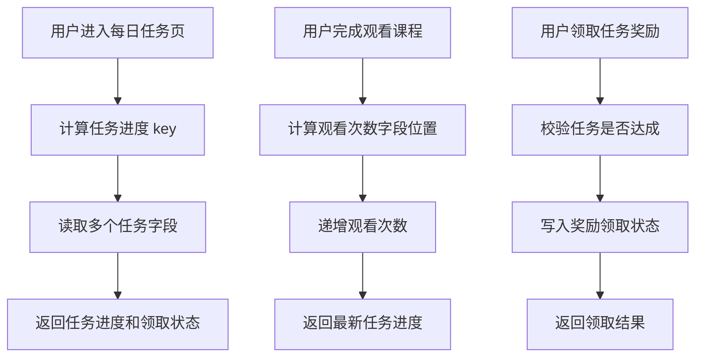

# 第 5 章：Bitfields：适合在字符串里高效编码多个小整数计数器

## 1. 本章一句话

Redis Bitfields 适合把多个小范围整数状态压缩存进一个 Redis String，例如每日任务的观看次数、答题次数、分享次数、奖励领取状态。参考：[Redis 官方 Bitfields 文档](https://redis.io/docs/latest/develop/data-types/strings/bitfields/)

核心判断：Bitfields 的价值不是“更高级的 Bitmap”，而是在一个 String 里用固定 bit 宽度编码多个小整数，适合状态字段多、数值范围小、访问频率高的场景。**标记：主观推断**

---

## 2. 适合解决什么问题？


| 场景        | 为什么适合                                                                                                                         |
| --------- | ----------------------------------------------------------------------------------------------------------------------------- |
| 用户每日任务进度  | 多个任务进度通常是小整数，例如观看 0~~10 节、答题 0~~20 次、分享 0~5 次。**标记：主观推断**                                                                     |
| 游戏活动小计数器  | 今日挑战次数、剩余次数、连胜次数、领取状态都可以用小整数表达。**标记：主观推断**                                                                                    |
| 用户轻量状态位   | 多个小范围状态可以编码在同一个 String 中，减少 key 数量。**标记：主观推断**                                                                                |
| 风控短期状态字段  | 风险等级、限制次数、状态位可以压缩保存，但要注意可读性。**标记：主观推断**                                                                                       |
| 多个计数器原子操作 | `BITFIELD` 支持在一次调用中对多个 bit field 执行 GET、SET、INCRBY。参考：[Redis 官方 BITFIELD 文档](https://redis.io/docs/latest/commands/bitfield/) |


---


## 3. 主案例

```text
主案例：用户每日任务进度压缩记录

核心原因：
每日任务通常包含多个小范围计数字段，例如登录状态、观看课程数、答题次数、分享次数、奖励领取状态。如果每个字段都单独用一个 String key，key 数量和管理成本会变高；如果用 JSON，可读性更好但空间和局部更新不如 Bitfields 紧凑。**标记：主观推断**
```

辅助案例：

- 游戏活动小计数器：适合记录今日挑战次数、剩余次数、连胜次数，重点关注溢出边界。
- 用户状态位压缩：适合记录多个小范围状态，重点关注字段含义长期稳定。
- 风控轻量状态字段：适合短期状态压缩，重点关注可解释性和审计边界。

---


## 4. 核心流程




说明：

- `BITFIELD GET` 可以读取指定 bit 宽度和 offset 的整数值。参考：[Redis 官方 BITFIELD 文档](https://redis.io/docs/latest/commands/bitfield/)
- `BITFIELD INCRBY` 可以对指定 bit field 做递增，适合任务进度计数。参考：[Redis 官方 BITFIELD 文档](https://redis.io/docs/latest/commands/bitfield/)
- `BITFIELD SET` 可以写入指定 bit field，适合记录奖励是否领取、任务状态等小整数。参考：[Redis 官方 BITFIELD 文档](https://redis.io/docs/latest/commands/bitfield/)
- 每个字段的 bit 宽度必须提前设计，例如观看次数 4 bit、答题次数 5 bit、领取状态 1 bit。**标记：主观推断**
- Bitfields 适合压缩任务进度展示状态，但奖励流水、任务完成事实、补偿记录仍建议落 MySQL。**标记：主观推断**

---


## 5. 关键命令


| 命令                | 作用                                                                                                  |
| ----------------- | --------------------------------------------------------------------------------------------------- |
| `BITFIELD GET`    | 读取用户每日任务中的多个小整数进度。参考：[Redis 官方 BITFIELD 文档](https://redis.io/docs/latest/commands/bitfield/)        |
| `BITFIELD SET`    | 写入任务状态，例如奖励是否已领取。参考：[Redis 官方 BITFIELD 文档](https://redis.io/docs/latest/commands/bitfield/)         |
| `BITFIELD INCRBY` | 递增任务计数，例如观看课程数、答题次数、分享次数。参考：[Redis 官方 BITFIELD 文档](https://redis.io/docs/latest/commands/bitfield/) |
| `OVERFLOW`        | 控制递增发生溢出时的行为，避免小整数超出设计范围。参考：[Redis 官方 BITFIELD 文档](https://redis.io/docs/latest/commands/bitfield/) |


---


## 6. 边界和坑


| 问题             | 说明                                                       |
| -------------- | -------------------------------------------------------- |
| 字段设计复杂         | Bitfields 需要提前设计 bit 宽度和 offset，一旦上线后修改成本高。**标记：主观推断**   |
| 可读性差           | 相比 Hash / JSON，Bitfields 对排查问题不直观，需要配套字段说明文档。**标记：主观推断** |
| 容易溢出           | 小整数字段如果 bit 宽度设计太小，计数超过上限会出现溢出风险。**标记：主观推断**             |
| 不适合复杂对象        | 如果任务进度包含时间、来源、奖励明细、失败原因，Bitfields 不适合完整表达。**标记：主观推断**    |
| 不能替代 MySQL 事实源 | 任务完成记录、奖励发放流水、补偿记录仍应以 MySQL 为准。**标记：主观推断**               |


---


## 7. 本章记忆点

1. Bitfields 适合多个小范围整数，不适合复杂业务对象。
2. Bitfields 的关键不是命令，而是 bit 宽度、offset 和溢出边界设计。
3. Redis Bitfields 适合做高频状态压缩，MySQL 仍负责事实记录和可追溯性。

