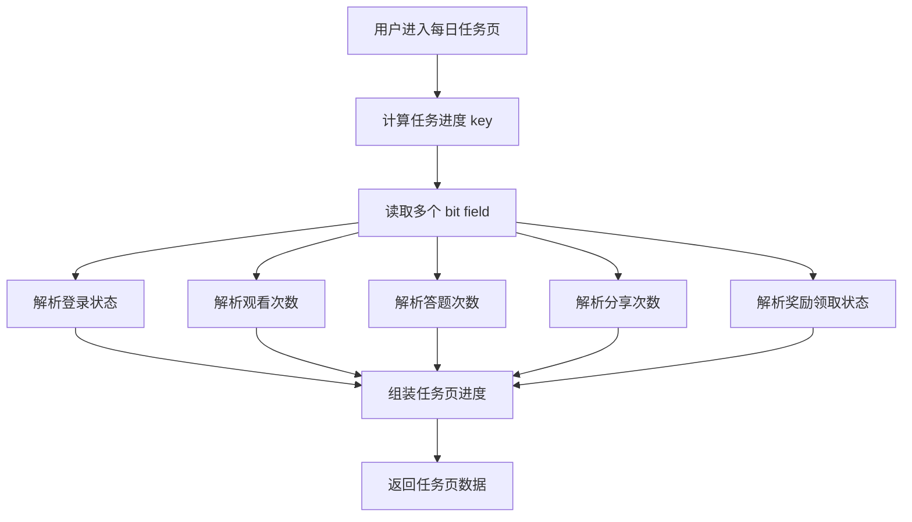
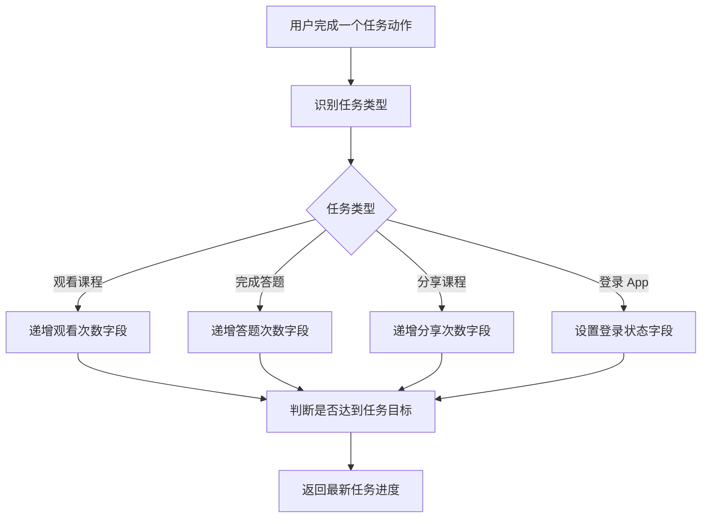
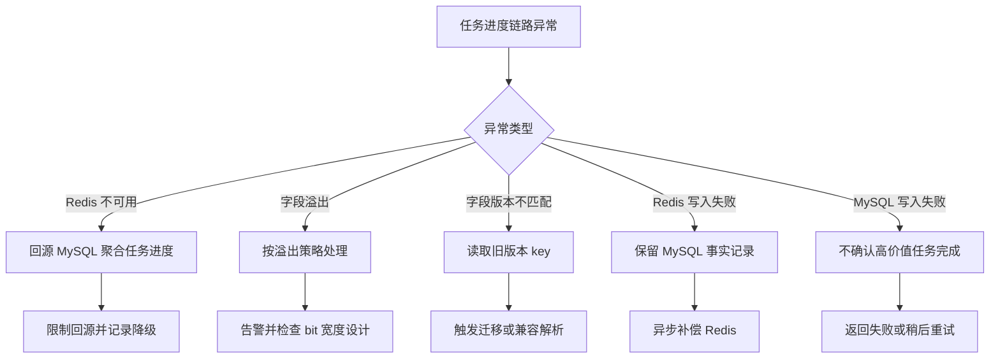
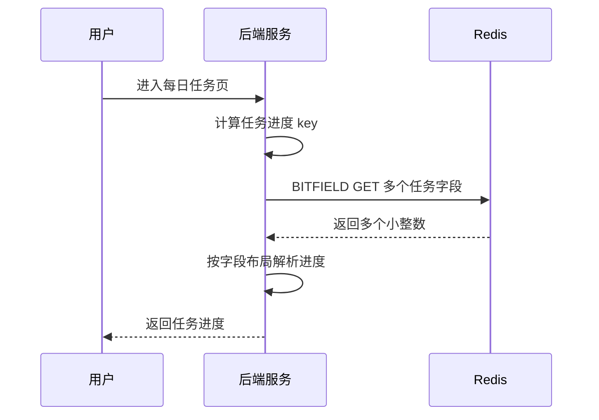
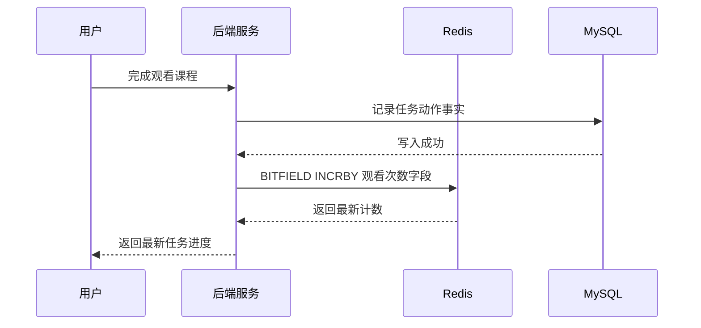
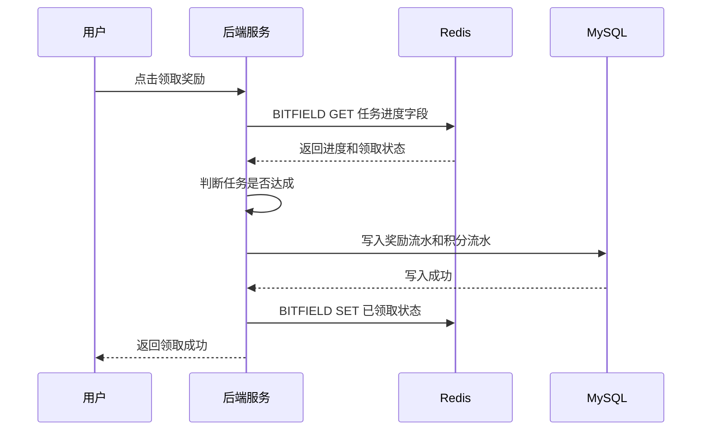
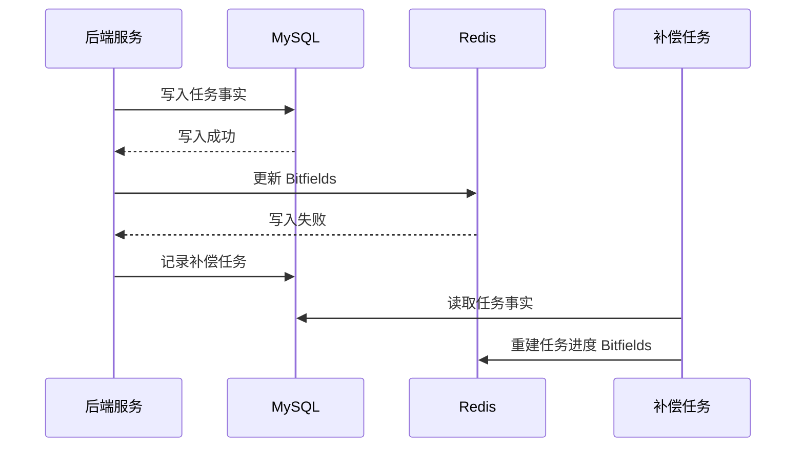

# Redis 知识点：Bitfields

本次学习输入：

```text
知识点：Bitfields
业务场景：用户每日任务进度压缩记录
重点关注：类型选择边界：为什么每日任务进度适合 Bitfields，而不是 Hash / JSON / 多个 String 计数器
```

---

## 1. 一句话结论

Redis Bitfields 适合把多个小范围整数计数器压缩存进一个 Redis String，例如每日任务中的观看次数、答题次数、分享次数、领取状态。参考：[Redis 官方 Bitfields 文档](https://redis.io/docs/latest/develop/data-types/strings/bitfields/)

Bitfields 适合的前提是：字段数量较多、每个字段范围很小、字段含义稳定、读写频率较高；否则 Hash / JSON / MySQL 明细会更容易维护。**标记：主观推断**

---

## 2. 这个知识点是什么？

Redis Bitfields 是 Redis 基于 String 提供的一组 bit 级整数编码能力，可以在一个二进制编码的 String 中读、写、递增不同 bit 宽度的整数值。参考：[Redis 官方 Bitfields 文档](https://redis.io/docs/latest/develop/data-types/strings/bitfields/)

可以简单理解为：把一个 String 拆成多个固定长度的小字段，每个字段存一个小整数。

例如用户每日任务进度可以设计成：

```text
key:
task:daily:progress:20260705:{userId}

字段布局：
offset 0   ~ 0   ：是否登录，1 bit，0/1
offset 1   ~ 4   ：观看课程数，4 bit，0~15
offset 5   ~ 9   ：答题次数，5 bit，0~31
offset 10  ~ 12  ：分享次数，3 bit，0~7
offset 13  ~ 13  ：是否领取奖励，1 bit，0/1
```

它和 Bitmap 的区别是：

| 对比项    | Bitmap         | Bitfields      |
| ------ | -------------- | -------------- |
| 核心用途   | 记录 0/1 布尔状态    | 记录多个小整数        |
| 单个字段含义 | 一个 bit 表示是否发生  | 多个 bit 表示一个整数  |
| 典型场景   | 是否签到、是否活跃、是否完成 | 次数、等级、状态位、小计数器 |
| 复杂度    | 相对简单           | 更依赖字段编码设计      |

所以 Bitfields 不是“更高级的 Bitmap”，而是“在 String 里压缩多个小整数计数器”。**标记：主观推断**

---

## 3. 它解决什么业务问题？

| 业务问题                | 具体表现                            | Redis 如何解决                                                                                                                    |
| ------------------- | ------------------------------- | ----------------------------------------------------------------------------------------------------------------------------- |
| 每日任务字段多             | 登录、观看、答题、分享、领取状态都要记录            | Bitfields 可以把多个小字段压缩到一个 String。参考：[Redis 官方 Bitfields 文档](https://redis.io/docs/latest/develop/data-types/strings/bitfields/) |
| 任务进度读写频繁            | 用户每次进入任务页都要查询进度，完成任务后要更新计数      | `BITFIELD GET / SET / INCRBY` 支持读、写、递增整数值。参考：[Redis 官方 BITFIELD 文档](https://redis.io/docs/latest/commands/bitfield/)          |
| 多个 String key 管理成本高 | 每个用户每天每个任务一个 key，会造成 key 数量膨胀   | 多个计数字段可以合并到一个 Redis String。**标记：主观推断**                                                                                        |
| JSON 可读但不够紧凑        | JSON 适合表达复杂对象，但字段较多时空间和局部更新成本更高 | Bitfields 用固定 bit 宽度保存小整数，更紧凑。**标记：主观推断**                                                                                     |
| MySQL 高频更新压力大       | 每完成一次观看、答题、分享都更新 MySQL，写压力可能偏高  | Redis 记录高频进度，MySQL 保存任务事实和最终结果。**标记：主观推断**                                                                                    |

核心业务问题不是“怎么省一点内存”，而是：**当一个用户每天有多个小范围任务计数器时，如何用低成本方式支持高频读写。** **标记：主观推断**

---

## 4. Redis 为什么适合？

| Redis 能力                    | 对应业务价值                                  | 证据 / 标记                                                                                        |
| --------------------------- | --------------------------------------- | ---------------------------------------------------------------------------------------------- |
| Bitfields 存储在二进制编码 String 中 | 可以把多个小计数器压缩到一个 String                   | 参考：[Redis 官方 Bitfields 文档](https://redis.io/docs/latest/develop/data-types/strings/bitfields/) |
| 支持任意 bit 长度整数               | 可以按任务字段范围设计 1 bit、3 bit、4 bit、5 bit 等宽度 | 参考：[Redis 官方 Bitfields 文档](https://redis.io/docs/latest/develop/data-types/strings/bitfields/) |
| `BITFIELD GET`              | 读取任务进度字段                                | 参考：[Redis 官方 BITFIELD 文档](https://redis.io/docs/latest/commands/bitfield/)                     |
| `BITFIELD SET`              | 写入任务状态字段，例如是否已领取                        | 参考：[Redis 官方 BITFIELD 文档](https://redis.io/docs/latest/commands/bitfield/)                     |
| `BITFIELD INCRBY`           | 递增观看次数、答题次数、分享次数                        | 参考：[Redis 官方 BITFIELD 文档](https://redis.io/docs/latest/commands/bitfield/)                     |
| `OVERFLOW`                  | 控制递增超出字段范围时的行为                          | 参考：[Redis 官方 BITFIELD 文档](https://redis.io/docs/latest/commands/bitfield/)                     |
| 一次命令可操作多个 bit field         | 任务页可以一次读取多个任务字段                         | 参考：[Redis 官方 BITFIELD 文档](https://redis.io/docs/latest/commands/bitfield/)                     |

Redis 适合这里，不是因为“Redis 快”这句空话，而是因为 Bitfields 的结构刚好匹配 **多个小整数 + 高频读写 + 字段范围固定** 的业务模型。**标记：主观推断**

---

## 5. 它的边界是什么？

| 边界      | 说明                                     | 更合适的选择                         |
| ------- | -------------------------------------- | ------------------------------ |
| 字段含义不稳定 | 如果任务字段经常新增、删除、调整范围，Bitfields 迁移成本高     | Hash / JSON。**标记：主观推断**        |
| 字段需要可读性 | 排查问题时，Hash / JSON 比二进制编码更直观            | Hash / JSON。**标记：主观推断**        |
| 数值范围不确定 | 如果观看次数、答题次数可能不断变大，bit 宽度容易不够           | String 计数器 / MySQL。**标记：主观推断** |
| 需要复杂对象  | 如果要保存任务完成时间、来源、奖励详情、失败原因，Bitfields 不适合 | MySQL 明细表 / JSON。**标记：主观推断**   |
| 需要事实可追溯 | 奖励领取、积分发放、补偿记录不能只靠 Redis               | MySQL。**标记：主观推断**              |

核心边界：**Bitfields 适合小整数状态压缩，不适合复杂业务事实存储。** **标记：主观推断**

---

## 6. 常见坑是什么？

| 常见坑            | 线上风险                      | 规避方式                                     |
| -------------- | ------------------------- | ---------------------------------------- |
| bit 宽度设计太小     | 任务计数超过上限，出现溢出或错误计数        | 设计前估算最大值，配置 `OVERFLOW` 策略。**标记：主观推断**    |
| offset 文档缺失    | 线上排查时没人知道某段 bit 表示什么      | 必须维护字段布局文档和版本号。**标记：主观推断**               |
| 字段变更没有版本化      | 新旧字段布局混用，历史数据解释错误         | key 中加入版本，例如 `v1 / v2`。**标记：主观推断**       |
| 把奖励事实只存在 Redis | Redis 丢失或被淘汰后，奖励发放无法追溯    | 奖励流水、任务完成记录必须落 MySQL。**标记：主观推断**         |
| 过度追求压缩         | 数据虽然省内存，但研发理解和维护成本变高      | 只有数据量大、字段稳定、性能收益明确时再用。**标记：主观推断**        |
| 忽略溢出策略         | `INCRBY` 超过字段范围时行为不符合业务预期 | 明确使用 WRAP / SAT / FAIL，并写进设计。**标记：主观推断** |

---

## 7. MySQL / Hash / JSON / 多个 String 是否更合适？

| 方案              | 是否适合          | 原因                                    |
| --------------- | ------------- | ------------------------------------- |
| MySQL           | 必须保留事实源       | 适合保存任务完成记录、奖励流水、补偿记录、审计记录。**标记：主观推断** |
| Redis Bitfields | 适合做高频任务进度压缩状态 | 多个小整数、字段稳定、读写频繁时很适合。**标记：主观推断**       |
| Redis Hash      | 更容易维护         | 字段名清晰，适合字段较少或更关注可读性的场景。**标记：主观推断**    |
| Redis JSON      | 适合复杂结构        | 适合任务对象结构复杂、字段层级多、可读性优先的场景。**标记：主观推断** |
| 多个 String 计数器   | 简单但 key 多     | 适合字段少、计数器独立、压缩收益不明显的场景。**标记：主观推断**    |
| 本地缓存            | 不适合作为主方案      | 任务进度跨实例共享，本地缓存只能做短暂兜底。**标记：主观推断**     |

最终判断：**Bitfields 只在“字段多、范围小、结构稳定、规模大”的场景下有明显价值；否则 Hash / JSON 更符合工程可维护性。** **标记：主观推断**

---

## 8. 具体业务场景例子

### 8.1 场景背景

业务有一个每日任务系统。

用户每天可以完成多个任务，例如：

```text
登录 App：0/1
观看课程：0~10 次
完成答题：0~20 次
分享课程：0~5 次
领取奖励：0/1
```

任务页需要频繁展示用户当前进度：

```text
今日已观看 3/10 节
今日已答题 8/20 道
今日已分享 1/5 次
奖励是否可领取
奖励是否已领取
```

如果每个任务进度都用单独 Redis key，key 数量会变多；如果全部用 JSON，结构直观但不够紧凑；如果每次都写 MySQL，任务进度高频更新可能增加数据库压力。**标记：主观推断**

---

### 8.2 业务问题

* 每个用户每天有多个小范围计数字段。**标记：主观推断**
* 用户进入任务页时需要一次读取多个进度字段。**标记：主观推断**
* 用户完成任务后需要高频递增某个字段。**标记：主观推断**
* 领取奖励时需要判断多个任务是否达标。**标记：主观推断**
* 奖励流水、任务完成事实、补偿记录不能只存在 Redis。**标记：主观推断**
* 字段编码一旦设计错，后续迁移和排查成本较高。**标记：主观推断**

---

### 8.3 Redis 设计

```text
Redis key:
task:daily:progress:v1:{yyyyMMdd}:{userId}

Redis value:
一个二进制编码 String，由多个 bit field 组成

字段布局：
offset 0,  u1  ：是否登录，0/1
offset 1,  u4  ：观看课程数，0~15
offset 5,  u5  ：答题次数，0~31
offset 10, u3  ：分享次数，0~7
offset 13, u1  ：是否领取奖励，0/1
offset 14, u2  ：奖励档位，0~3

TTL:
保留 30 天 / 90 天，按任务回看、补偿、运营统计周期决定

MySQL:
任务完成记录表
奖励流水表
用户积分流水表
补偿任务表

降级:
Redis 不可用时，读取可以回源 MySQL 聚合；写入以 MySQL 事实为准，Redis 后续补偿
```

设计说明：

* key 中加入 `v1`，用于字段布局升级。**标记：主观推断**
* 每个字段必须提前明确 bit 宽度、offset、最大值、默认值、溢出策略。**标记：主观推断**
* 任务进度可以放 Redis，奖励流水和积分变化必须落 MySQL。**标记：主观推断**
* TTL 不能随便设置，要看业务是否需要查询历史任务状态。**标记：主观推断**
* 如果字段经常变，优先不要用 Bitfields。**标记：主观推断**

---

### 8.4 读流程



说明：

* `BITFIELD GET` 可以读取指定 bit 宽度和 offset 的整数值。参考：[Redis 官方 BITFIELD 文档](https://redis.io/docs/latest/commands/bitfield/)
* 一次 `BITFIELD` 调用可以包含多个操作，适合一次读取多个任务字段。参考：[Redis 官方 BITFIELD 文档](https://redis.io/docs/latest/commands/bitfield/)
* 读取后需要由业务代码按字段布局解析每个字段含义。**标记：主观推断**
* 如果 Redis 未命中，可以从 MySQL 任务事实聚合重建 Redis 进度。**标记：主观推断**
* 如果字段布局版本不匹配，不能强行解析，应该按版本走兼容逻辑。**标记：主观推断**

---

### 8.5 写流程



说明：

* `BITFIELD INCRBY` 可以递增指定 bit field，适合观看次数、答题次数、分享次数这类小计数器。参考：[Redis 官方 BITFIELD 文档](https://redis.io/docs/latest/commands/bitfield/)
* `BITFIELD SET` 可以设置指定 bit field，适合登录状态、奖励领取状态。参考：[Redis 官方 BITFIELD 文档](https://redis.io/docs/latest/commands/bitfield/)
* 写入前必须确认字段最大值，避免递增超过 bit 宽度。**标记：主观推断**
* 如果任务动作涉及奖励、积分、权益，必须同步写 MySQL 事实记录。**标记：主观推断**
* Redis 写入失败时，不能丢失任务事实，应通过 MySQL 或消息补偿重建进度。**标记：主观推断**

---

### 8.6 异常处理



说明：

* `BITFIELD OVERFLOW` 可以控制递增溢出时的行为。参考：[Redis 官方 BITFIELD 文档](https://redis.io/docs/latest/commands/bitfield/)
* Redis 不可用时，任务页可以回源 MySQL 聚合，但必须限制回源压力。**标记：主观推断**
* MySQL 写入失败时，高价值任务完成和奖励发放不能只以 Redis 成功为准。**标记：主观推断**
* 字段版本不匹配时，需要兼容旧版本或触发数据迁移。**标记：主观推断**
* 溢出不是普通异常，通常说明 bit 宽度或业务上限设计有问题。**标记：主观推断**

---

### 8.7 监控指标

| 指标                    | 作用                       |
| --------------------- | ------------------------ |
| Redis QPS             | 观察每日任务进度读写压力             |
| `BITFIELD GET` 调用量    | 判断任务页读取频率                |
| `BITFIELD INCRBY` 调用量 | 判断任务进度更新频率               |
| `BITFIELD` 失败率        | 发现命令错误、字段布局错误、Redis 异常   |
| 溢出次数                  | 发现 bit 宽度设计不合理           |
| Redis P95 / P99 延迟    | 判断任务页是否受 Redis 延迟影响      |
| used_memory           | 观察 Bitfields 总内存占用       |
| evicted_keys          | 判断任务进度 key 是否被淘汰         |
| MySQL 回源次数            | 判断 Redis miss 或故障时的数据库压力 |
| Redis / MySQL 任务进度差异  | 发现缓存状态和事实源不一致            |
| 补偿任务堆积量               | 判断 Redis 写失败或异步补偿是否异常    |

---

## 9. Mermaid 图

### 9.1 任务页读取进度流程



### 9.2 任务进度递增流程



### 9.3 奖励领取流程



### 9.4 Redis 异常补偿流程



---

## 10. 工程评审关注点

| 关注点             | 说明                                                          |
| --------------- | ----------------------------------------------------------- |
| 为什么用 Bitfields？ | 因为每日任务有多个小范围整数状态，Bitfields 可以压缩存储并支持原子读写递增。**标记：主观推断**      |
| 为什么不用 Hash？     | Hash 可读性更好，但字段多、用户多、日期多时，空间和 key/value 管理成本可能更高。**标记：主观推断** |
| 为什么不用 JSON？     | JSON 更适合复杂对象，但小整数频繁局部更新时不如 Bitfields 紧凑。**标记：主观推断**         |
| 为什么不用多个 String？ | 多个 String 简单，但 key 数量会随着用户、日期、任务字段膨胀。**标记：主观推断**            |
| bit 宽度怎么定？      | 按业务最大值 + 未来增长空间设计，并明确溢出策略。**标记：主观推断**                       |
| 字段变更怎么办？        | 通过 key 版本化、兼容解析、异步迁移处理。**标记：主观推断**                          |
| Redis 数据丢了怎么办？  | 从 MySQL 任务事实和奖励流水重建。**标记：主观推断**                             |
| 哪些数据不能只放 Redis？ | 奖励流水、积分变化、任务完成事实、补偿记录、审计记录。**标记：主观推断**                      |
| 最大线上风险是什么？      | 字段设计错误、溢出、版本迁移失败、可读性差、Redis 和 MySQL 不一致。**标记：主观推断**         |
| 是否值得用？          | 只有在规模大、字段稳定、压缩收益明显时值得；否则 Hash / JSON 更稳。**标记：主观推断**         |

---

## 11. 最终记忆点

1. Bitfields 适合多个小范围整数，不适合复杂业务对象。
2. Bitfields 的核心不是命令，而是 bit 宽度、offset、版本和溢出设计。
3. 字段稳定、规模大、读写频繁时，Bitfields 才值得用。
4. Hash / JSON 更好维护，Bitfields 更省空间，但理解和迁移成本更高。
5. Redis 保存任务进度视图，MySQL 保存任务事实、奖励流水和审计记录。

---

## 12. 参考资料

1. [Redis 官方 Bitfields 文档](https://redis.io/docs/latest/develop/data-types/strings/bitfields/)：用于确认 Bitfields 可以在 Redis String 中设置、递增和读取任意 bit 长度整数值。
2. [Redis 官方 BITFIELD 文档](https://redis.io/docs/latest/commands/bitfield/)：用于确认 `GET / SET / INCRBY / OVERFLOW` 等命令能力，以及一次调用操作多个 bit field 的能力。
3. [Redis 官方 BITFIELD_RO 文档](https://redis.io/docs/latest/commands/bitfield_ro/)：用于确认只读场景下可以使用 `BITFIELD_RO` 读取 bit field。
4. [Redis 官方数据类型总览](https://redis.io/docs/latest/develop/data-types/)：用于确认 Bitfields 用于在 String value 中高效编码多个计数器，并支持原子 get、set、increment 和 overflow policies。
5. [Redis GitHub Releases](https://github.com/redis/redis/releases)：用于确认 Redis 8.8.0 版本相关信息。
