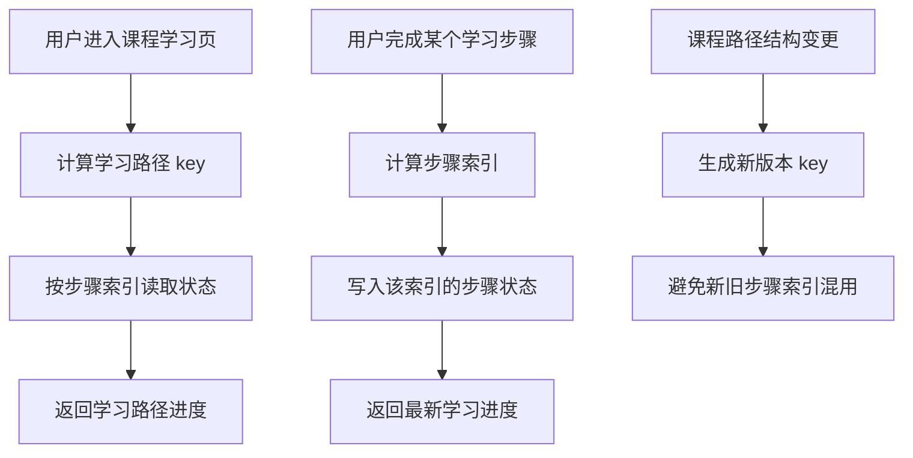

# 第 6 章：Arrays：适合稀疏、可按索引访问的字符串序列

## 1. 本章一句话

Redis Arrays 适合存储“按下标访问、位置含义固定、数据可能稀疏”的字符串序列，例如课程学习路径步骤状态。参考：[Redis 官方 Arrays 文档](https://redis.io/docs/latest/develop/data-types/arrays/)

核心判断：Arrays 适合“第 N 个位置有明确业务含义”的场景，不适合频繁插队、复杂排序、强事实记录或结构频繁变化的业务数据。**标记：主观推断**

---

## 2. 适合解决什么问题？

| 场景           | 为什么适合                                                                                                         |
| ------------ | ------------------------------------------------------------------------------------------------------------- |
| 用户课程学习路径步骤状态 | 第 0 步、第 1 步、第 N 步含义固定，可以按索引读写步骤状态。**标记：主观推断**                                                                 |
| 活动关卡进度数组     | 第 N 关状态、奖励状态、是否完成，天然适合按关卡索引访问。**标记：主观推断**                                                                     |
| 首页固定坑位配置     | Banner 位、推荐位、运营坑位是固定位置内容，可以按位置读取。**标记：主观推断**                                                                  |
| 用户任务步骤结果     | 第 N 个任务节点的结果状态可按索引保存，但任务事实仍要落 MySQL。**标记：主观推断**                                                               |
| 稀疏索引访问       | Arrays 支持直接按索引访问，未设置索引返回 nil。参考：[Redis 官方 Arrays 文档](https://redis.io/docs/latest/develop/data-types/arrays/) |

---

## 3. 主案例

```text
主案例：用户课程学习路径步骤状态

核心原因：
课程学习路径通常由固定步骤组成，例如第 0 步导学、第 1 步基础课、第 2 步练习、第 3 步测验；用户可能只完成了部分步骤，所以数据可能稀疏。Arrays 可以按步骤索引直接读写对应状态，比 List 更强调固定索引含义，比 Hash 更适合“位置就是业务语义”的场景。**标记：主观推断**
```

辅助案例：

* 活动关卡进度数组：适合按关卡编号读写状态，重点关注关卡版本变更。
* 首页固定坑位配置：适合按坑位索引读取内容，重点关注运营配置变更和缓存失效。
* 固定位置推荐结果缓存：适合短期缓存推荐位结果，重点关注排序变化和过期时间。

---

## 4. 核心流程



说明：

* `ARGET` 可以按索引读取 Arrays 中的单个值。参考：[Redis 官方 ARGET 文档](https://redis.io/docs/latest/commands/arget/)
* `ARMGET` 可以一次读取多个指定索引。参考：[Redis 官方 ARMGET 文档](https://redis.io/docs/latest/commands/armget/)
* `ARSET` 可以从指定索引开始写入连续值。参考：[Redis 官方 ARSET 文档](https://redis.io/docs/latest/commands/arset/)
* `ARMSET` 可以一次写入多个非连续索引。参考：[Redis 官方 ARMSET 文档](https://redis.io/docs/latest/commands/armset/)
* 学习路径步骤状态适合 Arrays 的前提是：索引含义稳定，且第 N 步长期代表同一个业务步骤。**标记：主观推断**
* 学习完成事实、考试结果、证书发放记录仍建议落 MySQL，Redis Arrays 只做高频读取状态视图。**标记：主观推断**
* Redis Arrays 当前处于 preview，正式生产使用前需要确认当前 Redis 8.8.0 部署版本、客户端支持和变更风险。参考：[Redis 官方 Arrays 文档](https://redis.io/docs/latest/develop/data-types/arrays/)

---

## 5. 关键命令

| 命令       | 作用                                                                                    |
| -------- | ------------------------------------------------------------------------------------- |
| `ARGET`  | 读取某个学习步骤的状态。参考：[Redis 官方 ARGET 文档](https://redis.io/docs/latest/commands/arget/)      |
| `ARMGET` | 一次读取多个学习步骤状态。参考：[Redis 官方 ARMGET 文档](https://redis.io/docs/latest/commands/armget/)   |
| `ARSET`  | 初始化或连续写入学习路径步骤状态。参考：[Redis 官方 ARSET 文档](https://redis.io/docs/latest/commands/arset/) |
| `ARMSET` | 更新多个非连续步骤状态。参考：[Redis 官方 ARMSET 文档](https://redis.io/docs/latest/commands/armset/)    |
| `ARDEL`  | 删除指定索引的步骤状态。参考：[Redis 官方 ARDEL 文档](https://redis.io/docs/latest/commands/ardel/)      |

---

## 6. 边界和坑

| 问题             | 说明                                                                                                                              |
| -------------- | ------------------------------------------------------------------------------------------------------------------------------- |
| 仍处于 preview    | Redis 官方说明 Arrays 当前处于 preview，可能变化，生产使用前要谨慎评估。参考：[Redis 官方 Arrays 文档](https://redis.io/docs/latest/develop/data-types/arrays/) |
| 索引含义不能乱变       | 如果第 2 步原来是练习，后来变成测验，历史状态会被错误解释。**标记：主观推断**                                                                                      |
| 不适合频繁插入重排      | 如果学习路径经常插入、删除、排序变化，固定索引会变成维护负担。**标记：主观推断**                                                                                      |
| 不能替代 MySQL 事实源 | 学习完成、考试通过、证书发放、权益解锁必须有 MySQL 事实记录。**标记：主观推断**                                                                                   |
| 稀疏不等于无限乱用      | 虽然 Arrays 支持稀疏索引，但超大索引、混乱索引会增加理解和维护成本。**标记：主观推断**                                                                               |

---

## 7. 本章记忆点

1. Arrays 适合“按索引访问、位置含义固定、数据可能稀疏”的字符串序列。
2. 学习路径步骤状态适合 Arrays 的前提是：第 N 步的业务含义长期稳定。
3. Redis Arrays 适合做高频状态视图，学习事实、考试结果、证书权益仍要以 MySQL 为准。
