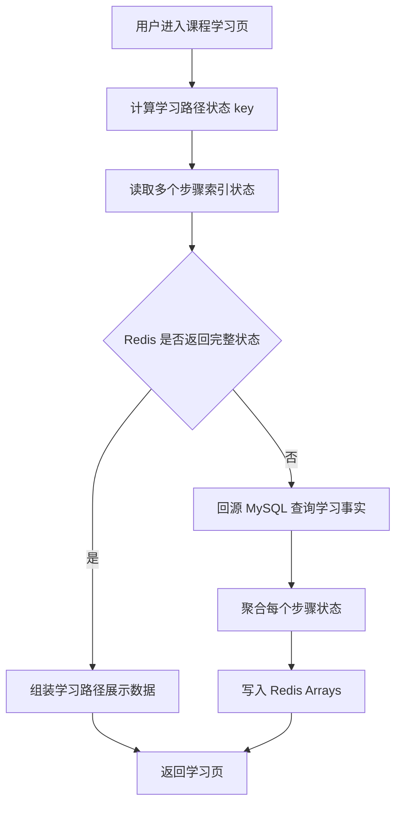
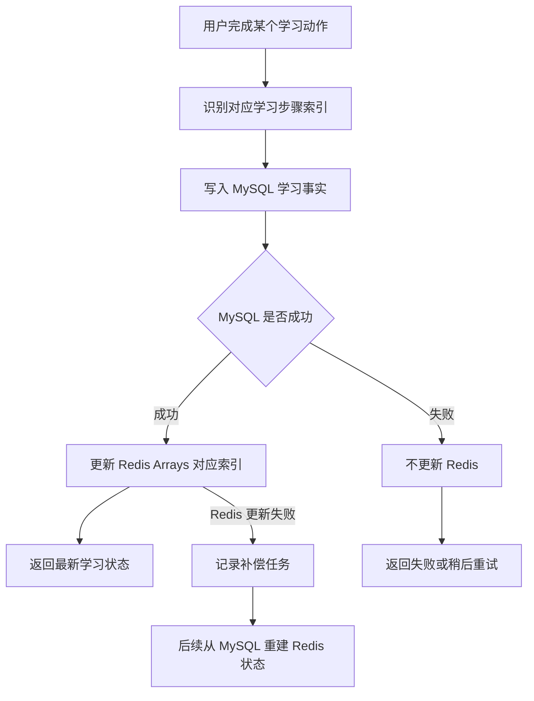
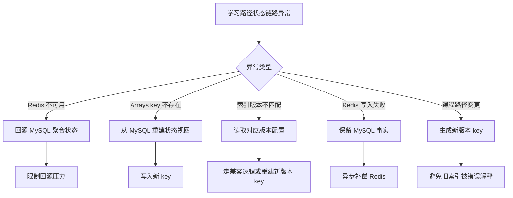
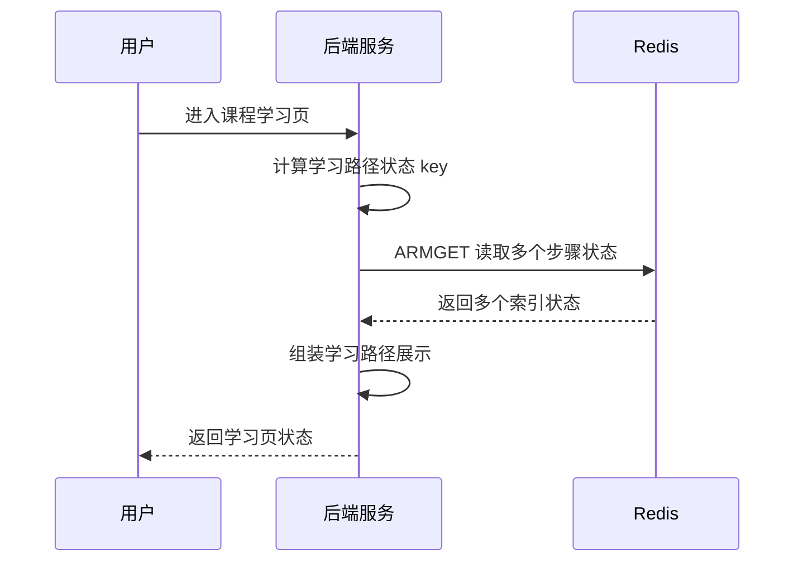
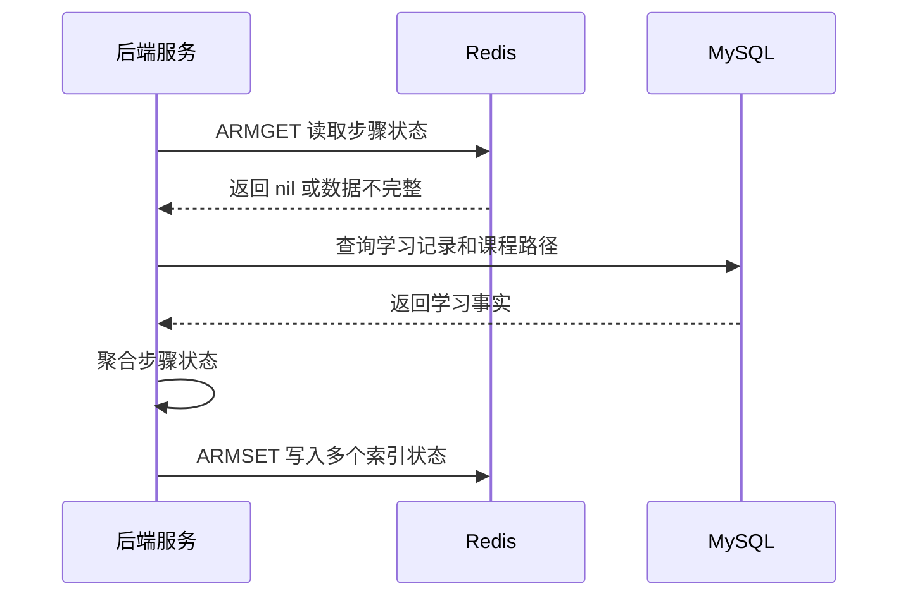
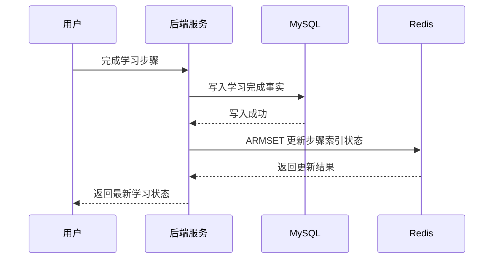
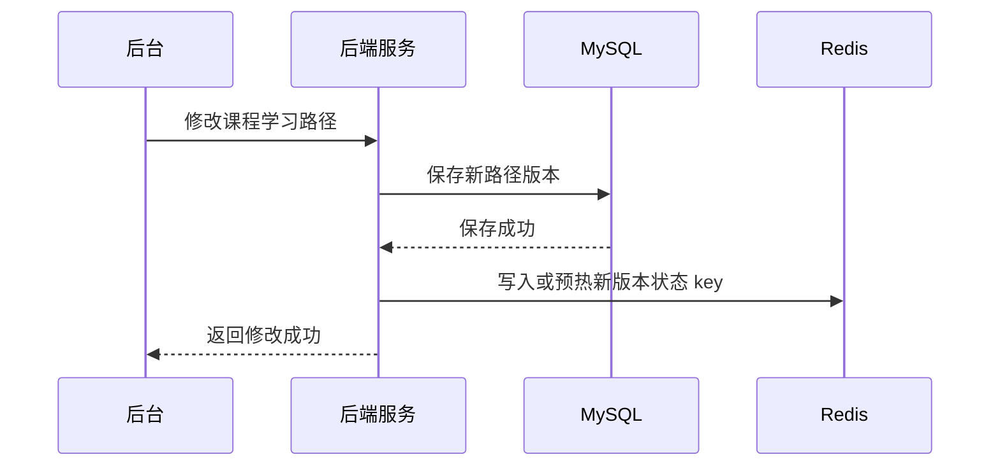

# Redis 知识点：Arrays

本次学习输入：

```text
知识点：Arrays
业务场景：用户课程学习路径步骤状态
重点关注：类型选择边界：为什么学习路径步骤状态适合 Arrays，而不是 List / Hash / JSON / MySQL 直接查
```

---

## 1. 一句话结论

Redis Arrays 适合存储“按索引访问、位置含义固定、数据可能稀疏”的字符串序列，例如用户课程学习路径步骤状态。参考：[Redis 官方 Arrays 文档](https://redis.io/docs/latest/develop/data-types/arrays/)

学习路径步骤状态适合 Arrays 的前提是：第 0 步、第 1 步、第 N 步的业务含义长期稳定；如果步骤经常插入、删除、重排，就不适合。**标记：主观推断**

---

## 2. 这个知识点是什么？

Redis Arrays 是 Redis 8.8.0 新增的数据结构，目前官方标注为 preview，可能发生变化。参考：[Redis 官方 Arrays 文档](https://redis.io/docs/latest/develop/data-types/arrays/)

Arrays 可以理解为：一个 Redis key 下面有很多按整数索引访问的字符串值。

```text
course:path:progress:v1:{courseId}:{userId}

index 0 -> "done"
index 1 -> "learning"
index 2 -> nil
index 3 -> "locked"
```

它和 List / Hash / JSON 的核心区别：

| 对比项  | Arrays         | List        | Hash    | JSON         |
| ---- | -------------- | ----------- | ------- | ------------ |
| 核心模型 | 按整数索引访问        | 顺序队列 / 列表   | 字段名到值   | 复杂对象         |
| 位置含义 | 第 N 个位置有固定业务含义 | 更偏顺序关系      | 字段名表达含义 | 层级结构表达含义     |
| 稀疏支持 | 支持未设置索引        | 不适合稀疏位置     | 可以用字段模拟 | 可以用对象 / 数组模拟 |
| 适合场景 | 固定步骤、固定坑位、固定关卡 | 消息列表、时间顺序列表 | 对象属性状态  | 复杂对象快照       |

Arrays 不是“更好的 List”，而是更适合“位置本身有业务语义”的场景。**标记：主观推断**

---

## 3. 它解决什么业务问题？

| 业务问题         | 具体表现                                | Redis 如何解决                                                                                                      |
| ------------ | ----------------------------------- | --------------------------------------------------------------------------------------------------------------- |
| 学习路径步骤位置固定   | 第 0 步导学、第 1 步基础课、第 2 步练习、第 3 步测验    | Arrays 可以按索引直接读写对应步骤状态。参考：[Redis 官方 ARGET 文档](https://redis.io/docs/latest/commands/arget/)                     |
| 部分步骤可能为空     | 用户可能跳过某些步骤，或课程版本中部分步骤暂未开放           | Arrays 是稀疏索引结构，未设置索引可以返回 nil。参考：[Redis 官方 Arrays 文档](https://redis.io/docs/latest/develop/data-types/arrays/)   |
| 一次读取多个步骤状态   | 学习页需要展示多个步骤的完成状态、锁定状态、学习中状态         | `ARMGET` 可以一次读取多个索引。参考：[Redis 官方 ARMGET 文档](https://redis.io/docs/latest/commands/armget/)                      |
| 更新单个步骤状态     | 用户完成第 N 步后，只需要更新该位置状态               | `ARMSET` 可以写入多个非连续索引，`ARSET` 可以从指定索引连续写入。参考：[Redis 官方 ARMSET 文档](https://redis.io/docs/latest/commands/armset/) |
| MySQL 直接查成本高 | 每次打开学习页都查学习记录、课程步骤、考试状态、权益状态，链路可能变长 | Arrays 可以作为高频读取的状态视图，MySQL 仍保留学习事实。**标记：主观推断**                                                                  |

核心业务价值：Arrays 让“第 N 步是什么状态”这个问题可以被直接按索引读取，而不是每次重新聚合 MySQL 多张表。**标记：主观推断**

---

## 4. Redis 为什么适合？

| Redis 能力           | 对应业务价值              | 证据 / 标记                                                                          |
| ------------------ | ------------------- | -------------------------------------------------------------------------------- |
| 稀疏、可按索引访问          | 学习路径中未开放或未完成的步骤可以为空 | 参考：[Redis 官方 Arrays 文档](https://redis.io/docs/latest/develop/data-types/arrays/) |
| `ARGET` 按索引读取单个值   | 查询用户第 N 个学习步骤状态     | 参考：[Redis 官方 ARGET 文档](https://redis.io/docs/latest/commands/arget/)             |
| `ARMGET` 一次读取多个索引  | 学习页一次展示多个步骤状态       | 参考：[Redis 官方 ARMGET 文档](https://redis.io/docs/latest/commands/armget/)           |
| `ARSET` 从指定索引连续写入  | 初始化或批量写入连续步骤状态      | 参考：[Redis 官方 ARSET 文档](https://redis.io/docs/latest/commands/arset/)             |
| `ARMSET` 写入多个非连续索引 | 更新多个不相邻步骤状态         | 参考：[Redis 官方 ARMSET 文档](https://redis.io/docs/latest/commands/armset/)           |
| `ARDEL` 删除指定索引     | 清理某个步骤状态            | 参考：[Redis 官方 ARDEL 文档](https://redis.io/docs/latest/commands/ardel/)             |

Redis Arrays 适合这里，不是因为“Redis 快”，而是因为它的数据模型刚好匹配 **固定索引 + 稀疏位置 + 高频读取步骤状态**。**标记：主观推断**

---

## 5. 它的边界是什么？

| 边界             | 说明                                                | 更合适的选择                          |
| -------------- | ------------------------------------------------- | ------------------------------- |
| 当前处于 preview   | Redis 官方说明 Arrays 目前处于 preview，生产使用前要确认版本、客户端和兼容性 | 稳妥方案可先用 Hash / JSON。**标记：主观推断** |
| 步骤含义不能频繁变化     | 如果第 2 步今天是练习，明天变成测验，历史状态会被错误解释                    | key 版本化 / MySQL 事实表。**标记：主观推断** |
| 不适合频繁插入重排      | Arrays 适合固定索引，不适合经常在中间插入步骤                        | List / JSON / MySQL。**标记：主观推断** |
| 不适合复杂对象        | 如果每个步骤要保存完成时间、考试分数、来源、权益等复杂信息                     | JSON / MySQL。**标记：主观推断**        |
| 不能替代 MySQL 事实源 | 学习完成、考试结果、证书发放、权益解锁必须可追溯                          | MySQL。**标记：主观推断**               |

核心边界：**Arrays 适合做按索引访问的状态视图，不适合做学习事实源。** **标记：主观推断**

---

## 6. 常见坑是什么？

| 常见坑            | 线上风险                      | 规避方式                                        |
| -------------- | ------------------------- | ------------------------------------------- |
| 忽略 preview 风险  | 升级、客户端支持、命令兼容性可能影响生产稳定性   | 上线前确认 Redis 8.8.0 版本、客户端支持和灰度策略。**标记：主观推断** |
| 索引含义没文档        | 研发不知道 index 2 代表什么，排查困难   | 维护步骤索引映射文档。**标记：主观推断**                      |
| 步骤变更不做版本化      | 新旧课程结构混用，用户状态错位           | key 加版本，例如 `v1 / v2`。**标记：主观推断**            |
| 把学习事实只存在 Redis | Redis 数据丢失后，学习完成、考试结果无法恢复 | MySQL 保留事实记录，Redis 只做状态视图。**标记：主观推断**       |
| 稀疏索引乱用         | 超大索引、混乱索引会让维护成本变高         | 限制索引范围，只用于固定步骤。**标记：主观推断**                  |
| 缓存失效策略缺失       | 课程路径变更后，用户看到旧步骤状态         | 路径变更后删除旧 key 或生成新版本 key。**标记：主观推断**         |

---

## 7. MySQL / List / Hash / JSON 是否更合适？

| 方案           | 是否适合        | 原因                                                           |
| ------------ | ----------- | ------------------------------------------------------------ |
| MySQL        | 必须做事实源      | 适合保存学习记录、考试成绩、证书权益、审计记录。**标记：主观推断**                          |
| Redis Arrays | 适合做学习路径状态视图 | 固定索引、稀疏步骤、高频读取时适合。**标记：主观推断**                                |
| Redis List   | 部分适合        | 适合顺序列表，不适合“第 N 步固定业务含义且可稀疏”的场景。**标记：主观推断**                   |
| Redis Hash   | 更稳妥、可读性更好   | 可以用 `step_0 -> done` 这类字段表达状态，但不如 Arrays 的索引模型直接。**标记：主观推断** |
| Redis JSON   | 适合复杂结构      | 如果每个步骤是复杂对象，JSON 更易表达。**标记：主观推断**                            |
| 本地缓存         | 不适合作主方案     | 学习状态跨实例共享，本地缓存只能做短暂兜底。**标记：主观推断**                            |

最终判断：**如果学习路径的步骤索引稳定、状态值简单、读取频率高，可以考虑 Arrays；如果更看重成熟度和可维护性，Hash / JSON 更稳。** **标记：主观推断**

---

## 8. 具体业务场景例子

### 8.1 场景背景

课程学习路径由固定步骤组成：

```text
第 0 步：课程导学
第 1 步：基础课程
第 2 步：章节练习
第 3 步：阶段测验
第 4 步：项目实战
第 5 步：结课考试
第 6 步：证书领取
```

用户进入课程学习页时，需要展示每个步骤的状态：

```text
not_started
learning
done
locked
skipped
```

其中，学习事实数据仍在 MySQL：

```text
course_path_step
user_course_progress
user_exam_record
user_certificate_record
```

Redis Arrays 只保存“学习页高频展示状态视图”。**标记：主观推断**

---

### 8.2 业务问题

* 学习页需要频繁读取多个步骤状态。**标记：主观推断**
* 每个步骤的位置含义固定，第 N 步长期代表同一个学习节点。**标记：主观推断**
* 用户可能只完成部分步骤，因此某些索引可能为空。**标记：主观推断**
* 如果每次都查 MySQL 多表聚合，接口链路会变长。**标记：主观推断**
* 课程路径变更后，旧索引状态可能被错误解释。**标记：主观推断**
* 学习完成、考试通过、证书发放不能只依赖 Redis。**标记：主观推断**

---

### 8.3 Redis 设计

```text
Redis key:
course:path:status:v1:{courseId}:{userId}

Redis value:
Redis Array，index 映射到步骤状态字符串

索引含义:
0 = 课程导学状态
1 = 基础课程状态
2 = 章节练习状态
3 = 阶段测验状态
4 = 项目实战状态
5 = 结课考试状态
6 = 证书领取状态

状态值:
not_started
learning
done
locked
skipped

TTL:
30 分钟 ~ 24 小时，按学习页访问频率、路径变更频率、旧状态可接受时间决定

MySQL:
课程路径定义、用户学习记录、考试记录、证书权益记录

降级:
Redis 不可用时，回源 MySQL 聚合学习路径状态；高流量场景限制回源并返回简化状态
```

设计说明：

* key 中加入 `v1`，用于路径结构升级和索引含义变更。**标记：主观推断**
* index 必须有稳定含义，不能随意变更。**标记：主观推断**
* value 只存简单状态字符串，不存复杂学习事实。**标记：主观推断**
* 课程路径变更时，优先生成新版本 key，避免新旧索引混用。**标记：主观推断**
* Arrays 当前处于 preview，生产使用前需要做灰度验证。参考：[Redis 官方 Arrays 文档](https://redis.io/docs/latest/develop/data-types/arrays/)

---

### 8.4 读流程



说明：

* `ARGET` 可以按索引读取 Arrays 中的单个值。参考：[Redis 官方 ARGET 文档](https://redis.io/docs/latest/commands/arget/)
* `ARMGET` 可以一次读取多个指定索引。参考：[Redis 官方 ARMGET 文档](https://redis.io/docs/latest/commands/armget/)
* Redis 返回 nil 时，需要区分“步骤未设置”和“缓存缺失”。**标记：主观推断**
* Redis 未命中或数据不完整时，可以从 MySQL 学习事实聚合重建。**标记：主观推断**
* 读流程不能把 Redis 状态当作最终事实，尤其是考试和证书相关状态。**标记：主观推断**

---

### 8.5 写流程



说明：

* `ARMSET` 可以一次写入多个非连续索引。参考：[Redis 官方 ARMSET 文档](https://redis.io/docs/latest/commands/armset/)
* `ARSET` 可以从指定索引开始写入连续值。参考：[Redis 官方 ARSET 文档](https://redis.io/docs/latest/commands/arset/)
* 学习事实应先写 MySQL，再更新 Redis 状态视图。**标记：主观推断**
* MySQL 写入失败时，不应更新 Redis，避免出现“Redis 显示已完成但事实不存在”。**标记：主观推断**
* Redis 更新失败时，应记录补偿任务，后续从 MySQL 重建状态。**标记：主观推断**

---

### 8.6 异常处理



说明：

* Redis 不可用时，可以回源 MySQL 聚合学习路径状态，但要限制回源压力。**标记：主观推断**
* Arrays key 不存在不一定是业务异常，可能是过期、淘汰或尚未初始化。**标记：主观推断**
* 索引版本不匹配时，不能用新版本含义解释旧版本数据。**标记：主观推断**
* Redis 写入失败时，MySQL 学习事实仍然保留，可以异步重建 Redis 状态。**标记：主观推断**
* 课程路径变更属于高风险操作，需要版本化 key 或清理旧缓存。**标记：主观推断**

---

### 8.7 监控指标

| 指标                   | 作用                    |
| -------------------- | --------------------- |
| Redis QPS            | 观察学习路径状态读写压力          |
| `ARGET / ARMGET` 调用量 | 判断学习页读取频率             |
| `ARSET / ARMSET` 调用量 | 判断步骤状态更新频率            |
| Redis P95 / P99 延迟   | 判断学习页是否受 Redis 影响     |
| nil 返回比例             | 判断索引未设置、缓存缺失或初始化问题    |
| MySQL 回源次数           | 判断 Redis 缺失或异常时的数据库压力 |
| Redis / MySQL 状态差异   | 发现状态视图和事实源不一致         |
| evicted_keys         | 判断学习路径状态 key 是否被淘汰    |
| used_memory          | 观察 Arrays 状态总体内存占用    |
| 补偿任务数量               | 判断 Redis 写入失败或异步重建压力  |
| 版本不匹配次数              | 发现课程路径变更导致的兼容问题       |

---

## 9. Mermaid 图

### 9.1 学习页读取状态流程



### 9.2 Redis 未命中后回源流程



### 9.3 学习步骤完成写入流程



### 9.4 课程路径版本变更流程



---

## 10. 工程评审关注点

| 关注点                        | 说明                                                            |
| -------------------------- | ------------------------------------------------------------- |
| 为什么用 Arrays？               | 因为学习路径是固定索引语义，适合按第 N 步读写状态。**标记：主观推断**                        |
| 为什么不用 List？                | List 更适合顺序列表，不适合稀疏索引和固定业务位置。**标记：主观推断**                       |
| 为什么不用 Hash？                | Hash 更成熟、更可读；如果生产稳妥优先，Hash 可能比 preview Arrays 更合适。**标记：主观推断** |
| 为什么不用 JSON？                | JSON 适合复杂步骤对象；如果只保存简单状态，Arrays 更贴近索引模型。**标记：主观推断**            |
| Redis Arrays preview 怎么处理？ | 上线前确认 Redis 8.8.0、客户端支持、灰度策略和回退方案。**标记：主观推断**                 |
| 索引含义怎么保证不乱？                | 维护步骤索引映射文档，并在 key 中加入版本号。**标记：主观推断**                          |
| Redis 数据丢了怎么办？             | 从 MySQL 学习事实、考试记录、证书记录重建。**标记：主观推断**                          |
| 课程路径变更怎么办？                 | 新路径使用新版本 key，避免旧索引状态被新路径错误解释。**标记：主观推断**                      |
| 哪些数据不能只放 Redis？            | 学习完成事实、考试结果、证书权益、积分奖励、审计记录。**标记：主观推断**                        |
| 是否值得用 Arrays？              | 如果追求生产稳定，当前阶段要谨慎；如果是技术分享，可以作为 Redis 8.8.0 新能力重点介绍。**标记：主观推断** |

---

## 11. 最终记忆点

1. Arrays 适合固定索引语义，不适合频繁插入、删除、重排。
2. 学习路径步骤状态适合 Arrays 的前提是：第 N 步含义长期稳定。
3. Arrays 当前是 Redis 8.8.0 preview 能力，生产使用要特别谨慎。
4. Redis Arrays 适合做高频状态视图，MySQL 仍负责学习事实和可追溯记录。
5. 如果更看重成熟度和排查成本，Hash / JSON 往往更稳。

---

## 12. 参考资料

1. [Redis 官方 Arrays 文档](https://redis.io/docs/latest/develop/data-types/arrays/)：用于确认 Arrays 是 Redis 8.8.0 新数据结构、当前处于 preview，以及稀疏、按整数索引访问的能力。
2. [Redis 官方 ARGET 文档](https://redis.io/docs/latest/commands/arget/)：用于确认按索引读取单个数组值。
3. [Redis 官方 ARMGET 文档](https://redis.io/docs/latest/commands/armget/)：用于确认一次读取多个指定索引。
4. [Redis 官方 ARSET 文档](https://redis.io/docs/latest/commands/arset/)：用于确认从指定索引开始连续写入值。
5. [Redis 官方 ARMSET 文档](https://redis.io/docs/latest/commands/armset/)：用于确认一次写入多个非连续索引值。
6. [Redis 官方 ARDEL 文档](https://redis.io/docs/latest/commands/ardel/)：用于确认删除指定索引元素。
7. [Redis GitHub Releases](https://github.com/redis/redis/releases)：用于确认 Redis 8.8.0 版本相关信息。
