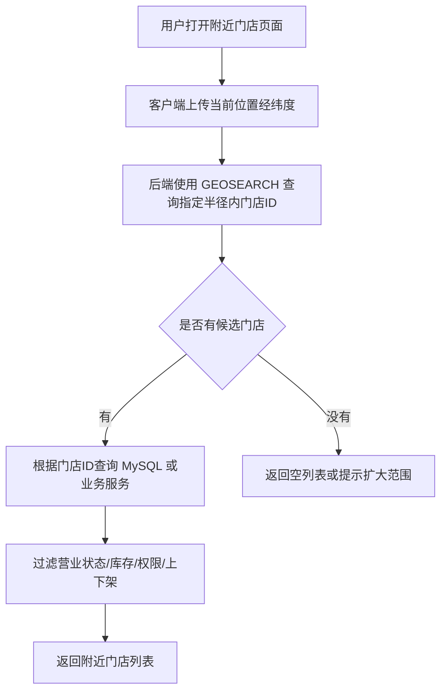

# 第 7 章：Geospatial indexes：适合地理位置范围查询

## 1. 本章一句话

Geospatial indexes 适合解决“根据经纬度查附近对象”的问题，例如附近门店、附近地点、附近活动点；Redis 官方说明 Geospatial data type 可用于查找给定地理半径或边界框内的位置。参考：[Redis 官方 Geospatial 文档](https://redis.io/docs/latest/develop/data-types/geospatial/)

本章核心判断：Geospatial indexes 适合做位置范围查询的第一层筛选，但不适合替代完整地图服务、复杂地理分析或复杂业务搜索系统。**标记：主观推断**

---

## 2. 适合解决什么问题？

| 场景            | 为什么适合                                                                                                                         |
| ------------- | ----------------------------------------------------------------------------------------------------------------------------- |
| 附近门店 / 地点范围查询 | 用户给出当前位置后，可以用 Geospatial indexes 查指定半径或边界框内的门店位置。参考：[Redis 官方 GEOSEARCH 文档](https://redis.io/docs/latest/commands/geosearch/) |
| 附近活动点查询       | 活动点本质也是一组经纬度位置，适合先按地理范围筛出候选点，再回业务系统判断活动状态。**标记：主观推断**                                                                         |
| 地理围栏类查询       | 可以用半径或矩形范围做粗粒度位置判断，但复杂多边形围栏、路径规划、地图分析不应只靠 Redis Geospatial 完成。**标记：主观推断**                                                     |

---

## 3. 主案例

```text
主案例：附近门店 / 地点范围查询

业务背景：
用户打开附近门店页面，客户端上传当前位置经纬度，后端需要返回 3 公里内可访问的门店列表。

核心原因：
Redis Geospatial indexes 适合先根据经纬度快速筛出附近门店 ID；门店名称、营业状态、库存、权限、上下架等业务信息仍然从 MySQL 或业务服务读取。**标记：主观推断**
```

---

## 4. 核心流程



说明：

* `GEOSEARCH` 可以从由 `GEOADD` 填充的 geospatial sorted set 中查询指定圆形或矩形范围内的成员。参考：[Redis 官方 GEOSEARCH 文档](https://redis.io/docs/latest/commands/geosearch/)
* `GEOADD` 用于写入经度、纬度、成员名，并且 Redis 官方说明这类数据底层存储为 sorted set，后续可用 `GEOSEARCH` 查询。参考：[Redis 官方 GEOADD 文档](https://redis.io/docs/latest/commands/geoadd/)
* 附近门店查询中，Redis 更适合作为“位置索引层”，MySQL / 业务服务更适合作为“业务事实源”。**标记：主观推断**
* Geospatial indexes 只解决“位置范围筛选”，不解决门店是否营业、是否有库存、用户是否有权限等业务判断。**标记：主观推断**

---

## 5. 关键命令

| 命令                                                                                          | 作用                                                                                                                     |
| ------------------------------------------------------------------------------------------- | ---------------------------------------------------------------------------------------------------------------------- |
| `GEOADD store:geo <longitude> <latitude> <storeId>`                                         | 写入或更新门店位置；注意经度在前、纬度在后。参考：[Redis 官方 GEOADD 文档](https://redis.io/docs/latest/commands/geoadd/)                           |
| `GEOSEARCH store:geo FROMLONLAT <longitude> <latitude> BYRADIUS 3 KM WITHDIST ASC COUNT 20` | 查询用户当前位置 3 公里内的门店，并返回距离。参考：[Redis 官方 GEOSEARCH 文档](https://redis.io/docs/latest/commands/geosearch/)                   |
| `GEOSEARCH store:geo FROMLONLAT <longitude> <latitude> BYBOX <width> <height> KM`           | 按矩形边界框查询附近门店，适合区域范围粗筛。参考：[Redis 官方 GEOSEARCH 文档](https://redis.io/docs/latest/commands/geosearch/)                     |
| `ZREM store:geo <storeId>`                                                                  | 删除门店位置；Redis 官方说明没有单独的 `GEODEL`，可以用 `ZREM` 删除元素。参考：[Redis 官方 GEOADD 文档](https://redis.io/docs/latest/commands/geoadd/) |

---

## 6. 边界和坑

| 问题                 | 说明                                                                                                                                                                                                                        |
| ------------------ | ------------------------------------------------------------------------------------------------------------------------------------------------------------------------------------------------------------------------- |
| 经纬度顺序写反            | `GEOADD` 使用 longitude、latitude，即经度在前、纬度在后；写反会导致位置查询结果明显异常。参考：[Redis 官方 GEOADD 文档](https://redis.io/docs/latest/commands/geoadd/)                                                                                          |
| 坐标范围有限制            | Redis 官方说明有效经度范围是 -180 到 180，有效纬度范围是 -85.05112878 到 85.05112878，超出范围会报错。参考：[Redis 官方 GEOADD 文档](https://redis.io/docs/latest/commands/geoadd/)                                                                            |
| 不适合复杂地理分析          | Redis 官方提醒不要混淆 Geospatial data type 和 Redis Search 的 geospatial features；Geospatial data type 更适合简单用例，查询能力没有 Redis Search 地理能力丰富。参考：[Redis 官方 Geospatial 文档](https://redis.io/docs/latest/develop/data-types/geospatial/) |
| 不能只靠 Redis 判断业务可用性 | 门店是否营业、是否上架、是否有库存、用户是否有权限，仍要回 MySQL 或业务服务确认。**标记：主观推断**                                                                                                                                                                   |
| 查询结果可能过大           | 半径设置过大或门店密度过高时，候选结果会变多，需要限制 `COUNT`、分页或二次过滤。**标记：主观推断**                                                                                                                                                                   |

---

## 7. 本章记忆点

1. Geospatial indexes 的核心价值是“按经纬度查附近对象”，不是完整地图系统。
2. `GEOADD` 负责写入位置，`GEOSEARCH` 负责按半径或边界框查附近位置。
3. Redis 只做位置范围筛选，最终业务正确性仍要回 MySQL / 业务服务确认。**标记：主观推断**
