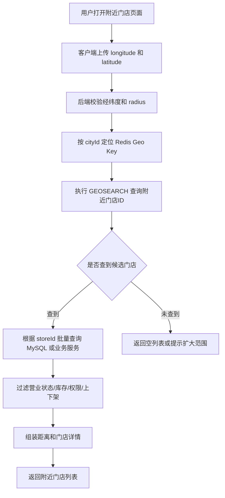
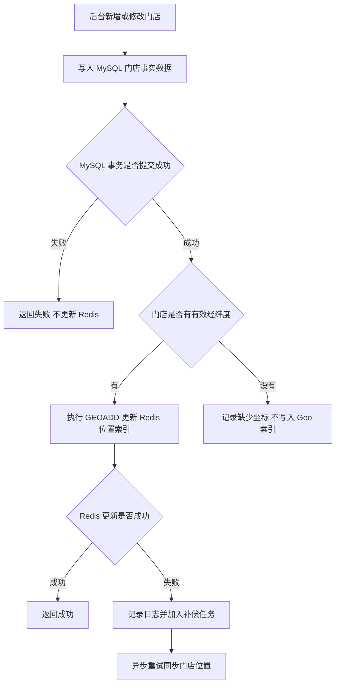
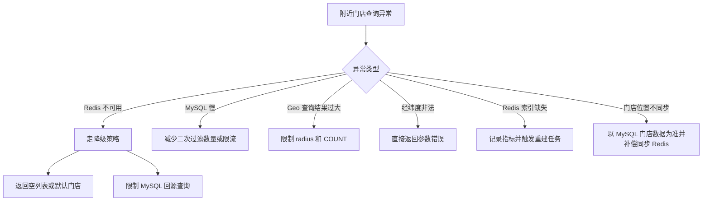
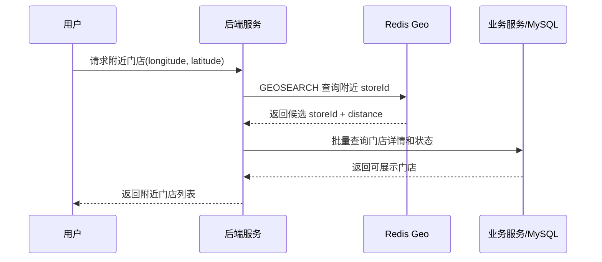
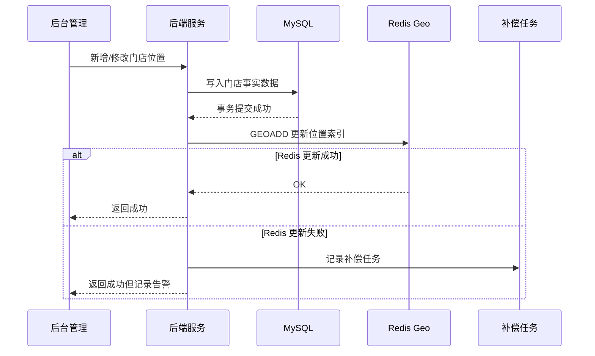
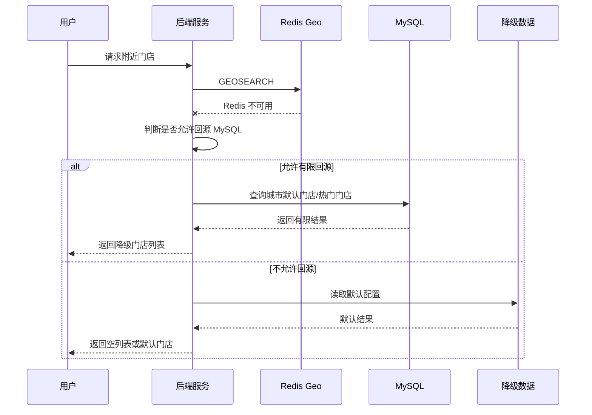

# Redis 知识点：Geospatial indexes

## 1. 一句话结论

> Redis Geospatial indexes 适合存储经纬度坐标，并查询指定半径或边界框内的附近位置。参考：[Redis 官方 Geospatial 文档](https://redis.io/docs/latest/develop/data-types/geospatial/)
> 在“附近门店 / 地点范围查询”场景中，Redis 更适合作为位置索引层，MySQL / 业务服务仍然负责门店详情、营业状态、库存、权限、上下架等事实数据。标记：主观推断

---

## 2. 这个知识点是什么？

Geospatial indexes 是 Redis 用来存储地理坐标并进行附近位置查询的数据能力。

它的核心不是“存门店完整信息”，而是把一批带经纬度的对象放到 Redis 里，然后根据用户当前位置查询一定范围内的对象 ID。

Redis 官方文档说明：Geospatial indexes 可以存储坐标并搜索坐标，适合查找给定半径或边界框内的附近点。参考：[Redis 官方 Geospatial 文档](https://redis.io/docs/latest/develop/data-types/geospatial/)

在工程理解上，可以把它理解成：

```text
Redis Geospatial = 位置索引
MySQL = 门店事实数据
业务服务 = 业务规则判断
```

标记：主观推断

---

## 3. 它解决什么业务问题？

业务场景：附近门店 / 地点范围查询。

用户打开“附近门店”页面时，客户端上传当前位置经纬度，后端需要快速返回附近 3 公里内的门店列表。

如果不用 Redis Geospatial，常见做法是直接用 MySQL 做经纬度范围计算或全量筛选，这在门店数量变多、请求频率变高时，容易增加数据库查询压力。标记：主观推断

| 业务问题              | 具体表现                            | Redis 如何解决                                                                                                            |
| ----------------- | ------------------------------- | --------------------------------------------------------------------------------------------------------------------- |
| 附近范围查询频繁          | 用户每次打开页面都要按当前位置查附近门店            | Redis 用 `GEOSEARCH` 按半径或边界框查询附近门店 ID。参考：[Redis 官方 GEOSEARCH 文档](https://redis.io/docs/latest/commands/geosearch/)     |
| MySQL 不适合承接高频位置粗筛 | 如果每次都让 MySQL 做经纬度计算和排序，数据库压力会升高 | Redis 先做位置范围粗筛，MySQL 再查门店详情和业务状态。标记：主观推断                                                                              |
| 位置查询和业务筛选混在一起     | 门店位置、营业状态、库存、权限都放到一个复杂查询里       | Redis 只返回候选门店 ID，业务服务再二次过滤。标记：主观推断                                                                                    |
| 查询结果可能很多          | 大城市门店密集，半径过大时会查出大量候选结果          | `GEOSEARCH` 支持 `COUNT` 限制返回数量，避免一次返回过多结果。参考：[Redis 官方 GEOSEARCH 文档](https://redis.io/docs/latest/commands/geosearch/) |

---

## 4. Redis 为什么适合？

| Redis 能力       | 对应业务价值                           | 证据 / 标记                                                                                                                                                                        |
| -------------- | -------------------------------- | ------------------------------------------------------------------------------------------------------------------------------------------------------------------------------ |
| 存储经纬度坐标        | 可以把每个门店 ID 和门店经纬度写入一个地理索引        | `GEOADD` 用于添加经度、纬度和成员名。参考：[Redis 官方 GEOADD 文档](https://redis.io/docs/latest/commands/geoadd/)                                                                                  |
| 按半径查询          | 可以查用户当前位置 3 公里内的门店               | `GEOSEARCH ... BYRADIUS` 支持按圆形半径查询。参考：[Redis 官方 GEOSEARCH 文档](https://redis.io/docs/latest/commands/geosearch/)                                                                |
| 按边界框查询         | 可以查某个矩形区域内的门店                    | `GEOSEARCH ... BYBOX` 支持按矩形边界框查询。参考：[Redis 官方 GEOSEARCH 文档](https://redis.io/docs/latest/commands/geosearch/)                                                                  |
| 返回距离           | 可以把距离返回给前端展示或排序                  | `GEOSEARCH` 支持 `WITHDIST` 返回距离。参考：[Redis 官方 GEOSEARCH 文档](https://redis.io/docs/latest/commands/geosearch/)                                                                    |
| 底层是 Sorted Set | 可以用 `ZREM` 删除门店位置，没有单独的 `GEODEL` | Redis 官方说明 Geo index structure 本质是 sorted set，可用 `ZREM` 删除元素。参考：[Redis 官方 GEOADD 文档](https://redis.io/docs/latest/commands/geoadd/)                                            |
| 适合简单位置查询       | 适合作为附近门店查询的第一层位置索引               | Redis 官方提醒不要把 Geospatial data type 和 Redis Search 的 geospatial features 混淆，前者适合更简单的用例。参考：[Redis 官方 Geospatial 文档](https://redis.io/docs/latest/develop/data-types/geospatial/) |

---

## 5. 它的边界是什么？

| 边界                      | 说明                                                                                                                                                                                 | 更合适的选择              |
| ----------------------- | ---------------------------------------------------------------------------------------------------------------------------------------------------------------------------------- | ------------------- |
| 不适合复杂地图服务               | Redis Geospatial 适合半径和边界框查询，不适合路线规划、导航、多边形复杂区域分析。标记：主观推断                                                                                                                           | 专业地图服务 / GIS 系统     |
| 不适合替代 Redis Search 地理能力 | Redis 官方说明 Geospatial data type 适合更简单的用例，没有 Redis Search geospatial features 那么丰富的格式和查询能力。参考：[Redis 官方 Geospatial 文档](https://redis.io/docs/latest/develop/data-types/geospatial/) | Redis Search / 搜索系统 |
| 不适合保存门店完整事实数据           | 门店名称、营业状态、库存、权限、上下架等不能只靠 Redis Geospatial 判断。标记：主观推断                                                                                                                               | MySQL / 业务服务        |
| 坐标范围有限                  | Redis 官方说明有效经度范围是 -180 到 180，有效纬度范围是 -85.05112878 到 85.05112878，超出会报错。参考：[Redis 官方 GEOADD 文档](https://redis.io/docs/latest/commands/geoadd/)                                       | 写入前做参数校验            |
| 距离计算存在近似                | Redis 官方说明它使用球面模型和 Haversine 公式，地球并非完美球体，最坏情况下误差可能到 0.5%。参考：[Redis 官方 GEOADD 文档](https://redis.io/docs/latest/commands/geoadd/)                                                    | 对误差敏感的场景使用专业地理系统    |

---

## 6. 常见坑是什么？

| 常见坑                  | 线上风险                                 | 规避方式                                                                                                                              |
| -------------------- | ------------------------------------ | --------------------------------------------------------------------------------------------------------------------------------- |
| 经纬度顺序写反              | 门店被写到错误位置，导致附近查询结果异常                 | `GEOADD` 参数顺序是 longitude、latitude，经度在前、纬度在后；接口入参和日志也要明确字段名。参考：[Redis 官方 GEOADD 文档](https://redis.io/docs/latest/commands/geoadd/) |
| 半径设置过大               | 一次查询候选门店过多，Redis 和后端二次过滤压力升高         | 限制最大半径，使用 `COUNT`，必要时分页或分区域查询。标记：主观推断                                                                                             |
| 只用 Redis 判断门店可用      | Redis 返回了附近门店，但门店可能已下架、无库存、未营业       | Redis 只返回候选 ID，最终可用性必须回 MySQL / 业务服务确认。标记：主观推断                                                                                    |
| 门店位置更新不及时            | 用户看到旧位置，导航或距离展示不准确                   | 门店位置变更后同步更新 `GEOADD`，删除门店时用 `ZREM`。参考：[Redis 官方 GEOADD 文档](https://redis.io/docs/latest/commands/geoadd/)                         |
| 把 Geospatial 当复杂搜索系统 | 后续想加标签、关键词、评分、复杂排序时，Redis Geo 查询能力不够 | 位置查询只做第一层粗筛，复杂搜索交给 MySQL、搜索系统或 Redis Search。标记：主观推断                                                                               |
| 位置 Key 变成大 Key       | 一个城市所有门店都放在一个 Key，门店量巨大后操作变慢         | 按城市、业务线或区域拆 Key，例如 `store:geo:city:{cityId}`。标记：主观推断                                                                              |
| 缺少异常降级               | Redis 不可用时附近门店接口直接失败                 | 可降级返回空列表、默认热门门店、最近一次缓存结果，或限流保护 MySQL。标记：主观推断                                                                                      |

---

## 7. MySQL / 本地缓存 / 其他方案是否更合适？

| 方案                       | 是否适合                     | 原因                                                                                                                                                                                       |
| ------------------------ | ------------------------ | ---------------------------------------------------------------------------------------------------------------------------------------------------------------------------------------- |
| MySQL                    | 适合作为事实源，不适合高频位置粗筛的唯一承载层  | MySQL 应保存门店基础信息、营业状态、库存、上下架、权限等事实数据；位置范围查询高频时，Redis 可以先做候选筛选。标记：主观推断                                                                                                                     |
| Redis Geospatial indexes | 适合                       | 它原生支持经纬度写入、半径查询、边界框查询和距离返回，正好匹配附近门店查询。参考：[Redis 官方 Geospatial 文档](https://redis.io/docs/latest/develop/data-types/geospatial/)                                                           |
| 本地缓存                     | 只适合缓存少量静态配置，不适合按用户位置动态查询 | 用户位置不同，返回结果不同，本地缓存很难覆盖所有位置组合。标记：主观推断                                                                                                                                                     |
| Redis String / Hash      | 不适合作为位置范围查询主方案           | String / Hash 适合保存对象快照或字段状态，但不能天然按经纬度半径查附近对象。标记：主观推断                                                                                                                                     |
| Redis Search             | 适合复杂搜索或更丰富的地理查询          | Redis 官方提醒 Geospatial data type 不要和 Redis Search 的 geospatial features 混淆，Redis Search 的地理能力更丰富。参考：[Redis 官方 Geospatial 文档](https://redis.io/docs/latest/develop/data-types/geospatial/) |
| 专业地图 / GIS 服务            | 适合路线规划、导航、多边形区域、精度敏感场景   | Redis Geospatial 的定位是简单位置查询，不适合复杂地理分析。标记：主观推断                                                                                                                                            |

最终判断：

> 附近门店查询可以用 Redis Geospatial 做第一层位置索引；MySQL 仍然保存门店事实数据；复杂地图能力不要强行塞给 Redis。标记：主观推断

---

## 8. 具体业务场景例子

### 8.1 场景背景

业务：用户打开“附近门店”页面，客户端上传当前位置经纬度，后端返回附近 3 公里内最多 20 家可用门店。

接口示例：

```text
GET /api/stores/nearby?longitude=113.93&latitude=22.53&radiusKm=3
```

数据来源：

* 门店基础信息来自 MySQL。
* 门店经纬度来自后台门店配置或门店地址管理。
* 门店位置索引写入 Redis Geospatial。
* 门店营业状态、库存、权限、上下架状态仍从 MySQL 或业务服务确认。

标记：主观推断

访问频率：

* 首页附近门店入口可能高频访问。
* 用户位置不同，查询结果不同。
* 门店位置更新频率通常低于用户查询频率。

标记：主观推断

---

### 8.2 业务问题

如果不用 Redis Geospatial，可能会遇到这些问题：

| 业务问题          | 具体表现                                            |
| ------------- | ----------------------------------------------- |
| MySQL 查询压力高   | 每次请求都要计算经纬度距离、排序、过滤，访问量上来后数据库压力升高。标记：主观推断       |
| 查询逻辑复杂        | 位置范围计算、门店状态过滤、库存判断、权限判断都混在一个 SQL 或服务逻辑里。标记：主观推断 |
| 用户体验受影响       | 附近门店页面属于用户打开即查的接口，延迟高会影响体验。标记：主观推断              |
| 位置筛选和业务事实边界不清 | 如果把所有信息都放 Redis，容易把 Redis 当事实源。标记：主观推断          |

用了 Redis Geospatial 后：

* Redis 负责快速筛出附近门店 ID。
* MySQL / 业务服务负责确认这些门店是否真的可展示。
* 后端把“位置筛选”和“业务事实判断”拆开。

标记：主观推断

---

### 8.3 Redis 设计

```text
Redis key:
store:geo:city:{cityId}

Redis value:
Geospatial sorted set
member = storeId
score = Redis 内部根据经纬度编码后的 geospatial score

写入示例:
GEOADD store:geo:city:440300 113.93 22.53 store_10001

查询示例:
GEOSEARCH store:geo:city:440300 FROMLONLAT 113.93 22.53 BYRADIUS 3 KM WITHDIST ASC COUNT 20

TTL:
门店位置索引通常不建议设置短 TTL，因为门店位置属于相对稳定的索引数据。
如果业务要求定期全量重建，可以使用版本化 key 或定时刷新。
标记：主观推断

MySQL:
保存门店事实数据，包括门店名称、地址、营业状态、上下架状态、库存、权限、城市、门店类型等。
标记：主观推断

降级:
Redis 不可用时，可以返回空列表、默认热门门店、用户所在城市门店推荐，或者限制回源 MySQL 查询。
具体取决于业务对“附近准确性”和“可用性”的要求。
标记：主观推断
```

关键依据：

* `GEOADD` 会把经纬度成员写入 key，数据底层存储为 sorted set，并可用 `GEOSEARCH` 查询。参考：[Redis 官方 GEOADD 文档](https://redis.io/docs/latest/commands/geoadd/)
* `GEOSEARCH` 可以基于 `FROMLONLAT`、`BYRADIUS`、`BYBOX` 查询成员，并支持 `WITHDIST` 和 `COUNT`。参考：[Redis 官方 GEOSEARCH 文档](https://redis.io/docs/latest/commands/geosearch/)

---

### 8.4 读流程



说明：

* `GEOSEARCH` 可以返回指定圆形或矩形范围内的成员，适合附近门店候选 ID 查询。参考：[Redis 官方 GEOSEARCH 文档](https://redis.io/docs/latest/commands/geosearch/)
* `WITHDIST` 可以返回匹配成员到中心点的距离，适合前端展示“距离你 X 公里”。参考：[Redis 官方 GEOSEARCH 文档](https://redis.io/docs/latest/commands/geosearch/)
* 读流程中 Redis 只负责位置范围筛选，不负责门店是否可展示。**标记：主观推断**
* Redis 返回候选 ID 后还要回 MySQL / 业务服务过滤营业状态、库存、权限、上下架。**标记：主观推断**
* 半径和 `COUNT` 必须限制，避免一次查出过多候选门店。**标记：主观推断**

---

### 8.5 写流程



说明：

* `GEOADD` 用于添加或更新地理位置成员，参数顺序是 longitude、latitude、member。参考：[Redis 官方 GEOADD 文档](https://redis.io/docs/latest/commands/geoadd/)
* Redis Geo 底层是 sorted set，没有单独的 `GEODEL`，删除门店位置可用 `ZREM`。参考：[Redis 官方 GEOADD 文档](https://redis.io/docs/latest/commands/geoadd/)
* 写流程建议先提交 MySQL，再更新 Redis，避免 Redis 有位置但 MySQL 事实数据不存在。**标记：主观推断**
* Redis 更新失败不应回滚已经提交的 MySQL 门店事实数据，应记录日志并补偿。**标记：主观推断**
* 如果门店被下架，是否立刻从 Redis Geo 中删除，取决于查询时是否还会回业务服务过滤上下架状态。**标记：主观推断**

---

### 8.6 异常处理



说明：

* `GEOADD` 对经纬度范围有限制，超出范围会报错，所以入口必须先校验经纬度。参考：[Redis 官方 GEOADD 文档](https://redis.io/docs/latest/commands/geoadd/)
* `GEOSEARCH` 如果不使用 `COUNT`，可能返回所有匹配项；大范围查询要限制半径和返回数量。参考：[Redis 官方 GEOSEARCH 文档](https://redis.io/docs/latest/commands/geosearch/)
* Redis 不可用时，不建议无限制回源 MySQL 做复杂位置查询，否则可能把 Redis 故障扩大成数据库故障。**标记：主观推断**
* 附近门店接口可以接受“短暂返回空列表 / 默认门店 / 城市热门门店”，但不能返回已经下架或无权限门店。**标记：主观推断**
* Redis 位置索引缺失时，可以通过 MySQL 门店表批量重建 Redis Geo Key。**标记：主观推断**

---

### 8.7 监控指标

| 指标                 | 作用                                      |
| ------------------ | --------------------------------------- |
| Redis Geo 查询 QPS   | 判断附近门店接口对 Redis 的访问压力。标记：主观推断           |
| Redis P95 / P99 延迟 | 判断 `GEOSEARCH` 是否出现慢查询或大范围查询问题。标记：主观推断  |
| `GEOSEARCH` 返回候选数量 | 判断 radius / COUNT 是否合理。标记：主观推断          |
| MySQL 二次过滤次数       | 判断 Redis 返回候选后给业务服务带来的压力。标记：主观推断        |
| Redis 更新失败次数       | 判断后台门店位置同步是否稳定。标记：主观推断                  |
| 门店位置补偿任务积压数        | 判断 Redis 位置索引是否可能长期不一致。标记：主观推断          |
| 降级次数               | 判断 Redis 不可用、MySQL 慢或参数异常是否频繁发生。标记：主观推断 |
| slowlog            | 判断是否有慢命令影响 Redis 主线程。标记：主观推断            |
| used_memory        | 评估 Geo Key 和门店数量增长带来的内存压力。标记：主观推断       |

---

## 9. Mermaid 图

### 9.1 Redis 命中附近门店流程



说明：

* Redis Geo 负责返回候选位置结果。参考：[Redis 官方 GEOSEARCH 文档](https://redis.io/docs/latest/commands/geosearch/)
* 门店详情和状态由业务服务或 MySQL 确认。**标记：主观推断**

---

### 9.2 门店位置更新流程



说明：

* `GEOADD` 可以添加或更新成员位置。参考：[Redis 官方 GEOADD 文档](https://redis.io/docs/latest/commands/geoadd/)
* MySQL 事务提交成功后再更新 Redis，属于工程一致性策略。**标记：主观推断**

---

### 9.3 Redis 不可用降级流程



说明：

* Redis 不可用时，是否回源 MySQL 要受限流和业务重要性控制。**标记：主观推断**
* 降级目标是保护核心链路，避免 Redis 故障扩散到 MySQL。**标记：主观推断**

---

## 10. 工程评审关注点

| 关注点   | 说明                                                                                                                                                                          |
| ----- | --------------------------------------------------------------------------------------------------------------------------------------------------------------------------- |
| 架构合理性 | 为什么不直接用 MySQL 查附近门店？回答方向：MySQL 做事实源，Redis 做高频位置索引，降低高频范围查询压力。标记：主观推断                                                                                                        |
| 类型选择  | 为什么用 Geospatial indexes，不用 String / Hash / Set？回答方向：Geospatial 原生支持经纬度、半径、边界框和距离查询。参考：[Redis 官方 Geospatial 文档](https://redis.io/docs/latest/develop/data-types/geospatial/) |
| 数据一致性 | 门店位置在 MySQL 和 Redis 不一致怎么办？回答方向：MySQL 为事实源，Redis 更新失败记录补偿任务，必要时定时全量重建 Geo Key。标记：主观推断                                                                                       |
| 稳定性   | Redis 挂了附近门店接口怎么办？回答方向：返回空列表、默认热门门店、城市默认门店，或限流后有限回源 MySQL。标记：主观推断                                                                                                           |
| 性能    | 半径过大或城市门店太多怎么办？回答方向：限制最大 radius、强制 `COUNT`、按 cityId 拆 Key、监控候选数量和延迟。标记：主观推断                                                                                                 |
| 成本    | Geo Key 会不会太大？回答方向：按城市 / 区域 / 业务线拆分，定期清理无效门店位置。标记：主观推断                                                                                                                      |
| 可恢复性  | Redis 数据丢了怎么恢复？回答方向：从 MySQL 门店表扫描有效门店并重新 `GEOADD`。标记：主观推断                                                                                                                   |
| 扩展性   | 后续要支持关键词、标签、评分排序怎么办？回答方向：Redis Geo 做位置粗筛，复杂搜索交给 MySQL / 搜索系统 / Redis Search。标记：主观推断                                                                                         |
| 线上风险  | 最容易出错的是经纬度写反、半径过大、Redis 结果未做业务过滤。标记：主观推断                                                                                                                                    |
| 版本相关  | 本次按 Redis Open Source 8.8.0 作为资料基准；Redis 8.8 官方文档说明该版本在 Redis 8.6 基础上引入新特性和性能改进。参考：[Redis 官方 Redis 8.8 文档](https://redis.io/docs/latest/develop/whats-new/8-8/)             |

---

## 11. 最终记忆点

1. Geospatial indexes 的核心价值是“按经纬度查附近对象”，不是完整地图系统。
2. `GEOADD` 负责写入位置，`GEOSEARCH` 负责按半径或边界框查询附近位置。
3. 附近门店场景里，Redis 只做位置索引，MySQL / 业务服务仍然负责事实数据和业务规则。标记：主观推断
4. Geospatial 最常见的坑是经纬度顺序写反、半径过大、只靠 Redis 判断业务可用性。标记：主观推断
5. 如果后续需要复杂搜索、地图分析、路线规划或多边形区域判断，不要强行只用 Redis Geospatial。标记：主观推断

---

## 12. 参考资料

1. [Redis 官方 Geospatial 文档](https://redis.io/docs/latest/develop/data-types/geospatial/)：用于确认 Geospatial indexes 能存储坐标并按半径或边界框查附近位置，也用于确认它适合简单用例，不要和 Redis Search 地理能力混淆。
2. [Redis 官方 GEOADD 文档](https://redis.io/docs/latest/commands/geoadd/)：用于确认 `GEOADD` 的参数顺序、坐标范围、底层 sorted set 存储、`ZREM` 删除元素、距离计算近似误差等。
3. [Redis 官方 GEOSEARCH 文档](https://redis.io/docs/latest/commands/geosearch/)：用于确认 `GEOSEARCH` 支持半径查询、边界框查询、`WITHDIST`、`COUNT` 等能力。
4. [Redis 官方 Redis 8.8 文档](https://redis.io/docs/latest/develop/whats-new/8-8/)：用于确认本次资料基准对应 Redis 8.8。
