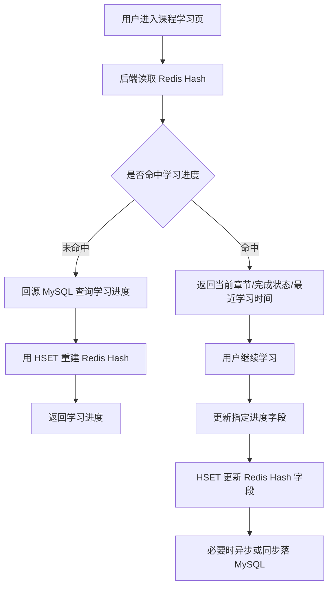

# 第 8 章：Hashes：适合对象字段状态和局部更新

## 1. 本章一句话

Hashes 适合保存“一个对象下多个字段”的状态，例如用户学习进度、活动运行状态、用户会话状态；Redis 官方说明 Hashes 是由 field-value pairs 组成的 record types，可以用于表示基础对象和一组计数器。参考：[Redis 官方 Hashes 文档](https://redis.io/docs/latest/develop/data-types/hashes/)

本章核心判断：Hashes 适合字段相对稳定、需要局部读写的对象状态，不适合无限增长的明细列表。**标记：主观推断**

---

## 2. 适合解决什么问题？

| 场景         | 为什么适合                                                                                                                                           |
| ---------- | ----------------------------------------------------------------------------------------------------------------------------------------------- |
| 用户学习进度字段状态 | 一个用户在一门课程下通常有多个进度字段，例如当前章节、完成状态、最近学习时间、累计学习时长，Hashes 可以按字段局部读写。参考：[Redis 官方 Hashes 文档](https://redis.io/docs/latest/develop/data-types/hashes/) |
| 活动运行状态     | 活动状态、参与人数、开始时间、结束时间等字段可以放在同一个 Hash 对象里，适合字段级读取和更新。**标记：主观推断**                                                                                   |
| 用户会话状态     | 登录设备、最近活跃时间、临时状态等字段属于同一个会话对象，适合用 Hashes 表达对象字段。**标记：主观推断**                                                                                      |

---

## 3. 主案例

```text
主案例：用户学习进度字段状态

业务背景：
用户学习课程时，后端需要频繁读取和更新当前章节、完成状态、最近学习时间、累计学习时长等字段。

核心原因：
相比把整个学习进度 JSON 存成 String，Hashes 更适合对单个字段做局部读写，避免每次只改一个字段却读写整个对象。**标记：主观推断**
```

辅助案例：

* 活动运行状态：适合保存活动状态、参与人数、阶段、开始时间、结束时间，重点关注字段边界和事实源。**标记：主观推断**
* 用户会话状态：适合保存设备、登录时间、最近活跃时间，重点关注 TTL 和过期策略。**标记：主观推断**
* 对象字段局部更新：适合字段相对稳定的对象，不适合无限追加明细。**标记：主观推断**

---

## 4. 核心流程



说明：

* `HSET` 可以创建或修改 Hash 中字段的值，适合更新学习进度里的某个字段。参考：[Redis 官方 HSET 文档](https://redis.io/docs/latest/commands/hset/)
* `HGET` 可以读取 Hash 中单个字段，`HMGET` 可以一次读取多个字段，适合学习页只取需要展示的进度字段。参考：[Redis 官方 HGET 文档](https://redis.io/docs/latest/commands/hget/)；参考：[Redis 官方 HMGET 文档](https://redis.io/docs/latest/commands/hmget/)
* 学习结果、完成记录、结算类数据不应该只放 Redis，MySQL 应保留可复查的事实数据。**标记：主观推断**
* Hashes 的优势是对象字段局部读写，不是承载无限增长的学习行为明细。**标记：主观推断**

---

## 5. 关键命令

| 命令                                                                                     | 作用                                                                                                       |
| -------------------------------------------------------------------------------------- | -------------------------------------------------------------------------------------------------------- |
| `HSET user:course:progress:{userId}:{courseId} current_lesson lesson_3`                | 更新用户当前学习章节。参考：[Redis 官方 HSET 文档](https://redis.io/docs/latest/commands/hset/)                            |
| `HGET user:course:progress:{userId}:{courseId} current_lesson`                         | 读取用户当前学习章节。参考：[Redis 官方 HGET 文档](https://redis.io/docs/latest/commands/hget/)                            |
| `HMGET user:course:progress:{userId}:{courseId} current_lesson status last_learned_at` | 一次读取多个学习进度字段。参考：[Redis 官方 HMGET 文档](https://redis.io/docs/latest/commands/hmget/)                        |
| `HDEL user:course:progress:{userId}:{courseId} temp_state`                             | 删除不再需要的临时字段；`HDEL` 用于删除 Hash 中一个或多个字段。参考：[Redis 官方 HDEL 文档](https://redis.io/docs/latest/commands/hdel/) |

---

## 6. 边界和坑

| 问题           | 说明                                                                                                                                                              |
| ------------ | --------------------------------------------------------------------------------------------------------------------------------------------------------------- |
| 字段无限增长       | Hashes 适合字段相对稳定的对象，不适合把每次学习行为、每次点击、每次播放记录都追加成字段。**标记：主观推断**                                                                                                     |
| 大 Hash 风险    | 如果一个 Hash 里字段过多，`HGETALL` 这类全量读取会变重；Redis 官方将 `HGETALL` 标为 slow，复杂度和 Hash 大小相关。参考：[Redis 官方 Hashes 文档](https://redis.io/docs/latest/develop/data-types/hashes/) |
| 对象边界不清       | 一个 key 应该表达一个清晰对象，例如一个用户一门课程的进度；不要把多个用户或多门课程混在一个 Hash 里。**标记：主观推断**                                                                                             |
| 把 Redis 当事实源 | 用户最终完成记录、证书、积分、结算结果等关键事实不能只依赖 Redis Hash。**标记：主观推断**                                                                                                            |
| TTL 策略不清     | 学习进度如果只是缓存，可以设置 TTL；如果是关键事实，必须落 MySQL，不能靠 Redis 过期数据保证正确性。**标记：主观推断**                                                                                           |

---

## 7. 本章记忆点

1. Hashes 适合“一个对象多个字段”，核心价值是字段级局部读写。
2. 用户学习进度、活动状态、会话状态适合 Hashes；学习行为明细、无限列表不适合 Hashes。
3. Redis Hash 可以加速状态读取，但最终学习结果和可复查事实仍要落 MySQL。**标记：主观推断**
