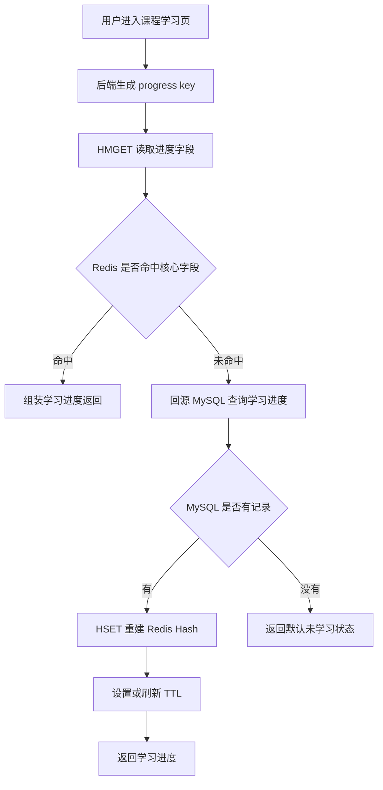
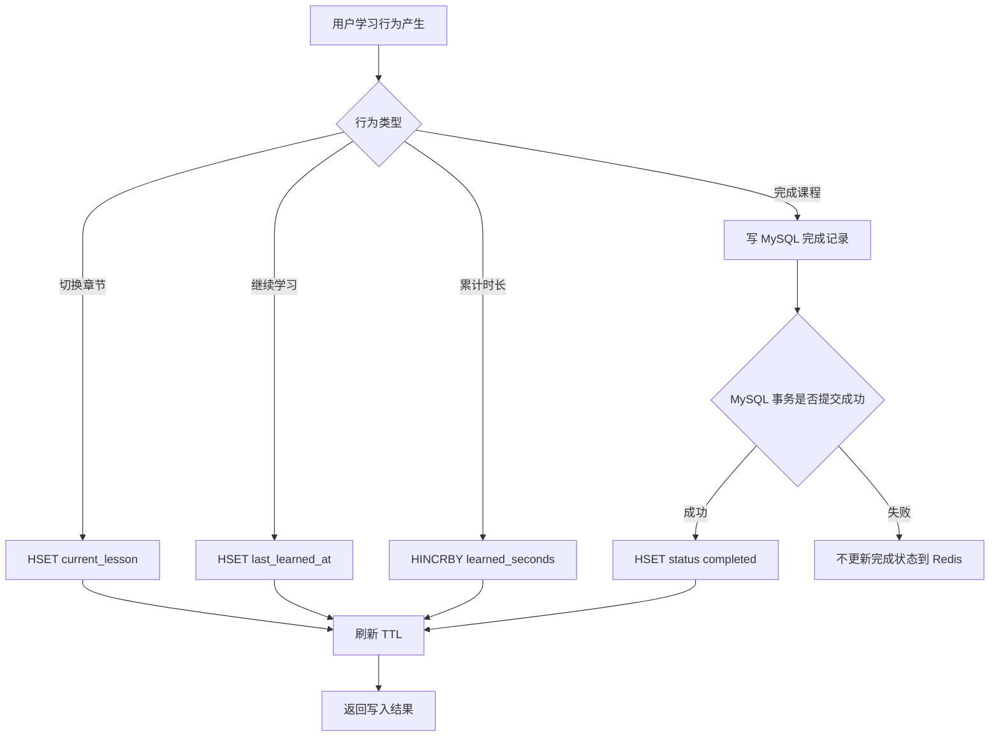
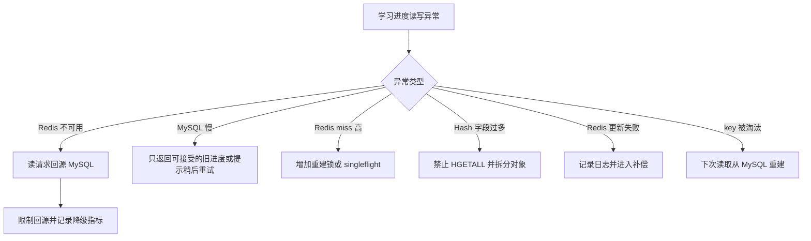
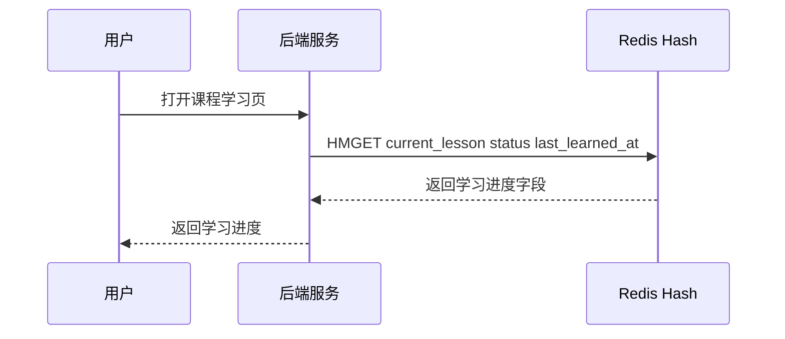
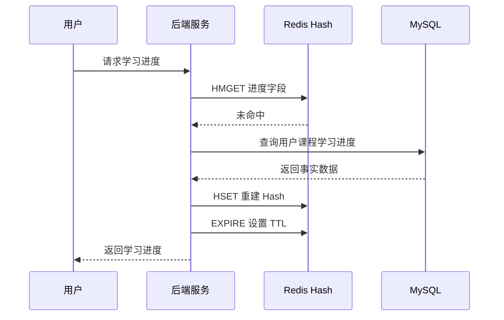
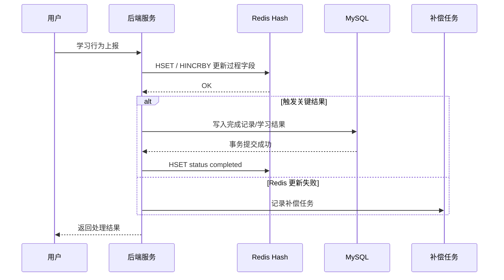

# Redis 知识点：Hashes

## 1. 一句话结论

> Redis Hashes 适合表示“一个对象下多个字段”的数据结构，例如用户学习进度、活动状态、会话状态；Redis 官方说明 Hashes 是由 field-value pairs 组成的 record types，可用于表示基础对象和一组计数器。参考：[Redis 官方 Hashes 文档](https://redis.io/docs/latest/develop/data-types/hashes/)
> 在用户学习进度场景中，Redis Hash 更适合做字段状态缓存和局部更新；最终完成记录、学习结果、积分、证书等可复查事实仍应以 MySQL 为事实源。标记：主观推断

---

## 2. 这个知识点是什么？

Redis Hashes 是 Redis 中用于保存“对象字段”的数据类型。

可以把一个 Hash 理解成：

```text
一个 Redis key = 一个对象
Hash field = 对象里的字段名
Hash value = 字段值
```

例如用户在某门课程下的学习进度，可以表示成：

```text
key: user:course:progress:{userId}:{courseId}

field:
current_lesson
status
last_learned_at
learned_seconds
completed_lessons
```

Hashes 的核心特点不是“能存很多数据”，而是它适合表达字段相对稳定的对象状态，并支持按字段读取和更新。标记：主观推断

Redis 官方文档说明，Hashes 是 field-value pairs 组成的 record types，可以用来表示基础对象，也可以存储一组计数器。参考：[Redis 官方 Hashes 文档](https://redis.io/docs/latest/develop/data-types/hashes/)

---

## 3. 它解决什么业务问题？

业务场景：用户学习进度字段状态。

用户进入课程学习页时，后端需要快速知道：

* 当前学到哪一节。
* 当前课程是否完成。
* 最近学习时间。
* 累计学习时长。
* 已完成小节数。
* 是否有临时学习状态。

如果每次都查 MySQL，接口读压力会升高；如果用 String 存完整 JSON，每次只改一个字段也要读写整个对象。使用 Redis Hashes，可以把这些字段放在同一个对象里，并按字段局部读取或更新。标记：主观推断

| 业务问题                | 具体表现                             | Redis 如何解决                                                                                                                                                             |
| ------------------- | -------------------------------- | ---------------------------------------------------------------------------------------------------------------------------------------------------------------------- |
| 学习页高频读取进度           | 用户每次进入课程页、切换章节、继续学习都要读取进度        | 用 `HGET` / `HMGET` 读取单个或多个进度字段。参考：[Redis 官方 HGET 文档](https://redis.io/docs/latest/commands/hget/)；参考：[Redis 官方 HMGET 文档](https://redis.io/docs/latest/commands/hmget/) |
| 只更新少数字段             | 用户继续学习时，通常只更新当前章节、最近学习时间、累计时长    | 用 `HSET` 更新指定字段，不需要重写整个 JSON。参考：[Redis 官方 HSET 文档](https://redis.io/docs/latest/commands/hset/)                                                                        |
| 累计学习时长需要递增          | 用户每学习一段时间，需要累加 `learned_seconds` | 用 `HINCRBY` 对 Hash 中的整数字段递增。参考：[Redis 官方 HINCRBY 文档](https://redis.io/docs/latest/commands/hincrby/)                                                                   |
| MySQL 不适合承接所有过程状态读写 | 学习过程状态更新频繁，但不一定每次都需要强事务写库        | Redis 承接高频过程状态，关键学习结果再落 MySQL。标记：主观推断                                                                                                                                  |

---

## 4. Redis 为什么适合？

| Redis 能力               | 对应业务价值                                            | 证据 / 标记                                                                                                                                                                |
| ---------------------- | ------------------------------------------------- | ---------------------------------------------------------------------------------------------------------------------------------------------------------------------- |
| Hash 表达 field-value 对象 | 学习进度天然是“一个用户一门课下面多个字段”                            | Redis 官方说明 Hashes 是 field-value pairs 组成的 record types。参考：[Redis 官方 Hashes 文档](https://redis.io/docs/latest/develop/data-types/hashes/)                                |
| `HSET` 字段级写入           | 只更新 `current_lesson` 或 `last_learned_at`，不用重写整个对象 | `HSET` 用于创建或修改 Hash 中字段的值。参考：[Redis 官方 HSET 文档](https://redis.io/docs/latest/commands/hset/)                                                                           |
| `HGET` / `HMGET` 字段级读取 | 学习页可以只取当前章节、状态、最近学习时间等必要字段                        | `HGET` 返回单个字段值，`HMGET` 返回多个字段值。参考：[Redis 官方 HGET 文档](https://redis.io/docs/latest/commands/hget/)；参考：[Redis 官方 HMGET 文档](https://redis.io/docs/latest/commands/hmget/) |
| `HINCRBY` 原子递增整数字段     | 累计学习时长、已完成小节数这类计数可以直接递增                           | `HINCRBY` 会递增 Hash 字段中的整数值，不存在时以 0 初始化。参考：[Redis 官方 HINCRBY 文档](https://redis.io/docs/latest/commands/hincrby/)                                                        |
| key 级 TTL              | 临时学习状态可以整体设置过期时间，避免长期占用内存                         | `EXPIRE` 可给 key 设置过期时间。参考：[Redis 官方 EXPIRE 文档](https://redis.io/docs/latest/commands/expire/)                                                                          |

---

## 5. 它的边界是什么？

| 边界           | 说明                                                                                                                         | 更合适的选择                    |
| ------------ | -------------------------------------------------------------------------------------------------------------------------- | ------------------------- |
| 不适合无限增长明细    | 每次学习行为、播放事件、点击日志不应不断追加成 Hash field，否则字段会无限增长。标记：主观推断                                                                       | MySQL 明细表 / 日志系统 / Stream |
| 不适合替代事实表     | 最终完成记录、证书、积分、结算结果必须可复查，不能只放 Redis Hash。标记：主观推断                                                                             | MySQL                     |
| 不适合复杂关系查询    | Hash 只能表达一个对象的字段，不适合做课程、用户、班级、学习记录之间的复杂关联查询。标记：主观推断                                                                        | MySQL                     |
| 不适合大对象全量读取   | `HGETALL` 返回所有字段和值，复杂度与 Hash 大小相关，Hash 变大后全量读取会变重。参考：[Redis 官方 HGETALL 文档](https://redis.io/docs/latest/commands/hgetall/) | 限制字段数量；用 `HMGET` 精确读取     |
| 不适合对象边界不清的缓存 | 不要把多个用户、多门课程、多个业务对象混到一个 Hash 里。标记：主观推断                                                                                     | 一个业务对象一个 key              |

---

## 6. 常见坑是什么？

| 常见坑                  | 线上风险                                          | 规避方式                                                                                       |
| -------------------- | --------------------------------------------- | ------------------------------------------------------------------------------------------ |
| 字段无限增长               | Hash 逐渐变成大 Hash，读取、扫描、删除都变重                   | 字段名必须提前设计，只放稳定字段；学习行为明细另建表或走日志。标记：主观推断                                                     |
| 滥用 `HGETALL`         | 每次都全量读取所有字段，Hash 变大后接口延迟上升                    | 学习页按需用 `HMGET` 读取必要字段。参考：[Redis 官方 HMGET 文档](https://redis.io/docs/latest/commands/hmget/) |
| 把 Redis Hash 当事实源    | Redis 丢失、过期、被淘汰后，学习结果无法复查                     | MySQL 保存最终完成记录和关键学习结果。标记：主观推断                                                              |
| TTL 策略不清             | 过期太短导致频繁 miss，过期太长导致内存占用和旧状态问题                | 临时过程状态设置 TTL；关键事实落 MySQL。标记：主观推断                                                           |
| 对象边界设计混乱             | 一个 Hash 里混入多个课程或多个用户，后续难以维护和清理                | key 设计成 `user:course:progress:{userId}:{courseId}`，一个 key 只表达一个学习进度对象。标记：主观推断              |
| Redis / MySQL 更新顺序不清 | Redis 已更新但 MySQL 写失败，或 MySQL 已提交但 Redis 旧值未清理 | 先写 MySQL 事实，再更新或删除 Redis；失败进入补偿。标记：主观推断                                                    |

---

## 7. MySQL / 本地缓存 / 其他方案是否更合适？

| 方案            | 是否适合      | 原因                                                                                                                          |
| ------------- | --------- | --------------------------------------------------------------------------------------------------------------------------- |
| MySQL         | 必须保留      | MySQL 适合保存最终学习结果、完成记录、积分、证书等可复查事实。标记：主观推断                                                                                   |
| Redis Hashes  | 适合做字段状态缓存 | 学习进度是“一个对象多个字段”，Hash 支持字段级读写和计数递增，适合过程状态加速。参考：[Redis 官方 Hashes 文档](https://redis.io/docs/latest/develop/data-types/hashes/) |
| Redis String  | 部分适合      | 如果学习进度只是完整 JSON 快照，String 可以用；但频繁局部字段更新时，Hash 更合适。标记：主观推断                                                                   |
| Redis JSON    | 部分适合      | 如果进度对象层级复杂、需要 JSON 局部路径读写，可以考虑 Redis JSON；简单字段状态不一定需要引入。标记：主观推断                                                             |
| 本地缓存          | 不适合作为主方案  | 用户学习进度是用户级动态状态，本地缓存会带来多实例一致性和失效问题。标记：主观推断                                                                                   |
| Stream / 日志系统 | 适合学习行为明细  | 每次播放、暂停、完成小节这类行为事件更像明细流，不适合塞进 Hash 字段。标记：主观推断                                                                               |

最终判断：

> 用户学习进度字段状态适合 Redis Hashes；最终学习结果必须 MySQL 兜底；行为明细不要塞进 Hash。标记：主观推断

---

## 8. 具体业务场景例子

### 8.1 场景背景

业务：用户进入课程学习页时，后端需要返回该用户在当前课程下的学习进度。

接口示例：

```text
GET /api/courses/{courseId}/progress
```

需要返回的数据：

```json
{
  "currentLesson": "lesson_3",
  "status": "learning",
  "lastLearnedAt": "2026-07-05T12:00:00Z",
  "learnedSeconds": 3600,
  "completedLessons": 8
}
```

数据来源：

* MySQL 保存用户课程学习事实数据。
* Redis Hash 缓存高频读取和更新的学习进度字段。
* 后台任务或业务写流程把关键学习结果同步到 MySQL。
* Redis 只作为加速层和过程状态层，不作为唯一事实源。

标记：主观推断

---

### 8.2 业务问题

如果不用 Redis Hashes，可能会遇到这些问题：

| 业务问题              | 具体表现                                      |
| ----------------- | ----------------------------------------- |
| 高频查询打到 MySQL      | 用户进入课程页、切换章节、继续学习时都会查学习进度。标记：主观推断         |
| String JSON 更新成本高 | 每次只更新当前章节或最近学习时间，也要重写整个 JSON。标记：主观推断      |
| 学习过程状态变化频繁        | 播放中、最近学习时间、累计时长等过程状态可能频繁变化。标记：主观推断        |
| 事实数据和缓存数据混淆       | 如果只写 Redis，不写 MySQL，后续审计、恢复、补偿会困难。标记：主观推断 |

用了 Redis Hashes 后：

* 读取进度时可以用 `HMGET` 读取多个字段。
* 更新章节时可以用 `HSET` 更新单个字段。
* 累计时长时可以用 `HINCRBY` 原子递增。
* MySQL 仍然保存最终完成记录和关键结果。

标记：主观推断

---

### 8.3 Redis 设计

```text
Redis key:
user:course:progress:{userId}:{courseId}

Redis value:
Hash fields:
- current_lesson: 当前学习小节 ID
- status: learning / completed / paused
- last_learned_at: 最近学习时间
- learned_seconds: 累计学习秒数
- completed_lessons: 已完成小节数
- temp_state: 临时播放状态，可选

TTL:
如果 Redis Hash 只是缓存，可以设置 7 到 30 天 TTL。
如果是活跃学习中的过程状态，可以每次更新时刷新 key TTL。
最终学习结果不能依赖 Redis TTL，必须落 MySQL。
标记：主观推断

MySQL:
保存用户课程学习事实数据，例如 user_course_progress、user_lesson_progress、course_completion_record。
MySQL 是最终事实源。
标记：主观推断

降级:
Redis 不可用时，读取走 MySQL 回源；写入关键结果必须写 MySQL。
非关键临时状态可以丢弃或延迟补偿。
标记：主观推断
```

关键依据：

* `HSET` 可创建或修改 Hash 字段值。参考：[Redis 官方 HSET 文档](https://redis.io/docs/latest/commands/hset/)
* `HGET` / `HMGET` 可读取单个或多个字段。参考：[Redis 官方 HGET 文档](https://redis.io/docs/latest/commands/hget/)；参考：[Redis 官方 HMGET 文档](https://redis.io/docs/latest/commands/hmget/)
* `EXPIRE` 可给 key 设置过期时间。参考：[Redis 官方 EXPIRE 文档](https://redis.io/docs/latest/commands/expire/)

---

### 8.4 读流程



说明：

* `HMGET` 可以一次读取 Hash 中多个字段，适合学习页同时读取当前章节、状态和最近学习时间。参考：[Redis 官方 HMGET 文档](https://redis.io/docs/latest/commands/hmget/)
* Redis miss 后回源 MySQL，是为了让 MySQL 作为学习进度事实源。**标记：主观推断**
* 回源后重建 Redis Hash，可以降低后续学习页访问 MySQL 的次数。**标记：主观推断**
* 如果 MySQL 也没有记录，可以返回默认未学习状态，但是否写入空缓存要看业务访问频率。**标记：主观推断**

---

### 8.5 写流程



说明：

* `HSET` 适合更新 Hash 中的单个学习进度字段。参考：[Redis 官方 HSET 文档](https://redis.io/docs/latest/commands/hset/)
* `HINCRBY` 适合对累计学习时长这类整数字段做递增。参考：[Redis 官方 HINCRBY 文档](https://redis.io/docs/latest/commands/hincrby/)
* 课程完成、积分、证书这类关键事实应先写 MySQL，事务成功后再更新 Redis。**标记：主观推断**
* 如果 MySQL 写失败，不应只把 completed 写入 Redis，否则 Redis 会产生虚假的完成状态。**标记：主观推断**
* 过程状态可以先写 Redis，但必须明确哪些状态允许丢失、哪些状态必须补偿落库。**标记：主观推断**

---

### 8.6 异常处理



说明：

* `HGETALL` 的复杂度与 Hash 大小相关，字段过多时应避免把它作为高频读路径。参考：[Redis 官方 HGETALL 文档](https://redis.io/docs/latest/commands/hgetall/)
* Redis 不可用时，读请求可以回源 MySQL，但要限流，避免 Redis 故障扩大成 MySQL 故障。**标记：主观推断**
* key 被淘汰或过期后，只要 MySQL 是事实源，就可以重新构建 Redis Hash。**标记：主观推断**
* 学习完成状态不能随便返回旧值，因为它可能影响证书、积分、解锁下一课等业务结果。**标记：主观推断**
* 临时播放状态可以接受短暂丢失，但最终学习结果不能丢。**标记：主观推断**

---

### 8.7 监控指标

| 指标                              | 作用                                        |
| ------------------------------- | ----------------------------------------- |
| Redis QPS                       | 判断学习进度读写对 Redis 的访问压力。标记：主观推断             |
| Redis P95 / P99 延迟              | 判断 Hash 操作是否出现延迟抖动。标记：主观推断                |
| keyspace_hits / keyspace_misses | 判断学习进度缓存命中率。标记：主观推断                       |
| MySQL 回源次数                      | 判断 Redis miss 是否过高，是否需要优化 TTL 或预热。标记：主观推断 |
| `HGETALL` 调用次数                  | 判断是否有人滥用全量读取。标记：主观推断                      |
| Hash 字段数量                       | 判断是否出现字段无限增长。标记：主观推断                      |
| Redis 更新失败次数                    | 判断学习进度写 Redis 是否稳定。标记：主观推断                |
| 补偿任务积压数                         | 判断 Redis / MySQL 同步是否出现长期不一致。标记：主观推断      |
| expired_keys / evicted_keys     | 判断 key 是否频繁过期或被淘汰。标记：主观推断                 |
| slowlog                         | 判断是否存在慢命令影响 Redis 主线程。标记：主观推断             |

---

## 9. Mermaid 图

### 9.1 Redis 命中流程



说明：

* `HMGET` 适合一次读取多个 Hash 字段。参考：[Redis 官方 HMGET 文档](https://redis.io/docs/latest/commands/hmget/)
* 命中 Redis 时，不需要每次都查 MySQL。**标记：主观推断**

---

### 9.2 Redis 未命中 + MySQL 回源流程



说明：

* `HSET` 可以创建或修改 Hash 字段值。参考：[Redis 官方 HSET 文档](https://redis.io/docs/latest/commands/hset/)
* `EXPIRE` 可以给 key 设置过期时间。参考：[Redis 官方 EXPIRE 文档](https://redis.io/docs/latest/commands/expire/)
* MySQL 回源后重建 Redis，是典型缓存重建路径。**标记：主观推断**

---

### 9.3 学习进度更新流程



说明：

* `HINCRBY` 适合递增 Hash 中的整数字段。参考：[Redis 官方 HINCRBY 文档](https://redis.io/docs/latest/commands/hincrby/)
* 过程状态和最终事实要分开处理。**标记：主观推断**
* Redis 更新失败需要记录日志或补偿，不能静默丢失关键状态。**标记：主观推断**

---

## 10. 工程评审关注点

| 关注点   | 说明                                                                                                                                           |
| ----- | -------------------------------------------------------------------------------------------------------------------------------------------- |
| 架构合理性 | 为什么这里要用 Redis Hash？回答方向：学习进度是一个对象多个字段，Hash 支持字段级读写，比完整 JSON 更适合局部更新。标记：主观推断                                                                  |
| 类型选择  | 为什么不用 String？回答方向：String 适合完整快照，Hash 更适合频繁局部字段更新。标记：主观推断                                                                                     |
| 一致性   | Redis 和 MySQL 不一致怎么办？回答方向：MySQL 保存最终事实，Redis miss 或异常时从 MySQL 重建。标记：主观推断                                                                     |
| 稳定性   | Redis 挂了怎么办？回答方向：读请求限流回源 MySQL，写关键结果必须落 MySQL，临时状态可降级。标记：主观推断                                                                                |
| 性能    | Hash 会不会变大？回答方向：限制字段集合，禁止无限追加明细，高频读取避免 `HGETALL`。参考：[Redis 官方 HGETALL 文档](https://redis.io/docs/latest/commands/hgetall/)                    |
| 成本    | key 数量怎么估算？回答方向：按用户课程维度估算，活跃学习用户保留 TTL，历史事实放 MySQL。标记：主观推断                                                                                   |
| 可恢复性  | Redis 数据丢了怎么恢复？回答方向：从 MySQL 用户课程进度表回源重建。标记：主观推断                                                                                              |
| 扩展性   | 后续字段变多怎么办？回答方向：稳定字段可继续放 Hash；明细、日志、行为事件拆出去。标记：主观推断                                                                                           |
| 线上风险  | 最大风险是把学习行为明细塞进 Hash，或把最终学习结果只放 Redis。标记：主观推断                                                                                                 |
| 版本相关  | 本次按 Redis Open Source 8.8.0 作为资料基准；Redis 官方已有 Redis 8.8 文档入口。参考：[Redis 官方 Redis 8.8 文档](https://redis.io/docs/latest/develop/whats-new/8-8/) |

---

## 11. 最终记忆点

1. Hashes 适合“一个对象多个字段”，核心价值是字段级读写。
2. 用户学习进度适合 Hash，但学习行为明细不适合塞进 Hash。
3. String 适合完整快照，Hash 适合局部字段更新。标记：主观推断
4. Redis Hash 可以加速过程状态读写，但最终学习结果必须 MySQL 兜底。标记：主观推断
5. Hashes 最大风险不是不会用命令，而是字段无限增长、对象边界不清、事实源不清。标记：主观推断

---

## 12. 参考资料

1. [Redis 官方 Hashes 文档](https://redis.io/docs/latest/develop/data-types/hashes/)：用于确认 Hashes 是 field-value pairs 组成的 record types，可表示基础对象和一组计数器。
2. [Redis 官方 HSET 文档](https://redis.io/docs/latest/commands/hset/)：用于确认 `HSET` 可以创建或修改 Hash 字段值。
3. [Redis 官方 HGET 文档](https://redis.io/docs/latest/commands/hget/)：用于确认 `HGET` 可以读取 Hash 中单个字段。
4. [Redis 官方 HMGET 文档](https://redis.io/docs/latest/commands/hmget/)：用于确认 `HMGET` 可以一次读取多个字段。
5. [Redis 官方 HINCRBY 文档](https://redis.io/docs/latest/commands/hincrby/)：用于确认 `HINCRBY` 可以递增 Hash 中的整数字段。
6. [Redis 官方 HGETALL 文档](https://redis.io/docs/latest/commands/hgetall/)：用于确认 `HGETALL` 返回所有字段和值，复杂度与 Hash 大小相关。
7. [Redis 官方 EXPIRE 文档](https://redis.io/docs/latest/commands/expire/)：用于确认 key 级过期时间能力。
8. [Redis 官方 Redis 8.8 文档](https://redis.io/docs/latest/develop/whats-new/8-8/)：用于确认本次资料基准对应 Redis 8.8 官方文档。
