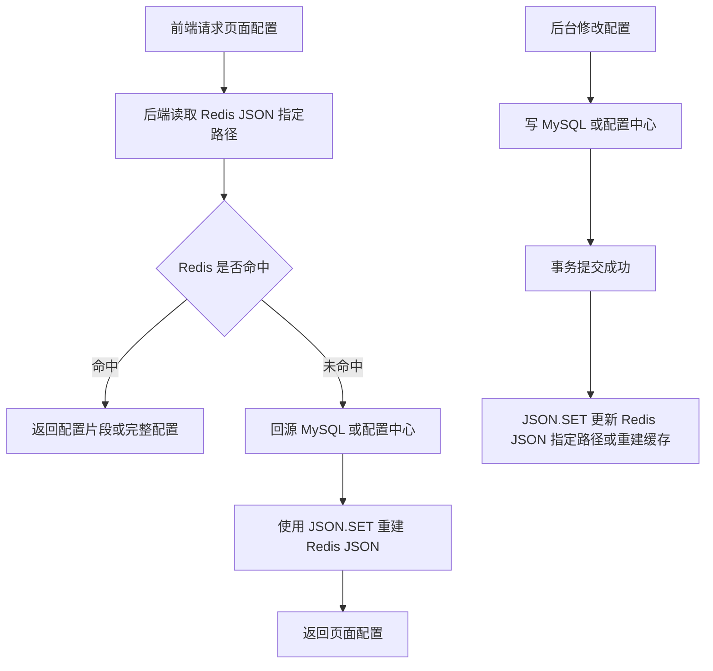

# 第 9 章：JSON：适合结构化、层级化对象的读写和局部查询

## 1. 本章一句话

Redis JSON 适合保存结构化、层级化的 JSON 文档，并支持按 JSONPath 访问和更新文档内部元素；Redis 官方说明 JSON 能在 Redis 中存储、更新和读取 JSON values。参考：[Redis 官方 JSON 文档](https://redis.io/docs/latest/develop/data-types/json/)

本章核心判断：JSON 适合“结构清晰、层级明确、需要局部访问或修改”的对象缓存，不适合大对象、过深嵌套和无限增长的明细数据。**标记：主观推断**

---

## 2. 适合解决什么问题？

| 场景                 | 为什么适合                                                                                                                                   |
| ------------------ | --------------------------------------------------------------------------------------------------------------------------------------- |
| 层级配置缓存             | 配置通常天然是多层结构，例如课程展示配置、活动规则配置、奖励配置；Redis JSON 可以按路径读取或更新局部配置。参考：[Redis 官方 JSON 文档](https://redis.io/docs/latest/develop/data-types/json/) |
| 结构化对象缓存            | Redis JSON 支持存储、更新、读取 JSON values，适合结构化对象缓存。参考：[Redis 官方 JSON 文档](https://redis.io/docs/latest/develop/data-types/json/)                |
| 需要局部访问或修改的 JSON 数据 | Redis 官方说明 JSON 可用 JSONPath 选择和更新文档内部元素，适合只读写对象的一部分。参考：[Redis 官方 JSON 文档](https://redis.io/docs/latest/develop/data-types/json/)        |

---

## 3. 主案例

```text
主案例：层级配置缓存

业务背景：
课程或活动页面有一份层级配置，例如页面展示区、按钮配置、奖励配置、规则说明、灰度开关等，前端每次进入页面都需要读取这份配置。

核心原因：
相比把整个 JSON 当 String 快照读写，Redis JSON 更适合对结构化配置做路径级读取和局部更新；但配置事实源仍建议保存在 MySQL 或配置中心，Redis 只做高频读取加速。**标记：主观推断**
```

辅助案例：

* 结构化对象缓存：适合保存层级清晰的对象，重点关注对象大小和字段边界。**标记：主观推断**
* 活动配置缓存：适合保存规则、展示、奖励等配置，重点关注后台修改后的缓存更新。**标记：主观推断**
* 局部访问 JSON 数据：适合只读取某个路径的数据，不适合无限追加明细。**标记：主观推断**

---

## 4. 核心流程



说明：

* `JSON.GET` 可以获取一个或多个路径上的 JSON 序列化值，适合读取层级配置中的指定路径。参考：[Redis 官方 JSON.GET 文档](https://redis.io/docs/latest/commands/json.get/)
* `JSON.SET` 可以设置 Redis key 上的 JSON value，也可以替换或新增指定路径上的值。参考：[Redis 官方 JSON.SET 文档](https://redis.io/docs/latest/commands/json.set/)
* 层级配置缓存里，Redis JSON 更适合作为结构化读模型，MySQL 或配置中心更适合作为配置事实源。**标记：主观推断**
* 后台修改配置后，应该先保证事实源写入成功，再更新或重建 Redis JSON，避免缓存先变更但事实源失败。**标记：主观推断**

---

## 5. 关键命令

| 命令                                                     | 作用                                                                                                                     |
| ------------------------------------------------------ | ---------------------------------------------------------------------------------------------------------------------- |
| `JSON.SET page:config:{pageId} $ '{...}'`              | 写入或重建整份页面层级配置。参考：[Redis 官方 JSON.SET 文档](https://redis.io/docs/latest/commands/json.set/)                               |
| `JSON.GET page:config:{pageId} $.layout.banner`        | 读取页面配置中的指定路径，例如 banner 配置。参考：[Redis 官方 JSON.GET 文档](https://redis.io/docs/latest/commands/json.get/)                   |
| `JSON.SET page:config:{pageId} $.rules.reward '{...}'` | 局部更新奖励规则配置，避免重写整个对象。参考：[Redis 官方 JSON.SET 文档](https://redis.io/docs/latest/commands/json.set/)                         |
| `EXPIRE page:config:{pageId} 3600`                     | 给配置缓存设置过期时间，避免缓存长期不刷新；`EXPIRE` 用于设置 key 的秒级过期时间。参考：[Redis 官方 EXPIRE 文档](https://redis.io/docs/latest/commands/expire/) |

---

## 6. 边界和坑

| 问题                 | 说明                                                                           |
| ------------------ | ---------------------------------------------------------------------------- |
| 对象过大               | Redis JSON 虽然支持结构化文档，但大对象会增加内存、网络传输和局部操作成本；配置对象要控制大小。**标记：主观推断**             |
| 结构过深               | 过深的 JSON 层级会让路径读写、维护和排查变复杂；配置结构应保持清晰。**标记：主观推断**                             |
| 当成无限明细库            | Redis JSON 不适合保存不断追加的行为日志、订单明细、学习记录明细；这类数据应放 MySQL、日志系统或消息流。**标记：主观推断**      |
| 和 String JSON 边界不清 | 如果只是完整读写一份 JSON 快照，String 可能更简单；只有需要局部路径访问或修改时，Redis JSON 的价值更明显。**标记：主观推断** |
| 把 Redis 当事实源       | 配置最终版本、审核状态、发布时间等关键事实不应只放 Redis；Redis 丢失后必须能从 MySQL 或配置中心重建。**标记：主观推断**      |

---

## 7. 本章记忆点

1. Redis JSON 的核心价值是“结构化文档 + 路径级读写”，不是简单把 JSON 字符串塞进 Redis。
2. 层级配置、结构化对象、局部修改场景适合 JSON；大对象、深层嵌套、无限明细不适合。
3. Redis JSON 适合做结构化缓存和读模型，配置事实源仍应在 MySQL 或配置中心。**标记：主观推断**
