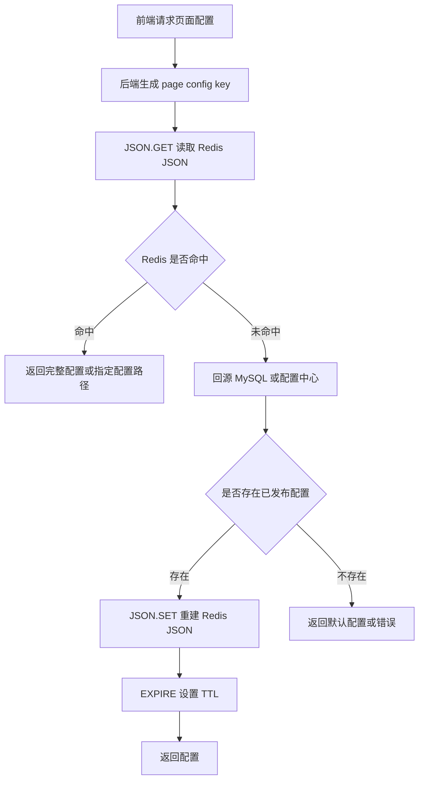
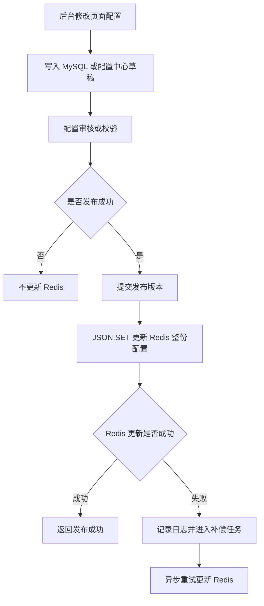
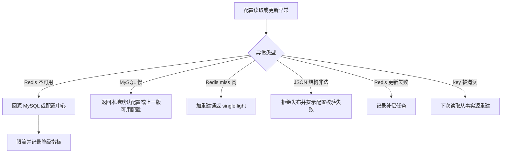
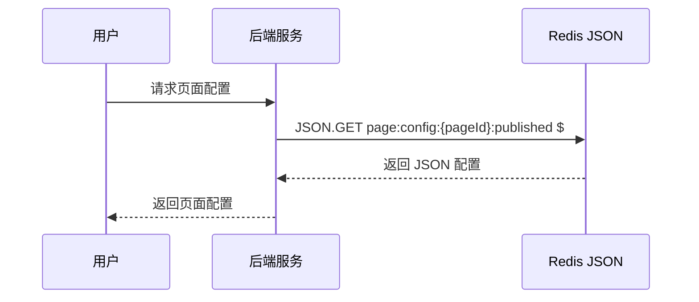
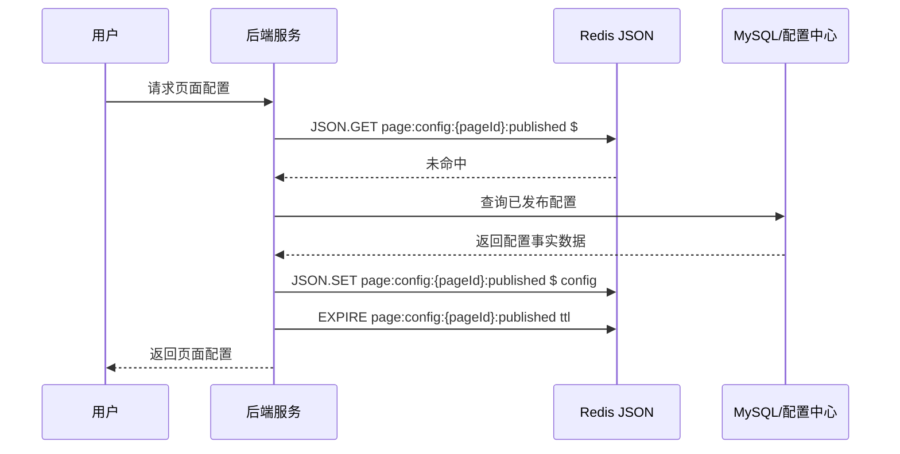
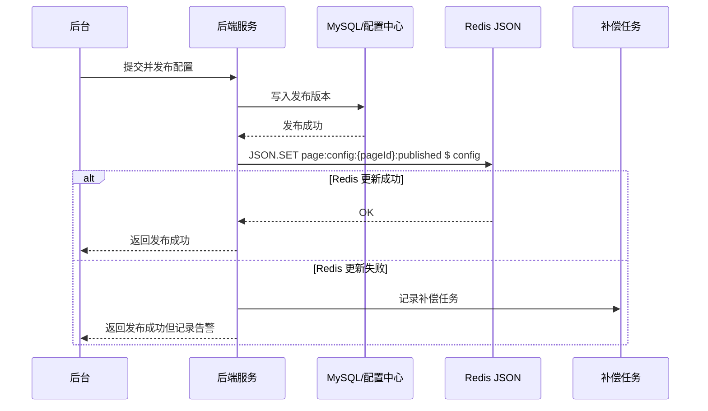

# Redis 知识点：JSON

## 1. 一句话结论

> Redis JSON 适合存储、读取和更新结构化 JSON 文档，并支持使用 JSONPath 访问或修改文档内部元素。参考：[Redis 官方 JSON 文档](https://redis.io/docs/latest/develop/data-types/json/)
> 在层级配置缓存场景中，Redis JSON 适合做结构化配置的高频读取和局部更新缓存；配置事实源仍建议放在 MySQL 或配置中心。标记：主观推断

---

## 2. 这个知识点是什么？

Redis JSON 是 Redis Open Source 中用于存储 JSON 文档的数据能力，它可以把 JSON 值作为 Redis 数据类型来存储、更新和读取。参考：[Redis 官方 JSON 文档](https://redis.io/docs/latest/develop/data-types/json/)

简单理解：

```text
Redis JSON = 把结构化 JSON 文档放进 Redis
JSON.GET = 按路径读取 JSON 内容
JSON.SET = 写入或局部更新 JSON 内容
```

它和普通 String 存 JSON 的区别是：String 更像“整份 JSON 快照”，Redis JSON 更强调“结构化文档 + 路径级访问 / 修改”。标记：主观推断

---

## 3. 它解决什么业务问题？

业务场景：层级配置缓存。

例如一个课程页或活动页有一份配置：

```json
{
  "layout": {
    "banner": {
      "title": "暑期活动",
      "image": "banner.png"
    },
    "modules": ["intro", "lessons", "reward"]
  },
  "rules": {
    "reward": {
      "enabled": true,
      "points": 100
    }
  },
  "gray": {
    "enabled": true,
    "userGroup": "A"
  }
}
```

这类配置有明显层级结构，前端可能只需要读取其中一部分，例如 banner、奖励规则或灰度开关；后台也可能只修改某个路径，例如 `$.rules.reward.points`。标记：主观推断

| 业务问题             | 具体表现                                   | Redis 如何解决                                                                                                                   |
| ---------------- | -------------------------------------- | ---------------------------------------------------------------------------------------------------------------------------- |
| 配置结构层级多          | 页面配置包含 layout、rules、gray、modules 等多层结构 | Redis JSON 支持存储结构化 JSON values。参考：[Redis 官方 JSON 文档](https://redis.io/docs/latest/develop/data-types/json/)                  |
| 只需要读取局部配置        | 页面首屏可能只读取 banner 或灰度开关                 | `JSON.GET` 可以读取一个或多个路径上的 JSON 序列化值。参考：[Redis 官方 JSON.GET 文档](https://redis.io/docs/latest/commands/json.get/)                |
| 后台只修改局部字段        | 运营只改奖励积分，不想重写整份配置                      | `JSON.SET` 可以设置 key 上的 JSON value，也可以替换或新增指定路径上的值。参考：[Redis 官方 JSON.SET 文档](https://redis.io/docs/latest/commands/json.set/) |
| MySQL / 配置中心读压力高 | 页面配置访问频繁，但修改频率相对低                      | Redis JSON 承接高频读取，事实源仍保留在 MySQL 或配置中心。标记：主观推断                                                                                |

---

## 4. Redis 为什么适合？

| Redis 能力        | 对应业务价值                             | 证据 / 标记                                                                                                                  |
| --------------- | ---------------------------------- | ------------------------------------------------------------------------------------------------------------------------ |
| 支持 JSON 文档      | 层级配置可以按原始结构保存，不必压平成多个字段            | Redis JSON 支持存储、更新和读取 JSON values。参考：[Redis 官方 JSON 文档](https://redis.io/docs/latest/develop/data-types/json/)           |
| 支持 JSONPath     | 可以按路径访问配置内部元素，例如 `$.layout.banner` | Redis JSON 支持 JSONPath syntax 用于选择和更新文档内部元素。参考：[Redis 官方 JSON 文档](https://redis.io/docs/latest/develop/data-types/json/) |
| `JSON.GET` 路径读取 | 页面只需要 banner、按钮、灰度配置时，可以按路径读取      | `JSON.GET` 返回指定路径上的 JSON 序列化值。参考：[Redis 官方 JSON.GET 文档](https://redis.io/docs/latest/commands/json.get/)                 |
| `JSON.SET` 局部更新 | 后台只修改奖励配置或灰度开关时，可以更新指定路径           | `JSON.SET` 可以替换或新增指定路径上的值。参考：[Redis 官方 JSON.SET 文档](https://redis.io/docs/latest/commands/json.set/)                     |
| key 级 TTL       | 配置缓存可以设置过期时间，避免旧配置长期留在 Redis       | `EXPIRE` 可设置 key 的秒级过期时间。参考：[Redis 官方 EXPIRE 文档](https://redis.io/docs/latest/commands/expire/)                          |

---

## 5. 它的边界是什么？

| 边界            | 说明                                           | 更合适的选择                    |
| ------------- | -------------------------------------------- | ------------------------- |
| 不适合只是完整快照读写   | 如果每次都读整份配置、写整份配置，String 存 JSON 可能更简单。标记：主观推断 | Redis String              |
| 不适合超大 JSON 对象 | 配置对象过大会增加内存、网络传输和路径操作成本。标记：主观推断              | 拆分配置 key / MySQL / 配置中心   |
| 不适合结构过深       | 过深层级会让 JSONPath、排查、兼容变复杂。标记：主观推断             | 简化配置结构                    |
| 不适合无限明细存储     | 行为日志、订单明细、学习记录明细不应不断塞进 JSON 数组。标记：主观推断       | MySQL 明细表 / 日志系统 / Stream |
| 不适合替代事实源      | 配置版本、发布状态、审核记录、回滚记录需要可复查，不能只放 Redis。标记：主观推断  | MySQL / 配置中心              |

---

## 6. 常见坑是什么？

| 常见坑                   | 线上风险                             | 规避方式                                         |
| --------------------- | -------------------------------- | -------------------------------------------- |
| 把 JSON 当成“万能对象库”      | 所有配置、明细、日志都往一个 JSON 里塞，后续变成大 key | 限制对象大小，按页面、业务、版本拆 key。标记：主观推断                |
| 结构过深                  | 后台修改路径容易写错，前端读取路径也难维护            | 配置结构控制在少数层级，关键路径统一封装。标记：主观推断                 |
| 局部更新覆盖风险              | 后台更新某个路径时，可能覆盖其他模块刚更新的内容         | 事实源先提交成功，再更新 Redis；必要时带版本号或更新时间校验。标记：主观推断    |
| Redis 与事实源不一致         | MySQL / 配置中心已修改，但 Redis 仍返回旧配置   | 后台发布成功后删除或更新 Redis，失败进入补偿。标记：主观推断            |
| 误以为 JSON 一定比 String 好 | 如果没有路径级读写需求，Redis JSON 可能只是增加复杂度 | 只有结构化、局部读取、局部修改明确存在时才优先考虑 Redis JSON。标记：主观推断 |

---

## 7. MySQL / 本地缓存 / 其他方案是否更合适？

| 方案           | 是否适合     | 原因                                                                                                    |
| ------------ | -------- | ----------------------------------------------------------------------------------------------------- |
| MySQL / 配置中心 | 必须保留     | 适合保存配置事实、版本、发布状态、审核记录和回滚记录。标记：主观推断                                                                    |
| Redis JSON   | 适合做结构化缓存 | 适合高频读取层级配置，并支持路径级读取和局部更新。参考：[Redis 官方 JSON 文档](https://redis.io/docs/latest/develop/data-types/json/) |
| Redis String | 部分适合     | 如果配置只是完整 JSON 快照，String 更简单；如果需要路径级读写，Redis JSON 更合适。标记：主观推断                                          |
| Redis Hash   | 部分适合     | 如果配置只是扁平字段，Hash 更简单；如果配置是多层 JSON，Redis JSON 更贴合。标记：主观推断                                               |
| 本地缓存         | 可作为二级缓存  | 对极热点配置可以加本地缓存，但要处理发布后的失效和多实例一致性。标记：主观推断                                                               |

最终判断：

> 层级配置缓存适合 Redis JSON，但 Redis JSON 不是配置系统本身；它更适合做结构化缓存层。标记：主观推断

---

## 8. 具体业务场景例子

### 8.1 场景背景

业务：课程详情页有一份页面配置，包括 banner、模块排序、按钮文案、奖励规则、灰度开关。

接口示例：

```text
GET /api/course-pages/{pageId}/config
```

配置来源：

* MySQL / 配置中心保存配置事实数据。
* Redis JSON 缓存当前已发布配置。
* 前端高频读取页面配置。
* 后台低频修改配置，发布成功后更新 Redis。

标记：主观推断

---

### 8.2 业务问题

如果不用 Redis JSON，可能会遇到这些问题：

| 业务问题                | 具体表现                                      |
| ------------------- | ----------------------------------------- |
| 每次都查配置中心或 MySQL     | 页面配置访问频繁，事实源读压力增加。标记：主观推断                 |
| String JSON 局部修改不方便 | 只改奖励积分，也可能需要读出整份 JSON、反序列化、修改、再写回。标记：主观推断 |
| 配置结构不清晰             | 把层级配置拆成很多扁平 key，维护成本升高。标记：主观推断            |
| 旧配置长期存在             | 缓存没有 TTL 或发布后未更新，用户看到旧配置。标记：主观推断          |

用了 Redis JSON 后：

* 读取配置时可用 `JSON.GET` 读取整份配置或指定路径。
* 修改配置时可用 `JSON.SET` 更新整份配置或局部路径。
* Redis 承接高频读，MySQL / 配置中心保留事实数据和版本记录。

标记：主观推断

---

### 8.3 Redis 设计

```text
Redis key:
page:config:{pageId}:published

Redis value:
JSON document:
{
  "version": 12,
  "layout": {
    "banner": {
      "title": "暑期活动",
      "image": "banner.png"
    },
    "modules": ["intro", "lessons", "reward"]
  },
  "rules": {
    "reward": {
      "enabled": true,
      "points": 100
    }
  },
  "gray": {
    "enabled": true,
    "userGroup": "A"
  },
  "updatedAt": "2026-07-05T12:00:00Z"
}

TTL:
如果配置变化少，可以设置较长 TTL，例如 1 小时到 1 天。
后台发布配置后主动更新或删除 Redis。
TTL 只是兜底，不是配置一致性的主要手段。
标记：主观推断

MySQL:
保存 page_config、page_config_version、publish_status、operator、published_at 等事实数据。
MySQL / 配置中心是事实源。
标记：主观推断

降级:
Redis 不可用时，读取 MySQL / 配置中心当前发布版本。
如果事实源压力较大，可以返回本地默认配置或上一版可用配置。
标记：主观推断
```

关键依据：

* `JSON.SET` 可以设置 Redis key 上的 JSON value，也可以设置指定路径上的值。参考：[Redis 官方 JSON.SET 文档](https://redis.io/docs/latest/commands/json.set/)
* `JSON.GET` 可以读取指定路径上的 JSON 序列化值。参考：[Redis 官方 JSON.GET 文档](https://redis.io/docs/latest/commands/json.get/)

---

### 8.4 读流程



说明：

* `JSON.GET` 可以获取一个或多个路径上的 JSON 序列化值，适合读取整份配置或局部路径。参考：[Redis 官方 JSON.GET 文档](https://redis.io/docs/latest/commands/json.get/)
* Redis miss 后回源 MySQL / 配置中心，是为了保证配置事实源可复查。**标记：主观推断**
* 回源后用 `JSON.SET` 重建 Redis JSON，可以降低后续高频配置读取压力。参考：[Redis 官方 JSON.SET 文档](https://redis.io/docs/latest/commands/json.set/)
* 默认配置只能用于兜底，不能替代真实已发布配置。**标记：主观推断**

---

### 8.5 写流程



说明：

* `JSON.SET` 可以写入整份 JSON，也可以替换或新增指定路径上的值。参考：[Redis 官方 JSON.SET 文档](https://redis.io/docs/latest/commands/json.set/)
* 配置发布成功后再更新 Redis，避免 Redis 缓存出现未正式发布的配置。**标记：主观推断**
* Redis 更新失败不应影响已经发布成功的事实源，但必须记录补偿，避免长期返回旧配置。**标记：主观推断**
* 如果配置存在多后台并发编辑，事实源需要版本控制，Redis 只缓存最终发布版本。**标记：主观推断**

---

### 8.6 异常处理



说明：

* Redis JSON 的写入值可以是 scalar、object 或 array；配置发布前需要保证 JSON 结构合法。参考：[Redis 官方 JSON.SET 文档](https://redis.io/docs/latest/commands/json.set/)
* Redis 不可用时可以回源 MySQL / 配置中心，但要限流，避免缓存故障扩散到事实源。**标记：主观推断**
* 页面配置可以返回上一版可用配置，但不能返回未审核、未发布的草稿配置。**标记：主观推断**
* 并发 miss 时建议用短锁或 singleflight 控制重建，避免大量请求同时回源。**标记：主观推断**
* key 被淘汰后，只要事实源存在，就可以重新 `JSON.SET` 重建缓存。**标记：主观推断**

---

### 8.7 监控指标

| 指标                              | 作用                              |
| ------------------------------- | ------------------------------- |
| Redis JSON 读取 QPS               | 判断页面配置读取压力。标记：主观推断              |
| Redis P95 / P99 延迟              | 判断 JSON 路径读取和大对象是否造成延迟。标记：主观推断  |
| keyspace_hits / keyspace_misses | 判断配置缓存命中率。标记：主观推断               |
| MySQL / 配置中心回源次数                | 判断 Redis miss 是否过高。标记：主观推断      |
| JSON 对象大小                       | 判断配置是否变成大对象。标记：主观推断             |
| Redis 更新失败次数                    | 判断后台发布后更新 Redis 是否稳定。标记：主观推断    |
| 补偿任务积压数                         | 判断 Redis 缓存是否长期落后事实源。标记：主观推断    |
| expired_keys / evicted_keys     | 判断配置缓存是否频繁过期或被淘汰。标记：主观推断        |
| slowlog                         | 判断是否存在慢命令或大对象操作影响 Redis。标记：主观推断 |

---

## 9. Mermaid 图

### 9.1 Redis 命中流程



说明：

* `JSON.GET` 返回指定路径上的 JSON 序列化值。参考：[Redis 官方 JSON.GET 文档](https://redis.io/docs/latest/commands/json.get/)
* 命中 Redis 时，不需要每次都访问 MySQL / 配置中心。**标记：主观推断**

---

### 9.2 Redis 未命中 + 回源重建流程



说明：

* `JSON.SET` 可设置 key 上的 JSON value。参考：[Redis 官方 JSON.SET 文档](https://redis.io/docs/latest/commands/json.set/)
* `EXPIRE` 可设置 key 过期时间。参考：[Redis 官方 EXPIRE 文档](https://redis.io/docs/latest/commands/expire/)
* 回源重建要受限流或重建锁保护，避免并发 miss 打爆事实源。**标记：主观推断**

---

### 9.3 后台发布配置流程



说明：

* 配置事实源发布成功后，再更新 Redis JSON。**标记：主观推断**
* Redis 更新失败需要补偿，避免长期返回旧配置。**标记：主观推断**

---

## 10. 工程评审关注点

| 关注点   | 说明                                                                                                                                                                                                                                             |
| ----- | ---------------------------------------------------------------------------------------------------------------------------------------------------------------------------------------------------------------------------------------------- |
| 架构合理性 | 为什么这里要用 Redis JSON？回答方向：层级配置天然是结构化 JSON，并且存在路径级读取 / 修改需求。标记：主观推断                                                                                                                                                                               |
| 类型选择  | 为什么不用 String？回答方向：String 适合完整快照；Redis JSON 更适合局部路径访问和修改。标记：主观推断                                                                                                                                                                                |
| 一致性   | Redis 和事实源不一致怎么办？回答方向：MySQL / 配置中心保存事实，Redis miss 或异常时从事实源重建。标记：主观推断                                                                                                                                                                           |
| 稳定性   | Redis 挂了怎么办？回答方向：限流回源事实源，必要时返回上一版可用配置或默认配置。标记：主观推断                                                                                                                                                                                             |
| 性能    | JSON 会不会变大？回答方向：限制配置大小，拆分大配置，监控对象大小和 Redis 延迟。标记：主观推断                                                                                                                                                                                          |
| 成本    | key 数量怎么估算？回答方向：按页面、活动、配置版本估算，过期历史 key。标记：主观推断                                                                                                                                                                                                 |
| 可恢复性  | Redis 数据丢了怎么恢复？回答方向：从 MySQL / 配置中心读取已发布版本并 `JSON.SET` 重建。标记：主观推断                                                                                                                                                                               |
| 扩展性   | 后续配置模块变多怎么办？回答方向：稳定层级可以继续保留，过大时按模块拆 key。标记：主观推断                                                                                                                                                                                                |
| 线上风险  | 最大风险是大 JSON、深层嵌套、未发布草稿误进 Redis、Redis 长期返回旧配置。标记：主观推断                                                                                                                                                                                           |
| 版本相关  | Redis 8.8 命令参考列出了 JSON 命令，JSON.SET 在 Redis 8.8 中还包含 FPHA 相关能力。参考：[Redis 官方 Redis 8.8 Commands Reference](https://redis.io/docs/latest/commands/redis-8-8-commands/)；参考：[Redis 官方 JSON.SET 文档](https://redis.io/docs/latest/commands/json.set/) |

---

## 11. 最终记忆点

1. Redis JSON 的核心价值是“结构化文档 + 路径级读写”。
2. 层级配置适合 Redis JSON；完整快照不一定需要 Redis JSON。标记：主观推断
3. Redis JSON 适合做配置缓存，不适合做配置事实源。标记：主观推断
4. 大对象、深层嵌套、无限明细，是 Redis JSON 最容易踩的坑。标记：主观推断
5. 后台发布配置要先写事实源，再更新 Redis；Redis 更新失败要补偿。标记：主观推断

---

## 12. 参考资料

1. [Redis 官方 JSON 文档](https://redis.io/docs/latest/develop/data-types/json/)：用于确认 Redis JSON 支持存储、更新、读取 JSON values，并支持 JSONPath 访问或更新文档元素。
2. [Redis 官方 JSON.GET 文档](https://redis.io/docs/latest/commands/json.get/)：用于确认 `JSON.GET` 可以获取一个或多个路径上的 JSON 序列化值。
3. [Redis 官方 JSON.SET 文档](https://redis.io/docs/latest/commands/json.set/)：用于确认 `JSON.SET` 可以设置 JSON value，并替换或新增指定路径的值。
4. [Redis 官方 EXPIRE 文档](https://redis.io/docs/latest/commands/expire/)：用于确认 Redis key 级过期时间能力。
5. [Redis 官方 Redis 8.8 Commands Reference](https://redis.io/docs/latest/commands/redis-8-8-commands/)：用于确认 Redis 8.8 命令参考中包含 JSON 命令。
