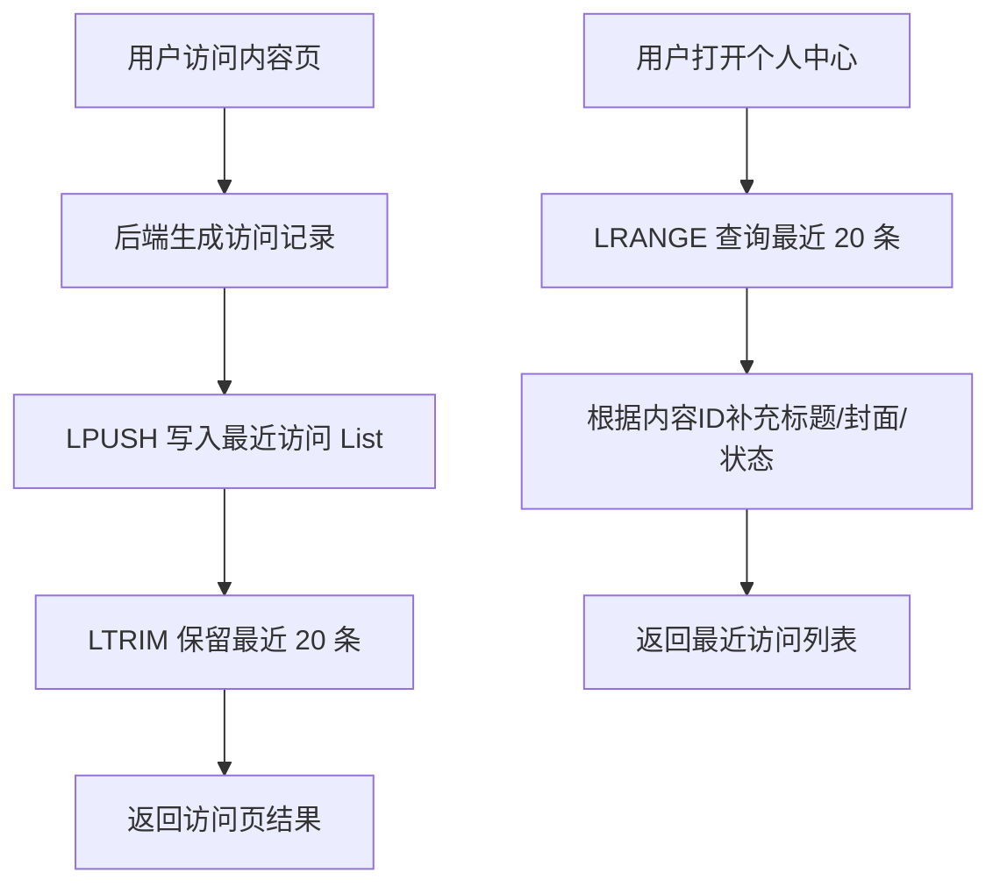

# 第 10 章：Lists：适合按插入顺序保存的简单列表和轻量队列

## 1. 本章一句话

Lists 适合保存按插入顺序排列的数据，例如最近访问记录、最近操作记录、简单待处理队列；`LPUSH` 可以把一个或多个元素插入 List 头部，不存在时会创建 key。参考：[Redis 官方 LPUSH 文档](https://redis.io/docs/latest/commands/lpush/)

本章核心判断：Lists 适合“只保留最近 N 条、用于展示或轻量处理”的顺序数据，不适合替代专业 MQ，也不适合承载必须可靠消费、可追踪、可重试的关键业务事实。**标记：主观推断**

---

## 2. 适合解决什么问题？

| 场景      | 为什么适合                                                                                                                                                                                                                                                                                |
| ------- | ------------------------------------------------------------------------------------------------------------------------------------------------------------------------------------------------------------------------------------------------------------------------------------ |
| 最近访问记录  | 最近访问记录天然按时间倒序展示，`LPUSH` 写入最新记录，`LRANGE` 查询前 N 条，`LTRIM` 控制只保留最近 N 条。参考：[Redis 官方 LPUSH 文档](https://redis.io/docs/latest/commands/lpush/)；参考：[Redis 官方 LRANGE 文档](https://redis.io/docs/latest/commands/lrange/)；参考：[Redis 官方 LTRIM 文档](https://redis.io/docs/latest/commands/ltrim/) |
| 操作流水缓存  | 只展示最近几十条操作时，List 可以按插入顺序保存最近记录，但完整操作日志仍应落 MySQL 或日志系统。**标记：主观推断**                                                                                                                                                                                                                    |
| 简单待处理队列 | List 可以做轻量队列，但消费者失败、重试、确认、堆积治理较弱，关键任务不应只依赖 List。**标记：主观推断**                                                                                                                                                                                                                          |

---

## 3. 主案例

```text
主案例：最近访问记录

业务背景：
用户访问课程、文章、活动页后，后端需要在个人中心展示“最近访问的 20 条内容”。

核心原因：
最近访问记录只关心时间顺序和最近 N 条，Lists 可以用 LPUSH 写入最新访问，用 LRANGE 读取最近记录，用 LTRIM 控制列表长度；它适合展示型缓存，不适合作为用户访问事实的唯一来源。**标记：主观推断**
```

辅助案例：

* 简单待处理队列：适合非关键、可丢或有 MySQL 任务表兜底的轻量任务，重点关注消费者失败。**标记：主观推断**
* 操作流水缓存：适合展示最近操作，完整审计日志仍要落 MySQL / 日志系统。**标记：主观推断**
* 轻量异步任务：适合临时削峰，不适合替代专业 MQ 的 ACK、重试、死信和堆积治理。**标记：主观推断**

---

## 4. 核心流程



说明：

* `LPUSH` 会把元素插入 List 头部，适合把最新访问记录放在最前面。参考：[Redis 官方 LPUSH 文档](https://redis.io/docs/latest/commands/lpush/)
* `LRANGE` 返回 List 指定范围内的元素，偏移从 0 开始，也支持负数偏移。参考：[Redis 官方 LRANGE 文档](https://redis.io/docs/latest/commands/lrange/)
* `LTRIM` 可以把 List 裁剪到指定范围；官方示例说明 `LPUSH` 搭配 `LTRIM 0 99` 可确保列表不超过 100 个元素。参考：[Redis 官方 LTRIM 文档](https://redis.io/docs/latest/commands/ltrim/)
* 最近访问记录更适合作为展示缓存，内容标题、封面、上下架状态仍应从 MySQL 或内容服务确认。**标记：主观推断**
* 如果访问记录需要审计、计费、推荐训练或长期分析，不能只放 Redis List。**标记：主观推断**

---

## 5. 关键命令

| 命令                                            | 作用                                                                                           |
| --------------------------------------------- | -------------------------------------------------------------------------------------------- |
| `LPUSH user:recent:view:{userId} <contentId>` | 把最新访问内容写到列表头部。参考：[Redis 官方 LPUSH 文档](https://redis.io/docs/latest/commands/lpush/)           |
| `LTRIM user:recent:view:{userId} 0 19`        | 只保留最近 20 条，避免 List 无限增长。参考：[Redis 官方 LTRIM 文档](https://redis.io/docs/latest/commands/ltrim/) |
| `LRANGE user:recent:view:{userId} 0 19`       | 查询最近 20 条访问记录。参考：[Redis 官方 LRANGE 文档](https://redis.io/docs/latest/commands/lrange/)         |

---

## 6. 边界和坑

| 问题         | 说明                                                                                                           |
| ---------- | ------------------------------------------------------------------------------------------------------------ |
| List 无限增长  | 只 `LPUSH` 不 `LTRIM` 会让最近访问记录越来越大，最终变成内存和查询风险。**标记：主观推断**                                                     |
| 重复访问记录     | 同一个内容多次访问可能重复出现；如果业务要求去重，需要额外处理，List 本身不适合做唯一性约束。**标记：主观推断**                                                 |
| 不适合关键事实    | 最近访问展示可以丢或重建，但审计、计费、学习记录、推荐训练数据必须落 MySQL / 日志系统。**标记：主观推断**                                                  |
| 不适合替代专业 MQ | List 可以做轻量队列，但可靠消费、ACK、重试、死信、消费组、消息回放不是它的核心优势。**标记：主观推断**                                                    |
| 范围查询过大     | `LRANGE` 的复杂度和起始距离、返回数量相关，不能一次性拉很大的范围。参考：[Redis 官方 LRANGE 文档](https://redis.io/docs/latest/commands/lrange/) |

---

## 7. 本章记忆点

1. Lists 最适合“按顺序保存最近 N 条”，例如最近访问、最近操作。
2. `LPUSH + LTRIM + LRANGE` 是最近记录场景的核心组合。
3. Lists 可以做轻量队列，但不能替代专业 MQ；关键事实必须有 MySQL / 日志系统兜底。**标记：主观推断**
