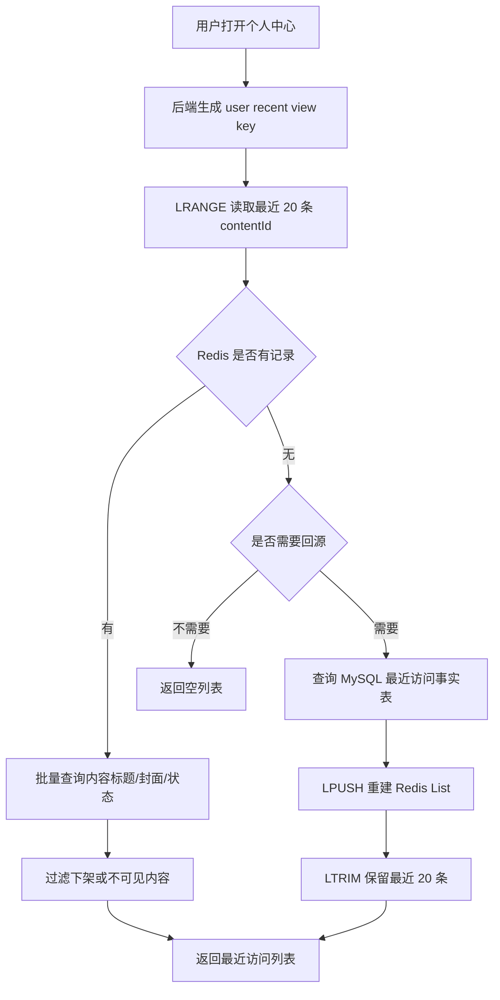
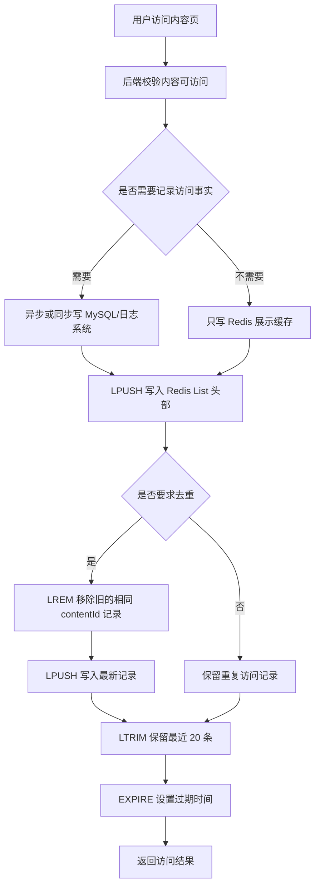
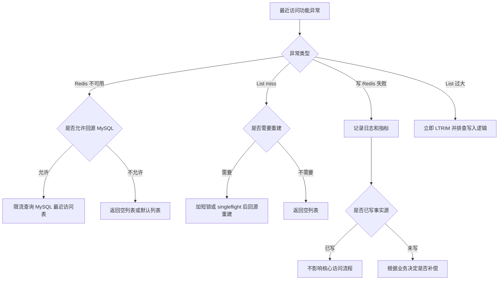
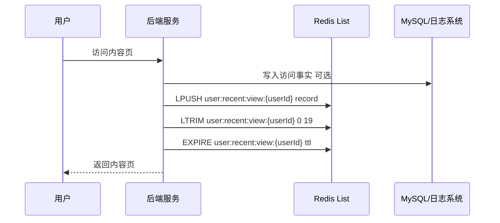
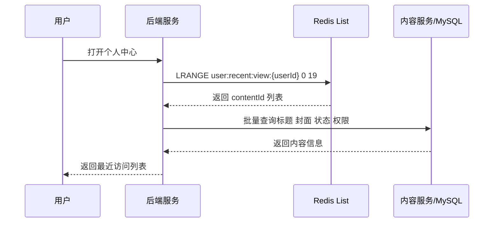
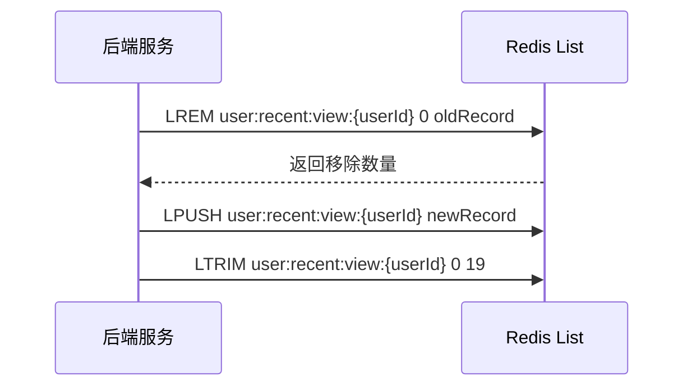

# Redis 知识点：Lists

## 1. 一句话结论

> Redis Lists 适合按插入顺序保存一组元素，典型用法是把最新数据插入列表头部，再按范围读取最近 N 条；`LPUSH` 可把元素插入列表头部，`LRANGE` 可按范围读取列表元素。参考：[Redis 官方 LPUSH 文档](https://redis.io/docs/latest/commands/lpush/)；参考：[Redis 官方 LRANGE 文档](https://redis.io/docs/latest/commands/lrange/)
> 在“最近访问记录”场景中，Lists 适合做展示型最近 N 条缓存，不适合承载必须长期可靠、可追溯、可恢复的访问事实。**标记：主观推断**

---

## 2. 这个知识点是什么？

Lists 是 Redis 中用于保存“有顺序的一组元素”的数据类型，适合表达“先后顺序”“最近记录”“简单队列”这类业务模型。**标记：主观推断**

从后端研发视角，可以这样理解：

```text id="nqf2re"
Redis List = 一个按顺序保存元素的列表

LPUSH = 从左侧插入新元素，常用于把最新记录放到最前面
LRANGE = 按下标范围读取元素，常用于读取最近 N 条
LTRIM = 裁剪列表范围，常用于只保留最近 N 条
```

`LPUSH` 会把一个或多个元素插入列表头部；如果 key 不存在，会创建这个 key。参考：[Redis 官方 LPUSH 文档](https://redis.io/docs/latest/commands/lpush/)

`LRANGE` 可以返回列表指定范围内的元素，起止偏移从 0 开始，也支持负数偏移。参考：[Redis 官方 LRANGE 文档](https://redis.io/docs/latest/commands/lrange/)

`LTRIM` 可以把列表裁剪到指定范围；官方示例说明 `LPUSH` 搭配 `LTRIM 0 99` 可以让列表始终只保留最近 100 个元素。参考：[Redis 官方 LTRIM 文档](https://redis.io/docs/latest/commands/ltrim/)

---

## 3. 它解决什么业务问题？

业务场景：最近访问记录。

例如用户访问课程、文章、活动页后，个人中心需要展示：

```text id="lu8cot"
最近访问：
1. Redis 数据结构课程
2. MySQL 索引课程
3. 复式扑克活动详情页
4. 后端架构文章
...
```

这个场景的核心特征：

* 数据有明显时间顺序：最新访问的内容排在最前面。**标记：主观推断**
* 页面通常只展示最近 N 条，例如最近 20 条，不需要展示全部历史。**标记：主观推断**
* 这类数据主要服务体验展示，短时间丢失通常不影响核心业务闭环。**标记：主观推断**
* 如果访问行为还用于审计、计费、推荐训练、学习进度统计，就不能只放 Redis List，必须落 MySQL 或日志系统。**标记：主观推断**

| 业务问题              | 具体表现                      | Redis 如何解决                                                                                           |
| ----------------- | ------------------------- | ---------------------------------------------------------------------------------------------------- |
| 最近访问需要按时间倒序展示     | 用户刚访问的内容要排在最前面            | 用 `LPUSH` 把最新访问记录写到 List 头部。参考：[Redis 官方 LPUSH 文档](https://redis.io/docs/latest/commands/lpush/)     |
| 页面只需要最近 N 条       | 个人中心通常只展示最近 10 到 20 条     | 用 `LRANGE key 0 19` 读取最近 20 条。参考：[Redis 官方 LRANGE 文档](https://redis.io/docs/latest/commands/lrange/) |
| 列表不能无限增长          | 每次访问都写入，长期不裁剪会变成大 List    | 用 `LTRIM key 0 19` 只保留最近 20 条。参考：[Redis 官方 LTRIM 文档](https://redis.io/docs/latest/commands/ltrim/)   |
| MySQL 不适合承接每次展示查询 | 如果每次打开个人中心都查最近访问明细，读压力会增加 | Redis List 承接展示型高频读，MySQL / 日志系统保留需要长期追溯的事实数据。**标记：主观推断**                                            |

---

## 4. Redis 为什么适合？

| Redis 能力 | 对应业务价值                                | 证据 / 标记                                                                                         |
| -------- | ------------------------------------- | ----------------------------------------------------------------------------------------------- |
| 头部插入     | 用户每次访问后，把最新内容放到列表最前面                  | `LPUSH` 会把元素插入列表头部。参考：[Redis 官方 LPUSH 文档](https://redis.io/docs/latest/commands/lpush/)         |
| 范围读取     | 个人中心只读取最近 20 条，不需要查全部历史               | `LRANGE` 返回列表指定范围内的元素。参考：[Redis 官方 LRANGE 文档](https://redis.io/docs/latest/commands/lrange/)    |
| 范围裁剪     | 写入后立刻保留最近 N 条，避免列表无限增长                | `LTRIM` 可把列表裁剪到指定范围。参考：[Redis 官方 LTRIM 文档](https://redis.io/docs/latest/commands/ltrim/)        |
| key 级过期  | 最近访问展示数据可以设置过期时间，减少长期内存占用             | `EXPIRE` 可设置 key 的秒级过期时间。参考：[Redis 官方 EXPIRE 文档](https://redis.io/docs/latest/commands/expire/) |
| 简单顺序模型   | 最近访问记录只关心“顺序 + 最近 N 条”，List 模型和业务模型匹配 | **标记：主观推断**                                                                                     |

核心判断：

> 最近访问记录的关键不是复杂查询，而是“最新写入、按顺序展示、只保留最近 N 条”，所以 Lists 比 Hash、Set、Sorted Set 更直观。**标记：主观推断**

---

## 5. 它的边界是什么？

| 边界        | 说明                                      | 更合适的选择                      |
| --------- | --------------------------------------- | --------------------------- |
| 不适合长期事实存储 | Redis List 适合缓存最近记录，但不适合做访问历史唯一事实源      | MySQL 访问日志表 / 行为日志系统        |
| 不适合复杂查询   | 如果要按时间范围、内容类型、设备、来源筛选访问记录，List 不适合      | MySQL / ClickHouse / 日志分析系统 |
| 不适合天然去重   | 同一个内容多次访问可能重复出现，List 本身不是集合语义           | Set / Sorted Set / 业务层去重    |
| 不适合可靠消息   | List 可以做简单队列，但可靠消费、ACK、重试、死信、堆积治理不是它的强项 | Redis Streams / MQ          |
| 不适合无限增长   | 不裁剪的 List 会持续占用内存，读取大范围也会带来风险           | `LTRIM` 控制长度 / 拆分 key / 落库  |

关键边界：

> Lists 适合“最近 N 条展示数据”，不适合“全部历史事实数据”。**标记：主观推断**

---

## 6. 常见坑是什么？

| 常见坑                   | 线上风险                        | 规避方式                                                                                                         |
| --------------------- | --------------------------- | ------------------------------------------------------------------------------------------------------------ |
| 只写 `LPUSH`，不做 `LTRIM` | List 无限增长，变成大 key，增加内存和操作成本 | 每次写入后执行 `LTRIM key 0 N-1`。参考：[Redis 官方 LTRIM 文档](https://redis.io/docs/latest/commands/ltrim/)               |
| 最近访问重复                | 用户频繁访问同一内容，列表里出现多个重复项       | 如果业务要求去重，写入前可用 `LREM` 移除旧记录，再 `LPUSH` 新记录。参考：[Redis 官方 LREM 文档](https://redis.io/docs/latest/commands/lrem/) |
| 把 List 当事实源           | Redis 数据丢失或过期后，用户访问历史无法恢复   | 需要长期追溯的访问事实落 MySQL / 日志系统。**标记：主观推断**                                                                        |
| 一次 `LRANGE` 范围太大      | 大范围读取会增加 Redis 和网络压力        | 只读取页面需要的前 N 条，避免全量读取。**标记：主观推断**                                                                             |
| 把 List 当专业 MQ         | 消费失败、消息重试、消息确认、死信处理能力不足     | 关键异步任务使用 Redis Streams 或专业 MQ。**标记：主观推断**                                                                    |

补充说明：

* `LREM` 可以从列表中移除指定元素，复杂度与列表长度和移除数量有关。参考：[Redis 官方 LREM 文档](https://redis.io/docs/latest/commands/lrem/)
* `LRANGE` 的复杂度和起始偏移、返回元素数量相关，所以最近记录场景应限制返回范围。参考：[Redis 官方 LRANGE 文档](https://redis.io/docs/latest/commands/lrange/)

---

## 7. MySQL / 本地缓存 / 其他方案是否更合适？

| 方案                 | 是否适合           | 原因                                                                                                                                                                                                                                            |
| ------------------ | -------------- | --------------------------------------------------------------------------------------------------------------------------------------------------------------------------------------------------------------------------------------------- |
| MySQL              | 适合作为访问事实源      | 如果访问记录要用于审计、推荐、统计、学习轨迹，必须长期保存和可追溯。**标记：主观推断**                                                                                                                                                                                                 |
| Redis Lists        | 适合作为最近 N 条展示缓存 | List 的插入、范围读取、裁剪能力刚好匹配最近访问记录。参考：[Redis 官方 LPUSH 文档](https://redis.io/docs/latest/commands/lpush/)；参考：[Redis 官方 LRANGE 文档](https://redis.io/docs/latest/commands/lrange/)；参考：[Redis 官方 LTRIM 文档](https://redis.io/docs/latest/commands/ltrim/) |
| 本地缓存               | 一般不优先          | 最近访问记录是用户维度数据，分散在不同实例，本地缓存会带来多实例一致性和命中率问题。**标记：主观推断**                                                                                                                                                                                         |
| Redis Set          | 不适合表达顺序        | Set 适合去重，但不保留最近访问顺序。**标记：主观推断**                                                                                                                                                                                                               |
| Redis Sorted Set   | 部分适合           | 如果需要“去重 + 按访问时间排序”，Sorted Set 更合适；如果只是简单最近 N 条，List 更简单。**标记：主观推断**                                                                                                                                                                           |
| Redis Streams / MQ | 适合可靠事件流        | 如果访问行为要可靠消费、异步处理、失败重试，Streams 或 MQ 更适合。**标记：主观推断**                                                                                                                                                                                            |

最终判断：

> 最近访问记录如果只是展示最近 N 条，优先考虑 Redis Lists；如果要求去重排序、复杂查询、可靠消费或长期追溯，就不要只靠 Lists。**标记：主观推断**

---

## 8. 具体业务场景例子

### 8.1 场景背景

业务：用户访问课程详情页、文章页、活动页后，个人中心展示“最近访问的 20 条内容”。

接口示例：

```text id="s5uzk7"
写入：
POST /api/recent-views
body: { userId, contentId, contentType, viewedAt }

读取：
GET /api/users/{userId}/recent-views
```

数据来源：

* 用户访问内容页时，后端记录访问行为。**标记：主观推断**
* Redis List 保存最近 20 条展示数据。**标记：主观推断**
* MySQL / 日志系统保存需要长期追踪的访问事实。**标记：主观推断**
* 内容标题、封面、上下架状态仍从内容服务或 MySQL 查询。**标记：主观推断**

---

### 8.2 业务问题

如果不用 Redis Lists，可能会遇到这些问题：

| 业务问题        | 具体表现                                      |
| ----------- | ----------------------------------------- |
| MySQL 查询频繁  | 个人中心每次打开都查最近访问表，可能增加数据库读压力。**标记：主观推断**    |
| 查询逻辑重复      | 每次都要按 userId、viewedAt 排序并限制条数。**标记：主观推断** |
| 最近 N 条模型很简单 | 业务只需要最近 20 条，用复杂 SQL 或消息系统会偏重。**标记：主观推断** |
| 数据容易无限增长    | 如果全部访问历史都放缓存，会变成大 key。**标记：主观推断**         |

用了 Redis Lists 后：

* 写入时使用 `LPUSH` 把最新访问记录放到前面。参考：[Redis 官方 LPUSH 文档](https://redis.io/docs/latest/commands/lpush/)
* 写入后使用 `LTRIM` 控制只保留最近 20 条。参考：[Redis 官方 LTRIM 文档](https://redis.io/docs/latest/commands/ltrim/)
* 读取时使用 `LRANGE` 查询最近 20 条。参考：[Redis 官方 LRANGE 文档](https://redis.io/docs/latest/commands/lrange/)

---

### 8.3 Redis 设计

```text id="sul7ob"
Redis key:
user:recent:view:{userId}

Redis value:
List<String>
每个元素存一个轻量 JSON 字符串，例如：
{
  "contentId": "course_1001",
  "contentType": "course",
  "viewedAt": "2026-07-05T12:00:00Z"
}

TTL:
可以设置 7 到 30 天，具体取决于业务是否允许最近访问记录过期。
TTL 是内存兜底，不是长度控制的替代品。
长度控制仍然依赖 LTRIM。
**标记：主观推断**

MySQL:
如果访问记录用于审计、推荐、统计、学习轨迹，应同步写 MySQL 或日志系统。
Redis List 只保存最近 N 条展示缓存。
**标记：主观推断**

降级:
Redis 不可用时，可以返回空列表、默认列表，或从 MySQL 查询最近记录。
如果 MySQL 压力较大，应限流或只返回空列表，避免 Redis 故障扩散。
**标记：主观推断**
```

关键命令设计：

```text id="ee9nm6"
写入最近访问：
LPUSH user:recent:view:{userId} '{"contentId":"course_1001","contentType":"course","viewedAt":"2026-07-05T12:00:00Z"}'

裁剪只保留最近 20 条：
LTRIM user:recent:view:{userId} 0 19

读取最近 20 条：
LRANGE user:recent:view:{userId} 0 19

可选：设置过期时间：
EXPIRE user:recent:view:{userId} 2592000
```

---

### 8.4 读流程



说明：

* `LRANGE` 可以返回列表指定范围内的元素，适合读取最近 20 条访问记录。参考：[Redis 官方 LRANGE 文档](https://redis.io/docs/latest/commands/lrange/)
* Redis List 里建议只存轻量引用信息，例如 contentId、contentType、viewedAt，标题和封面从内容服务补齐。**标记：主观推断**
* Redis miss 后是否回源 MySQL，要看最近访问是否属于强体验功能；如果只是弱展示，可以返回空列表。**标记：主观推断**
* 回源重建时要控制并发，避免同一个用户或热点用户大量请求同时查 MySQL。**标记：主观推断**
* 下架、无权限、删除的内容不能仅凭 Redis 记录直接展示，需要二次校验内容状态。**标记：主观推断**

---

### 8.5 写流程



说明：

* `LPUSH` 会把元素插入列表头部，适合把最新访问记录放到最前面。参考：[Redis 官方 LPUSH 文档](https://redis.io/docs/latest/commands/lpush/)
* `LTRIM` 可以裁剪列表范围，适合写入后控制只保留最近 N 条。参考：[Redis 官方 LTRIM 文档](https://redis.io/docs/latest/commands/ltrim/)
* `LREM` 可以移除列表中指定元素，适合在“最近访问不允许重复”时先删除旧记录。参考：[Redis 官方 LREM 文档](https://redis.io/docs/latest/commands/lrem/)
* 如果访问事实有长期价值，应先保证 MySQL / 日志系统可追溯，Redis 只做展示缓存。**标记：主观推断**
* 如果使用 `LREM + LPUSH + LTRIM`，需要注意并发下顺序和重复问题；强一致去重排序更适合 Sorted Set。**标记：主观推断**

---

### 8.6 异常处理



说明：

* `EXPIRE` 可以设置 key 的秒级过期时间，适合给最近访问缓存设置生命周期。参考：[Redis 官方 EXPIRE 文档](https://redis.io/docs/latest/commands/expire/)
* Redis 不可用时，最近访问这种展示型功能通常可以降级为空列表，不应拖垮核心内容访问链路。**标记：主观推断**
* 如果访问事实已写 MySQL / 日志系统，Redis 写失败通常不应影响用户打开内容页。**标记：主观推断**
* 并发 miss 回源时建议加短锁或 singleflight，避免大量请求同时查 MySQL。**标记：主观推断**
* 如果 List 变大，优先检查是否漏掉 `LTRIM`，再评估是否要拆 key 或清理历史 key。**标记：主观推断**

---

### 8.7 监控指标

| 指标                                  | 作用                                                                                  |
| ----------------------------------- | ----------------------------------------------------------------------------------- |
| Redis QPS                           | 判断最近访问读写量是否异常。**标记：主观推断**                                                           |
| Redis P95 / P99 延迟                  | 判断 `LRANGE`、`LTRIM`、`LREM` 是否出现延迟问题。**标记：主观推断**                                     |
| `LLEN user:recent:view:{userId}` 抽样 | 判断 List 是否超过预期长度。参考：[Redis 官方 LLEN 文档](https://redis.io/docs/latest/commands/llen/) |
| keyspace_hits / keyspace_misses     | 判断最近访问缓存命中情况。**标记：主观推断**                                                            |
| MySQL 回源次数                          | 判断 Redis miss 是否过高，避免回源压力失控。**标记：主观推断**                                             |
| Redis 写失败次数                         | 判断最近访问写入是否稳定。**标记：主观推断**                                                            |
| evicted_keys                        | 判断内存淘汰是否影响最近访问缓存。**标记：主观推断**                                                        |
| used_memory                         | 判断最近访问数据是否造成内存压力。**标记：主观推断**                                                        |
| slowlog                             | 判断是否存在大范围 `LRANGE`、大 List `LREM` 等慢操作。**标记：主观推断**                                   |

---

## 9. Mermaid 图

### 9.1 最近访问写入流程



说明：

* `LPUSH` 负责把最新访问记录写到列表头部。参考：[Redis 官方 LPUSH 文档](https://redis.io/docs/latest/commands/lpush/)
* `LTRIM` 负责控制最近访问列表长度。参考：[Redis 官方 LTRIM 文档](https://redis.io/docs/latest/commands/ltrim/)
* MySQL / 日志系统是否必须写，取决于访问记录是否有长期事实价值。**标记：主观推断**

---

### 9.2 最近访问读取流程



说明：

* `LRANGE` 负责读取最近 N 条访问记录。参考：[Redis 官方 LRANGE 文档](https://redis.io/docs/latest/commands/lrange/)
* Redis List 中的记录不应绕过内容状态和权限校验。**标记：主观推断**
* 只读最近 N 条，避免把 Redis List 当历史明细表扫描。**标记：主观推断**

---

### 9.3 去重写入流程



说明：

* `LREM` 可以从列表中移除指定元素。参考：[Redis 官方 LREM 文档](https://redis.io/docs/latest/commands/lrem/)
* `LREM + LPUSH + LTRIM` 适合轻量去重，不适合强一致复杂排序。**标记：主观推断**
* 如果业务强要求“同一内容只出现一次，并严格按最后访问时间排序”，Sorted Set 往往更合适。**标记：主观推断**

---

## 10. 工程评审关注点

| 关注点                 | 说明                                                                                                                                                                                                                                                                         |
| ------------------- | -------------------------------------------------------------------------------------------------------------------------------------------------------------------------------------------------------------------------------------------------------------------------- |
| 为什么用 Lists？         | 因为最近访问记录只关心插入顺序和最近 N 条，`LPUSH + LRANGE + LTRIM` 能直接表达这个模型。参考：[Redis 官方 LPUSH 文档](https://redis.io/docs/latest/commands/lpush/)；参考：[Redis 官方 LRANGE 文档](https://redis.io/docs/latest/commands/lrange/)；参考：[Redis 官方 LTRIM 文档](https://redis.io/docs/latest/commands/ltrim/) |
| 为什么不用 MySQL？        | MySQL 适合事实源和复杂查询；Redis List 适合高频读取的最近 N 条展示缓存。**标记：主观推断**                                                                                                                                                                                                                  |
| 重复访问怎么办？            | 允许重复就直接 `LPUSH`；不允许重复可用 `LREM + LPUSH`，但强一致去重排序建议用 Sorted Set。**标记：主观推断**                                                                                                                                                                                                  |
| Redis 数据丢了怎么办？      | 如果只是展示缓存，可以返回空列表；如果需要恢复，必须从 MySQL / 日志系统重建。**标记：主观推断**                                                                                                                                                                                                                     |
| List 会不会变成大 key？    | 会，所以写入后必须 `LTRIM`，并监控 `LLEN` 抽样和 Redis 内存。**标记：主观推断**                                                                                                                                                                                                                      |
| Redis 挂了影响主流程吗？     | 不应影响内容访问主流程；最近访问写入失败可以记录日志后降级。**标记：主观推断**                                                                                                                                                                                                                                  |
| 为什么不用 Streams / MQ？ | 最近访问展示不需要可靠消费、消费组、ACK、死信；如果后续要做可靠事件处理，应切到 Streams 或 MQ。**标记：主观推断**                                                                                                                                                                                                         |
| 是否需要 TTL？           | 需要根据业务决定；TTL 可以控制长期内存占用，但不能替代 `LTRIM` 的长度控制。**标记：主观推断**                                                                                                                                                                                                                    |

---

## 11. 最终记忆点

1. Lists 的核心使用场景是“按顺序保存最近 N 条”，不是保存全部历史。
2. 最近访问记录的核心命令组合是 `LPUSH + LTRIM + LRANGE`。
3. Redis List 适合展示缓存，MySQL / 日志系统适合访问事实源。**标记：主观推断**
4. 如果要去重排序，优先考虑 Sorted Set；如果要可靠消费，优先考虑 Streams / MQ。**标记：主观推断**
5. 使用 Lists 最怕忘记 `LTRIM`，一旦无限增长就会变成大 key 风险。**标记：主观推断**

---

## 12. 参考资料

1. [Redis 官方 LPUSH 文档](https://redis.io/docs/latest/commands/lpush/)：用于确认 `LPUSH` 会把一个或多个元素插入 List 头部，并在 key 不存在时创建 key。
2. [Redis 官方 LRANGE 文档](https://redis.io/docs/latest/commands/lrange/)：用于确认 `LRANGE` 可以返回 List 指定范围内的元素，以及范围读取的复杂度特征。
3. [Redis 官方 LTRIM 文档](https://redis.io/docs/latest/commands/ltrim/)：用于确认 `LTRIM` 可以把 List 裁剪到指定范围，并支撑“只保留最近 N 条”的设计。
4. [Redis 官方 LREM 文档](https://redis.io/docs/latest/commands/lrem/)：用于确认 `LREM` 可以从 List 中移除指定元素，用于轻量去重场景。
5. [Redis 官方 LLEN 文档](https://redis.io/docs/latest/commands/llen/)：用于确认 `LLEN` 可以返回 List 长度，可用于抽样检查 List 是否超过预期。
6. [Redis 官方 EXPIRE 文档](https://redis.io/docs/latest/commands/expire/)：用于确认 `EXPIRE` 可以设置 key 的秒级过期时间。
