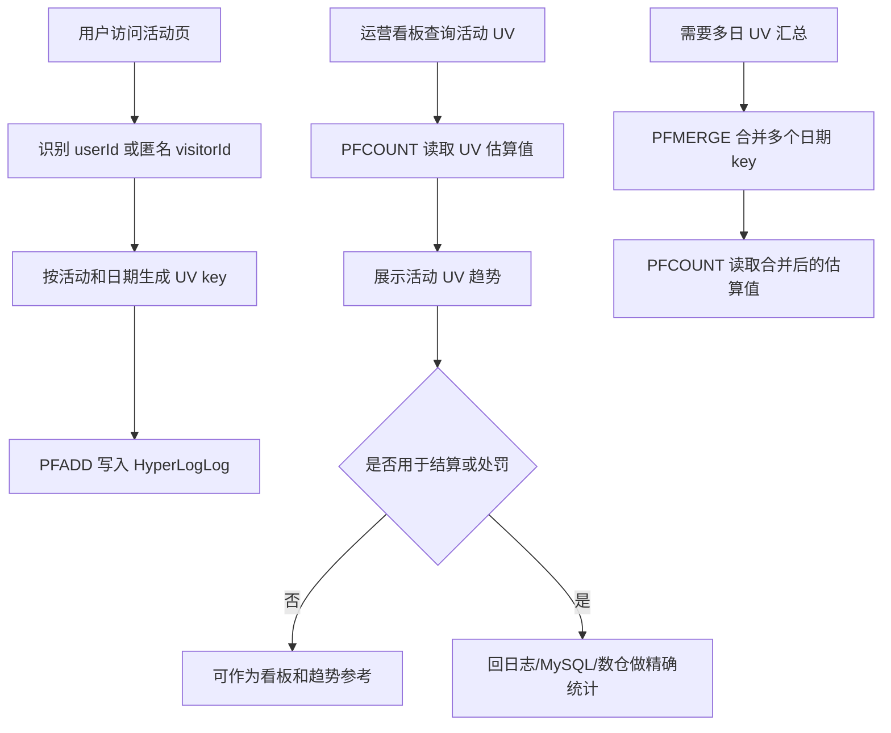

# 第 11 章：Probabilistic data types：适合高效率的近似统计

## 1. 本章一句话

Redis Probabilistic data types 适合用“可接受误差”换取更低内存和更高统计效率，适合 UV 估算、频率估算、百分位估算、Top-K 估算等场景。参考：[Redis 官方 Probabilistic 文档](https://redis.io/docs/latest/develop/data-types/probabilistic/)

本章核心判断：活动 UV 看板、趋势分析、运营估算可以用近似统计，但奖励结算、计费、风控处罚、最终人数确认不能只靠近似结果。**标记：主观推断**

---

## 2. 适合解决什么问题？

| 场景         | 为什么适合                                                                                                                                                              |
| ---------- | ------------------------------------------------------------------------------------------------------------------------------------------------------------------ |
| 活动 UV 去重估算 | HyperLogLog 适合估算集合基数，Redis 实现最多使用 12KB 内存，并提供 0.81% 标准误差。参考：[Redis 官方 HyperLogLog 文档](https://redis.io/docs/latest/develop/data-types/probabilistic/hyperloglogs/) |
| 缓存穿透前置判断   | Bloom filter / Cuckoo filter 适合判断元素是否可能存在，用于减少无效 ID 访问后端存储。参考：[Redis 官方 Probabilistic 文档](https://redis.io/docs/latest/develop/data-types/probabilistic/)          |
| 热门内容频率估算   | Count-min sketch 适合估算数据流中元素出现频率，Top-K 适合估算高频元素。参考：[Redis 官方 Probabilistic 文档](https://redis.io/docs/latest/develop/data-types/probabilistic/)                      |
| 接口耗时百分位估算  | t-digest 适合估算数据流中的百分位，例如 P95 / P99。参考：[Redis 官方 Probabilistic 文档](https://redis.io/docs/latest/develop/data-types/probabilistic/)                                  |
| 大规模近似统计看板  | 当业务只需要趋势和量级，不需要逐个成员明细时，近似统计能降低内存和计算成本。**标记：主观推断**                                                                                                                  |

---

## 3. 主案例

```text
主案例：活动 UV 去重估算

业务背景：
活动上线后，运营看板需要快速看到“今天有多少独立用户访问过活动页”，用于判断活动热度、流量趋势和投放效果。

核心原因：
UV 看板通常更关注趋势和量级，不一定要求 100% 精确；HyperLogLog 可以用固定小内存估算大规模唯一用户数，因此适合活动 UV 去重估算。参考：[Redis 官方 HyperLogLog 文档](https://redis.io/docs/latest/develop/data-types/probabilistic/hyperloglogs/)

边界判断：
如果 UV 结果要用于奖励发放、奖金池分摊、广告结算、风控处罚或最终活动人数确认，就不能只依赖 HyperLogLog 的近似结果，必须回到 MySQL、日志系统或数仓做可追溯精确统计。**标记：主观推断**
```

辅助案例：

* 缓存穿透前置判断：适合用 Bloom filter / Cuckoo filter 判断 ID 是否可能存在，重点关注误判边界。**标记：主观推断**
* 热门内容频率估算：适合用 Count-min sketch / Top-K 估算热门课程、热门搜索词，重点关注结果是近似值。**标记：主观推断**
* 接口耗时百分位估算：适合用 t-digest 估算 P95 / P99，重点关注监控趋势，不直接替代精确日志分析。**标记：主观推断**
* 学习行为去重统计：适合估算活跃人数、学习人数、完成人数，重点关注是否会被用于结算或考核。**标记：主观推断**

---

## 4. 核心流程



说明：

* `PFADD` 用于向 HyperLogLog 添加元素。参考：[Redis 官方 PFADD 文档](https://redis.io/docs/latest/commands/pfadd/)
* `PFCOUNT` 用于返回 HyperLogLog 观察到的集合近似基数。参考：[Redis 官方 PFCOUNT 文档](https://redis.io/docs/latest/commands/pfcount/)
* `PFMERGE` 用于合并多个 HyperLogLog。参考：[Redis 官方 PFMERGE 文档](https://redis.io/docs/latest/commands/pfmerge/)
* 活动 UV 看板适合用近似值观察趋势，但不适合直接作为结算、奖励、处罚依据。**标记：主观推断**
* HyperLogLog 不能反查具体有哪些用户访问过，因此如果要审计或追溯成员明细，需要保留日志或 MySQL 事实数据。**标记：主观推断**

---

## 5. 关键命令

| 命令                                                                                                              | 作用                                                                                                      |
| --------------------------------------------------------------------------------------------------------------- | ------------------------------------------------------------------------------------------------------- |
| `PFADD activity:uv:{activityId}:{date} {userId}`                                                                | 用户访问活动页时，把用户标识加入当天活动 UV 估算结构。参考：[Redis 官方 PFADD 文档](https://redis.io/docs/latest/commands/pfadd/)       |
| `PFCOUNT activity:uv:{activityId}:{date}`                                                                       | 运营看板读取当天活动 UV 估算值。参考：[Redis 官方 PFCOUNT 文档](https://redis.io/docs/latest/commands/pfcount/)              |
| `PFMERGE activity:uv:{activityId}:week activity:uv:{activityId}:2026-07-01 activity:uv:{activityId}:2026-07-02` | 多日活动 UV 需要汇总时，合并多个 HyperLogLog。参考：[Redis 官方 PFMERGE 文档](https://redis.io/docs/latest/commands/pfmerge/) |

---

## 6. 边界和坑

| 问题         | 说明                                                                           |
| ---------- | ---------------------------------------------------------------------------- |
| 近似值不能当精确值  | HyperLogLog 返回的是估算基数，不适合直接用于奖励结算、计费、风控处罚、最终活动人数确认。**标记：主观推断**                |
| 不能反查成员明细   | HyperLogLog 只保留统计状态，不能像 Set 一样列出具体 userId；需要审计时要保留日志或 MySQL 事实数据。**标记：主观推断** |
| 统计口径必须统一   | userId、deviceId、visitorId 混用会让 UV 口径失真，活动看板必须先定义唯一身份口径。**标记：主观推断**           |
| key 粒度设计不清 | 不按 activityId、date、渠道等维度规划 key，会导致后续无法按业务维度统计或合并。**标记：主观推断**                 |
| 用错场景会放大风险  | 趋势看板可以接受误差，结算、审计、处罚、强一致业务不能接受误差。**标记：主观推断**                                  |

---

## 7. 本章记忆点

1. Probabilistic data types 的核心是“允许误差，换效率和低内存”。
2. 活动 UV 去重估算适合用 HyperLogLog，但它只给近似数量，不给成员明细。参考：[Redis 官方 HyperLogLog 文档](https://redis.io/docs/latest/develop/data-types/probabilistic/hyperloglogs/)
3. 近似统计适合看板、趋势、运营估算；不适合结算、计费、处罚和最终事实确认。**标记：主观推断**
