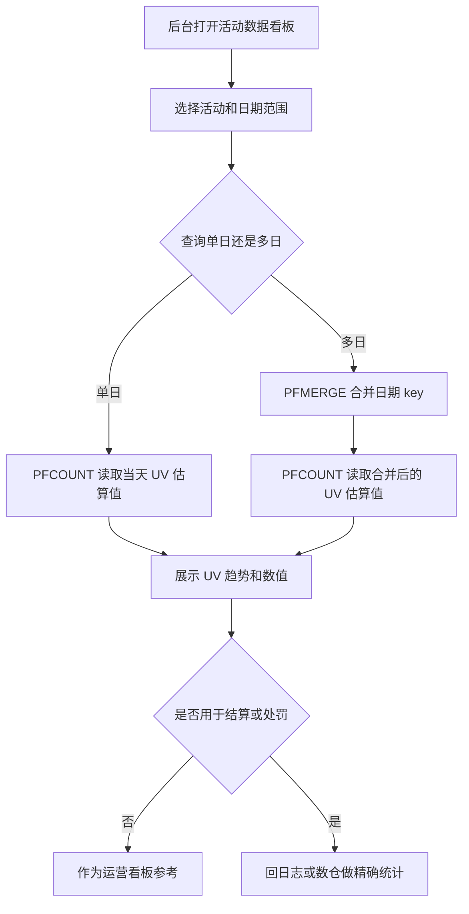
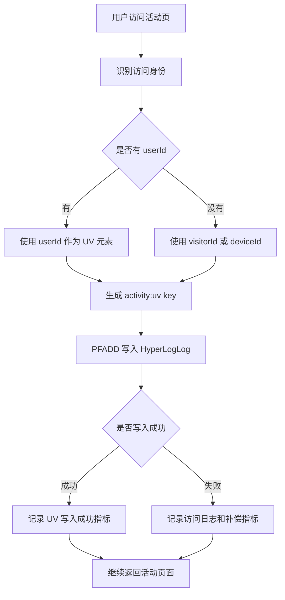
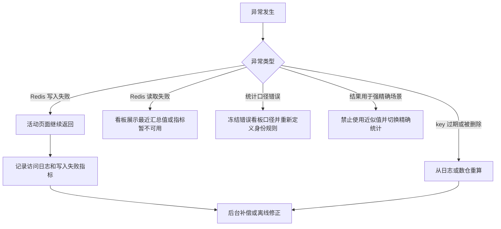
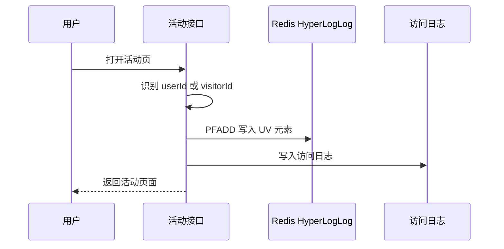
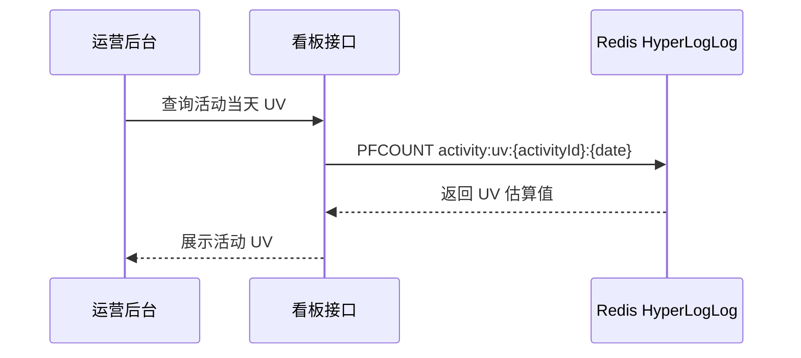
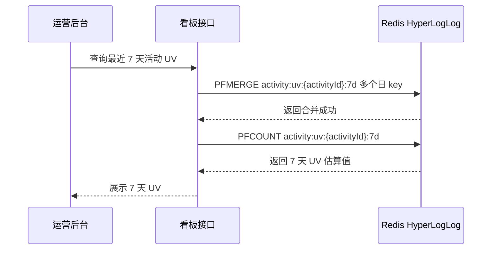
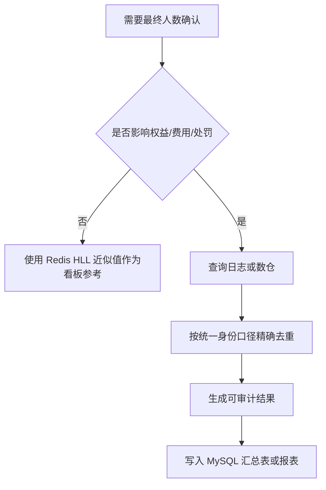

# Redis 知识点：Probabilistic data types

## 1. 一句话结论

> Redis Probabilistic data types 的核心价值是：用“可接受的近似误差”换取更低内存、更高效率的统计能力。参考：[Redis 官方 Probabilistic 文档](https://redis.io/docs/latest/develop/data-types/probabilistic/)
> 活动 UV 去重估算适合用 HyperLogLog 做运营看板和趋势分析，但不能把近似结果直接用于奖励结算、计费、风控处罚或最终人数确认。**标记：主观推断**

---

## 2. 这个知识点是什么？

Probabilistic data types 是 Redis 中用于近似统计的一组数据结构能力。

可以简单理解为：

```text
Probabilistic data types = 不追求 100% 精确，追求低内存、高效率、可接受误差

典型能力：
- HyperLogLog：估算唯一元素数量，例如 UV
- Bloom filter：判断元素是否可能存在
- Cuckoo filter：判断元素是否可能存在，并支持删除
- Count-min sketch：估算元素出现频率
- t-digest：估算百分位，例如 P95 / P99
- Top-K：估算高频元素
```

Redis 官方文档说明，Probabilistic data structures 提供 counts、frequencies、rankings 等统计的近似值，而不是精确值；近似值通常能满足很多常见用途，并且计算效率更高。参考：[Redis 官方 Probabilistic 文档](https://redis.io/docs/latest/develop/data-types/probabilistic/)

本次主案例聚焦 HyperLogLog，因为活动 UV 的核心问题是“估算一段时间内有多少独立用户访问过活动”。参考：[Redis 官方 HyperLogLog 文档](https://redis.io/docs/latest/develop/data-types/probabilistic/hyperloglogs/)

从工程视角看，Probabilistic 不是“统计不准也能用”，而是“业务明确允许误差时，才用近似换成本”。**标记：主观推断**

---

## 3. 它解决什么业务问题？

业务场景：活动 UV 去重估算。

例如活动上线后，运营看板需要快速看到：

```text
今天有多少独立用户访问活动页？
最近 1 小时 UV 是否在上涨？
不同活动的 UV 趋势是否有明显差异？
一周内活动总 UV 大概是多少？
```

如果不用 Redis HyperLogLog，常见做法是用 Set、MySQL 或日志系统统计。

| 业务问题       | 具体表现                         | Redis 如何解决                                                                                                                           |
| ---------- | ---------------------------- | ------------------------------------------------------------------------------------------------------------------------------------ |
| 活动访问用户量大   | 如果用 Set 保存每个 userId，用户越多内存越大 | HyperLogLog 用固定小内存估算唯一元素数量。参考：[Redis 官方 HyperLogLog 文档](https://redis.io/docs/latest/develop/data-types/probabilistic/hyperloglogs/) |
| 运营看板需要快速展示 | 每次从 MySQL 或日志中实时去重统计成本高      | 用 `PFCOUNT` 直接读取 UV 估算值。参考：[Redis 官方 PFCOUNT 文档](https://redis.io/docs/latest/commands/pfcount/)                                     |
| 用户重复访问需要去重 | 同一用户多次访问活动页，只应算一个 UV         | 用 `PFADD` 把 userId 加入 HyperLogLog，由结构估算基数。参考：[Redis 官方 PFADD 文档](https://redis.io/docs/latest/commands/pfadd/)                       |
| 多日 UV 需要合并 | 活动一周 UV 需要合并每天统计结构           | 用 `PFMERGE` 合并多个 HyperLogLog 后再估算。参考：[Redis 官方 PFMERGE 文档](https://redis.io/docs/latest/commands/pfmerge/)                           |
| 看板只需要趋势和量级 | 运营判断活动热度通常不需要精确到每个用户         | 近似统计适合看板、趋势、运营估算。**标记：主观推断**                                                                                                         |

---

## 4. Redis 为什么适合？

| Redis 能力           | 对应业务价值                        | 证据 / 标记                                                                                                                                                 |
| ------------------ | ----------------------------- | ------------------------------------------------------------------------------------------------------------------------------------------------------- |
| HyperLogLog 估算集合基数 | 活动 UV 本质是估算独立用户数量             | HyperLogLog 用于估算集合基数。参考：[Redis 官方 HyperLogLog 文档](https://redis.io/docs/latest/develop/data-types/probabilistic/hyperloglogs/)                          |
| 固定小内存              | 大量用户访问时，不需要像 Set 一样保存所有成员     | Redis HyperLogLog 最多使用 12KB 内存，并提供 0.81% 标准误差。参考：[Redis 官方 HyperLogLog 文档](https://redis.io/docs/latest/develop/data-types/probabilistic/hyperloglogs/) |
| `PFADD`            | 用户访问活动页时写入 userId 或 visitorId | `PFADD` 用于向 HyperLogLog 添加元素，key 不存在时会创建。参考：[Redis 官方 PFADD 文档](https://redis.io/docs/latest/commands/pfadd/)                                           |
| `PFCOUNT`          | 运营看板读取当天活动 UV 估算值             | `PFCOUNT` 返回 HyperLogLog 观察到的集合近似基数。参考：[Redis 官方 PFCOUNT 文档](https://redis.io/docs/latest/commands/pfcount/)                                            |
| `PFMERGE`          | 周 UV、活动周期 UV 可以由多个日期 key 合并得到 | `PFMERGE` 用于合并一个或多个 HyperLogLog。参考：[Redis 官方 PFMERGE 文档](https://redis.io/docs/latest/commands/pfmerge/)                                                |

核心判断：

> 活动 UV 去重估算的核心目标不是保存每个访问用户明细，而是低成本获得“独立访问人数的近似规模”，所以 HyperLogLog 比 Set 更适合做运营看板级 UV 估算。**标记：主观推断**

---

## 5. 它的边界是什么？

| 边界          | 说明                                          | 更合适的选择                                         |
| ----------- | ------------------------------------------- | ---------------------------------------------- |
| 不能用于强精确场景   | HyperLogLog 返回估算值，不是精确人数                    | 奖励结算、计费、风控处罚使用 MySQL / 日志 / 数仓精确统计。**标记：主观推断** |
| 不能反查成员明细    | HyperLogLog 不保存完整成员集合，不能列出具体 userId         | 需要明细审计时使用日志系统、MySQL 明细表或 Redis Set。**标记：主观推断** |
| 不能混乱统计口径    | userId、visitorId、deviceId 混用会导致 UV 口径不一致    | 先定义统一身份口径。**标记：主观推断**                          |
| 不能代替长期事实存储  | Redis 中的统计结构适合在线统计，不适合替代日志或数仓               | 长期可追溯数据进入日志系统 / 数仓。**标记：主观推断**                 |
| 不能忽略 key 粒度 | activityId、date、channel 粒度设计不清，后续无法按维度合并或对比 | 设计前先确定看板维度和汇总口径。**标记：主观推断**                    |

关键边界：

> Probabilistic data types 适合“可接受误差的在线统计”，不适合“必须精确、必须可审计、必须能反查成员”的业务事实。**标记：主观推断**

---

## 6. 常见坑是什么？

| 常见坑       | 线上风险                                   | 规避方式                                                |
| --------- | -------------------------------------- | --------------------------------------------------- |
| 把估算值当精确值  | 奖励发放、广告结算、处罚判断可能出现争议                   | 所有强结果场景必须回日志、MySQL 或数仓精确计算。**标记：主观推断**              |
| 忘记它不能反查成员 | 产品或运营后续想看具体访问用户列表时拿不到                  | 如果需要明细，访问日志必须单独保存。**标记：主观推断**                       |
| 统计身份口径混乱  | 登录用户用 userId，未登录用户用 deviceId，跨端后 UV 失真 | 明确定义 userId、visitorId、deviceId 的优先级。**标记：主观推断**     |
| key 粒度过粗  | 只按活动建 key，后续无法按日期、渠道、版本拆分统计            | key 设计中保留 activityId、date、channel 等必要维度。**标记：主观推断** |
| key 粒度过细  | 每个小维度都建 HLL，key 数暴涨，统计和运维复杂            | 只保留真正会展示和汇总的统计维度。**标记：主观推断**                        |
| 没有原始日志兜底  | Redis 数据丢失或统计异常后无法重算                   | 访问日志进入日志系统或数仓，支持离线重建。**标记：主观推断**                    |

---

## 7. MySQL / 本地缓存 / 其他方案是否更合适？

| 方案                | 是否适合                      | 原因                                                                                                                                    |
| ----------------- | ------------------------- | ------------------------------------------------------------------------------------------------------------------------------------- |
| MySQL             | 适合事实存储，不适合作为高频实时 UV 去重主查询 | MySQL 可保存访问明细或汇总结果，但实时大规模去重查询成本较高。**标记：主观推断**                                                                                         |
| Redis HyperLogLog | 适合运营看板 UV 估算              | 它用固定小内存估算集合基数，适合低成本在线 UV 统计。参考：[Redis 官方 HyperLogLog 文档](https://redis.io/docs/latest/develop/data-types/probabilistic/hyperloglogs/) |
| Redis Set         | 适合精确去重和成员反查               | Set 能保留成员明细，但用户量大时内存随成员数增长。**标记：主观推断**                                                                                                |
| 本地缓存              | 不适合作为全局 UV 统计             | 多实例下本地缓存会分散统计，难以全局合并。**标记：主观推断**                                                                                                      |
| 日志系统 / 数仓         | 适合长期精确统计和审计               | 能保存原始访问事件，支持离线重算、追溯和复杂分析。**标记：主观推断**                                                                                                  |
| Time series       | 适合保存 UV 趋势点，不适合直接完成去重估算   | 可以把每天 UV 估算值写入 Time series 展示趋势，但去重本身仍由 HLL 或离线系统完成。**标记：主观推断**                                                                       |

最终判断：

> 活动 UV 看板可以用 Redis HyperLogLog 做在线估算；最终结算、审计、复盘、归因分析要依赖日志系统、MySQL 或数仓。**标记：主观推断**

---

## 8. 具体业务场景例子

### 8.1 场景背景

业务：活动页上线后，需要在后台看板展示活动 UV。

接口示例：

```text
GET /api/activities/{activityId}
GET /admin/activities/{activityId}/metrics
```

访问事件来源：

```text
用户打开活动页
后端识别 userId / visitorId / deviceId
把访问身份写入当天活动 UV 统计结构
后台看板读取当天 UV、最近 7 天 UV、活动周期 UV
```

统计目标：

```text
当天活动 UV
最近 7 天活动 UV
活动整体 UV
分渠道活动 UV
```

核心前提：

```text
这个 UV 只用于运营看板、活动热度观察和趋势分析。
不用于奖励结算、计费、处罚或最终人数确认。
```

**标记：主观推断**

---

### 8.2 业务问题

如果不用 Redis HyperLogLog，可能会遇到这些问题：

| 业务问题          | 具体表现                                                         |
| ------------- | ------------------------------------------------------------ |
| Set 内存压力大     | 活动访问用户很多时，Set 需要保存所有 userId，内存随用户数增长。**标记：主观推断**             |
| MySQL 实时去重慢   | 每次看板刷新都从访问明细 `COUNT DISTINCT user_id`，数据量大时查询成本高。**标记：主观推断** |
| 日志系统不适合高频看板刷新 | 日志适合回溯和离线分析，但不一定适合每秒级在线看板读取。**标记：主观推断**                      |
| 多日合并统计麻烦      | 如果每天分别统计，活动周期 UV 需要合并去重。**标记：主观推断**                          |
| 运营只需要趋势       | UV 看板更关注走势和量级，不一定需要精确到每个用户。**标记：主观推断**                       |

用了 Redis HyperLogLog 后：

* 用户访问活动时，用 `PFADD` 写入当天活动 UV 结构。参考：[Redis 官方 PFADD 文档](https://redis.io/docs/latest/commands/pfadd/)
* 后台看板用 `PFCOUNT` 读取当天 UV 估算值。参考：[Redis 官方 PFCOUNT 文档](https://redis.io/docs/latest/commands/pfcount/)
* 多日 UV 需要合并时，用 `PFMERGE` 合并多个 HyperLogLog。参考：[Redis 官方 PFMERGE 文档](https://redis.io/docs/latest/commands/pfmerge/)
* 原始访问日志仍然保留，支持精确统计、审计和重建。**标记：主观推断**

---

### 8.3 Redis 设计

```text
Redis key:
activity:uv:{activityId}:{yyyyMMdd}
activity:uv:{activityId}:{channel}:{yyyyMMdd}
activity:uv:{activityId}:merged:{startDate}:{endDate}

Redis value:
HyperLogLog 结构，用于估算唯一访问用户数。

写入元素:
优先 userId。
未登录时可用 visitorId 或 deviceId，但必须先定义统一口径。
**标记：主观推断**

TTL:
单日 UV key 可保留 30 到 90 天，具体取决于运营看板回看周期和离线数仓补全能力。
可以用 EXPIRE 设置 key 过期时间。参考：[Redis 官方 EXPIRE 文档](https://redis.io/docs/latest/commands/expire/)
**标记：主观推断**

MySQL:
MySQL 不作为高频实时去重查询主路径。
MySQL 可以保存活动配置、统计汇总快照、看板配置。
如果需要精确统计，应该依赖访问日志、明细表或数仓。
**标记：主观推断**

日志 / 数仓:
保存原始访问事件，用于离线精确统计、审计、异常重算和报表复盘。
**标记：主观推断**

降级:
Redis 不可用时，活动主页面不应失败；UV 写入可以降级为日志记录，后台看板展示最近一次汇总值或提示指标暂不可用。
**标记：主观推断**
```

---

### 8.4 读流程



说明：

* `PFCOUNT` 返回 HyperLogLog 观察到的集合近似基数。参考：[Redis 官方 PFCOUNT 文档](https://redis.io/docs/latest/commands/pfcount/)
* `PFMERGE` 用于合并多个 HyperLogLog，适合多日 UV 汇总。参考：[Redis 官方 PFMERGE 文档](https://redis.io/docs/latest/commands/pfmerge/)
* 活动 UV 看板读取的是近似值，适合趋势观察和运营判断。**标记：主观推断**
* 如果统计结果影响用户利益、费用、处罚或最终确认，必须走日志、MySQL 或数仓精确统计。**标记：主观推断**
* 多日合并 key 如果只是临时查询结果，可以设置较短 TTL，避免临时 key 堆积。**标记：主观推断**

---

### 8.5 写流程



说明：

* `PFADD` 用于向 HyperLogLog 添加元素；key 不存在时会创建。参考：[Redis 官方 PFADD 文档](https://redis.io/docs/latest/commands/pfadd/)
* UV 写入是活动页面的旁路统计，不应影响活动页面主链路返回。**标记：主观推断**
* 登录用户和未登录用户的身份口径必须提前定义，否则 UV 会失真。**标记：主观推断**
* 写入失败时应保留访问日志，后续可以从日志或数仓修正统计。**标记：主观推断**

---

### 8.6 异常处理



说明：

* Redis 统计写入失败时，活动访问主流程不应失败，因为 UV 是旁路统计。**标记：主观推断**
* Redis 读取失败时，看板可以展示最近一次汇总值或提示指标暂不可用。**标记：主观推断**
* key 过期或误删后，能否重建取决于是否保存了原始访问日志。**标记：主观推断**
* 发现统计结果被用于结算、处罚、计费等强精确场景时，应立即切换到精确统计链路。**标记：主观推断**
* `EXPIRE` 可以设置 key 的过期时间，但过期策略必须和业务回看周期一致。参考：[Redis 官方 EXPIRE 文档](https://redis.io/docs/latest/commands/expire/)

---

### 8.7 监控指标

| 指标                     | 作用                                            |
| ---------------------- | --------------------------------------------- |
| `PFADD` 写入 QPS         | 判断活动访问带来的统计写入压力。**标记：主观推断**                   |
| `PFADD` 写入失败次数         | 判断 UV 统计链路是否稳定。**标记：主观推断**                    |
| `PFCOUNT` 查询 QPS       | 判断后台看板查询压力。**标记：主观推断**                        |
| `PFCOUNT` P95 / P99 延迟 | 判断看板读取是否影响 Redis。**标记：主观推断**                  |
| UV key 数量              | 判断 activityId、date、channel 维度是否过细。**标记：主观推断** |
| 临时 merge key 数量        | 判断多日合并查询是否产生 key 堆积。**标记：主观推断**               |
| Redis used_memory      | 判断 HLL 和其他 Redis 数据是否带来内存压力。**标记：主观推断**       |
| 近似值和离线精确值差异            | 判断近似统计是否在业务可接受范围内。**标记：主观推断**                 |
| 原始访问日志落盘成功率            | 判断 Redis 数据异常后是否能重建统计。**标记：主观推断**             |
| 看板降级次数                 | 判断 Redis 统计读写是否影响运营体验。**标记：主观推断**             |

---

## 9. Mermaid 图

说明：以下 Mermaid 图统一使用标准 ` ```mermaid `，不带 id，支持 Cursor 和浏览器显示。**标记：主观推断**

### 9.1 UV 写入流程



说明：

* `PFADD` 用于向 HyperLogLog 添加元素。参考：[Redis 官方 PFADD 文档](https://redis.io/docs/latest/commands/pfadd/)
* 访问日志用于精确统计和异常重建。**标记：主观推断**
* UV 写入不应阻塞活动页面主链路。**标记：主观推断**

---

### 9.2 看板读取流程



说明：

* `PFCOUNT` 用于返回 HyperLogLog 观察到的集合近似基数。参考：[Redis 官方 PFCOUNT 文档](https://redis.io/docs/latest/commands/pfcount/)
* 看板展示应明确这是近似统计，避免被误用为精确事实。**标记：主观推断**

---

### 9.3 多日 UV 合并流程



说明：

* `PFMERGE` 用于把多个 HyperLogLog 合并到一个目标 key。参考：[Redis 官方 PFMERGE 文档](https://redis.io/docs/latest/commands/pfmerge/)
* 合并结果仍然是近似 UV，不是精确人数。**标记：主观推断**
* 临时合并 key 建议设置过期时间，避免后台查询制造长期垃圾 key。**标记：主观推断**

---

### 9.4 精确统计兜底流程



说明：

* 强精确场景应使用可追溯数据源计算结果。**标记：主观推断**
* Redis HyperLogLog 适合在线估算，不适合审计级结果确认。**标记：主观推断**

---

## 10. 工程评审关注点

| 关注点                 | 说明                                                                                                                                               |
| ------------------- | ------------------------------------------------------------------------------------------------------------------------------------------------ |
| 为什么用 Probabilistic？ | 因为活动 UV 看板关注趋势和量级，允许小误差时可以用近似统计换更低内存。**标记：主观推断**                                                                                                 |
| 为什么选 HyperLogLog？   | 活动 UV 本质是集合基数估算，HyperLogLog 正是用于估算集合基数。参考：[Redis 官方 HyperLogLog 文档](https://redis.io/docs/latest/develop/data-types/probabilistic/hyperloglogs/) |
| 为什么不用 Set？          | Set 能精确去重和反查成员，但内存随成员数增长；HLL 更适合只需要数量估算的场景。**标记：主观推断**                                                                                           |
| 为什么不能只用 MySQL？      | MySQL 可以做精确统计，但高频看板实时 `COUNT DISTINCT` 成本较高，适合作为事实和离线结果来源。**标记：主观推断**                                                                            |
| 近似误差能不能接受？          | 如果只是运营看板和趋势分析，可以接受；如果影响结算、处罚、计费，则不能接受。**标记：主观推断**                                                                                                |
| Redis 数据丢了怎么办？      | 从访问日志或数仓重建；如果没有原始日志，就无法可靠重建。**标记：主观推断**                                                                                                          |
| 能不能查具体用户？           | 不能；HyperLogLog 不保存完整成员明细，需要明细就要用日志、MySQL 或 Set。**标记：主观推断**                                                                                       |
| key 怎么设计？           | 至少按 activityId 和 date 建 key；是否加 channel 要看后台是否需要分渠道统计。**标记：主观推断**                                                                                |
| TTL 怎么定？            | 由看板回看周期、离线数仓产出周期、重建能力决定。**标记：主观推断**                                                                                                              |
| 最大线上风险是什么？          | 把近似统计误用成精确事实，导致结算、审计或处罚错误。**标记：主观推断**                                                                                                            |

---

## 11. 最终记忆点

1. Probabilistic 的核心不是“不准”，而是“业务允许误差时，用近似换效率”。
2. HyperLogLog 适合活动 UV 估算，因为它用固定小内存估算集合基数。参考：[Redis 官方 HyperLogLog 文档](https://redis.io/docs/latest/develop/data-types/probabilistic/hyperloglogs/)
3. UV 看板可以近似，权益、计费、处罚、最终确认必须精确。**标记：主观推断**
4. HyperLogLog 不能反查成员明细，需要审计就必须保留日志或 MySQL 明细。**标记：主观推断**
5. 资深后端使用 Probabilistic 前，必须先问：误差能不能接受、是否需要明细、是否需要重算、是否影响用户权益。**标记：主观推断**

---

## 12. 参考资料

1. [Redis 官方 Probabilistic 文档](https://redis.io/docs/latest/develop/data-types/probabilistic/)：用于确认 Probabilistic data structures 提供 counts、frequencies、rankings 等近似统计能力。
2. [Redis 官方 HyperLogLog 文档](https://redis.io/docs/latest/develop/data-types/probabilistic/hyperloglogs/)：用于确认 HyperLogLog 用于估算集合基数、最多使用 12KB 内存、标准误差为 0.81%。
3. [Redis 官方 PFADD 文档](https://redis.io/docs/latest/commands/pfadd/)：用于确认 `PFADD` 可以向 HyperLogLog 添加元素，并在 key 不存在时创建 key。
4. [Redis 官方 PFCOUNT 文档](https://redis.io/docs/latest/commands/pfcount/)：用于确认 `PFCOUNT` 返回 HyperLogLog 观察到的集合近似基数。
5. [Redis 官方 PFMERGE 文档](https://redis.io/docs/latest/commands/pfmerge/)：用于确认 `PFMERGE` 可以合并多个 HyperLogLog。
6. [Redis 官方 EXPIRE 文档](https://redis.io/docs/latest/commands/expire/)：用于确认 `EXPIRE` 可以设置 key 的过期时间。
