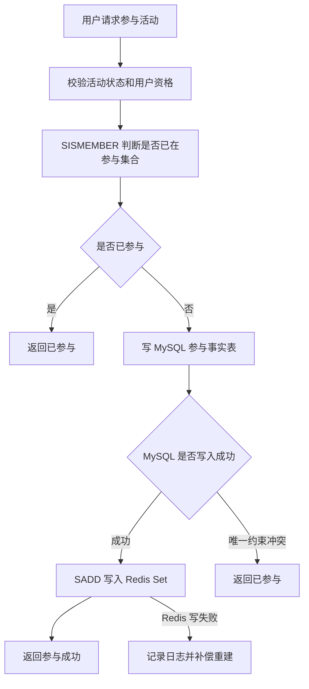

# 第 12 章：Sets：适合去重和成员判断

## 1. 本章一句话

Redis Set 是无序的唯一字符串成员集合，适合跟踪唯一对象、表达集合关系、判断成员是否存在。参考：[Redis 官方 Sets 文档](https://redis.io/docs/latest/develop/data-types/sets/)

本章核心判断：Sets 适合做“是否参与、是否领取、是否收藏、是否命中某集合”的快速判断和去重缓存，但不能单独替代 MySQL 的事实记录、唯一约束和结算依据。**标记：主观推断**

---

## 2. 适合解决什么问题？

| 场景       | 为什么适合                                                                                                                |
| -------- | -------------------------------------------------------------------------------------------------------------------- |
| 活动参与用户集合 | 一个用户只能参与一次，Set 天然去重；`SADD` 添加已存在成员时会忽略重复成员。参考：[Redis 官方 SADD 文档](https://redis.io/docs/latest/commands/sadd/)        |
| 是否已参与判断  | 接口进入时可以用 `SISMEMBER` 快速判断用户是否已经在活动参与集合中。参考：[Redis 官方 SISMEMBER 文档](https://redis.io/docs/latest/commands/sismember/) |
| 参与人数统计   | 可以用 `SCARD` 获取集合成员数量，适合快速展示当前参与人数。参考：[Redis 官方 SCARD 文档](https://redis.io/docs/latest/commands/scard/)               |
| 课程收藏去重   | 用户收藏课程时，可以用 Set 判断是否已收藏，但收藏事实仍建议落 MySQL。**标记：主观推断**                                                                  |
| 每日签到去重   | 当天签到用户集合适合用 Set 判断是否已签到，但海量签到统计需要再对比 Bitmaps。**标记：主观推断**                                                             |

---

## 3. 主案例

```text id="4utq1r"
主案例：活动参与用户集合

业务背景：
一个活动需要判断用户是否已经参与，避免重复报名、重复提交、重复领取参与资格，同时页面可能要展示当前参与人数。

核心原因：
活动参与用户集合的核心问题是“用户是否属于某个集合”，Redis Set 的唯一成员和成员判断能力刚好匹配；但最终参与事实、奖励发放、结算结果仍应落 MySQL，不能只靠 Redis Set。**标记：主观推断**
```

辅助案例：

* 课程收藏去重：适合判断用户是否已收藏某课程，重点关注取消收藏和 MySQL 收藏事实表。**标记：主观推断**
* 每日签到去重：适合判断当天是否签到，重点关注数据量大时是否改用 Bitmaps。**标记：主观推断**
* 奖励是否领取：适合做领取前置判断，但最终防重复领取要靠 MySQL 唯一约束。**标记：主观推断**

---

## 4. 核心流程



说明：

* `SISMEMBER` 用于判断某个 member 是否属于指定 Set，适合做活动参与状态的快速判断。参考：[Redis 官方 SISMEMBER 文档](https://redis.io/docs/latest/commands/sismember/)
* `SADD` 会把成员添加到 Set，已存在成员会被忽略，适合做参与用户集合的去重写入。参考：[Redis 官方 SADD 文档](https://redis.io/docs/latest/commands/sadd/)
* 活动参与事实建议先写 MySQL，再写 Redis Set；Redis 做前置判断和读缓存，MySQL 做最终事实源。**标记：主观推断**
* Redis Set 写失败时，不应让 MySQL 已成功的参与事实丢失；应通过补偿任务从 MySQL 重建 Set。**标记：主观推断**

---

## 5. 关键命令

| 命令                                                      | 作用                                                                                        |
| ------------------------------------------------------- | ----------------------------------------------------------------------------------------- |
| `SADD activity:participants:{activityId} {userId}`      | 把用户加入活动参与集合；重复加入会被忽略。参考：[Redis 官方 SADD 文档](https://redis.io/docs/latest/commands/sadd/)   |
| `SISMEMBER activity:participants:{activityId} {userId}` | 判断用户是否已经参与活动。参考：[Redis 官方 SISMEMBER 文档](https://redis.io/docs/latest/commands/sismember/) |
| `SCARD activity:participants:{activityId}`              | 统计当前活动参与用户数量。参考：[Redis 官方 SCARD 文档](https://redis.io/docs/latest/commands/scard/)         |
| `SREM activity:participants:{activityId} {userId}`      | 如果业务支持取消参与，可从参与集合中移除用户。参考：[Redis 官方 SREM 文档](https://redis.io/docs/latest/commands/srem/) |

---

## 6. 边界和坑

| 问题            | 说明                                                            |
| ------------- | ------------------------------------------------------------- |
| 只靠 Redis 防重复  | Redis 过期、淘汰、重启或误删后，重复参与判断可能失效；最终防重复必须靠 MySQL 唯一约束。**标记：主观推断** |
| 大 Set 内存压力    | 活动参与人数非常大时，单个 Set 会变成大 Key，带来内存、迁移、删除和慢操作风险。**标记：主观推断**       |
| 不能表达排序        | Set 只能判断成员是否存在，不适合表达参与时间排序、积分排序、排行榜。**标记：主观推断**               |
| `SMEMBERS` 滥用 | 大集合不要直接全量取出成员，容易造成 Redis 和网络压力；大集合遍历应谨慎设计。**标记：主观推断**         |
| 数据生命周期不清      | 活动结束后 Set 是否保留、多久过期、是否可从 MySQL 重建，需要提前设计。**标记：主观推断**          |

---

## 7. 本章记忆点

1. Sets 的核心价值是“去重 + 成员判断”，不是存复杂业务对象。
2. 活动参与、收藏、签到、领取这类“是否已经发生”的判断，适合用 Set 做快速判断。**标记：主观推断**
3. Redis Set 只能做前置拦截和缓存加速，最终事实、幂等和结算必须由 MySQL 兜底。**标记：主观推断**
