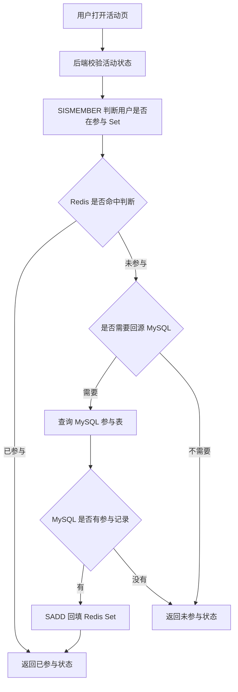
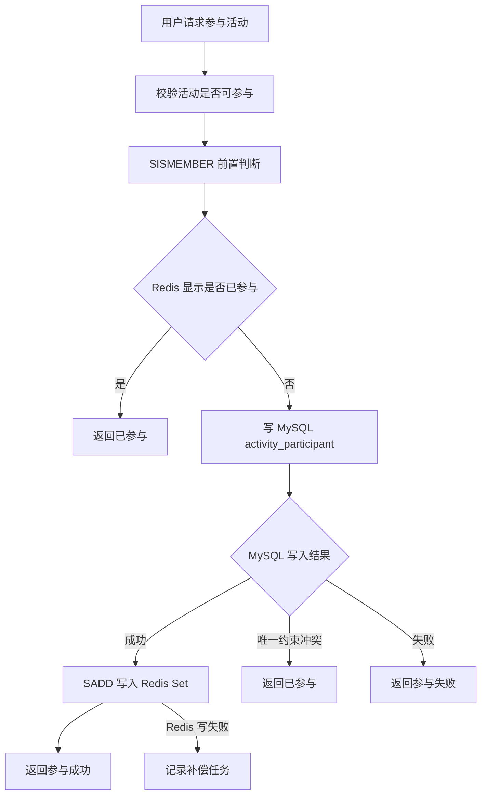
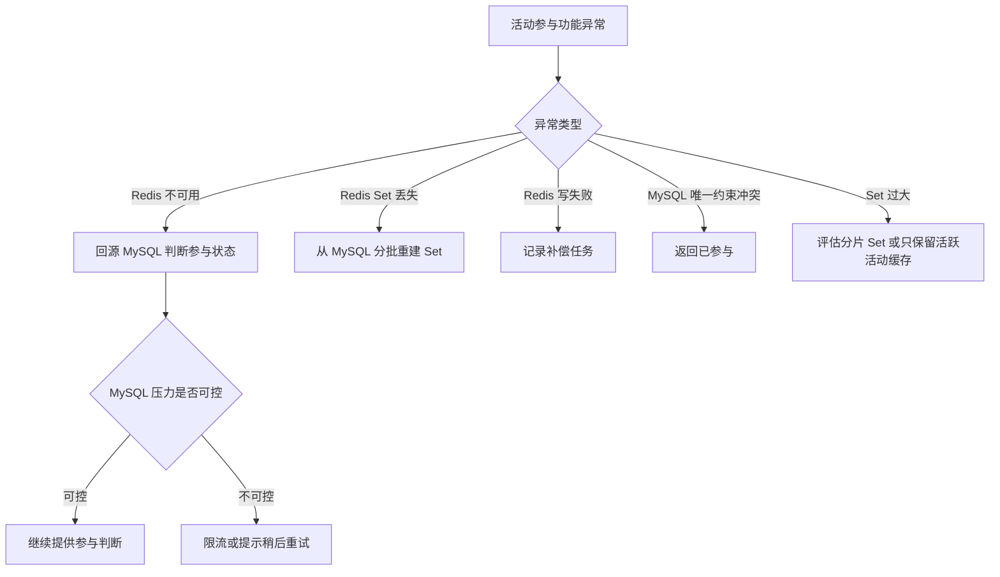
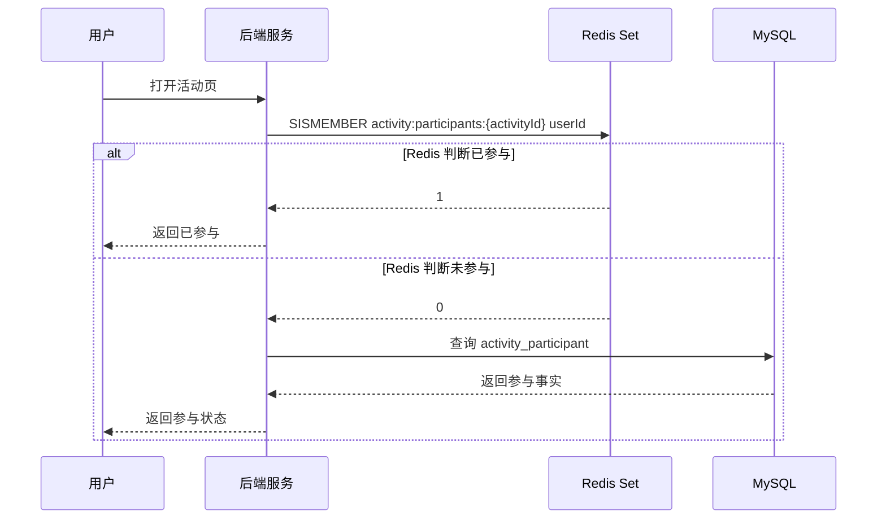
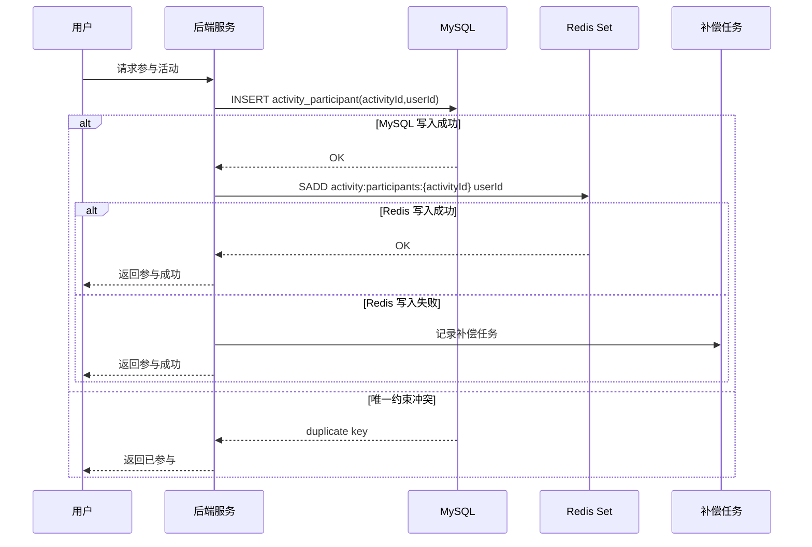
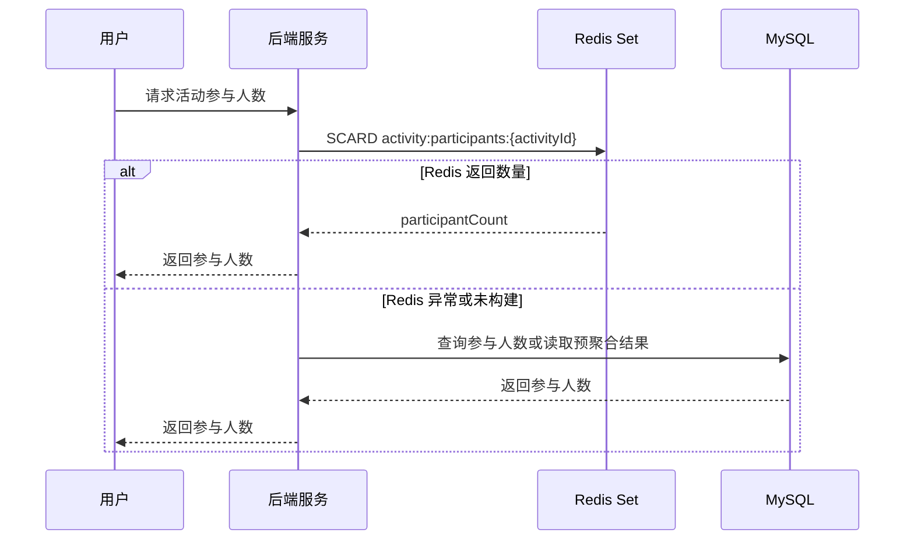

# Redis 知识点：Sets

## 1. 一句话结论

> Redis Set 是无序的唯一字符串成员集合，适合跟踪唯一对象、表达集合关系、判断成员是否存在。参考：[Redis 官方 Sets 文档](https://redis.io/docs/latest/develop/data-types/sets/)
> 在“活动参与用户集合”场景中，Sets 适合做快速去重和成员判断，但最终参与事实、奖励发放、结算记录仍建议由 MySQL 兜底。**标记：主观推断**

---

## 2. 这个知识点是什么？

Sets 是 Redis 中用于保存“唯一成员集合”的数据类型。

可以这样理解：

```text id="w6zj4k"
Redis Set = 一组不重复的成员

SADD = 把用户加入集合
SISMEMBER = 判断用户是否在集合里
SCARD = 统计集合成员数量
SREM = 从集合中移除成员
```

Redis 官方说明：Set 是无序的唯一字符串成员集合，可以用于跟踪唯一项、表达关系、做交集 / 并集 / 差集等集合运算。参考：[Redis 官方 Sets 文档](https://redis.io/docs/latest/develop/data-types/sets/)

在后端业务里，Set 最常见的理解方式是：
“我只关心某个 userId 是否已经出现在某个集合里，不关心排序，也不关心重复次数。”**标记：主观推断**

---

## 3. 它解决什么业务问题？

业务场景：活动参与用户集合。

例如一个活动有参与入口：

```text id="tj8r4q"
POST /api/activities/{activityId}/join
```

业务需要回答几个问题：

* 用户是否已经参与过？
* 用户是否可以重复参与？
* 当前活动已有多少参与用户？
* 活动结束后，参与事实能否结算和追溯？

这些问题里，Redis Set 适合解决的是“快速判断是否在集合中”和“快速做去重写入”；但不适合单独保存最终事实。**标记：主观推断**

| 业务问题            | 具体表现                     | Redis 如何解决                                                                                                                                                                          |
| --------------- | ------------------------ | ----------------------------------------------------------------------------------------------------------------------------------------------------------------------------------- |
| 防止重复参与          | 用户多次点击参与按钮，不能重复加入同一个活动   | 用 `SISMEMBER` 判断是否已参与，用 `SADD` 加入集合。参考：[Redis 官方 SISMEMBER 文档](https://redis.io/docs/latest/commands/sismember/)；参考：[Redis 官方 SADD 文档](https://redis.io/docs/latest/commands/sadd/) |
| 快速判断参与状态        | 活动页需要展示“已参与 / 未参与”       | 用 `SISMEMBER activity:participants:{activityId} {userId}` 判断成员是否存在。参考：[Redis 官方 SISMEMBER 文档](https://redis.io/docs/latest/commands/sismember/)                                     |
| 快速展示参与人数        | 活动页要展示当前参与人数             | 用 `SCARD` 返回 Set 成员数量。参考：[Redis 官方 SCARD 文档](https://redis.io/docs/latest/commands/scard/)                                                                                          |
| 降低 MySQL 高频判断压力 | 活动入口访问频繁，每次都查参与表会增加数据库压力 | Redis Set 承接高频判断，MySQL 保存最终参与事实。**标记：主观推断**                                                                                                                                         |

---

## 4. Redis 为什么适合？

| Redis 能力 | 对应业务价值                     | 证据 / 标记                                                                                                         |
| -------- | -------------------------- | --------------------------------------------------------------------------------------------------------------- |
| 成员唯一     | 同一个 userId 在同一个 Set 中只保留一份 | Redis Set 是唯一字符串成员集合。参考：[Redis 官方 Sets 文档](https://redis.io/docs/latest/develop/data-types/sets/)               |
| 去重写入     | 用户重复参与时，不会重复加入集合           | `SADD` 会添加指定成员，已存在成员会被忽略。参考：[Redis 官方 SADD 文档](https://redis.io/docs/latest/commands/sadd/)                     |
| 成员判断     | 快速判断用户是否已参与活动              | `SISMEMBER` 用于判断 member 是否属于指定 Set。参考：[Redis 官方 SISMEMBER 文档](https://redis.io/docs/latest/commands/sismember/) |
| 成员数量统计   | 快速展示当前活动参与人数               | `SCARD` 返回 Set 的成员数量。参考：[Redis 官方 SCARD 文档](https://redis.io/docs/latest/commands/scard/)                       |
| 集合关系表达   | 可以表达“某活动的所有参与用户”这种关系       | Redis 官方说明 Set 可用于表示关系。参考：[Redis 官方 Sets 文档](https://redis.io/docs/latest/develop/data-types/sets/)             |

核心判断：

> 活动参与用户集合的核心模型是“用户是否属于某活动集合”，所以 Sets 比 Lists、Strings、Hashes 更贴合；如果还需要排序、积分、排名，就应该考虑 Sorted Set。**标记：主观推断**

---

## 5. 它的边界是什么？

| 边界         | 说明                                       | 更合适的选择                    |
| ---------- | ---------------------------------------- | ------------------------- |
| 不能单独做事实源   | Redis Set 丢失、过期、误删后，参与事实可能不可追溯           | MySQL 活动参与表               |
| 不能替代唯一约束   | Redis 可以做快速判断，但并发下最终防重复仍应靠 MySQL 唯一索引兜底  | MySQL 唯一约束                |
| 不能表达排序     | Set 是无序集合，不适合表达参与时间排序、积分排序、排行榜           | Sorted Set / MySQL        |
| 不能无限变大     | 大活动可能形成大 Set，带来内存、迁移、删除和遍历风险             | 分片 Set / MySQL / 离线统计     |
| 不适合全量遍历大集合 | 大 Set 使用 `SMEMBERS` 全量取成员会带来 Redis 和网络压力 | `SSCAN` / MySQL 分页 / 离线任务 |

关键边界：

> Redis Set 适合“快速判断和缓存加速”，不适合“最终事实、结算依据、审计依据”。**标记：主观推断**

---

## 6. 常见坑是什么？

| 常见坑               | 线上风险                         | 规避方式                                     |
| ----------------- | ---------------------------- | ---------------------------------------- |
| 只靠 Redis 防重复      | Redis 数据丢失或未命中时，用户可能重复参与     | MySQL 参与表加唯一约束，Redis 只做前置判断。**标记：主观推断**  |
| 先写 Redis，MySQL 失败 | Redis 显示已参与，但事实表没有记录，后续结算出问题 | 先写 MySQL，提交成功后再写 Redis；失败走补偿。**标记：主观推断** |
| 大 Set             | 参与人数过大时，单个 Set 可能成为大 key     | 监控 `SCARD`，必要时按活动分片或只缓存活跃活动。**标记：主观推断**  |
| 滥用 `SMEMBERS`     | 大集合全量拉取会阻塞 Redis 和网络传输       | 大集合避免全量读取；必须遍历时用分批策略。**标记：主观推断**         |
| 生命周期不清            | 活动结束后 Redis Set 不清理，长期占用内存   | 设计 TTL、活动结束清理策略、可从 MySQL 重建。**标记：主观推断**  |

补充依据：

* `SMEMBERS` 返回 Set 中所有成员，复杂度是 O(N)，N 是集合基数。参考：[Redis 官方 SMEMBERS 文档](https://redis.io/docs/latest/commands/smembers/)
* `SADD` 对每个添加元素的复杂度是 O(1)，多个元素时整体是 O(N)。参考：[Redis 官方 SADD 文档](https://redis.io/docs/latest/commands/sadd/)

---

## 7. MySQL / 本地缓存 / 其他方案是否更合适？

| 方案               | 是否适合      | 原因                                                                                                       |
| ---------------- | --------- | -------------------------------------------------------------------------------------------------------- |
| MySQL            | 必须保留      | 适合保存活动参与事实、唯一约束、参与时间、状态、结算结果。**标记：主观推断**                                                                 |
| Redis Sets       | 适合做快速判断缓存 | 适合“是否已参与”“是否命中集合”“参与人数快速统计”。参考：[Redis 官方 Sets 文档](https://redis.io/docs/latest/develop/data-types/sets/) |
| 本地缓存             | 一般不优先     | 参与状态是用户维度 + 活动维度，多实例本地缓存容易不一致。**标记：主观推断**                                                                |
| Redis Lists      | 不适合       | Lists 表达顺序列表，不天然去重，也不适合快速判断成员是否存在。**标记：主观推断**                                                            |
| Redis Sorted Set | 部分适合      | 如果需要按参与时间、积分、排名排序，Sorted Set 更合适。**标记：主观推断**                                                             |
| Bitmaps          | 部分适合      | 如果 userId 可映射为连续整数且只判断是否参与，Bitmaps 更省空间；但灵活性和可读性不如 Set。**标记：主观推断**                                       |

最终判断：

> 活动参与用户集合如果只需要“去重 + 成员判断”，Redis Set 很合适；如果需要事实追溯、强幂等、结算、排序或超大规模统计，就必须引入 MySQL 或其他更合适的数据结构。**标记：主观推断**

---

## 8. 具体业务场景例子

### 8.1 场景背景

业务：一个活动允许用户参与一次，参与成功后可以获得资格、解锁任务或进入排行榜。

接口示例：

```text id="n0s8uw"
查询参与状态：
GET /api/activities/{activityId}/participation-status

参与活动：
POST /api/activities/{activityId}/join

展示参与人数：
GET /api/activities/{activityId}/participant-count
```

数据来源：

* MySQL 活动参与表保存最终事实。**标记：主观推断**
* Redis Set 保存活动参与用户集合，用于快速判断和展示。**标记：主观推断**
* 活动状态、参与资格、奖励配置仍从 MySQL 或配置中心读取。**标记：主观推断**

---

### 8.2 业务问题

如果不用 Redis Set，可能会遇到这些问题：

| 业务问题               | 具体表现                                               |
| ------------------ | -------------------------------------------------- |
| 高频参与判断打 MySQL      | 活动页每次打开都查参与表，访问高峰时数据库压力增大。**标记：主观推断**              |
| 重复点击导致并发参与         | 用户连续点击参与按钮，可能产生重复请求。**标记：主观推断**                    |
| 参与人数展示频繁           | 页面展示参与人数，如果每次 `count(*)` 查询 MySQL，成本较高。**标记：主观推断** |
| Redis 和 MySQL 分工不清 | 如果只写 Redis，不写 MySQL，活动结算时无法可靠追溯。**标记：主观推断**        |

用了 Redis Set 后：

* 查询时用 `SISMEMBER` 判断用户是否已参与。参考：[Redis 官方 SISMEMBER 文档](https://redis.io/docs/latest/commands/sismember/)
* 写入时用 `SADD` 把用户加入参与集合。参考：[Redis 官方 SADD 文档](https://redis.io/docs/latest/commands/sadd/)
* 统计时用 `SCARD` 获取参与人数。参考：[Redis 官方 SCARD 文档](https://redis.io/docs/latest/commands/scard/)

---

### 8.3 Redis 设计

```text id="i3vfqk"
Redis key:
activity:participants:{activityId}

Redis value:
Set<String>
member = userId

示例：
SADD activity:participants:1001 user_123
SISMEMBER activity:participants:1001 user_123
SCARD activity:participants:1001

TTL:
活动进行中可以不过期，活动结束后设置过期时间或由清理任务删除。
如果需要长期复查参与事实，不能依赖 Redis TTL，必须保存在 MySQL。
**标记：主观推断**

MySQL:
activity_participant 表保存最终参与事实：
- activity_id
- user_id
- joined_at
- status
- source
- created_at
并对 (activity_id, user_id) 建唯一约束。
**标记：主观推断**

降级:
Redis 不可用时，参与判断回源 MySQL。
如果活动流量很大，需要限流或短暂返回“请稍后重试”，避免打爆 MySQL。
**标记：主观推断**
```

---

### 8.4 读流程



说明：

* `SISMEMBER` 用于判断 member 是否属于指定 Set，适合活动参与状态判断。参考：[Redis 官方 SISMEMBER 文档](https://redis.io/docs/latest/commands/sismember/)
* Redis Set 判断“未参与”时，如果 Redis 可能丢失或未构建，需要回源 MySQL 二次确认。**标记：主观推断**
* MySQL 有参与记录时，可以用 `SADD` 回填 Redis Set，提升后续判断效率。参考：[Redis 官方 SADD 文档](https://redis.io/docs/latest/commands/sadd/)
* 如果活动参与是强事实判断，不能只根据 Redis miss 就认定用户未参与。**标记：主观推断**

---

### 8.5 写流程



说明：

* `SADD` 会添加指定成员，已存在成员会被忽略，适合把用户加入活动参与集合。参考：[Redis 官方 SADD 文档](https://redis.io/docs/latest/commands/sadd/)
* 活动参与事实建议先写 MySQL，成功后再写 Redis Set。**标记：主观推断**
* MySQL 应使用 `(activity_id, user_id)` 唯一约束兜底重复参与。**标记：主观推断**
* Redis 写失败后，MySQL 事实不能丢，应记录补偿任务从 MySQL 重建 Redis Set。**标记：主观推断**

---

### 8.6 异常处理



说明：

* `SCARD` 可以返回 Set 的成员数量，可用于观察活动参与集合规模。参考：[Redis 官方 SCARD 文档](https://redis.io/docs/latest/commands/scard/)
* Redis 不可用时可以回源 MySQL，但高峰期要限流，避免缓存故障扩散到数据库。**标记：主观推断**
* Redis Set 丢失后，只要 MySQL 事实表完整，就可以分批重建 Set。**标记：主观推断**
* MySQL 唯一约束冲突通常应按“已参与”处理，而不是当成系统异常直接失败。**标记：主观推断**
* 大 Set 不建议直接 `SMEMBERS` 全量拉取，避免 Redis 和网络压力。**标记：主观推断**

---

### 8.7 监控指标

| 指标                                            | 作用                                                                                 |
| --------------------------------------------- | ---------------------------------------------------------------------------------- |
| Redis `SISMEMBER` QPS                         | 判断参与状态查询压力。**标记：主观推断**                                                             |
| Redis `SADD` QPS                              | 判断活动参与写入压力。**标记：主观推断**                                                             |
| `SCARD activity:participants:{activityId}` 抽样 | 判断单活动参与集合是否过大。参考：[Redis 官方 SCARD 文档](https://redis.io/docs/latest/commands/scard/) |
| Redis P95 / P99 延迟                            | 判断活动高峰时 Redis 判断是否稳定。**标记：主观推断**                                                   |
| keyspace_hits / keyspace_misses               | 判断参与状态缓存命中情况。**标记：主观推断**                                                           |
| MySQL 回源次数                                    | 判断 Redis miss 或异常是否导致数据库压力升高。**标记：主观推断**                                           |
| MySQL 唯一约束冲突次数                                | 判断重复参与请求或并发点击是否异常。**标记：主观推断**                                                      |
| Redis 写失败次数                                   | 判断参与成功后 Redis Set 是否同步稳定。**标记：主观推断**                                               |
| used_memory / evicted_keys                    | 判断大 Set 和内存淘汰风险。**标记：主观推断**                                                        |
| slowlog                                       | 判断是否存在大 Set 全量读取或慢操作。**标记：主观推断**                                                   |

---

## 9. Mermaid 图

### 9.1 参与状态读取流程



说明：

* `SISMEMBER` 负责快速判断用户是否属于活动参与集合。参考：[Redis 官方 SISMEMBER 文档](https://redis.io/docs/latest/commands/sismember/)
* Redis 返回未参与时是否回源 MySQL，取决于 Redis Set 是否完整可信。**标记：主观推断**

---

### 9.2 用户参与写入流程



说明：

* `SADD` 负责把用户加入活动参与 Set，重复成员会被忽略。参考：[Redis 官方 SADD 文档](https://redis.io/docs/latest/commands/sadd/)
* MySQL 唯一约束是最终防重复兜底，Redis Set 是前置判断和缓存加速。**标记：主观推断**
* Redis 写失败后记录补偿，不应覆盖 MySQL 事实结果。**标记：主观推断**

---

### 9.3 参与人数展示流程



说明：

* `SCARD` 返回 Set 的成员数量，适合快速获取活动参与人数。参考：[Redis 官方 SCARD 文档](https://redis.io/docs/latest/commands/scard/)
* 对超大活动，实时 `SCARD` 虽然命令简单，但仍要关注大 key、内存和数据重建成本。**标记：主观推断**
* 对强一致人数展示，MySQL / 预聚合结果可能比 Redis 缓存更可靠。**标记：主观推断**

---

## 10. 工程评审关注点

| 关注点                 | 说明                                                                                                                         |
| ------------------- | -------------------------------------------------------------------------------------------------------------------------- |
| 为什么用 Sets？          | 因为活动参与集合的核心问题是“用户是否属于集合”，Set 的唯一成员和成员判断能力直接匹配。参考：[Redis 官方 Sets 文档](https://redis.io/docs/latest/develop/data-types/sets/) |
| 为什么不用 MySQL 直接查？    | MySQL 适合事实源，Redis Set 适合高频状态判断；活动高峰时用 Redis 减少参与表查询压力。**标记：主观推断**                                                          |
| Redis 判断未参与就能直接参与吗？ | 不能完全依赖 Redis；最终还要靠 MySQL 唯一约束防并发重复参与。**标记：主观推断**                                                                           |
| Redis Set 丢了怎么办？    | 从 MySQL 参与事实表分批重建，重建期间必要时回源 MySQL 判断。**标记：主观推断**                                                                           |
| 参与人数很大怎么办？          | 监控 `SCARD` 和内存，必要时分片 Set、只缓存活跃活动、或用离线聚合统计。**标记：主观推断**                                                                      |
| 为什么不用 Sorted Set？   | 如果只判断是否参与，不需要排序；如果要按分数、时间、排名展示，则 Sorted Set 更合适。**标记：主观推断**                                                                |
| 为什么不用 Bitmaps？      | 如果 userId 可映射为连续整数且只做布尔判断，Bitmaps 更省空间；普通业务 userId 通常 Set 更直观。**标记：主观推断**                                                  |
| 活动结束后 Redis 怎么处理？   | 结束后可以设置 TTL 或清理 Set，但 MySQL 事实必须保留。**标记：主观推断**                                                                             |

---

## 11. 最终记忆点

1. Sets 的核心价值是“去重 + 成员判断”。
2. 活动参与用户集合适合 Redis Set，因为它本质上是在判断 userId 是否属于 activityId 对应的集合。**标记：主观推断**
3. Redis Set 适合做快速判断和缓存加速，MySQL 才是参与事实和幂等兜底。**标记：主观推断**
4. 只靠 Redis 防重复是危险的，最终必须有 MySQL 唯一约束。**标记：主观推断**
5. 大 Set、`SMEMBERS` 全量读取、生命周期不清，是 Sets 最常见的线上风险。**标记：主观推断**

---

## 12. 参考资料

1. [Redis 官方 Sets 文档](https://redis.io/docs/latest/develop/data-types/sets/)：用于确认 Redis Set 是无序的唯一字符串成员集合，可用于跟踪唯一项、表达关系、做集合运算。
2. [Redis 官方 SADD 文档](https://redis.io/docs/latest/commands/sadd/)：用于确认 `SADD` 可以添加成员，已存在成员会被忽略。
3. [Redis 官方 SISMEMBER 文档](https://redis.io/docs/latest/commands/sismember/)：用于确认 `SISMEMBER` 可以判断成员是否属于指定 Set。
4. [Redis 官方 SCARD 文档](https://redis.io/docs/latest/commands/scard/)：用于确认 `SCARD` 可以返回 Set 成员数量。
5. [Redis 官方 SREM 文档](https://redis.io/docs/latest/commands/srem/)：用于确认 `SREM` 可以从 Set 中移除一个或多个成员。
6. [Redis 官方 SMEMBERS 文档](https://redis.io/docs/latest/commands/smembers/)：用于确认 `SMEMBERS` 会返回 Set 中所有成员，复杂度与集合基数相关。
