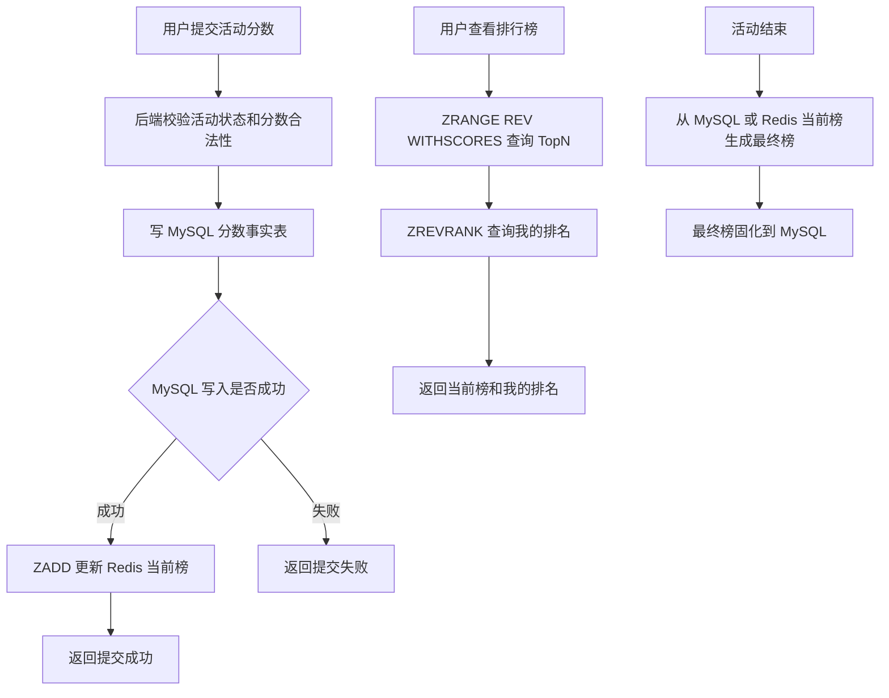

# 第 13 章：Sorted sets：适合排行榜和排序查询

## 1. 本章一句话

Sorted Set 适合保存“成员 + 分数”的排序数据，成员按 score 排序，因此适合排行榜、积分榜、TopN 和实时排名查询。参考：[Redis 官方 Sorted Sets 文档](https://redis.io/docs/latest/develop/data-types/sorted-sets/)

本章核心判断：Sorted Set 适合做活动实时榜、当前榜和高频排名查询；最终榜、奖励结算、可信排名结果仍应由 MySQL 固化。**标记：主观推断**

---

## 2. 适合解决什么问题？

| 场景      | 为什么适合                                                                                                                                                                                                         |
| ------- | ------------------------------------------------------------------------------------------------------------------------------------------------------------------------------------------------------------- |
| 活动实时排行榜 | 用户分数变化后，用 `ZADD` 写入或更新 score，再用 `ZRANGE ... REV WITHSCORES` 查询 TopN。参考：[Redis 官方 ZADD 文档](https://redis.io/docs/latest/commands/zadd/)；参考：[Redis 官方 ZRANGE 文档](https://redis.io/docs/latest/commands/zrange/) |
| 学习积分榜   | 用户积分可以作为 score，userId 作为 member，适合做积分排名展示。**标记：主观推断**                                                                                                                                                         |
| 热门内容榜   | 内容热度值可以作为 score，contentId 作为 member，适合查询热门 TopN。**标记：主观推断**                                                                                                                                                   |
| 我的排名    | 可以用 `ZREVRANK` 查询某个 member 按 score 从高到低排序的位置。参考：[Redis 官方 ZREVRANK 文档](https://redis.io/docs/latest/commands/zrevrank/)                                                                                       |
| 附近排名    | 可以先查用户 rank，再围绕 rank 查询前后范围，但深分页和大榜单要谨慎。**标记：主观推断**                                                                                                                                                           |

---

## 3. 主案例

```text id="t5v7nz"
主案例：活动实时排行榜

业务背景：
活动进行中，用户完成任务、提交分数或获得积分后，页面需要实时展示 TopN、我的排名、我的分数。

核心原因：
活动实时排行榜的核心问题是“按分数排序 + 高频查询 TopN + 查询我的排名”，Sorted Set 的 member + score 模型刚好匹配；但活动结束后的最终榜、奖励发放和结算结果，不能只依赖 Redis 当前榜。**标记：主观推断**
```

辅助案例：

* 学习积分榜：适合按学习积分排序，重点关注积分事实和榜单缓存分工。**标记：主观推断**
* 热门内容榜：适合按热度分数排序，重点关注 score 计算规则和定期衰减。**标记：主观推断**
* 我的排名 / 附近排名：适合个人排名展示，重点关注深分页和大榜查询边界。**标记：主观推断**

---

## 4. 核心流程



说明：

* `ZADD` 可以向 Sorted Set 添加成员或更新成员 score，适合更新用户当前分数。参考：[Redis 官方 ZADD 文档](https://redis.io/docs/latest/commands/zadd/)
* `ZRANGE` 支持按范围返回 Sorted Set 成员，并可结合 `REV`、`WITHSCORES` 查询倒序 TopN 和分数。参考：[Redis 官方 ZRANGE 文档](https://redis.io/docs/latest/commands/zrange/)
* `ZREVRANK` 可以返回成员在 Sorted Set 中按 score 从高到低排序的位置，适合查询“我的排名”。参考：[Redis 官方 ZREVRANK 文档](https://redis.io/docs/latest/commands/zrevrank/)
* Redis Sorted Set 适合承接活动进行中的当前榜查询，最终榜建议固化到 MySQL。**标记：主观推断**
* 如果分数是奖励结算依据，应先保证 MySQL 分数事实可靠，再更新 Redis 当前榜。**标记：主观推断**

---

## 5. 关键命令

| 命令                                                      | 作用                                                                                        |
| ------------------------------------------------------- | ----------------------------------------------------------------------------------------- |
| `ZADD activity:rank:{activityId} {score} {userId}`      | 写入或更新用户在当前榜中的分数。参考：[Redis 官方 ZADD 文档](https://redis.io/docs/latest/commands/zadd/)        |
| `ZRANGE activity:rank:{activityId} 0 99 REV WITHSCORES` | 查询当前榜 Top100 和对应分数。参考：[Redis 官方 ZRANGE 文档](https://redis.io/docs/latest/commands/zrange/) |
| `ZREVRANK activity:rank:{activityId} {userId}`          | 查询用户按高分倒序的当前排名。参考：[Redis 官方 ZREVRANK 文档](https://redis.io/docs/latest/commands/zrevrank/) |
| `ZSCORE activity:rank:{activityId} {userId}`            | 查询用户当前分数。参考：[Redis 官方 ZSCORE 文档](https://redis.io/docs/latest/commands/zscore/)           |

---

## 6. 边界和坑

| 问题            | 说明                                                             |
| ------------- | -------------------------------------------------------------- |
| 只靠 Redis 做最终榜 | Redis 当前榜可能因为过期、误删、重建失败或异常写入导致不可信；最终榜和奖励结算应落 MySQL。**标记：主观推断** |
| score 设计不清晰   | 同分排序、更新时间、提交次数、封顶规则不清楚，会导致排名结果和业务预期不一致。**标记：主观推断**             |
| 大 ZSET        | 大活动用户量很大时，单个 ZSET 会带来内存、迁移、删除、重建和查询成本。**标记：主观推断**              |
| 深分页           | 排行榜深页查询价值低但成本高，应限制页数或改成“我的附近排名”。**标记：主观推断**                    |
| 热榜 key        | 活动榜单 TopN 访问集中，可能形成热 key，需要缓存、限流或本地缓存辅助。**标记：主观推断**            |

---

## 7. 本章记忆点

1. Sorted Set 的核心价值是“member + score + 排序查询”。
2. 活动实时榜、积分榜、热门榜、TopN 都适合用 Sorted Set 做当前榜。**标记：主观推断**
3. Redis Sorted Set 负责实时排名，MySQL 负责事实分数、最终榜和奖励结算。**标记：主观推断**
