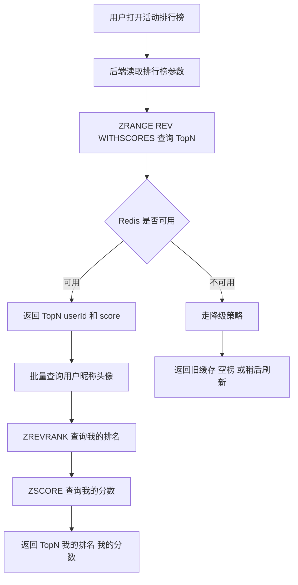
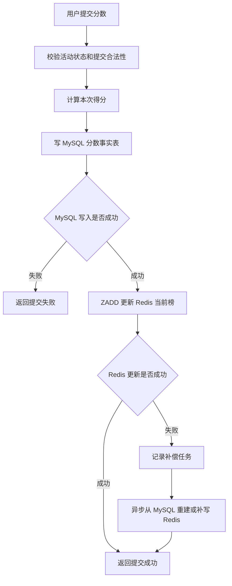
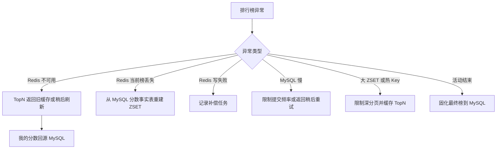
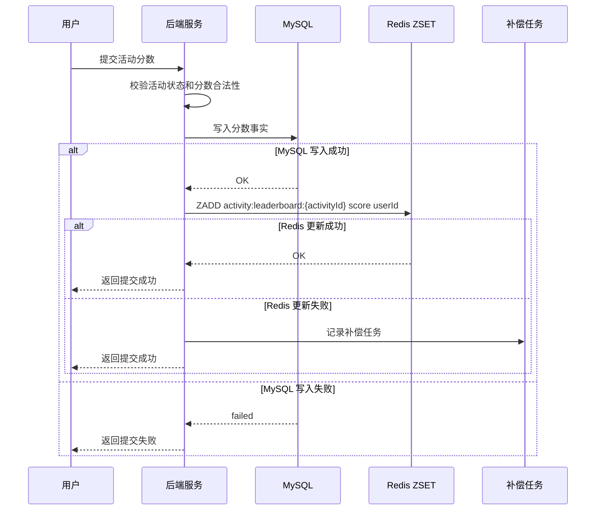
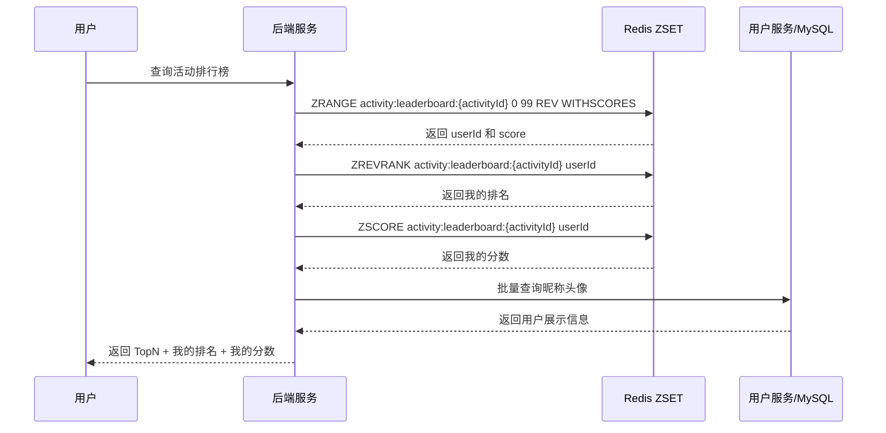
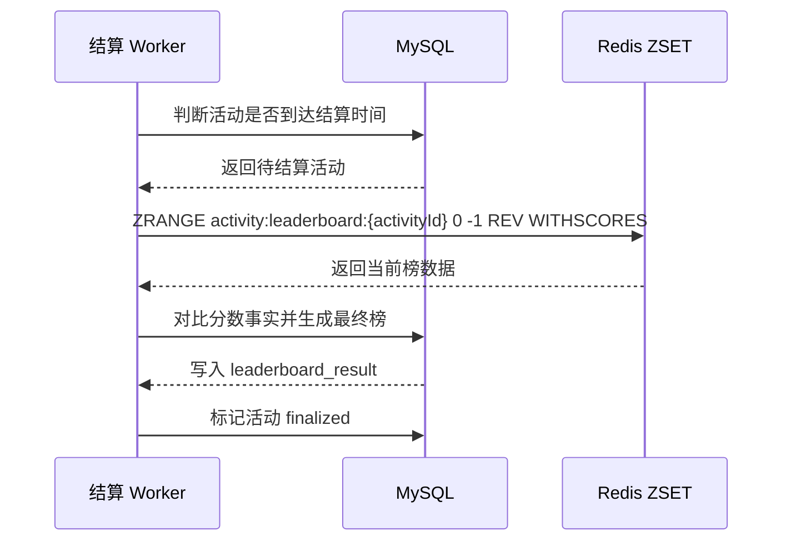

# Redis 知识点：Sorted sets

## 1. 一句话结论

> Redis Sorted Set 适合保存“成员 + 分数”的排序数据，成员可以按 score 排序，因此非常适合排行榜、TopN、我的排名这类场景。参考：[Redis 官方 Sorted Sets 文档](https://redis.io/docs/latest/develop/data-types/sorted-sets/)
> 在活动实时排行榜场景中，Sorted Set 适合做当前榜和实时排名查询；分数事实、最终榜、奖励结算仍建议由 MySQL 固化。**标记：主观推断**

---

## 2. 这个知识点是什么？

Sorted Set 是 Redis 中用于保存“唯一成员 + 分数 score”的有序集合数据类型。

可以这样理解：

```text id="h4d8np"
Redis Sorted Set = Set + Score + 排序能力

member = 排名对象，例如 userId、teamId、contentId
score = 排名依据，例如分数、积分、热度、时间权重
```

Redis 官方说明 Sorted Set 中的成员和 score 关联，并且可以按 score 排序。参考：[Redis 官方 Sorted Sets 文档](https://redis.io/docs/latest/develop/data-types/sorted-sets/)

从后端业务视角看，Sorted Set 最适合回答这类问题：

```text id="ai9q5x"
谁的分数最高？
Top 100 是谁？
某个用户排第几？
某个用户当前多少分？
排行榜现在有多少人？
```

这些问题正好是活动实时排行榜的核心问题。**标记：主观推断**

---

## 3. 它解决什么业务问题？

业务场景：活动实时排行榜。

例如一个积分活动：

```text id="jv35or"
用户完成任务，获得积分。
活动页需要实时展示：
1. 当前 Top 100
2. 我的当前分数
3. 我的当前排名
4. 排行榜参与人数
```

如果不用 Redis Sorted Set，常见问题是：

* 每次查询 TopN 都要 MySQL 排序，活动高峰时数据库压力大。**标记：主观推断**
* 每次查询我的排名都要计算全局排序，SQL 成本高。**标记：主观推断**
* 排名变化频繁，如果只靠 MySQL 实时排序，接口延迟和数据库压力都不好控制。**标记：主观推断**

| 业务问题          | 具体表现                     | Redis 如何解决                                                                                                                   |
| ------------- | ------------------------ | ---------------------------------------------------------------------------------------------------------------------------- |
| 当前榜 TopN 查询频繁 | 活动页、首页入口、弹窗都可能展示 Top100  | `ZRANGE ... REV WITHSCORES` 可以按 score 从高到低查询指定范围成员和分数。参考：[Redis 官方 ZRANGE 文档](https://redis.io/docs/latest/commands/zrange/) |
| 用户分数不断变化      | 用户完成任务、提交成绩、获得积分后，排名需要更新 | `ZADD` 可以添加成员或更新成员 score。参考：[Redis 官方 ZADD 文档](https://redis.io/docs/latest/commands/zadd/)                                  |
| 查询我的排名        | 用户进入活动页时要看到自己排第几         | `ZREVRANK` 可以查询成员按 score 从高到低排序的位置。参考：[Redis 官方 ZREVRANK 文档](https://redis.io/docs/latest/commands/zrevrank/)                |
| 查询我的分数        | 页面要展示我的当前活动分数            | `ZSCORE` 可以返回成员在 Sorted Set 中的 score。参考：[Redis 官方 ZSCORE 文档](https://redis.io/docs/latest/commands/zscore/)                  |
| 统计榜单人数        | 活动页可能展示参与排行榜人数           | `ZCARD` 可以返回 Sorted Set 的成员数量。参考：[Redis 官方 ZCARD 文档](https://redis.io/docs/latest/commands/zcard/)                           |

---

## 4. Redis 为什么适合？

| Redis 能力          | 对应业务价值                                | 证据 / 标记                                                                                                                         |
| ----------------- | ------------------------------------- | ------------------------------------------------------------------------------------------------------------------------------- |
| member + score 模型 | userId 做 member，活动分数做 score，刚好对应排行榜模型 | Sorted Set 成员和 score 关联，并可按 score 排序。参考：[Redis 官方 Sorted Sets 文档](https://redis.io/docs/latest/develop/data-types/sorted-sets/) |
| 更新分数              | 用户分数变化后，可以更新当前榜 score                 | `ZADD` 可以添加成员或更新成员 score。参考：[Redis 官方 ZADD 文档](https://redis.io/docs/latest/commands/zadd/)                                     |
| 查询 TopN           | 活动页可以查询当前榜 Top100                     | `ZRANGE` 可以按范围返回 Sorted Set 成员，并支持 `REV`、`WITHSCORES`。参考：[Redis 官方 ZRANGE 文档](https://redis.io/docs/latest/commands/zrange/)    |
| 查询我的排名            | 用户可以看到自己在当前榜的位置                       | `ZREVRANK` 返回成员按高分倒序的排名位置。参考：[Redis 官方 ZREVRANK 文档](https://redis.io/docs/latest/commands/zrevrank/)                            |
| 查询我的分数            | 页面可以直接展示用户当前分数                        | `ZSCORE` 返回指定成员的 score。参考：[Redis 官方 ZSCORE 文档](https://redis.io/docs/latest/commands/zscore/)                                   |

核心判断：

> 活动实时排行榜的核心是“分数变化后立即影响排序”，Sorted Set 的 score 排序模型和这个业务模型天然匹配。**标记：主观推断**

---

## 5. 它的边界是什么？

| 边界          | 说明                                 | 更合适的选择               |
| ----------- | ---------------------------------- | -------------------- |
| 不能单独做最终榜事实源 | Redis 当前榜可能因为误删、过期、重建失败、异常写入导致不可信  | MySQL 最终榜表           |
| 不能替代分数事实表   | 分数来源、提交记录、任务完成记录、计分明细需要可追溯         | MySQL 分数事实表 / 明细表    |
| 不能解决复杂结算    | 奖励发放、同分规则、作弊处理、人工调整需要完整业务流程        | MySQL + 结算 Worker    |
| 不适合无限大榜深分页  | 大 ZSET 深分页查询价值低，且会增加 Redis 和网络压力   | 限制页数 / 我的附近排名 / 离线榜  |
| 不适合复杂多维排序   | 如果排序依赖多个字段、复杂筛选、风控规则，单个 score 不够表达 | MySQL / 搜索系统 / 预计算榜单 |

关键边界：

> Sorted Set 适合“当前榜、实时榜、读性能加速”，不适合单独承担“最终结算、奖励发放、审计追溯”。**标记：主观推断**

---

## 6. 常见坑是什么？

| 常见坑                 | 线上风险                                             | 规避方式                                    |
| ------------------- | ------------------------------------------------ | --------------------------------------- |
| 只靠 Redis 做最终榜       | Redis 数据异常会影响奖励发放和结算可信度                          | 分数事实、最终榜、奖励结果落 MySQL。**标记：主观推断**        |
| score 设计不清楚         | 同分排序、更新时间、提交次数、封顶规则不明确，导致排名争议                    | 提前定义 score 规则和同分规则。**标记：主观推断**          |
| 大 ZSET              | 大活动所有用户都进一个 ZSET，可能带来内存、迁移、删除、重建风险               | 控制活动规模，必要时分片、只缓存活跃榜、最终榜离线固化。**标记：主观推断** |
| 深分页                 | 用户反复查第几千页排行榜，价值低但成本高                             | 限制页数，推荐“TopN + 我的排名 + 附近排名”。**标记：主观推断** |
| 热榜 key              | 活动首页 TopN 高频访问，可能集中打一个 ZSET key                  | 对 TopN 做短 TTL 缓存、本地缓存或接口限流。**标记：主观推断**  |
| Redis / MySQL 双写不一致 | MySQL 有分数事实，但 Redis 当前榜没更新，或者 Redis 有但 MySQL 没事实 | 先写事实源，再更新 Redis；失败走补偿重建。**标记：主观推断**     |

补充依据：

* `ZADD` 可添加成员或更新成员 score。参考：[Redis 官方 ZADD 文档](https://redis.io/docs/latest/commands/zadd/)
* `ZRANGE` 可按范围返回成员，并支持 `REV` 和 `WITHSCORES`。参考：[Redis 官方 ZRANGE 文档](https://redis.io/docs/latest/commands/zrange/)
* `ZREVRANK` 可返回成员按高分倒序排序的位置。参考：[Redis 官方 ZREVRANK 文档](https://redis.io/docs/latest/commands/zrevrank/)

---

## 7. MySQL / 本地缓存 / 其他方案是否更合适？

| 方案               | 是否适合           | 原因                                                                                                                       |
| ---------------- | -------------- | ------------------------------------------------------------------------------------------------------------------------ |
| MySQL            | 必须保留           | 适合保存分数事实、提交明细、最终榜、奖励结算、审计追溯。**标记：主观推断**                                                                                  |
| Redis Sorted Set | 适合做当前榜         | 适合按 score 实时排序、查询 TopN、查询我的排名。参考：[Redis 官方 Sorted Sets 文档](https://redis.io/docs/latest/develop/data-types/sorted-sets/) |
| 本地缓存             | 适合作为 TopN 辅助缓存 | TopN 是热点读，可以短时间本地缓存，但不能替代 Redis 当前榜。**标记：主观推断**                                                                          |
| Redis Set        | 不适合排序          | Set 适合去重和成员判断，不适合按分数排序。**标记：主观推断**                                                                                       |
| Redis Hash       | 不适合排名          | Hash 适合对象字段状态，不适合 TopN 和排名查询。**标记：主观推断**                                                                                 |
| 搜索系统 / OLAP      | 部分适合           | 如果榜单需要复杂筛选、聚合分析、历史回溯，搜索或 OLAP 更合适。**标记：主观推断**                                                                            |

最终判断：

> 活动实时排行榜如果核心需求是“实时分数排序 + TopN + 我的排名”，Redis Sorted Set 是优先选择；如果核心需求是“可信结算 + 复杂筛选 + 长期追溯”，MySQL 和离线计算才是主角。**标记：主观推断**

---

## 8. 具体业务场景例子

### 8.1 场景背景

业务：一个 7 天活动，用户完成任务获得活动积分，活动页展示实时排行榜。

接口示例：

```text id="h5bzuk"
提交分数：
POST /api/activities/{activityId}/score

查询 TopN：
GET /api/activities/{activityId}/leaderboard?limit=100

查询我的排名：
GET /api/activities/{activityId}/my-rank

活动结束结算：
POST /internal/activities/{activityId}/finalize-rank
```

数据来源：

* 用户任务完成记录来自业务服务。**标记：主观推断**
* 分数事实写入 MySQL。**标记：主观推断**
* Redis Sorted Set 保存活动当前榜。**标记：主观推断**
* 活动结束后最终榜固化到 MySQL。**标记：主观推断**

---

### 8.2 业务问题

如果不用 Redis Sorted Set，可能会遇到这些问题：

| 业务问题      | 具体表现                                                |
| --------- | --------------------------------------------------- |
| TopN 查询频繁 | 活动页每次打开都要展示前 100 名，如果每次 MySQL 排序查询，压力较大。**标记：主观推断** |
| 我的排名查询成本高 | 用户想知道自己排第几，如果用 MySQL 实时计算全局排名，成本高。**标记：主观推断**       |
| 分数变化频繁    | 用户完成任务后排名要尽快变化，纯 MySQL 排序刷新不够轻量。**标记：主观推断**         |
| 最终榜需要可信   | 奖励发放不能只看 Redis 当前榜，需要可追溯的分数事实和最终榜。**标记：主观推断**       |

用了 Redis Sorted Set 后：

* 用户分数变化后，用 `ZADD` 更新当前榜。参考：[Redis 官方 ZADD 文档](https://redis.io/docs/latest/commands/zadd/)
* 查 TopN 时，用 `ZRANGE ... REV WITHSCORES` 获取高分榜。参考：[Redis 官方 ZRANGE 文档](https://redis.io/docs/latest/commands/zrange/)
* 查我的排名时，用 `ZREVRANK` 获取用户倒序排名。参考：[Redis 官方 ZREVRANK 文档](https://redis.io/docs/latest/commands/zrevrank/)
* 查我的分数时，用 `ZSCORE` 获取用户当前 score。参考：[Redis 官方 ZSCORE 文档](https://redis.io/docs/latest/commands/zscore/)

---

### 8.3 Redis 设计

```text id="f7xvyd"
Redis key:
activity:leaderboard:{activityId}

Redis value:
Sorted Set
member = userId
score = activityScore

示例：
ZADD activity:leaderboard:1001 9800 user_123
ZRANGE activity:leaderboard:1001 0 99 REV WITHSCORES
ZREVRANK activity:leaderboard:1001 user_123
ZSCORE activity:leaderboard:1001 user_123

TTL:
活动进行中不建议随意过期，避免当前榜丢失。
活动结束并最终榜固化后，可以设置较长 TTL 或清理当前榜。
TTL 不是最终榜可靠性的保障。
**标记：主观推断**

MySQL:
score_fact 表保存分数事实：
- activity_id
- user_id
- score
- score_source
- submitted_at
- version
- trace_id

leaderboard_result 表保存最终榜：
- activity_id
- user_id
- final_score
- rank_no
- finalized_at

Redis 当前榜可以从 MySQL 分数事实表重建。
**标记：主观推断**

降级:
Redis 不可用时，TopN 可以返回旧缓存、空榜或提示稍后刷新。
我的分数可以从 MySQL 查询。
我的实时排名如果无法承受 MySQL 排名计算，可以降级为“暂不可用”。
**标记：主观推断**
```

---

### 8.4 读流程



说明：

* `ZRANGE` 支持按范围返回 Sorted Set 成员，并可结合 `REV` 和 `WITHSCORES` 查询高分 TopN。参考：[Redis 官方 ZRANGE 文档](https://redis.io/docs/latest/commands/zrange/)
* `ZREVRANK` 可以返回成员按 score 从高到低排序的位置，适合查询“我的排名”。参考：[Redis 官方 ZREVRANK 文档](https://redis.io/docs/latest/commands/zrevrank/)
* `ZSCORE` 可以返回成员当前 score，适合查询“我的分数”。参考：[Redis 官方 ZSCORE 文档](https://redis.io/docs/latest/commands/zscore/)
* Redis 返回的是榜单 member 和 score，用户昵称、头像、状态通常需要从用户服务或 MySQL 补齐。**标记：主观推断**
* 活动实时榜可以接受短暂不一致，但奖励结算不能只依赖实时榜接口返回结果。**标记：主观推断**

---

### 8.5 写流程



说明：

* `ZADD` 可以添加成员或更新成员 score，适合更新活动当前榜。参考：[Redis 官方 ZADD 文档](https://redis.io/docs/latest/commands/zadd/)
* 分数如果影响奖励结算，建议先写 MySQL 分数事实，再更新 Redis 当前榜。**标记：主观推断**
* Redis 更新失败时，MySQL 分数事实不能丢，应记录补偿任务修复当前榜。**标记：主观推断**
* 如果允许多次提交，需要明确 score 是覆盖最高分、累加分，还是最后一次分数。**标记：主观推断**
* 如果是累加积分，可以考虑 `ZINCRBY`，但要确保 MySQL 事实和 Redis 增量一致。参考：[Redis 官方 Sorted Sets 文档](https://redis.io/docs/latest/develop/data-types/sorted-sets/)

---

### 8.6 异常处理



说明：

* `ZCARD` 可以返回 Sorted Set 成员数量，可用于观察榜单规模。参考：[Redis 官方 ZCARD 文档](https://redis.io/docs/latest/commands/zcard/)
* Redis 当前榜丢失后，只要 MySQL 分数事实完整，就可以重建榜单。**标记：主观推断**
* Redis 不可用时，不建议用 MySQL 实时计算全量排名硬扛高峰流量。**标记：主观推断**
* 活动结束后应固化最终榜，避免活动结束后 Redis 当前榜继续变化。**标记：主观推断**
* 深分页和热榜访问要限制，否则容易让排行榜接口变成热点入口。**标记：主观推断**

---

### 8.7 监控指标

| 指标                                           | 作用                                                                              |
| -------------------------------------------- | ------------------------------------------------------------------------------- |
| Redis `ZADD` QPS                             | 判断分数更新压力。**标记：主观推断**                                                            |
| Redis `ZRANGE` QPS                           | 判断 TopN 查询压力和热榜访问情况。**标记：主观推断**                                                 |
| Redis `ZREVRANK` QPS                         | 判断“我的排名”查询压力。**标记：主观推断**                                                        |
| `ZCARD activity:leaderboard:{activityId}` 抽样 | 判断单个活动榜单规模。参考：[Redis 官方 ZCARD 文档](https://redis.io/docs/latest/commands/zcard/) |
| Redis P95 / P99 延迟                           | 判断大榜、热榜、深分页是否导致延迟升高。**标记：主观推断**                                                 |
| MySQL 分数事实写入失败数                              | 判断分数事实源是否稳定。**标记：主观推断**                                                         |
| Redis 更新失败次数                                 | 判断当前榜是否存在不同步风险。**标记：主观推断**                                                      |
| 补偿任务积压数                                      | 判断 Redis 当前榜是否长期落后 MySQL。**标记：主观推断**                                            |
| finalized 活动数 / 未结算活动数                       | 判断最终榜固化是否正常。**标记：主观推断**                                                         |
| used_memory / evicted_keys / slowlog         | 判断大 ZSET、内存淘汰和慢操作风险。**标记：主观推断**                                                 |

---

## 9. Mermaid 图

### 9.1 分数提交与当前榜更新流程



说明：

* `ZADD` 负责把用户分数写入或更新到当前榜。参考：[Redis 官方 ZADD 文档](https://redis.io/docs/latest/commands/zadd/)
* MySQL 先保存分数事实，Redis 再更新当前榜。**标记：主观推断**
* Redis 更新失败后，通过补偿任务修复当前榜。**标记：主观推断**

---

### 9.2 TopN 与我的排名查询流程



说明：

* `ZRANGE ... REV WITHSCORES` 适合查询高分 TopN 和分数。参考：[Redis 官方 ZRANGE 文档](https://redis.io/docs/latest/commands/zrange/)
* `ZREVRANK` 适合查询我的当前排名。参考：[Redis 官方 ZREVRANK 文档](https://redis.io/docs/latest/commands/zrevrank/)
* `ZSCORE` 适合查询我的当前分数。参考：[Redis 官方 ZSCORE 文档](https://redis.io/docs/latest/commands/zscore/)
* 用户展示信息不要全部塞进 ZSET member，member 建议只放稳定 ID。**标记：主观推断**

---

### 9.3 活动结束最终榜固化流程



说明：

* `ZRANGE` 可以按范围读取排行榜成员和分数。参考：[Redis 官方 ZRANGE 文档](https://redis.io/docs/latest/commands/zrange/)
* 最终榜固化前，应以 MySQL 分数事实和活动规则做校验。**标记：主观推断**
* 活动 finalized 后，不应再允许普通分数写入影响最终榜。**标记：主观推断**

---

## 10. 工程评审关注点

| 关注点                      | 说明                                                                                                                                          |
| ------------------------ | ------------------------------------------------------------------------------------------------------------------------------------------- |
| 为什么用 Sorted Set？         | 因为活动实时榜核心是 member + score + 排序查询，Sorted Set 正好匹配。参考：[Redis 官方 Sorted Sets 文档](https://redis.io/docs/latest/develop/data-types/sorted-sets/) |
| 为什么不用 MySQL 直接查排名？       | MySQL 适合事实源和最终榜，Redis Sorted Set 更适合承接高频当前榜查询。**标记：主观推断**                                                                                   |
| Redis 当前榜和 MySQL 不一致怎么办？ | MySQL 保存分数事实，Redis 更新失败走补偿；必要时从 MySQL 重建当前榜。**标记：主观推断**                                                                                     |
| 最终榜怎么保证可信？               | 活动结束后固化到 MySQL，并使用分数事实表校验，不能只依赖 Redis 当前榜。**标记：主观推断**                                                                                       |
| score 怎么设计？              | 要明确高分覆盖还是累加、同分排序、时间权重、封顶规则。**标记：主观推断**                                                                                                      |
| 大 ZSET 怎么处理？             | 监控 ZCARD 和内存，限制深分页，必要时分片、冷热榜拆分或离线榜。**标记：主观推断**                                                                                              |
| Redis 挂了怎么办？             | TopN 可降级旧缓存或稍后刷新，分数事实仍写 MySQL，当前榜后续重建。**标记：主观推断**                                                                                           |
| 为什么不用 Set / Hash？        | Set 不支持 score 排序，Hash 不支持排名查询；它们不适合排行榜主模型。**标记：主观推断**                                                                                       |

---

## 11. 最终记忆点

1. Sorted Set 的核心价值是“member + score + 排序查询”。
2. 活动实时排行榜适合 Redis Sorted Set，因为它需要高频更新分数、查询 TopN、查询我的排名。**标记：主观推断**
3. Redis Sorted Set 适合当前榜，MySQL 适合分数事实和最终榜。**标记：主观推断**
4. 排行榜设计最容易出问题的不是命令，而是 score 规则、最终榜固化、大 ZSET、深分页和热榜 key。**标记：主观推断**
5. 奖励结算不能只看 Redis 当前榜，必须有可追溯的事实数据和最终榜结果。**标记：主观推断**

---

## 12. 参考资料

1. [Redis 官方 Sorted Sets 文档](https://redis.io/docs/latest/develop/data-types/sorted-sets/)：用于确认 Sorted Set 的 member + score 排序模型，以及排行榜相关使用方式。
2. [Redis 官方 ZADD 文档](https://redis.io/docs/latest/commands/zadd/)：用于确认 `ZADD` 可以添加成员或更新成员 score。
3. [Redis 官方 ZRANGE 文档](https://redis.io/docs/latest/commands/zrange/)：用于确认 `ZRANGE` 可以按范围读取 Sorted Set 成员，并支持 `REV`、`WITHSCORES` 等选项。
4. [Redis 官方 ZREVRANK 文档](https://redis.io/docs/latest/commands/zrevrank/)：用于确认 `ZREVRANK` 可以返回成员按高分倒序排序的位置。
5. [Redis 官方 ZSCORE 文档](https://redis.io/docs/latest/commands/zscore/)：用于确认 `ZSCORE` 可以返回成员当前 score。
6. [Redis 官方 ZCARD 文档](https://redis.io/docs/latest/commands/zcard/)：用于确认 `ZCARD` 可以返回 Sorted Set 成员数量。
