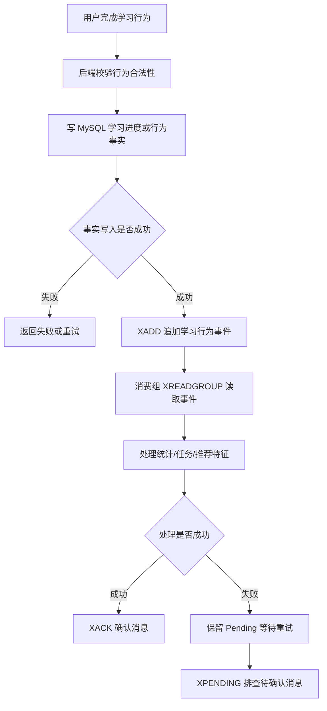

# 第 14 章：Streams：适合事件流和可消费的追加日志

## 1. 本章一句话

Redis Streams 适合保存持续追加的事件，并支持消费组读取、消息确认和待确认消息管理。参考：[Redis 官方 Streams 文档](https://redis.io/docs/latest/develop/data-types/streams/)

本章核心判断：Streams 适合做业务内轻量事件流和可恢复消费通道，不适合替代 Kafka / RocketMQ 这类完整 MQ 承担大规模跨系统解耦、长期堆积和复杂治理。**标记：主观推断**

---

## 2. 适合解决什么问题？

| 场景         | 为什么适合                                                                                                                          |
| ---------- | ------------------------------------------------------------------------------------------------------------------------------ |
| 学习行为日志异步消费 | 用户完成课程、章节、练习后，可以把行为事件追加到 Stream，由消费者异步处理统计、任务、推荐等后续逻辑。参考：[Redis 官方 XADD 文档](https://redis.io/docs/latest/commands/xadd/)       |
| 多消费者并行处理   | Streams 支持 consumer group，多个消费者可以协同消费同一个 Stream。参考：[Redis 官方 XREADGROUP 文档](https://redis.io/docs/latest/commands/xreadgroup/) |
| 消费成功后确认    | 消费者处理成功后用 `XACK` 确认，避免已处理消息长期停留在待确认列表中。参考：[Redis 官方 XACK 文档](https://redis.io/docs/latest/commands/xack/)                      |
| 失败消息排查     | `XPENDING` 可以查看消费组中的待确认消息，适合排查消费者失败、超时或未确认问题。参考：[Redis 官方 XPENDING 文档](https://redis.io/docs/latest/commands/xpending/)        |
| 轻量异步任务流    | 适合业务内简单异步处理；跨系统强解耦、大规模堆积、死信治理、消息轨迹等场景更适合专业 MQ。**标记：主观推断**                                                                      |

---

## 3. 主案例

```text
主案例：学习行为日志异步消费

业务背景：
用户完成章节、提交练习、观看课程后，主流程需要更新学习进度；同时还要异步触发学习统计、成长任务、推荐特征更新等后续处理。

核心原因：
学习行为天然是按时间持续追加的事件，Streams 可以承接事件追加、消费组读取、ACK 确认和 Pending 排查；但学习进度事实、权益结果、审计日志不能只放 Redis，必须有 MySQL、日志系统或数据仓库兜底。**标记：主观推断**
```

辅助案例：

* 活动奖励发放任务流：适合轻量异步任务分发，重点关注幂等和补偿。**标记：主观推断**
* 用户操作事件流：适合短期可消费操作事件，重点关注长期审计不要只依赖 Redis。**标记：主观推断**
* 轻量异步任务队列：适合业务内简单异步处理，重点关注不要替代完整 MQ。**标记：主观推断**

---

## 4. 核心流程



说明：

* `XADD` 用于向 Stream 追加消息，适合写入学习行为事件。参考：[Redis 官方 XADD 文档](https://redis.io/docs/latest/commands/xadd/)
* `XREADGROUP` 用于消费组读取 Stream 消息，适合多个消费者分摊处理学习事件。参考：[Redis 官方 XREADGROUP 文档](https://redis.io/docs/latest/commands/xreadgroup/)
* `XACK` 用于确认消费组中已经成功处理的消息。参考：[Redis 官方 XACK 文档](https://redis.io/docs/latest/commands/xack/)
* 学习进度、权益、结算、审计等关键事实应先落 MySQL 或日志系统，Streams 只做异步事件通道。**标记：主观推断**
* 消费失败不能直接丢弃消息，需要结合 Pending、重试、幂等和补偿处理。**标记：主观推断**

---

## 5. 关键命令

| 命令                                                                      | 作用                                                                                                        |
| ----------------------------------------------------------------------- | --------------------------------------------------------------------------------------------------------- |
| `XADD learning:events * userId 123 event lesson_completed lessonId 456` | 追加一条学习行为事件。参考：[Redis 官方 XADD 文档](https://redis.io/docs/latest/commands/xadd/)                             |
| `XGROUP CREATE learning:events progress-group $ MKSTREAM`               | 创建消费组，让多个消费者协同处理学习事件。参考：[Redis 官方 XGROUP CREATE 文档](https://redis.io/docs/latest/commands/xgroup-create/) |
| `XREADGROUP GROUP progress-group c1 COUNT 10 STREAMS learning:events >` | 消费组读取新事件。参考：[Redis 官方 XREADGROUP 文档](https://redis.io/docs/latest/commands/xreadgroup/)                   |
| `XACK learning:events progress-group 1720000000000-0`                   | 消费成功后确认消息。参考：[Redis 官方 XACK 文档](https://redis.io/docs/latest/commands/xack/)                              |
| `XPENDING learning:events progress-group`                               | 查看待确认消息，排查消费者失败或未 ACK。参考：[Redis 官方 XPENDING 文档](https://redis.io/docs/latest/commands/xpending/)          |

---

## 6. 边界和坑

| 问题               | 说明                                                                                                         |
| ---------------- | ---------------------------------------------------------------------------------------------------------- |
| 把 Streams 当完整 MQ | Streams 适合轻量事件流，但跨系统强解耦、大规模堆积、复杂路由、死信治理、消息轨迹通常更适合专业 MQ。**标记：主观推断**                                         |
| 只写 Stream 不落事实源  | 如果学习行为影响进度、权益、统计或审计，只写 Redis 会带来丢失后不可追溯风险。**标记：主观推断**                                                      |
| 消费者不 ACK         | 消费成功后不执行 `XACK`，消息会停留在待确认状态，后续排查和重试会变复杂。参考：[Redis 官方 XACK 文档](https://redis.io/docs/latest/commands/xack/) |
| Pending 堆积       | 消费者异常、处理超时、没有重试机制，会导致待确认消息持续堆积。**标记：主观推断**                                                                 |
| Stream 无限增长      | 学习行为持续追加，如果不做长度控制或生命周期设计，会造成内存压力。**标记：主观推断**                                                               |
| 消费幂等缺失           | 失败重试可能重复处理同一事件，学习任务、积分、奖励等下游处理必须做幂等。**标记：主观推断**                                                            |

---

## 7. 本章记忆点

1. Streams 的核心价值是“事件追加 + 消费组 + ACK + Pending 可排查”。
2. 学习行为日志、用户操作事件、轻量任务流适合 Streams，但关键事实不能只放 Redis。**标记：主观推断**
3. Streams 不是完整 MQ 替代品；跨系统、大规模、强治理场景优先考虑 Kafka / RocketMQ 等专业 MQ。**标记：主观推断**
