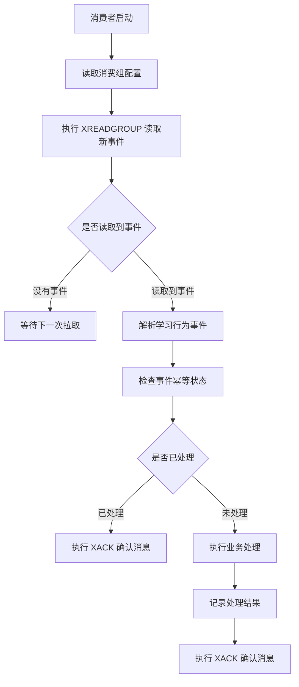
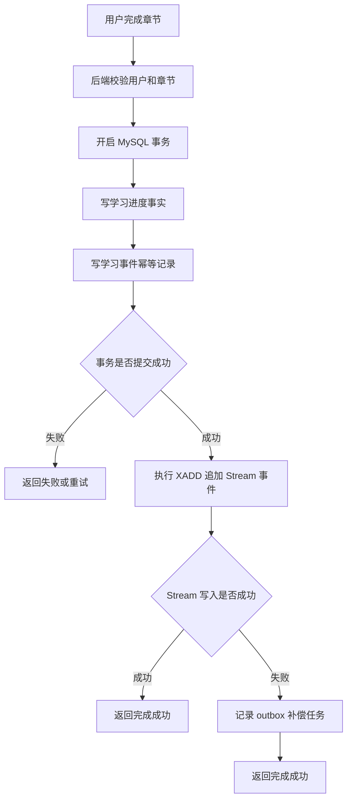
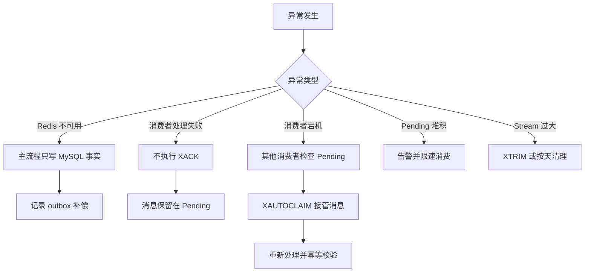
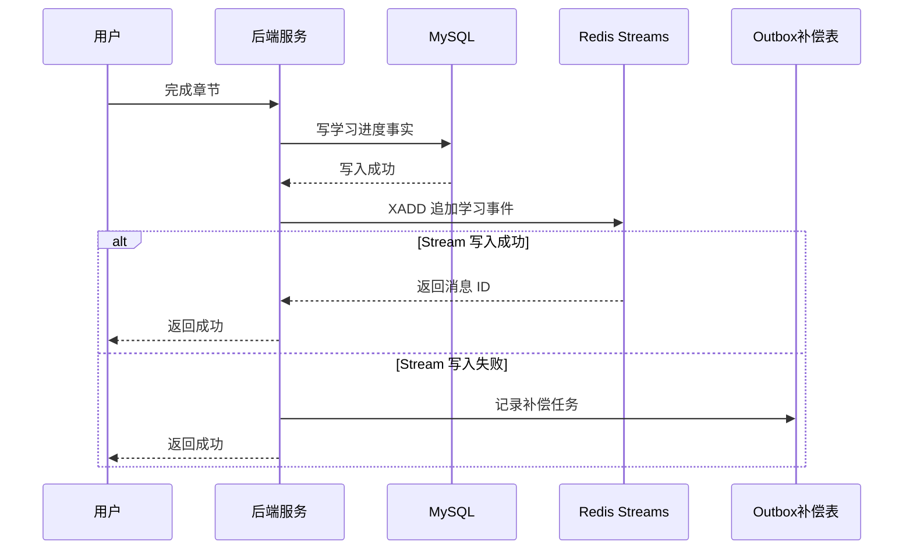
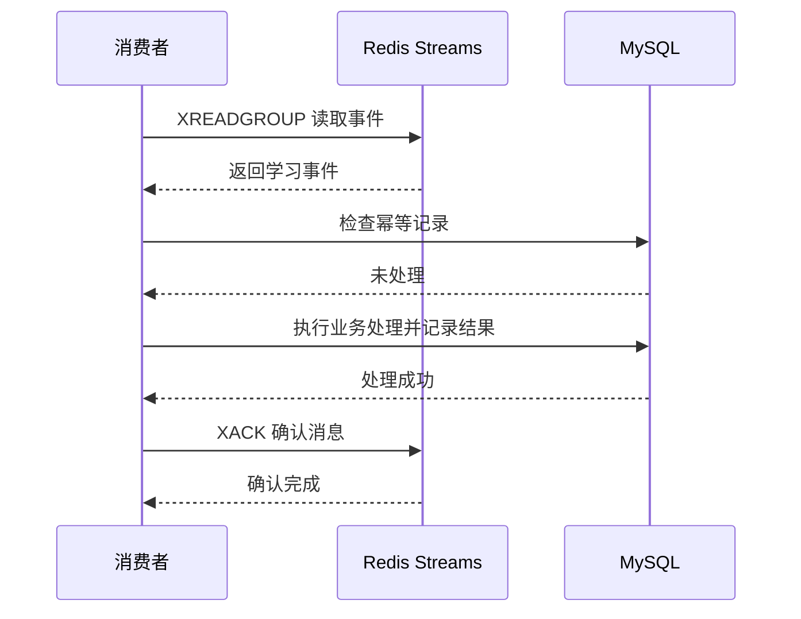
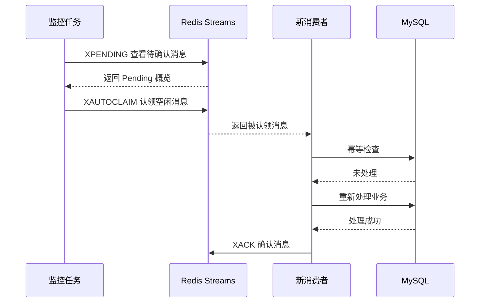
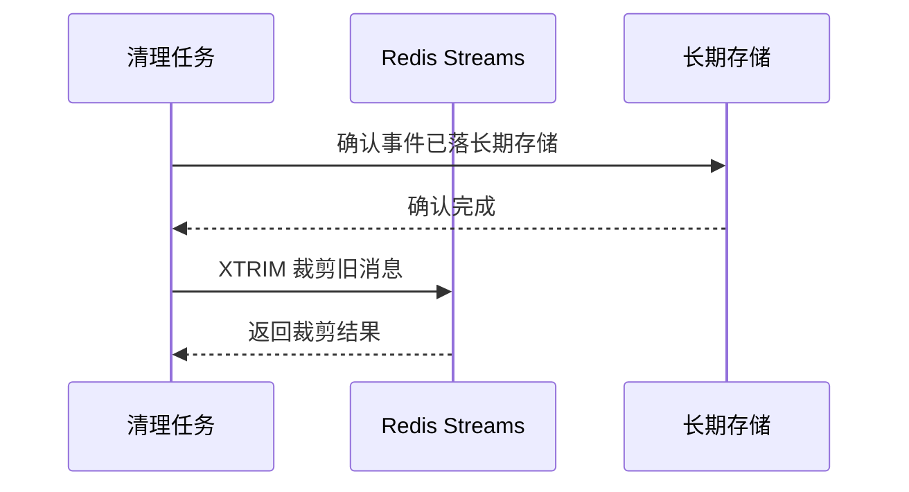

# Redis 知识点：Streams

## 1. 一句话结论

> Redis Streams 适合保存持续追加的事件流，并支持消费组、消息确认和 Pending 消息管理。参考：[Redis 官方 Streams 文档](https://redis.io/docs/latest/develop/data-types/streams/)
> 在学习行为日志异步消费场景中，Streams 适合做业务内轻量事件流和可恢复消费通道；学习进度事实、权益结果、长期审计仍应由 MySQL、日志系统或数据仓库兜底。**标记：主观推断**

---

## 2. 这个知识点是什么？

Streams 是 Redis 中用于保存“按时间追加的事件记录”的数据类型。

可以简单理解为：

```text id="s5m9c1"
Redis Stream = 可追加事件日志 + 消费组 + 消息确认 + Pending 消息管理

事件来源：用户行为、业务事件、轻量任务
写入方式：XADD 追加消息
消费方式：XREADGROUP 消费组读取
确认方式：XACK 确认处理完成
排查方式：XPENDING 查看待确认消息
```

Redis 官方文档说明，Stream 类似 append-only log，并支持 consumer groups 这类复杂消费策略。参考：[Redis 官方 Streams 文档](https://redis.io/docs/latest/develop/data-types/streams/)

从后端工程视角看，Streams 不是“普通缓存”，而是 Redis 提供的一种轻量事件流能力。**标记：主观推断**

---

## 3. 它解决什么业务问题？

业务场景：学习行为日志异步消费。

例如用户在学习系统中发生这些行为：

```text id="y7f3n8"
用户观看课程
用户完成章节
用户提交练习
用户通过测验
用户领取学习任务奖励
```

这些行为通常需要触发多个后续处理：

* 更新学习进度。**标记：主观推断**
* 统计学习时长。**标记：主观推断**
* 触发成长任务。**标记：主观推断**
* 更新推荐特征。**标记：主观推断**
* 写入分析日志。**标记：主观推断**

如果所有逻辑都放在用户请求主流程里，会让接口变慢、耦合变重、失败处理变复杂。**标记：主观推断**

| 业务问题            | 具体表现                           | Redis 如何解决                                                                                                   |
| --------------- | ------------------------------ | ------------------------------------------------------------------------------------------------------------ |
| 主流程太重           | 用户完成章节后，同步处理统计、任务、推荐，接口耗时变长    | 主流程只写关键事实，再用 `XADD` 追加事件，由消费者异步处理。参考：[Redis 官方 XADD 文档](https://redis.io/docs/latest/commands/xadd/)         |
| 多个后续逻辑需要消费同一类事件 | 学习统计、成长任务、推荐特征都需要学习行为事件        | 使用不同消费组或消费逻辑处理事件。参考：[Redis 官方 Streams 文档](https://redis.io/docs/latest/develop/data-types/streams/)          |
| 消费失败需要排查        | 消费者处理失败、进程重启、没有 ACK 后，消息不能直接消失 | `XPENDING` 可以查看消费组中的待确认消息。参考：[Redis 官方 XPENDING 文档](https://redis.io/docs/latest/commands/xpending/)         |
| 消费成功需要确认        | 事件处理完成后，需要标记这条消息已经处理           | `XACK` 可以确认消息，并从 Pending Entries List 中移除。参考：[Redis 官方 XACK 文档](https://redis.io/docs/latest/commands/xack/) |
| 业务内需要轻量异步任务流    | 不想引入完整 MQ，但又需要比 List 更强的消费确认能力 | Streams 适合轻量事件流；大规模跨系统消息治理仍应使用专业 MQ。**标记：主观推断**                                                              |

---

## 4. Redis 为什么适合？

| Redis 能力   | 对应业务价值                     | 证据 / 标记                                                                                                                |
| ---------- | -------------------------- | ---------------------------------------------------------------------------------------------------------------------- |
| 追加事件       | 学习行为可以按发生顺序写入事件流           | `XADD` 可以向 Stream 追加消息。参考：[Redis 官方 XADD 文档](https://redis.io/docs/latest/commands/xadd/)                              |
| 消费组        | 多个消费者可以协同处理同一个 Stream 中的消息 | `XREADGROUP` 支持 consumer group 读取。参考：[Redis 官方 XREADGROUP 文档](https://redis.io/docs/latest/commands/xreadgroup/)       |
| ACK 确认     | 消费者处理成功后，可以确认消息已处理         | `XACK` 用于从 Pending Entries List 中移除已确认消息。参考：[Redis 官方 XACK 文档](https://redis.io/docs/latest/commands/xack/)            |
| Pending 排查 | 消费失败或未确认消息可以被发现            | `XPENDING` 可以查看消费组中的 Pending 消息。参考：[Redis 官方 XPENDING 文档](https://redis.io/docs/latest/commands/xpending/)             |
| 消息转移       | 消费者故障后，可以让其他消费者接管未完成消息     | `XAUTOCLAIM` 可以自动认领空闲时间达到条件的 Pending 消息。参考：[Redis 官方 XAUTOCLAIM 文档](https://redis.io/docs/latest/commands/xautoclaim/) |

核心判断：

> 学习行为日志异步消费的核心不是“缓存结果”，而是“把用户行为变成可消费事件”，Streams 的追加、消费组、ACK、Pending 能力刚好匹配这个需求。**标记：主观推断**

---

## 5. 它的边界是什么？

| 边界                 | 说明                                                  | 更合适的选择                                                                                           |
| ------------------ | --------------------------------------------------- | ------------------------------------------------------------------------------------------------ |
| 不能替代完整 MQ          | 跨系统强解耦、大规模堆积、死信队列、消息轨迹、复杂路由通常不是 Redis Streams 的核心优势 | Kafka / RocketMQ / RabbitMQ。**标记：主观推断**                                                          |
| 不能只靠 Stream 保存关键事实 | 如果学习行为影响进度、权益、计费、奖励、审计，只写 Redis 会有丢失后不可追溯风险         | MySQL 事实表 / 日志系统 / 数据仓库。**标记：主观推断**                                                              |
| 不能无限追加不清理          | 学习行为持续写入，如果不限制长度或生命周期，会造成内存压力                       | `XTRIM` / 分时间 key / 数据落库后清理。参考：[Redis 官方 XTRIM 文档](https://redis.io/docs/latest/commands/xtrim/) |
| 不能忽略重复消费           | 消费失败重试、消费者恢复、消息认领都可能导致同一事件被再次处理                     | 下游业务幂等表 / 去重键 / 状态机。**标记：主观推断**                                                                  |
| 不适合长期审计分析          | Redis 更适合在线处理，长期行为分析和审计需要稳定存储和查询能力                  | 日志系统 / 数仓 / OLAP。**标记：主观推断**                                                                     |

关键边界：

> Streams 适合做“业务内轻量事件通道”，不适合做“所有学习行为的唯一事实源”。**标记：主观推断**

---

## 6. 常见坑是什么？

| 常见坑              | 线上风险                           | 规避方式                                                                                                                                                                                            |
| ---------------- | ------------------------------ | ----------------------------------------------------------------------------------------------------------------------------------------------------------------------------------------------- |
| 只写 Stream 不写事实表  | Redis 数据丢失、清理或异常后，学习行为无法恢复     | 关键学习行为先写 MySQL 或日志系统，再写 Stream。**标记：主观推断**                                                                                                                                                      |
| 消费者处理成功但没 ACK    | 消息长期停留在 Pending，后续排查和重试复杂      | 消费成功后必须执行 `XACK`。参考：[Redis 官方 XACK 文档](https://redis.io/docs/latest/commands/xack/)                                                                                                             |
| Pending 消息没人处理   | 消费者宕机后消息一直没人接管，异步任务卡住          | 使用 `XPENDING` 监控，必要时用 `XAUTOCLAIM` 接管。参考：[Redis 官方 XPENDING 文档](https://redis.io/docs/latest/commands/xpending/)；参考：[Redis 官方 XAUTOCLAIM 文档](https://redis.io/docs/latest/commands/xautoclaim/) |
| Stream 无限增长      | 行为事件持续追加导致内存上涨                 | 使用 `XTRIM` 控制长度，或按天拆分 key。参考：[Redis 官方 XTRIM 文档](https://redis.io/docs/latest/commands/xtrim/)                                                                                                  |
| 消费幂等缺失           | 重试或接管后重复处理，导致学习时长、积分、任务重复增加    | 用 eventId 做幂等键，下游处理先判断是否已处理。**标记：主观推断**                                                                                                                                                         |
| 把 Streams 当完整 MQ | 后续需要复杂路由、死信、消息轨迹、大规模堆积时，治理能力不足 | 高要求消息系统优先选择专业 MQ。**标记：主观推断**                                                                                                                                                                    |

---

## 7. MySQL / 本地缓存 / 其他方案是否更合适？

| 方案               | 是否适合      | 原因                                                                                                                 |
| ---------------- | --------- | ------------------------------------------------------------------------------------------------------------------ |
| MySQL            | 必须保留      | 适合保存学习进度事实、用户权益结果、任务完成状态和审计所需记录。**标记：主观推断**                                                                        |
| Redis Streams    | 适合做异步事件通道 | 适合事件追加、消费组读取、ACK 确认和 Pending 排查。参考：[Redis 官方 Streams 文档](https://redis.io/docs/latest/develop/data-types/streams/) |
| Redis Lists      | 只适合更简单队列  | Lists 可以做简单队列，但缺少 Streams 这种消费组、Pending、ACK 语义。**标记：主观推断**                                                         |
| 本地缓存             | 不适合做事件流   | 本地缓存无法跨实例可靠消费学习行为事件。**标记：主观推断**                                                                                    |
| Kafka / RocketMQ | 适合更重的消息系统 | 跨系统解耦、大规模堆积、消息治理、消息轨迹、死信处理更适合专业 MQ。**标记：主观推断**                                                                     |
| 日志系统 / 数据仓库      | 适合长期分析    | 学习行为长期分析、报表、审计、推荐训练更适合日志系统或数据仓库。**标记：主观推断**                                                                        |

最终判断：

> 当前场景如果只是业务内轻量异步消费，Redis Streams 足够合适；如果目标是公司级消息总线、长期堆积、跨系统强解耦，就应该优先考虑专业 MQ。**标记：主观推断**

---

## 8. 具体业务场景例子

### 8.1 场景背景

业务：学习平台中，用户完成章节后，需要更新学习进度，并异步触发统计、任务、推荐特征更新。

接口示例：

```text id="z8u6c3"
提交章节完成：
POST /api/courses/{courseId}/lessons/{lessonId}/complete

查询学习进度：
GET /api/courses/{courseId}/progress

消费者处理学习事件：
worker: learning-progress-consumer
worker: learning-task-consumer
worker: learning-feature-consumer
```

数据来源：

* 用户学习行为来自业务接口。**标记：主观推断**
* 学习进度事实写入 MySQL。**标记：主观推断**
* Redis Streams 保存待异步消费的学习行为事件。**标记：主观推断**
* 长期分析数据进入日志系统或数据仓库。**标记：主观推断**

---

### 8.2 业务问题

如果不用 Streams，可能会遇到这些问题：

| 业务问题          | 具体表现                                                     |
| ------------- | -------------------------------------------------------- |
| 主流程同步逻辑太重     | 完成章节后同时处理进度、任务、统计、推荐，接口响应变慢。**标记：主观推断**                  |
| 后续处理耦合        | 每新增一个学习后置逻辑，都要改主流程代码。**标记：主观推断**                         |
| 消费失败不好恢复      | 如果异步任务失败，没有统一的 Pending 和重试机制。**标记：主观推断**                 |
| 简单 List 队列不够用 | 只用 List 做队列，消费确认、失败排查和消费者协同能力不足。**标记：主观推断**              |
| 完整 MQ 又太重     | 业务内轻量事件流，如果直接引入 Kafka / RocketMQ，部署和治理成本可能偏高。**标记：主观推断** |

用了 Redis Streams 后：

* 主流程写入关键事实后，通过 `XADD` 追加学习行为事件。参考：[Redis 官方 XADD 文档](https://redis.io/docs/latest/commands/xadd/)
* 消费者通过 `XREADGROUP` 消费事件。参考：[Redis 官方 XREADGROUP 文档](https://redis.io/docs/latest/commands/xreadgroup/)
* 处理成功后通过 `XACK` 确认。参考：[Redis 官方 XACK 文档](https://redis.io/docs/latest/commands/xack/)
* 消费异常时通过 `XPENDING` 排查。参考：[Redis 官方 XPENDING 文档](https://redis.io/docs/latest/commands/xpending/)

---

### 8.3 Redis 设计

```text id="j6r2n9"
Redis key:
learning:stream:events:{yyyyMMdd}

Redis value:
Stream entry

Stream entry 字段:
eventId = 全局唯一事件 ID
userId = 用户 ID
courseId = 课程 ID
lessonId = 章节 ID
eventType = lesson_completed
occurredAt = 行为发生时间
traceId = 请求链路 ID

消费组:
learning-progress-group
learning-task-group
learning-feature-group

TTL:
Stream 本身不建议依赖短 TTL 自动删除。
可以按天拆 key，事件被消费并落入长期存储后，再按保留周期清理旧 Stream。
**标记：主观推断**

MySQL:
learning_progress 表保存学习进度事实。
learning_event_log 表可保存关键行为事件或幂等记录。
consumer_task_log 表可保存消费者处理状态。
**标记：主观推断**

降级:
Redis Streams 写入失败时，不能影响已经写入 MySQL 的学习进度事实。
可以记录 outbox 表，由后台任务补写 Stream 或直接补偿消费逻辑。
**标记：主观推断**
```

---

### 8.4 读流程



说明：

* `XREADGROUP` 支持 consumer group 读取 Stream 消息，适合多个消费者分摊处理学习事件。参考：[Redis 官方 XREADGROUP 文档](https://redis.io/docs/latest/commands/xreadgroup/)
* `XACK` 用于确认消费组中已经成功处理的消息。参考：[Redis 官方 XACK 文档](https://redis.io/docs/latest/commands/xack/)
* 消费前先做幂等检查，可以避免重复消费导致任务、积分或统计重复处理。**标记：主观推断**
* 读流程中的“未读到事件”不是异常，应正常等待下一次拉取。**标记：主观推断**

---

### 8.5 写流程



说明：

* `XADD` 用于向 Stream 追加消息，并可使用 `*` 自动生成消息 ID。参考：[Redis 官方 XADD 文档](https://redis.io/docs/latest/commands/xadd/)
* 学习进度如果是关键事实，建议先写 MySQL，再写 Stream。**标记：主观推断**
* Stream 写入失败时，不应回滚已经提交的学习进度事实，应记录补偿任务。**标记：主观推断**
* 如果学习行为事件一定不能丢，建议使用 outbox 表保证后续补投递。**标记：主观推断**

---

### 8.6 异常处理



说明：

* `XPENDING` 可以查看消费组中的 Pending 消息，用于排查未确认消息。参考：[Redis 官方 XPENDING 文档](https://redis.io/docs/latest/commands/xpending/)
* `XAUTOCLAIM` 可以让消费者认领空闲时间达到条件的 Pending 消息。参考：[Redis 官方 XAUTOCLAIM 文档](https://redis.io/docs/latest/commands/xautoclaim/)
* `XTRIM` 可以裁剪 Stream 长度，用于控制 Stream 规模。参考：[Redis 官方 XTRIM 文档](https://redis.io/docs/latest/commands/xtrim/)
* Redis 不可用时，关键事实仍应先写 MySQL，异步事件通过 outbox 后续补偿。**标记：主观推断**
* 消费失败时不应直接 ACK，否则消息会被认为处理完成。**标记：主观推断**
* 重试和接管消息时必须做幂等，否则可能重复发放任务奖励或重复累计统计。**标记：主观推断**

---

### 8.7 监控指标

| 指标                  | 作用                                                                                                 |
| ------------------- | -------------------------------------------------------------------------------------------------- |
| `XADD` 写入 QPS       | 判断学习行为事件写入压力。**标记：主观推断**                                                                           |
| `XREADGROUP` 消费 QPS | 判断消费者处理能力是否跟得上生产速度。**标记：主观推断**                                                                     |
| Pending 消息数量        | 判断是否有消费失败、消费者挂掉或 ACK 缺失。参考：[Redis 官方 XPENDING 文档](https://redis.io/docs/latest/commands/xpending/) |
| 消费延迟                | 判断事件从写入到处理完成的耗时。**标记：主观推断**                                                                        |
| Stream 长度           | 判断 Stream 是否持续增长，需要清理或扩容。参考：[Redis 官方 XINFO 文档](https://redis.io/docs/latest/commands/xinfo/)      |
| 消费失败次数              | 判断业务处理是否异常。**标记：主观推断**                                                                             |
| 幂等冲突次数              | 判断重复消费是否频繁。**标记：主观推断**                                                                             |
| outbox 积压数          | 判断 Stream 写入失败后的补偿是否正常。**标记：主观推断**                                                                 |
| Redis P95 / P99 延迟  | 判断 Stream 读写是否影响 Redis 整体性能。**标记：主观推断**                                                            |
| used_memory         | 判断 Stream 数据是否带来内存压力。**标记：主观推断**                                                                   |

---

## 9. Mermaid 图

说明：以下 Mermaid 图使用 `sequenceDiagram`，语法保持简单，支持 Cursor 和浏览器显示。**标记：主观推断**

### 9.1 生产者写入 Stream 流程



说明：

* `XADD` 负责把学习行为追加到 Stream。参考：[Redis 官方 XADD 文档](https://redis.io/docs/latest/commands/xadd/)
* Outbox 用于补偿 Stream 写入失败，不是 Redis 官方机制。**标记：主观推断**

---

### 9.2 消费组读取和 ACK 流程



说明：

* `XREADGROUP` 用于消费组读取消息。参考：[Redis 官方 XREADGROUP 文档](https://redis.io/docs/latest/commands/xreadgroup/)
* `XACK` 用于确认消息处理完成。参考：[Redis 官方 XACK 文档](https://redis.io/docs/latest/commands/xack/)
* 幂等记录用于避免重复消费造成重复处理。**标记：主观推断**

---

### 9.3 Pending 消息重试流程



说明：

* `XPENDING` 用于查看消费组中的 Pending 消息。参考：[Redis 官方 XPENDING 文档](https://redis.io/docs/latest/commands/xpending/)
* `XAUTOCLAIM` 可用于认领长时间未确认的 Pending 消息。参考：[Redis 官方 XAUTOCLAIM 文档](https://redis.io/docs/latest/commands/xautoclaim/)
* Pending 重试必须结合幂等，否则可能重复处理学习任务或奖励。**标记：主观推断**

---

### 9.4 Stream 清理和容量控制流程



说明：

* `XTRIM` 用于裁剪 Stream，控制 Stream 长度。参考：[Redis 官方 XTRIM 文档](https://redis.io/docs/latest/commands/xtrim/)
* 清理前应确认关键事件已经进入长期存储。**标记：主观推断**
* Redis Streams 不应作为长期审计和分析的唯一存储。**标记：主观推断**

---

## 10. 工程评审关注点

| 关注点                   | 说明                                                                                                                                                                                                       |
| --------------------- | -------------------------------------------------------------------------------------------------------------------------------------------------------------------------------------------------------- |
| 为什么用 Streams？         | 因为学习行为是持续追加的事件，Streams 支持事件追加、消费组、ACK 和 Pending 管理。参考：[Redis 官方 Streams 文档](https://redis.io/docs/latest/develop/data-types/streams/)                                                                    |
| 为什么不用 MySQL 直接处理所有逻辑？ | MySQL 适合保存事实，但不适合把统计、任务、推荐等后置逻辑全部同步耦合在主流程里。**标记：主观推断**                                                                                                                                                   |
| 为什么不用 Redis List？     | List 能做简单队列，但缺少 Streams 消费组、Pending、ACK 这类更完整的消费语义。**标记：主观推断**                                                                                                                                           |
| Redis Streams 挂了怎么办？  | 关键事实先落 MySQL，Stream 写失败记录 outbox，后续补投递。**标记：主观推断**                                                                                                                                                       |
| 消息重复消费怎么办？            | 使用 eventId、幂等表、业务状态机保证重复消费不产生重复效果。**标记：主观推断**                                                                                                                                                            |
| 消费者挂了怎么办？             | 通过 `XPENDING` 发现未确认消息，通过 `XAUTOCLAIM` 让其他消费者接管。参考：[Redis 官方 XPENDING 文档](https://redis.io/docs/latest/commands/xpending/)；参考：[Redis 官方 XAUTOCLAIM 文档](https://redis.io/docs/latest/commands/xautoclaim/) |
| Stream 数据越来越多怎么办？     | 按天拆 key，控制保留周期，使用 `XTRIM` 清理旧消息。参考：[Redis 官方 XTRIM 文档](https://redis.io/docs/latest/commands/xtrim/)                                                                                                     |
| 什么时候不该用 Streams？      | 公司级消息总线、大规模堆积、跨系统强解耦、复杂死信和消息轨迹场景，不应优先用 Streams。**标记：主观推断**                                                                                                                                               |
| 学习行为能不能只放 Stream？     | 如果影响进度、权益、审计或统计口径，不能只放 Stream，必须有事实源或长期存储。**标记：主观推断**                                                                                                                                                    |

---

## 11. 最终记忆点

1. Streams 的核心价值是“追加事件、消费组、ACK、Pending 可排查”。
2. 学习行为日志适合用 Streams 做轻量异步消费，但关键事实必须落 MySQL、日志系统或数据仓库。**标记：主观推断**
3. Streams 比 List 更适合可确认消费，但不是 Kafka / RocketMQ 这类完整 MQ 的替代品。**标记：主观推断**
4. Streams 的线上风险集中在：Pending 堆积、重复消费、Stream 无限增长、只写 Redis 不落事实源。**标记：主观推断**
5. 资深后端设计 Streams 方案时，必须回答：消息能不能丢、重复怎么办、消费者挂了谁接管、数据长期存哪里。**标记：主观推断**

---

## 12. 参考资料

1. [Redis 官方 Streams 文档](https://redis.io/docs/latest/develop/data-types/streams/)：用于确认 Streams 的 append-only log 特性、consumer groups 能力和典型使用方式。
2. [Redis 官方 XADD 文档](https://redis.io/docs/latest/commands/xadd/)：用于确认 `XADD` 可以向 Stream 追加消息，并可自动生成消息 ID。
3. [Redis 官方 XGROUP CREATE 文档](https://redis.io/docs/latest/commands/xgroup-create/)：用于确认消费组创建方式。
4. [Redis 官方 XREADGROUP 文档](https://redis.io/docs/latest/commands/xreadgroup/)：用于确认消费组读取消息的能力。
5. [Redis 官方 XACK 文档](https://redis.io/docs/latest/commands/xack/)：用于确认消息处理成功后从 Pending Entries List 中移除。
6. [Redis 官方 XPENDING 文档](https://redis.io/docs/latest/commands/xpending/)：用于确认 Pending 消息查看能力。
7. [Redis 官方 XAUTOCLAIM 文档](https://redis.io/docs/latest/commands/xautoclaim/)：用于确认消费者接管空闲 Pending 消息的能力。
8. [Redis 官方 XTRIM 文档](https://redis.io/docs/latest/commands/xtrim/)：用于确认 Stream 裁剪能力。
9. [Redis 官方 XINFO 文档](https://redis.io/docs/latest/commands/xinfo/)：用于确认 Stream 信息查看能力。
