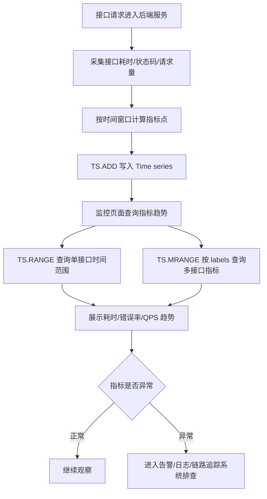

# 第 15 章：Time series：适合带时间戳的数据点存储和查询

## 1. 本章一句话

Redis Time series 适合保存“时间戳 + 数值”的连续指标点，并按时间范围查询趋势、聚合数据和控制保留周期。参考：[Redis 官方 Time series 文档](https://redis.io/docs/latest/develop/data-types/timeseries/)

本章核心判断：Time series 适合做接口耗时、错误率、QPS、业务趋势这类在线指标趋势查询，但不适合替代完整监控系统、日志系统或数据仓库。**标记：主观推断**

---

## 2. 适合解决什么问题？

| 场景       | 为什么适合                                                                                                                                                                                 |
| -------- | ------------------------------------------------------------------------------------------------------------------------------------------------------------------------------------- |
| 接口耗时趋势   | 每分钟写入接口 P95 / P99 耗时指标点，按时间范围查询变化趋势。参考：[Redis 官方 TS.ADD 文档](https://redis.io/docs/latest/commands/ts.add/)；参考：[Redis 官方 TS.RANGE 文档](https://redis.io/docs/latest/commands/ts.range/) |
| 接口错误率趋势  | 每分钟写入错误率数值，按时间窗口查看是否持续升高。参考：[Redis 官方 Time series 文档](https://redis.io/docs/latest/develop/data-types/timeseries/)                                                                    |
| QPS 趋势   | 每分钟写入请求量或 QPS 指标，用于活动高峰期快速观察流量变化。**标记：主观推断**                                                                                                                                          |
| 多接口指标查询  | 可以通过 labels 组织不同服务、接口、指标类型，并用 `TS.MRANGE` 按过滤条件查询多个 time series。参考：[Redis 官方 TS.MRANGE 文档](https://redis.io/docs/latest/commands/ts.mrange/)                                          |
| 指标保留周期控制 | Time series 创建时可以设置 retention，避免数据无限增长。参考：[Redis 官方 Time series 文档](https://redis.io/docs/latest/develop/data-types/timeseries/)                                                      |

---

## 3. 主案例

```text
主案例：接口耗时与错误率监控

业务背景：
后端服务需要观察核心接口在最近 5 分钟、30 分钟、24 小时内的 P95 耗时、错误率和 QPS 变化，用于快速发现性能抖动、接口异常和活动高峰压力。

核心原因：
接口耗时、错误率、QPS 都是典型的“随时间变化的数值点”，Time series 可以按时间写入、按范围查询、按标签筛选，并支持保留周期和聚合查询；但告警编排、日志追踪、长期分析、根因定位仍应交给专业监控系统、日志系统或数据仓库。**标记：主观推断**
```

辅助案例：

* 学习行为趋势统计：适合记录每日学习人数、完成章节数、练习提交数，重点关注统计口径。**标记：主观推断**
* 用户学习时长变化：适合记录用户每天学习时长趋势，重点关注长期分析是否需要进数仓。**标记：主观推断**
* 活动参与趋势数据：适合记录活动报名数、参与数、完成数随时间变化，重点关注活动结束后的数据归档。**标记：主观推断**
* 系统资源指标监控：适合记录 Redis QPS、接口延迟、错误率等短周期趋势，重点关注不要替代完整监控平台。**标记：主观推断**

---

## 4. 核心流程



说明：

* `TS.ADD` 用于向 time series 追加一个样本点，适合写入某个时间点的接口耗时、错误率或 QPS。参考：[Redis 官方 TS.ADD 文档](https://redis.io/docs/latest/commands/ts.add/)
* `TS.RANGE` 用于按时间范围查询单个 time series，适合查看某个接口在一段时间内的指标变化。参考：[Redis 官方 TS.RANGE 文档](https://redis.io/docs/latest/commands/ts.range/)
* `TS.MRANGE` 用于按过滤条件查询多个 time series，适合按 service、route、metric 等 labels 查看多个接口指标。参考：[Redis 官方 TS.MRANGE 文档](https://redis.io/docs/latest/commands/ts.mrange/)
* P95 / P99 通常建议由应用侧或监控采集侧按时间窗口预聚合后写入 Time series，而不是把所有请求明细都塞进 Redis。**标记：主观推断**
* Time series 适合在线趋势查询，异常根因定位仍需要日志、链路追踪和完整监控系统配合。**标记：主观推断**

---

## 5. 关键命令

| 命令                                                                                                                  | 作用                                                                                                                        |
| ------------------------------------------------------------------------------------------------------------------- | ------------------------------------------------------------------------------------------------------------------------- |
| `TS.CREATE api:latency:p95:course_detail RETENTION 604800000 LABELS service course route detail metric latency_p95` | 创建接口 P95 耗时时间序列，并设置保留周期和 labels。参考：[Redis 官方 Time series 文档](https://redis.io/docs/latest/develop/data-types/timeseries/) |
| `TS.ADD api:latency:p95:course_detail * 128.6`                                                                      | 写入当前时间点的接口 P95 耗时。参考：[Redis 官方 TS.ADD 文档](https://redis.io/docs/latest/commands/ts.add/)                                  |
| `TS.ADD api:error_rate:course_detail * 0.012`                                                                       | 写入当前时间点的接口错误率。参考：[Redis 官方 TS.ADD 文档](https://redis.io/docs/latest/commands/ts.add/)                                      |
| `TS.RANGE api:latency:p95:course_detail - +`                                                                        | 查询某个接口的完整耗时趋势，实际业务中通常传具体起止时间。参考：[Redis 官方 TS.RANGE 文档](https://redis.io/docs/latest/commands/ts.range/)                   |
| `TS.MRANGE - + FILTER service=course metric=latency_p95`                                                            | 按 labels 查询多个接口的 P95 耗时趋势。参考：[Redis 官方 TS.MRANGE 文档](https://redis.io/docs/latest/commands/ts.mrange/)                    |

---

## 6. 边界和坑

| 问题                    | 说明                                                                                                                     |
| --------------------- | ---------------------------------------------------------------------------------------------------------------------- |
| 把 Time series 当完整监控系统 | Time series 能保存和查询指标点，但告警规则、通知编排、链路追踪、日志检索、仪表盘治理不是它单独能解决的。**标记：主观推断**                                                  |
| 指标基数过高                | 如果按 userId、traceId、requestId 创建 time series，会导致 key 数量和内存快速膨胀。**标记：主观推断**                                              |
| 写入频率过高                | 每个请求都写一个指标点，会把 Redis 变成请求明细存储，成本和压力都不合适。**标记：主观推断**                                                                    |
| 保留周期不清楚               | 指标不设置保留周期或清理策略，可能持续增长并带来内存压力。参考：[Redis 官方 Time series 文档](https://redis.io/docs/latest/develop/data-types/timeseries/) |
| 指标和日志混用               | Time series 适合数值趋势，不适合保存完整日志、请求上下文、异常堆栈和 trace 明细。**标记：主观推断**                                                          |

---

## 7. 本章记忆点

1. Time series 的核心价值是“时间戳 + 数值点 + 范围查询 + 趋势分析”。
2. 接口耗时、错误率、QPS 适合用 Time series 做在线趋势查询，但不适合把每次请求明细都写进 Redis。**标记：主观推断**
3. Time series 不是完整监控系统；告警、日志、链路追踪、长期分析仍要交给专业系统。**标记：主观推断**
