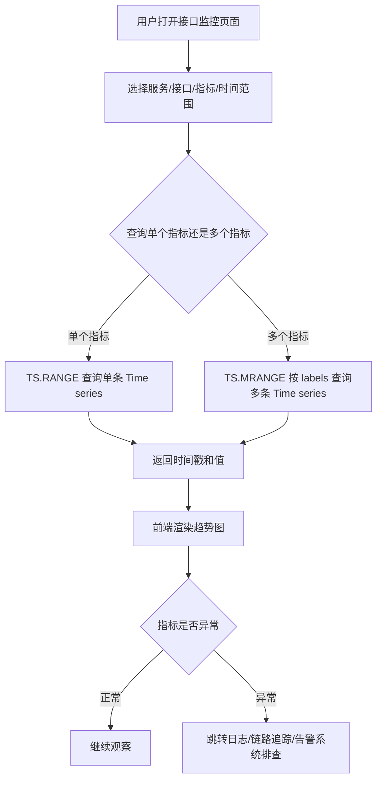
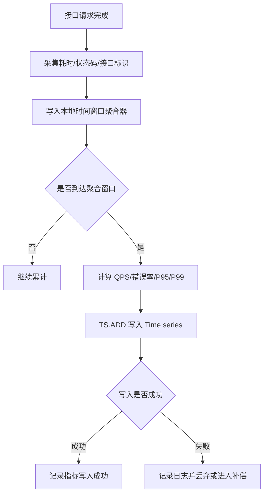
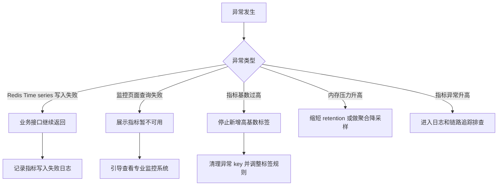
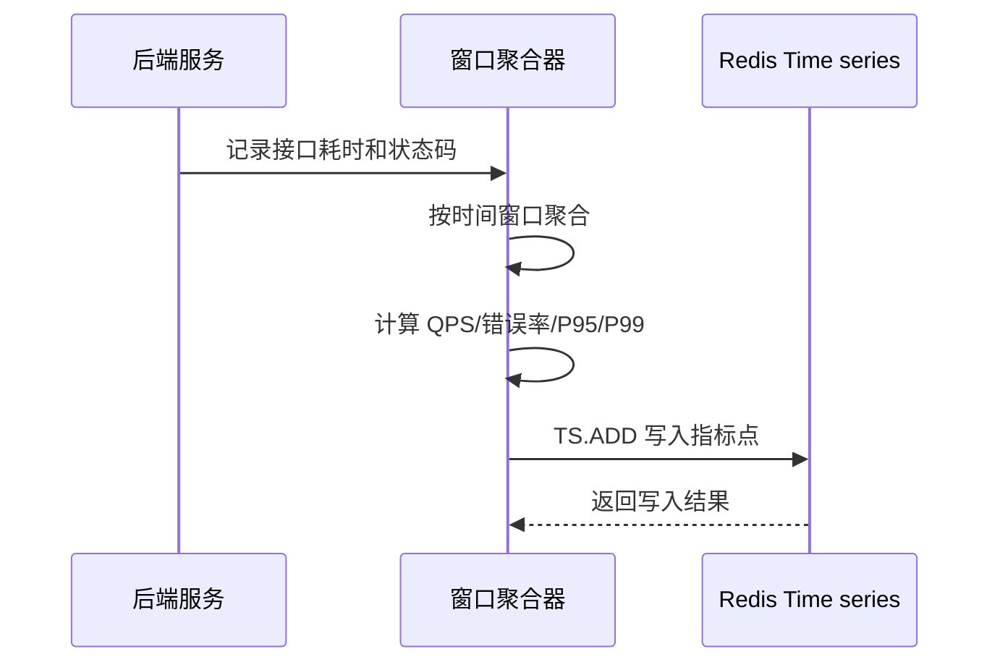
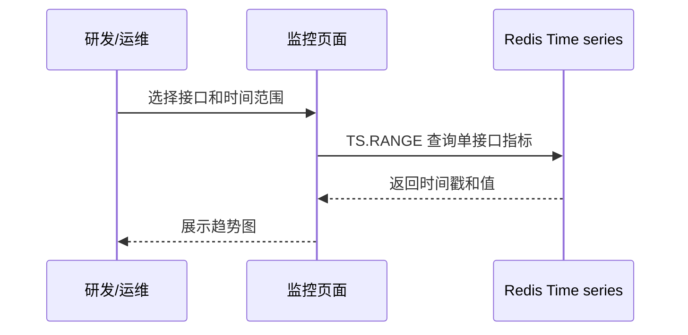
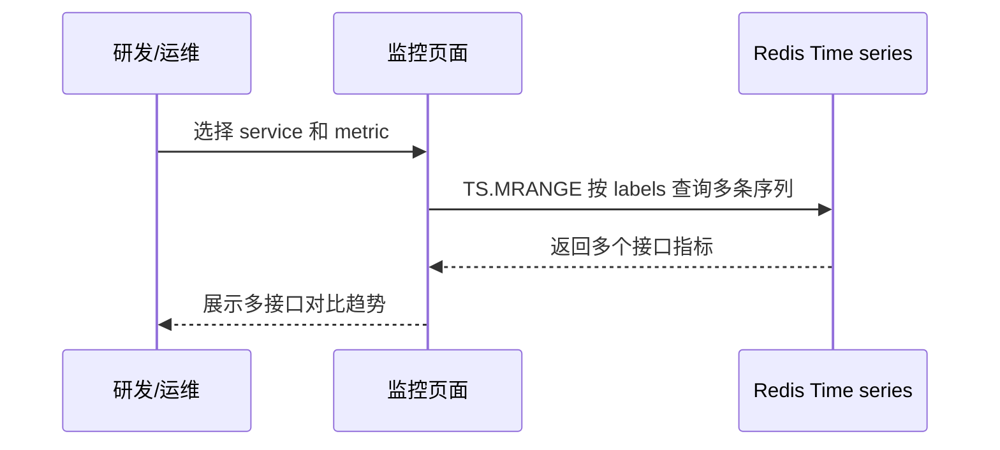
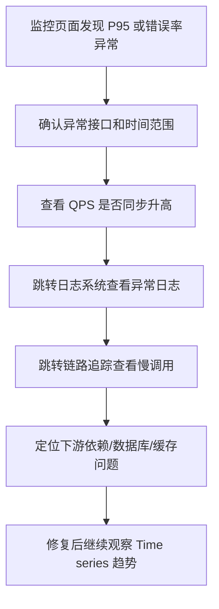

# Redis 知识点：Time series

## 1. 一句话结论

> Redis Time series 适合保存“时间戳 + 数值”的指标点，并支持按时间范围查询、聚合和标签过滤。参考：[Redis 官方 Time series 文档](https://redis.io/docs/latest/develop/data-types/timeseries/)
> 在接口耗时与错误率监控场景中，Time series 适合做在线趋势查询和短周期指标分析，但不适合替代完整监控系统、日志系统、链路追踪系统或数据仓库。**标记：主观推断**

---

## 2. 这个知识点是什么？

Time series 是 Redis 中用于保存时间序列数据的能力。

可以简单理解为：

```text
Redis Time series = 时间戳 + 数值点 + 标签 + 范围查询 + 聚合能力

timestamp = 指标发生的时间
value = 指标值，例如 P95 耗时、错误率、QPS
labels = 指标标签，例如 service、route、metric、env
range query = 按时间范围查询趋势
aggregation = 按时间窗口聚合或降采样
```

Redis 官方文档说明，Time series 支持存储时间序列数据，并提供范围查询、聚合、标签过滤等能力。参考：[Redis 官方 Time series 文档](https://redis.io/docs/latest/develop/data-types/timeseries/)

从后端工程视角看，Time series 不是普通缓存，也不是日志存储，而是适合保存“随时间变化的数值指标”。**标记：主观推断**

---

## 3. 它解决什么业务问题？

业务场景：接口耗时与错误率监控。

例如一个课程详情接口：

```text
GET /api/courses/{courseId}/detail
```

后端希望能快速看到：

```text
最近 5 分钟 P95 耗时有没有升高？
最近 30 分钟错误率有没有异常？
活动高峰期间 QPS 是否突然上涨？
某个接口是否比其他接口慢？
某个服务整体是否正在抖动？
```

如果没有 Time series 或类似指标系统，常见问题是：

* 只看单次请求日志，很难快速看到趋势。**标记：主观推断**
* 只用 MySQL 存每次请求明细，查询 P95、P99、错误率趋势成本高。**标记：主观推断**
* 只存当前值，看不到历史变化和异常开始时间。**标记：主观推断**
* 指标没有标签，无法按 service、route、metric 快速筛选。**标记：主观推断**

| 业务问题     | 具体表现                                 | Redis 如何解决                                                                                                                                                                                |
| -------- | ------------------------------------ | ----------------------------------------------------------------------------------------------------------------------------------------------------------------------------------------- |
| 接口耗时趋势查询 | 需要查看最近 5 分钟、30 分钟、24 小时 P95 / P99 变化 | 用 `TS.ADD` 写入指标点，用 `TS.RANGE` 按时间范围查询趋势。参考：[Redis 官方 TS.ADD 文档](https://redis.io/docs/latest/commands/ts.add/)；参考：[Redis 官方 TS.RANGE 文档](https://redis.io/docs/latest/commands/ts.range/) |
| 错误率趋势查询  | 需要判断错误率是否持续升高，而不是只看某一次异常             | 按固定时间窗口写入错误率指标点，再按时间范围读取。参考：[Redis 官方 Time series 文档](https://redis.io/docs/latest/develop/data-types/timeseries/)                                                                        |
| 多接口指标查询  | 需要按 service、route、metric 查看多个接口指标    | 使用 labels 标记指标，并用 `TS.MRANGE` 按标签过滤查询多个序列。参考：[Redis 官方 TS.MRANGE 文档](https://redis.io/docs/latest/commands/ts.mrange/)                                                                    |
| 指标数据保留   | 明细指标只需要保留一段时间，不应无限增长                 | 创建 time series 时设置 retention，控制数据保留周期。参考：[Redis 官方 TS.CREATE 文档](https://redis.io/docs/latest/commands/ts.create/)                                                                        |
| 指标降采样    | 秒级或分钟级指标后续需要汇总为更粗粒度趋势                | 可用 compaction rule 做聚合规则。参考：[Redis 官方 TS.CREATERULE 文档](https://redis.io/docs/latest/commands/ts.createrule/)                                                                             |

---

## 4. Redis 为什么适合？

| Redis 能力               | 对应业务价值                          | 证据 / 标记                                                                                                                                                                                                                         |
| ---------------------- | ------------------------------- | ------------------------------------------------------------------------------------------------------------------------------------------------------------------------------------------------------------------------------- |
| 时间戳 + 数值点              | 接口耗时、错误率、QPS 都可以表达为某个时间点的数值     | Time series 用于存储时间序列数据。参考：[Redis 官方 Time series 文档](https://redis.io/docs/latest/develop/data-types/timeseries/)                                                                                                                |
| `TS.ADD` 写入样本          | 每分钟写入一次 P95、错误率、QPS 指标点         | `TS.ADD` 用于向 time series 添加样本。参考：[Redis 官方 TS.ADD 文档](https://redis.io/docs/latest/commands/ts.add/)                                                                                                                            |
| `TS.RANGE` 范围查询        | 查询某个接口在一段时间内的指标变化               | `TS.RANGE` 用于按时间范围查询样本。参考：[Redis 官方 TS.RANGE 文档](https://redis.io/docs/latest/commands/ts.range/)                                                                                                                               |
| labels + `TS.MRANGE`   | 按 service、route、metric 查询多个接口指标 | `TS.MRANGE` 支持过滤多个 time series。参考：[Redis 官方 TS.MRANGE 文档](https://redis.io/docs/latest/commands/ts.mrange/)                                                                                                                     |
| retention / compaction | 控制指标保留周期，并把高频指标聚合成低频趋势          | `TS.CREATE` 支持 retention；`TS.CREATERULE` 支持创建 compaction rule。参考：[Redis 官方 TS.CREATE 文档](https://redis.io/docs/latest/commands/ts.create/)；参考：[Redis 官方 TS.CREATERULE 文档](https://redis.io/docs/latest/commands/ts.createrule/) |

核心判断：

> 接口耗时、错误率、QPS 的共同特点是“随时间变化的数值”，Time series 的时间戳、范围查询、标签过滤和聚合能力刚好匹配这个模型。**标记：主观推断**

---

## 5. 它的边界是什么？

| 边界         | 说明                                                     | 更合适的选择                                                 |
| ---------- | ------------------------------------------------------ | ------------------------------------------------------ |
| 不能替代完整监控系统 | Time series 能存指标点和查趋势，但告警编排、通知、仪表盘治理、服务发现、采集体系不是它单独解决的 | Prometheus / Grafana / 云监控。**标记：主观推断**                 |
| 不能替代日志系统   | 接口异常堆栈、请求参数、traceId、上下文日志不适合放 Time series              | ELK / Loki / 日志平台。**标记：主观推断**                          |
| 不能替代链路追踪   | Time series 能看到“指标异常”，但无法还原一次请求经过了哪些服务                 | OpenTelemetry / Jaeger / Tempo。**标记：主观推断**             |
| 不能保存每次请求明细 | 如果每个 requestId 都写一条 time series 或一个指标点，会变成高成本明细存储      | 日志系统 / 采样明细 / 数据仓库。**标记：主观推断**                         |
| 不能忽略指标基数   | 按 userId、requestId、traceId 建标签或 key，会导致 key 数和内存快速膨胀   | 限制标签维度，只保留 service、route、metric、env 等低基数字段。**标记：主观推断** |

关键边界：

> Time series 适合“在线指标趋势”，不适合保存“完整请求明细、异常上下文、长期分析事实”。**标记：主观推断**

---

## 6. 常见坑是什么？

| 常见坑            | 线上风险                                              | 规避方式                                                                                                      |
| -------------- | ------------------------------------------------- | --------------------------------------------------------------------------------------------------------- |
| 指标基数过高         | 每个 userId、traceId、requestId 都变成独立序列，导致 key 数和内存膨胀 | 标签只保留低基数字段，例如 service、route、metric、env。**标记：主观推断**                                                        |
| 写入频率过高         | 每次请求都写 Redis，接口高峰时 Redis 写压力过大                    | 应用侧或采集侧按时间窗口聚合后写入，例如每 10 秒或每 1 分钟写一次。**标记：主观推断**                                                          |
| 把日志当指标写        | 把异常堆栈、请求体、上下文塞进 Time series，查询和存储都不合适             | 指标进 Time series，日志进日志系统。**标记：主观推断**                                                                       |
| 不设置保留周期        | 指标持续增长，最终造成内存压力                                   | 创建 time series 时设置 retention。参考：[Redis 官方 TS.CREATE 文档](https://redis.io/docs/latest/commands/ts.create/) |
| 只看平均值          | 平均耗时正常，但 P95 / P99 已经抖动，容易漏掉慢请求问题                 | 同时采集 avg、P95、P99、错误率、QPS。**标记：主观推断**                                                                      |
| Redis 指标系统单点依赖 | Redis 异常后监控趋势不可用，影响排查                             | 关键监控仍应接入专业监控系统，Redis Time series 做业务内在线辅助。**标记：主观推断**                                                     |

---

## 7. MySQL / 本地缓存 / 其他方案是否更合适？

| 方案                     | 是否适合            | 原因                                                                                                              |
| ---------------------- | --------------- | --------------------------------------------------------------------------------------------------------------- |
| MySQL                  | 不适合作为高频指标趋势主查询  | MySQL 适合保存业务事实和配置，不适合高频写入大量指标点后频繁做时间范围聚合查询。**标记：主观推断**                                                          |
| Redis Time series      | 适合做在线指标趋势       | 适合时间戳数值点、范围查询、标签过滤和聚合。参考：[Redis 官方 Time series 文档](https://redis.io/docs/latest/develop/data-types/timeseries/) |
| 本地缓存                   | 不适合作为全局指标源      | 本地缓存只能看到单实例数据，不适合跨实例汇总和统一查询。**标记：主观推断**                                                                         |
| Redis Strings / Hashes | 可做简单当前值，不适合趋势查询 | Strings / Hashes 可以存当前耗时或计数，但不适合原生表达时间范围趋势。**标记：主观推断**                                                          |
| Prometheus / Grafana   | 更适合完整监控体系       | 适合指标采集、告警、仪表盘、长期监控治理。**标记：主观推断**                                                                                |
| 日志系统 / 链路追踪            | 适合根因定位          | 当 Time series 显示异常后，需要日志和 trace 定位具体原因。**标记：主观推断**                                                              |
| 数据仓库 / OLAP            | 适合长期分析          | 适合长期趋势、报表、离线分析、跨维度统计。**标记：主观推断**                                                                                |

最终判断：

> 如果目标是“业务内快速看最近一段时间的指标趋势”，Redis Time series 合适；如果目标是“完整监控治理、日志检索、链路追踪、长期分析”，应该使用专业系统。**标记：主观推断**

---

## 8. 具体业务场景例子

### 8.1 场景背景

业务：课程服务需要监控核心接口的耗时、错误率和 QPS。

核心接口示例：

```text
GET /api/courses/{courseId}/detail
POST /api/courses/{courseId}/lessons/{lessonId}/complete
GET /api/users/{userId}/learning-progress
```

需要观察的指标：

```text
latency_avg
latency_p95
latency_p99
error_rate
qps
```

数据来源：

* 应用服务采集请求耗时、状态码、请求数量。**标记：主观推断**
* 应用侧或采集侧按 10 秒 / 1 分钟窗口聚合。**标记：主观推断**
* 聚合后的指标点写入 Redis Time series。**标记：主观推断**
* 监控页面按时间范围查询趋势。**标记：主观推断**

---

### 8.2 业务问题

如果不用 Time series，可能会遇到这些问题：

| 业务问题         | 具体表现                                              |
| ------------ | ------------------------------------------------- |
| 只看日志，难看趋势    | 日志能看到单次请求，但很难快速判断最近 30 分钟 P95 是否持续升高。**标记：主观推断**  |
| 只看当前值，缺少历史变化 | 当前 P95 是 300ms，但不知道是刚刚升高，还是一直都这样。**标记：主观推断**      |
| MySQL 查询成本高  | 如果把每次请求明细写 MySQL，再实时聚合 P95 / 错误率，成本较高。**标记：主观推断** |
| 指标维度混乱       | 没有统一 service、route、metric 标签，难以按接口筛选。**标记：主观推断**  |
| 保留周期不清楚      | 指标长期保留会造成存储膨胀，不保留又无法回看趋势。**标记：主观推断**              |

用了 Redis Time series 后：

* 用 `TS.ADD` 写入每个时间窗口的指标点。参考：[Redis 官方 TS.ADD 文档](https://redis.io/docs/latest/commands/ts.add/)
* 用 `TS.RANGE` 查询单个接口一段时间内的趋势。参考：[Redis 官方 TS.RANGE 文档](https://redis.io/docs/latest/commands/ts.range/)
* 用 `TS.MRANGE` 按标签查询多个接口或多个指标。参考：[Redis 官方 TS.MRANGE 文档](https://redis.io/docs/latest/commands/ts.mrange/)
* 用 retention 控制指标保留周期。参考：[Redis 官方 TS.CREATE 文档](https://redis.io/docs/latest/commands/ts.create/)
* 用 compaction rule 做降采样或聚合。参考：[Redis 官方 TS.CREATERULE 文档](https://redis.io/docs/latest/commands/ts.createrule/)

---

### 8.3 Redis 设计

```text
Redis key:
ts:api:course:detail:latency:p95
ts:api:course:detail:latency:p99
ts:api:course:detail:error_rate
ts:api:course:detail:qps

Redis value:
Time series sample
timestamp = 指标窗口时间
value = 指标值

Labels:
service = course
route = course_detail
metric = latency_p95 / latency_p99 / error_rate / qps
env = prod

示例:
TS.CREATE ts:api:course:detail:latency:p95 RETENTION 604800000 LABELS service course route course_detail metric latency_p95 env prod
TS.ADD ts:api:course:detail:latency:p95 * 128.6
TS.RANGE ts:api:course:detail:latency:p95 - +
TS.MRANGE - + FILTER service=course route=course_detail

TTL / retention:
短周期明细指标保留 7 天。
聚合后的小时级趋势可保留更久。
具体周期根据排查需要、内存成本和长期分析需求决定。
**标记：主观推断**

MySQL:
MySQL 不保存每个指标点。
MySQL 可以保存监控配置、接口配置、阈值配置、告警规则配置。
长期指标分析进入监控系统、日志系统或数据仓库。
**标记：主观推断**

降级:
Redis Time series 写入失败时，不影响主业务接口返回。
监控页面查询失败时，展示“指标暂不可用”，并引导查看专业监控系统。
**标记：主观推断**
```

---

### 8.4 读流程



说明：

* `TS.RANGE` 用于按时间范围查询单个 time series 的样本点，适合查看某个接口 P95 耗时趋势。参考：[Redis 官方 TS.RANGE 文档](https://redis.io/docs/latest/commands/ts.range/)
* `TS.MRANGE` 用于按过滤条件查询多个 time series，适合按 service、route、metric 查询多接口指标。参考：[Redis 官方 TS.MRANGE 文档](https://redis.io/docs/latest/commands/ts.mrange/)
* 监控页面读取的是指标趋势，不是请求明细。**标记：主观推断**
* 指标异常只能说明“哪里可能有问题”，具体根因还需要日志和链路追踪排查。**标记：主观推断**

---

### 8.5 写流程



说明：

* `TS.ADD` 用于向 time series 添加样本点，适合写入某个时间窗口的接口指标。参考：[Redis 官方 TS.ADD 文档](https://redis.io/docs/latest/commands/ts.add/)
* P95 / P99 通常应在应用侧或采集侧按窗口预聚合后写入，而不是每次请求都写一个明细点。**标记：主观推断**
* 指标写入失败通常不应影响业务接口主流程。**标记：主观推断**
* 如果指标是关键监控数据，应由专业监控系统兜底，而不是只依赖 Redis。**标记：主观推断**

---

### 8.6 异常处理



说明：

* `TS.CREATE` 支持创建 time series 并设置 retention，可用于控制指标保留周期。参考：[Redis 官方 TS.CREATE 文档](https://redis.io/docs/latest/commands/ts.create/)
* `TS.CREATERULE` 可创建 compaction rule，用于把源 time series 聚合到目标 time series。参考：[Redis 官方 TS.CREATERULE 文档](https://redis.io/docs/latest/commands/ts.createrule/)
* Redis Time series 写入失败不应影响业务主链路，因为指标数据通常是辅助观测数据。**标记：主观推断**
* 指标基数过高时，应优先治理标签设计，而不是单纯扩容 Redis。**标记：主观推断**
* 内存压力升高时，可以缩短 retention、降低写入频率、做聚合降采样或迁移到专业监控系统。**标记：主观推断**

---

### 8.7 监控指标

| 指标                              | 作用                                                    |
| ------------------------------- | ----------------------------------------------------- |
| `TS.ADD` 写入 QPS                 | 判断指标写入压力。**标记：主观推断**                                  |
| `TS.RANGE` / `TS.MRANGE` 查询 QPS | 判断监控页面或查询接口压力。**标记：主观推断**                             |
| Time series key 数量              | 判断指标基数是否失控。**标记：主观推断**                                |
| 每个 key 的样本数量                    | 判断 retention 和写入频率是否合理。**标记：主观推断**                    |
| Redis used_memory               | 判断 Time series 数据是否造成内存压力。**标记：主观推断**                 |
| Redis P95 / P99 延迟              | 判断指标读写是否影响 Redis 整体性能。**标记：主观推断**                     |
| 指标写入失败次数                        | 判断采集链路是否稳定。**标记：主观推断**                                |
| 监控页面查询失败次数                      | 判断趋势查询是否可用。**标记：主观推断**                                |
| 高基数标签数量                         | 判断是否有 userId、traceId、requestId 等不应进入标签的字段。**标记：主观推断** |
| 专业监控系统对账差异                      | 判断 Redis Time series 指标是否和主监控口径偏离。**标记：主观推断**         |

---

## 9. Mermaid 图

说明：以下 Mermaid 图统一使用标准 ` ```mermaid `，不带 id，支持 Cursor 和浏览器显示。**标记：主观推断**

### 9.1 指标写入流程



说明：

* `TS.ADD` 用于写入指标点。参考：[Redis 官方 TS.ADD 文档](https://redis.io/docs/latest/commands/ts.add/)
* 指标先聚合再写入，可以减少 Redis 写入压力。**标记：主观推断**

---

### 9.2 单接口趋势查询流程



说明：

* `TS.RANGE` 用于按时间范围查询单个 time series。参考：[Redis 官方 TS.RANGE 文档](https://redis.io/docs/latest/commands/ts.range/)
* 趋势图适合发现异常时间段，但不负责根因定位。**标记：主观推断**

---

### 9.3 多接口标签查询流程



说明：

* `TS.MRANGE` 支持按过滤条件查询多个 time series。参考：[Redis 官方 TS.MRANGE 文档](https://redis.io/docs/latest/commands/ts.mrange/)
* labels 适合放低基数字段，不适合放 requestId、traceId、userId。**标记：主观推断**

---

### 9.4 指标异常排查流程



说明：

* Time series 负责展示指标趋势，日志和链路追踪负责定位具体原因。**标记：主观推断**
* P95 / P99、错误率、QPS 需要组合观察，不能只看单个指标。**标记：主观推断**

---

## 10. 工程评审关注点

| 关注点                         | 说明                                                                                                                                                                                                                   |
| --------------------------- | -------------------------------------------------------------------------------------------------------------------------------------------------------------------------------------------------------------------- |
| 为什么用 Time series？           | 因为接口耗时、错误率、QPS 都是随时间变化的数值指标，Time series 支持时间范围查询、标签过滤和聚合。参考：[Redis 官方 Time series 文档](https://redis.io/docs/latest/develop/data-types/timeseries/)                                                                   |
| 为什么不用 MySQL？                | MySQL 适合业务事实和配置，不适合高频指标点写入后实时做趋势查询。**标记：主观推断**                                                                                                                                                                       |
| 指标基数怎么控制？                   | labels 只放 service、route、metric、env 等低基数字段，不放 userId、requestId、traceId。**标记：主观推断**                                                                                                                                    |
| 写入频率怎么控制？                   | 不按每次请求写入，先按窗口聚合，再写入 Time series。**标记：主观推断**                                                                                                                                                                          |
| 数据保留多久？                     | 通过 retention 控制短周期明细保留，通过 compaction rule 生成低频聚合趋势。参考：[Redis 官方 TS.CREATE 文档](https://redis.io/docs/latest/commands/ts.create/)；参考：[Redis 官方 TS.CREATERULE 文档](https://redis.io/docs/latest/commands/ts.createrule/) |
| Redis 挂了怎么办？                | 业务主流程不依赖指标写入，指标查询失败时降级到专业监控系统。**标记：主观推断**                                                                                                                                                                            |
| 是否能替代 Prometheus / Grafana？ | 不能；Time series 适合指标点存储和查询，不等于完整监控采集、告警、仪表盘治理体系。**标记：主观推断**                                                                                                                                                           |
| 是否能替代日志和 trace？             | 不能；Time series 只能告诉你趋势异常，日志和 trace 才能帮助定位具体请求和链路。**标记：主观推断**                                                                                                                                                         |

---

## 11. 最终记忆点

1. Time series 的核心价值是“时间戳 + 数值点 + 范围查询 + 趋势分析”。
2. 接口耗时、错误率、QPS 适合用 Time series 做在线趋势查询。**标记：主观推断**
3. Time series 不适合保存请求明细、日志上下文、trace 明细和长期分析事实。**标记：主观推断**
4. Time series 设计最容易踩坑的是指标基数、写入频率、保留周期和误当完整监控系统。**标记：主观推断**
5. 资深后端使用 Time series 时，必须先回答：指标从哪里来、多久写一次、保留多久、按什么标签查、异常后去哪里定位。**标记：主观推断**

---

## 12. 参考资料

1. [Redis 官方 Time series 文档](https://redis.io/docs/latest/develop/data-types/timeseries/)：用于确认 Redis Time series 的时间序列数据存储、范围查询、标签过滤和聚合能力。
2. [Redis 官方 TS.ADD 文档](https://redis.io/docs/latest/commands/ts.add/)：用于确认 `TS.ADD` 可以向 time series 添加样本点。
3. [Redis 官方 TS.RANGE 文档](https://redis.io/docs/latest/commands/ts.range/)：用于确认 `TS.RANGE` 可以按时间范围查询样本。
4. [Redis 官方 TS.MRANGE 文档](https://redis.io/docs/latest/commands/ts.mrange/)：用于确认 `TS.MRANGE` 可以按过滤条件查询多个 time series。
5. [Redis 官方 TS.CREATE 文档](https://redis.io/docs/latest/commands/ts.create/)：用于确认创建 time series 和 retention 等参数能力。
6. [Redis 官方 TS.CREATERULE 文档](https://redis.io/docs/latest/commands/ts.createrule/)：用于确认 compaction rule 聚合规则能力。
