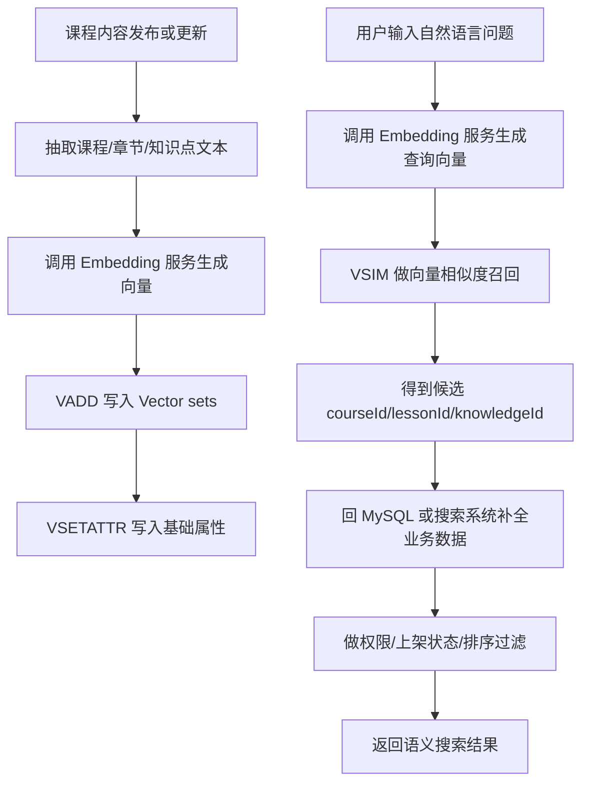

# 第 16 章：Vector sets：适合向量相似度搜索

## 1. 本章一句话

Redis Vector sets 适合保存“元素 + 向量”，并按向量相似度找出相近元素。参考：[Redis 官方 Vector sets 文档](https://redis.io/docs/latest/develop/data-types/vector-sets/)

本章核心判断：Vector sets 适合做课程内容语义搜索、相似内容召回、AI 知识库候选召回，但不适合替代 MySQL 的业务事实、权限过滤、内容元数据和完整搜索系统。**标记：主观推断**

---

## 2. 适合解决什么问题？

| 场景         | 为什么适合                                                                                                                                                  |
| ---------- | ------------------------------------------------------------------------------------------------------------------------------------------------------ |
| 课程内容语义搜索   | 课程、章节、知识点可以转成 embedding 写入 Vector sets，用户问题也转成向量后用相似度召回相近内容。参考：[Redis 官方 Vector sets 文档](https://redis.io/docs/latest/develop/data-types/vector-sets/) |
| 相似题目推荐     | 题目文本向量化后，可以按相似度召回相近题目，作为推荐候选集。**标记：主观推断**                                                                                                              |
| 相似课程推荐     | 课程标题、简介、标签向量化后，可以召回语义相似课程。**标记：主观推断**                                                                                                                  |
| AI 知识库问答召回 | 用户问题向量化后，可以先召回相关知识片段，再交给大模型生成答案。**标记：主观推断**                                                                                                            |
| 属性过滤后的相似召回 | Vector sets 支持给元素关联属性，并在 `VSIM` 中结合 `FILTER` 做过滤。参考：[Redis 官方 Vector sets 文档](https://redis.io/docs/latest/develop/data-types/vector-sets/)            |

---

## 3. 主案例

```text
主案例：课程内容语义搜索

业务背景：
用户在学习平台中输入自然语言问题，例如“Redis 排行榜应该用什么结构？”，系统需要返回语义上最相关的课程、章节或知识点。

核心原因：
用户问题和课程内容都可以转成 embedding，Vector sets 适合按向量相似度做候选召回；但课程是否上架、用户是否有权限、课程标题正文、价格、作者、章节状态等业务事实仍应由 MySQL 或搜索系统补全和过滤。**标记：主观推断**
```

辅助案例：

* 相似题目推荐：适合用题目 embedding 召回相似题，重点关注召回后去重和难度过滤。**标记：主观推断**
* 相似课程推荐：适合用课程 embedding 召回相似课程，重点关注推荐排序和用户画像不要只靠向量相似度。**标记：主观推断**
* AI 知识库问答召回：适合做 RAG 候选片段召回，重点关注召回质量、权限和原文补全。**标记：主观推断**
* 用户兴趣向量匹配：适合做候选召回，重点关注用户画像更新和冷启动问题。**标记：主观推断**

---

## 4. 核心流程



说明：

* `VADD` 可以向 Vector set 添加元素，或在元素已存在时更新它的向量。参考：[Redis 官方 VADD 文档](https://redis.io/docs/latest/commands/vadd/)
* `VSIM` 可以按向量相似度返回相似元素。参考：[Redis 官方 VSIM 文档](https://redis.io/docs/latest/commands/vsim/)
* `VSETATTR` 可以给 Vector set 中的元素关联 JSON 属性。参考：[Redis 官方 VSETATTR 文档](https://redis.io/docs/latest/commands/vsetattr/)
* Vector sets 负责语义相似度召回，MySQL 或搜索系统负责业务事实补全、权限过滤和最终排序。**标记：主观推断**
* 课程内容更新后，需要同步更新向量，否则会出现语义召回结果过期。**标记：主观推断**

---

## 5. 关键命令

| 命令                                                                                                    | 作用                                                                                                       |
| ----------------------------------------------------------------------------------------------------- | -------------------------------------------------------------------------------------------------------- |
| `VADD course:content:vectors VALUES 3 0.12 0.45 0.78 lesson:1001`                                     | 写入或更新课程内容向量。参考：[Redis 官方 VADD 文档](https://redis.io/docs/latest/commands/vadd/)                           |
| `VSETATTR course:content:vectors lesson:1001 '{"courseId":101,"status":"published","type":"lesson"}'` | 给向量元素关联基础属性。参考：[Redis 官方 VSETATTR 文档](https://redis.io/docs/latest/commands/vsetattr/)                   |
| `VSIM course:content:vectors VALUES 3 0.11 0.46 0.80 COUNT 10 WITHSCORES`                             | 按查询向量召回最相似的课程内容。参考：[Redis 官方 VSIM 文档](https://redis.io/docs/latest/commands/vsim/)                       |
| `VSIM course:content:vectors VALUES 3 0.11 0.46 0.80 FILTER '.status == "published"' COUNT 10`        | 在相似度召回时结合属性过滤。参考：[Redis 官方 Vector sets 文档](https://redis.io/docs/latest/develop/data-types/vector-sets/) |
| `VREM course:content:vectors lesson:1001`                                                             | 课程下架或删除后移除对应向量。参考：[Redis 官方 VREM 文档](https://redis.io/docs/latest/commands/vrem/)                        |

---

## 6. 边界和坑

| 问题                    | 说明                                                                     |
| --------------------- | ---------------------------------------------------------------------- |
| 把 Vector sets 当完整搜索系统 | Vector sets 适合向量相似度召回，但关键词检索、复杂过滤、排序策略、搜索纠错、召回融合通常需要搜索系统配合。**标记：主观推断** |
| 只做向量召回不做权限过滤          | 可能把未上架、无权限、已删除课程召回给用户，业务风险较高。**标记：主观推断**                               |
| 内容更新后向量不同步            | 课程标题、章节内容变化后，如果 embedding 不更新，会导致召回结果和真实内容不一致。**标记：主观推断**              |
| 向量维度和模型不统一            | 不同 embedding 模型或不同维度混用，会导致相似度结果失真或无法写入同一个向量集合。**标记：主观推断**              |
| 召回结果直接当最终结果           | 向量相似只是候选召回，最终还要结合关键词、业务权重、权限、质量分和用户画像排序。**标记：主观推断**                    |

---

## 7. 本章记忆点

1. Vector sets 的核心价值是“元素 + 向量 + 相似度召回”。
2. 课程内容语义搜索适合用 Vector sets 做候选召回，但业务事实、权限和最终排序不能只靠 Redis。**标记：主观推断**
3. Vector sets 不是完整搜索系统；AI 搜索通常需要 embedding、Redis 召回、MySQL / 搜索系统补全、重排共同完成。**标记：主观推断**
