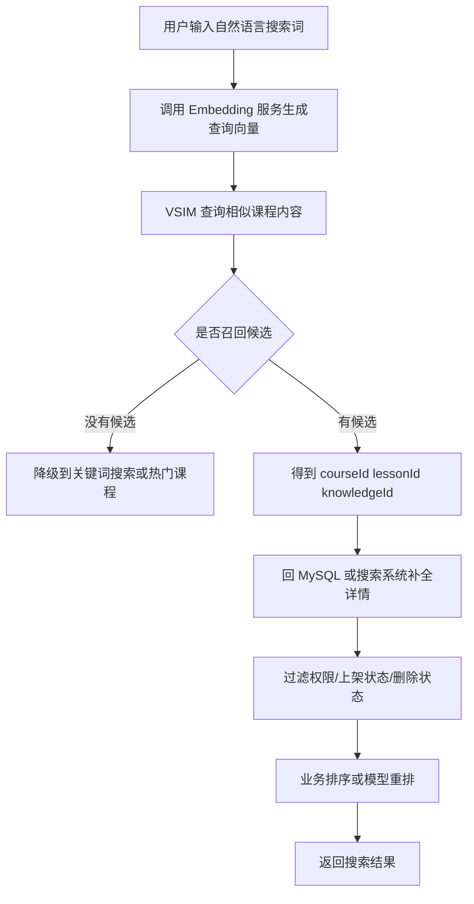
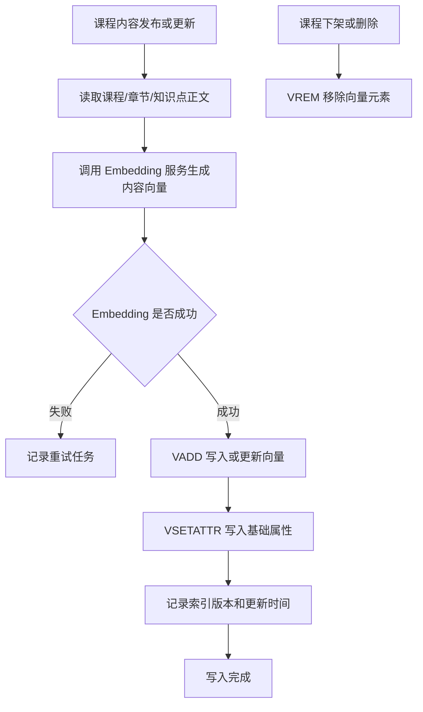
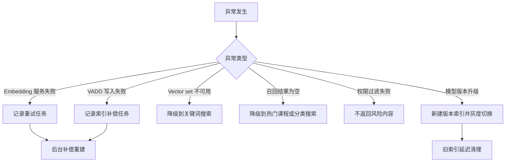
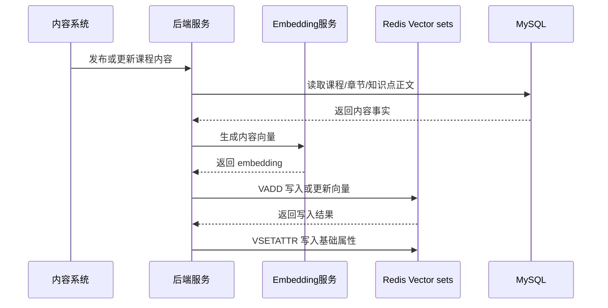
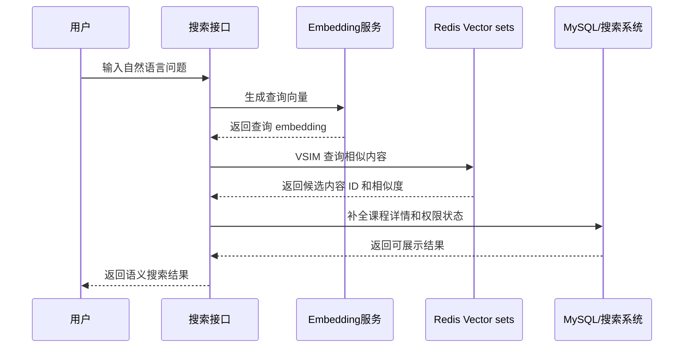
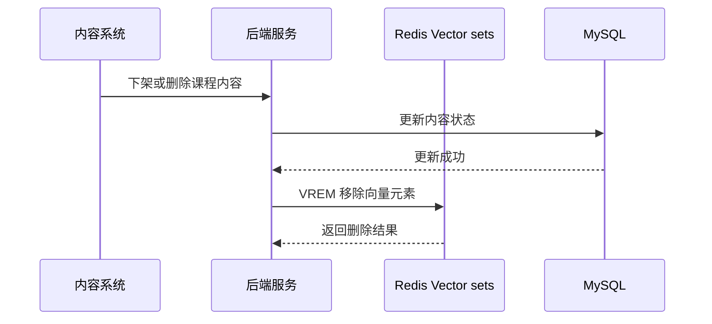
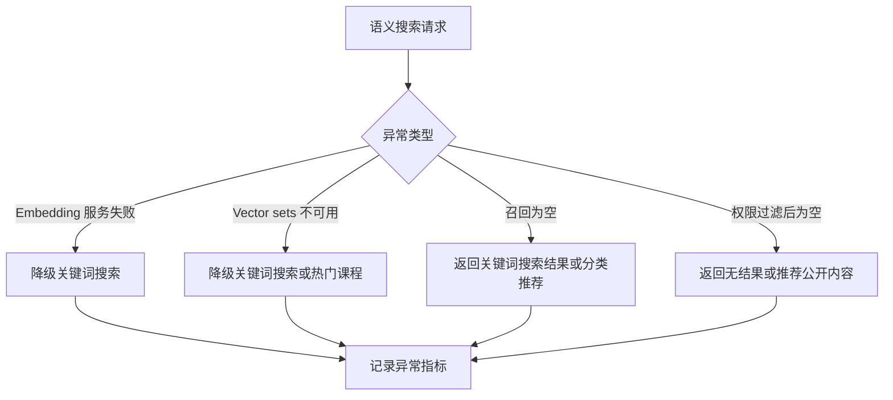

# Redis 知识点：Vector sets

## 1. 一句话结论

> Redis Vector sets 适合保存“元素 + 向量”，并按向量相似度找出相近元素。参考：[Redis 官方 Vector sets 文档](https://redis.io/docs/latest/develop/data-types/vector-sets/)
> 在课程内容语义搜索场景中，Vector sets 适合做语义召回，但不能替代 MySQL 的业务事实、权限过滤、内容元数据和完整搜索系统。**标记：主观推断**

---

## 2. 这个知识点是什么？

Vector sets 是 Redis 中用于保存向量数据并进行相似度搜索的数据类型。

可以简单理解为：

```text
Redis Vector set = 元素 ID + 向量 + 可选属性 + 相似度查询

element = 课程、章节、知识点、题目、文档片段
vector = embedding 模型生成的向量
attribute = 元素的简单 JSON 属性，例如 status、courseId、type
similarity search = 根据查询向量找最相似的元素
```

Redis 官方文档说明，Vector set 和 Sorted Set 类似，但元素关联的不是 score，而是向量；它可以根据指定向量，或者已有元素的向量，检索最相似的一组元素。参考：[Redis 官方 Vector sets 文档](https://redis.io/docs/latest/develop/data-types/vector-sets/)

从后端工程视角看，Vector sets 不是普通缓存，也不是完整搜索引擎，而是 Redis 提供的向量相似度召回能力。**标记：主观推断**

---

## 3. 它解决什么业务问题？

业务场景：课程内容语义搜索。

例如用户在学习平台里搜索：

```text
Redis 排行榜应该用什么数据结构？
```

传统关键词搜索可能只匹配“Redis”“排行榜”“数据结构”这些字面词，但用户真正想找的是：

```text
Sorted Set
ZSET
排行榜
TopN
我的排名
积分榜
实时排序
```

课程内容语义搜索希望解决的问题是：

* 用户输入自然语言问题，也能找到语义相关课程。**标记：主观推断**
* 课程标题、章节正文、知识点说明可以向量化后统一召回。**标记：主观推断**
* 搜索不只依赖关键词命中，还能根据语义相似度找候选结果。**标记：主观推断**
* 召回后仍要结合课程状态、权限、价格、质量分、关键词匹配做最终排序。**标记：主观推断**

| 业务问题      | 具体表现                                | Redis 如何解决                                                                                                                                  |
| --------- | ----------------------------------- | ------------------------------------------------------------------------------------------------------------------------------------------- |
| 关键词不完全匹配  | 用户搜“排行榜结构”，课程标题可能写的是“Sorted Set 实战” | 用 embedding 把用户问题和课程内容转成向量，再用 `VSIM` 查相似内容。参考：[Redis 官方 VSIM 文档](https://redis.io/docs/latest/commands/vsim/)                               |
| 需要语义召回候选集 | 搜索第一步需要快速找出相关课程、章节、知识点              | Vector sets 支持按向量相似度返回相似元素。参考：[Redis 官方 Vector sets 文档](https://redis.io/docs/latest/develop/data-types/vector-sets/)                       |
| 内容持续更新    | 课程标题、章节、知识点更新后，语义索引也要更新             | `VADD` 可以添加元素，元素已存在时更新向量。参考：[Redis 官方 VADD 文档](https://redis.io/docs/latest/commands/vadd/)                                                 |
| 需要简单属性过滤  | 只召回已发布课程、某类内容、某个业务范围内的内容            | Vector sets 支持给元素关联属性，并在 `VSIM` 中使用 `FILTER` 做过滤。参考：[Redis 官方 Vector sets 文档](https://redis.io/docs/latest/develop/data-types/vector-sets/) |
| 内容下架或删除   | 已删除章节不能继续被召回                        | `VREM` 可以从 Vector set 中移除元素。参考：[Redis 官方 VREM 文档](https://redis.io/docs/latest/commands/vrem/)                                              |

---

## 4. Redis 为什么适合？

| Redis 能力     | 对应业务价值                               | 证据 / 标记                                                                                                                                                                                                          |
| ------------ | ------------------------------------ | ---------------------------------------------------------------------------------------------------------------------------------------------------------------------------------------------------------------- |
| 元素关联向量       | 课程、章节、知识点可以作为 element，embedding 作为向量 | Vector set 元素关联的是向量。参考：[Redis 官方 Vector sets 文档](https://redis.io/docs/latest/develop/data-types/vector-sets/)                                                                                                   |
| `VADD` 写入向量  | 课程内容发布或更新后，可以写入或更新对应向量               | `VADD` 可以添加元素，或在元素已存在时更新它的向量。参考：[Redis 官方 VADD 文档](https://redis.io/docs/latest/commands/vadd/)                                                                                                                  |
| `VSIM` 相似度查询 | 用户问题向量化后，可以召回相似课程内容                  | `VSIM` 可以按向量相似度返回元素。参考：[Redis 官方 VSIM 文档](https://redis.io/docs/latest/commands/vsim/)                                                                                                                           |
| 属性过滤         | 可以给元素保存 JSON 属性，并在相似度查询时做简单过滤        | `VSETATTR` 可以关联 JSON 属性；`VSIM` 支持 `FILTER`。参考：[Redis 官方 VSETATTR 文档](https://redis.io/docs/latest/commands/vsetattr/)；参考：[Redis 官方 Vector sets 文档](https://redis.io/docs/latest/develop/data-types/vector-sets/) |
| 元素移除         | 课程下架、章节删除后，可以移除对应向量                  | `VREM` 可以从 Vector set 中移除元素。参考：[Redis 官方 VREM 文档](https://redis.io/docs/latest/commands/vrem/)                                                                                                                   |

核心判断：

> 课程内容语义搜索的核心不是“按关键词精确匹配”，而是“按语义相似度召回候选内容”，Vector sets 的元素向量化和相似度查询能力刚好匹配这个需求。**标记：主观推断**

---

## 5. 它的边界是什么？

| 边界                  | 说明                                                  | 更合适的选择                                        |
| ------------------- | --------------------------------------------------- | --------------------------------------------- |
| 不能替代 MySQL 事实源      | 课程标题、正文、价格、作者、上下架状态、购买关系、权限关系仍要有可靠事实源               | MySQL / 业务数据库。**标记：主观推断**                     |
| 不能替代完整搜索系统          | 关键词检索、分词、拼写纠错、复杂过滤、多字段排序、搜索运营配置不是 Vector sets 的核心职责 | Elasticsearch / OpenSearch / 搜索服务。**标记：主观推断** |
| 不能只靠向量判断最终结果        | 向量召回的是“相似候选”，不等于最终最优结果                              | 召回后重排 / 业务排序 / 权限过滤。**标记：主观推断**               |
| 不能忽略权限过滤            | 无权限课程、未上架课程、删除内容被召回会造成业务风险                          | MySQL 权限校验 / 搜索过滤 / Redis 属性过滤。**标记：主观推断**    |
| 不能混用不同 embedding 模型 | 不同模型、不同维度、不同归一化方式混用，会导致相似度结果不可靠                     | 统一 embedding 模型版本和维度。**标记：主观推断**              |

关键边界：

> Vector sets 适合“语义召回”，不适合单独承担“业务事实、权限判断、复杂搜索、最终排序”。**标记：主观推断**

---

## 6. 常见坑是什么？

| 常见坑           | 线上风险                                  | 规避方式                                                 |
| ------------- | ------------------------------------- | ---------------------------------------------------- |
| 内容更新但向量没更新    | 用户搜索结果仍然命中过期内容，召回质量下降                 | 内容发布、更新、删除时同步更新或删除向量。**标记：主观推断**                     |
| 只做向量召回，不做权限过滤 | 无权限、未上架、已删除内容可能展示给用户                  | 召回后必须回源 MySQL / 搜索系统做权限和状态校验。**标记：主观推断**             |
| 向量维度不一致       | 不同维度向量写入同一集合会导致数据不可用或结果异常             | 同一个 Vector set 只使用同一个 embedding 模型和维度。**标记：主观推断**    |
| 召回结果直接当最终排序   | 相似度高不代表业务上最适合，可能忽略课程质量、热度、难度、用户阶段     | 向量召回后做重排。**标记：主观推断**                                 |
| 元数据塞太多        | 把大量课程详情塞进 Redis 属性，导致 Redis 承担业务数据库职责 | Vector sets 只保存召回必要属性，详情回 MySQL / 搜索系统补全。**标记：主观推断** |
| 向量索引不可重建      | Redis 数据异常后无法恢复语义搜索能力                 | 保留课程原文、embedding 版本和重建任务。**标记：主观推断**                 |

---

## 7. MySQL / 本地缓存 / 其他方案是否更合适？

| 方案                         | 是否适合               | 原因                                                                                                                         |
| -------------------------- | ------------------ | -------------------------------------------------------------------------------------------------------------------------- |
| MySQL                      | 必须保留               | MySQL 适合保存课程事实、章节内容、权限关系、上下架状态和审计记录。**标记：主观推断**                                                                            |
| Redis Vector sets          | 适合做语义召回            | Vector sets 适合保存元素向量，并按相似度找相近元素。参考：[Redis 官方 Vector sets 文档](https://redis.io/docs/latest/develop/data-types/vector-sets/) |
| 本地缓存                       | 不适合做全局向量搜索         | 本地缓存无法跨实例维护统一向量索引，也不适合承接全局语义召回。**标记：主观推断**                                                                                 |
| Redis Hash / JSON          | 适合存对象字段，不适合向量相似度搜索 | Hash / JSON 可以保存结构化对象，但不是向量相似度召回模型。**标记：主观推断**                                                                             |
| Elasticsearch / OpenSearch | 适合关键词搜索和复杂过滤       | 搜索系统更适合关键词检索、分词、复杂过滤、排序和搜索运营配置。**标记：主观推断**                                                                                 |
| 专业向量数据库                    | 适合更大规模向量检索         | 如果向量规模、过滤复杂度、召回性能和索引治理要求很高，应评估专业向量数据库。**标记：主观推断**                                                                          |
| Rerank 服务 / 推荐系统           | 适合最终排序             | 向量召回只是候选集，最终排序需要结合业务特征和模型重排。**标记：主观推断**                                                                                    |

最终判断：

> 如果目标是“业务内快速做语义相似召回”，Redis Vector sets 合适；如果目标是“完整搜索、复杂过滤、大规模向量检索、最终推荐排序”，需要 MySQL、搜索系统、向量数据库和重排服务共同完成。**标记：主观推断**

---

## 8. 具体业务场景例子

### 8.1 场景背景

业务：学习平台支持课程内容语义搜索。

用户输入自然语言问题：

```text
Redis 排行榜应该用什么结构？
```

系统希望返回：

```text
Sorted Set 排行榜课程
Redis ZSET TopN 章节
积分榜设计知识点
活动实时榜案例
```

接口示例：

```text
POST /api/search/semantic-course
```

请求示例：

```json
{
  "query": "Redis 排行榜应该用什么结构？",
  "limit": 10
}
```

数据来源：

* 课程标题、章节标题、知识点正文来自 MySQL 或内容系统。**标记：主观推断**
* embedding 由 Embedding 服务生成。**标记：主观推断**
* Redis Vector sets 保存内容 ID 和向量。**标记：主观推断**
* 搜索结果详情、权限、上架状态从 MySQL 或搜索系统补全。**标记：主观推断**

---

### 8.2 业务问题

如果不用 Vector sets，可能会遇到这些问题：

| 业务问题            | 具体表现                                        |
| --------------- | ------------------------------------------- |
| 关键词匹配不稳定        | 用户搜“排行榜”，课程写“Sorted Set”，可能无法命中。**标记：主观推断** |
| 自然语言问题难搜索       | 用户输入的是一句问题，不是精确关键词。**标记：主观推断**              |
| 推荐候选缺少语义相关性     | 只靠分类、标签、热度，可能找不到语义接近内容。**标记：主观推断**          |
| MySQL 不适合做向量相似度 | MySQL 适合事实查询，不适合直接承接高频向量相似搜索。**标记：主观推断**    |
| 完整搜索系统接入成本高     | 如果只是业务内轻量语义召回，直接引入重搜索架构可能成本偏高。**标记：主观推断**   |

用了 Redis Vector sets 后：

* 内容发布后，用 `VADD` 写入课程内容向量。参考：[Redis 官方 VADD 文档](https://redis.io/docs/latest/commands/vadd/)
* 用户搜索时，用 `VSIM` 按查询向量召回相似内容。参考：[Redis 官方 VSIM 文档](https://redis.io/docs/latest/commands/vsim/)
* 内容状态可以用 `VSETATTR` 关联基础属性。参考：[Redis 官方 VSETATTR 文档](https://redis.io/docs/latest/commands/vsetattr/)
* 内容下架或删除后，用 `VREM` 移除向量元素。参考：[Redis 官方 VREM 文档](https://redis.io/docs/latest/commands/vrem/)

---

### 8.3 Redis 设计

```text
Redis key:
course:content:vectors:{embeddingModelVersion}

Redis value:
Vector set

element:
lesson:{lessonId}
course:{courseId}
knowledge:{knowledgeId}

vector:
由 Embedding 服务生成的内容向量

attributes:
{
  "courseId": 101,
  "lessonId": 1001,
  "type": "lesson",
  "status": "published",
  "lang": "zh-CN",
  "embeddingModel": "text-embedding-v1"
}

TTL:
通常不建议给核心向量索引设置短 TTL。
课程内容还存在时，向量索引应持续可用。
内容下架、删除、模型升级、索引重建时再主动更新或清理。
**标记：主观推断**

MySQL:
保存课程事实、章节正文、课程状态、权限关系、价格、作者、发布时间。
Redis 只保存语义召回所需的向量和少量过滤属性。
**标记：主观推断**

降级:
Redis Vector sets 不可用时，可以降级到关键词搜索、热门课程、分类搜索或历史搜索结果。
**标记：主观推断**
```

---

### 8.4 读流程



说明：

* `VSIM` 可以按向量相似度返回相似元素。参考：[Redis 官方 VSIM 文档](https://redis.io/docs/latest/commands/vsim/)
* Vector sets 返回的主要是候选元素 ID 和相似度，不应直接当成完整搜索结果。**标记：主观推断**
* 召回后必须回 MySQL 或搜索系统补全课程标题、章节内容、权限和状态。**标记：主观推断**
* 没有候选结果时，可以降级到关键词搜索、热门课程或分类推荐。**标记：主观推断**

---

### 8.5 写流程



说明：

* `VADD` 可以添加元素，或在元素已存在时更新向量。参考：[Redis 官方 VADD 文档](https://redis.io/docs/latest/commands/vadd/)
* `VSETATTR` 可以给 Vector set 中的元素关联 JSON 属性。参考：[Redis 官方 VSETATTR 文档](https://redis.io/docs/latest/commands/vsetattr/)
* `VREM` 可以从 Vector set 中移除元素。参考：[Redis 官方 VREM 文档](https://redis.io/docs/latest/commands/vrem/)
* 课程内容更新后要重新生成 embedding 并更新 Vector set，否则召回会过期。**标记：主观推断**
* embedding 生成失败时，应记录重试任务，不能让索引长期缺失。**标记：主观推断**

---

### 8.6 异常处理



说明：

* Redis Vector sets 只负责向量召回，不应绕过业务权限和内容状态校验。**标记：主观推断**
* Vector set 不可用时，搜索接口应降级到关键词搜索、热门课程或分类搜索。**标记：主观推断**
* Embedding 失败或 `VADD` 失败时，需要记录补偿任务，避免内容长期无法被语义召回。**标记：主观推断**
* embedding 模型升级时，建议按模型版本构建新索引，验证后再切换。**标记：主观推断**
* 权限过滤失败时，宁可不返回该候选，也不要返回无权限内容。**标记：主观推断**

---

### 8.7 监控指标

| 指标                  | 作用                                   |
| ------------------- | ------------------------------------ |
| `VADD` 写入成功 / 失败次数  | 判断向量索引更新是否正常。**标记：主观推断**             |
| `VSIM` 查询 QPS       | 判断语义搜索请求压力。**标记：主观推断**               |
| `VSIM` P95 / P99 延迟 | 判断向量召回是否影响搜索接口性能。**标记：主观推断**         |
| Vector set 元素数量     | 判断索引规模是否符合课程内容规模。**标记：主观推断**         |
| embedding 生成失败次数    | 判断 Embedding 服务是否稳定。**标记：主观推断**      |
| 向量索引缺失数量            | 判断有多少课程内容没有成功写入向量索引。**标记：主观推断**      |
| 内容更新到向量更新延迟         | 判断语义索引是否及时同步。**标记：主观推断**             |
| 召回为空比例              | 判断语义召回覆盖率是否不足。**标记：主观推断**            |
| 召回后被权限过滤比例          | 判断 Redis 属性过滤和业务权限过滤是否合理。**标记：主观推断** |
| Redis used_memory   | 判断向量索引带来的内存压力。**标记：主观推断**            |

---

## 9. Mermaid 图

说明：以下 Mermaid 图统一使用标准 ` ```mermaid `，不带 id，支持 Cursor 和浏览器显示。**标记：主观推断**

### 9.1 内容向量写入流程



说明：

* `VADD` 用于写入或更新向量。参考：[Redis 官方 VADD 文档](https://redis.io/docs/latest/commands/vadd/)
* `VSETATTR` 用于关联基础属性。参考：[Redis 官方 VSETATTR 文档](https://redis.io/docs/latest/commands/vsetattr/)
* MySQL 保存内容事实，Redis 保存向量索引。**标记：主观推断**

---

### 9.2 语义搜索查询流程



说明：

* `VSIM` 用于按向量相似度召回候选元素。参考：[Redis 官方 VSIM 文档](https://redis.io/docs/latest/commands/vsim/)
* 搜索结果必须补全业务数据并做权限过滤。**标记：主观推断**
* 向量召回只是搜索链路的一环，不是最终搜索结果。**标记：主观推断**

---

### 9.3 内容下架清理流程



说明：

* `VREM` 用于从 Vector set 中移除元素。参考：[Redis 官方 VREM 文档](https://redis.io/docs/latest/commands/vrem/)
* 内容下架后如果不删除向量，可能继续被语义召回。**标记：主观推断**
* 删除失败应记录补偿任务，避免风险内容被召回。**标记：主观推断**

---

### 9.4 异常降级流程



说明：

* 语义搜索失败时，可以降级到关键词搜索、热门课程或分类推荐。**标记：主观推断**
* 权限过滤后为空时，不应为了有结果而返回无权限内容。**标记：主观推断**
* 降级结果要明确标记来源，避免误判语义搜索质量。**标记：主观推断**

---

## 10. 工程评审关注点

| 关注点               | 说明                                                                                                                                                |
| ----------------- | ------------------------------------------------------------------------------------------------------------------------------------------------- |
| 为什么用 Vector sets？ | 因为课程内容语义搜索需要按向量相似度召回候选内容，Vector sets 正好提供元素向量化和相似度查询能力。参考：[Redis 官方 Vector sets 文档](https://redis.io/docs/latest/develop/data-types/vector-sets/) |
| 为什么不用 MySQL？      | MySQL 适合课程事实和权限关系，不适合直接做向量相似度搜索。**标记：主观推断**                                                                                                       |
| 为什么不用普通缓存类型？      | Hash / JSON / String 可以存对象或快照，但不能表达向量相似度召回。**标记：主观推断**                                                                                            |
| 是否能替代搜索系统？        | 不能；Vector sets 适合语义召回，关键词检索、复杂过滤、排序运营仍需要搜索系统。**标记：主观推断**                                                                                          |
| 权限怎么保证？           | 召回后必须回源 MySQL 或搜索系统校验权限、上下架和删除状态。**标记：主观推断**                                                                                                      |
| 内容更新怎么办？          | 内容更新后重新生成 embedding，用 `VADD` 更新向量。参考：[Redis 官方 VADD 文档](https://redis.io/docs/latest/commands/vadd/)                                              |
| 内容删除怎么办？          | 内容删除或下架后用 `VREM` 移除向量元素。参考：[Redis 官方 VREM 文档](https://redis.io/docs/latest/commands/vrem/)                                                        |
| Redis 不可用怎么办？     | 降级到关键词搜索、热门课程或分类搜索。**标记：主观推断**                                                                                                                    |
| 模型升级怎么办？          | 按 embedding 模型版本新建索引，灰度验证后切换。**标记：主观推断**                                                                                                          |

---

## 11. 最终记忆点

1. Vector sets 的核心价值是“元素 + 向量 + 相似度召回”。
2. 课程内容语义搜索适合用 Vector sets 做候选召回。**标记：主观推断**
3. Vector sets 不负责业务事实、权限过滤、完整搜索和最终排序。**标记：主观推断**
4. 向量搜索链路必须包含：内容向量化、相似度召回、业务补全、权限过滤、重排。**标记：主观推断**
5. 资深后端设计 Vector sets 方案时，必须回答：向量从哪里来、内容更新怎么同步、权限怎么过滤、索引丢了怎么重建。**标记：主观推断**

---

## 12. 参考资料

1. [Redis 官方 Vector sets 文档](https://redis.io/docs/latest/develop/data-types/vector-sets/)：用于确认 Vector sets 的元素向量化、相似度查询和属性过滤能力。
2. [Redis 官方 VADD 文档](https://redis.io/docs/latest/commands/vadd/)：用于确认 `VADD` 可以添加元素，或在元素已存在时更新它的向量。
3. [Redis 官方 VSIM 文档](https://redis.io/docs/latest/commands/vsim/)：用于确认 `VSIM` 可以按向量相似度返回元素。
4. [Redis 官方 VSETATTR 文档](https://redis.io/docs/latest/commands/vsetattr/)：用于确认 `VSETATTR` 可以给元素关联 JSON 属性。
5. [Redis 官方 VREM 文档](https://redis.io/docs/latest/commands/vrem/)：用于确认 `VREM` 可以从 Vector set 中移除元素。
