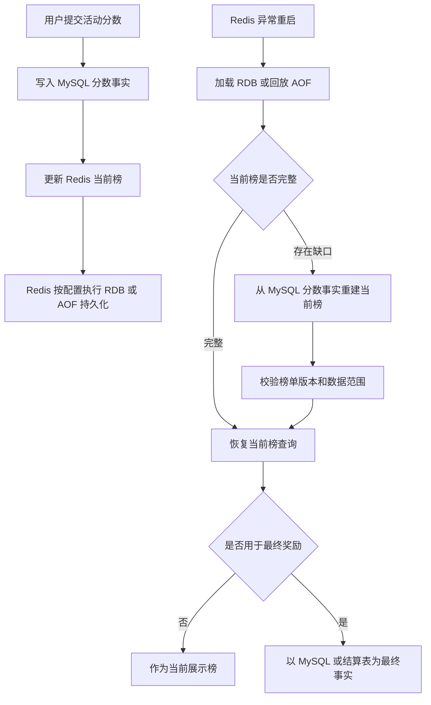

# 统一工程边界章节：Redis 持久化 / 数据恢复 / 一致性权衡

## 1. 本章一句话

Redis 持久化机制可以提升 Redis 重启后的数据恢复能力，但它不等于强一致事实源；RDB 是时间点快照，AOF 是写操作日志回放。参考：[Redis 官方持久化文档](https://redis.io/docs/latest/operate/oss_and_stack/management/persistence/)

本章核心判断：只要数据影响最终排名、奖励、结算、处罚或审计，就不能只依赖 Redis 持久化，必须有 MySQL 事实源、日志事实源或可重建来源。**标记：主观推断**

---

## 2. 适合解决什么问题？

| 场景              | 为什么适合                                                                                                                                       |
| --------------- | ------------------------------------------------------------------------------------------------------------------------------------------- |
| Redis 重启后恢复内存数据 | Redis 支持 RDB、AOF、RDB + AOF 等方式把数据写入磁盘，用于重启恢复。参考：[Redis 官方持久化文档](https://redis.io/docs/latest/operate/oss_and_stack/management/persistence/) |
| 缓存型数据减少冷启动压力    | RDB / AOF 可以让部分缓存数据在重启后恢复，降低完全回源 MySQL 的压力。**标记：主观推断**                                                                                      |
| 当前榜等临时状态降低丢失风险  | AOF 可以记录写命令并在重启时回放，减少 Redis 异常后的状态丢失风险。参考：[Redis 官方持久化文档](https://redis.io/docs/latest/operate/oss_and_stack/management/persistence/)       |
| 数据备份和迁移         | RDB 是紧凑的时间点数据文件，适合做备份。参考：[Redis 官方持久化文档](https://redis.io/docs/latest/operate/oss_and_stack/management/persistence/)                        |
| 故障恢复策略设计        | 持久化能帮助恢复，但仍要结合业务可接受的数据丢失窗口、恢复时间和事实源设计。**标记：主观推断**                                                                                           |

---

## 3. 主案例

主案例：活动当前榜 Redis 重启后的恢复与数据丢失窗口。

业务背景：活动期间用户不断提交分数，Redis 维护当前榜，前端频繁查询 TopN、我的排名、附近排名。**标记：主观推断**

核心原因：当前榜属于高频读写状态，Redis 适合承接实时排名查询；但如果 Redis 重启、AOF 刷盘策略、RDB 快照间隔、磁盘故障或配置错误导致数据缺口，就可能影响榜单结果。**标记：主观推断**

边界判断：如果当前榜只用于展示，可以接受短暂恢复和重建；如果当前榜会影响最终名次、奖励或结算，MySQL 必须保存每次有效提交分数或最终事实，Redis 只能做实时查询层。**标记：主观推断**

辅助案例：

* 课程详情缓存重建：适合说明缓存型数据丢失后可以回 MySQL 重建，重点关注回源压力。**标记：主观推断**
* 活动配置缓存恢复：适合说明配置事实应在 MySQL，Redis 丢失后重新加载。**标记：主观推断**
* Stream 异步任务恢复：适合说明 AOF 对恢复有帮助，但仍要考虑消费确认、幂等和补偿。**标记：主观推断**
* Session 登录态影响：适合说明短期状态丢失会影响体验，但通常不能把 Redis 持久化当唯一保障。**标记：主观推断**

---

## 4. 核心流程

说明：

* RDB 是 Redis 数据集在指定时间点的快照，AOF 会记录写操作并在启动时回放重建数据。参考：[Redis 官方持久化文档](https://redis.io/docs/latest/operate/oss_and_stack/management/persistence/)
* RDB 快照方式不是强持久，如果 Redis 进程或服务器异常停止，最近写入的数据可能丢失。参考：[Redis 官方持久化文档](https://redis.io/docs/latest/operate/oss_and_stack/management/persistence/)
* AOF 相比 RDB 通常提供更好的持久性，但会受到 fsync 策略、文件大小、重写、恢复时间和资源开销影响。参考：[Redis 官方持久化文档](https://redis.io/docs/latest/operate/oss_and_stack/management/persistence/)
* 活动当前榜可以用 Redis 做高频实时查询层，但最终榜、奖励和结算应以 MySQL 或可审计事实源为准。**标记：主观推断**
* Redis 持久化解决的是“尽量恢复 Redis 数据”，不是“证明业务结果绝对正确”。**标记：主观推断**

---

## 5. 关键命令 / 配置

| 命令 / 配置                | 作用                                                                                                                                       |
| ---------------------- | ---------------------------------------------------------------------------------------------------------------------------------------- |
| `save 60 1000`         | 配置 RDB 快照策略，例如 60 秒内至少 1000 次变更则保存快照。参考：[Redis 官方持久化文档](https://redis.io/docs/latest/operate/oss_and_stack/management/persistence/)      |
| `BGSAVE`               | 后台生成 RDB 快照文件，用于备份或恢复。参考：[Redis 官方 BGSAVE 文档](https://redis.io/docs/latest/commands/bgsave/)                                             |
| `appendonly yes`       | 开启 AOF，让 Redis 记录写操作日志并在重启时回放。参考：[Redis 官方持久化文档](https://redis.io/docs/latest/operate/oss_and_stack/management/persistence/)             |
| `appendfsync everysec` | 常见 AOF fsync 策略，用性能和数据安全做折中；仍可能存在秒级数据丢失窗口。参考：[Redis 官方持久化文档](https://redis.io/docs/latest/operate/oss_and_stack/management/persistence/) |
| `BGREWRITEAOF`         | 后台重写 AOF，压缩日志体积，降低长期增长风险。参考：[Redis 官方 BGREWRITEAOF 文档](https://redis.io/docs/latest/commands/bgrewriteaof/)                              |

---

## 6. 边界和坑

| 问题          | 说明                                                                                                                                        |
| ----------- | ----------------------------------------------------------------------------------------------------------------------------------------- |
| 把持久化误解成强事实源 | RDB / AOF 能帮助恢复 Redis 数据，但不能替代 MySQL 的事务、审计、关系约束和业务事实。**标记：主观推断**                                                                         |
| 忽略数据丢失窗口    | RDB 是时间点快照；AOF 也受 fsync 策略影响，异常时仍可能丢部分最新写入。参考：[Redis 官方持久化文档](https://redis.io/docs/latest/operate/oss_and_stack/management/persistence/) |
| 只看恢复，不看重建   | 当前榜恢复后仍要校验是否缺少提交记录，否则榜单可能看似恢复但结果不完整。**标记：主观推断**                                                                                           |
| 忽略性能影响      | AOF、fsync、rewrite、RDB fork 都可能带来磁盘、CPU、内存和延迟压力。**标记：主观推断**                                                                                |
| 没有事实源兜底     | 如果 Redis 是唯一数据来源，持久化文件损坏、误删、配置错误或过期淘汰后，业务可能无法可靠恢复。**标记：主观推断**                                                                             |

---

## 7. 本章记忆点

1. Redis 持久化是恢复能力，不是强一致事实源。
2. RDB 更像时间点快照，AOF 更像写操作日志回放；二者都要权衡数据丢失窗口、性能和恢复时间。参考：[Redis 官方持久化文档](https://redis.io/docs/latest/operate/oss_and_stack/management/persistence/)
3. 影响最终榜、奖励、结算、处罚、审计的数据，必须有 MySQL、日志或数仓作为可追溯事实源。**标记：主观推断**
