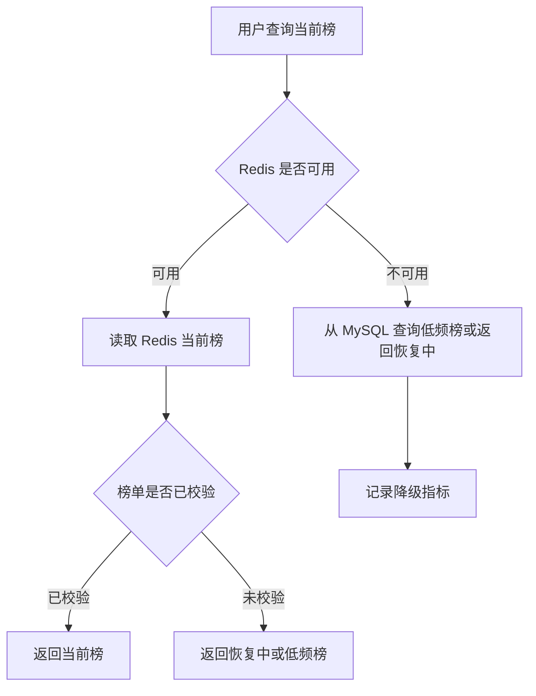
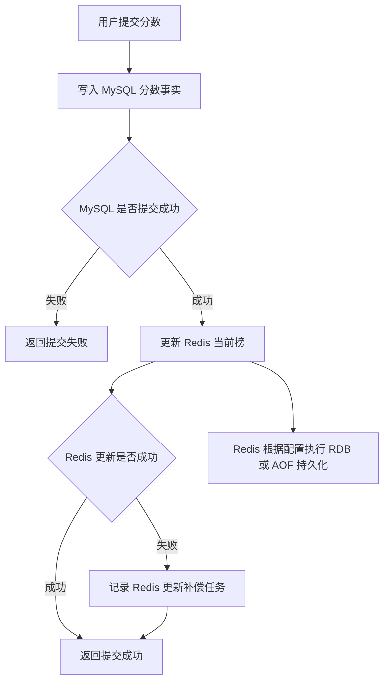
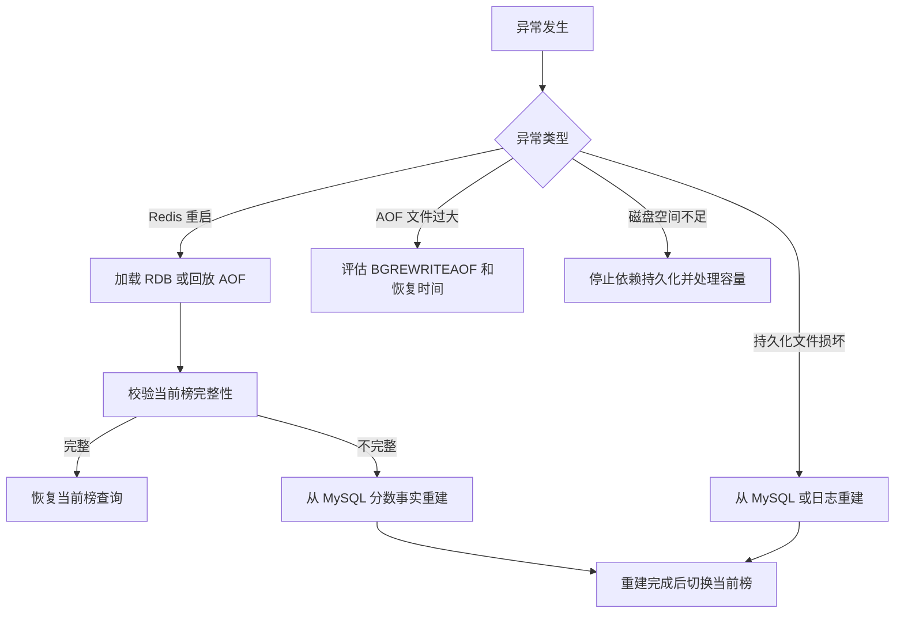
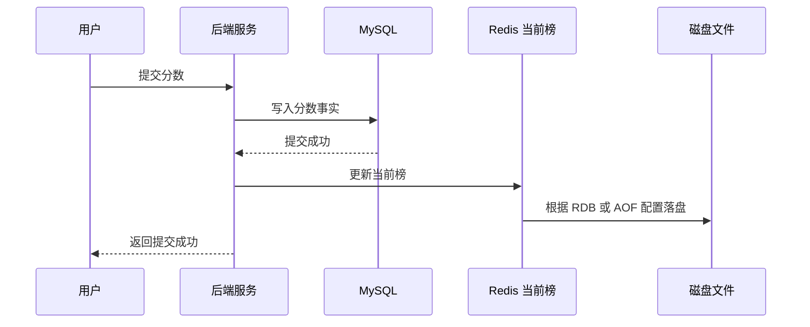
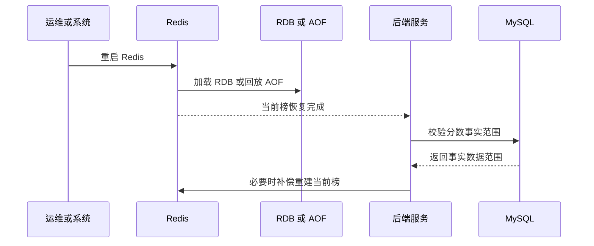
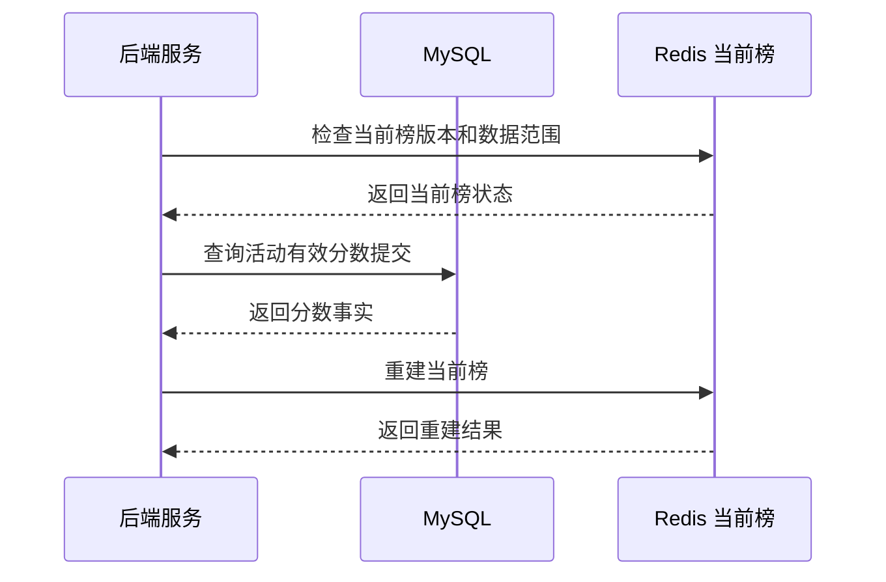
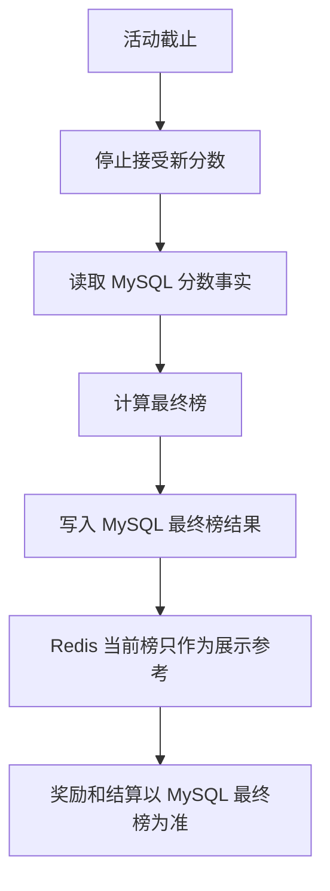

# Redis 知识点：持久化机制

## 1. 一句话结论

> Redis 持久化机制的核心价值是把内存数据写到磁盘，提升 Redis 重启后的恢复能力；Redis 支持 RDB、AOF、不持久化、RDB + AOF 等方式。参考：[Redis 官方持久化文档](https://redis.io/docs/latest/operate/oss_and_stack/management/persistence/)
> Redis 有持久化，不等于 Redis 可以随便当强一致事实源；只要数据影响最终榜、奖励、结算、处罚或审计，就必须有 MySQL、日志或数仓作为可追溯事实源。**标记：主观推断**

---

## 2. 这个知识点是什么？

Redis 持久化机制是 Redis 把内存中的数据保存到磁盘，并在重启后尝试恢复数据的一组能力。

可以简单理解为：

```text
Redis 持久化 = 内存数据落盘 + 重启恢复

主要方式：
- RDB：按时间点生成数据快照
- AOF：记录写操作日志，重启时回放
- RDB + AOF：同时启用，兼顾恢复速度和数据安全
- 不持久化：Redis 只作为纯内存临时存储
```

Redis 官方文档说明，RDB 会在指定时间间隔生成数据集的时间点快照，AOF 会记录服务收到的每个写操作，并在启动时回放这些操作来重建数据。参考：[Redis 官方持久化文档](https://redis.io/docs/latest/operate/oss_and_stack/management/persistence/)

从后端工程视角看，持久化不是“保证业务数据永不丢”，而是“在 Redis 异常重启后尽量恢复 Redis 中的数据”。**标记：主观推断**

---

## 3. 它解决什么业务问题？

业务场景：活动当前榜 Redis 重启后的恢复与数据丢失窗口。

例如活动期间：

```text
用户提交分数
Redis 更新当前榜
前端查询 TopN、我的排名、附近排名
活动截止后生成最终榜
```

如果 Redis 没有持久化，Redis 重启后当前榜可能完全丢失；如果开启 RDB / AOF，Redis 可以尝试从磁盘恢复当前榜数据，但仍然要面对数据丢失窗口、恢复延迟、文件损坏、配置错误和业务一致性问题。**标记：主观推断**

| 业务问题            | 具体表现               | Redis 如何解决                                                                                                                  |
| --------------- | ------------------ | --------------------------------------------------------------------------------------------------------------------------- |
| Redis 重启后当前榜丢失  | 活动还没结束，当前榜无法展示     | RDB / AOF 可以帮助 Redis 重启后恢复数据。参考：[Redis 官方持久化文档](https://redis.io/docs/latest/operate/oss_and_stack/management/persistence/) |
| RDB 快照不包含最新写入   | 快照之后、宕机之前的分数可能丢失   | RDB 是时间点快照，存在快照间隔带来的数据丢失窗口。参考：[Redis 官方持久化文档](https://redis.io/docs/latest/operate/oss_and_stack/management/persistence/)   |
| AOF 恢复需要回放日志    | AOF 文件越大，重启恢复可能越慢  | AOF 通过回放写操作重建数据。参考：[Redis 官方持久化文档](https://redis.io/docs/latest/operate/oss_and_stack/management/persistence/)              |
| 当前榜影响最终奖励       | 当前榜数据缺口可能影响最终名次    | 最终榜、奖励、结算应以 MySQL 或可审计事实源为准。**标记：主观推断**                                                                                     |
| Redis 数据恢复后仍需校验 | 看起来恢复了，但可能缺少部分提交分数 | 恢复后应和 MySQL 分数事实或提交日志校验。**标记：主观推断**                                                                                         |

---

## 4. Redis 为什么适合？

| Redis 能力       | 对应业务价值                       | 证据 / 标记                                                                                                               |
| -------------- | ---------------------------- | --------------------------------------------------------------------------------------------------------------------- |
| RDB 快照         | 可以把某一时间点的当前榜保存成磁盘快照          | RDB 是指定间隔生成的数据集时间点快照。参考：[Redis 官方持久化文档](https://redis.io/docs/latest/operate/oss_and_stack/management/persistence/)   |
| AOF 写操作日志      | 可以记录排行榜写入操作，重启后通过回放恢复        | AOF 会记录写操作，并在启动时回放重建数据。参考：[Redis 官方持久化文档](https://redis.io/docs/latest/operate/oss_and_stack/management/persistence/) |
| RDB + AOF      | 可以同时利用 RDB 的紧凑快照和 AOF 的较好持久性 | Redis 支持同时启用 RDB 和 AOF。参考：[Redis 官方持久化文档](https://redis.io/docs/latest/operate/oss_and_stack/management/persistence/) |
| `BGSAVE`       | 可以后台生成 RDB 快照，用于备份或恢复        | `BGSAVE` 会在后台异步保存数据集到磁盘。参考：[Redis 官方 BGSAVE 文档](https://redis.io/docs/latest/commands/bgsave/)                        |
| `BGREWRITEAOF` | 可以重写 AOF，生成更小的优化版日志文件        | `BGREWRITEAOF` 会创建更小的优化版 AOF 文件。参考：[Redis 官方 BGREWRITEAOF 文档](https://redis.io/docs/latest/commands/bgrewriteaof/)    |

核心判断：

> Redis 持久化适合提升“Redis 自身数据恢复能力”，但它不负责解决“业务事实是否完整、最终榜是否正确、奖励结算是否可审计”这些业务一致性问题。**标记：主观推断**

---

## 5. 它的边界是什么？

| 边界             | 说明                                                   | 更合适的选择                                 |
| -------------- | ---------------------------------------------------- | -------------------------------------- |
| 不能消除数据丢失窗口     | RDB 有快照间隔；AOF 也受 fsync 策略影响                          | 关键写入先落 MySQL 或日志事实源。**标记：主观推断**        |
| 不能替代 MySQL 事实源 | Redis 缺少关系约束、复杂查询、事务审计和长期事实管理                        | MySQL 保存分数提交事实、最终榜、奖励记录。**标记：主观推断**    |
| 不能保证恢复后业务正确    | Redis 能加载文件，不代表榜单一定完整                                | 恢复后做版本校验、数据范围校验、MySQL 回放重建。**标记：主观推断** |
| 不能忽略恢复时间       | AOF 文件过大时，重启回放可能影响恢复时长                               | 控制 AOF rewrite、容量、重建流程。**标记：主观推断**     |
| 不能忽略运行时开销      | RDB fork、AOF fsync、AOF rewrite 都可能带来 CPU、内存、磁盘 IO 压力 | 结合业务写入量和机器资源压测。**标记：主观推断**             |

关键边界：

> Redis 持久化解决的是“Redis 怎么恢复”，不是“业务事实怎么最终正确”。**标记：主观推断**

---

## 6. 常见坑是什么？

| 常见坑             | 线上风险                           | 规避方式                                                                                                                |
| --------------- | ------------------------------ | ------------------------------------------------------------------------------------------------------------------- |
| 以为开了 AOF 就不会丢数据 | fsync 策略不同，异常时仍可能丢部分最新写入       | 明确 `appendfsync` 策略和可接受丢失窗口。**标记：主观推断**                                                                             |
| 只开启 RDB 却承载关键数据 | 快照间隔内的数据可能丢失，影响当前榜完整性          | 关键数据先落 MySQL，Redis 用于实时查询。**标记：主观推断**                                                                               |
| AOF 文件长期膨胀      | 重启恢复慢，磁盘占用高                    | 使用 `BGREWRITEAOF` 或自动 rewrite 策略。参考：[Redis 官方 BGREWRITEAOF 文档](https://redis.io/docs/latest/commands/bgrewriteaof/) |
| 恢复后不做校验         | 榜单能查，但实际缺少部分提交分数               | 恢复后和 MySQL / 日志做版本、数量、时间范围校验。**标记：主观推断**                                                                            |
| Redis 是唯一数据源    | 持久化文件损坏、误删、配置错误后无法重建           | 保存 MySQL 事实、提交日志或数仓明细。**标记：主观推断**                                                                                   |
| 不监控持久化状态        | BGSAVE / AOF rewrite 失败后长期无人发现 | 监控持久化成功时间、失败次数、AOF 大小、磁盘空间。**标记：主观推断**                                                                              |

---

## 7. MySQL / 本地缓存 / 其他方案是否更合适？

| 方案           | 是否适合            | 原因                                         |
| ------------ | --------------- | ------------------------------------------ |
| MySQL        | 适合作为活动分数事实源     | MySQL 适合保存每次有效提交、最终榜、奖励记录、审计字段。**标记：主观推断** |
| Redis + 持久化  | 适合作为实时当前榜和恢复增强层 | Redis 适合高频排名读写，持久化提升重启恢复能力。**标记：主观推断**     |
| 本地缓存         | 不适合作为排行榜事实源     | 多实例本地缓存无法统一排名，也不适合恢复和全局查询。**标记：主观推断**      |
| 日志系统 / 数仓    | 适合补充可重建来源       | 可保存提交事件和访问轨迹，用于离线校验、重算和审计。**标记：主观推断**      |
| 只用 RDB / AOF | 不适合单独承载结算事实     | 持久化文件不是业务审计系统，不能替代 MySQL 事实表。**标记：主观推断**   |

最终判断：

> 活动当前榜可以用 Redis 承接实时查询，Redis 持久化用于提升恢复能力；最终榜、奖励、结算必须落在 MySQL 或可审计事实源上。**标记：主观推断**

---

## 8. 具体业务场景例子

### 8.1 场景背景

业务：活动期间维护一个实时当前榜。

接口示例：

```text
POST /api/activities/{activityId}/score
GET /api/activities/{activityId}/leaderboard/top
GET /api/activities/{activityId}/leaderboard/me
```

核心数据：

```text
用户提交分数
当前榜排名
我的排名
最终榜排名
奖励发放结果
```

设计前提：

```text
Redis 当前榜用于实时展示。
MySQL 保存每次有效分数提交和最终榜结果。
Redis 持久化用于降低 Redis 重启后的恢复成本。
```

**标记：主观推断**

---

### 8.2 业务问题

如果不理解持久化边界，可能出现这些问题：

| 业务问题           | 具体表现                                   |
| -------------- | -------------------------------------- |
| Redis 重启后当前榜丢失 | 活动期间榜单为空，用户无法看到实时排名。**标记：主观推断**        |
| RDB 快照缺少最新分数   | 用户刚提交的分数在 Redis 重启后消失。**标记：主观推断**      |
| AOF 恢复慢        | Redis 重启后需要较长时间回放日志，榜单恢复延迟。**标记：主观推断** |
| 榜单恢复后不完整       | 部分分数缺失但系统未发现，最终排名可能错误。**标记：主观推断**      |
| 误把 Redis 当事实源  | Redis 文件损坏或丢失后，无法证明最终榜是否正确。**标记：主观推断** |

用了 Redis 持久化后：

* RDB 可以保存某一时刻当前榜快照。参考：[Redis 官方持久化文档](https://redis.io/docs/latest/operate/oss_and_stack/management/persistence/)
* AOF 可以记录排行榜写操作，并在重启时回放恢复。参考：[Redis 官方持久化文档](https://redis.io/docs/latest/operate/oss_and_stack/management/persistence/)
* `BGSAVE` 可以后台生成 RDB 文件。参考：[Redis 官方 BGSAVE 文档](https://redis.io/docs/latest/commands/bgsave/)
* `BGREWRITEAOF` 可以重写 AOF，生成更小的优化版文件。参考：[Redis 官方 BGREWRITEAOF 文档](https://redis.io/docs/latest/commands/bgrewriteaof/)
* MySQL 仍然保存最终可追溯事实。**标记：主观推断**

---

### 8.3 Redis 设计

```text
Redis key:
leaderboard:current:{activityId}

Redis value:
Sorted Set
member = userId
score = 用户活动分数

持久化配置：
RDB：用于周期性快照和备份。
AOF：用于记录写操作，提升重启恢复能力。
RDB + AOF：生产环境可按业务容忍度评估组合使用。
具体配置必须结合写入量、磁盘能力、恢复时间和数据丢失容忍度压测。
**标记：主观推断**

MySQL:
duplicate_match_score / activity_score_submission：
保存每次有效分数提交。
leaderboard_result：
保存最终榜和奖励结算结果。
MySQL 是最终事实源。
**标记：主观推断**

降级:
Redis 当前榜不可用时，可以临时返回“榜单恢复中”，或从 MySQL 查询低频当前榜。
最终榜、奖励发放不能依赖未校验的 Redis 恢复结果。
**标记：主观推断**
```

---

### 8.4 读流程



说明：

* Redis 持久化可以帮助 Redis 重启后恢复数据，但恢复后的业务完整性仍需要校验。**标记：主观推断**
* 当前榜如果只是展示，可以在恢复期间返回“榜单恢复中”或低频榜。**标记：主观推断**
* 如果当前榜会影响奖励或结算，不能直接使用未校验的 Redis 榜单。**标记：主观推断**
* Redis 读取异常时，应记录降级指标，便于后续复盘。**标记：主观推断**

---

### 8.5 写流程



说明：

* RDB 是指定间隔的数据快照，AOF 是写操作日志回放。参考：[Redis 官方持久化文档](https://redis.io/docs/latest/operate/oss_and_stack/management/persistence/)
* 影响最终榜和奖励的数据应先写 MySQL 事实表，再更新 Redis 当前榜。**标记：主观推断**
* Redis 更新失败时，不应丢失分数事实，应依赖 MySQL 事实表做补偿重建。**标记：主观推断**
* Redis 持久化发生在 Redis 层，不能替代业务事务提交。**标记：主观推断**

---

### 8.6 异常处理



说明：

* Redis 启动时可以通过 AOF 回放写操作重建数据。参考：[Redis 官方持久化文档](https://redis.io/docs/latest/operate/oss_and_stack/management/persistence/)
* `BGREWRITEAOF` 用于创建更小的优化版 AOF 文件。参考：[Redis 官方 BGREWRITEAOF 文档](https://redis.io/docs/latest/commands/bgrewriteaof/)
* Redis 重启恢复后，应校验榜单是否覆盖完整活动时间范围。**标记：主观推断**
* 持久化文件损坏或缺失时，能否恢复取决于 MySQL 或日志是否保存了事实数据。**标记：主观推断**
* 磁盘空间不足、AOF rewrite 失败、RDB 保存失败都应触发告警。**标记：主观推断**

---

### 8.7 监控指标

| 指标                      | 作用                                   |
| ----------------------- | ------------------------------------ |
| 最近一次 RDB 保存时间           | 判断快照是否正常生成。**标记：主观推断**               |
| RDB 保存失败次数              | 判断快照持久化是否异常。**标记：主观推断**              |
| AOF 是否开启                | 判断当前实例是否具备 AOF 恢复能力。**标记：主观推断**      |
| AOF 文件大小                | 判断是否存在恢复变慢和磁盘压力。**标记：主观推断**          |
| AOF rewrite 次数和失败次数     | 判断 AOF 压缩是否稳定。**标记：主观推断**            |
| Redis 重启恢复耗时            | 判断恢复时间是否满足业务要求。**标记：主观推断**           |
| Redis 当前榜重建耗时           | 判断从 MySQL 重建当前榜是否可接受。**标记：主观推断**     |
| MySQL 分数事实与 Redis 当前榜差异 | 判断 Redis 榜单是否完整。**标记：主观推断**          |
| 磁盘使用率和 IO 延迟            | 判断持久化是否可能影响 Redis 性能。**标记：主观推断**     |
| Redis 写入延迟 P95 / P99    | 判断 AOF fsync 或磁盘压力是否影响写入。**标记：主观推断** |

---

## 9. Mermaid 图

说明：以下 Mermaid 图统一使用标准 ` ```mermaid `，不带 id，支持 Cursor 和浏览器显示。**标记：主观推断**

### 9.1 当前榜写入与持久化关系



说明：

* Redis 持久化发生在 Redis 层，不等于 MySQL 业务事务。**标记：主观推断**
* MySQL 保存分数事实，Redis 保存当前榜查询状态。**标记：主观推断**

---

### 9.2 Redis 重启恢复流程



说明：

* AOF 可以在启动时回放写操作重建数据。参考：[Redis 官方持久化文档](https://redis.io/docs/latest/operate/oss_and_stack/management/persistence/)
* Redis 恢复完成不代表业务校验完成。**标记：主观推断**

---

### 9.3 当前榜缺口重建流程



说明：

* 当前榜缺口应从 MySQL 分数事实重建。**标记：主观推断**
* 重建后需要记录版本和完成时间，避免使用半重建状态。**标记：主观推断**

---

### 9.4 最终榜确认流程



说明：

* 最终榜、奖励和结算应以 MySQL 最终事实为准。**标记：主观推断**
* Redis 当前榜即使开启持久化，也不应直接作为最终结算唯一依据。**标记：主观推断**

---

## 10. 工程评审关注点

| 关注点                     | 说明                                                                                                                      |
| ----------------------- | ----------------------------------------------------------------------------------------------------------------------- |
| Redis 有持久化，为什么还要 MySQL？ | 因为持久化解决 Redis 恢复，不解决业务事实、审计、关系约束和最终一致性。**标记：主观推断**                                                                      |
| RDB 和 AOF 的核心区别是什么？     | RDB 是时间点快照，AOF 是写操作日志回放。参考：[Redis 官方持久化文档](https://redis.io/docs/latest/operate/oss_and_stack/management/persistence/)  |
| 当前榜丢数据怎么办？              | 从 MySQL 分数事实或提交日志重建 Redis 当前榜。**标记：主观推断**                                                                               |
| 是否可以只用 Redis 做最终榜？      | 不建议；最终榜、奖励、结算需要可追溯事实源。**标记：主观推断**                                                                                       |
| AOF 文件太大怎么办？            | 使用 `BGREWRITEAOF` 或自动 rewrite 控制文件体积。参考：[Redis 官方 BGREWRITEAOF 文档](https://redis.io/docs/latest/commands/bgrewriteaof/) |
| Redis 恢复后怎么确认完整？        | 校验活动时间范围、提交数量、用户数量、榜单版本和 MySQL 分数事实差异。**标记：主观推断**                                                                       |
| 持久化会不会影响性能？             | RDB fork、AOF fsync、AOF rewrite、磁盘 IO 都可能影响延迟，需要压测和监控。**标记：主观推断**                                                        |
| 如果持久化文件损坏怎么办？           | 依赖 MySQL、日志或数仓重建；没有事实源就无法可靠恢复。**标记：主观推断**                                                                               |
| 这个方案最大风险是什么？            | 把 Redis 持久化误认为业务强事实源，导致最终榜、奖励或结算不可审计。**标记：主观推断**                                                                        |

---

## 11. 最终记忆点

1. Redis 持久化是恢复能力，不是强一致事实源。
2. RDB 是时间点快照，AOF 是写操作日志回放；二者都要权衡数据安全、性能和恢复时间。参考：[Redis 官方持久化文档](https://redis.io/docs/latest/operate/oss_and_stack/management/persistence/)
3. 当前榜可以靠 Redis 提供实时查询，但最终榜必须有 MySQL 或可审计事实源。**标记：主观推断**
4. Redis 重启恢复后必须校验业务完整性，不能只看 Redis 是否启动成功。**标记：主观推断**
5. 资深后端设计 Redis 持久化时，必须先问：能丢多少、多久恢复、怎么校验、丢了能不能重建。**标记：主观推断**

---

## 12. 参考资料

1. [Redis 官方持久化文档](https://redis.io/docs/latest/operate/oss_and_stack/management/persistence/)：用于确认 Redis 支持 RDB、AOF、不持久化、RDB + AOF，以及 RDB 快照、AOF 回放等核心机制。
2. [Redis 官方 BGSAVE 文档](https://redis.io/docs/latest/commands/bgsave/)：用于确认 `BGSAVE` 会在后台异步保存数据集到磁盘。
3. [Redis 官方 BGREWRITEAOF 文档](https://redis.io/docs/latest/commands/bgrewriteaof/)：用于确认 `BGREWRITEAOF` 会创建更小的优化版 AOF 文件。
