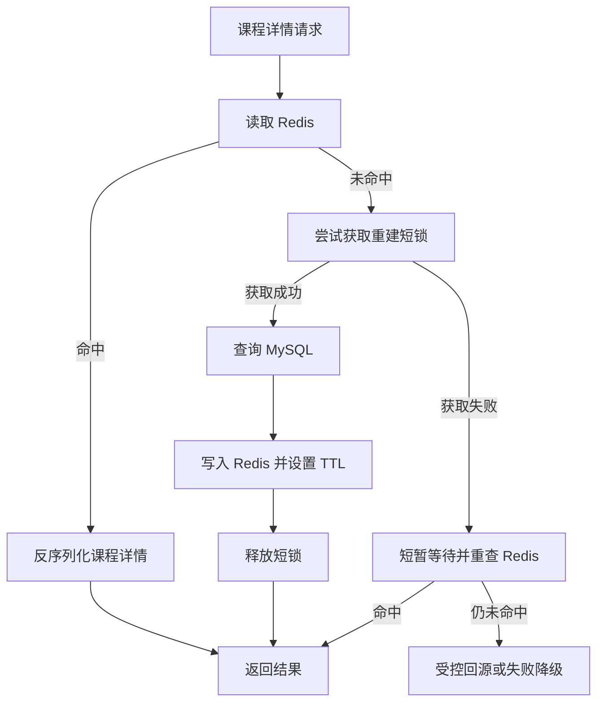
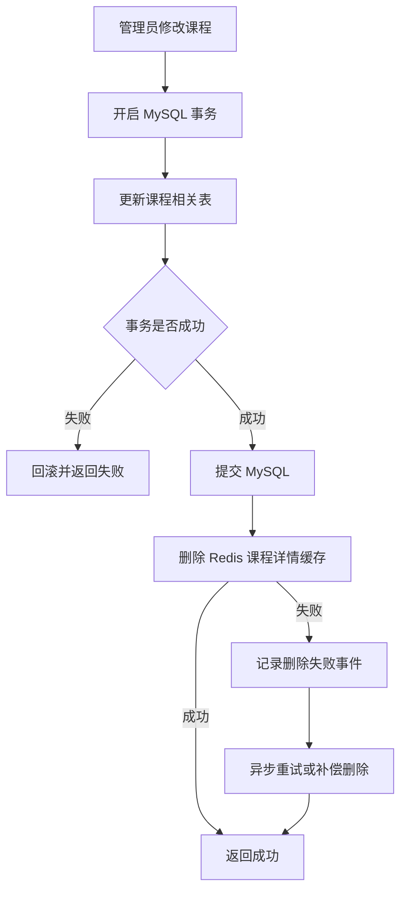
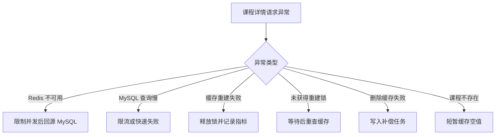
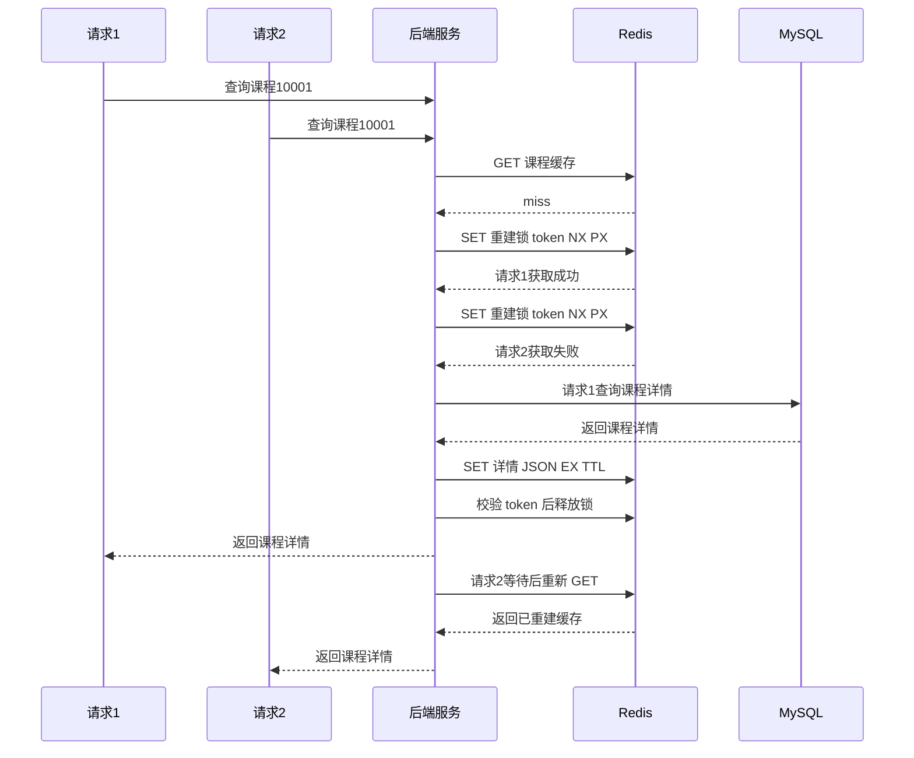

本次学习输入：

```text
知识点：Cache Aside（旁路缓存）
业务场景：课程详情快照缓存
重点关注：缓存一致性与并发击穿
资料基准：Redis Open Source 8.8.0
```

# Redis 知识点：Cache Aside（旁路缓存）

## 1. 一句话结论

> Cache Aside 是由业务服务主动管理缓存的模式：读取时先查 Redis，未命中再查 MySQL 并写回缓存；更新时先更新 MySQL，再删除对应缓存。参考：[Redis 官方 Cache Aside 文档](https://redis.io/docs/latest/develop/use-cases/cache-aside/)
>
> Cache Aside 简单实用，但默认只能提供最终一致性，工程重点是处理缓存删除失败、并发重建和旧数据回写。**标记：主观推断**

---

## 2. 这个知识点是什么？

Cache Aside 不是 Redis 内置的一条命令，而是一种由业务服务控制 Redis 和 MySQL 访问顺序的缓存模式。

它的核心流程是：

```text
读取：
先读 Redis
→ 命中直接返回
→ 未命中读取 MySQL
→ 把结果写入 Redis
→ 返回结果

更新：
先更新 MySQL
→ MySQL 事务提交
→ 删除 Redis 缓存
→ 后续读取重新加载最新数据
```

Redis 官方将其定位为适合读多写少业务的常见缓存用法：应用每次先检查 Redis，未命中时再访问主数据源，并将结果带 TTL 写回 Redis。

---

## 3. 它解决什么业务问题？

以“课程详情接口”为例，详情数据可能需要聚合：

* 课程基本信息
* 讲师信息
* 课程章节统计
* 课程标签
* 运营展示信息

| 业务问题         | 具体表现               | Cache Aside 如何解决          |
| ------------ | ------------------ | ------------------------- |
| 重复查询 MySQL   | 同一门热门课程被反复查询和聚合    | 将聚合结果缓存为课程详情快照            |
| 接口响应慢        | 多表查询、网络往返和数据组装增加延迟 | 命中 Redis 时直接返回完整结果        |
| MySQL 读压力大   | 热门课程的读取量远高于更新量     | 大部分读请求由 Redis 承接          |
| 缓存不需要全量预热    | 大量冷门课程几乎无人访问       | 只缓存真正被访问过的课程              |
| 课程更新后数据可能过期  | Redis 中仍保存旧课程信息    | 更新 MySQL 后删除缓存，由下一次读取重建   |
| 热门缓存失效产生并发回源 | 大量请求同时查询同一课程       | 使用短锁或 singleflight 限制并发重建 |

Redis 官方指出，Cache Aside 只缓存实际被访问的数据，并能按照缓存命中率降低主数据库压力。

---

## 4. Redis 为什么适合？

| Redis 能力       | 对应业务价值                   | 证据 / 标记                                                                                       |
| -------------- | ------------------------ | --------------------------------------------------------------------------------------------- |
| Key-Value 查询   | 可以按 `course_id` 快速定位课程详情 | 参考：[Redis 官方 Cache Aside 文档](https://redis.io/docs/latest/develop/use-cases/cache-aside/)     |
| String 保存 JSON | 可以把课程多表聚合结果保存成完整快照       | **标记：主观推断**                                                                                   |
| `SET EX`       | 写入缓存时同时设置 TTL，避免永久保存旧数据  | 参考：[Redis 官方 SET 文档](https://redis.io/docs/latest/commands/set/)                              |
| `DEL`          | 课程更新后显式删除旧缓存             | 参考：[Redis 官方 Cache Aside 文档](https://redis.io/docs/latest/develop/use-cases/cache-aside/)     |
| `SET NX PX`    | 可以实现带过期时间的缓存重建短锁         | 参考：[Redis 官方分布式锁文档](https://redis.io/docs/latest/develop/clients/patterns/distributed-locks/) |
| Lua / `EVAL`   | 可以原子校验锁持有者并安全释放锁         | 参考：[Redis 官方 SET 文档](https://redis.io/docs/latest/commands/set/)                              |
| TTL 自动过期       | 即使缓存删除失败，旧数据也不会永久存在      | 参考：[Redis 官方 EXPIRE 文档](https://redis.io/docs/latest/commands/expire/)                        |
| 进程间共享          | 多个无状态服务实例可以读取同一份缓存       | 相比单机本地缓存，更容易统一数据。**标记：主观推断**                                                                  |

这里真正匹配课程详情的，不只是“Redis 快”，而是：

1. 课程详情天然可以按 `course_id` 唯一定位。
2. 数据读多写少，缓存收益较高。
3. 聚合结果可以保存成完整 JSON 快照。
4. 缓存失效后可以从 MySQL 重新构建。

**标记：主观推断**

---

## 5. 它的边界是什么？

| 边界              | 说明                                | 更合适的选择                      |
| --------------- | --------------------------------- | --------------------------- |
| 不能保证强一致         | MySQL 更新完成到 Redis 删除完成之间存在短暂旧数据窗口 | 强一致数据直接查 MySQL，或采用更严格的一致性协议 |
| 不适合高频更新数据       | 数据频繁修改会导致缓存不断删除、重建，命中率较低          | 直接查询数据库、写模型优化或专用实时状态存储      |
| Redis 不能作为唯一事实源 | Redis 缓存可能过期、淘汰、丢失或被删除            | MySQL 继续保存课程事实数据            |
| 不适合无限增大的快照      | 课程详情包含大量章节、评论或复杂内容时会形成大 Key       | 拆分缓存，或只缓存课程摘要               |
| 动态强一致字段不宜混入     | 实时价格、库存、剩余名额可能不能接受旧值              | 单独查询或采用更短 TTL、独立 Key        |
| 短锁不等于业务锁        | 缓存重建锁只减少重复回源，不应承担交易正确性            | 关键交易使用数据库约束、事务或专用分布式锁       |
| TTL 不是一致性的主要手段  | TTL 只能限制旧数据最长存在时间，不能及时响应更新        | 更新 MySQL 后主动删除缓存            |

课程标题、封面、讲师介绍等字段通常可以接受短暂旧值；购买价格、上下架状态、剩余名额是否可以接受旧值，需要由业务明确决定。

**标记：主观推断**

---

## 6. 常见坑是什么？

| 常见坑                 | 线上风险                                    | 规避方式                         |
| ------------------- | --------------------------------------- | ---------------------------- |
| 缓存击穿                | 热门课程缓存过期后，大量请求同时查询 MySQL                | 使用短锁或 singleflight，只让一个请求重建  |
| 只使用进程内 singleflight | 单个实例内有效，但多个服务实例仍会同时回源                   | 多实例场景使用 Redis 短锁或其他跨实例协调方式   |
| 先删除缓存，再更新 MySQL     | 删除后并发请求可能读取旧数据库数据，并重新写入缓存               | 先提交 MySQL，再删除 Redis          |
| 更新 MySQL 后删除缓存失败    | Redis 继续返回旧课程详情                         | 重试、Outbox、消息补偿，并保留合理 TTL     |
| 并发读写导致旧数据回写         | 读请求先查询到旧数据，写请求更新并删除缓存后，读请求又把旧数据写回 Redis | 缩短 TTL、加入数据版本校验，必要时使用版本化 Key |
| 大量 Key 同时过期         | 大量课程同时回源，引发缓存雪崩                         | TTL 增加随机抖动                   |
| 查询不存在的课程            | 恶意或异常请求不断穿透到 MySQL                      | 参数校验、短时间缓存空值或布隆过滤器           |
| 锁无过期时间              | 重建服务崩溃后锁永久存在                            | 获取锁时必须设置短 TTL                |
| 直接使用 `DEL` 释放锁      | 可能误删已经被其他请求重新获得的锁                       | 使用唯一 token，并校验 token 后释放     |
| 锁等待时间过长             | 请求大量堆积，接口延迟恶化                           | 短暂等待并重查缓存，超时后限流或受控回源         |

Redis 官方的 Node.js Cache Aside 示例采用短期 Lua 锁：只有获得锁的请求访问主数据源，其他请求短暂等待缓存生成，从而抑制缓存击穿。

### 最容易忽略的并发问题

假设初始课程名称是“Redis 入门”。

```text
1. 请求 A 发现缓存未命中。
2. 请求 A 开始查询 MySQL，查到旧名称“Redis 入门”。
3. 管理员把名称修改为“Redis 工程实践”。
4. 写请求提交 MySQL，并删除 Redis。
5. 请求 A 把之前查到的旧名称写入 Redis。
6. Redis 再次保存了旧数据。
```

这说明“先更新 MySQL，再删除缓存”虽然是推荐的基础做法，但仍不等于严格强一致。

可以按业务风险选择：

1. **普通课程展示数据**：接受短暂旧值，依靠 TTL 最终修复。
2. **更新频率较高的数据**：缓存中携带 `data_version`，写入前校验版本。
3. **重要数据**：使用版本化 Key，例如 `course:detail:{id}:v{version}`。
4. **不能接受旧值的数据**：不要只依赖 Cache Aside。

**标记：主观推断**

---

## 7. MySQL / 本地缓存 / 其他方案是否更合适？

| 方案                | 是否适合        | 原因                                 |
| ----------------- | ----------- | ---------------------------------- |
| 只使用 MySQL         | 不推荐承接全部热点读取 | 实现简单、数据最新，但重复聚合查询会消耗连接和计算资源        |
| Redis Cache Aside | 推荐          | 适合读多写少、可按 ID 查询、允许短暂最终一致的数据        |
| 本地缓存              | 可作为 L1 缓存   | 速度更快，但多个服务实例的数据失效和统一管理更复杂          |
| Read Through      | 可以使用        | 缓存组件封装回源过程，业务代码更简单，但需要成熟的缓存访问层     |
| Write Through     | 通常不作为课程详情首选 | 每次写入同时更新缓存，增加写路径复杂度和失败处理成本         |
| Write Behind      | 不适合课程事实数据   | 异步落库可能丢失更新，不能轻易把 Redis 当作课程事实源     |
| CDN / 网关缓存        | 可用于公开接口     | 适合完整 HTTP 响应缓存，但用户权限、个性化字段和精准失效更复杂 |

Redis 官方也指出，进程内缓存会在多个无状态服务实例之间产生独立预热、重复内存和失效不一致问题。

### 最终选型

课程详情使用：

```text
MySQL：事实源
Redis String：课程详情 JSON 快照
Cache Aside：读写模式
短锁：防止热点课程并发重建
TTL：限制旧数据最长存活时间
补偿任务：处理删除缓存失败
```

这是当前场景中复杂度、性能和一致性风险相对平衡的方案。

**标记：主观推断**

---

## 8. 具体业务场景例子

### 8.1 场景背景

接口：

```text
GET /courses/:course_id
```

课程详情来自以下数据：

```text
course
course_teacher
course_category
course_chapter
course_tag
```

接口返回：

```json
{
  "course_id": 10001,
  "title": "Redis 工程实践",
  "cover_url": "https://example.com/redis.png",
  "teacher": {
    "teacher_id": 201,
    "name": "张老师"
  },
  "chapter_count": 24,
  "tags": ["Redis", "后端架构"],
  "status": "published",
  "updated_at": "2026-07-15T10:00:00Z",
  "data_version": 18
}
```

热门课程可能被频繁访问，但课程信息修改频率较低，因此适合缓存完整查询结果。

**标记：主观推断**

### 8.2 业务问题

不使用 Redis 时，每次请求都要：

1. 查询课程主表。
2. 查询讲师。
3. 查询标签和分类。
4. 统计章节数量。
5. 拼装完整响应。

热门课程的重复请求会执行相同查询和数据组装，浪费 MySQL 连接、CPU 和网络资源。

Cache Aside 让 Redis 承接大部分重复读取；只有首次读取、缓存过期或主动失效后，才重新查询 MySQL。

### 8.3 Redis 设计

```text
Redis key:
course:detail:v1:{course_id}

示例：
course:detail:v1:10001

Redis value:
课程详情完整 JSON 快照

TTL:
基础 TTL 10 分钟
增加 0～120 秒随机抖动

写入命令：
SET course:detail:v1:10001 "{...}" EX 683

重建锁：
lock:course:detail:v1:{course_id}

锁命令：
SET lock:course:detail:v1:10001 {token} NX PX 3000

MySQL:
课程详情唯一事实源

缓存更新策略:
不主动修改 Redis 中的旧 JSON
MySQL 事务提交后删除缓存

删除失败补偿:
记录失败事件
进入重试队列或 Outbox 补偿

降级:
Redis 不可用时受控回源 MySQL
对热点接口启用限流和并发上限
```

TTL、锁时长和随机抖动数值需要根据接口查询耗时、更新频率和流量压测结果调整。

**标记：主观推断**

### 8.4 读流程



说明：

* Cache Aside 读取时先查 Redis，未命中后查询主数据源，再将结果写回 Redis。参考：[Redis 官方 Cache Aside 文档](https://redis.io/docs/latest/develop/use-cases/cache-aside/)
* 热门课程发生缓存 miss 时，只允许一个请求执行主要重建流程。**标记：主观推断**
* 其他请求只进行短暂等待，不能无限阻塞。**标记：主观推断**
* 单进程的 singleflight 只能合并当前进程内的请求，多实例服务需要跨实例协调。**标记：主观推断**
* 如果课程不存在，可以短时间缓存空值，例如 30 秒，避免持续穿透 MySQL。**标记：主观推断**

### 8.5 写流程



说明：

* Redis 官方 Cache Aside 示例采用“更新主数据源，然后删除缓存 Key”的写路径。参考：[Redis 官方 Node.js Cache Aside 示例](https://redis.io/docs/latest/develop/use-cases/cache-aside/nodejs/)
* 必须等 MySQL 事务提交成功后再删除缓存，避免数据库回滚但缓存已经被清理。**标记：主观推断**
* 不推荐先删除缓存再更新 MySQL，因为并发读请求可能重新缓存数据库旧值。**标记：主观推断**
* 默认选择删除缓存而不是直接更新缓存，可以减少多个写请求乱序覆盖的问题。**标记：主观推断**
* Redis 删除失败必须记录并重试，不能只打印普通日志后忽略。**标记：主观推断**
* TTL 是删除失败后的安全兜底，但不能代替删除失败补偿。**标记：主观推断**

### 8.6 异常处理



说明：

* Redis 不可用时不能让所有请求无限制打到 MySQL，应设置回源并发上限。**标记：主观推断**
* MySQL 已经接近容量上限时，宁可对部分非核心请求快速失败，也不能让数据库雪崩。**标记：主观推断**
* 重建锁必须有 TTL，避免服务异常退出后形成永久死锁。参考：[Redis 官方 SET 文档](https://redis.io/docs/latest/commands/set/)
* 释放锁时必须校验唯一 token，防止请求删除其他请求后来获得的锁。参考：[Redis 官方 SET 文档](https://redis.io/docs/latest/commands/set/)
* 课程展示字段可以在明确允许的情况下返回短期旧值，但实时价格、购买资格等字段不能默认返回旧值。**标记：主观推断**
* 缓存重建锁只用于保护 MySQL，不应成为接口正确性的唯一依赖。**标记：主观推断**

### 8.7 监控指标

| 指标                 | 作用                             |
| ------------------ | ------------------------------ |
| `keyspace_hits`    | Redis 查询命中次数                   |
| `keyspace_misses`  | Redis 查询未命中次数                  |
| 缓存命中率              | 判断 Cache Aside 是否真正降低 MySQL 压力 |
| Redis P95 / P99 延迟 | 识别 Redis 网络、慢命令或节点压力           |
| MySQL 回源 QPS       | 判断 miss 是否对数据库造成压力             |
| 课程详情查询 P95 / P99   | 观察整体接口体验                       |
| `expired_keys`     | 判断 TTL 过期频率是否异常                |
| `evicted_keys`     | 判断内存不足是否导致缓存被提前淘汰              |
| `used_memory`      | 监控缓存容量                         |
| 重建锁获取成功次数          | 统计实际缓存重建量                      |
| 重建锁获取失败次数          | 判断热点 Key 并发程度                  |
| 重建等待耗时             | 判断锁竞争是否影响接口延迟                  |
| 缓存删除失败次数           | 监控一致性风险                        |
| 补偿删除积压量            | 判断 Redis 删除补偿是否正常              |
| 空值缓存命中次数           | 发现异常 ID 请求或缓存穿透                |

缓存命中率可按照以下方式计算：

```text
keyspace_hits
-------------------------------------- × 100%
keyspace_hits + keyspace_misses
```

Redis 官方建议结合 `keyspace_hits`、`keyspace_misses`、`evicted_keys` 和 `expired_keys` 判断缓存效果、淘汰情况及 TTL 是否设置合理。

---

## 9. Mermaid 图

前面已经分别展示了读流程、写流程和异常处理，本节只补充最重要的并发击穿过程，避免重复绘图。

### 9.1 并发 miss 与重建短锁



说明：

* 同一门课程对应一个独立重建锁，锁粒度不能覆盖所有课程。**标记：主观推断**
* 获取锁使用 `SET key token NX PX timeout`，确保只有一个请求成功并带自动过期时间。参考：[Redis 官方分布式锁文档](https://redis.io/docs/latest/develop/clients/patterns/distributed-locks/)
* 未获取锁的请求应等待并重查缓存，而不是立刻继续查询 MySQL。参考：[Redis 官方 Node.js Cache Aside 示例](https://redis.io/docs/latest/develop/use-cases/cache-aside/nodejs/)
* 对缓存重建而言，少量重复查询通常只影响性能，不影响课程事实数据，因此短锁可以采用相对轻量的实现。**标记：主观推断**
* 如果锁用于支付、库存扣减等关键正确性场景，则需要采用更严格的锁和数据库约束。**标记：主观推断**

---

## 10. 工程评审关注点

| 关注点                  | 回答方向                                                    |
| -------------------- | ------------------------------------------------------- |
| 为什么使用 Cache Aside？   | 课程详情读多写少、可以按课程 ID 缓存完整快照，并允许短暂最终一致                      |
| 为什么 MySQL 仍是事实源？     | Redis 数据可能过期、淘汰或丢失，课程配置需要可靠持久化                          |
| 为什么更新后删除缓存，而不是更新缓存？  | 删除逻辑更简单，可以减少并发写入乱序覆盖；下一次读取按最新数据库数据重建                    |
| 删除 Redis 失败怎么办？      | 立即重试、记录指标，并通过 Outbox 或异步任务补偿删除                          |
| 并发 miss 怎么保护 MySQL？  | 单实例使用 singleflight，多实例使用按课程 ID 的 Redis 短锁               |
| 获取不到锁怎么办？            | 短暂等待并重查缓存，超时后限流、受控回源或快速失败                               |
| 锁过期但重建未完成怎么办？        | 锁 TTL 应覆盖正常重建耗时，并监控重建 P99；重建写入可增加版本校验                   |
| 怎么防止误释放锁？            | 每次获取锁生成唯一 token，释放时原子校验 token                           |
| TTL 怎么确定？            | 根据课程更新频率、允许旧值时间、缓存容量和数据库回源能力确定                          |
| Redis 挂了怎么办？         | 设置短超时、熔断和 MySQL 回源并发限制，避免 Redis 故障转化为数据库雪崩              |
| 热门课程成为热 Key 怎么办？     | 评估本地 L1 缓存、读副本、Key 拆分或请求合并                              |
| 如何验证方案有效？            | 关注命中率、Redis 延迟、MySQL 回源量、锁竞争、删除失败和接口 P99                |
| Redis 8.8.0 是否有特殊依赖？ | 核心模式使用 `GET`、`SET`、`DEL`、TTL 和可选 Lua，不依赖 Redis 8.8 新增能力 |

---

## 11. 最终记忆点

1. **Cache Aside 的读流程是先查缓存，miss 后查库并写回。**
2. **写流程是先提交 MySQL，再删除 Redis，而不是先删缓存。**
3. **TTL 只能限制旧数据存在时间，不能代替主动失效和失败补偿。**
4. **singleflight 只解决单进程并发，多实例需要跨实例协调。**
5. **缓存重建锁保护的是 MySQL，不应被当成业务强一致锁。**

---

## 12. 参考资料

1. [Redis 官方 Cache Aside 文档](https://redis.io/docs/latest/develop/use-cases/cache-aside/)
   用于确认 Cache Aside 的适用场景、基本读写路径、TTL 和主动失效方式。

2. [Redis 官方 Node.js Cache Aside 示例](https://redis.io/docs/latest/develop/use-cases/cache-aside/nodejs/)
   用于确认缓存命中、未命中、写入失效和并发击穿保护的实现路径。

3. [Redis 官方 SET 文档](https://redis.io/docs/latest/commands/set/)
   用于确认 `SET`、`NX`、`EX`、`PX` 及带 token 的锁实现。

4. [Redis 官方 EXPIRE 文档](https://redis.io/docs/latest/commands/expire/)
   用于确认 Redis Key 的 TTL 和自动删除行为。

5. [Redis 官方 Key Eviction 文档](https://redis.io/docs/latest/develop/reference/eviction/)
   用于确认缓存命中率、`evicted_keys`、`expired_keys` 和内存监控指标。

6. [Redis 8.8 Commands Reference](https://redis.io/docs/latest/commands/redis-8-8-commands/)
   用于确认 Redis 8.8 的命令基准。
