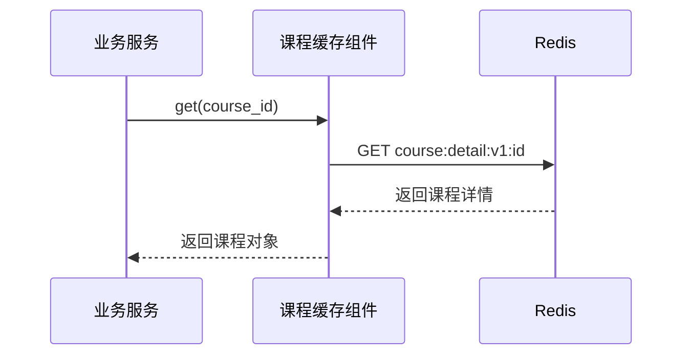
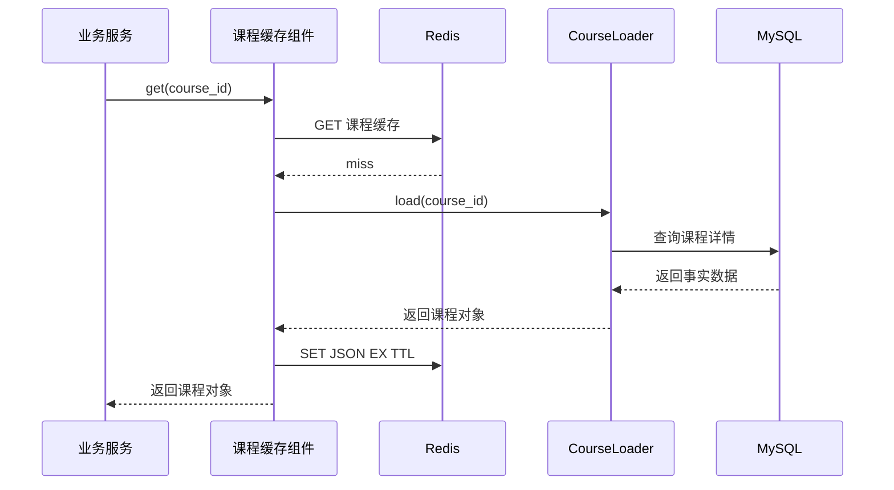
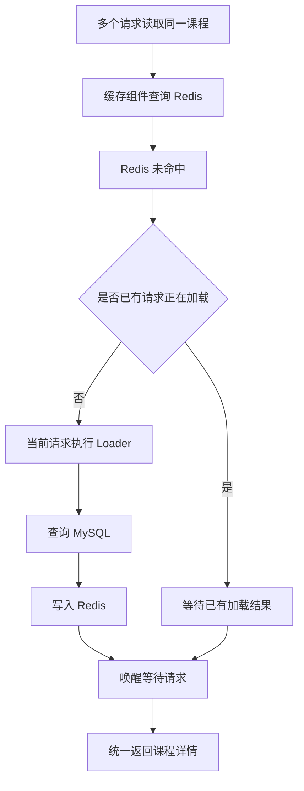
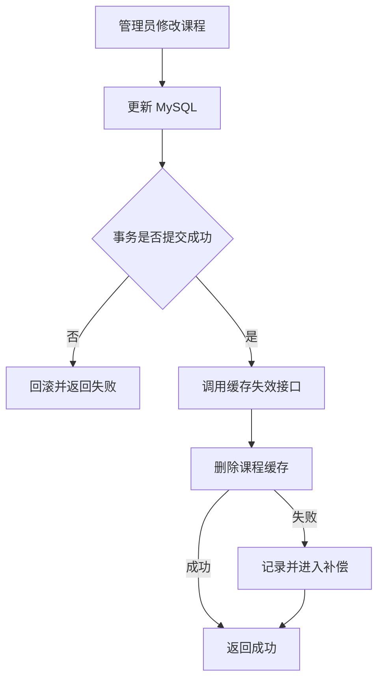
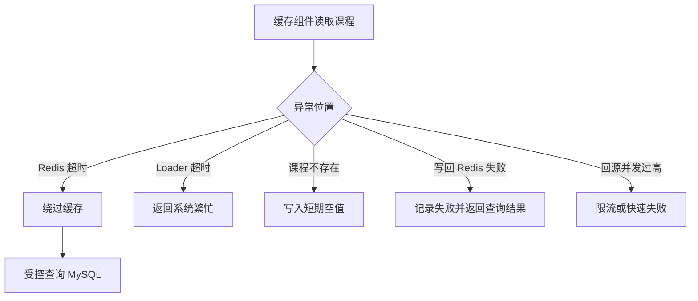

本次学习输入：

```text
知识点：Read Through（读穿透）
业务场景：课程详情统一缓存组件
重点关注：Read Through 与 Cache Aside 的区别及组件边界
资料基准：Redis Open Source 8.8.0
```

# Redis 知识点：Read Through（读穿透）

## 1. 一句话结论

> Read Through 是把“查缓存、未命中回源、写回缓存”统一封装在缓存访问层中，业务代码只向缓存层读取数据，不直接处理 Redis miss 和 MySQL 回源。参考：[Oracle Read-Through 文档](https://docs.oracle.com/en/middleware/standalone/coherence/14.1.1.2206/develop-applications/performing-basic-coherence-jcache-tasks.html)
>
> Read Through 与 Cache Aside 的核心读取路径相同，主要区别不是 Redis 命令，而是缓存逻辑由业务代码负责，还是由统一缓存组件负责。**标记：主观推断**

---

## 2. 这个知识点是什么？

Read Through 是一种缓存读取模式：

```text
业务服务读取数据
→ 调用统一缓存组件
→ 缓存组件读取 Redis
→ Redis 命中则直接返回
→ Redis 未命中则调用 DataLoader 查询 MySQL
→ 缓存组件把结果写入 Redis
→ 返回业务服务
```

业务服务看到的接口可能只有：

```ts
const course = await courseCache.get(courseId);
```

它不需要知道内部执行了：

```text
GET Redis
查询 MySQL
序列化数据
SET Redis
设置 TTL
合并并发请求
缓存空值
```

Read Through 通常需要缓存框架、缓存代理、客户端包装层或自研缓存组件提供加载器机制。Oracle JCache 的 Read Through 通过 `CacheLoader` 自动从外部数据源加载数据；AWS 也使用客户端包装层把缓存逻辑对调用方隐藏。

### 必须先明确的 Redis 边界

**Redis Open Source 8.8.0 本身没有一条叫作 `READ THROUGH` 的命令，也不会在普通 `GET` 未命中后自动连接 MySQL。**

Redis 负责提供 `GET`、`SET`、TTL 等底层缓存能力；MySQL 回源、对象组装和写回缓存，需要由缓存组件、框架或业务代码实现。Redis 8.8 官方命令参考中列出了 Redis 支持的具体命令，但 Read Through 属于架构模式而非独立命令。

Redis 官方存在一份介绍 Read Through 的 RedisGears 示例，但该功能已被明确标记为废弃，不推荐用于新项目，因此不能把它当作 Redis 8.8.0 推荐的原生 Read Through 方案。

---

## 3. 它解决什么业务问题？

以课程详情统一缓存组件为例：

```text
课程首页
搜索结果页
学习页面
订单确认页
后台预览页
```

这些模块都可能需要读取课程基本信息。

| 业务问题      | 具体表现                          | Read Through 如何解决      |
| --------- | ----------------------------- | ---------------------- |
| 缓存代码重复    | 每个模块分别实现 Redis 查询、MySQL 回源和写回 | 缓存组件统一实现读取流程           |
| Key 规则不统一 | 不同模块使用不同课程缓存 Key              | 统一由缓存组件生成 Key          |
| TTL 不统一   | 有的缓存 5 分钟，有的永久不过期             | 缓存组件集中配置 TTL           |
| 击穿治理不统一   | 有的接口加锁，有的接口直接回源               | 统一执行 singleflight 或重建锁 |
| 空值处理不统一   | 不存在的课程被反复查询 MySQL             | 统一缓存短期空值               |
| 监控分散      | 无法统一统计命中率和回源次数                | 缓存组件统一埋点               |
| 业务代码复杂    | Service 同时依赖 Redis 和 MySQL    | Service 只依赖课程缓存接口      |

Read Through 的主要价值不是改变 Redis 的性能，而是把缓存治理从各个业务接口中抽离出来。**标记：主观推断**

---

## 4. Redis 为什么适合？

| Redis 能力       | 对应业务价值               | 证据／标记                                                                                      |
| -------------- | -------------------- | ------------------------------------------------------------------------------------------ |
| `GET`          | 按课程 ID 读取缓存快照        | 参考：[Redis GET 文档](https://redis.io/docs/latest/commands/get/)                              |
| `SET` + TTL    | 回源成功后写入课程详情并限制有效期    | 参考：[Redis SET 文档](https://redis.io/docs/latest/commands/set/)                              |
| `DEL`          | 课程更新后使旧缓存失效          | 参考：[Redis DEL 文档](https://redis.io/docs/latest/commands/del/)                              |
| Key 过期         | 缓存到期后可以重新加载事实数据      | 参考：[Redis EXPIRE 文档](https://redis.io/docs/latest/commands/expire/)                        |
| 共享缓存           | 多个无状态服务实例共享同一份课程详情   | **标记：主观推断**                                                                                |
| 原子 `SET NX PX` | 可用于跨实例缓存重建短锁         | 参考：[Redis分布式锁文档](https://redis.io/docs/latest/develop/clients/patterns/distributed-locks/) |
| 缓存可淘汰          | 数据被淘汰后可以从 MySQL 重新构建 | Redis 官方将缓存数据描述为持久化数据的副本，可在淘汰后重新缓存。                                                        |

Redis 在这个模式里只是缓存存储和并发协调基础设施，真正的 Read Through 语义由上层缓存组件提供。

**标记：主观推断**

---

## 5. Read Through 与 Cache Aside 的区别

### 5.1 核心对比

| 对比项        | Cache Aside            | Read Through      |
| ---------- | ---------------------- | ----------------- |
| 业务调用对象     | 业务代码分别调用 Redis 和 MySQL | 业务代码只调用缓存访问层      |
| 谁判断缓存 miss | 业务 Service             | 缓存组件              |
| 谁查询 MySQL  | 业务 Service             | 缓存组件中的 DataLoader |
| 谁写回 Redis  | 业务 Service             | 缓存组件              |
| 缓存逻辑位置     | 分散在业务代码或公共函数中          | 集中在缓存框架或缓存服务中     |
| 业务侵入性      | 相对较高                   | 相对较低              |
| 实现复杂度      | 初期较低                   | 组件建设成本更高          |
| 定制灵活性      | 单个业务容易定制               | 需要设计扩展接口          |
| 读取底层路径     | Redis miss 后回源数据库      | Redis miss 后回源数据库 |

微软官方指出，当缓存系统本身不提供 Read Through 时，应用可以使用 Cache Aside 模拟相同的按需加载效果。

### 5.2 最本质的区别

```text
Cache Aside：
业务代码知道 Redis 和 MySQL 的存在。

Read Through：
业务代码只知道“从课程缓存组件读取课程”，
组件内部知道 Redis 和 MySQL 的存在。
```

因此，两者的核心区别是**职责边界和抽象层级**，而不是缓存命中后的性能差异。

**标记：主观推断**

### 5.3 一个常见误区

下面这段代码仍然属于 Cache Aside：

```ts
async function getCourseDetail(courseId: number) {
  const cached = await redis.get(`course:detail:${courseId}`);

  if (cached) {
    return JSON.parse(cached);
  }

  const course = await courseRepository.findDetail(courseId);

  await redis.set(
    `course:detail:${courseId}`,
    JSON.stringify(course),
    { EX: 600 },
  );

  return course;
}
```

即使把它放进 `CourseService`，业务代码仍然显式控制缓存读取和数据库回源。

下面这种接口更接近 Read Through：

```ts
const course = await courseCache.get(courseId);
```

`courseCache` 内部注册：

```ts
loader: courseId => courseRepository.findDetail(courseId)
```

但如果所谓“Read Through 组件”只是把上述 Cache Aside 代码移动到一个公共函数中，那么它在运行机制上仍然是封装后的 Cache Aside。

**标记：主观推断**

---

## 6. Read Through 组件的合理边界

### 6.1 缓存组件应该负责

```text
生成 Redis Key
读取 Redis
反序列化
识别缓存 miss
调用 DataLoader
写回 Redis
设置 TTL
缓存空值
请求合并
重建锁
超时控制
缓存指标
异常分类
```

### 6.2 DataLoader 应该负责

```text
查询 MySQL
执行必要的数据聚合
返回标准课程详情对象
区分不存在、查询失败和超时
```

### 6.3 业务 Service 应该负责

```text
权限判断
业务规则
参数校验
业务错误转换
决定是否允许使用缓存
决定强一致读取场景
```

### 6.4 缓存组件不应该负责

| 不合理职责        | 原因                   |
| ------------ | -------------------- |
| 判断用户是否能购买课程  | 属于业务规则               |
| 扣减课程库存       | 属于强一致交易              |
| 开启复杂业务事务     | 缓存层不应控制业务事务          |
| 吞掉所有数据库错误    | 会把系统故障误判为数据不存在       |
| 自动缓存所有查询     | 可能产生低命中率、大 Key 和数据泄漏 |
| 根据用户身份拼装权限数据 | 容易导致缓存数据越权共享         |

缓存组件应解决通用缓存问题，不能演变成承载所有业务逻辑的“超级 Service”。

**标记：主观推断**

---

## 7. 它的边界是什么？

| 边界                 | 说明                          | 更合适的选择                |
| ------------------ | --------------------------- | --------------------- |
| Redis 不会自动回源 MySQL | Redis OSS 不认识课程表和查询语句       | 自研组件、框架 CacheLoader   |
| 主要解决读取路径           | Read Through 本身没有完整定义数据更新策略 | 配合缓存失效或 Write Through |
| 不能天然保证强一致          | MySQL 更新和缓存失效之间仍有时间窗口       | 强一致读取直接查询 MySQL       |
| Loader 可能成为隐式依赖    | 一次简单的 `get` 可能触发慢 SQL       | 设置超时、监控和清晰接口语义        |
| 通用组件难覆盖所有业务        | 不同数据的 TTL、空值、降级策略不同         | 支持按缓存模型配置策略           |
| 不适合高频变化数据          | 频繁失效和重建会降低收益                | 直接查库或使用其他数据模型         |
| 不适合超大对象            | 完整课程内容可能形成大 Key             | 拆成摘要、章节或分页缓存          |
| 不能缓存敏感上下文错误        | 未把用户维度放进 Key 可能导致越权         | 不缓存或设计完整隔离 Key        |

---

## 8. 常见坑是什么？

| 常见坑                    | 线上风险                  | 规避方式                              |
| ---------------------- | --------------------- | --------------------------------- |
| 把数据库异常当作数据不存在          | MySQL 故障时缓存大量空值       | Loader 必须区分 `not_found` 与 `error` |
| Loader 没有超时            | 一个缓存 miss 长时间占用请求     | 设置数据库查询超时                         |
| 多实例同时回源                | 热门课程过期后击穿 MySQL       | Redis 短锁或跨实例请求合并                  |
| 组件吞掉异常                 | 业务看到空数据，无法发现系统故障      | 定义明确错误类型并记录指标                     |
| 通用 TTL 写死              | 所有数据使用同一 TTL          | 按缓存模型配置 TTL                       |
| Key 没有版本               | 数据结构升级后旧 JSON 无法解析    | 使用 `course:detail:v2:{id}`        |
| Loader 返回用户个性化数据       | 公共 Key 可能向其他用户泄漏数据    | 公共数据与用户数据分离                       |
| 缓存层自动重试过多              | Redis 或 MySQL 故障时放大流量 | 限制重试次数并使用退避                       |
| 未限制回源并发                | Redis 故障后所有请求转向 MySQL | 熔断、限流和回源并发上限                      |
| 将 Read Through 当作强一致方案 | 用户读取到短暂旧课程数据          | 明确最终一致边界                          |

### 最危险的隐藏行为

业务代码看起来只有：

```ts
await courseCache.get(courseId);
```

但一次调用可能执行：

```text
Redis GET
→ 获取分布式锁
→ MySQL 多表查询
→ JSON 序列化
→ Redis SET
→ 释放锁
```

因此，Read Through 虽然降低了业务代码复杂度，却可能隐藏真实延迟和外部依赖。

缓存组件必须监控：

* Redis 命中耗时
* Loader 执行耗时
* 等待重建耗时
* 总调用耗时
* 回源失败原因

**标记：主观推断**

---

## 9. 具体业务场景例子

### 9.1 场景背景

业务层需要读取课程详情：

```ts
const course = await courseDetailCache.get(courseId);
```

统一缓存组件定义：

```ts
interface ReadThroughCache<K, V> {
  get(key: K): Promise<V | null>;
}
```

课程缓存注册以下配置：

```text
Key 前缀：course:detail:v1
TTL：10 分钟 + 随机抖动
空值 TTL：30 秒
Loader：courseRepository.findDetail
事实源：MySQL
缓存介质：Redis String
并发控制：单实例 singleflight + 可选 Redis 短锁
```

### 9.2 Redis 设计

```text
Redis key:
course:detail:v1:{course_id}

Redis value:
课程详情 JSON 快照

正常 TTL:
600～720 秒

空值:
使用明确的特殊值表示课程不存在

空值 TTL:
30 秒

MySQL:
课程详情唯一事实源

更新策略:
MySQL 事务提交后删除缓存

Redis 故障:
绕过缓存并受控查询 MySQL
```

具体 TTL 必须根据课程更新频率、允许旧数据时间、Redis 容量和 MySQL 回源能力确定。

**标记：主观推断**

### 9.3 Redis 命中流程



说明：

* 业务服务只调用课程缓存组件，不直接调用 Redis。**标记：主观推断**
* Redis 命中时不会执行 DataLoader，也不会访问 MySQL。**标记：主观推断**
* 缓存组件负责反序列化、格式校验和命中指标记录。**标记：主观推断**

### 9.4 Redis 未命中与回源流程



说明：

* Read Through 的特征是缓存组件在 miss 后自动调用 Loader，调用方不参与回源。Oracle JCache 将其描述为缓存自动从外部资源加载条目。
* Loader 必须只返回事实数据，不能把数据库异常转换成“课程不存在”。**标记：主观推断**
* 缓存写入失败时，通常仍可向业务返回已经查询到的 MySQL 结果。**标记：主观推断**
* 是否允许缓存写入失败后返回结果，应根据业务正确性要求确定。**标记：主观推断**

### 9.5 并发 miss 流程



说明：

* 单实例可以使用 singleflight 合并相同 Key 的并发加载。**标记：主观推断**
* 多实例环境中，进程内 singleflight 无法阻止其他实例同时回源。**标记：主观推断**
* 热点课程需要时可以增加按课程 ID 的 Redis 重建短锁。**标记：主观推断**
* 缓存组件不应让等待请求无限阻塞，必须设置等待超时。**标记：主观推断**

### 9.6 写流程

Read Through 只定义读取行为，课程修改仍需单独设计写路径：



说明：

* Read Through 并不自动等于 Write Through；读取模式和写入模式必须分别设计。**标记：主观推断**
* 当前案例仍采用“先提交 MySQL，再删除缓存”的失效策略。**标记：主观推断**
* 下一次读取发生 miss 后，由 Read Through 组件重新加载最新数据。**标记：主观推断**
* TTL 只能作为删除失败后的兜底，不能代替缓存删除补偿。**标记：主观推断**

### 9.7 异常处理



说明：

* Redis 故障时必须限制 MySQL 回源并发，避免缓存故障演变成数据库雪崩。**标记：主观推断**
* 只有明确的 `not_found` 才能写入空值缓存。**标记：主观推断**
* MySQL 超时、连接失败和 SQL 错误不能缓存为空值。**标记：主观推断**
* Redis 写回失败通常不影响本次事实数据读取，但必须记录指标。**标记：主观推断**
* 对价格、购买资格等不能接受旧值的数据，不应直接复用课程展示缓存。**标记：主观推断**

---

## 10. 监控指标

| 指标                | 作用              |
| ----------------- | --------------- |
| Read Through 调用次数 | 统计缓存组件总读取量      |
| Redis 命中率         | 判断缓存实际收益        |
| Loader 调用次数       | 统计 MySQL 回源量    |
| Loader P95／P99    | 观察缓存 miss 的真实代价 |
| 缓存组件总 P95／P99     | 观察业务实际感知延迟      |
| singleflight 合并次数 | 判断单实例并发 miss 程度 |
| Redis 短锁竞争次数      | 判断跨实例热点程度       |
| 空值缓存命中次数          | 识别异常 ID 或穿透攻击   |
| Redis 读取失败次数      | 判断缓存基础设施稳定性     |
| Redis 写回失败次数      | 发现缓存无法正常重建      |
| Loader 错误分类       | 区分不存在、超时和数据库故障  |
| MySQL 回源 QPS      | 防止缓存失效导致数据库过载   |
| `evicted_keys`    | 判断内存不足导致的缓存淘汰   |
| `expired_keys`    | 观察 TTL 到期规模     |

Redis 官方建议结合缓存命中、未命中、过期和淘汰指标判断缓存效果及容量问题。

---

## 11. 工程评审关注点

| 关注点                        | 回答方向                                                   |
| -------------------------- | ------------------------------------------------------ |
| Redis 是否原生支持 Read Through？ | 不支持普通 `GET` 自动访问 MySQL，需要框架或自研组件实现                     |
| 与 Cache Aside 有什么不同？       | 底层读取路径类似，核心区别是缓存职责位于业务代码还是统一缓存层                        |
| 是否只是封装后的 Cache Aside？      | 很多工程实现本质如此；只有形成统一 Loader、策略、监控和治理能力后，组件化才有明显价值         |
| 为什么需要统一缓存组件？               | 避免 Key、TTL、回源、击穿和监控逻辑散落在业务模块                           |
| 组件会不会过度设计？                 | 缓存场景少时公共 helper 即可；大量模型重复使用时才值得建设通用组件                  |
| Loader 失败怎么办？              | 区分不存在和系统故障，系统故障不能缓存为空值                                 |
| Read Through 如何保证一致性？      | 它主要解决读取，一致性仍依赖写后失效、TTL 和补偿机制                           |
| 如何防止缓存击穿？                  | 单实例请求合并，多实例按需要增加 Redis 短锁                              |
| Redis 挂了怎么办？               | 短超时、熔断、回源并发限制和 MySQL 保护                                |
| 如何避免缓存越权？                  | 公共数据和用户数据分离，Key 必须包含完整隔离维度                             |
| 是否所有查询都接入？                 | 只缓存高频、重复、可接受最终一致且重建成本较高的数据                             |
| Redis 8.8.0 有特殊能力吗？        | 当前设计只依赖通用 Redis 命令，不依赖 Redis 8.8 新增的专有 Read Through 能力 |

---

## 12. 最终记忆点

1. **Read Through 是缓存访问层模式，不是 Redis 的一条命令。**
2. **它与 Cache Aside 的核心区别是由谁负责 miss、回源和写回。**
3. **Read Through 主要解决读路径，写入一致性仍需单独设计。**
4. **统一组件必须区分数据不存在和数据源故障。**
5. **封装只有同时统一策略、治理和监控时，才不只是移动代码。**

---

## 13. 参考资料

1. [Redis 8.8 Commands Reference](https://redis.io/docs/latest/commands/)
   用于确认 Redis 8.8.0 支持的命令能力，以及 Read Through 并非独立 Redis 命令。

2. [Redis 官方 Cache Aside 文档](https://redis.io/docs/latest/develop/use-cases/cache-aside/)
   用于对比 Cache Aside 中应用主动读取缓存、回源和写回的路径。

3. [Oracle JCache Read Through 文档](https://docs.oracle.com/en/middleware/standalone/coherence/14.1.1.2206/develop-applications/performing-basic-coherence-jcache-tasks.html)
   用于确认 Read Through 通过 CacheLoader 自动从外部数据源加载数据。

4. [AWS Read-Through Wrapper Design](https://docs.aws.amazon.com/prescriptive-guidance/latest/dynamodb-elasticache-integration/wrapper-design.html)
   用于确认可以通过客户端包装层隐藏缓存逻辑，对调用方提供统一接口。

5. [Microsoft Cache-Aside Pattern](https://learn.microsoft.com/en-us/azure/architecture/patterns/cache-aside)
   用于确认不具备原生 Read Through 能力时，应用可以使用 Cache Aside 模拟按需加载行为。

6. [RedisGears Read-Through 示例](https://redis.io/docs/latest/operate/oss_and_stack/stack-with-enterprise/deprecated-features/gears-v1/jvm/recipes/write-behind/)
   用于说明 Redis 曾提供相关集成示例，但该 RedisGears 能力已经废弃，不推荐新项目使用。
