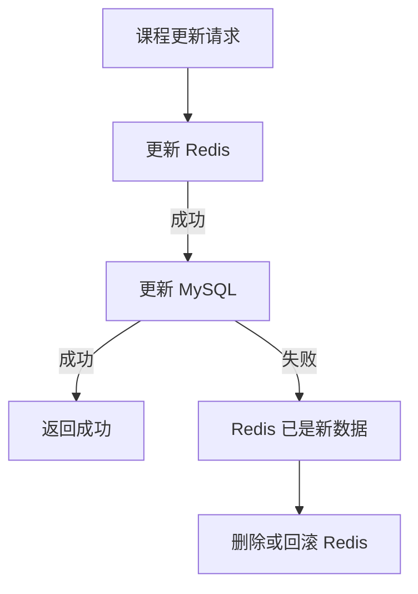
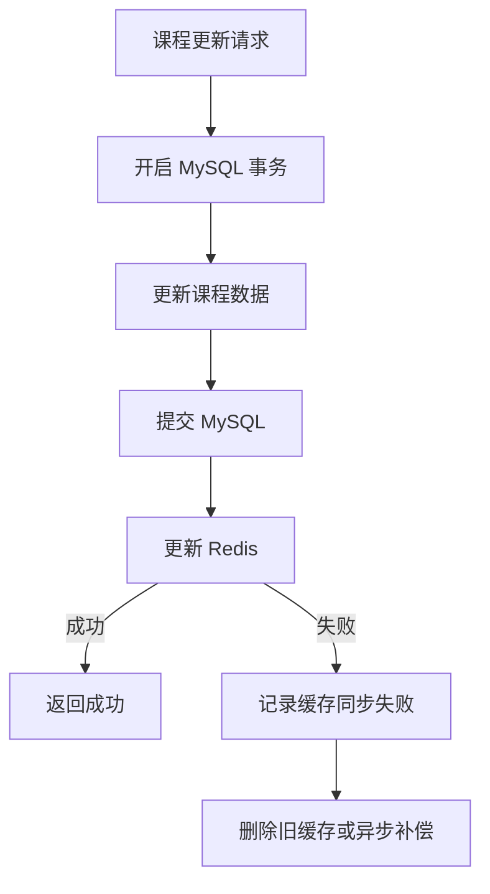
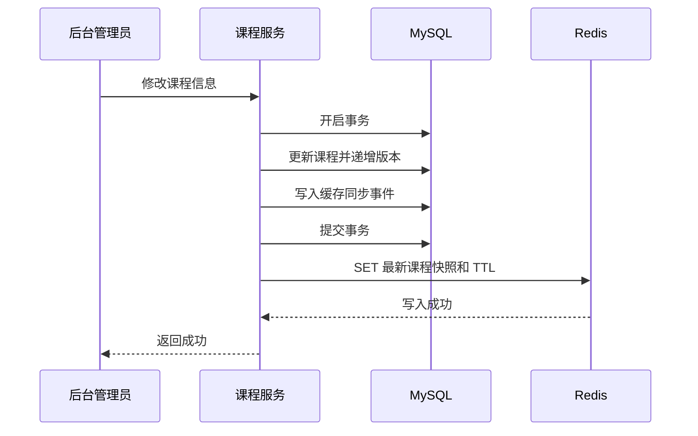
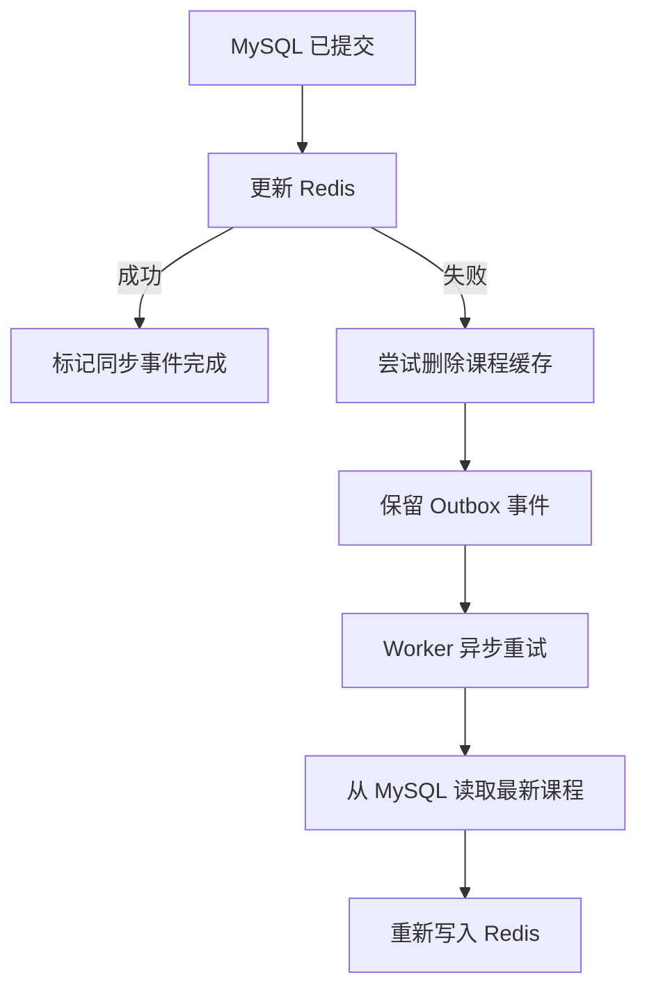
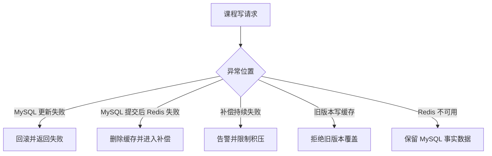

本次学习输入：

```text
知识点：Write Through（写穿透）
业务场景：课程基础信息统一写入
重点关注：MySQL 与 Redis 同步双写的一致性和失败处理
资料基准：Redis Open Source 8.8.0
```

# Redis 知识点：Write Through（写穿透）

## 1. 一句话结论

> Write Through 是业务只调用统一写入层，由该层同步更新缓存和后端数据库，通常等两个存储都处理完成后才结束本次写入。参考：[Redis 官方缓存解决方案](https://redis.io/solutions/caching/)
>
> 普通 Redis 与 MySQL 无法通过 Redis `MULTI/EXEC` 实现跨存储原子提交，因此 Write Through 的核心难点不是“同时写两次”，而是处理一边成功、另一边失败。**标记：主观推断**

---

## 2. 这个知识点是什么？

Write Through 是一种同步写缓存模式：

```text
业务服务
→ 调用统一写入组件
→ 写入后端数据库
→ 同步更新缓存
→ 两步处理完成
→ 返回写入结果
```

从业务层看，通常只有一个写入口：

```ts
await courseStore.update(courseId, input);
```

业务层不分别调用：

```ts
await mysql.update(...);
await redis.set(...);
```

而是由 `courseStore` 或缓存框架统一处理 MySQL 和 Redis。

Redis 官方对 Write Through 的描述是：缓存层位于应用与后端数据存储之间，更新同步经过缓存并流向数据库。Oracle JCache 则通过 `CacheWriter` 将缓存写入同步传递给外部数据源。

### Redis 8.8.0 的能力边界

**Write Through 不是 Redis Open Source 8.8.0 的一条命令。**

Redis 8.8.0 提供的是 `SET`、`GET`、`DEL`、`MULTI`、`EXEC` 等底层命令；谁负责访问 MySQL、以什么顺序双写、失败后如何补偿，需要由缓存框架、数据访问层或业务系统实现。参考：[Redis 8.8 命令参考](https://redis.io/docs/latest/commands/)

Redis 官方曾提供基于 RedisGears 的 Read Through、Write Through 和 Write Behind 示例，但 RedisGears 已被标记为废弃能力，不建议新项目把它作为 Redis 8.8.0 的标准实现方案。

---

## 3. 它解决什么业务问题？

以“管理员修改课程基础信息”为例：

```text
课程标题
课程封面
课程简介
讲师信息
课程标签
课程展示状态
```

这些信息写入 MySQL 后，又需要被前台高频读取。

| 业务问题      | 具体表现                    | Write Through 如何解决 |
| --------- | ----------------------- | ------------------ |
| 写入逻辑分散    | 不同接口分别更新 MySQL 和 Redis  | 统一通过课程写入组件处理       |
| 缓存更新遗漏    | 新增写接口时忘记处理 Redis        | 写入组件默认执行缓存同步       |
| 更新后首次读取较慢 | 删除缓存后，下一个请求需要回源重建       | 写入完成时直接准备好新缓存      |
| 多个服务写法不一致 | 不同服务的 Key、TTL、JSON 格式不同 | 统一缓存模型和写入协议        |
| 缓存短期返回旧值  | MySQL 已更新，Redis 仍保存旧数据  | 写入流程同步更新缓存         |
| 双写失败难处理   | MySQL 和 Redis 可能只有一个成功  | 统一组件集中处理重试、补偿和监控   |

Write Through 的主要价值，是把双写规则集中到统一基础设施中，并使成功写入后的缓存尽快保持最新。

**标记：主观推断**

---

## 4. Redis 为什么适合？

| Redis 能力     | 对应业务价值                          | 证据／标记                                                                              |
| ------------ | ------------------------------- | ---------------------------------------------------------------------------------- |
| `SET`        | 将最新课程快照写入 Redis                 | 参考：[Redis SET 文档](https://redis.io/docs/latest/commands/set/)                      |
| TTL          | 防止长期保存无人访问或未及时修复的数据             | 参考：[Redis SET 文档](https://redis.io/docs/latest/commands/set/)                      |
| `DEL`        | 写入失败或数据不确定时主动清除缓存               | 参考：[Redis DEL 文档](https://redis.io/docs/latest/commands/del/)                      |
| `MULTI/EXEC` | 可以原子执行同一个 Redis 实例中的多条 Redis 命令 | 参考：[Redis 事务文档](https://redis.io/docs/latest/develop/using-commands/transactions/) |
| 共享缓存         | 多个服务实例可以立即读取统一课程快照              | **标记：主观推断**                                                                        |
| Key 版本       | 数据格式升级时隔离旧缓存结构                  | **标记：主观推断**                                                                        |

需要注意：

```text
Redis MULTI/EXEC：
只能控制 Redis 内的命令。

MySQL 事务：
只能控制 MySQL 内的 SQL。

两者不能直接合并成一个普通本地事务。
```

Redis 事务保证 Redis 命令按顺序执行且中间不被其他客户端插入；MySQL XA 用于让支持 XA 的多个事务资源参加全局事务。普通 Redis `MULTI/EXEC` 并不会自动成为 MySQL XA 事务参与者。

---

## 5. Write Through 与常见“同步双写”的区别

### 5.1 严格意义的 Write Through

```text
业务服务
→ 只写缓存访问层
→ 缓存访问层调用后端数据库 Writer
→ 同步完成数据库和缓存处理
```

业务服务并不知道底层存在两个存储。

### 5.2 常见的应用层同步双写

```text
业务服务
→ 写 MySQL
→ 写 Redis
```

这种方案经常也被叫作 Write Through，但更准确地说，是由应用实现的同步双写。

### 5.3 核心区别

| 对比项    | 严格 Write Through | 应用层同步双写       |
| ------ | ---------------- | ------------- |
| 业务写入口  | 缓存或统一数据访问层       | 业务 Service    |
| 谁连接数据库 | Cache Writer     | 业务 Repository |
| 谁处理一致性 | 缓存框架或统一组件        | 每个业务写流程       |
| 业务侵入性  | 较低               | 较高            |
| 建设成本   | 较高               | 初期较低          |
| 运行风险   | 由组件集中治理          | 容易分散和遗漏       |

无论采用哪种实现，只要 Redis 与 MySQL 是两个独立系统，就必须处理部分成功问题。

**标记：主观推断**

---

## 6. 双写顺序与失败结果

### 6.1 方案一：先写 Redis，再写 MySQL



最大问题：

```text
Redis 成功
MySQL 失败
```

这时 Redis 保存的是数据库中并不存在的新状态。

如果前台以 Redis 作为读取入口，用户可能看到未正式提交的数据。

**结论：当 MySQL 是事实源时，通常不推荐先写 Redis。标记：主观推断**

---

### 6.2 方案二：先写 MySQL，再写 Redis



可能出现：

```text
MySQL 成功
Redis 失败
```

这时事实数据已经正确，但缓存可能还是旧数据。

相较于“Redis 新、MySQL 旧”，这种结果通常更容易恢复，因为可以重新从 MySQL 构建 Redis。

**结论：MySQL 作为事实源时，更推荐先提交 MySQL，再更新 Redis。标记：主观推断**

---

### 6.3 两种顺序都不能解决原子性

| 执行顺序          | 失败场景              | 结果                            |
| ------------- | ----------------- | ----------------------------- |
| Redis → MySQL | Redis 成功，MySQL 失败 | 缓存出现数据库不存在的数据                 |
| MySQL → Redis | MySQL 成功，Redis 失败 | 缓存暂时缺失或保存旧数据                  |
| 并行双写          | 一边成功，一边失败         | 状态更难判断，顺序不可控                  |
| 分布式事务         | 协调两个资源提交          | 实现和运维成本高，Redis OSS 通常不直接参与 XA |

因此，普通双写不能通过“调整先后顺序”完全解决一致性，只能选择更容易恢复的失败方向。

**标记：主观推断**

---

## 7. 推荐的工程实现

### 7.1 课程数据的事实源

```text
MySQL：唯一事实源
Redis：课程读取快照
```

课程标题、状态、讲师关系等数据最终以 MySQL 为准。

### 7.2 推荐写入顺序

```text
1. 开启 MySQL 事务
2. 更新课程相关表
3. 递增 data_version
4. 同一事务写入缓存同步事件
5. 提交 MySQL
6. 同步尝试更新 Redis
7. Redis 失败时保留补偿事件
```

这里的“缓存同步事件”可以放在 MySQL Outbox 表中，使业务数据和补偿任务在同一个 MySQL 事务中提交。

**标记：主观推断**

### 7.3 两种返回策略

#### 策略 A：严格同步成功

```text
MySQL 成功 + Redis 成功
→ 接口返回成功

MySQL 成功 + Redis 失败
→ 接口返回缓存同步失败
```

问题是：虽然接口返回失败，但 MySQL 实际已经成功，客户端重试必须具有幂等性。

这种策略更接近严格 Write Through，但调用方容易产生“接口失败等于数据没写入”的误解。

**标记：主观推断**

#### 策略 B：事实写入优先

```text
MySQL 成功
→ 业务写入视为成功

Redis 成功
→ 正常结束

Redis 失败
→ 删除缓存或进入补偿
```

这种方案允许短暂不一致，但更符合“MySQL 是事实源”的常规业务系统。

严格来说，它是“同步更新缓存并带异步修复”的工程折中，不是绝对同步成功的 Write Through。

**标记：主观推断**

### 7.4 当前课程场景建议

课程标题、封面、简介等普通展示信息通常可以接受短暂缓存延迟，因此建议采用：

```text
MySQL 提交成功 = 业务成功
Redis 同步更新 = 尽力完成
更新失败 = 删除旧缓存 + Outbox 补偿
```

对于课程价格、购买资格、剩余名额等关键字段，不应简单混入普通课程快照。

**标记：主观推断**

---

## 8. 具体业务场景例子

### 8.1 场景背景

后台接口：

```text
PUT /admin/courses/:course_id
```

更新内容：

```json
{
  "title": "Redis 工程实践",
  "cover_url": "https://example.com/redis.png",
  "teacher_id": 201,
  "status": "published"
}
```

前台接口：

```text
GET /courses/:course_id
```

前台高频读取 Redis 中的课程详情快照。

### 8.2 Redis 设计

```text
Redis key:
course:detail:v1:{course_id}

示例：
course:detail:v1:10001

Redis value:
课程详情完整 JSON 快照

关键字段:
course_id
title
cover_url
teacher
status
data_version
updated_at

TTL:
30 分钟 + 随机抖动

MySQL:
课程基础信息唯一事实源

写入组件:
courseWriteStore.update()

失败补偿:
MySQL Outbox + Worker 重试

兜底:
无法确认缓存内容正确时，优先删除缓存
```

TTL 和补偿重试策略需要根据课程修改频率、缓存容量及允许旧值时间确定。

**标记：主观推断**

---

### 8.3 正常写入流程



说明：

* MySQL 事务先保证课程事实数据完整提交。**标记：主观推断**
* Redis 使用 `SET` 保存新的课程详情快照和 TTL。参考：[Redis SET 文档](https://redis.io/docs/latest/commands/set/)
* 缓存中的 `data_version` 应与 MySQL 课程版本一致。**标记：主观推断**
* 缓存同步事件用于处理 Redis 写入失败，不是替代正常同步写入。**标记：主观推断**

---

### 8.4 Redis 写入失败流程



说明：

* MySQL 提交后不能因为 Redis 失败而简单回滚业务数据。**标记：主观推断**
* Redis 内容无法确认时，删除缓存通常比保留旧值更安全。`DEL` 可以删除指定缓存 Key。参考：[Redis DEL 文档](https://redis.io/docs/latest/commands/del/)
* Worker 补偿时应重新查询 MySQL，不能直接使用可能已经过期的原始请求数据。**标记：主观推断**
* 补偿任务必须幂等，多次执行同一版本不能产生错误结果。**标记：主观推断**

---

### 8.5 并发更新流程

假设两个管理员同时修改同一门课程：

```text
请求 A：版本 18 → 修改标题
请求 B：版本 18 → 修改封面
```

如果不做并发控制，可能发生：

```text
MySQL 最终版本：20
Redis 最后写入：版本 19
```

旧请求可能在新请求之后完成 Redis 写入，导致旧缓存覆盖新缓存。

推荐使用数据库乐观锁：

```sql
UPDATE course
SET
    title = ?,
    data_version = data_version + 1
WHERE
    course_id = ?
    AND data_version = ?;
```

同时，缓存写入前比较版本：

```text
只有新版本 >= 当前缓存版本时才允许覆盖。
```

版本比较和条件写入可以通过 Lua 或 Redis Function 原子处理；具体实现属于上层业务逻辑，而不是 Write Through 自动提供的能力。

**标记：主观推断**

---

### 8.6 异常处理



说明：

* MySQL 失败时不能继续更新 Redis。**标记：主观推断**
* Redis 失败不能导致课程事实数据被覆盖或丢失。**标记：主观推断**
* 补偿任务应设置最大重试间隔、死信状态和人工告警。**标记：主观推断**
* 对普通课程展示数据，可以临时回源 MySQL；对高并发接口需要限制回源并发。**标记：主观推断**
* 不确定 Redis 数据是否正确时，应删除缓存或拒绝使用，而不是盲目返回。**标记：主观推断**

---

## 9. 常见坑是什么？

| 常见坑                   | 线上风险              | 规避方式                |
| --------------------- | ----------------- | ------------------- |
| 认为双写等于原子提交            | 一边成功、一边失败后状态不一致   | 明确事实源和补偿策略          |
| 先写 Redis              | MySQL 失败后缓存出现无效数据 | MySQL 事实源场景优先写库     |
| MySQL 成功、Redis 失败仍无补偿 | 长期返回旧缓存           | 删除缓存、Outbox 补偿      |
| 接口失败但 MySQL 已提交       | 客户端重复提交           | 幂等键和版本控制            |
| 并发写乱序                 | 旧请求覆盖新缓存          | `data_version` 校验   |
| 所有写入都进入缓存             | 冷门课程占用大量 Redis 内存 | 按访问价值选择是否缓存         |
| TTL 永久不过期             | 补偿失败后旧数据长期存在      | 设置合理 TTL            |
| 把数据库异常当成缓存问题          | 重试持续压垮数据库         | 区分 MySQL 和 Redis 错误 |
| Redis 重试无限循环          | 故障期间放大写入压力        | 限次重试、退避和熔断          |
| 缓存对象包含强一致字段           | 用户读取到旧价格或旧资格      | 强一致字段拆分查询           |

AWS 指出，Write Through 会把不常访问的数据也写入缓存，可能造成更大的缓存空间和成本，因此通常需要结合 TTL 或按需加载策略。

---

## 10. 与其他缓存模式对比

| 模式            | 写入方式          | 一致性特点          | 课程基础信息适用性    |
| ------------- | ------------- | -------------- | ------------ |
| Cache Aside   | 写 MySQL 后删除缓存 | 短暂旧值，下一次读取重建   | 通常最简单、最实用    |
| Read Through  | 主要统一读取回源      | 写入策略仍需单独设计     | 可与其他写模式组合    |
| Write Through | 同步写数据库和缓存     | 成功后缓存通常是热的     | 适合统一写组件成熟的场景 |
| Write Behind  | 先写缓存，异步落库     | 写延迟低，但数据可靠性更复杂 | 不适合普通课程事实数据  |

### 当前场景的客观判断

如果公司只有少量课程写接口，且课程信息更新频率不高：

```text
Cache Aside：
更新 MySQL
→ 删除 Redis
```

通常比建设完整 Write Through 组件更简单。

当大量业务模型都需要统一双写、版本控制、补偿和监控时，Write Through 组件才更有建设价值。

**标记：主观推断**

---

## 11. 工程评审关注点

| 关注点                          | 回答方向                                            |
| ---------------------------- | ----------------------------------------------- |
| Write Through 是 Redis 原生命令吗？ | 不是，是缓存架构模式，需要框架或统一写入组件实现                        |
| 业务到底写 Redis 还是写 MySQL？       | 严格模式写统一缓存层；当前工程实现由统一写组件协调两个存储                   |
| 为什么先写 MySQL？                 | MySQL 是事实源，Redis 失败后可以重建                        |
| 两边能否原子提交？                    | 普通 Redis 事务不能包含 MySQL SQL，默认不能                  |
| Redis 写失败后接口算成功吗？            | 必须明确严格失败或事实写入优先策略                               |
| 返回失败但 MySQL 已成功怎么办？          | 接口幂等，并向客户端返回可识别的最终状态                            |
| 如何防止旧缓存覆盖新缓存？                | 数据版本号、条件写入或 Lua 版本判断                            |
| 为什么需要 Outbox？                | 让业务更新与缓存补偿事件在同一 MySQL 事务提交                      |
| Redis 挂了是否阻止课程更新？            | 普通展示数据通常不阻止 MySQL 更新，但必须补偿                      |
| 是否所有课程都写缓存？                  | 不一定，Write Through 容易缓存大量冷数据                     |
| 为什么不用 Cache Aside？           | 场景简单时 Cache Aside 更合适；统一治理需求高时再考虑 Write Through |
| 如何验证一致性？                     | 监控双写成功率、版本差异、补偿积压和旧版本拒绝次数                       |

---

## 12. 监控指标

| 指标                  | 作用                      |
| ------------------- | ----------------------- |
| MySQL 更新成功次数        | 业务事实写入量                 |
| Redis 同步写成功次数       | 正常 Write Through 完成量    |
| Redis 同步写失败次数       | 双写不一致风险                 |
| 双写整体成功率             | 判断 Write Through 稳定性    |
| MySQL 与 Redis 版本差异数 | 直接识别缓存落后                |
| Outbox 待处理数量        | 判断补偿是否积压                |
| Outbox 最老任务年龄       | 判断不一致持续时间               |
| 补偿成功／失败次数           | 判断修复能力                  |
| 旧版本写入拒绝次数           | 发现并发乱序                  |
| 写接口 P95／P99         | 观察同步双写带来的延迟             |
| Redis P95／P99       | 判断缓存写入耗时                |
| MySQL 事务 P95／P99    | 判断事实写入耗时                |
| 冷数据缓存占比             | 判断 Write Through 是否浪费内存 |
| `evicted_keys`      | 判断内存压力是否导致缓存淘汰          |

---

## 13. 最终记忆点

1. **Write Through 是同步写入模式，不是 Redis 的一条命令。**
2. **普通 Redis 与 MySQL 双写不能天然原子提交。**
3. **MySQL 是事实源时，优先提交 MySQL，再同步更新 Redis。**
4. **Redis 写失败必须删除旧缓存或进入可靠补偿。**
5. **课程信息场景较简单时，Cache Aside 往往比 Write Through 更实用。**

---

## 14. 参考资料

1. [Redis 官方缓存解决方案](https://redis.io/solutions/caching/)
   用于确认 Write Through 中缓存位于应用和数据存储之间，写入同步流向后端数据库。

2. [Redis 8.8 命令参考](https://redis.io/docs/latest/commands/)
   用于确认 Write Through 是架构模式，而不是 Redis 8.8.0 的独立命令。

3. [Redis 官方事务文档](https://redis.io/docs/latest/develop/using-commands/transactions/)
   用于确认 `MULTI/EXEC` 负责 Redis 内部命令的顺序和事务执行。

4. [MySQL 8.4 XA Transactions](https://dev.mysql.com/doc/refman/8.4/en/xa.html)
   用于确认跨资源原子事务需要事务资源参加全局 XA 事务。

5. [Oracle JCache Read Through / Write Through](https://docs.oracle.com/en/middleware/standalone/coherence/14.1.1.2206/develop-applications/performing-basic-coherence-jcache-tasks.html)
   用于确认 Write Through 可以通过 `CacheWriter` 同步写入外部数据源。

6. [AWS Redis 缓存模式](https://docs.aws.amazon.com/whitepapers/latest/database-caching-strategies-using-redis/caching-patterns.html)
   用于确认 Write Through 可能缓存冷数据并增加缓存空间成本。

7. [RedisGears Write Through 示例](https://redis.io/docs/latest/operate/oss_and_stack/stack-with-enterprise/deprecated-features/gears-v1/jvm/recipes/write-behind/)
   用于说明 Redis 曾有相关集成示例，但该 RedisGears 能力已经废弃。
