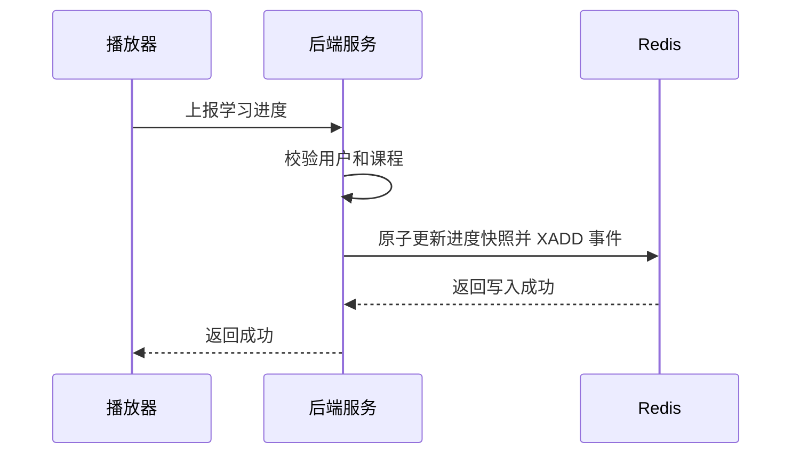
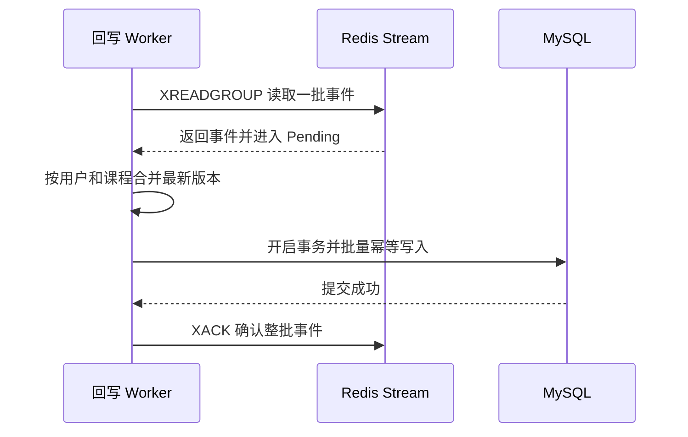
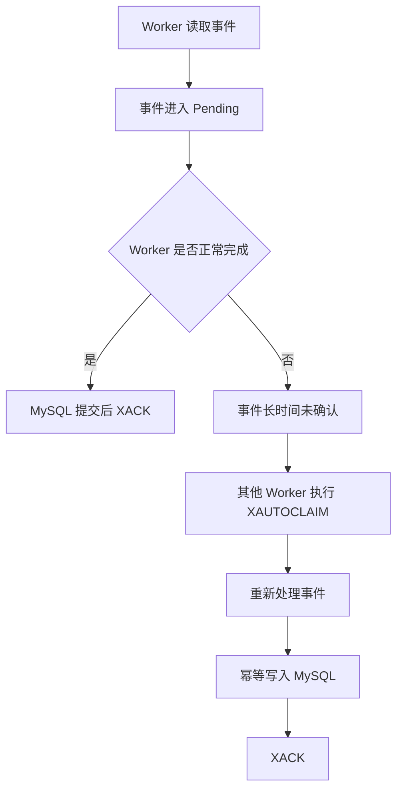
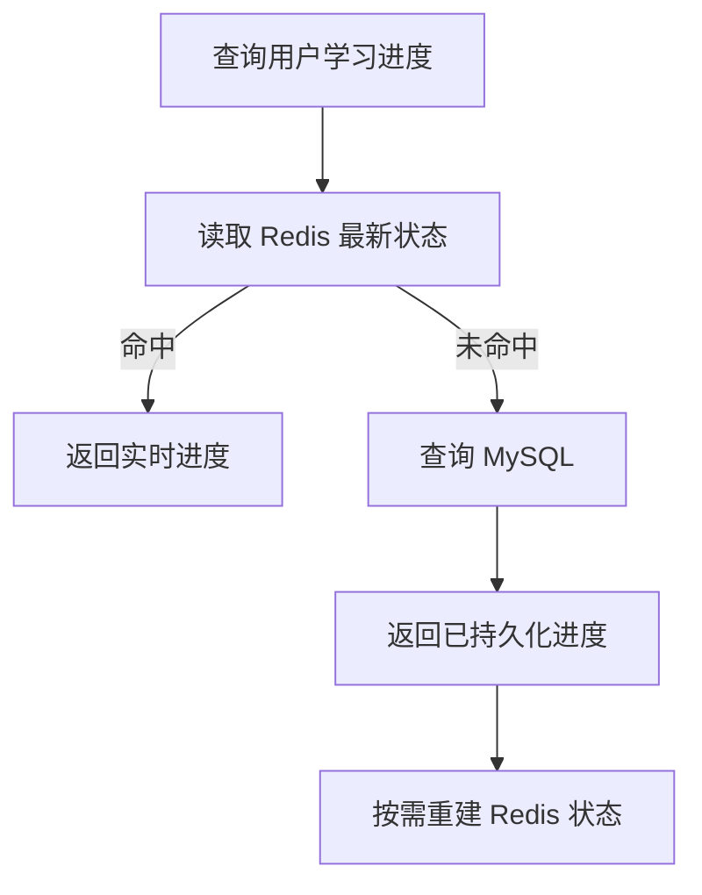

本次学习输入：

```text
知识点：Write Behind / Write Back（异步回写）
业务场景：用户学习进度异步回写
重点关注：数据可靠性、丢失风险与恢复机制
资料基准：Redis Open Source 8.8.0
```

# Redis 知识点：Write Behind / Write Back（异步回写）

## 1. 一句话结论

> Write Behind 是先把数据写入 Redis，再由后台 Worker 异步、批量地写入 MySQL，以降低前台写入延迟并合并高频更新。参考：[Redis 官方 Write-behind 架构文档](https://redis.io/docs/latest/integrate/write-behind/architecture/)
>
> 它适合允许短暂延迟落库、可以幂等重放的数据；不适合余额、订单支付、库存扣减等不能接受数据丢失或延迟持久化的核心交易。**标记：主观推断**

---

## 2. 这个知识点是什么？

Write Behind，也称 Write Back，是一种异步写入模式：

```text
用户更新学习进度
→ 先写入 Redis
→ 接口立即返回
→ 后台 Worker 消费待落库事件
→ 批量更新 MySQL
→ 落库成功后确认事件
```

它与 Write Through 最大的区别是：

```text
Write Through：
Redis 和 MySQL 同步处理完成后，接口才返回。

Write Behind：
Redis 写入成功后接口即可返回，MySQL 后续异步更新。
```

Redis Open Source 8.8.0 没有一条名为 `WRITE BEHIND` 的原生命令；普通项目需要使用 Redis Stream、后台 Worker、幂等落库和补偿机制自行实现。

Redis 官方当前也提供 Write-behind 集成能力，但文档将其作为 Redis 产品集成中的预览能力，目标源为 Redis Enterprise 数据库；其实现使用 Redis Streams 捕获变更、批量写入下游数据库，并提供至少一次投递语义。

---

## 3. 它解决什么业务问题？

用户观看课程视频时，客户端可能每隔几秒上报一次播放进度。

例如，一名用户观看 30 分钟视频，可能产生数百次更新：

```text
00:05
00:10
00:15
00:20
……
29:55
30:00
```

如果每次都直接更新 MySQL，会产生大量小事务。

| 业务问题         | 具体表现                     | Write Behind 如何解决  |
| ------------ | ------------------------ | ------------------ |
| 高频小写入        | 播放器每隔数秒上报一次进度            | 请求先快速写 Redis       |
| MySQL 更新次数过多 | 同一行短时间内反复执行 `UPDATE`     | Worker 合并更新，只落最新版本 |
| 写接口延迟受数据库影响  | MySQL 锁等待、连接池或事务延迟影响用户请求 | 前台请求不等待 MySQL      |
| 突发流量         | 大量用户同时观看课程并上报进度          | Redis 吸收短期写入峰值     |
| 批量落库效率低      | 单条事务固定成本较高               | Worker 将多条进度放进一个批次 |
| 同一进度重复上报     | 网络重试产生重复事件               | 使用事件 ID 和版本号幂等处理   |

Write Behind 的收益主要来自：

1. 将前台写入与 MySQL 解耦。
2. 合并同一用户的多次更新。
3. 将大量单条写转换成小批量事务。
4. 把短期写入峰值平滑到后台处理。

**标记：主观推断**

---

## 4. Redis 为什么适合？

| Redis 能力             | 对应业务价值                          | 证据／标记                                                                                        |
| -------------------- | ------------------------------- | -------------------------------------------------------------------------------------------- |
| String 或 Hash        | 保存用户当前最新学习进度                    | **标记：主观推断**                                                                                  |
| Redis Stream         | 保存待异步落库的进度事件                    | 参考：[Redis Streams 官方文档](https://redis.io/docs/latest/develop/data-types/streams/)            |
| `XADD`               | 向 Stream 追加进度事件                 | 参考：[Redis XADD 文档](https://redis.io/docs/latest/commands/xadd/)                              |
| `XREADGROUP`         | 多个 Worker 以消费组方式分担事件            | 参考：[Redis XREADGROUP 文档](https://redis.io/docs/latest/commands/xreadgroup/)                  |
| Pending Entries List | 记录已经投递但尚未确认的事件                  | 参考：[Redis XPENDING 文档](https://redis.io/docs/latest/commands/xpending/)                      |
| `XACK`               | MySQL 提交成功后确认事件                 | 参考：[Redis XACK 文档](https://redis.io/docs/latest/commands/xack/)                              |
| `XAUTOCLAIM`         | 接管异常 Worker 长时间未确认的事件           | 参考：[Redis XAUTOCLAIM 文档](https://redis.io/docs/latest/commands/xautoclaim/)                  |
| Redis 事务             | 将进度快照和事件追加作为一个 Redis 原子步骤执行     | 参考：[Redis 事务文档](https://redis.io/docs/latest/develop/using-commands/transactions/)           |
| AOF                  | 将 Redis 写命令追加到磁盘日志，提高进程重启后的恢复能力 | 参考：[Redis 持久化文档](https://redis.io/docs/latest/operate/oss_and_stack/management/persistence/) |
| `WAITAOF`            | 等待此前写入被本地或副本 AOF 执行 fsync       | 参考：[Redis WAITAOF 文档](https://redis.io/docs/latest/commands/waitaof/)                        |

Redis 在这里不再只是可丢失的普通缓存，而是同时承担：

```text
实时学习进度状态
+
尚未写入 MySQL 的临时写入缓冲区
+
待处理事件队列
```

因此，它对持久化、复制、内存容量和恢复能力的要求，会明显高于普通课程详情缓存。

**标记：主观推断**

---

## 5. 推荐的整体架构

### 5.1 数据职责

```text
Redis：
保存当前最新进度
保存待落库事件
承接实时读写

MySQL：
保存已经持久化的长期进度
支持历史查询、统计和离线分析

Worker：
消费 Redis Stream
合并进度
幂等写入 MySQL
成功后 ACK
```

在异步落库完成之前，Redis 中的数据比 MySQL 更新。

因此，不能简单地说“MySQL 在任何时刻都是最新事实源”。

更准确的描述是：

```text
Redis：实时状态和待持久化状态
MySQL：长期可靠存储和最终持久化结果
```

**标记：主观推断**

### 5.2 Redis Key 设计

为了支持 Redis Cluster，可以按用户 ID 分成固定数量的分区：

```text
分区计算：
partition = hash(user_id) % 64
```

示例：

```text
当前进度：
learning:progress:{p17}:state:10001:20001

待落库事件：
learning:progress:{p17}:events
```

其中 `{p17}` 是 Redis Cluster Hash Tag，使状态 Key 和 Stream Key 落在同一个 Hash Slot。

Redis Cluster 只有在相关 Key 位于同一 Slot 时，才能稳定执行涉及多个 Key 的事务或脚本；Hash Tag 可以强制相关 Key 落在同一 Slot。参考：[Redis Cluster 规范](https://redis.io/docs/latest/operate/oss_and_stack/reference/cluster-spec/)

### 5.3 进度快照

```json
{
  "user_id": 10001,
  "course_id": 20001,
  "chapter_id": 301,
  "position_ms": 186000,
  "progress_version": 128,
  "event_id": "7d2dbf7e-...",
  "updated_at": "2026-07-15T23:10:00Z"
}
```

### 5.4 Stream 事件

```text
event_id
user_id
course_id
chapter_id
position_ms
progress_version
occurred_at
```

必须同时保留：

* `event_id`：用于识别重复事件。
* `progress_version`：用于判断新旧顺序。
* `occurred_at`：用于审计和排查，但不建议单独依靠客户端时间排序。

**标记：主观推断**

---

## 6. 写入流程

### 6.1 前台写入流程



说明：

* 请求成功前，至少应保证“最新状态”和“待落库事件”同时写入 Redis。**标记：主观推断**
* 可以使用 Redis 事务、Lua 或 Function 原子执行两个 Redis 操作。Redis 事务中的命令会序列化并按顺序执行，不会在中间插入其他客户端命令。参考：[Redis 事务文档](https://redis.io/docs/latest/develop/using-commands/transactions/)
* Redis Cluster 中，参与原子操作的 Key 必须位于同一个 Hash Slot。参考：[Redis Cluster 规范](https://redis.io/docs/latest/operate/oss_and_stack/reference/cluster-spec/)
* 只更新进度快照、不写 Stream，会导致系统无法可靠判断哪些数据尚未落库。**标记：主观推断**
* 只写 Stream、不维护实时快照也可以实现落库，但读取最新进度时需要额外重放事件或等待 MySQL，实时读取会更复杂。**标记：主观推断**

### 6.2 为什么两个 Redis 操作要原子执行？

错误情况一：

```text
进度快照更新成功
Stream 事件写入失败
```

结果：

* 用户立即看到新进度。
* Worker 不知道该进度需要落库。
* Redis 故障后，这次进度可能永久丢失。

错误情况二：

```text
Stream 事件写入成功
进度快照更新失败
```

结果：

* Worker 最终能写入 MySQL。
* 用户短时间内读取不到刚更新的进度。

因此，应尽量在同一个 Redis 原子步骤中完成：

```text
SET 最新进度
XADD 待落库事件
```

**标记：主观推断**

---

## 7. Worker 异步落库流程



说明：

* `XREADGROUP` 支持消费组中的多个消费者分担消息，已读取但未确认的消息会被消费组跟踪。参考：[Redis XREADGROUP 文档](https://redis.io/docs/latest/commands/xreadgroup/)
* 只有在 MySQL 事务提交成功后才能执行 `XACK`。**标记：主观推断**
* `XACK` 会将已成功处理的消息从消费组的 Pending Entries List 中移除。参考：[Redis XACK 文档](https://redis.io/docs/latest/commands/xack/)
* MySQL 写入失败时不要 ACK，让事件保留在 Pending 中等待重试。**标记：主观推断**
* 一个批次中，同一用户、同一课程的多个事件可以只把最新有效版本写入 MySQL，但只有事务成功后才能统一确认这一批事件。**标记：主观推断**

### 7.1 批量合并示例

Worker 一次读取：

```text
用户10001，课程20001，版本101，进度10秒
用户10001，课程20001，版本102，进度15秒
用户10001，课程20001，版本103，进度20秒
```

可以合并为：

```text
用户10001，课程20001，版本103，进度20秒
```

这样三次 Redis 写入最终只产生一次 MySQL 更新。

但是不能简单使用：

```text
MAX(position_ms)
```

因为用户可能主动拖回视频重新观看，最新播放位置不一定是数值最大的播放位置。

应该按照明确的 `progress_version` 或服务端接收顺序判断最新事件。

**标记：主观推断**

---

## 8. MySQL 幂等和乱序控制

### 8.1 表结构示例

```sql
CREATE TABLE user_course_progress (
    user_id BIGINT NOT NULL,
    course_id BIGINT NOT NULL,
    chapter_id BIGINT NOT NULL,
    position_ms BIGINT NOT NULL,
    progress_version BIGINT NOT NULL,
    last_event_id VARCHAR(64) NOT NULL,
    updated_at DATETIME(3) NOT NULL,
    PRIMARY KEY (user_id, course_id)
);
```

### 8.2 幂等更新原则

```text
新事件版本 > MySQL 当前版本：
允许更新。

新事件版本 = MySQL 当前版本：
视为重复事件，不重复处理。

新事件版本 < MySQL 当前版本：
视为旧事件，拒绝覆盖。
```

可以基于唯一键执行 `INSERT ... ON DUPLICATE KEY UPDATE`，并在更新表达式中比较版本号。MySQL 8.4 支持在唯一键冲突时执行 `ON DUPLICATE KEY UPDATE`。参考：[MySQL 8.4 官方文档](https://dev.mysql.com/doc/refman/8.4/en/insert-on-duplicate.html)

### 8.3 为什么必须幂等？

存在以下故障窗口：

```text
1. Worker 成功提交 MySQL。
2. Worker 尚未执行 XACK。
3. Worker 进程崩溃。
4. 事件随后被其他 Worker 重新消费。
```

如果 MySQL 写入不幂等，同一事件会被重复处理。

Redis 官方 Write-behind 架构使用至少一次投递语义，即临时故障时会继续尝试把数据写入下游；至少一次投递意味着消费者必须能够处理重复事件。

---

## 9. 异常恢复流程

### 9.1 Worker 崩溃后的接管



说明：

* `XPENDING` 可以查看消费组中尚未确认的消息及其消费者。参考：[Redis XPENDING 文档](https://redis.io/docs/latest/commands/xpending/)
* `XAUTOCLAIM` 可以将空闲超过指定时间的 Pending 消息转移给其他消费者。参考：[Redis XAUTOCLAIM 文档](https://redis.io/docs/latest/commands/xautoclaim/)
* `min-idle-time` 必须大于正常业务处理的 P99，避免正常 Worker 仍在执行时被提前接管。**标记：主观推断**
* 被接管事件可能已经写入 MySQL，因此重试必须幂等。**标记：主观推断**

### 9.2 主要故障场景

| 故障位置              | 结果                    | 恢复方式                   |
| ----------------- | --------------------- | ---------------------- |
| 写 Redis 前失败       | Redis、MySQL 都未更新      | 请求返回失败，客户端重试           |
| Redis 只写入部分数据     | 状态和事件不一致              | 使用 Redis 事务或 Lua 避免    |
| Redis 写成功后 API 崩溃 | 客户端可能认为失败并重试          | 事件 ID 和版本号幂等           |
| Worker 读事件后崩溃     | 事件停留在 Pending         | `XAUTOCLAIM` 接管        |
| MySQL 提交前失败       | 数据未落库                 | 不执行 ACK，后续重试           |
| MySQL 提交后、ACK 前崩溃 | 同一事件被再次处理             | MySQL 幂等写入             |
| MySQL 长时间不可用      | Stream 和 Pending 持续积压 | 退避重试、限流、容量告警           |
| Redis 主节点故障       | 尚未落库的数据可能丢失           | AOF、复制、`WAITAOF` 和灾难恢复 |
| Stream 被过早裁剪      | 未落库事件内容消失             | 只清理已安全确认的事件            |
| Redis 内存满         | 新进度写入失败或 Key 被淘汰      | 容量规划、告警、合理淘汰策略         |

---

## 10. Redis 数据会不会丢？

### 10.1 AOF 并不等于零丢失

Redis 官方文档说明：

* AOF 可以配置不同的 fsync 策略。
* 默认 `everysec` 策略通常每秒执行一次 fsync。
* 极端故障下可能丢失大约一秒内的写入。

因此：

```text
客户端收到 Redis 写成功
≠
该数据一定已经落到磁盘
```

**标记：主观推断**

### 10.2 主从复制也不是绝对零丢失

Redis 默认采用异步复制，官方文档明确指出，无法保证副本已经收到某一次写入，因此始终存在数据丢失窗口。

可能出现：

```text
1. 主节点接受进度更新。
2. 更新尚未复制到副本。
3. 主节点故障。
4. 副本被提升为新主节点。
5. 刚刚写入的进度不存在。
```

### 10.3 `WAITAOF` 能做什么？

在写入 Redis 后，同一连接可以根据可靠性要求执行：

```text
WAITAOF 1 0 100
```

含义示例：

```text
等待本地 Redis 的 AOF 完成 fsync，
最多等待 100 毫秒。
```

`WAITAOF` 会返回实际完成 fsync 的本地节点和副本数量；它能够缩小“Redis 已返回成功但数据尚未落盘”的窗口，但会增加写请求延迟，而且超时返回不等于达到目标数量。参考：[Redis WAITAOF 文档](https://redis.io/docs/latest/commands/waitaof/)

### 10.4 当前场景建议

| 进度类型     | 建议                      |
| -------- | ----------------------- |
| 普通视频播放位置 | AOF everysec，允许极少量进度回退  |
| 章节完成状态   | 提高持久化要求，并保证客户端可重复上报     |
| 考试完成结果   | 不建议只使用异步回写，应优先同步落 MySQL |
| 证书发放依据   | 必须以 MySQL 持久化结果为准       |
| 付费课程购买资格 | 不属于学习进度缓存，应使用强一致事实数据    |

**标记：主观推断**

---

## 11. Stream 清理与内存安全

Stream 不能无限增长，但也不能只按固定长度激进裁剪。

错误做法：

```text
不关心 Worker 积压情况，
直接把 Stream 永远裁剪为最近 10 万条。
```

当 MySQL 故障或 Worker 积压超过 10 万条时，尚未落库的旧事件可能被删除。

Redis 8.8 的 `XTRIM` 支持 `ACKED` 选项，只删除已经被所有消费组确认的条目；这里的 `ACKED` 是 `XTRIM` 的选项，不是一条独立命令。参考：[Redis XTRIM 文档](https://redis.io/docs/latest/commands/xtrim/)

推荐原则：

```text
优先按照已确认状态清理
+
保留足够长的故障恢复窗口
+
同时监控 Stream 长度和最老未确认消息年龄
```

Redis 官方文档还说明，如果 `XAUTOCLAIM` 扫描 Pending 时发现对应 Stream 条目已经被裁剪或删除，会从 PEL 中移除该引用；因此，裁剪未确认条目会使消费者失去消息正文。

**标记：主观推断**

### 内存淘汰策略

当 Redis 达到 `maxmemory` 时，会根据配置的淘汰策略处理数据。参考：[Redis Key Eviction 文档](https://redis.io/docs/latest/develop/reference/eviction/)

对于承担待落库数据的 Redis：

* 不应把它完全当作普通可丢失缓存。
* 建议与普通缓存隔离实例或至少隔离容量。
* 更倾向使用不会静默淘汰关键待落库数据的策略。
* 达到容量上限时，让新写入明确失败，通常比静默丢弃旧事件更容易发现和恢复。

**标记：主观推断**

---

## 12. 读流程

Write Behind 模式下，MySQL 可能暂时落后于 Redis，因此用户重新进入课程时应优先读取 Redis 当前进度。



说明：

* Redis 命中时返回最新实时进度。**标记：主观推断**
* Redis 未命中时只能返回 MySQL 已持久化的进度，它可能比用户最近一次上报略旧。**标记：主观推断**
* 如果 Redis 数据因故障丢失，而对应事件尚未落库，系统无法仅靠 MySQL 恢复这段进度。**标记：主观推断**
* 客户端应允许周期性重复上报，并在重新进入时携带本地最后进度，以降低极端故障影响。**标记：主观推断**

---

## 13. 它的边界是什么？

| 边界           | 说明                        | 更合适的选择           |
| ------------ | ------------------------- | ---------------- |
| 不能天然零丢失      | Redis 持久化和异步复制都有故障窗口      | 同步写 MySQL或可靠事务消息 |
| MySQL 不是实时最新 | 数据存在异步落库延迟                | 实时读取优先 Redis     |
| 必须接受重复消费     | Worker 可能提交成功后未 ACK       | 幂等版本控制           |
| 必须处理乱序       | 多设备、重试和 Worker 并发可能改变处理顺序 | 服务端版本号           |
| 不能无限积压       | MySQL 故障会导致 Stream 持续增长   | 限流、告警、容量扩容       |
| 不适合核心资金数据    | Redis 丢失可能造成不可接受损失        | 数据库事务            |
| 不适合复杂跨表事务    | 异步事件难以维持复杂强一致约束           | MySQL 同步事务       |
| 运维复杂度高       | 需要 Worker、PEL、重试、补偿和容量治理  | 简单场景直接写 MySQL    |
| 读路径更复杂       | Redis 与 MySQL 在短期内版本不同    | 明确实时源和持久化源       |

---

## 14. 常见坑是什么？

| 常见坑                  | 线上风险               | 规避方式                    |
| -------------------- | ------------------ | ----------------------- |
| 只写 Redis Hash        | 无法知道哪些记录尚未落库       | 同时写 Stream 事件           |
| 更新 Hash 和 Stream 不原子 | 状态和待落库任务不一致        | Redis 事务、Lua 或 Function |
| MySQL 成功前就 ACK       | 数据库失败后消息永久消失       | 提交后再 ACK                |
| 不做幂等                 | Worker 重试导致重复或旧值覆盖 | 事件 ID、版本号、唯一键           |
| 用播放位置最大值判断最新         | 用户拖回播放时结果错误        | 使用事件版本顺序                |
| 只配置 RDB              | 故障时可能丢失较长时间数据      | 根据风险配置 AOF              |
| 认为副本不会丢数据            | 异步复制仍存在丢失窗口        | 明确 RPO，按需使用 `WAITAOF`   |
| Stream 固定长度过小        | 积压时未处理事件被裁剪        | 按 ACK 和恢复窗口清理           |
| Worker 无接管机制         | 消息永久停留在 Pending    | `XPENDING`、`XAUTOCLAIM` |
| MySQL 故障时疯狂重试        | 数据库恢复后再次被打垮        | 指数退避、熔断和限流              |
| Redis 与普通缓存共用容量      | 缓存淘汰影响待落库数据        | 实例或容量隔离                 |
| 没有积压监控               | 问题直到数据严重延迟才发现      | 监控 lag、PEL 和最老消息        |

---

## 15. 与其他方案对比

| 方案              | 前台延迟 | MySQL 实时性 |       数据风险 |  复杂度 | 当前场景           |
| --------------- | ---: | --------: | ---------: | ---: | -------------- |
| 直接写 MySQL       |   较高 |        实时 |          低 |    低 | 写量不高时首选        |
| Write Through   |   较高 |        实时 |          中 |    中 | 需要同步缓存时使用      |
| Write Behind    |    低 |        延迟 |         较高 |    高 | 高频、可容忍短暂延迟     |
| MQ + MySQL      |    低 |        延迟 | 取决于 MQ 可靠性 |    高 | 已有成熟消息基础设施时更合适 |
| 定时扫描 Redis Hash |    低 |        延迟 |         较高 | 表面简单 | 难判断增量、失败和确认状态  |
| 客户端批量上报         |   较低 |      接近实时 |      依赖客户端 |    中 | 可与服务端方案结合      |

### 当前场景判断

用户学习进度满足以下条件时，可以使用 Write Behind：

```text
更新频率高
允许几秒到几十秒延迟落库
单次少量进度丢失可以通过重复上报恢复
读取以 Redis 实时状态为主
系统具备可靠 Worker 和监控能力
```

写入规模不高时，优先直接写 MySQL或降低客户端上报频率，往往比建设完整 Write Behind 系统更稳妥。

**标记：主观推断**

---

## 16. 监控指标

| 指标                  | 作用                |
| ------------------- | ----------------- |
| Redis 进度写入 QPS      | 判断实时写入规模          |
| Redis 写入失败率         | 发现容量或节点故障         |
| 前台写接口 P95／P99       | 判断用户写入体验          |
| Stream 长度           | 判断整体待处理数据量        |
| 消费组 lag             | 判断 Worker 落后程度    |
| Pending 数量          | 判断已投递未确认事件规模      |
| 最老 Pending 年龄       | 判断异常消息停留时间        |
| `XAUTOCLAIM` 数量     | 判断 Worker 崩溃或超时情况 |
| Worker 批次大小         | 判断批量合并效果          |
| Worker 消费 QPS       | 判断落库处理能力          |
| MySQL 批量事务 P95／P99  | 判断数据库落库性能         |
| MySQL 写入失败率         | 判断下游数据库稳定性        |
| 版本拒绝次数              | 发现重复或乱序事件         |
| 重复事件次数              | 判断客户端重试和消费重放规模    |
| Redis AOF 状态        | 判断持久化是否正常         |
| AOF fsync 延迟        | 判断磁盘对写延迟的影响       |
| 主从复制延迟              | 判断故障时的数据丢失窗口      |
| Stream 内存占用         | 防止待落库事件耗尽内存       |
| 最老未落库事件时间           | 直接反映业务数据延迟        |
| Redis 与 MySQL 版本差异数 | 抽样检查最终一致性         |

---

## 17. 工程评审关注点

| 关注点                   | 回答方向                                                    |
| --------------------- | ------------------------------------------------------- |
| 为什么不用直接写 MySQL？       | 先确认真实写入量和性能瓶颈，只有高频小写入确实造成压力时才使用异步回写                     |
| Redis 是缓存还是事实源？       | 它是实时状态和临时写入缓冲区，MySQL 是长期持久化结果                           |
| Redis 写成功后会不会丢？       | 可能，AOF 和异步复制都有故障窗口                                      |
| 如何降低 Redis 数据丢失？      | AOF、复制、`WAITAOF`、客户端重复上报和合理 RPO                         |
| 为什么使用 Stream？         | 需要记录待处理事件、消费确认、Pending 和故障接管                            |
| 为什么不能只扫描 Hash？        | 无法准确知道哪些数据新增、哪些已落库、哪些处理失败                               |
| Worker 崩溃怎么办？         | 消息保留在 Pending，由其他 Worker 使用 `XAUTOCLAIM` 接管             |
| MySQL 成功后 ACK 前崩溃怎么办？ | 消息会重放，因此 MySQL 必须幂等                                     |
| 如何避免旧进度覆盖新进度？         | 使用服务端版本号，MySQL 只接受更高版本                                  |
| 如何处理多设备？              | 产品先定义冲突规则，再使用统一版本顺序执行                                   |
| MySQL 挂一小时怎么办？        | Stream 积压、退避重试、容量告警，必要时限制新写入                            |
| Stream 会不会无限增大？       | 按确认状态和保留窗口安全裁剪                                          |
| 是否可以用于考试成绩？           | 不建议，关键结果应同步持久化                                          |
| 为什么不用成熟 MQ？           | 已有 Kafka/RabbitMQ 等基础设施时，应客观比较可靠性、运维和容量成本               |
| Redis 8.8.0 是否原生支持？   | Redis OSS 提供 Stream、AOF、消费组等基础能力，完整 Write Behind 仍需自行实现 |

---

## 18. 最终记忆点

1. **Write Behind 是先写 Redis、后异步落 MySQL，以可靠性换吞吐和低延迟。**
2. **进度快照和待落库事件必须同时、原子地写入 Redis。**
3. **MySQL 提交成功后才能 ACK，重试必须幂等。**
4. **AOF 和主从复制只能降低风险，不能天然保证 Redis 零丢失。**
5. **关键交易数据不能因为追求性能就直接套用异步回写。**

---

## 19. 参考资料

1. [Redis 官方 Write-behind 架构文档](https://redis.io/docs/latest/integrate/write-behind/architecture/)
   用于确认 Write-behind 使用 Stream、批量事务和至少一次投递机制。

2. [Redis 官方 Write-behind 配置文档](https://redis.io/docs/latest/integrate/write-behind/configuration-guide/)
   用于确认当前官方 Write-behind 集成的产品范围和预览状态。

3. [Redis Streams 官方文档](https://redis.io/docs/latest/develop/data-types/streams/)
   用于确认 Stream 的事件流和消费组基础能力。

4. [Redis XREADGROUP 文档](https://redis.io/docs/latest/commands/xreadgroup/)
   用于确认消费组读取和消费者分工方式。

5. [Redis XACK 文档](https://redis.io/docs/latest/commands/xack/)
   用于确认消息确认和 Pending 移除行为。

6. [Redis XPENDING 文档](https://redis.io/docs/latest/commands/xpending/)
   用于确认 Pending 消息的查询方式。

7. [Redis XAUTOCLAIM 文档](https://redis.io/docs/latest/commands/xautoclaim/)
   用于确认异常消费者消息接管机制。

8. [Redis 持久化文档](https://redis.io/docs/latest/operate/oss_and_stack/management/persistence/)
   用于确认 RDB、AOF、fsync 和数据丢失窗口。

9. [Redis 复制文档](https://redis.io/docs/latest/operate/oss_and_stack/management/replication/)
   用于确认异步复制仍存在数据丢失窗口。

10. [Redis WAITAOF 文档](https://redis.io/docs/latest/commands/waitaof/)
    用于确认等待本地或副本 AOF fsync 的能力。

11. [Redis XTRIM 文档](https://redis.io/docs/latest/commands/xtrim/)
    用于确认 Stream 裁剪和 `ACKED` 选项。

12. [MySQL 8.4 INSERT ON DUPLICATE KEY UPDATE](https://dev.mysql.com/doc/refman/8.4/en/insert-on-duplicate.html)
    用于确认 MySQL 基于唯一键执行幂等插入或更新的能力。
