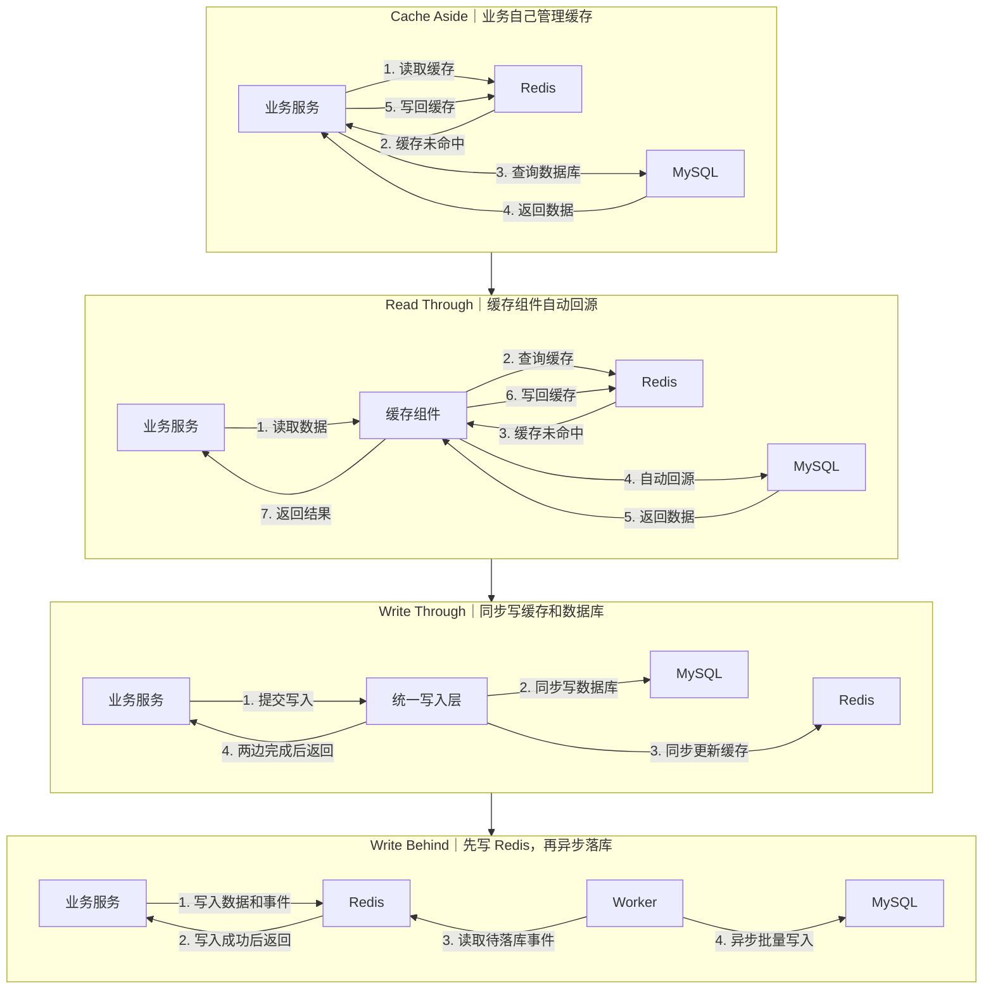
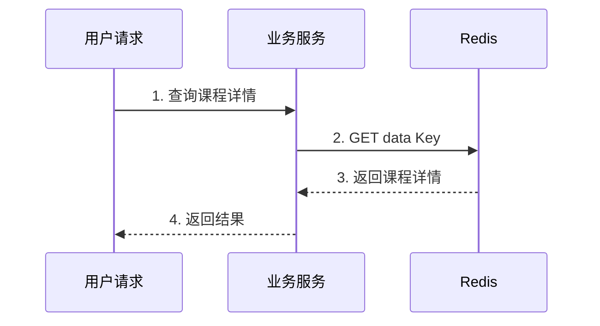
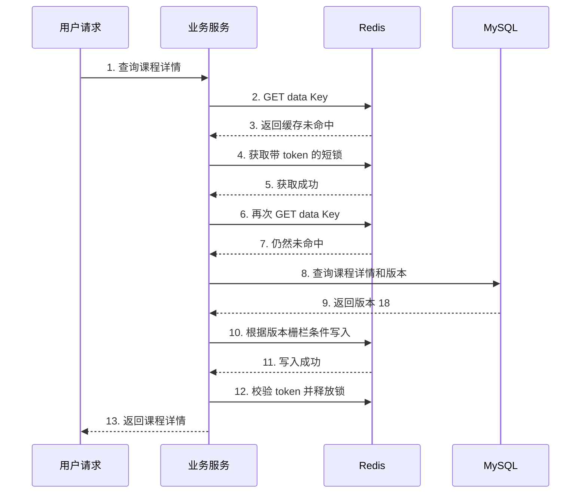
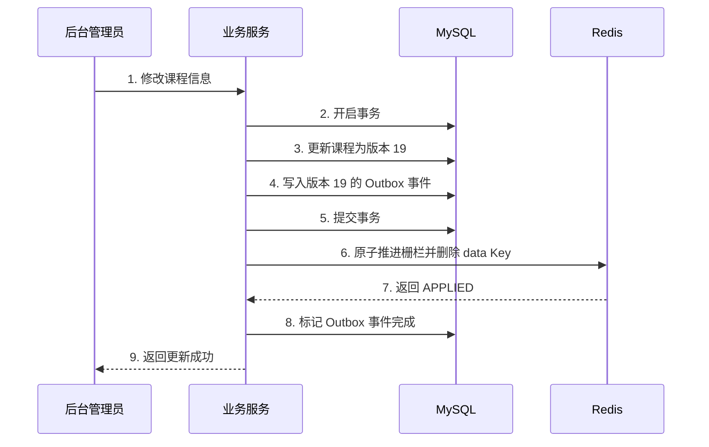
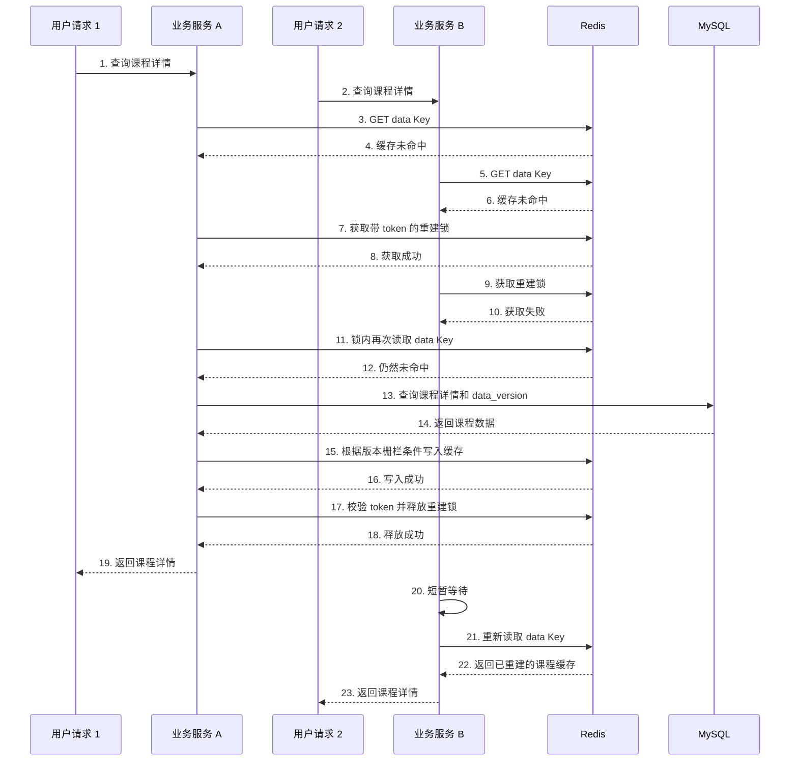
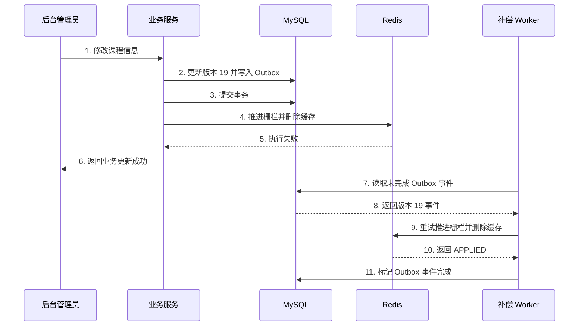
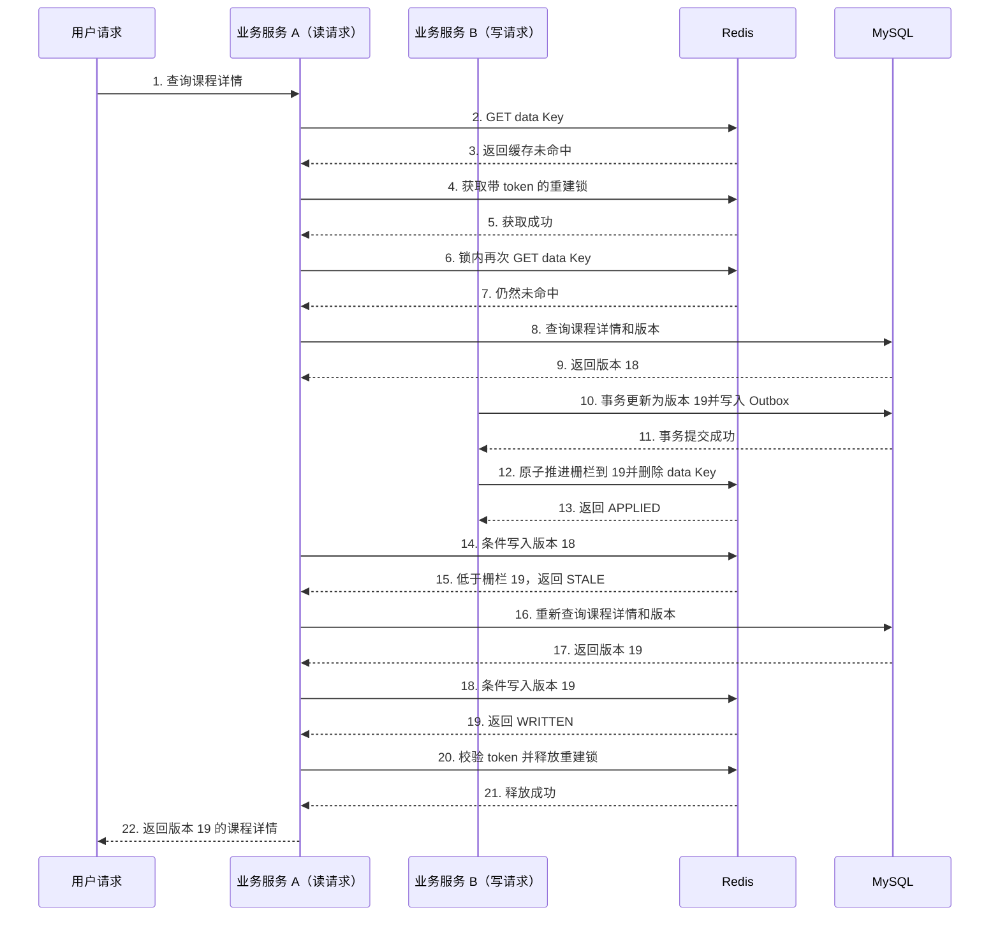
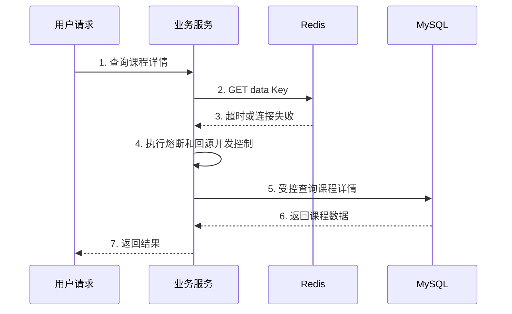

# Redis 四种缓存模式分享极简框架

## 1. 缓存模式是什么

**缓存模式是规定业务服务、Redis 与 MySQL 在数据读写时由谁负责、按什么顺序访问，以及同步还是异步更新的一套协作策略，用于在性能、数据一致性和工程复杂度之间做取舍。**


## 2. 四种缓存模式的直观印象

四种缓存模式的核心区别，是业务服务、缓存组件、Redis、MySQL 和 Worker 在数据读写过程中如何分工，以及数据库写入是同步完成还是异步完成。




> **Cache Aside 和 Read Through 主要解决“数据怎么读”，Write Through 和 Write Behind 主要解决“数据怎么写”。**


## 3. 每种模式如何运行

## 3.1 Cache Aside（旁路缓存）

### 3.1.1 一句话定义

> **Cache Aside 是由业务服务主动管理缓存的模式：读取时先查 Redis，未命中再查询 MySQL 并写回缓存；更新时先提交 MySQL，再删除对应缓存。**

Cache Aside 不是 Redis 提供的一条命令，而是业务服务组织 Redis 与 MySQL 访问顺序的一种缓存架构模式。

---

### 3.1.2 参与对象

| 参与对象      | 主要职责                        |
| --------- | --------------------------- |
| 用户请求      | 发起课程详情查询                    |
| 后台管理员     | 发起课程信息修改                    |
| 业务服务      | 主动读取缓存、回源 MySQL、写回缓存和触发缓存失效 |
| Redis     | 保存课程详情缓存、版本栅栏和缓存重建短锁        |
| MySQL     | 保存课程详情真实数据、数据版本和 Outbox 事件  |
| 补偿 Worker | 重试尚未成功执行的缓存失效事件             |

其中：

* **MySQL 是课程详情的唯一事实源。**
* **Redis 保存的是可以删除并从 MySQL 重建的缓存副本。**
* **业务服务负责协调 Redis 与 MySQL。**
* **补偿 Worker 只在启用可靠缓存失效时参与，不属于基础读取流程。**

---

### 3.1.3 业务案例

在线学习系统提供课程详情接口：

```text
GET /courses/:course_id
```

课程详情通常包含：

* 课程标题
* 课程封面
* 讲师信息
* 课程分类与标签
* 章节数量
* 课程展示状态

该场景具有以下特点：

1. 热门课程会被大量重复访问。
2. 课程详情通常读多写少。
3. 每次从 MySQL 查询时，可能需要执行多表查询和数据聚合。
4. 标题、封面等展示信息可以接受短暂最终一致。
5. 冷门课程没有必要提前写入缓存。

因此，可以在第一次访问时查询 MySQL 并生成 Redis 缓存，后续请求直接读取 Redis。

---

### 3.1.4 数据职责与使用边界

#### 数据职责

```text
MySQL：
保存课程详情真实数据和 data_version，是唯一事实源。

Redis data Key：
保存课程详情 JSON 缓存，可以被删除并重新构建。

Redis version Key：
保存课程当前已知的数据版本，阻止旧请求重新写入低版本缓存。

Redis lock Key：
限制同一课程被多个请求同时重建。
```

当 Redis 与 MySQL 不一致时：

> **最终以 MySQL 为准，Redis 中的数据应被删除或重新构建。**

#### 适合放入课程详情缓存的字段

* 课程标题
* 课程封面
* 讲师介绍
* 课程标签
* 章节数量
* 展示状态

#### 不应默认混入同一缓存的字段

* 实时价格
* 剩余名额
* 购买资格
* 支付状态
* 考试结果
* 证书发放依据

这些字段对一致性要求更高，应直接查询 MySQL，或者使用独立 Key 和更严格的更新策略。

---

### 3.1.5 Redis 设计

#### 3.1.5.1 Key 设计

同一门课程使用三个 Redis Key：

```text
课程数据：
course:detail:v1:{10001}:data

版本栅栏：
course:detail:v1:{10001}:version

缓存重建锁：
course:detail:v1:{10001}:lock
```

其中 `{10001}` 是 Redis Cluster Hash Tag，使同一课程的多个 Key 可以分配到相同 Hash Slot，便于通过 Lua 或 Redis Function 原子操作多个 Key。

| Key       | 数据类型   | 保存内容            | 过期策略             |
| --------- | ------ | --------------- | ---------------- |
| `data`    | String | 课程详情 JSON       | 短 TTL + 随机抖动     |
| `version` | String | 当前数据版本号         | 不随 data Key 一起删除 |
| `lock`    | String | 当前锁持有者的唯一 token | 很短的 TTL          |

---

#### 3.1.5.2 课程缓存 Value

```json
{
  "course_id": 10001,
  "title": "Redis 工程实践",
  "teacher_name": "张老师",
  "chapter_count": 24,
  "status": "published",
  "data_version": 19,
  "updated_at": "2026-07-18T10:00:00Z"
}
```

其中：

* `data_version` 来自 MySQL。
* 每次修改课程数据时，MySQL 中的 `data_version` 单调递增。
* Redis 中的 `data_version` 用于缓存写回时进行版本判断。

---

#### 3.1.5.3 TTL 设计

示例参数：

```text
基础 TTL：10 分钟
随机抖动：0～120 秒
```

实际 TTL 需要根据以下因素确定：

* 课程更新频率
* 业务允许旧数据存在的时间
* Redis 内存容量
* MySQL 回源能力
* 缓存重建耗时的 P95、P99

> 以上数值只是演示值，不是固定标准。

随机抖动用于减少大量缓存同时过期，但不能解决单个热点 Key 的缓存击穿问题。

---

#### 3.1.5.4 版本栅栏设计

只在课程缓存 Value 中保存 `data_version` 不够，因为删除 `data` Key 后，版本判断依据也会消失。

因此，需要独立版本栅栏：

```text
course:detail:v1:{10001}:version = 19
```

版本栅栏必须满足：

1. 不随课程数据缓存一起删除。
2. 只能单调递增，不能从 20 退回到 19。
3. 普通读请求只能读取版本栅栏，不能主动提高它。
4. 成功提交的 MySQL 更新事件负责推进版本栅栏。

#### 读请求条件写入

读请求从 MySQL 查询到课程数据后，通过 Lua 或 Redis Function 原子执行：

```text
读取 version Key

如果 MySQL 数据版本 >= version Key：
    写入 data Key
    设置 TTL
    返回 WRITTEN

否则：
    拒绝写入
    返回 STALE
```

#### 写请求缓存失效

写请求或 Outbox Worker 通过另一个原子操作执行：

```text
读取当前 version Key

如果事件版本 > 当前版本：
    更新 version Key
    删除 data Key
    返回 APPLIED

否则：
    不更新版本
    不删除 data Key
    返回 IGNORED
```

只允许更高版本推进版本栅栏，可以避免：

* 重复 Outbox 事件反复删除新缓存。
* 低版本事件覆盖高版本。
* 乱序事件误删已经重建的最新缓存。

版本栅栏原则上不设置和课程缓存相同的短 TTL。

可以选择：

* 不设置 TTL；
* 或设置远长于最长请求时间、重试时间和 Outbox 延迟的 TTL；
* 课程永久删除时再执行明确清理。

---

#### 3.1.5.5 缓存重建短锁

锁 Key：

```text
course:detail:v1:{10001}:lock
```

获取方式：

```text
SET course:detail:v1:{10001}:lock {token} NX PX 3000
```

其中：

* `token` 是每次获取锁生成的唯一值。
* `NX` 保证同一时刻只有一个请求成功获得锁。
* `PX` 防止服务崩溃后形成永久锁。

示例锁时长 3 秒并不是固定标准，实际时长需要覆盖正常缓存重建耗时，并结合重建过程的 P99 确定。

#### 完整重建流程

```text
第一次读取缓存未命中
→ 尝试获取短锁
→ 获得锁后再次读取缓存
→ 仍未命中才查询 MySQL
→ 根据版本栅栏条件写入缓存
→ 在 finally 中安全释放锁
```

获得锁后必须再次读取缓存。

原因是其他请求可能已经完成缓存重建，如果不进行二次检查，会再次执行没有必要的 MySQL 查询。

#### 安全释放

释放锁时必须原子执行：

```text
读取 lock Key

只有 lock Key 的值等于当前 token：
    删除 lock Key
```

不能直接执行普通 `DEL`，否则旧请求可能误删后来请求获得的新锁。

#### 未获得锁的请求

```text
短暂等待
→ 重新读取 data Key
→ 仍不存在则继续有限次数等待
→ 超时后限流、受控回源或快速失败
```

等待必须设置上限，不能无限阻塞。

> **缓存重建短锁只用于减少重复回源、保护 MySQL，不承担支付、库存、资格判断等业务强一致职责。**

---

#### 3.1.5.6 Outbox 可靠缓存失效

基础 Cache Aside 可以采用：

```text
提交 MySQL
→ 删除 Redis
→ 删除失败后记录告警
→ TTL 最终兜底
```

如果课程缓存失效事件不能轻易丢失，可以引入 Outbox。

MySQL 事务内同时执行：

```text
更新课程数据
递增 data_version
写入 Outbox 事件
提交事务
```

Outbox 事件至少包含：

```text
event_id
event_type
course_id
data_version
status
retry_count
next_retry_at
created_at
processed_at
```

其中最关键的是：

```text
event_id
course_id
data_version
```

事务提交后：

```text
业务服务尝试处理 Outbox 事件
→ 原子推进版本栅栏并删除 data Key
→ Redis 成功后标记 Outbox 完成
→ Redis 失败则由 Worker 重试
```

不能采用以下流程：

```text
先提交业务数据
→ Redis 删除失败
→ 再临时写入 Outbox
```

否则业务服务可能在写入 Outbox 前崩溃，造成业务数据已更新，但缓存失效事件永久丢失。

#### 幂等与乱序处理

Outbox 事件可能：

* 重复执行；
* 延迟执行；
* 乱序到达；
* Redis 成功后，MySQL 标记完成失败。

因此，Redis 失效脚本必须使用 `data_version` 判断：

```text
只有事件版本高于当前版本栅栏：
    才推进版本
    才删除缓存
```

如果事件版本等于或低于当前栅栏：

```text
直接返回 IGNORED
```

这样即使重复处理同一个事件，也不会错误删除已经重建的新缓存。

---

### 3.1.6 正常路径

#### 3.1.6.1 缓存命中

Redis 中已经存在课程详情，业务服务直接返回缓存数据。



**最终结果：**

* 请求成功。
* 不查询 MySQL。
* Redis 承接本次热点读取。
* MySQL 仍然是最终事实源。

---

#### 3.1.6.2 缓存未命中并成功重建

缓存未命中后，业务服务获得重建锁，锁内二次检查仍未命中，再查询 MySQL 并条件写入缓存。



**最终结果：**

* 本次请求成功。
* 数据来自 MySQL。
* Redis 保存版本 18 的课程缓存。
* 短锁被安全释放。
* 后续请求可以直接命中 Redis。

---

#### 3.1.6.3 更新课程并成功失效缓存

本案例采用可靠失效方案：业务数据和 Outbox 事件在同一个 MySQL 事务中提交。



**最终结果：**

* MySQL 保存版本 19。
* Redis 版本栅栏推进到 19。
* Redis 课程数据缓存被删除。
* Outbox 事件处理完成。
* 下一次读取会重新构建版本 19 的缓存。

---

### 3.1.7 核心异常路径

#### 3.1.7.1 热点课程并发缓存未命中

请求 1 和请求 2 同时查询同一门热门课程，并且都发现缓存未命中。

请求 1 成功获得重建短锁，负责查询 MySQL 和重建缓存；请求 2 获取锁失败后短暂等待，再重新读取已经完成重建的缓存。



**最终状态：**

* 请求 1 成功获得重建锁，查询 MySQL 并完成缓存重建。
* 请求 1 安全释放重建锁，并向用户返回课程详情。
* 请求 2 没有查询 MySQL，而是在短暂等待后重新读取 Redis。
* 请求 2 命中请求 1 已经重建的缓存，并向用户返回课程详情。
* 两个请求最终都成功。
* MySQL 只被查询一次。
* Redis 最终保存符合版本栅栏要求的课程缓存。
* 重建锁最终被安全释放。

---

#### 3.1.7.2 MySQL 已更新，但 Redis 失效失败

课程数据和 Outbox 事件已经提交，但第一次 Redis 失效操作失败。



**最终状态：**

* 本次业务更新成功，因为 MySQL 已经提交。
* MySQL 保存版本 19。
* Redis 在补偿完成前可能短暂保存旧数据。
* Worker 最终推进版本栅栏并删除旧缓存。
* MySQL 是最终事实源。
* 重复执行同一事件必须安全。

当前示例采用：

> **事实写入优先：MySQL 提交成功后业务更新视为成功，Redis 失败进入补偿流程。**

---

#### 3.1.7.3 并发读写导致旧数据重新写回

读请求在缓存未命中后获得重建锁，并从 MySQL 查询到课程版本 18。

在读请求尚未写回缓存时，写请求把课程更新为版本 19，并成功推进 Redis 版本栅栏、删除旧缓存。

此时，读请求尝试写回版本 18，会因为版本低于栅栏版本 19而被拒绝。读请求需要重新查询 MySQL，获得版本 19 后重新写入缓存。



**最终状态：**

* MySQL 保存课程版本 19。
* Redis 版本栅栏保存版本 19。
* 版本 18 的缓存写入被拒绝。
* 读请求重新查询并获得版本 19。
* Redis 最终保存版本 19 的课程缓存。
* 重建锁经过 token 校验后安全释放。
* 用户最终获得版本 19 的课程详情。
* 整个请求成功闭环。

**关键前提：**

写请求推进版本栅栏和删除 `data Key` 必须在 Redis 中原子完成：

```text
如果事件版本 > 当前版本栅栏：
    更新版本栅栏
    删除 data Key
    返回 APPLIED
否则：
    不修改版本栅栏
    不删除 data Key
    返回 IGNORED
```

读请求条件写入也必须原子完成：

```text
如果待写入数据版本 >= 版本栅栏：
    写入 data Key 并设置 TTL
    返回 WRITTEN
否则：
    拒绝写入
    返回 STALE
```

---

#### 3.1.7.4 Redis 不可用时受控回源

Redis 发生超时或故障后，业务服务不能让所有请求无限制进入 MySQL。



**最终状态：**

* MySQL 可用时，本次请求成功。
* Redis 不可用期间不执行缓存写回。
* MySQL 回源受到并发上限保护。
* 超过系统承载能力的请求可以限流或快速失败。
* Redis 恢复后逐步恢复正常缓存流量。

不能只写：

> Redis 不可用时直接查询 MySQL。

否则缓存故障可能直接演变成数据库雪崩。

---

### 3.1.8 通用异常处理

以下异常属于通用服务故障，不再分别绘制时序图：

| 异常                       | 请求结果          | 数据状态                    | 处理原则             |
| ------------------------ | ------------- | ----------------------- | ---------------- |
| 缓存未命中后 MySQL 查询失败        | 返回系统错误        | Redis 无缓存，MySQL 未返回可靠结果 | 不能缓存成课程不存在       |
| MySQL 查询成功但 Redis 条件写入失败 | 通常仍可返回查询结果    | MySQL 正确，Redis 可能无缓存    | 区分版本拒绝和 Redis 故障 |
| 查询结果被版本栅栏拒绝              | 重新查询或重新读取缓存   | 当前查询结果已经过期              | 不能继续缓存旧结果        |
| Redis 普通写入失败             | 通常返回 MySQL 结果 | Redis 无缓存               | 记录指标，避免无限重试      |
| 课程确实不存在                  | 返回不存在         | MySQL 无对应记录             | 可以短时间缓存明确空值      |
| MySQL 更新失败               | 返回失败          | MySQL 未提交               | 不推进版本栅栏，不删除缓存    |
| 获取重建锁失败并等待超时             | 限流、快速失败或受控回源  | 缓存仍未恢复                  | 不允许无限等待          |

只有 MySQL 明确返回“课程不存在”时，才允许写入空值缓存。

MySQL 超时、连接失败和 SQL 执行错误不能被缓存成“课程不存在”。

---

### 3.1.9 解决的问题、主要代价与使用前提

> **解决的问题：**Cache Aside 让 Redis 承接热门课程的重复读取，减少 MySQL 查询、聚合和数据组装压力。

> **主要代价：**业务服务需要主动管理缓存读取、回源、写回和失效，并处理缓存击穿、删除失败、版本竞争和短暂不一致。

> **使用前提：**数据读多写少、缓存可以从 MySQL 重建，并且业务能够接受短暂最终一致。

---

### 3.1.10 最终记忆点

1. Cache Aside 由业务服务主动管理 Redis 与 MySQL。
2. 读取时先查 Redis，未命中再查 MySQL。
3. 更新时先提交 MySQL，再让缓存失效。
4. MySQL 是事实源，Redis 是可以重建的缓存副本。
5. 热点缓存未命中时，需要限制并发回源。
6. 获得重建锁后必须再次检查缓存。
7. 短锁需要唯一 token、TTL 和安全释放。
8. 版本栅栏必须独立于课程数据缓存。
9. 版本栅栏只能单调递增。
10. 读请求只能比较版本，不能主动推进版本栅栏。
11. Outbox 必须与业务数据在同一个 MySQL 事务中提交。
12. Outbox 重试必须能处理重复事件和乱序事件。
13. TTL 只能兜底，不能代替主动失效和可靠补偿。
14. 强一致字段不能直接混入普通课程详情缓存。

> **Cache Aside 的核心不是“使用了 Redis”，而是业务服务主动控制缓存读取、数据库回源、缓存写回和更新后失效的完整过程。**


### 3.2 Read Through

业务只调用缓存组件，组件在 Redis 未命中时自动查询 MySQL 并写回缓存。

### 3.3 Write Through

业务调用统一写入层，由该层同步更新 MySQL 和 Redis，处理完成后返回。

### 3.4 Write Behind

请求先把数据和待处理事件写入 Redis，后台 Worker 再异步、批量写入 MySQL。

## 4. 各自解决什么问题

* **Cache Aside：**降低热点数据的重复查询压力。
* **Read Through：**解决缓存逻辑分散和重复实现。
* **Write Through：**解决写入后缓存不能立即更新的问题。
* **Write Behind：**解决高频写入导致的接口延迟和数据库压力。

## 5. 横向对比

从五个维度比较：

* 谁管理缓存。
* 谁负责回源 MySQL。
* 写请求是否等待数据库。
* Redis 和 MySQL 谁保存最新数据。
* 一致性风险与工程复杂度。

## 6. 场景选型

* 课程详情等读多写少数据：**Cache Aside**。
* 多个模块需要统一缓存治理：**Read Through**。
* 写入后要求缓存立即可用：**Write Through**。
* 学习进度等高频、可延迟落库数据：**Write Behind**。

## 7. 最终结论

**四种模式没有高低之分，应根据数据特点，在性能、一致性和工程复杂度之间选择满足当前需求的最简单方案。**
